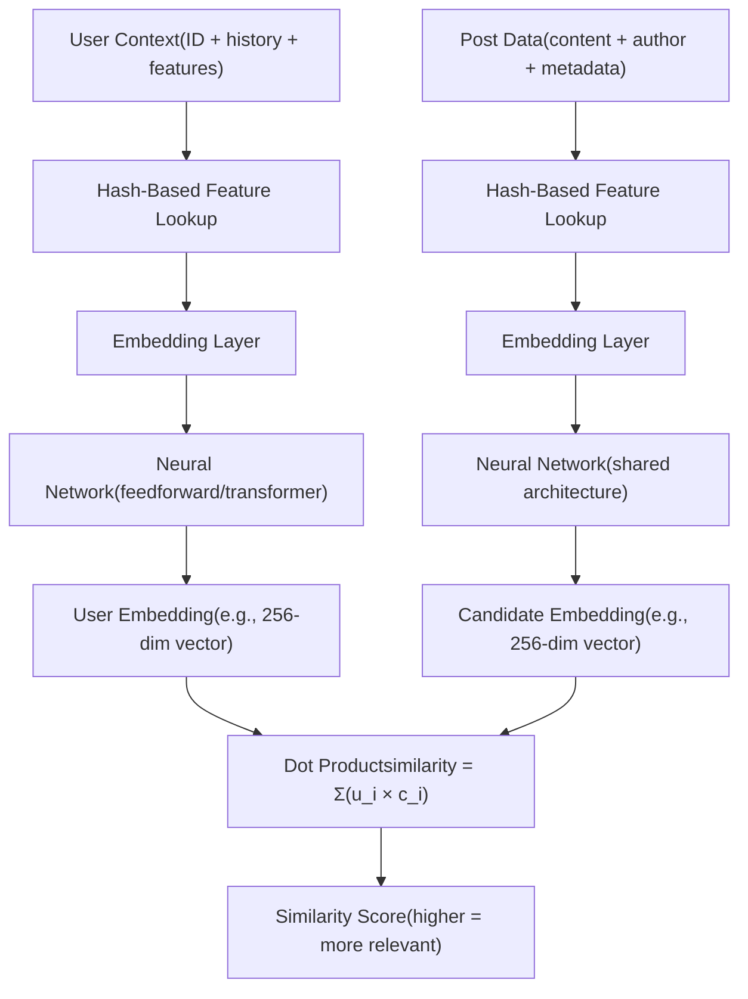
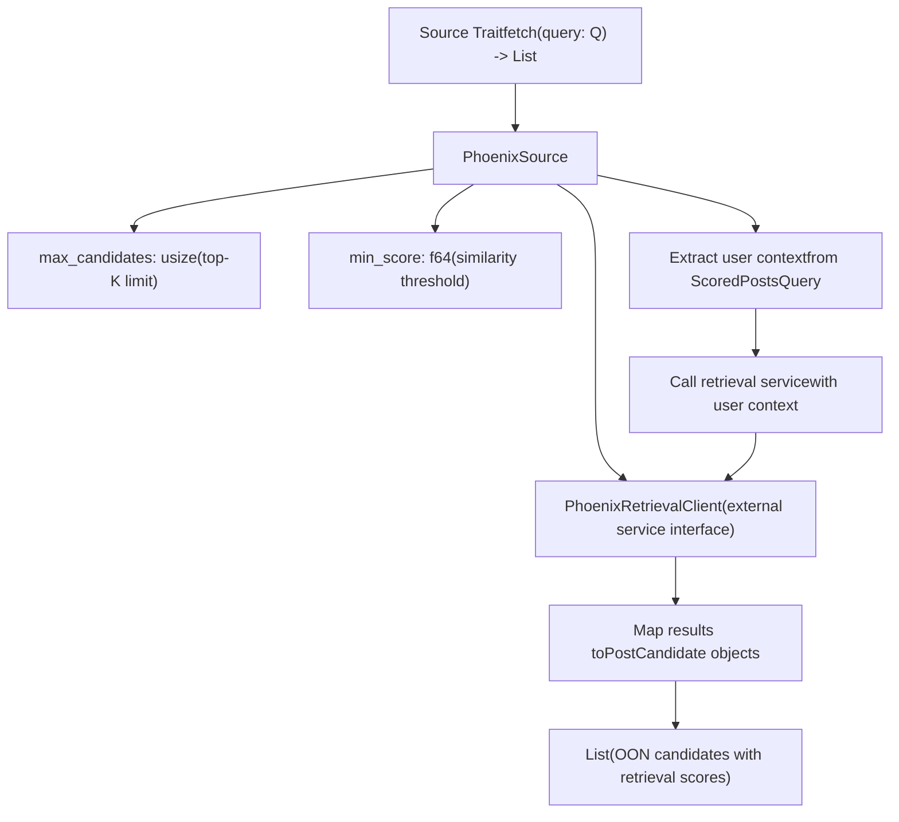
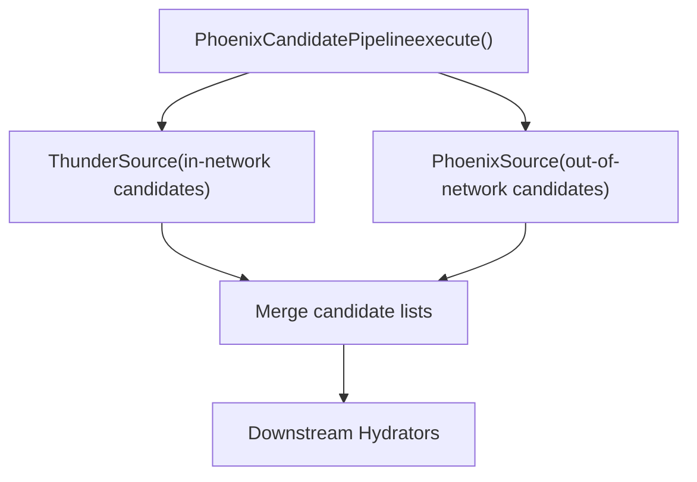

# Phoenix Retrieval Source

Relevant source files

-   [README.md](https://github.com/xai-org/x-algorithm/blob/aaa167b3/README.md?plain=1)

## Purpose and Scope

The Phoenix Retrieval Source is responsible for discovering relevant **out-of-network** (OON) content for users. It uses a two-tower neural network architecture to perform similarity-based retrieval from a global corpus of posts, finding content that users might be interested in even if they don't follow the authors.

This page documents the retrieval architecture and mechanics. For information about Phoenix's ranking model, see [Phoenix Scorer](/xai-org/x-algorithm/4.7.1-phoenix-scorer). For the in-network candidate source, see [Thunder Source](/xai-org/x-algorithm/4.3.1-thunder-source). For the overall pipeline integration, see [Phoenix Candidate Pipeline](/xai-org/x-algorithm/4.1-phoenix-candidate-pipeline).

**Sources:** [README.md1-326](https://github.com/xai-org/x-algorithm/blob/aaa167b3/README.md?plain=1#L1-L326)

---

## Two-Tower Architecture Overview

Phoenix Retrieval implements a **two-tower model** where user context and candidate posts are encoded independently into embedding vectors. These embeddings are then compared using similarity metrics to identify the most relevant candidates.

### Architecture Diagram

```mermaid
flowchart TD
    UserID["User ID"]
    EngagementHistory["Engagement History(likes, replies, reposts)"]
    UserFeatures["User Features(following list, preferences)"]
    UserEncoder["User Encoder(Neural Network)"]
    UserEmbedding["User Embedding Vector(dense representation)"]
    GlobalCorpus["Global Post Corpus"]
    CandidateEncoder["Candidate Encoder(Neural Network)"]
    CandidateEmbeddings["Candidate Embeddings(precomputed index)"]
    DotProduct["Dot Product Similarityscore = user_emb · candidate_emb"]
    TopK["Top-K Selection(highest similarity scores)"]
    PhoenixRetrievalClient["PhoenixRetrievalClient"]
    PhoenixSource["PhoenixSource(implements Source trait)"]
    OONCandidates["Out-of-NetworkPostCandidate list"]

    UserID --> UserEncoder
    EngagementHistory --> UserEncoder
    UserFeatures --> UserEncoder
    UserEncoder --> UserEmbedding
    GlobalCorpus --> CandidateEncoder
    CandidateEncoder --> CandidateEmbeddings
    UserEmbedding --> DotProduct
    CandidateEmbeddings --> DotProduct
    DotProduct --> TopK
    TopK --> PhoenixRetrievalClient
    PhoenixRetrievalClient --> PhoenixSource
    PhoenixSource --> OONCandidates
```


**Sources:** [README.md169-175](https://github.com/xai-org/x-algorithm/blob/aaa167b3/README.md?plain=1#L169-L175)

---

## Two-Tower Model Components

The two-tower architecture separates user and candidate encoding, enabling efficient precomputation and fast retrieval at serving time.

### User Tower

The User Tower encodes the requesting user's context into a dense embedding vector. It processes:

| Input Type | Description |
| --- | --- |
| **User ID** | The requesting user's unique identifier |
| **Engagement History** | Recent interactions (favorites, replies, reposts, etc.) |
| **User Features** | Following list, account metadata, preferences |

The User Tower neural network transforms these inputs into a fixed-dimensional embedding that represents the user's current interests and preferences.

### Candidate Tower

The Candidate Tower encodes individual posts from the global corpus into embedding vectors. These candidate embeddings:

-   Are **precomputed offline** for all eligible posts
-   Are stored in a **searchable index** (e.g., approximate nearest neighbor structure)
-   Represent post content, author metadata, and engagement patterns
-   Enable sub-linear search across millions of candidates

### Embedding Generation


**Key Design Feature:** Both towers use **hash-based embeddings** as mentioned in the README. Hash functions map discrete features (user IDs, post IDs, tokens) to embedding indices, enabling efficient feature representation without requiring a massive embedding table.

**Sources:** [README.md169-175](https://github.com/xai-org/x-algorithm/blob/aaa167b3/README.md?plain=1#L169-L175) [README.md310-311](https://github.com/xai-org/x-algorithm/blob/aaa167b3/README.md?plain=1#L310-L311)

---

## Similarity Search and Retrieval

Once the User Tower produces a user embedding, the system performs similarity search against the precomputed candidate embeddings.

### Retrieval Process

> **[Mermaid sequence]**
> *(图表结构无法解析)*

### Similarity Metric

The retrieval system uses **dot product similarity**:

```
similarity(user, candidate) = user_embedding · candidate_embedding
                             = Σ(user_i × candidate_i)
```
Higher scores indicate greater predicted relevance. The system retrieves the top-K candidates with the highest similarity scores.

### Top-K Selection

The number of candidates retrieved (K) is configurable and typically ranges from hundreds to thousands, depending on:

-   Available downstream processing capacity
-   Desired diversity in the candidate pool
-   Performance requirements (larger K = slower retrieval)

These candidates are then passed through the pipeline's hydration, filtering, and ranking stages alongside in-network candidates from Thunder.

**Sources:** [README.md169-175](https://github.com/xai-org/x-algorithm/blob/aaa167b3/README.md?plain=1#L169-L175)

---

## Integration with Candidate Pipeline

Phoenix Retrieval integrates into the candidate pipeline framework through the `PhoenixSource` implementation.

### Source Implementation


### Data Flow

The `PhoenixSource` receives a `ScoredPostsQuery` and:

1.  **Extracts user context** including user ID, engagement history (if available from query hydrators), and user features
2.  **Invokes PhoenixRetrievalClient** to call the remote Phoenix ML service
3.  **Receives post IDs with retrieval scores** from the similarity search
4.  **Constructs PostCandidate objects** with:
    -   `post_id` field populated
    -   `retrieval_score` field containing the similarity score
    -   `is_in_network` set to `false` (since these are OON candidates)
    -   Other fields left empty (to be populated by downstream hydrators)

### Parallel Source Execution

As shown in the high-level architecture diagrams, `PhoenixSource` executes **in parallel** with `ThunderSource`:


Both sources execute concurrently, and their results are merged before proceeding to the candidate hydration stage.

**Sources:** [README.md127-146](https://github.com/xai-org/x-algorithm/blob/aaa167b3/README.md?plain=1#L127-L146) [README.md62-68](https://github.com/xai-org/x-algorithm/blob/aaa167b3/README.md?plain=1#L62-L68)

---

## Implementation Details

### Hash-Based Embeddings

Both the User Tower and Candidate Tower utilize hash-based embeddings for feature representation. This approach:

-   **Reduces memory footprint** by avoiding large embedding tables
-   **Handles high cardinality** features (user IDs, post IDs, tokens)
-   **Uses multiple hash functions** to minimize collisions
-   **Enables feature hashing** for text and categorical variables

### Client Architecture

The `PhoenixRetrievalClient` abstracts communication with the external Phoenix ML service:

| Component | Responsibility |
| --- | --- |
| **PhoenixRetrievalClient** | Client interface for retrieval service |
| **Phoenix ML Service** | Remote service hosting the two-tower model |
| **Request Format** | User context (ID, features, history) |
| **Response Format** | List of (post\_id, similarity\_score) tuples |

The client handles:

-   Request serialization
-   Network communication (likely gRPC or HTTP)
-   Response deserialization
-   Error handling and timeouts
-   Retry logic for transient failures

### Candidate Eligibility

Not all posts in the global corpus are eligible for retrieval. The Candidate Tower typically only indexes posts that:

-   Are recent (within a configured time window)
-   Pass basic quality thresholds
-   Are not from accounts with visibility restrictions
-   Have sufficient engagement signals for embedding quality

The exact eligibility criteria are determined by the offline indexing pipeline that populates the candidate embedding store.

**Sources:** [README.md310-311](https://github.com/xai-org/x-algorithm/blob/aaa167b3/README.md?plain=1#L310-L311)

---

## Integration with Phoenix Ranking

While the Phoenix Retrieval Source provides initial candidate discovery, the **Phoenix Scorer** (see [Phoenix Scorer](/xai-org/x-algorithm/4.7.1-phoenix-scorer)) performs the final ranking using a different model architecture.

| Stage | Model | Purpose |
| --- | --- | --- |
| **Retrieval** | Two-Tower Model | Fast similarity search across millions of candidates |
| **Ranking** | Grok Transformer | Precise engagement predictions for final ranking |

The retrieval model prioritizes **speed and recall** (finding all potentially relevant candidates), while the ranking model prioritizes **precision** (accurately predicting engagement for final ordering).

This two-stage approach is standard in modern recommendation systems, balancing the need to search large corpuses efficiently with the need for accurate final rankings.

**Sources:** [README.md164-182](https://github.com/xai-org/x-algorithm/blob/aaa167b3/README.md?plain=1#L164-L182) [README.md177-181](https://github.com/xai-org/x-algorithm/blob/aaa167b3/README.md?plain=1#L177-L181)

---

## Service Configuration

The `PhoenixSource` is configured with parameters that control retrieval behavior:

| Parameter | Description | Typical Value |
| --- | --- | --- |
| **max\_candidates** | Maximum number of OON candidates to retrieve | 500-2000 |
| **min\_score** | Minimum similarity score threshold | 0.1-0.5 |
| **timeout** | Maximum time to wait for retrieval service | 50-200ms |
| **enable\_fallback** | Whether to continue on retrieval failure | true |

These parameters are typically set in the pipeline configuration and can be tuned based on:

-   Downstream processing capacity
-   Latency requirements
-   Desired balance between in-network and out-of-network content
-   Service reliability considerations

When retrieval fails or times out, the pipeline can continue with only in-network candidates from Thunder, ensuring the feed remains functional even during Phoenix service degradation.

**Sources:** [README.md127-146](https://github.com/xai-org/x-algorithm/blob/aaa167b3/README.md?plain=1#L127-L146)
