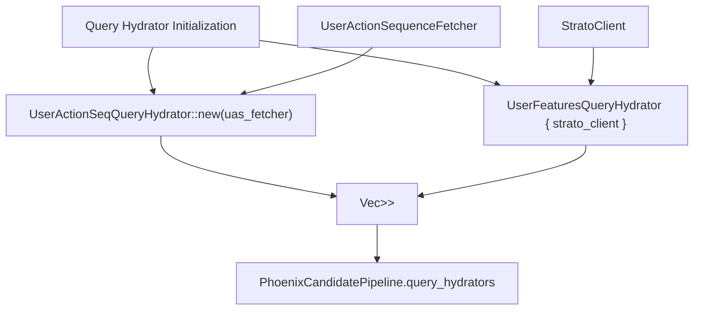
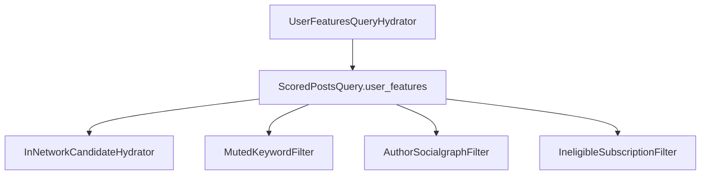
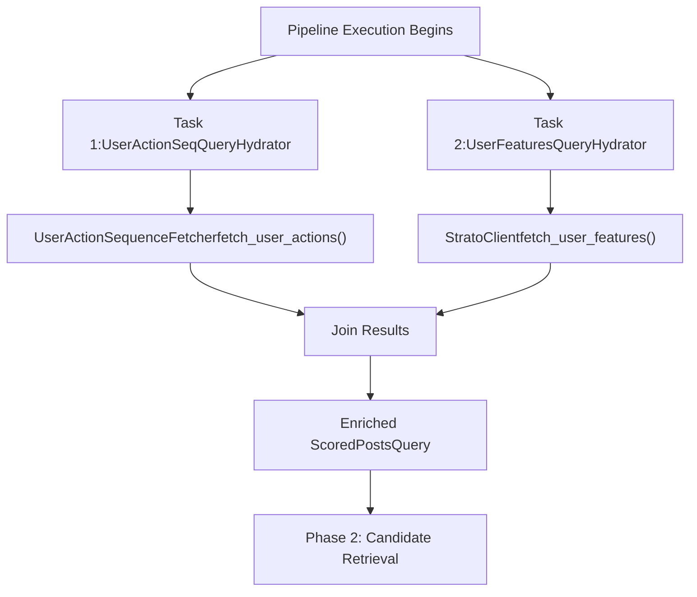
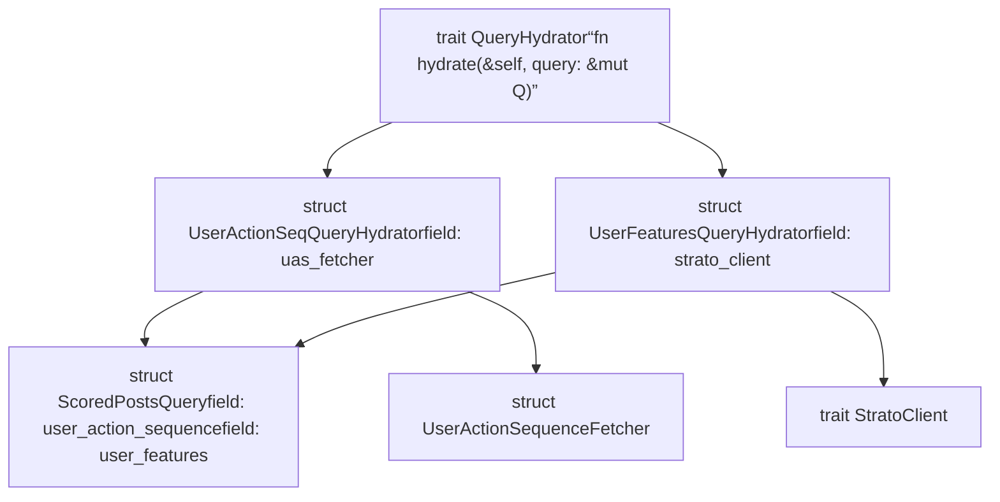

# Query Hydrators

Relevant source files

-   [home-mixer/candidate\_pipeline/phoenix\_candidate\_pipeline.rs](https://github.com/xai-org/x-algorithm/blob/aaa167b3/home-mixer/candidate_pipeline/phoenix_candidate_pipeline.rs)
-   [home-mixer/candidate\_pipeline/query\_features.rs](https://github.com/xai-org/x-algorithm/blob/aaa167b3/home-mixer/candidate_pipeline/query_features.rs)

## Purpose and Scope

This document describes the query hydrator implementations in the Phoenix Candidate Pipeline that enrich `ScoredPostsQuery` objects with user context and behavioral data before candidate retrieval. Query hydrators execute in parallel during the first phase of pipeline execution, adding user action sequences and user features to enable downstream personalization and filtering.

For information about the generic `QueryHydrator` trait and its execution model, see [QueryHydrator Trait](/xai-org/x-algorithm/3.2-queryhydrator-trait). For details about the `ScoredPostsQuery` structure being hydrated, see [ScoredPostsQuery](/xai-org/x-algorithm/4.2.1-scoredpostsquery).

---

## Overview

The Phoenix Candidate Pipeline registers two query hydrators that enrich the incoming query with user-specific data from external services:

1.  **UserActionSeqQueryHydrator**: Fetches the user's recent engagement history (favorites, replies, retweets) from the User Action Sequence service
2.  **UserFeaturesQueryHydrator**: Fetches user social graph data and preferences from Strato, including muted keywords, blocked users, and followed accounts

These hydrators execute in parallel immediately after the pipeline receives a request, ensuring that all subsequent stages (sources, candidate hydrators, filters, scorers) have access to enriched query context.

### Query Hydrator Registration

**Sources:** [home-mixer/candidate\_pipeline/phoenix\_candidate\_pipeline.rs84-89](https://github.com/xai-org/x-algorithm/blob/aaa167b3/home-mixer/candidate_pipeline/phoenix_candidate_pipeline.rs#L84-L89)

---

## UserActionSeqQueryHydrator

### Purpose

`UserActionSeqQueryHydrator` enriches the query with the user's recent engagement history, which provides critical behavioral context for personalization. The hydrator fetches a sequence of recent user actions (favorites, replies, retweets, etc.) from the User Action Sequence service.

### Implementation Details

| Aspect | Details |
| --- | --- |
| **Struct** | `UserActionSeqQueryHydrator` |
| **Trait Implementation** | `QueryHydrator<ScoredPostsQuery>` |
| **External Service** | User Action Sequence service via `UserActionSequenceFetcher` |
| **Initialization** | `UserActionSeqQueryHydrator::new(uas_fetcher)` |
| **Dependency Injection** | Receives `Arc<UserActionSequenceFetcher>` |

### Data Flow

### Enriched Fields

The hydrator populates the query with:

-   **User Action Sequence**: A chronologically ordered list of recent user engagements
-   **Action Types**: Favorites, replies, retweets, profile views, follows
-   **Timestamps**: When each action occurred
-   **Target IDs**: Tweet IDs or user IDs that were engaged with

This data enables:

-   **Phoenix Retrieval**: Uses action history to find similar content via collaborative filtering
-   **Phoenix Ranker**: Incorporates engagement patterns as features for the Grok transformer
-   **Filters**: Excludes previously engaged content to avoid repetition

**Sources:** [home-mixer/candidate\_pipeline/phoenix\_candidate\_pipeline.rs35](https://github.com/xai-org/x-algorithm/blob/aaa167b3/home-mixer/candidate_pipeline/phoenix_candidate_pipeline.rs#L35-L35) [home-mixer/candidate\_pipeline/phoenix\_candidate\_pipeline.rs85](https://github.com/xai-org/x-algorithm/blob/aaa167b3/home-mixer/candidate_pipeline/phoenix_candidate_pipeline.rs#L85-L85)

---

## UserFeaturesQueryHydrator

### Purpose

`UserFeaturesQueryHydrator` enriches the query with the user's social graph and preference data from Strato. This data is essential for filtering and personalization throughout the pipeline.

### Implementation Details

| Aspect | Details |
| --- | --- |
| **Struct** | `UserFeaturesQueryHydrator` |
| **Trait Implementation** | `QueryHydrator<ScoredPostsQuery>` |
| **External Service** | Strato caching layer |
| **Field** | `strato_client: Arc<dyn StratoClient + Send + Sync>` |
| **Initialization** | Struct literal with injected `strato_client` |

### Data Flow

> **[Mermaid sequence]**
> *(图表结构无法解析)*

### UserFeatures Structure

The hydrator populates a `UserFeatures` struct with the following fields:

| Field | Type | Purpose |
| --- | --- | --- |
| `muted_keywords` | `Vec<String>` | Keywords the user has muted; used by `MutedKeywordFilter` |
| `blocked_user_ids` | `Vec<i64>` | User IDs the viewer has blocked; used by `AuthorSocialgraphFilter` |
| `muted_user_ids` | `Vec<i64>` | User IDs the viewer has muted; used by `AuthorSocialgraphFilter` |
| `followed_user_ids` | `Vec<i64>` | User IDs the viewer follows; used for in-network detection |
| `subscribed_user_ids` | `Vec<i64>` | User IDs the viewer subscribes to; used for premium content handling |

### Integration with Pipeline Stages

**Sources:** [home-mixer/candidate\_pipeline/phoenix\_candidate\_pipeline.rs36](https://github.com/xai-org/x-algorithm/blob/aaa167b3/home-mixer/candidate_pipeline/phoenix_candidate_pipeline.rs#L36-L36) [home-mixer/candidate\_pipeline/phoenix\_candidate\_pipeline.rs86-88](https://github.com/xai-org/x-algorithm/blob/aaa167b3/home-mixer/candidate_pipeline/phoenix_candidate_pipeline.rs#L86-L88) [home-mixer/candidate\_pipeline/query\_features.rs1-11](https://github.com/xai-org/x-algorithm/blob/aaa167b3/home-mixer/candidate_pipeline/query_features.rs#L1-L11)

---

## Execution Model

### Parallel Hydration

Both query hydrators execute in parallel according to the `QueryHydrator` trait's execution contract. The pipeline framework orchestrates parallel execution using asynchronous tasks, allowing both external service calls to proceed concurrently.

### Performance Characteristics

| Characteristic | Details |
| --- | --- |
| **Execution Mode** | Parallel (concurrent external service calls) |
| **Blocking Behavior** | Pipeline blocks until all query hydrators complete |
| **Failure Handling** | Individual hydrator failures propagate as errors |
| **Typical Latency** | ~10-50ms combined (depends on service response times) |
| **Caching** | Strato provides caching for `UserFeatures` data |

### Code Entity Mapping

**Sources:** [home-mixer/candidate\_pipeline/phoenix\_candidate\_pipeline.rs84-89](https://github.com/xai-org/x-algorithm/blob/aaa167b3/home-mixer/candidate_pipeline/phoenix_candidate_pipeline.rs#L84-L89)

---

## Summary

The Phoenix Candidate Pipeline employs two specialized query hydrators that execute in parallel to enrich incoming requests with user context:

-   **UserActionSeqQueryHydrator** fetches engagement history from the User Action Sequence service, enabling behavioral personalization
-   **UserFeaturesQueryHydrator** fetches social graph data from Strato, enabling content filtering based on user preferences

These hydrators ensure that all downstream pipeline stages have access to comprehensive user context, enabling personalized candidate retrieval, accurate filtering of unwanted content, and relevance-based scoring. Their parallel execution minimizes the latency impact of external service calls during the critical query enrichment phase.

**Sources:** [home-mixer/candidate\_pipeline/phoenix\_candidate\_pipeline.rs35-36](https://github.com/xai-org/x-algorithm/blob/aaa167b3/home-mixer/candidate_pipeline/phoenix_candidate_pipeline.rs#L35-L36) [home-mixer/candidate\_pipeline/phoenix\_candidate\_pipeline.rs84-89](https://github.com/xai-org/x-algorithm/blob/aaa167b3/home-mixer/candidate_pipeline/phoenix_candidate_pipeline.rs#L84-L89) [home-mixer/candidate\_pipeline/query\_features.rs1-11](https://github.com/xai-org/x-algorithm/blob/aaa167b3/home-mixer/candidate_pipeline/query_features.rs#L1-L11)
