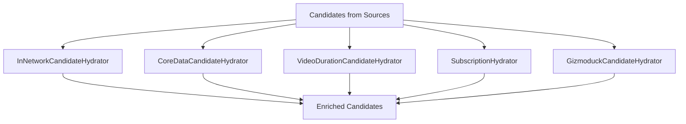
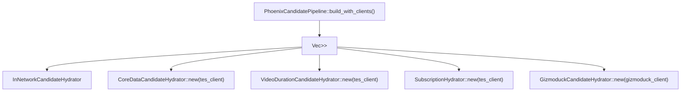
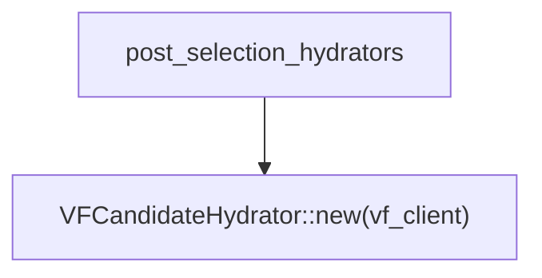
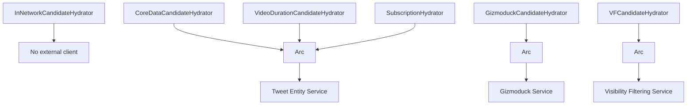
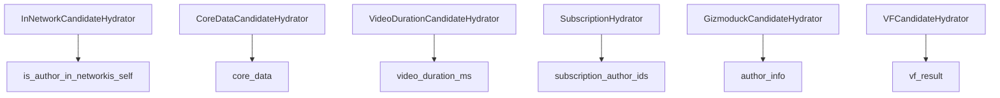

# Candidate Hydrators

Relevant source files

-   [home-mixer/candidate\_hydrators/mod.rs](https://github.com/xai-org/x-algorithm/blob/aaa167b3/home-mixer/candidate_hydrators/mod.rs)
-   [home-mixer/candidate\_pipeline/phoenix\_candidate\_pipeline.rs](https://github.com/xai-org/x-algorithm/blob/aaa167b3/home-mixer/candidate_pipeline/phoenix_candidate_pipeline.rs)

## Purpose and Scope

This document provides an overview of the candidate hydrator implementations in the Home Mixer that enrich `PostCandidate` objects with additional data from external services. Hydrators execute in parallel after candidates are retrieved from sources and before filtering and scoring occurs.

For information about the generic `Hydrator` trait and its execution model, see [Hydrator Trait](/xai-org/x-algorithm/3.4-hydrator-trait). For information about query hydrators that enrich the query object rather than candidates, see [Query Hydrators](/xai-org/x-algorithm/4.4-query-hydrators). For detailed documentation of each specific hydrator implementation, see sections [4.5.1](/xai-org/x-algorithm/4.5.1-coredatacandidatehydrator) through [4.5.6](/xai-org/x-algorithm/4.5.6-videodurationcandidatehydrator).

## Overview

Candidate hydrators enrich `PostCandidate` objects with metadata, user information, visibility filtering results, and other features required for downstream filtering and scoring. Each hydrator is responsible for fetching and populating specific fields on the candidate object by calling external services.

The pipeline executes all candidate hydrators in parallel to minimize latency. Hydrators batch requests where possible to reduce the number of remote calls. Some hydrators (such as `VFCandidateHydrator`) are also used in the post-selection phase to perform final enrichment after top-K selection.

**Hydrator Execution Pattern:**

Sources: [home-mixer/candidate\_pipeline/phoenix\_candidate\_pipeline.rs99-106](https://github.com/xai-org/x-algorithm/blob/aaa167b3/home-mixer/candidate_pipeline/phoenix_candidate_pipeline.rs#L99-L106)

## Hydrator Implementations

The Home Mixer implements six candidate hydrators, organized in the `candidate_hydrators` module:

| Hydrator | Fields Populated | External Service | Batching |
| --- | --- | --- | --- |
| `InNetworkCandidateHydrator` | `is_author_in_network`, `is_self` | None (uses query data) | N/A |
| `CoreDataCandidateHydrator` | `core_data` (tweet text, author ID, reply/retweet info) | TES | Yes |
| `VideoDurationCandidateHydrator` | `video_duration_ms` | TES | Yes |
| `SubscriptionHydrator` | `subscription_author_ids` | TES | Yes |
| `GizmoduckCandidateHydrator` | `author_info` (screen name, follower counts) | Gizmoduck | Yes |
| `VFCandidateHydrator` | `vf_result` (visibility filtering reason) | Visibility Filtering | Yes |

### Hydrator Module Structure

```mermaid
flowchart TD
    Mod["candidate_hydrators/mod.rs"]
    CoreData["core_data_candidate_hydrator.rsCoreDataCandidateHydrator"]
    Gizmoduck["gizmoduck_hydrator.rsGizmoduckCandidateHydrator"]
    InNetwork["in_network_candidate_hydrator.rsInNetworkCandidateHydrator"]
    Subscription["subscription_hydrator.rsSubscriptionHydrator"]
    VF["vf_candidate_hydrator.rsVFCandidateHydrator"]
    Video["video_duration_candidate_hydrator.rsVideoDurationCandidateHydrator"]

    Mod --> CoreData
    Mod --> Gizmoduck
    Mod --> InNetwork
    Mod --> Subscription
    Mod --> VF
    Mod --> Video
```

Sources: [home-mixer/candidate\_hydrators/mod.rs1-7](https://github.com/xai-org/x-algorithm/blob/aaa167b3/home-mixer/candidate_hydrators/mod.rs#L1-L7)

### Brief Descriptions

**`InNetworkCandidateHydrator`**: Determines whether the candidate's author is the viewing user or is followed by the viewing user. Does not call external services; uses data from the query's `followed_user_ids` field. See [InNetworkCandidateHydrator](/xai-org/x-algorithm/4.5.3-innetworkcandidatehydrator).

**`CoreDataCandidateHydrator`**: Fetches core tweet metadata from TES including tweet text, author ID, creation timestamp, reply information (in\_reply\_to\_tweet\_id, in\_reply\_to\_user\_id), and retweet information (retweeted\_tweet\_id). This is one of the most critical hydrators as many filters depend on core data. See [CoreDataCandidateHydrator](/xai-org/x-algorithm/4.5.1-coredatacandidatehydrator).

**`VideoDurationCandidateHydrator`**: Extracts video duration in milliseconds from TES media entities when the tweet contains video content. Used for ranking features and filtering. See [VideoDurationCandidateHydrator](/xai-org/x-algorithm/4.5.6-videodurationcandidatehydrator).

**`SubscriptionHydrator`**: Fetches the list of subscription author IDs from TES for premium content identification. Used by `IneligibleSubscriptionFilter` to filter out subscription content for non-subscribers. See [SubscriptionHydrator](/xai-org/x-algorithm/4.5.4-subscriptionhydrator).

**`GizmoduckCandidateHydrator`**: Fetches user profile information from Gizmoduck service including screen names and follower counts for candidate authors. Batches requests efficiently. See [GizmoduckHydrator](/xai-org/x-algorithm/4.5.2-gizmoduckhydrator).

**`VFCandidateHydrator`**: Calls the Visibility Filtering service to determine if candidates should be filtered for safety reasons. Uses different safety levels for in-network (`TimelineHome`) versus out-of-network (`TimelineHomeRecommendations`) content. Also used in the post-selection phase. See [VFCandidateHydrator](/xai-org/x-algorithm/4.5.5-vfcandidatehydrator).

Sources: [home-mixer/candidate\_pipeline/phoenix\_candidate\_pipeline.rs99-106](https://github.com/xai-org/x-algorithm/blob/aaa167b3/home-mixer/candidate_pipeline/phoenix_candidate_pipeline.rs#L99-L106) [home-mixer/candidate\_pipeline/phoenix\_candidate\_pipeline.rs138-139](https://github.com/xai-org/x-algorithm/blob/aaa167b3/home-mixer/candidate_pipeline/phoenix_candidate_pipeline.rs#L138-L139)

## Pipeline Integration

Hydrators are registered with the `PhoenixCandidatePipeline` during initialization in the `build_with_clients` method. The pipeline maintains two separate lists:

1.  **Main hydrators**: Execute after source retrieval and before filtering/scoring
2.  **Post-selection hydrators**: Execute after top-K selection

### Main Hydrator Registration

Sources: [home-mixer/candidate\_pipeline/phoenix\_candidate\_pipeline.rs99-106](https://github.com/xai-org/x-algorithm/blob/aaa167b3/home-mixer/candidate_pipeline/phoenix_candidate_pipeline.rs#L99-L106)

### Post-Selection Hydrator Registration

The `VFCandidateHydrator` is registered separately as a post-selection hydrator. This allows visibility filtering to occur after the expensive ML scoring phase, reducing the number of candidates that need to be checked for safety violations.

Sources: [home-mixer/candidate\_pipeline/phoenix\_candidate\_pipeline.rs138-139](https://github.com/xai-org/x-algorithm/blob/aaa167b3/home-mixer/candidate_pipeline/phoenix_candidate_pipeline.rs#L138-L139)

## Execution Model

The candidate pipeline framework executes all hydrators in the main hydrators list in parallel using `futures::future::join_all`. This parallel execution pattern is critical for minimizing total latency when multiple external service calls are required.

**Parallel Hydration Sequence:**

> **[Mermaid sequence]**
> *(图表结构无法解析)*

For detailed information about the parallel execution mechanism, see [Hydrator Trait](/xai-org/x-algorithm/3.4-hydrator-trait).

Sources: [home-mixer/candidate\_pipeline/phoenix\_candidate\_pipeline.rs224-226](https://github.com/xai-org/x-algorithm/blob/aaa167b3/home-mixer/candidate_pipeline/phoenix_candidate_pipeline.rs#L224-L226)

## Dependency Requirements

Each hydrator requires specific external service clients to be provided during initialization. The `PhoenixCandidatePipeline` creates production clients and injects them into hydrators.

**Hydrator Dependencies:**

Sources: [home-mixer/candidate\_pipeline/phoenix\_candidate\_pipeline.rs73-82](https://github.com/xai-org/x-algorithm/blob/aaa167b3/home-mixer/candidate_pipeline/phoenix_candidate_pipeline.rs#L73-L82) [home-mixer/candidate\_pipeline/phoenix\_candidate\_pipeline.rs99-106](https://github.com/xai-org/x-algorithm/blob/aaa167b3/home-mixer/candidate_pipeline/phoenix_candidate_pipeline.rs#L99-L106) [home-mixer/candidate\_pipeline/phoenix\_candidate\_pipeline.rs138-139](https://github.com/xai-org/x-algorithm/blob/aaa167b3/home-mixer/candidate_pipeline/phoenix_candidate_pipeline.rs#L138-L139)

### Client Initialization in Production

The `PhoenixCandidatePipeline::prod()` method creates production client instances and passes them to `build_with_clients`:

| Client Variable | Production Implementation | Used By Hydrators |
| --- | --- | --- |
| `tes_client` | `Arc<ProdTESClient>` | `CoreDataCandidateHydrator`, `VideoDurationCandidateHydrator`, `SubscriptionHydrator` |
| `gizmoduck_client` | `Arc<ProdGizmoduckClient>` | `GizmoduckCandidateHydrator` |
| `vf_client` | `Arc<ProdVisibilityFilteringClient>` | `VFCandidateHydrator` |

Sources: [home-mixer/candidate\_pipeline/phoenix\_candidate\_pipeline.rs162-212](https://github.com/xai-org/x-algorithm/blob/aaa167b3/home-mixer/candidate_pipeline/phoenix_candidate_pipeline.rs#L162-L212)

## Field Ownership and Updates

Each hydrator owns specific fields on the `PostCandidate` struct. Hydrators update candidates in-place by mutating the candidates vector. The parallel execution model is safe because each hydrator writes to different fields.

**Field Ownership by Hydrator:**

For detailed information about the `PostCandidate` data structure, see [PostCandidate](/xai-org/x-algorithm/4.2.2-postcandidate).

Sources: [home-mixer/candidate\_pipeline/phoenix\_candidate\_pipeline.rs1-6](https://github.com/xai-org/x-algorithm/blob/aaa167b3/home-mixer/candidate_pipeline/phoenix_candidate_pipeline.rs#L1-L6)

## Summary

The candidate hydrator system in the Home Mixer provides a modular, parallel mechanism for enriching candidates with data from multiple external services. The six hydrators each have clearly defined responsibilities and field ownership, enabling efficient parallel execution without data races. The two-phase hydration model (pre-scoring and post-selection) optimizes the trade-off between data completeness and latency by deferring expensive operations like visibility filtering until after top-K selection.

For implementation details of each hydrator, see the child pages [4.5.1](/xai-org/x-algorithm/4.5.1-coredatacandidatehydrator) through [4.5.6](/xai-org/x-algorithm/4.5.6-videodurationcandidatehydrator).

Sources: [home-mixer/candidate\_hydrators/mod.rs1-7](https://github.com/xai-org/x-algorithm/blob/aaa167b3/home-mixer/candidate_hydrators/mod.rs#L1-L7) [home-mixer/candidate\_pipeline/phoenix\_candidate\_pipeline.rs1-256](https://github.com/xai-org/x-algorithm/blob/aaa167b3/home-mixer/candidate_pipeline/phoenix_candidate_pipeline.rs#L1-L256)
