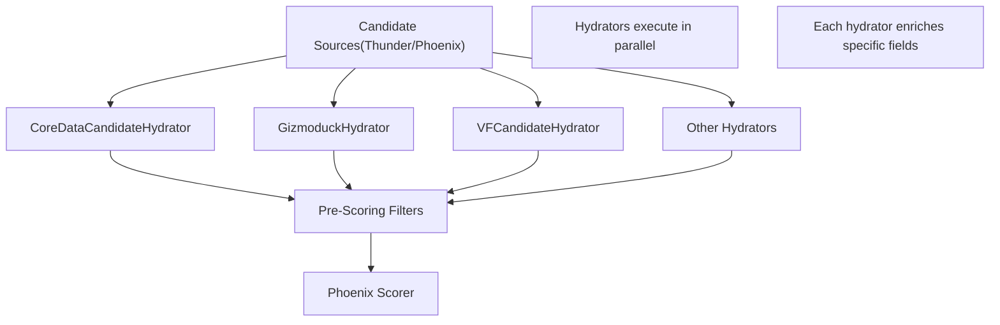
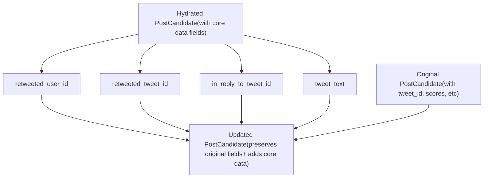
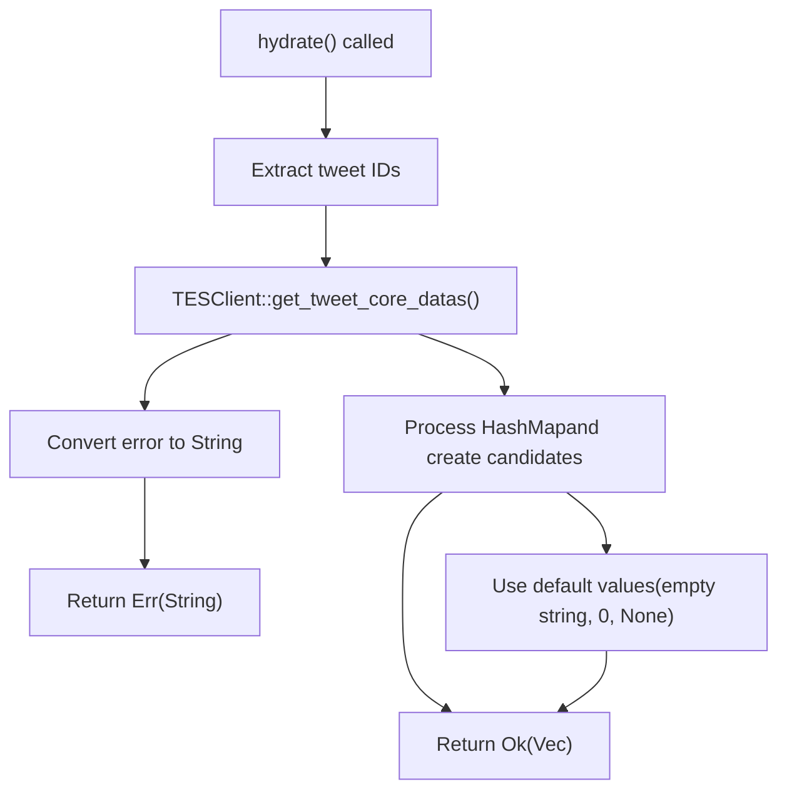
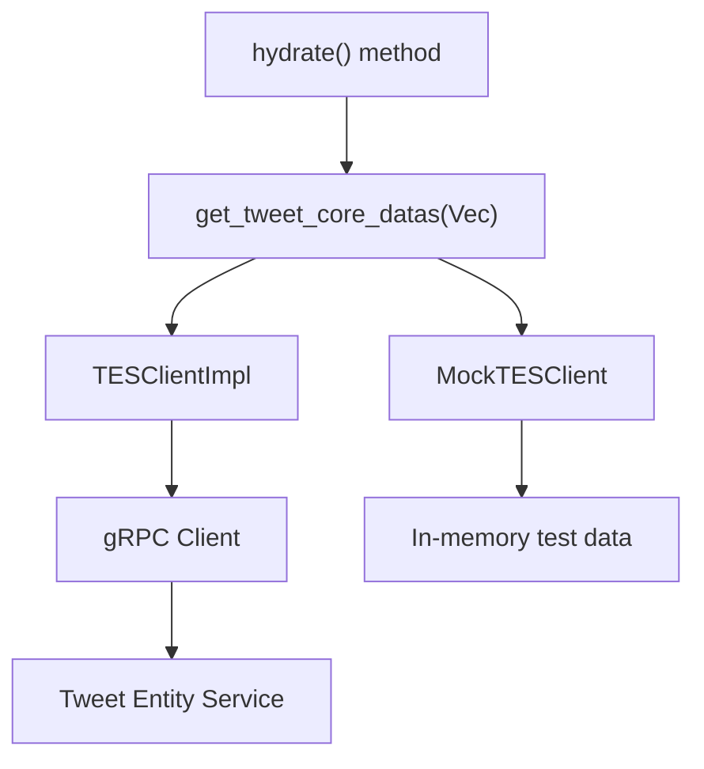

# CoreDataCandidateHydrator

Relevant source files

-   [home-mixer/candidate\_hydrators/core\_data\_candidate\_hydrator.rs](https://github.com/xai-org/x-algorithm/blob/aaa167b3/home-mixer/candidate_hydrators/core_data_candidate_hydrator.rs)

## Purpose and Scope

The `CoreDataCandidateHydrator` is responsible for enriching `PostCandidate` objects with essential tweet metadata retrieved from the Tweet Entity Service (TES). This hydrator provides the foundational data required by downstream pipeline stages, including tweet text, author information, retweet relationships, and reply context.

This document covers the implementation, data flow, and field mapping of the core data hydrator. For information about other candidate enrichment hydrators, see [Candidate Hydrators](/xai-org/x-algorithm/4.5-candidate-hydrators). For details on the Tweet Entity Service client integration, see [Tweet Entity Service (TES)](/xai-org/x-algorithm/5.2-tweet-entity-service-(tes)). For the generic hydrator trait specification, see [Hydrator Trait](/xai-org/x-algorithm/3.4-hydrator-trait).

**Sources:** [home-mixer/candidate\_hydrators/core\_data\_candidate\_hydrator.rs1-59](https://github.com/xai-org/x-algorithm/blob/aaa167b3/home-mixer/candidate_hydrators/core_data_candidate_hydrator.rs#L1-L59)

## Position in Pipeline Architecture

The `CoreDataCandidateHydrator` executes during the candidate enrichment phase of the pipeline, after candidates have been retrieved from sources (Thunder or Phoenix) but before filtering and scoring operations.


**Title:** CoreDataCandidateHydrator Position in Pipeline Execution

The hydrator runs in parallel with other candidate hydrators such as `GizmoduckHydrator`, `VFCandidateHydrator`, and `VideoDurationCandidateHydrator`. This parallel execution optimizes latency by overlapping multiple external service calls.

**Sources:** [home-mixer/candidate\_hydrators/core\_data\_candidate\_hydrator.rs1-59](https://github.com/xai-org/x-algorithm/blob/aaa167b3/home-mixer/candidate_hydrators/core_data_candidate_hydrator.rs#L1-L59)

## Implementation Structure

### Struct Definition


**Title:** CoreDataCandidateHydrator Class Structure and Dependencies

The `CoreDataCandidateHydrator` struct contains a single field: an `Arc`\-wrapped trait object implementing `TESClient`. This design enables dependency injection and facilitates testing with mock implementations.

**Sources:** [home-mixer/candidate\_hydrators/core\_data\_candidate\_hydrator.rs8-16](https://github.com/xai-org/x-algorithm/blob/aaa167b3/home-mixer/candidate_hydrators/core_data_candidate_hydrator.rs#L8-L16)

### Constructor

The hydrator is constructed using an asynchronous `new()` method:

| Method | Parameters | Return Type | Purpose |
| --- | --- | --- | --- |
| `new()` | `tes_client: Arc<dyn TESClient + Send + Sync>` | `Self` | Initializes hydrator with TES client dependency |

The constructor is marked `async` to support potential future initialization logic, though the current implementation is synchronous.

**Sources:** [home-mixer/candidate\_hydrators/core\_data\_candidate\_hydrator.rs12-16](https://github.com/xai-org/x-algorithm/blob/aaa167b3/home-mixer/candidate_hydrators/core_data_candidate_hydrator.rs#L12-L16)

## Data Flow and Hydration Process

### Hydrate Method Execution Flow

> **[Mermaid sequence]**
> *(图表结构无法解析)*

**Title:** CoreDataCandidateHydrator Execution Sequence

The hydration process follows these steps:

1.  **Extract Tweet IDs** [line 28](https://github.com/xai-org/x-algorithm/blob/aaa167b3/line 28): Collect all `tweet_id` values from input candidates
2.  **Batch TES Request** [line 30](https://github.com/xai-org/x-algorithm/blob/aaa167b3/line 30): Call `get_tweet_core_datas()` with the complete set of IDs
3.  **Process Response** [lines 34-46](https://github.com/xai-org/x-algorithm/blob/aaa167b3/lines 34-46): For each tweet ID, lookup core data and construct hydrated candidate
4.  **Return Results** [line 49](https://github.com/xai-org/x-algorithm/blob/aaa167b3/line 49): Return vector of enriched candidates in the same order as input

**Sources:** [home-mixer/candidate\_hydrators/core\_data\_candidate\_hydrator.rs21-50](https://github.com/xai-org/x-algorithm/blob/aaa167b3/home-mixer/candidate_hydrators/core_data_candidate_hydrator.rs#L21-L50)

### Field Mapping

The following table describes how TES core data fields map to `PostCandidate` fields:

| TES CoreData Field | PostCandidate Field | Type | Fallback Behavior |
| --- | --- | --- | --- |
| `author_id` | `author_id` | `i64` | Default to `0` if missing |
| `text` | `tweet_text` | `String` | Default to empty string if missing |
| `source_user_id` | `retweeted_user_id` | `Option<i64>` | `None` if not a retweet |
| `source_tweet_id` | `retweeted_tweet_id` | `Option<i64>` | `None` if not a retweet |
| `in_reply_to_tweet_id` | `in_reply_to_tweet_id` | `Option<i64>` | `None` if not a reply |

The mapping logic is implemented in [lines 38-45](https://github.com/xai-org/x-algorithm/blob/aaa167b3/lines 38-45):

```
author_id: core_data.map(|x| x.author_id).unwrap_or_default()
retweeted_user_id: core_data.and_then(|x| x.source_user_id)
retweeted_tweet_id: core_data.and_then(|x| x.source_tweet_id)
in_reply_to_tweet_id: core_data.and_then(|x| x.in_reply_to_tweet_id)
tweet_text: text.unwrap_or_default()
```
**Sources:** [home-mixer/candidate\_hydrators/core\_data\_candidate\_hydrator.rs34-46](https://github.com/xai-org/x-algorithm/blob/aaa167b3/home-mixer/candidate_hydrators/core_data_candidate_hydrator.rs#L34-L46)

## Update Method

The `update()` method defines which fields from the hydrated candidate should be copied to the original candidate:


**Title:** Field Update Strategy in CoreDataCandidateHydrator

The update method [lines 52-57](https://github.com/xai-org/x-algorithm/blob/aaa167b3/lines 52-57) selectively copies only the core data fields:

-   `retweeted_user_id`
-   `retweeted_tweet_id`
-   `in_reply_to_tweet_id`
-   `tweet_text`

Note that `author_id` is **not** updated via the `update()` method. This field is set during the initial hydrated candidate creation in `hydrate()` but is not propagated through `update()`. This design choice ensures that if `author_id` was already populated by an earlier stage, it is not overwritten.

**Sources:** [home-mixer/candidate\_hydrators/core\_data\_candidate\_hydrator.rs52-57](https://github.com/xai-org/x-algorithm/blob/aaa167b3/home-mixer/candidate_hydrators/core_data_candidate_hydrator.rs#L52-L57)

## Error Handling

The hydrator employs a fail-fast error handling strategy:


**Title:** CoreDataCandidateHydrator Error Handling Flow

Key error handling behaviors:

1.  **TES Client Errors** [line 31](https://github.com/xai-org/x-algorithm/blob/aaa167b3/line 31): If the TES client call fails, the error is converted to a string and propagated up the pipeline, causing the entire hydration to fail
2.  **Missing Tweet Data** [lines 35-36](https://github.com/xai-org/x-algorithm/blob/aaa167b3/lines 35-36): If a specific tweet's data is not found in the response HashMap, the hydrator uses default values rather than failing
3.  **Graceful Field Defaults**: Missing optional fields result in `None`, while required fields use type defaults (`0` for `author_id`, empty string for `tweet_text`)

This approach ensures that transient TES service failures abort the pipeline early, while individual missing tweets degrade gracefully.

**Sources:** [home-mixer/candidate\_hydrators/core\_data\_candidate\_hydrator.rs30-46](https://github.com/xai-org/x-algorithm/blob/aaa167b3/home-mixer/candidate_hydrators/core_data_candidate_hydrator.rs#L30-L46)

## Integration Points

### TESClient Interface


**Title:** TESClient Abstraction and Implementation Variants

The `TESClient` trait provides an abstraction boundary that:

1.  **Enables Testing**: Mock implementations can provide deterministic test data without requiring a running TES instance
2.  **Decouples Services**: Changes to TES wire format or transport layer don't affect hydrator logic
3.  **Supports Batching**: The `get_tweet_core_datas()` method accepts multiple IDs, enabling efficient batch retrieval

**Sources:** [home-mixer/candidate\_hydrators/core\_data\_candidate\_hydrator.rs9-10](https://github.com/xai-org/x-algorithm/blob/aaa167b3/home-mixer/candidate_hydrators/core_data_candidate_hydrator.rs#L9-L10)

## Observability

The hydrator is instrumented with the `#[xai_stats_macro::receive_stats]` attribute on the `hydrate()` method [line 20](https://github.com/xai-org/x-algorithm/blob/aaa167b3/line 20) This macro automatically emits metrics including:

-   Request count
-   Latency distribution
-   Error rate
-   Success rate

These metrics are scoped to `CoreDataCandidateHydrator::hydrate` and enable monitoring of:

-   TES service health and latency
-   Batch size distributions
-   Data availability rates (how often tweets are found in TES)

**Sources:** [home-mixer/candidate\_hydrators/core\_data\_candidate\_hydrator.rs20](https://github.com/xai-org/x-algorithm/blob/aaa167b3/home-mixer/candidate_hydrators/core_data_candidate_hydrator.rs#L20-L20)

## Usage Example

The hydrator is instantiated in the `PhoenixCandidatePipeline` during initialization and registered as part of the candidate hydrator stage. The pipeline framework automatically orchestrates its execution:

| Pipeline Stage | Execution Mode | Position |
| --- | --- | --- |
| Candidate Hydration | Parallel with other hydrators | After sources, before filters |

The framework calls `hydrate()` with the current query and all candidates, then applies the `update()` method to merge results into the original candidates.

**Sources:** [home-mixer/candidate\_hydrators/core\_data\_candidate\_hydrator.rs1-59](https://github.com/xai-org/x-algorithm/blob/aaa167b3/home-mixer/candidate_hydrators/core_data_candidate_hydrator.rs#L1-L59)
