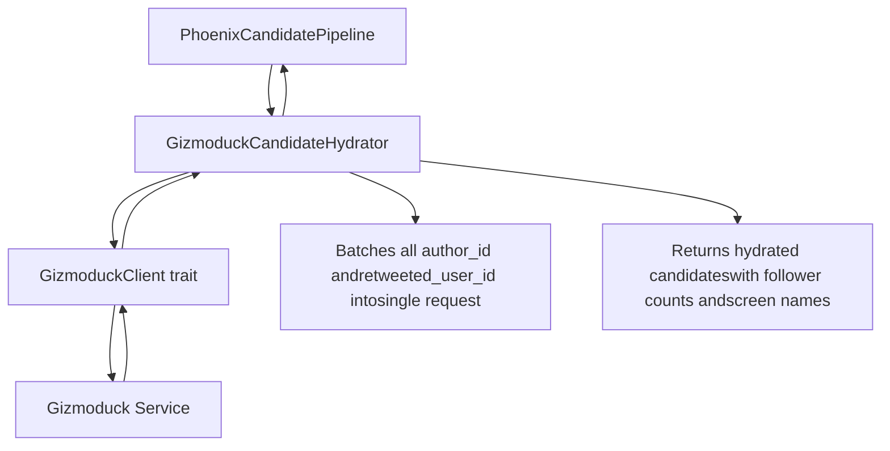
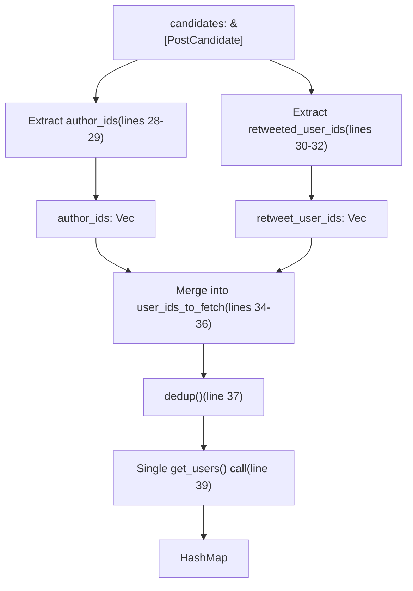
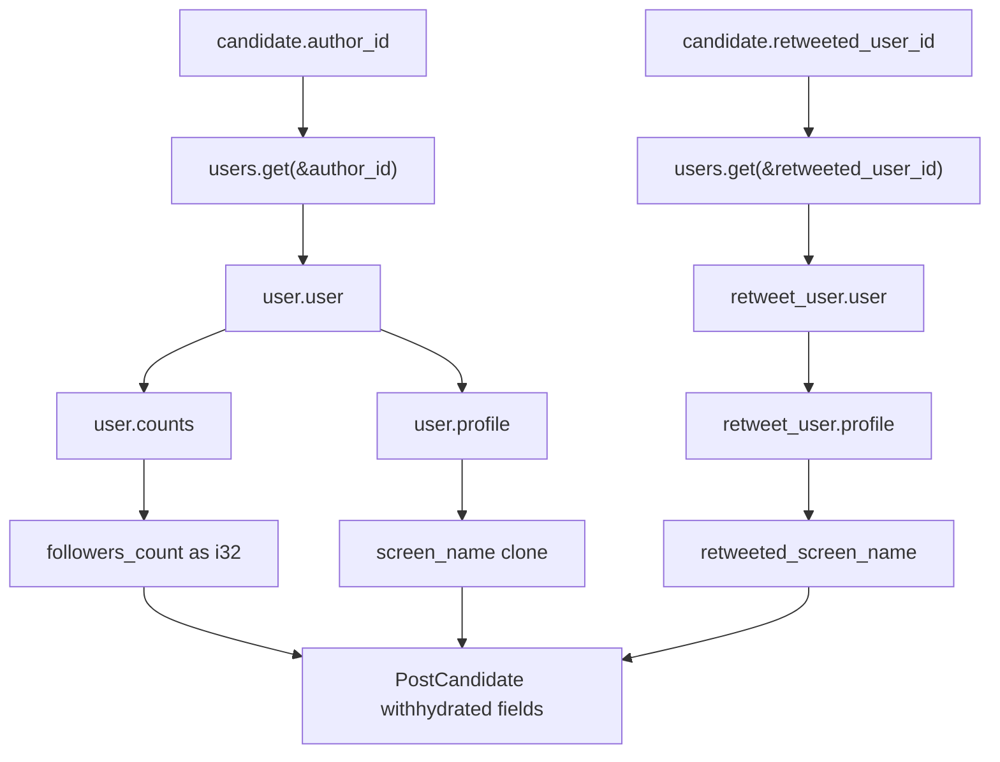
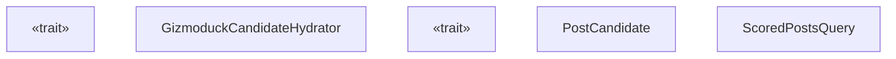

# GizmoduckHydrator

Relevant source files

-   [home-mixer/candidate\_hydrators/gizmoduck\_hydrator.rs](https://github.com/xai-org/x-algorithm/blob/aaa167b3/home-mixer/candidate_hydrators/gizmoduck_hydrator.rs)

## Purpose and Scope

The `GizmoduckCandidateHydrator` enriches `PostCandidate` objects with user profile information by fetching data from the Gizmoduck service. This hydrator populates author follower counts, author screen names, and retweeted user screen names through batched queries to minimize network overhead. For general information about the hydrator trait pattern, see [Hydrator Trait](/xai-org/x-algorithm/3.4-hydrator-trait). For details on the Gizmoduck service integration, see [Gizmoduck Service](/xai-org/x-algorithm/5.3-gizmoduck-service). For other candidate hydrators, see [Candidate Hydrators](/xai-org/x-algorithm/4.5-candidate-hydrators).

**Sources:** [home-mixer/candidate\_hydrators/gizmoduck\_hydrator.rs1-82](https://github.com/xai-org/x-algorithm/blob/aaa167b3/home-mixer/candidate_hydrators/gizmoduck_hydrator.rs#L1-L82)

## Overview

`GizmoduckCandidateHydrator` implements the `Hydrator<ScoredPostsQuery, PostCandidate>` trait to fetch user profile metadata for tweet authors and retweeted users. The hydrator employs a batching strategy that collects all unique user IDs across candidates, performs a single batched request to the Gizmoduck service, and then maps the returned data back to individual candidates.


**Sources:** [home-mixer/candidate\_hydrators/gizmoduck\_hydrator.rs8-74](https://github.com/xai-org/x-algorithm/blob/aaa167b3/home-mixer/candidate_hydrators/gizmoduck_hydrator.rs#L8-L74)

## Struct Definition

The `GizmoduckCandidateHydrator` struct contains a single field:

| Field | Type | Description |
| --- | --- | --- |
| `gizmoduck_client` | `Arc<dyn GizmoduckClient + Send + Sync>` | Trait object for making batched requests to the Gizmoduck service |

The struct is constructed asynchronously with the `new()` method, which accepts a shared reference to a `GizmoduckClient` implementation.

**Sources:** [home-mixer/candidate\_hydrators/gizmoduck\_hydrator.rs8-16](https://github.com/xai-org/x-algorithm/blob/aaa167b3/home-mixer/candidate_hydrators/gizmoduck_hydrator.rs#L8-L16)

## Hydration Process

The hydration process follows these steps:

> **[Mermaid sequence]**
> *(图表结构无法解析)*

**Sources:** [home-mixer/candidate\_hydrators/gizmoduck\_hydrator.rs21-74](https://github.com/xai-org/x-algorithm/blob/aaa167b3/home-mixer/candidate_hydrators/gizmoduck_hydrator.rs#L21-L74)

## Batching Strategy

The hydrator implements an efficient batching strategy to minimize network round-trips:

### User ID Collection


The implementation:

1.  Collects all `author_id` values from candidates [home-mixer/candidate\_hydrators/gizmoduck\_hydrator.rs28-29](https://github.com/xai-org/x-algorithm/blob/aaa167b3/home-mixer/candidate_hydrators/gizmoduck_hydrator.rs#L28-L29)
2.  Collects all `retweeted_user_id` values (flattening `Option<u64>`) [home-mixer/candidate\_hydrators/gizmoduck\_hydrator.rs30-32](https://github.com/xai-org/x-algorithm/blob/aaa167b3/home-mixer/candidate_hydrators/gizmoduck_hydrator.rs#L30-L32)
3.  Merges both sets into a single vector [home-mixer/candidate\_hydrators/gizmoduck\_hydrator.rs34-36](https://github.com/xai-org/x-algorithm/blob/aaa167b3/home-mixer/candidate_hydrators/gizmoduck_hydrator.rs#L34-L36)
4.  Deduplicates the IDs to avoid redundant fetches [home-mixer/candidate\_hydrators/gizmoduck\_hydrator.rs37](https://github.com/xai-org/x-algorithm/blob/aaa167b3/home-mixer/candidate_hydrators/gizmoduck_hydrator.rs#L37-L37)
5.  Makes a single batched `get_users()` call [home-mixer/candidate\_hydrators/gizmoduck\_hydrator.rs39](https://github.com/xai-org/x-algorithm/blob/aaa167b3/home-mixer/candidate_hydrators/gizmoduck_hydrator.rs#L39-L39)

**Sources:** [home-mixer/candidate\_hydrators/gizmoduck\_hydrator.rs28-40](https://github.com/xai-org/x-algorithm/blob/aaa167b3/home-mixer/candidate_hydrators/gizmoduck_hydrator.rs#L28-L40)

## Data Extraction and Mapping

After receiving the batched user data, the hydrator extracts specific fields for each candidate:

### Fields Hydrated

| Field | Source Path | Type | Description |
| --- | --- | --- | --- |
| `author_followers_count` | `user.user.counts.followers_count` | `Option<i32>` | Number of followers the author has |
| `author_screen_name` | `user.user.profile.screen_name` | `Option<String>` | Author's display handle (e.g., "@username") |
| `retweeted_screen_name` | `retweet_user.user.profile.screen_name` | `Option<String>` | Screen name of the user who was retweeted |

### Extraction Logic


The extraction uses chained `and_then()` operations to safely navigate nested `Option` types, ensuring that missing data doesn't cause failures [home-mixer/candidate\_hydrators/gizmoduck\_hydrator.rs45-62](https://github.com/xai-org/x-algorithm/blob/aaa167b3/home-mixer/candidate_hydrators/gizmoduck_hydrator.rs#L45-L62)

**Sources:** [home-mixer/candidate\_hydrators/gizmoduck\_hydrator.rs44-71](https://github.com/xai-org/x-algorithm/blob/aaa167b3/home-mixer/candidate_hydrators/gizmoduck_hydrator.rs#L44-L71)

## Update Method

The `update()` method implements the field-level merge strategy required by the `Hydrator` trait:

```
fn update(&self, candidate: &mut PostCandidate, hydrated: PostCandidate)
```
This method updates three specific fields on the original candidate:

-   `candidate.author_followers_count` [home-mixer/candidate\_hydrators/gizmoduck\_hydrator.rs77](https://github.com/xai-org/x-algorithm/blob/aaa167b3/home-mixer/candidate_hydrators/gizmoduck_hydrator.rs#L77-L77)
-   `candidate.author_screen_name` [home-mixer/candidate\_hydrators/gizmoduck\_hydrator.rs78](https://github.com/xai-org/x-algorithm/blob/aaa167b3/home-mixer/candidate_hydrators/gizmoduck_hydrator.rs#L78-L78)
-   `candidate.retweeted_screen_name` [home-mixer/candidate\_hydrators/gizmoduck\_hydrator.rs79](https://github.com/xai-org/x-algorithm/blob/aaa167b3/home-mixer/candidate_hydrators/gizmoduck_hydrator.rs#L79-L79)

The pattern follows the standard hydrator design where the `hydrate()` method returns new `PostCandidate` instances with only the relevant fields populated (using `..Default::default()` for other fields), and the `update()` method selectively copies those fields to the original candidates.

**Sources:** [home-mixer/candidate\_hydrators/gizmoduck\_hydrator.rs76-81](https://github.com/xai-org/x-algorithm/blob/aaa167b3/home-mixer/candidate_hydrators/gizmoduck_hydrator.rs#L76-L81)

## Integration Points

### Code Entity Relationships


### Pipeline Integration

The `GizmoduckCandidateHydrator` is instantiated in the `PhoenixCandidatePipeline` and registered as one of the candidate hydrators. During pipeline execution, it runs in parallel with other hydrators in the hydration stage, after candidate retrieval but before filtering and scoring.

**Sources:** [home-mixer/candidate\_hydrators/gizmoduck\_hydrator.rs1-81](https://github.com/xai-org/x-algorithm/blob/aaa167b3/home-mixer/candidate_hydrators/gizmoduck_hydrator.rs#L1-L81)

## Error Handling

The hydrator propagates errors from the `GizmoduckClient`:

| Error Scenario | Handling |
| --- | --- |
| `get_users()` failure | Returns `Err(String)` via `map_err(|e| e.to_string())` [home-mixer/candidate\_hydrators/gizmoduck\_hydrator.rs40](https://github.com/xai-org/x-algorithm/blob/aaa167b3/home-mixer/candidate_hydrators/gizmoduck_hydrator.rs#L40-L40) |
| Missing user data | Treats as `None` - fields remain `None` [home-mixer/candidate\_hydrators/gizmoduck\_hydrator.rs45-62](https://github.com/xai-org/x-algorithm/blob/aaa167b3/home-mixer/candidate_hydrators/gizmoduck_hydrator.rs#L45-L62) |
| Nested field absence | Uses `and_then()` chaining to safely unwrap nested `Option` types |

If the `get_users()` call fails, the entire hydration fails and propagates an error up the pipeline. However, if the call succeeds but specific users are missing from the response, those candidates simply retain `None` values for the affected fields.

**Sources:** [home-mixer/candidate\_hydrators/gizmoduck\_hydrator.rs39-62](https://github.com/xai-org/x-algorithm/blob/aaa167b3/home-mixer/candidate_hydrators/gizmoduck_hydrator.rs#L39-L62)

## Performance Characteristics

### Batching Efficiency

| Metric | Value | Notes |
| --- | --- | --- |
| Network calls | 1 per hydration | All user IDs batched into single request |
| Deduplication | Yes | `dedup()` on line 37 removes redundant IDs |
| Memory allocation | O(n) | One `HashMap` for all users, `Vec` for candidates |
| Parallel execution | Yes | Runs concurrently with other hydrators in pipeline |

The hydrator uses the `#[xai_stats_macro::receive_stats]` annotation [home-mixer/candidate\_hydrators/gizmoduck\_hydrator.rs20](https://github.com/xai-org/x-algorithm/blob/aaa167b3/home-mixer/candidate_hydrators/gizmoduck_hydrator.rs#L20-L20) to automatically emit metrics about execution time and success/failure rates.

**Sources:** [home-mixer/candidate\_hydrators/gizmoduck\_hydrator.rs20-40](https://github.com/xai-org/x-algorithm/blob/aaa167b3/home-mixer/candidate_hydrators/gizmoduck_hydrator.rs#L20-L40)

## Usage Example Flow

> **[Mermaid sequence]**
> *(图表结构无法解析)*

**Sources:** [home-mixer/candidate\_hydrators/gizmoduck\_hydrator.rs21-74](https://github.com/xai-org/x-algorithm/blob/aaa167b3/home-mixer/candidate_hydrators/gizmoduck_hydrator.rs#L21-L74)
