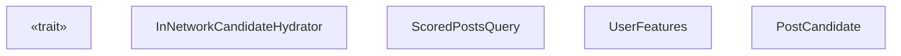
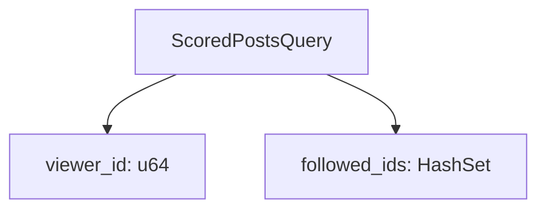
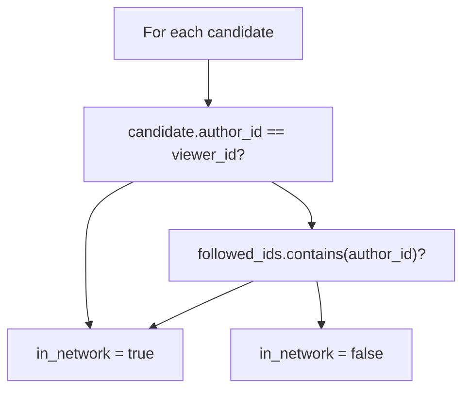

# InNetworkCandidateHydrator

Relevant source files

-   [home-mixer/candidate\_hydrators/in\_network\_candidate\_hydrator.rs](https://github.com/xai-org/x-algorithm/blob/aaa167b3/home-mixer/candidate_hydrators/in_network_candidate_hydrator.rs)

## Purpose and Scope

The `InNetworkCandidateHydrator` determines whether each candidate post's author is within the viewer's social network. A candidate is classified as "in-network" if its author is either the viewer themselves or a user the viewer follows. This boolean classification is stored in the `PostCandidate.in_network` field and is used by downstream filters and scorers to apply different treatment to in-network versus out-of-network content.

For general information about the Hydrator trait pattern, see [Hydrator Trait](/xai-org/x-algorithm/3.4-hydrator-trait). For information about other candidate enrichment implementations, see [Candidate Hydrators](/xai-org/x-algorithm/4.5-candidate-hydrators). For visibility filtering that uses different safety levels based on network status, see [VFCandidateHydrator](/xai-org/x-algorithm/4.5.5-vfcandidatehydrator).

## Functional Overview

The hydrator performs a simple set membership check for each candidate:

| Input | Output |
| --- | --- |
| Viewer user ID from query | Boolean `in_network` field per candidate |
| Followed user IDs from query user features | \- |
| Candidate author IDs | \- |

The classification logic is:

-   **In-network**: Author is the viewer OR author is in the viewer's followed user list
-   **Out-of-network**: All other cases

This determination enables the pipeline to:

-   Apply different visibility filtering safety levels ([VFCandidateHydrator](/xai-org/x-algorithm/4.5.5-vfcandidatehydrator) uses `TimelineHome` for in-network, `TimelineHomeRecommendations` for out-of-network)
-   Apply different scoring weights or diversity penalties
-   Filter or prioritize content based on network proximity

Sources: [home-mixer/candidate\_hydrators/in\_network\_candidate\_hydrator.rs1-44](https://github.com/xai-org/x-algorithm/blob/aaa167b3/home-mixer/candidate_hydrators/in_network_candidate_hydrator.rs#L1-L44)

## Implementation Structure


The `InNetworkCandidateHydrator` struct is a stateless component that implements the `Hydrator<ScoredPostsQuery, PostCandidate>` trait from the candidate pipeline framework.

**Key characteristics:**

-   **Stateless**: The struct has no fields [home-mixer/candidate\_hydrators/in\_network\_candidate\_hydrator.rs7](https://github.com/xai-org/x-algorithm/blob/aaa167b3/home-mixer/candidate_hydrators/in_network_candidate_hydrator.rs#L7-L7)
-   **No external service dependencies**: All required data is present in the query
-   **Synchronous logic**: Despite the async signature, the computation is pure in-memory
-   **Idempotent**: Multiple invocations produce the same result

Sources: [home-mixer/candidate\_hydrators/in\_network\_candidate\_hydrator.rs7-10](https://github.com/xai-org/x-algorithm/blob/aaa167b3/home-mixer/candidate_hydrators/in_network_candidate_hydrator.rs#L7-L10)

## Hydration Process

### Input Data Extraction

The hydrator extracts two pieces of information from the `ScoredPostsQuery`:


The viewer ID is cast from `i64` to `u64` for comparison with the candidate's `author_id` field [home-mixer/candidate\_hydrators/in\_network\_candidate\_hydrator.rs17](https://github.com/xai-org/x-algorithm/blob/aaa167b3/home-mixer/candidate_hydrators/in_network_candidate_hydrator.rs#L17-L17) The followed user IDs are collected into a `HashSet<u64>` for efficient O(1) membership checks [home-mixer/candidate\_hydrators/in\_network\_candidate\_hydrator.rs18-24](https://github.com/xai-org/x-algorithm/blob/aaa167b3/home-mixer/candidate_hydrators/in_network_candidate_hydrator.rs#L18-L24)

Sources: [home-mixer/candidate\_hydrators/in\_network\_candidate\_hydrator.rs17-24](https://github.com/xai-org/x-algorithm/blob/aaa167b3/home-mixer/candidate_hydrators/in_network_candidate_hydrator.rs#L17-L24)

### Classification Logic

For each candidate, the hydrator applies the following decision tree:


The implementation uses a short-circuit OR evaluation [home-mixer/candidate\_hydrators/in\_network\_candidate\_hydrator.rs29-30](https://github.com/xai-org/x-algorithm/blob/aaa167b3/home-mixer/candidate_hydrators/in_network_candidate_hydrator.rs#L29-L30):

```
let is_self = candidate.author_id == viewer_id;let is_in_network = is_self || followed_ids.contains(&candidate.author_id);
```
This ensures that self-authored posts are always classified as in-network, even if the user doesn't technically "follow" themselves in the social graph.

Sources: [home-mixer/candidate\_hydrators/in\_network\_candidate\_hydrator.rs26-36](https://github.com/xai-org/x-algorithm/blob/aaa167b3/home-mixer/candidate_hydrators/in_network_candidate_hydrator.rs#L26-L36)

### Hydrated Candidate Creation

The hydrator creates a new `PostCandidate` instance for each input candidate with only the `in_network` field populated:

| Field | Value |
| --- | --- |
| `in_network` | `Some(true)` or `Some(false)` based on classification |
| All other fields | `Default::default()` |

This partial candidate is then merged with the original candidate via the `update` method [home-mixer/candidate\_hydrators/in\_network\_candidate\_hydrator.rs41-43](https://github.com/xai-org/x-algorithm/blob/aaa167b3/home-mixer/candidate_hydrators/in_network_candidate_hydrator.rs#L41-L43) which copies only the `in_network` field to the original candidate.

Sources: [home-mixer/candidate\_hydrators/in\_network\_candidate\_hydrator.rs31-34](https://github.com/xai-org/x-algorithm/blob/aaa167b3/home-mixer/candidate_hydrators/in_network_candidate_hydrator.rs#L31-L34) [home-mixer/candidate\_hydrators/in\_network\_candidate\_hydrator.rs41-43](https://github.com/xai-org/x-algorithm/blob/aaa167b3/home-mixer/candidate_hydrators/in_network_candidate_hydrator.rs#L41-L43)

## Data Flow Through Pipeline

The hydrator is executed during the candidate hydration phase of the pipeline, along with other hydrators like `CoreDataCandidateHydrator` and `GizmoduckHydrator`. The pipeline framework handles the orchestration and merging of results.

Sources: [home-mixer/candidate\_hydrators/in\_network\_candidate\_hydrator.rs12-43](https://github.com/xai-org/x-algorithm/blob/aaa167b3/home-mixer/candidate_hydrators/in_network_candidate_hydrator.rs#L12-L43)

## Integration Points

### Query Dependencies

The hydrator requires the following fields to be populated in `ScoredPostsQuery`:

| Field Path | Type | Purpose |
| --- | --- | --- |
| `query.user_id` | `i64` | Identify the viewing user |
| `query.user_features.followed_user_ids` | `Vec<i64>` | List of users followed by the viewer |

The `user_features.followed_user_ids` field is populated by query hydrators (see [Query Hydrators](/xai-org/x-algorithm/4.4-query-hydrators)) before candidate hydration begins.

### Candidate Dependencies

The hydrator requires the following field to be populated in each `PostCandidate`:

| Field | Type | Populated By | Purpose |
| --- | --- | --- | --- |
| `author_id` | `u64` | Source (Thunder/Phoenix) or CoreDataCandidateHydrator | Identify the post's author |

The `author_id` is typically populated by the candidate source ([Thunder Source](/xai-org/x-algorithm/4.3.1-thunder-source) or [Phoenix Retrieval Source](/xai-org/x-algorithm/4.3.2-phoenix-retrieval-source)) or by [CoreDataCandidateHydrator](/xai-org/x-algorithm/4.5.1-coredatacandidatehydrator).

### Downstream Consumers

The `in_network` field populated by this hydrator is consumed by:

1.  **VFCandidateHydrator** ([#4.5.5](/xai-org/x-algorithm/4.5.5-vfcandidatehydrator)): Uses `in_network` to select the appropriate visibility filtering safety level

    -   In-network posts: `TimelineHome` safety level
    -   Out-of-network posts: `TimelineHomeRecommendations` safety level (stricter)
2.  **Scorers**: May apply different scoring weights or diversity penalties based on network status

3.  **Filters**: May filter candidates differently based on whether they are in-network or out-of-network


Sources: [home-mixer/candidate\_hydrators/in\_network\_candidate\_hydrator.rs1-44](https://github.com/xai-org/x-algorithm/blob/aaa167b3/home-mixer/candidate_hydrators/in_network_candidate_hydrator.rs#L1-L44)

## Performance Characteristics

The hydrator exhibits the following performance profile:

| Metric | Complexity | Notes |
| --- | --- | --- |
| Time per candidate | O(1) | HashSet lookup is O(1) average case |
| Space | O(N) | HashSet stores N followed user IDs |
| External calls | 0 | All data is in-memory |
| Parallelization | Safe | Stateless, no shared mutable state |

The most expensive operation is the initial construction of the `HashSet<u64>` from the followed user IDs vector [home-mixer/candidate\_hydrators/in\_network\_candidate\_hydrator.rs18-24](https://github.com/xai-org/x-algorithm/blob/aaa167b3/home-mixer/candidate_hydrators/in_network_candidate_hydrator.rs#L18-L24) which is O(N) where N is the number of followed users. However, this cost is amortized across all candidates, and subsequent lookups are O(1).

The hydrator is instrumented with the `#[xai_stats_macro::receive_stats]` attribute [home-mixer/candidate\_hydrators/in\_network\_candidate\_hydrator.rs11](https://github.com/xai-org/x-algorithm/blob/aaa167b3/home-mixer/candidate_hydrators/in_network_candidate_hydrator.rs#L11-L11) which likely tracks execution time and success/failure metrics for monitoring.

Sources: [home-mixer/candidate\_hydrators/in\_network\_candidate\_hydrator.rs11-24](https://github.com/xai-org/x-algorithm/blob/aaa167b3/home-mixer/candidate_hydrators/in_network_candidate_hydrator.rs#L11-L24)

## Error Handling

The hydrator returns `Result<Vec<PostCandidate>, String>` but does not produce errors in practice, as all operations are infallible:

-   Type conversions (`i64` to `u64`) cannot fail
-   HashSet construction and lookups cannot fail
-   Boolean comparisons cannot fail

The `Result` type is required by the `Hydrator` trait signature for consistency with other hydrators that may perform fallible operations (e.g., external service calls).

Sources: [home-mixer/candidate\_hydrators/in\_network\_candidate\_hydrator.rs12-39](https://github.com/xai-org/x-algorithm/blob/aaa167b3/home-mixer/candidate_hydrators/in_network_candidate_hydrator.rs#L12-L39)
