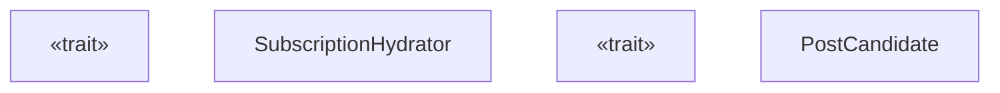
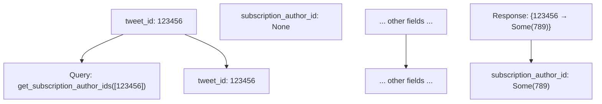
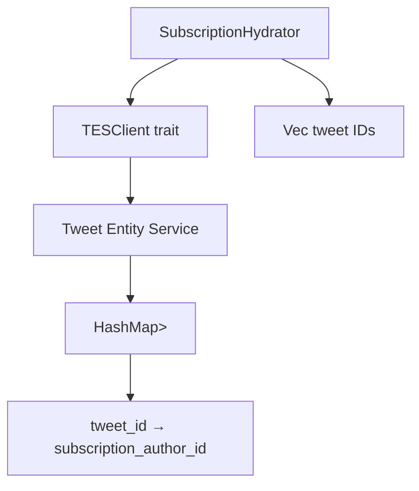
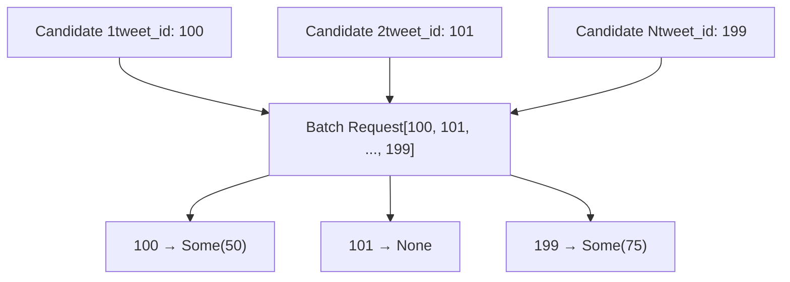
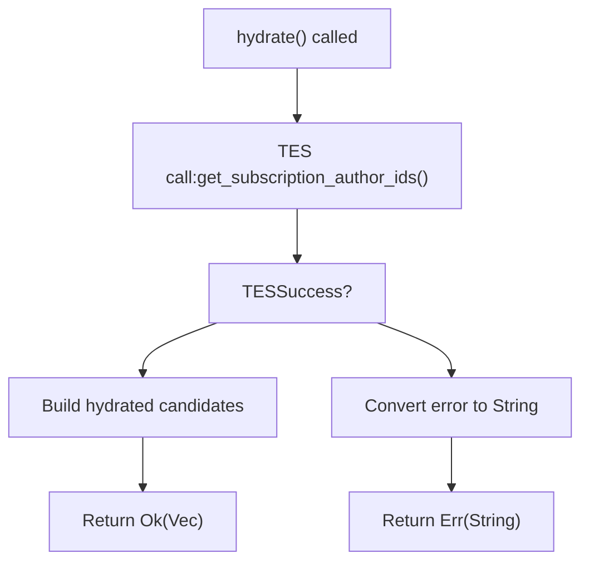

# SubscriptionHydrator

Relevant source files

-   [home-mixer/candidate\_hydrators/subscription\_hydrator.rs](https://github.com/xai-org/x-algorithm/blob/aaa167b3/home-mixer/candidate_hydrators/subscription_hydrator.rs)

## Purpose and Scope

The `SubscriptionHydrator` enriches `PostCandidate` objects with subscription author identification data. This hydrator queries the Tweet Entity Service (TES) to determine if a tweet originates from a subscription author (premium content creator), populating the `subscription_author_id` field on candidates. This information enables downstream pipeline stages to identify, filter, or score premium content appropriately.

This document covers the implementation details, data flow, and integration patterns of the `SubscriptionHydrator`. For information about the generic `Hydrator` trait and execution patterns, see [Hydrator Trait](/xai-org/x-algorithm/3.4-hydrator-trait). For details on TES integration, see [Tweet Entity Service](/xai-org/x-algorithm/5.2-tweet-entity-service-(tes)). For the candidate data structure being enriched, see [PostCandidate](/xai-org/x-algorithm/4.2.2-postcandidate).

## Architecture and Design

### Component Structure

The `SubscriptionHydrator` implements the `Hydrator<ScoredPostsQuery, PostCandidate>` trait, following the standard candidate hydrator pattern used throughout the pipeline.


**Sources:** [home-mixer/candidate\_hydrators/subscription\_hydrator.rs1-51](https://github.com/xai-org/x-algorithm/blob/aaa167b3/home-mixer/candidate_hydrators/subscription_hydrator.rs#L1-L51)

### Key Characteristics

| Characteristic | Value |
| --- | --- |
| **Trait Implementation** | `Hydrator<ScoredPostsQuery, PostCandidate>` |
| **External Dependency** | TES (Tweet Entity Service) via `TESClient` |
| **Field Populated** | `PostCandidate::subscription_author_id` |
| **Query Independence** | Does not use query data; operates only on candidates |
| **Batching Strategy** | Single batched TES call for all candidate tweet IDs |
| **Execution Pattern** | Parallel-safe (can execute with other hydrators) |

**Sources:** [home-mixer/candidate\_hydrators/subscription\_hydrator.rs8-50](https://github.com/xai-org/x-algorithm/blob/aaa167b3/home-mixer/candidate_hydrators/subscription_hydrator.rs#L8-L50)

## Implementation Details

### Initialization

The `SubscriptionHydrator` is constructed with a dependency-injected `TESClient`:

```
pub struct SubscriptionHydrator {    pub tes_client: Arc<dyn TESClient + Send + Sync>,} pub async fn new(tes_client: Arc<dyn TESClient + Send + Sync>) -> Self {    Self { tes_client }}
```
The client abstraction allows for production TES integration or test mocks to be injected based on runtime configuration.

**Sources:** [home-mixer/candidate\_hydrators/subscription\_hydrator.rs8-16](https://github.com/xai-org/x-algorithm/blob/aaa167b3/home-mixer/candidate_hydrators/subscription_hydrator.rs#L8-L16)

### Hydration Method

The `hydrate` method retrieves subscription author IDs for all candidates in a single batched request:

> **[Mermaid sequence]**
> *(图表结构无法解析)*

**Sources:** [home-mixer/candidate\_hydrators/subscription\_hydrator.rs20-45](https://github.com/xai-org/x-algorithm/blob/aaa167b3/home-mixer/candidate_hydrators/subscription_hydrator.rs#L20-L45)

#### Step-by-Step Execution

1.  **Tweet ID Collection** [lines 28](https://github.com/xai-org/x-algorithm/blob/aaa167b3/lines 28): Extracts `tweet_id` from each `PostCandidate` into a vector
2.  **Batched TES Query** [lines 30-31](https://github.com/xai-org/x-algorithm/blob/aaa167b3/lines 30-31): Calls `tes_client.get_subscription_author_ids()` with all tweet IDs
3.  **Error Handling** [line 31](https://github.com/xai-org/x-algorithm/blob/aaa167b3/line 31): Maps TES errors to string format for pipeline error reporting
4.  **Result Construction** [lines 33-42](https://github.com/xai-org/x-algorithm/blob/aaa167b3/lines 33-42):
    -   Iterates through tweet IDs in original order
    -   Looks up subscription author ID from TES response map
    -   Creates new `PostCandidate` with only `subscription_author_id` populated
    -   Other fields remain at default values (to be merged by `update`)

**Sources:** [home-mixer/candidate\_hydrators/subscription\_hydrator.rs28-44](https://github.com/xai-org/x-algorithm/blob/aaa167b3/home-mixer/candidate_hydrators/subscription_hydrator.rs#L28-L44)

### Update Method

The `update` method merges hydrated subscription data into the original candidate:

```
fn update(&self, candidate: &mut PostCandidate, hydrated: PostCandidate) {    candidate.subscription_author_id = hydrated.subscription_author_id;}
```
This method is called by the pipeline framework for each candidate after `hydrate` completes, merging the `subscription_author_id` field while preserving all other candidate data.

**Sources:** [home-mixer/candidate\_hydrators/subscription\_hydrator.rs47-49](https://github.com/xai-org/x-algorithm/blob/aaa167b3/home-mixer/candidate_hydrators/subscription_hydrator.rs#L47-L49)

## Data Flow

### Field Transformation

The hydrator performs a targeted field-level enrichment:


**Sources:** [home-mixer/candidate\_hydrators/subscription\_hydrator.rs34-42](https://github.com/xai-org/x-algorithm/blob/aaa167b3/home-mixer/candidate_hydrators/subscription_hydrator.rs#L34-L42)

### Subscription Author ID Semantics

The `subscription_author_id` field represents:

| Value | Meaning |
| --- | --- |
| `Some(author_id)` | Tweet is from a subscription author; `author_id` identifies the subscription account |
| `None` | Tweet is not from a subscription author, or TES lacks subscription metadata |

This field enables downstream pipeline stages to:

-   **Filter premium content** based on user subscription status
-   **Score differently** for subscribers vs non-subscribers
-   **Track metrics** on subscription content distribution
-   **Apply special rendering** for subscription posts

**Sources:** [home-mixer/candidate\_hydrators/subscription\_hydrator.rs36-38](https://github.com/xai-org/x-algorithm/blob/aaa167b3/home-mixer/candidate_hydrators/subscription_hydrator.rs#L36-L38)

## Integration Points

### TESClient Dependency

The hydrator depends on the `TESClient::get_subscription_author_ids` method:


The client abstraction provides:

-   **Batching efficiency**: Single RPC for all candidates
-   **Testability**: Mock implementation for unit tests
-   **Error isolation**: TES failures map to hydration errors

**Sources:** [home-mixer/candidate\_hydrators/subscription\_hydrator.rs9-30](https://github.com/xai-org/x-algorithm/blob/aaa167b3/home-mixer/candidate_hydrators/subscription_hydrator.rs#L9-L30)

### Pipeline Integration

The `SubscriptionHydrator` executes in the candidate hydration phase alongside other hydrators:

| Pipeline Stage | SubscriptionHydrator Role |
| --- | --- |
| **Query Hydration** | Not involved |
| **Candidate Retrieval** | Not involved |
| **Candidate Hydration** | Enriches candidates with subscription data (parallel with other hydrators) |
| **Filtering** | Provides data for potential subscription-based filters |
| **Scoring** | Provides data for subscription-aware scoring logic |
| **Selection** | Not directly involved |

**Sources:** [home-mixer/candidate\_hydrators/subscription\_hydrator.rs19-20](https://github.com/xai-org/x-algorithm/blob/aaa167b3/home-mixer/candidate_hydrators/subscription_hydrator.rs#L19-L20)

## Performance Characteristics

### Batching Strategy

The hydrator uses efficient batching to minimize TES calls:


**Efficiency Benefits:**

-   **Single RPC**: One TES call regardless of candidate count
-   **O(1) lookups**: HashMap lookup for each tweet ID
-   **Parallel execution**: Can run concurrently with other hydrators

**Sources:** [home-mixer/candidate\_hydrators/subscription\_hydrator.rs28-31](https://github.com/xai-org/x-algorithm/blob/aaa167b3/home-mixer/candidate_hydrators/subscription_hydrator.rs#L28-L31)

### Stats Instrumentation

The `hydrate` method includes stats instrumentation via the `#[xai_stats_macro::receive_stats]` attribute [line 20](https://github.com/xai-org/x-algorithm/blob/aaa167b3/line 20) This provides automatic metrics collection for:

-   Hydration latency
-   Success/error rates
-   TES call performance
-   Throughput tracking

**Sources:** [home-mixer/candidate\_hydrators/subscription\_hydrator.rs20](https://github.com/xai-org/x-algorithm/blob/aaa167b3/home-mixer/candidate_hydrators/subscription_hydrator.rs#L20-L20)

## Error Handling

The hydrator follows standard error propagation patterns:


**Error Behavior:**

-   **TES failure**: Maps error to string and propagates to pipeline
-   **Pipeline handling**: Pipeline may fail entire hydration phase or continue with partial data
-   **Missing data**: `None` values indicate no subscription metadata (valid state, not error)

**Sources:** [home-mixer/candidate\_hydrators/subscription\_hydrator.rs30-31](https://github.com/xai-org/x-algorithm/blob/aaa167b3/home-mixer/candidate_hydrators/subscription_hydrator.rs#L30-L31)

## Usage Example

The `SubscriptionHydrator` is instantiated in the pipeline configuration:

```
// During pipeline initializationlet subscription_hydrator = SubscriptionHydrator::new(tes_client.clone()).await; // Added to pipeline hydrators listpipeline.add_hydrator(subscription_hydrator);
```
After hydration, candidates can be used for subscription-aware logic:

```
// Example: Filter or score based on subscription statusfor candidate in candidates {    if candidate.subscription_author_id.is_some() {        // This is premium content        // Apply subscription-specific logic    }}
```
**Sources:** [home-mixer/candidate\_hydrators/subscription\_hydrator.rs13-15](https://github.com/xai-org/x-algorithm/blob/aaa167b3/home-mixer/candidate_hydrators/subscription_hydrator.rs#L13-L15)
