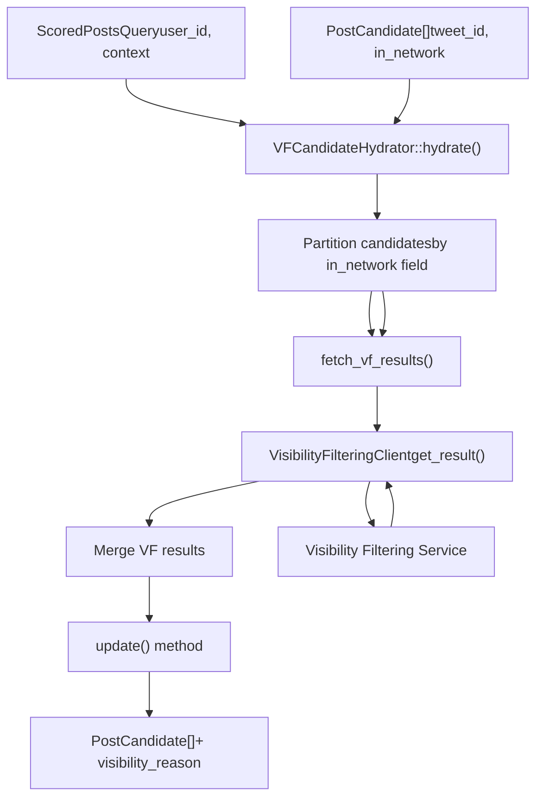
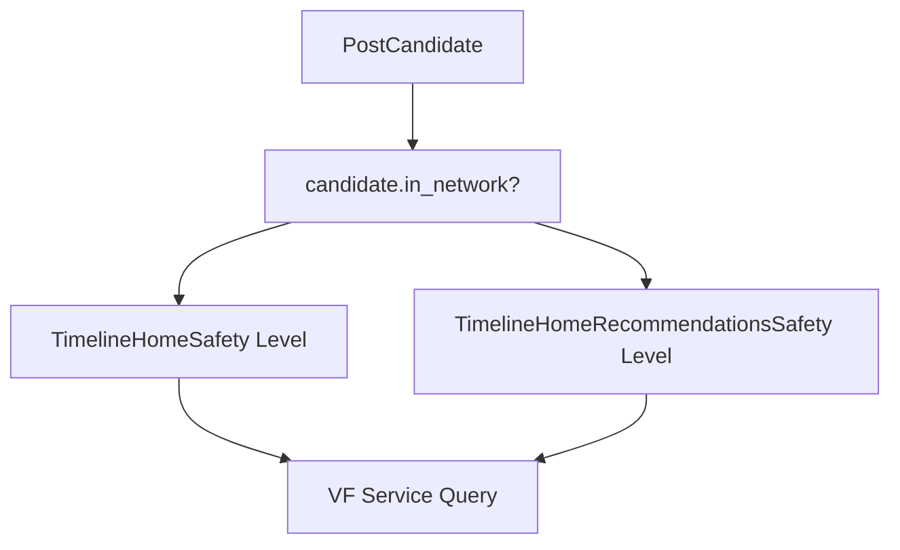
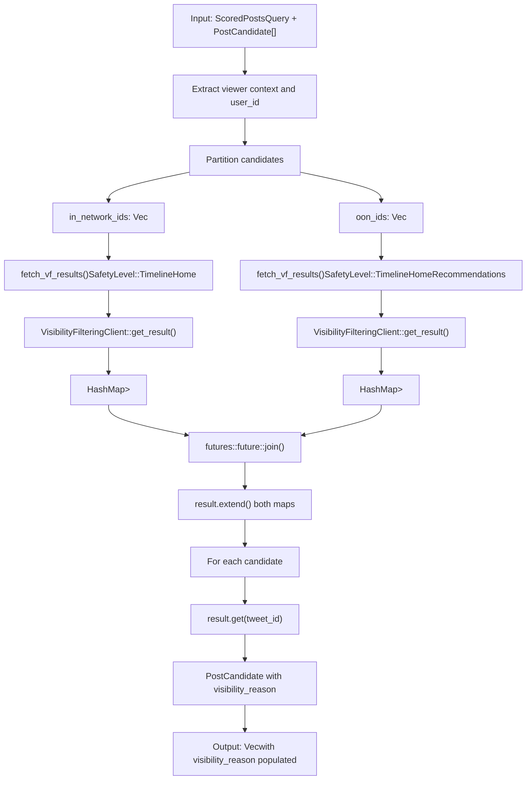

# VFCandidateHydrator

Relevant source files

-   [home-mixer/candidate\_hydrators/vf\_candidate\_hydrator.rs](https://github.com/xai-org/x-algorithm/blob/aaa167b3/home-mixer/candidate_hydrators/vf_candidate_hydrator.rs)

## Purpose and Scope

The `VFCandidateHydrator` enriches candidates with visibility filtering information by querying the Visibility Filtering Service to determine whether content should be shown to users based on safety policies. This hydrator differentiates between in-network and out-of-network content by applying different safety levels: `TimelineHome` for in-network posts (from followed accounts) and `TimelineHomeRecommendations` for out-of-network posts (from Phoenix retrieval). The result is a `visibility_reason` field added to each candidate indicating whether the content was filtered and why.

For visibility filtering logic and service integration details, see [Visibility Filtering Service](/xai-org/x-algorithm/5.4-visibility-filtering-service). For other candidate hydrators, see [Candidate Hydrators](/xai-org/x-algorithm/4.5-candidate-hydrators).

**Sources:** [home-mixer/candidate\_hydrators/vf\_candidate\_hydrator.rs1-102](https://github.com/xai-org/x-algorithm/blob/aaa167b3/home-mixer/candidate_hydrators/vf_candidate_hydrator.rs#L1-L102)

## Overview

The `VFCandidateHydrator` struct implements the `Hydrator<ScoredPostsQuery, PostCandidate>` trait and serves as the pipeline's primary integration point with content safety systems. It performs batched visibility filtering checks by partitioning candidates into in-network and out-of-network groups, querying the Visibility Filtering Service with appropriate safety levels for each group, and merging the results back into the candidate stream.


**Sources:** [home-mixer/candidate\_hydrators/vf\_candidate\_hydrator.rs15-101](https://github.com/xai-org/x-algorithm/blob/aaa167b3/home-mixer/candidate_hydrators/vf_candidate_hydrator.rs#L15-L101)

## Struct Definition

The `VFCandidateHydrator` contains a single field:

| Field | Type | Description |
| --- | --- | --- |
| `vf_client` | `Arc<dyn VisibilityFilteringClient + Send + Sync>` | Client interface for querying the Visibility Filtering Service |

The struct is instantiated via the `new()` async constructor which accepts a `VisibilityFilteringClient` implementation wrapped in an `Arc` for shared ownership across async tasks.

**Sources:** [home-mixer/candidate\_hydrators/vf\_candidate\_hydrator.rs15-22](https://github.com/xai-org/x-algorithm/blob/aaa167b3/home-mixer/candidate_hydrators/vf_candidate_hydrator.rs#L15-L22)

## Safety Level Differentiation

A key characteristic of this hydrator is its dual-safety-level approach based on content source:

### In-Network Content (TimelineHome)

Candidates where `candidate.in_network == Some(true)` are checked using the `SafetyLevel::TimelineHome` level. This represents content from accounts the user follows and typically applies more permissive filtering rules since the user has explicitly chosen to follow the content creator.

### Out-of-Network Content (TimelineHomeRecommendations)

Candidates where `candidate.in_network == Some(false)` or `None` are checked using the `SafetyLevel::TimelineHomeRecommendations` level. This represents algorithmically recommended content from accounts the user does not follow and typically applies stricter safety policies to ensure quality and safety of unsolicited recommendations.


**Sources:** [home-mixer/candidate\_hydrators/vf\_candidate\_hydrator.rs54-78](https://github.com/xai-org/x-algorithm/blob/aaa167b3/home-mixer/candidate_hydrators/vf_candidate_hydrator.rs#L54-L78)

## Hydration Implementation

### Hydrate Method

The `hydrate()` method follows this execution flow:

1.  **Extract Context**: Retrieves viewer context and user ID from the query
2.  **Partition Candidates**: Separates candidates into `in_network_ids` and `oon_ids` based on the `in_network` field
3.  **Parallel Fetching**: Issues two concurrent requests to the Visibility Filtering Service using `futures::future::join`
4.  **Merge Results**: Combines both result maps into a single `HashMap<i64, Option<FilteredReason>>`
5.  **Create Hydrated Candidates**: Constructs new `PostCandidate` instances with the `visibility_reason` field populated

The implementation uses the `#[xai_stats_macro::receive_stats]` attribute for automatic instrumentation and metrics collection.

**Sources:** [home-mixer/candidate\_hydrators/vf\_candidate\_hydrator.rs44-96](https://github.com/xai-org/x-algorithm/blob/aaa167b3/home-mixer/candidate_hydrators/vf_candidate_hydrator.rs#L44-L96)

### Fetch VF Results Helper

The `fetch_vf_results()` static async method encapsulates the visibility filtering request logic:

> **[Mermaid sequence]**
> *(图表结构无法解析)*

The method performs early-return optimization by checking if `tweet_ids` is empty and returning an empty `HashMap` immediately, avoiding unnecessary service calls.

**Sources:** [home-mixer/candidate\_hydrators/vf\_candidate\_hydrator.rs24-39](https://github.com/xai-org/x-algorithm/blob/aaa167b3/home-mixer/candidate_hydrators/vf_candidate_hydrator.rs#L24-L39)

## Parallel Execution Pattern

The hydrator leverages `futures::future::join` to execute in-network and out-of-network visibility filtering requests concurrently:

```
let (in_network_result, oon_result) = join(in_network_future, oon_future).await;
```
This parallel execution pattern reduces total hydration latency by overlapping the two independent service calls. Both futures are awaited simultaneously, and the hydrator blocks only until the slower of the two requests completes.

**Sources:** [home-mixer/candidate\_hydrators/vf\_candidate\_hydrator.rs3-80](https://github.com/xai-org/x-algorithm/blob/aaa167b3/home-mixer/candidate_hydrators/vf_candidate_hydrator.rs#L3-L80)

## Update Method

The `update()` method defines the field-level merge strategy for applying hydrated data to existing candidates:

| Method Signature | Field Updated |
| --- | --- |
| `fn update(&self, candidate: &mut PostCandidate, hydrated: PostCandidate)` | `visibility_reason` |

This method mutates the original candidate by replacing its `visibility_reason` field with the value from the hydrated candidate. This follows the standard hydrator pattern where `hydrate()` produces minimal candidate structs containing only newly fetched fields, and `update()` performs selective field replacement.

**Sources:** [home-mixer/candidate\_hydrators/vf\_candidate\_hydrator.rs98-100](https://github.com/xai-org/x-algorithm/blob/aaa167b3/home-mixer/candidate_hydrators/vf_candidate_hydrator.rs#L98-L100)

## Data Flow Diagram

The following diagram illustrates the complete data transformation from input candidates to hydrated candidates:


**Sources:** [home-mixer/candidate\_hydrators/vf\_candidate\_hydrator.rs44-96](https://github.com/xai-org/x-algorithm/blob/aaa167b3/home-mixer/candidate_hydrators/vf_candidate_hydrator.rs#L44-L96)

## Integration with Candidate Pipeline

The `VFCandidateHydrator` is registered as one of the candidate hydrators in the `PhoenixCandidatePipeline`. The pipeline executes all hydrators in parallel (see [Hydrator Trait](/xai-org/x-algorithm/3.4-hydrator-trait)), meaning visibility filtering occurs concurrently with other hydration operations like core data fetching and user profile loading.

The `visibility_reason` field populated by this hydrator is subsequently used by:

-   **VFFilter** (post-selection): Filters out candidates where `visibility_reason.is_some()`, removing content that failed visibility checks
-   **Metrics and Logging**: Tracks filtered content reasons for observability and safety policy tuning

**Sources:** [home-mixer/candidate\_hydrators/vf\_candidate\_hydrator.rs1-13](https://github.com/xai-org/x-algorithm/blob/aaa167b3/home-mixer/candidate_hydrators/vf_candidate_hydrator.rs#L1-L13)

## Error Handling

The hydrator propagates errors from the `VisibilityFilteringClient` by converting them to strings:

```
.map_err(|e| e.to_string())
```
If either the in-network or out-of-network visibility filtering request fails, the entire hydration operation fails via the `?` operator on line 82, preventing partial hydration states.

**Sources:** [home-mixer/candidate\_hydrators/vf\_candidate\_hydrator.rs38-82](https://github.com/xai-org/x-algorithm/blob/aaa167b3/home-mixer/candidate_hydrators/vf_candidate_hydrator.rs#L38-L82)

## Type Dependencies

| Type | Source | Purpose |
| --- | --- | --- |
| `PostCandidate` | `crate::candidate_pipeline::candidate` | Candidate data structure being hydrated |
| `ScoredPostsQuery` | `crate::candidate_pipeline::query` | Query context containing viewer information |
| `VisibilityFilteringClient` | `xai_visibility_filtering::vf_client` | Service client trait |
| `SafetyLevel` | `xai_visibility_filtering::vf_client` | Enum containing `TimelineHome` and `TimelineHomeRecommendations` |
| `FilteredReason` | `xai_visibility_filtering::models` | Optional reason why content was filtered |
| `TwitterContextViewer` | `xai_twittercontext_proto` | Viewer context passed to visibility service |

**Sources:** [home-mixer/candidate\_hydrators/vf\_candidate\_hydrator.rs1-13](https://github.com/xai-org/x-algorithm/blob/aaa167b3/home-mixer/candidate_hydrators/vf_candidate_hydrator.rs#L1-L13)
