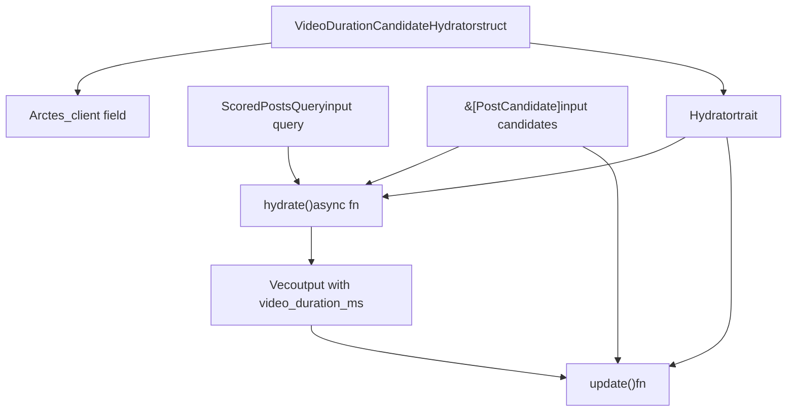
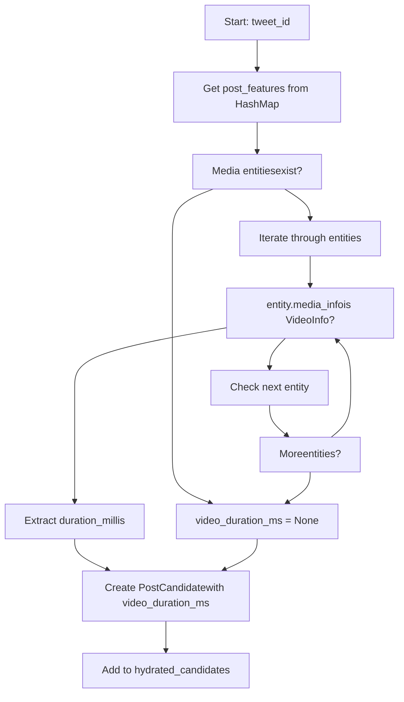
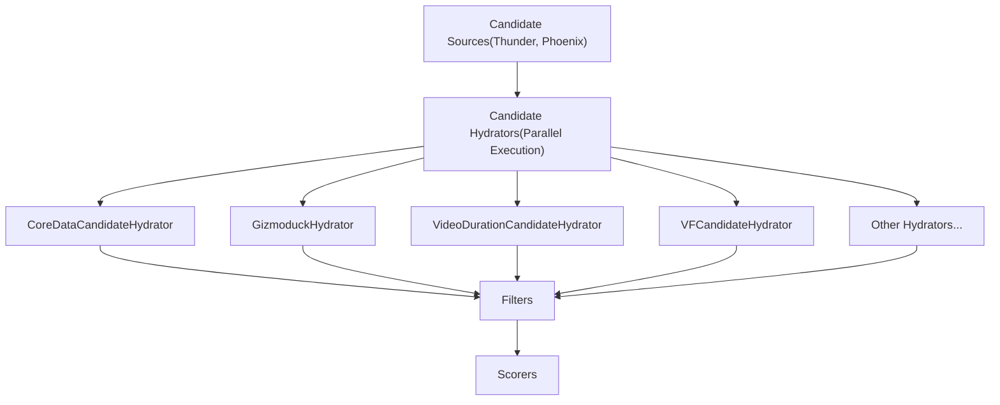

# VideoDurationCandidateHydrator

Relevant source files

-   [home-mixer/candidate\_hydrators/video\_duration\_candidate\_hydrator.rs](https://github.com/xai-org/x-algorithm/blob/aaa167b3/home-mixer/candidate_hydrators/video_duration_candidate_hydrator.rs)

## Purpose and Scope

The `VideoDurationCandidateHydrator` enriches post candidates with video duration metadata measured in milliseconds. This hydrator queries the Tweet Entity Service (TES) to retrieve media entities for each candidate post and extracts the video duration when available. This metadata enables downstream components to make ranking decisions based on video length, such as prioritizing shorter videos or filtering videos beyond certain duration thresholds.

For general information about the Hydrator trait abstraction, see [Hydrator Trait](/xai-org/x-algorithm/3.4-hydrator-trait). For an overview of all candidate hydrators, see [Candidate Hydrators](/xai-org/x-algorithm/4.5-candidate-hydrators). For TES client integration details, see [Tweet Entity Service (TES)](/xai-org/x-algorithm/5.2-tweet-entity-service-(tes)).

**Sources:** [home-mixer/candidate\_hydrators/video\_duration\_candidate\_hydrator.rs1-63](https://github.com/xai-org/x-algorithm/blob/aaa167b3/home-mixer/candidate_hydrators/video_duration_candidate_hydrator.rs#L1-L63)

## Component Architecture

The `VideoDurationCandidateHydrator` struct contains a single dependency on a `TESClient` implementation, which provides access to tweet media entity data. The hydrator follows the standard trait-based architecture used throughout the pipeline framework.


**Diagram: VideoDurationCandidateHydrator Component Structure**

The hydrator implements the `Hydrator<ScoredPostsQuery, PostCandidate>` trait, providing two methods: `hydrate()` for enrichment and `update()` for merging hydrated data into existing candidates.

**Sources:** [home-mixer/candidate\_hydrators/video\_duration\_candidate\_hydrator.rs9-17](https://github.com/xai-org/x-algorithm/blob/aaa167b3/home-mixer/candidate_hydrators/video_duration_candidate_hydrator.rs#L9-L17) [home-mixer/candidate\_hydrators/video\_duration\_candidate\_hydrator.rs19-62](https://github.com/xai-org/x-algorithm/blob/aaa167b3/home-mixer/candidate_hydrators/video_duration_candidate_hydrator.rs#L19-L62)

## Dependencies and Initialization

### Constructor

The `VideoDurationCandidateHydrator::new()` async function creates a new hydrator instance with a provided TES client:

| Parameter | Type | Description |
| --- | --- | --- |
| `tes_client` | `Arc<dyn TESClient + Send + Sync>` | Client for querying Tweet Entity Service |

The constructor is straightforward, storing the TES client reference for use during hydration:

**Sources:** [home-mixer/candidate\_hydrators/video\_duration\_candidate\_hydrator.rs13-17](https://github.com/xai-org/x-algorithm/blob/aaa167b3/home-mixer/candidate_hydrators/video_duration_candidate_hydrator.rs#L13-L17)

### TESClient Dependency

The `tes_client` field is an `Arc`\-wrapped trait object implementing `TESClient + Send + Sync`. This enables the hydrator to be shared across async tasks while abstracting the concrete TES client implementation for testing and production configurations.

**Sources:** [home-mixer/candidate\_hydrators/video\_duration\_candidate\_hydrator.rs10](https://github.com/xai-org/x-algorithm/blob/aaa167b3/home-mixer/candidate_hydrators/video_duration_candidate_hydrator.rs#L10-L10)

## Hydration Implementation

### Method Signature

The `hydrate()` method implements the core `Hydrator` trait method:

```
async fn hydrate(    &self,    _query: &ScoredPostsQuery,    candidates: &[PostCandidate],) -> Result<Vec<PostCandidate>, String>
```
The query parameter is unused (prefixed with `_`) because video duration is tweet-specific metadata that doesn't depend on user context.

**Sources:** [home-mixer/candidate\_hydrators/video\_duration\_candidate\_hydrator.rs22-26](https://github.com/xai-org/x-algorithm/blob/aaa167b3/home-mixer/candidate_hydrators/video_duration_candidate_hydrator.rs#L22-L26)

### Execution Flow

The hydration process follows this sequence:

> **[Mermaid sequence]**
> *(图表结构无法解析)*

**Diagram: VideoDurationCandidateHydrator Execution Flow**

**Sources:** [home-mixer/candidate\_hydrators/video\_duration\_candidate\_hydrator.rs22-57](https://github.com/xai-org/x-algorithm/blob/aaa167b3/home-mixer/candidate_hydrators/video_duration_candidate_hydrator.rs#L22-L57)

### Tweet ID Collection

The hydrator first collects all tweet IDs from the input candidates to enable a single batched TES query:

**Sources:** [home-mixer/candidate\_hydrators/video\_duration\_candidate\_hydrator.rs29](https://github.com/xai-org/x-algorithm/blob/aaa167b3/home-mixer/candidate_hydrators/video_duration_candidate_hydrator.rs#L29-L29)

### Media Entity Retrieval

The hydrator calls `tes_client.get_tweet_media_entities()` with all tweet IDs, receiving a `HashMap` mapping tweet IDs to their media entities. Error handling converts any TES errors to string representations:

**Sources:** [home-mixer/candidate\_hydrators/video\_duration\_candidate\_hydrator.rs31-32](https://github.com/xai-org/x-algorithm/blob/aaa167b3/home-mixer/candidate_hydrators/video_duration_candidate_hydrator.rs#L31-L32)

### Video Duration Extraction

For each tweet, the hydrator processes media entities to find video duration:


**Diagram: Video Duration Extraction Logic**

The extraction logic:

1.  Retrieves media entities for the tweet ID from the response map
2.  Iterates through all media entities
3.  Checks if `entity.media_info` is `MediaInfo::VideoInfo`
4.  Extracts `duration_millis` from the first video found
5.  Sets `video_duration_ms` to `None` if no video is present

**Sources:** [home-mixer/candidate\_hydrators/video\_duration\_candidate\_hydrator.rs35-47](https://github.com/xai-org/x-algorithm/blob/aaa167b3/home-mixer/candidate_hydrators/video_duration_candidate_hydrator.rs#L35-L47)

### Result Construction

The hydrator constructs a new `PostCandidate` for each tweet with only the `video_duration_ms` field populated, using the default values for all other fields:

**Sources:** [home-mixer/candidate\_hydrators/video\_duration\_candidate\_hydrator.rs49-54](https://github.com/xai-org/x-algorithm/blob/aaa167b3/home-mixer/candidate_hydrators/video_duration_candidate_hydrator.rs#L49-L54)

## Update Method

The `update()` method merges hydrated data into existing candidates:

```
fn update(&self, candidate: &mut PostCandidate, hydrated: PostCandidate) {    candidate.video_duration_ms = hydrated.video_duration_ms;}
```
This method is called by the pipeline framework after `hydrate()` returns, copying the `video_duration_ms` field from the hydrated candidate into the mutable candidate reference. This pattern allows the hydrator to return minimal `PostCandidate` structs from `hydrate()` while preserving all other candidate fields.

**Sources:** [home-mixer/candidate\_hydrators/video\_duration\_candidate\_hydrator.rs59-61](https://github.com/xai-org/x-algorithm/blob/aaa167b3/home-mixer/candidate_hydrators/video_duration_candidate_hydrator.rs#L59-L61)

## Data Transformation

The following table shows the data transformation performed by this hydrator:

| Stage | Data Structure | Key Fields | Source |
| --- | --- | --- | --- |
| **Input** | `PostCandidate` | `tweet_id`, `video_duration_ms = None` | Pipeline candidates |
| **TES Query** | `Vec<TweetId>` | Tweet IDs | Extracted from candidates |
| **TES Response** | `HashMap<TweetId, Vec<MediaEntity>>` | `media_info: Option<MediaInfo>` | TES client |
| **Extraction** | `MediaInfo::VideoInfo` | `duration_millis: i64` | Media entity variant |
| **Output** | `PostCandidate` | `video_duration_ms: Option<i64>` | Updated candidate field |

The hydrator enriches candidates with video duration measured in milliseconds, enabling downstream components (filters, scorers, selectors) to make decisions based on video length. Candidates without video content will have `video_duration_ms` remain as `None`.

**Sources:** [home-mixer/candidate\_hydrators/video\_duration\_candidate\_hydrator.rs1-63](https://github.com/xai-org/x-algorithm/blob/aaa167b3/home-mixer/candidate_hydrators/video_duration_candidate_hydrator.rs#L1-L63)

## Integration with Pipeline

The `VideoDurationCandidateHydrator` executes during the candidate hydration phase of the pipeline, after candidates are retrieved from sources but before filtering and scoring. The hydrator runs in parallel with other hydrators as part of the enrichment stage.


**Diagram: VideoDurationCandidateHydrator Position in Pipeline**

The video duration metadata enriched by this hydrator is available to all subsequent pipeline stages, enabling video-specific filtering, scoring adjustments, or feature extraction for the Phoenix ranker model.

**Sources:** [home-mixer/candidate\_hydrators/video\_duration\_candidate\_hydrator.rs19-62](https://github.com/xai-org/x-algorithm/blob/aaa167b3/home-mixer/candidate_hydrators/video_duration_candidate_hydrator.rs#L19-L62)
