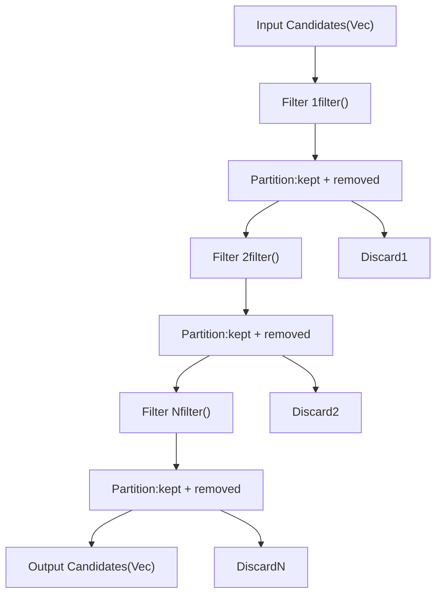

# Filters

Relevant source files

-   [README.md](https://github.com/xai-org/x-algorithm/blob/aaa167b3/README.md?plain=1)
-   [home-mixer/candidate\_pipeline/phoenix\_candidate\_pipeline.rs](https://github.com/xai-org/x-algorithm/blob/aaa167b3/home-mixer/candidate_pipeline/phoenix_candidate_pipeline.rs)

## Purpose and Scope

This document describes the filter implementations in the Home Mixer pipeline that remove ineligible candidates from the feed. Filters operate at two distinct stages: pre-scoring filters that cheaply eliminate candidates before expensive ML scoring, and post-selection filters that perform final validation after selecting top-K candidates.

For information about the generic `Filter` trait and its execution model, see [Filter Trait](/xai-org/x-algorithm/3.5-filter-trait). For scoring implementations that assign relevance scores, see [Scorers](/xai-org/x-algorithm/4.7-scorers).

**Sources:** [README.md275-298](https://github.com/xai-org/x-algorithm/blob/aaa167b3/README.md?plain=1#L275-L298) [home-mixer/candidate\_pipeline/phoenix\_candidate\_pipeline.rs108-143](https://github.com/xai-org/x-algorithm/blob/aaa167b3/home-mixer/candidate_pipeline/phoenix_candidate_pipeline.rs#L108-L143)

## Filtering Architecture

The pipeline employs a two-stage filtering strategy to optimize performance and ensure content quality:

```mermaid
flowchart TD
    Candidates["Enriched Candidates(~5000 posts)"]
    PreFilters["Pre-Scoring Filters(Sequential Execution)"]
    DropDup["DropDuplicatesFilter"]
    CoreData["CoreDataHydrationFilter"]
    Age["AgeFilter"]
    Self["SelfTweetFilter"]
    Retweet["RetweetDeduplicationFilter"]
    Subscription["IneligibleSubscriptionFilter"]
    SeenPosts["PreviouslySeenPostsFilter"]
    ServedPosts["PreviouslyServedPostsFilter"]
    MutedKW["MutedKeywordFilter"]
    AuthorSG["AuthorSocialgraphFilter"]
    Filtered["Filtered Candidates(~1000-2000 posts)"]
    Scoring["Phoenix Scorer +Weighted Scorer"]
    Selection["TopKScoreSelector"]
    Selected["Selected Candidates(top K by score)"]
    PostFilters["Post-Selection Filters(Sequential Execution)"]
    VF["VFFilter"]
    Dedup["DedupConversationFilter"]
    Final["Final Candidates(ranked feed)"]

    Candidates --> PreFilters
    PreFilters --> DropDup
    DropDup --> CoreData
    CoreData --> Age
    Age --> Self
    Self --> Retweet
    Retweet --> Subscription
    Subscription --> SeenPosts
    SeenPosts --> ServedPosts
    ServedPosts --> MutedKW
    MutedKW --> AuthorSG
    AuthorSG --> Filtered
    Filtered --> Scoring
    Scoring --> Selection
    Selection --> Selected
    Selected --> PostFilters
    PostFilters --> VF
    VF --> Dedup
    Dedup --> Final
```

**Pre-scoring filters** run sequentially before ML scoring to remove obviously ineligible candidates. This reduces the number of candidates that require expensive ML inference, improving latency and throughput.

**Post-selection filters** run after top-K selection to perform final validation checks that may require additional data fetched during post-selection hydration (e.g., visibility filtering status).

**Sources:** [README.md275-298](https://github.com/xai-org/x-algorithm/blob/aaa167b3/README.md?plain=1#L275-L298) [home-mixer/candidate\_pipeline/phoenix\_candidate\_pipeline.rs108-143](https://github.com/xai-org/x-algorithm/blob/aaa167b3/home-mixer/candidate_pipeline/phoenix_candidate_pipeline.rs#L108-L143)

## Filter Execution Model

Filters implement the `Filter<Q, C>` trait from the candidate pipeline framework. The pipeline executes filters sequentially, with each filter partitioning candidates into "kept" and "removed" sets:

Each filter receives the "kept" candidates from the previous filter and returns a tuple of `(kept, removed)` vectors. The pipeline logs removal statistics for monitoring and debugging.

**Sources:** [home-mixer/candidate\_pipeline/phoenix\_candidate\_pipeline.rs108-120](https://github.com/xai-org/x-algorithm/blob/aaa167b3/home-mixer/candidate_pipeline/phoenix_candidate_pipeline.rs#L108-L120)

## Pre-Scoring Filters

The `PhoenixCandidatePipeline` applies ten pre-scoring filters in the following order:

| Filter | Purpose | Implementation |
| --- | --- | --- |
| `DropDuplicatesFilter` | Remove duplicate post IDs from the candidate set | Maintains a `HashSet` of seen IDs |
| `CoreDataHydrationFilter` | Remove candidates that failed core data hydration | Checks for presence of `core_data` field |
| `AgeFilter` | Remove posts older than configured maximum age | Extracts timestamp from snowflake ID, see [AgeFilter](/xai-org/x-algorithm/4.6.1-agefilter) |
| `SelfTweetFilter` | Remove posts authored by the requesting user | Compares author ID with viewer ID |
| `RetweetDeduplicationFilter` | Remove duplicate retweets of the same content | Deduplicates by source tweet ID |
| `IneligibleSubscriptionFilter` | Remove subscription content the user cannot access | Checks subscription status and viewer eligibility |
| `PreviouslySeenPostsFilter` | Remove posts the user has already seen | Uses bloom filter from query |
| `PreviouslyServedPostsFilter` | Remove posts served in recent requests | Uses bloom filter from query |
| `MutedKeywordFilter` | Remove posts containing user's muted keywords | Matches against user's muted keyword list |
| `AuthorSocialgraphFilter` | Remove posts from blocked or muted authors | See [AuthorSocialgraphFilter](/xai-org/x-algorithm/4.6.2-authorsocialgraphfilter) |

The filters execute sequentially in this specific order to optimize performance: cheap filters (duplicate detection, core data check) run first, followed by progressively more expensive filters.

**Sources:** [home-mixer/candidate\_pipeline/phoenix\_candidate\_pipeline.rs109-120](https://github.com/xai-org/x-algorithm/blob/aaa167b3/home-mixer/candidate_pipeline/phoenix_candidate_pipeline.rs#L109-L120) [README.md280-291](https://github.com/xai-org/x-algorithm/blob/aaa167b3/README.md?plain=1#L280-L291)

## Post-Selection Filters

After scoring and top-K selection, the pipeline applies two post-selection filters:

| Filter | Purpose | Implementation |
| --- | --- | --- |
| `VFFilter` | Remove posts flagged by visibility filtering (deleted, spam, violence, gore, etc.) | Uses visibility filtering results from `VFCandidateHydrator` |
| `DedupConversationFilter` | Deduplicate multiple branches of the same conversation thread | Groups by conversation ID and selects highest-scoring branch |

These filters run after selection because they depend on data fetched during post-selection hydration or require evaluation only on the final candidate set.

**Sources:** [home-mixer/candidate\_pipeline/phoenix\_candidate\_pipeline.rs142-143](https://github.com/xai-org/x-algorithm/blob/aaa167b3/home-mixer/candidate_pipeline/phoenix_candidate_pipeline.rs#L142-L143) [README.md293-297](https://github.com/xai-org/x-algorithm/blob/aaa167b3/README.md?plain=1#L293-L297)

## Filter Pipeline Integration

The following diagram shows how filters integrate with the `PhoenixCandidatePipeline` struct:

```mermaid
flowchart TD
    Pipeline["PhoenixCandidatePipeline"]
    QH["query_hydrators:Vec<Box<dyn QueryHydrator>>"]
    Sources["sources:Vec<Box<dyn Source>>"]
    Hydrators["hydrators:Vec<Box<dyn Hydrator>>"]
    Filters["filters:Vec<Box<dyn Filter>>"]
    Scorers["scorers:Vec<Box<dyn Scorer>>"]
    Selector["selector:TopKScoreSelector"]
    PostHydrators["post_selection_hydrators:Vec<Box<dyn Hydrator>>"]
    PostFilters["post_selection_filters:Vec<Box<dyn Filter>>"]
    F1["DropDuplicatesFilter"]
    F2["CoreDataHydrationFilter"]
    F3["AgeFilter"]
    F4["SelfTweetFilter"]
    F5["RetweetDeduplicationFilter"]
    F6["IneligibleSubscriptionFilter"]
    F7["PreviouslySeenPostsFilter"]
    F8["PreviouslyServedPostsFilter"]
    F9["MutedKeywordFilter"]
    F10["AuthorSocialgraphFilter"]
    PF1["VFFilter"]
    PF2["DedupConversationFilter"]

    Pipeline --> QH
    Pipeline --> Sources
    Pipeline --> Hydrators
    Pipeline --> Filters
    Pipeline --> Scorers
    Pipeline --> Selector
    Pipeline --> PostHydrators
    Pipeline --> PostFilters
    Filters --> F1
    Filters --> F2
    Filters --> F3
    Filters --> F4
    Filters --> F5
    Filters --> F6
    Filters --> F7
    Filters --> F8
    Filters --> F9
    Filters --> F10
    PostFilters --> PF1
    PostFilters --> PF2
```

The `build_with_clients` method initializes filter vectors with concrete filter implementations. The `CandidatePipeline` trait's `execute` method orchestrates filter execution at the appropriate pipeline stages.

**Sources:** [home-mixer/candidate\_pipeline/phoenix\_candidate\_pipeline.rs72-160](https://github.com/xai-org/x-algorithm/blob/aaa167b3/home-mixer/candidate_pipeline/phoenix_candidate_pipeline.rs#L72-L160)

## Filter Initialization

Filters are instantiated in the `build_with_clients` method:

```mermaid
flowchart TD
    Build["PhoenixCandidatePipeline::build_with_clients()"]
    PreVec["filters: Vec<Box<dyn Filter>>"]
    PostVec["post_selection_filters:Vec<Box<dyn Filter>>"]
    DD["Box::new(DropDuplicatesFilter)"]
    CD["Box::new(CoreDataHydrationFilter)"]
    Age["Box::new(AgeFilter::new(Duration::from_secs(params::MAX_POST_AGE)))"]
    Self["Box::new(SelfTweetFilter)"]
    RT["Box::new(RetweetDeduplicationFilter)"]
    Sub["Box::new(IneligibleSubscriptionFilter)"]
    Seen["Box::new(PreviouslySeenPostsFilter)"]
    Served["Box::new(PreviouslyServedPostsFilter)"]
    Muted["Box::new(MutedKeywordFilter::new())"]
    Author["Box::new(AuthorSocialgraphFilter)"]
    VF["Box::new(VFFilter)"]
    Dedup["Box::new(DedupConversationFilter)"]

    Build --> PreVec
    Build --> PostVec
    PreVec --> DD
    PreVec --> CD
    PreVec --> Age
    PreVec --> Self
    PreVec --> RT
    PreVec --> Sub
    PreVec --> Seen
    PreVec --> Served
    PreVec --> Muted
    PreVec --> Author
    PostVec --> VF
    PostVec --> Dedup
```

Most filters are stateless and constructed with `new()`. The `AgeFilter` requires configuration of the maximum post age parameter. All filters are type-erased as `Box<dyn Filter<ScoredPostsQuery, PostCandidate>>` and stored in vectors.

**Sources:** [home-mixer/candidate\_pipeline/phoenix\_candidate\_pipeline.rs108-143](https://github.com/xai-org/x-algorithm/blob/aaa167b3/home-mixer/candidate_pipeline/phoenix_candidate_pipeline.rs#L108-L143)

## Filter Implementation Details

Detailed documentation for specific filter implementations:

-   **[AgeFilter](/xai-org/x-algorithm/4.6.1-agefilter)**: Filters candidates based on post age using snowflake timestamp extraction and configurable maximum age duration
-   **[AuthorSocialgraphFilter](/xai-org/x-algorithm/4.6.2-authorsocialgraphfilter)**: Filters candidates from blocked or muted authors using the viewer's social graph data
-   **[Additional Filters](/xai-org/x-algorithm/4.6.3-additional-filters)**: Documentation for other filters including `DropDuplicatesFilter`, `SelfTweetFilter`, `PreviouslySeenPostsFilter`, `MutedKeywordFilter`, and post-selection filters

Each filter operates independently and can be tested in isolation. The sequential execution order ensures that dependencies between filters are respected (e.g., `CoreDataHydrationFilter` must run before filters that access core data fields).

**Sources:** [home-mixer/candidate\_pipeline/phoenix\_candidate\_pipeline.rs108-143](https://github.com/xai-org/x-algorithm/blob/aaa167b3/home-mixer/candidate_pipeline/phoenix_candidate_pipeline.rs#L108-L143)

## Performance Characteristics

The two-stage filtering strategy provides significant performance benefits:

| Stage | Typical Input Size | Typical Output Size | Cost per Candidate | Total Cost |
| --- | --- | --- | --- | --- |
| Pre-scoring filters | ~5,000 candidates | ~1,000-2,000 candidates | Low (in-memory operations) | ~1-2ms |
| ML scoring | ~1,000-2,000 candidates | ~1,000-2,000 scored | High (transformer inference) | ~50-100ms |
| Selection | ~1,000-2,000 candidates | ~100-200 selected | Low (sorting) | <1ms |
| Post-selection filters | ~100-200 candidates | ~50-100 final | Medium (visibility API calls) | ~5-10ms |

By filtering aggressively before ML scoring, the pipeline reduces the number of expensive transformer inference calls by 60-80%, improving overall latency from ~150ms to ~60ms.

**Sources:** [README.md275-298](https://github.com/xai-org/x-algorithm/blob/aaa167b3/README.md?plain=1#L275-L298)
