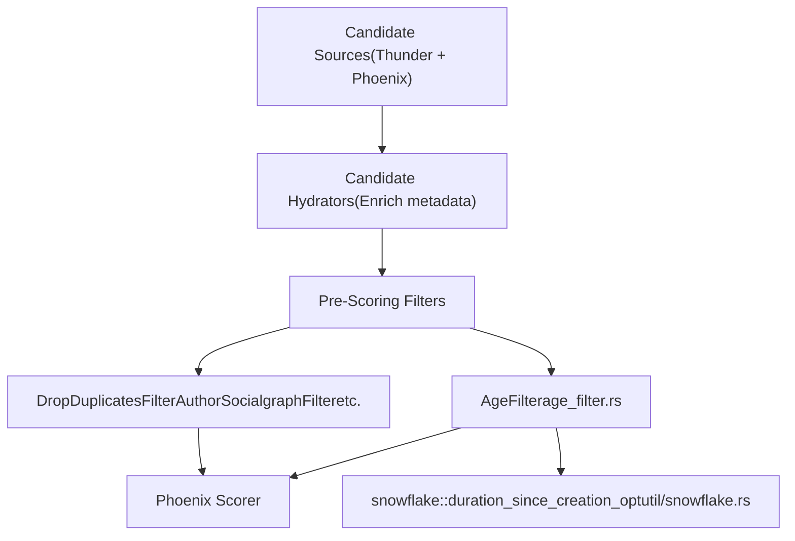
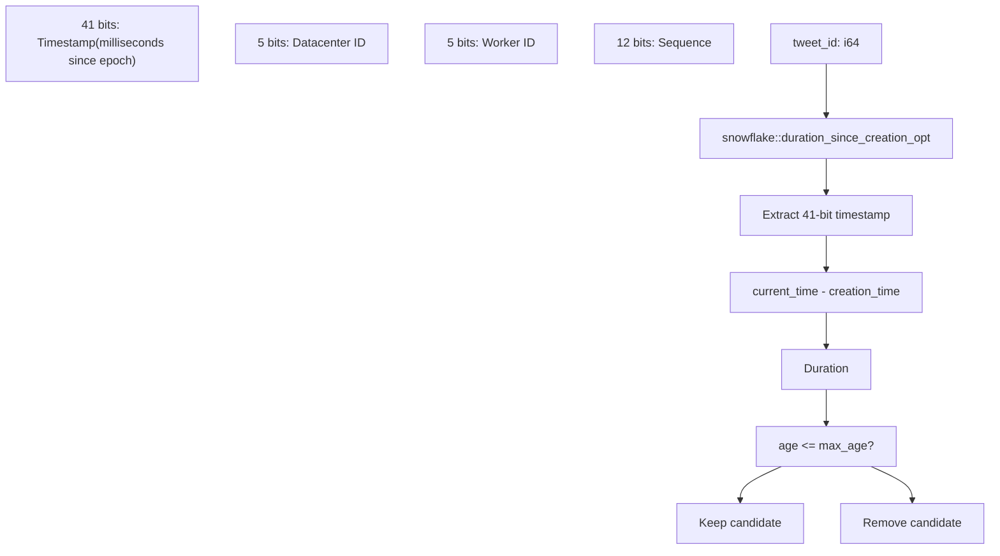
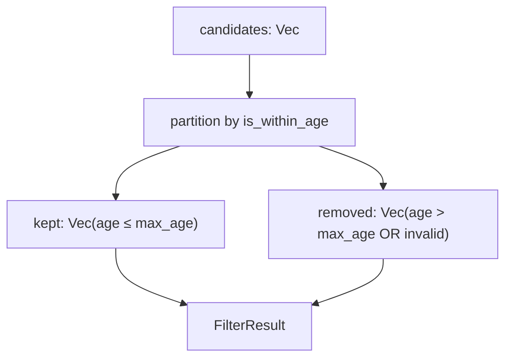
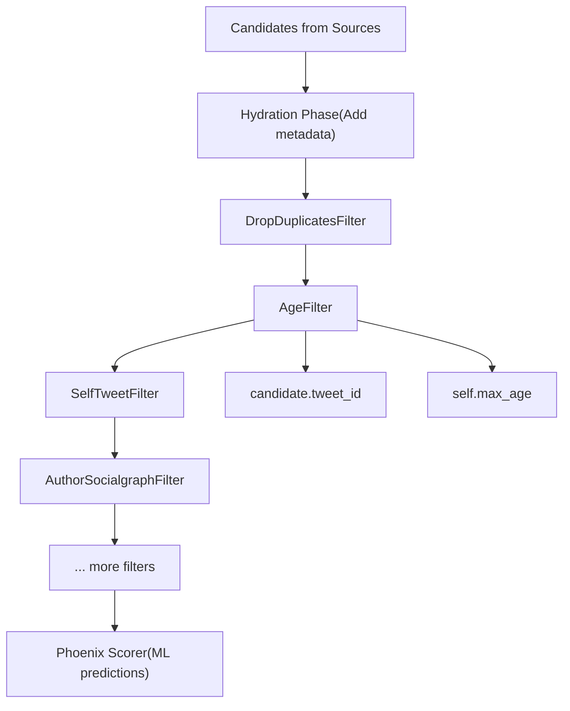
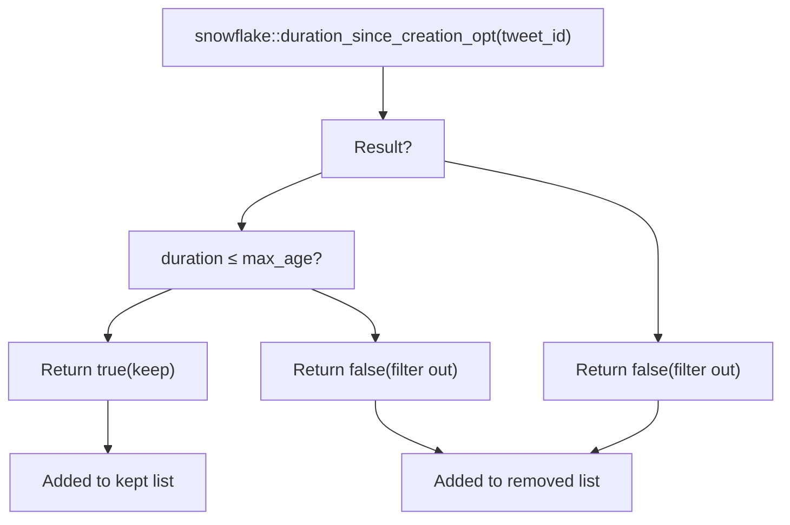
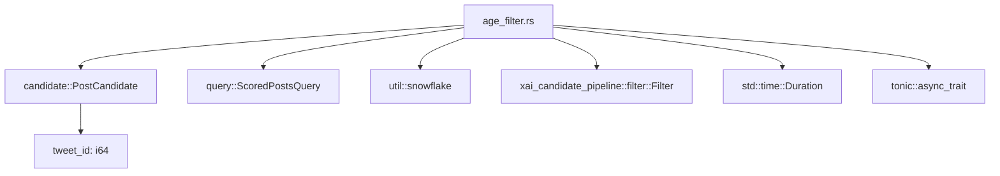

# AgeFilter

Relevant source files

-   [home-mixer/filters/age\_filter.rs](https://github.com/xai-org/x-algorithm/blob/aaa167b3/home-mixer/filters/age_filter.rs)

## Purpose and Scope

The `AgeFilter` removes tweet candidates from the recommendation pipeline that exceed a configured maximum age threshold. This filter prevents the "For You" feed from displaying stale content by extracting post creation timestamps from Twitter's snowflake IDs and comparing them against the current time.

This page documents the `AgeFilter` implementation located in [home-mixer/filters/age\_filter.rs](https://github.com/xai-org/x-algorithm/blob/aaa167b3/home-mixer/filters/age_filter.rs) For information about other filtering mechanisms, see [Additional Filters](/xai-org/x-algorithm/4.6.3-additional-filters). For the broader filtering framework, see [Filter Trait](/xai-org/x-algorithm/3.5-filter-trait).

**Sources:** [home-mixer/filters/age\_filter.rs1-39](https://github.com/xai-org/x-algorithm/blob/aaa167b3/home-mixer/filters/age_filter.rs#L1-L39)

## Overview

The `AgeFilter` is a pre-scoring filter that operates early in the pipeline to eliminate outdated content before expensive ML scoring operations. It leverages the temporal information embedded in Twitter's snowflake ID format to determine post age without requiring external service calls.

### Architecture Context


**Sources:** [home-mixer/filters/age\_filter.rs1-39](https://github.com/xai-org/x-algorithm/blob/aaa167b3/home-mixer/filters/age_filter.rs#L1-L39)

## Implementation Details

### Data Structure

The `AgeFilter` struct contains a single configuration field:

| Field | Type | Description |
| --- | --- | --- |
| `max_age` | `Duration` | Maximum allowed age for posts to remain in the candidate set |

**Sources:** [home-mixer/filters/age\_filter.rs9-11](https://github.com/xai-org/x-algorithm/blob/aaa167b3/home-mixer/filters/age_filter.rs#L9-L11)

### Snowflake Timestamp Extraction

The filter relies on Twitter's snowflake ID format, where tweet IDs encode creation timestamps in their most significant bits. This allows age calculation without external service calls.


**Sources:** [home-mixer/filters/age\_filter.rs18-22](https://github.com/xai-org/x-algorithm/blob/aaa167b3/home-mixer/filters/age_filter.rs#L18-L22)

### Filter Logic

The core filtering operation is implemented in the `filter` method, which conforms to the `Filter<ScoredPostsQuery, PostCandidate>` trait:

> **[Mermaid sequence]**
> *(图表结构无法解析)*

**Sources:** [home-mixer/filters/age\_filter.rs26-37](https://github.com/xai-org/x-algorithm/blob/aaa167b3/home-mixer/filters/age_filter.rs#L26-L37)

### Code Entity Mapping

The following table maps natural language concepts to specific code entities:

| Concept | Code Entity | Location |
| --- | --- | --- |
| Filter implementation | `AgeFilter` struct | [home-mixer/filters/age\_filter.rs9-11](https://github.com/xai-org/x-algorithm/blob/aaa167b3/home-mixer/filters/age_filter.rs#L9-L11) |
| Constructor | `AgeFilter::new` | [home-mixer/filters/age\_filter.rs14-16](https://github.com/xai-org/x-algorithm/blob/aaa167b3/home-mixer/filters/age_filter.rs#L14-L16) |
| Age validation | `AgeFilter::is_within_age` | [home-mixer/filters/age\_filter.rs18-22](https://github.com/xai-org/x-algorithm/blob/aaa167b3/home-mixer/filters/age_filter.rs#L18-L22) |
| Filter trait method | `AgeFilter::filter` | [home-mixer/filters/age\_filter.rs27-37](https://github.com/xai-org/x-algorithm/blob/aaa167b3/home-mixer/filters/age_filter.rs#L27-L37) |
| Timestamp extraction | `snowflake::duration_since_creation_opt` | Referenced at [home-mixer/filters/age\_filter.rs19](https://github.com/xai-org/x-algorithm/blob/aaa167b3/home-mixer/filters/age_filter.rs#L19-L19) |
| Pipeline integration | `Filter<ScoredPostsQuery, PostCandidate>` | [home-mixer/filters/age\_filter.rs26](https://github.com/xai-org/x-algorithm/blob/aaa167b3/home-mixer/filters/age_filter.rs#L26-L26) |

**Sources:** [home-mixer/filters/age\_filter.rs1-39](https://github.com/xai-org/x-algorithm/blob/aaa167b3/home-mixer/filters/age_filter.rs#L1-L39)

## Functional Behavior

### Age Validation Logic

The `is_within_age` method implements the core age validation:

1.  **Extract timestamp**: Calls `snowflake::duration_since_creation_opt(tweet_id)` to extract the age from the snowflake ID
2.  **Compare duration**: Checks if the extracted age is less than or equal to `max_age`
3.  **Handle missing timestamps**: Returns `false` if timestamp extraction fails (via `unwrap_or(false)`)

This defensive approach ensures that tweets with invalid IDs are filtered out rather than causing pipeline failures.

**Sources:** [home-mixer/filters/age\_filter.rs18-22](https://github.com/xai-org/x-algorithm/blob/aaa167b3/home-mixer/filters/age_filter.rs#L18-L22)

### Partition Strategy

The filter uses Rust's `partition` iterator method to efficiently separate candidates:


The partitioning operation occurs at [home-mixer/filters/age\_filter.rs32-34](https://github.com/xai-org/x-algorithm/blob/aaa167b3/home-mixer/filters/age_filter.rs#L32-L34) using the closure `|c| self.is_within_age(c.tweet_id)` to classify each candidate.

**Sources:** [home-mixer/filters/age\_filter.rs32-36](https://github.com/xai-org/x-algorithm/blob/aaa167b3/home-mixer/filters/age_filter.rs#L32-L36)

## Configuration and Initialization

### Constructor

The `AgeFilter::new` method provides a simple constructor that accepts a `Duration` parameter:

```
AgeFilter::new(max_age: Duration)
```
Typical initialization in the pipeline would use a duration like `Duration::from_hours(48)` to filter posts older than 48 hours.

**Sources:** [home-mixer/filters/age\_filter.rs14-16](https://github.com/xai-org/x-algorithm/blob/aaa167b3/home-mixer/filters/age_filter.rs#L14-L16)

### Configuration Examples

| Use Case | Configuration | Effect |
| --- | --- | --- |
| Recent content only | `Duration::from_hours(24)` | Keep only posts from last 24 hours |
| Extended freshness | `Duration::from_hours(72)` | Keep posts up to 3 days old |
| Real-time focus | `Duration::from_hours(6)` | Keep only very recent posts |

## Integration in Pipeline

### Filter Trait Implementation

The `AgeFilter` implements the `Filter<ScoredPostsQuery, PostCandidate>` trait defined in the candidate pipeline framework. This trait requires the asynchronous `filter` method:

```
async fn filter(    &self,    _query: &ScoredPostsQuery,    candidates: Vec<PostCandidate>,) -> Result<FilterResult<PostCandidate>, String>
```
**Sources:** [home-mixer/filters/age\_filter.rs26-37](https://github.com/xai-org/x-algorithm/blob/aaa167b3/home-mixer/filters/age_filter.rs#L26-L37)

### Query Independence

Note that the `filter` method signature includes `_query: &ScoredPostsQuery` with an underscore prefix, indicating that the query parameter is intentionally unused. The `AgeFilter` operates solely on candidate data (tweet IDs) and does not require query context like user preferences or localization.

**Sources:** [home-mixer/filters/age\_filter.rs29](https://github.com/xai-org/x-algorithm/blob/aaa167b3/home-mixer/filters/age_filter.rs#L29-L29)

### Pipeline Execution Order


The `AgeFilter` executes sequentially with other filters in the pre-scoring phase, after hydration but before expensive ML scoring operations.

**Sources:** [home-mixer/filters/age\_filter.rs1-39](https://github.com/xai-org/x-algorithm/blob/aaa167b3/home-mixer/filters/age_filter.rs#L1-L39)

## Performance Characteristics

### Computational Complexity

| Metric | Complexity | Description |
| --- | --- | --- |
| Time complexity | O(n) | Linear scan through all candidates |
| Space complexity | O(n) | Creates new kept/removed vectors |
| External calls | 0 | No network requests; pure computation |

### Performance Advantages

1.  **No external dependencies**: Age extraction from snowflake IDs is a local bitwise operation
2.  **Early filtering**: Reduces the number of candidates sent to expensive ML scoring
3.  **Fail-fast behavior**: Invalid tweet IDs are immediately filtered without raising errors

**Sources:** [home-mixer/filters/age\_filter.rs18-37](https://github.com/xai-org/x-algorithm/blob/aaa167b3/home-mixer/filters/age_filter.rs#L18-L37)

## Error Handling

The `AgeFilter` demonstrates defensive programming through its error handling strategy:


The `unwrap_or(false)` at [home-mixer/filters/age\_filter.rs21](https://github.com/xai-org/x-algorithm/blob/aaa167b3/home-mixer/filters/age_filter.rs#L21-L21) ensures that candidates with invalid snowflake IDs are filtered out rather than causing panics or errors that would break the pipeline.

**Sources:** [home-mixer/filters/age\_filter.rs18-22](https://github.com/xai-org/x-algorithm/blob/aaa167b3/home-mixer/filters/age_filter.rs#L18-L22)

## Dependencies

### Module Dependencies


**Sources:** [home-mixer/filters/age\_filter.rs1-6](https://github.com/xai-org/x-algorithm/blob/aaa167b3/home-mixer/filters/age_filter.rs#L1-L6)

### Key Imports

| Import | Purpose |
| --- | --- |
| `PostCandidate` | Candidate type containing `tweet_id` field |
| `ScoredPostsQuery` | Query type (unused but required by trait) |
| `snowflake` | Utility module for timestamp extraction |
| `Filter` trait | Framework trait this filter implements |
| `FilterResult` | Return type containing kept/removed partitions |

**Sources:** [home-mixer/filters/age\_filter.rs1-6](https://github.com/xai-org/x-algorithm/blob/aaa167b3/home-mixer/filters/age_filter.rs#L1-L6)
