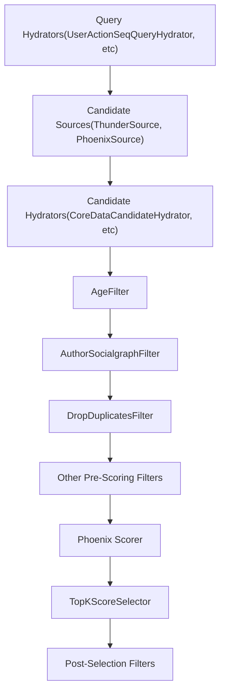
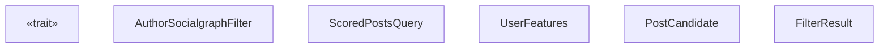
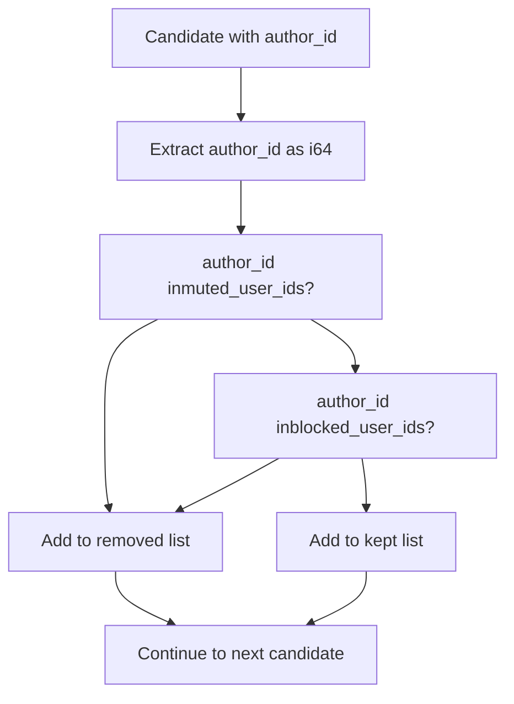
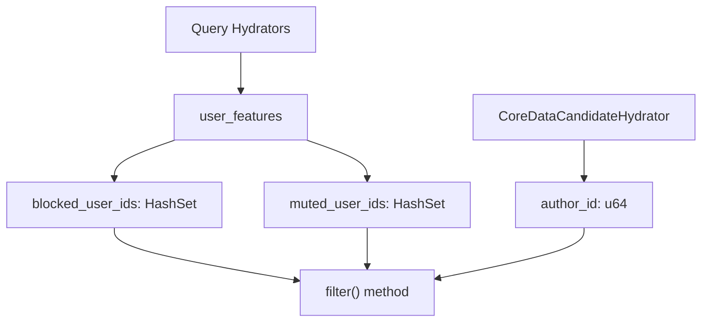
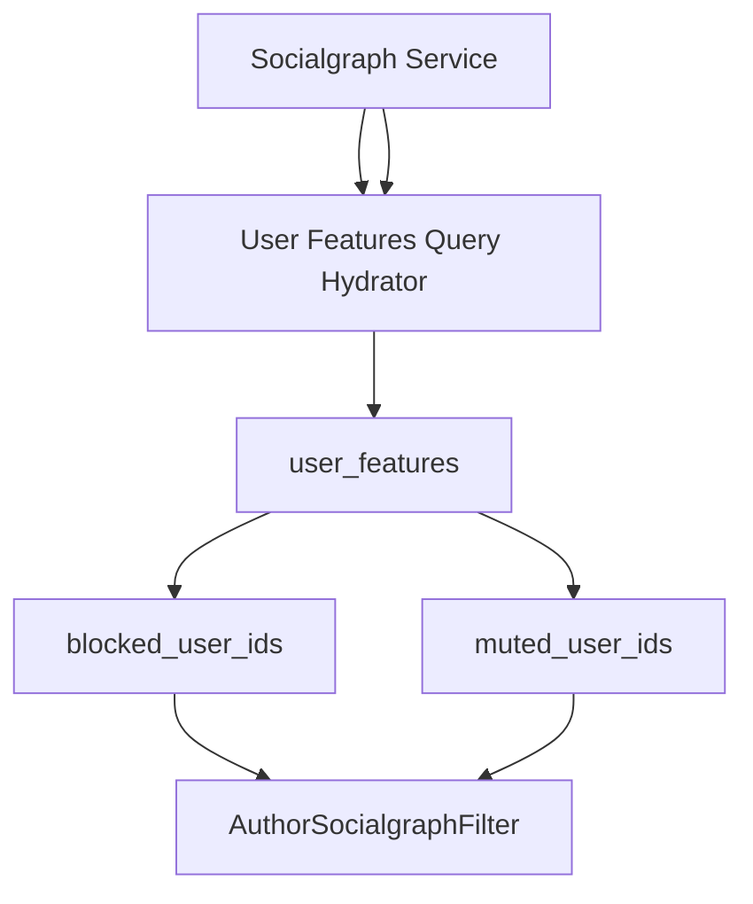

# AuthorSocialgraphFilter

Relevant source files

-   [home-mixer/filters/author\_socialgraph\_filter.rs](https://github.com/xai-org/x-algorithm/blob/aaa167b3/home-mixer/filters/author_socialgraph_filter.rs)

## Purpose and Scope

The `AuthorSocialgraphFilter` removes candidates authored by users that the viewer has blocked or muted. This filter enforces social graph boundaries by preventing content from unwanted authors from appearing in the viewer's "For You" feed, regardless of relevance scores.

This document covers the filter's implementation, algorithm, data dependencies, and integration with the candidate pipeline framework. For information about the broader filtering system and other filter implementations, see [Filters](/xai-org/x-algorithm/4.6-filters). For the generic Filter trait specification, see [Filter Trait](/xai-org/x-algorithm/3.5-filter-trait).

**Sources:** [home-mixer/filters/author\_socialgraph\_filter.rs1-43](https://github.com/xai-org/x-algorithm/blob/aaa167b3/home-mixer/filters/author_socialgraph_filter.rs#L1-L43)

---

## Overview

The `AuthorSocialgraphFilter` is a pre-scoring filter that executes early in the pipeline to eliminate candidates from blocked or muted authors before expensive ML scoring operations. It implements the `Filter<ScoredPostsQuery, PostCandidate>` trait from the candidate pipeline framework.

### Key Characteristics

| Characteristic | Value |
| --- | --- |
| **Trait Implementation** | `Filter<ScoredPostsQuery, PostCandidate>` |
| **Execution Stage** | Pre-scoring (before Phoenix Scorer) |
| **Execution Mode** | Sequential |
| **Primary Data Source** | `ScoredPostsQuery.user_features` |
| **Performance Impact** | Low (set membership checks) |
| **Filtering Criteria** | Author in blocked\_user\_ids OR muted\_user\_ids |

**Sources:** [home-mixer/filters/author\_socialgraph\_filter.rs1-43](https://github.com/xai-org/x-algorithm/blob/aaa167b3/home-mixer/filters/author_socialgraph_filter.rs#L1-L43)

---

## Pipeline Integration

The following diagram shows where `AuthorSocialgraphFilter` executes within the PhoenixCandidatePipeline:


**Diagram: AuthorSocialgraphFilter Position in Pipeline**

The filter executes after candidate hydration (which populates `author_id` fields) but before ML scoring, reducing the number of candidates that require expensive inference.

**Sources:** [home-mixer/filters/author\_socialgraph\_filter.rs1-43](https://github.com/xai-org/x-algorithm/blob/aaa167b3/home-mixer/filters/author_socialgraph_filter.rs#L1-L43)

---

## Implementation Details

### Struct Definition

The `AuthorSocialgraphFilter` is a zero-sized type (ZST) that carries no state:

```
pub struct AuthorSocialgraphFilter;
```
All filtering logic is stateless and depends entirely on data from the query and candidates.

**Sources:** [home-mixer/filters/author\_socialgraph\_filter.rs7](https://github.com/xai-org/x-algorithm/blob/aaa167b3/home-mixer/filters/author_socialgraph_filter.rs#L7-L7)

### Filter Trait Implementation

The struct implements the asynchronous `Filter` trait:


**Diagram: AuthorSocialgraphFilter Type Relationships**

**Sources:** [home-mixer/filters/author\_socialgraph\_filter.rs10-15](https://github.com/xai-org/x-algorithm/blob/aaa167b3/home-mixer/filters/author_socialgraph_filter.rs#L10-L15)

---

## Filter Algorithm

### Data Extraction

The filter begins by extracting blocked and muted user ID sets from the query:

```
let viewer_blocked_user_ids = query.user_features.blocked_user_ids.clone();let viewer_muted_user_ids = query.user_features.muted_user_ids.clone();
```
These sets are populated by query hydrators earlier in the pipeline and contain the IDs of users the viewer has blocked or muted.

**Sources:** [home-mixer/filters/author\_socialgraph\_filter.rs16-17](https://github.com/xai-org/x-algorithm/blob/aaa167b3/home-mixer/filters/author_socialgraph_filter.rs#L16-L17)

### Early Return Optimization

If both sets are empty, the filter short-circuits and returns all candidates as kept:

```
if viewer_blocked_user_ids.is_empty() && viewer_muted_user_ids.is_empty() {    return Ok(FilterResult {        kept: candidates,        removed: Vec::new(),    });}
```
This optimization avoids iterating through candidates when the viewer has no blocked or muted users, which is common for new accounts.

**Sources:** [home-mixer/filters/author\_socialgraph\_filter.rs19-24](https://github.com/xai-org/x-algorithm/blob/aaa167b3/home-mixer/filters/author_socialgraph_filter.rs#L19-L24)

### Candidate Partitioning

For each candidate, the filter checks if the author is blocked or muted:


**Diagram: Candidate Filtering Decision Flow**

The implementation converts `author_id` from `u64` to `i64` for set membership checks:

```
for candidate in candidates {    let author_id = candidate.author_id as i64;    let muted = viewer_muted_user_ids.contains(&author_id);    let blocked = viewer_blocked_user_ids.contains(&author_id);    if muted || blocked {        removed.push(candidate);    } else {        kept.push(candidate);    }}
```
Candidates are partitioned into two vectors:

-   **`kept`**: Candidates from authors not blocked or muted
-   **`removed`**: Candidates from blocked or muted authors

**Sources:** [home-mixer/filters/author\_socialgraph\_filter.rs29-38](https://github.com/xai-org/x-algorithm/blob/aaa167b3/home-mixer/filters/author_socialgraph_filter.rs#L29-L38)

### Filter Result

The method returns a `FilterResult` struct containing both kept and removed candidates:

```
Ok(FilterResult { kept, removed })
```
The removed candidates are tracked for metrics and debugging purposes, though they do not proceed through the pipeline.

**Sources:** [home-mixer/filters/author\_socialgraph\_filter.rs40](https://github.com/xai-org/x-algorithm/blob/aaa167b3/home-mixer/filters/author_socialgraph_filter.rs#L40-L40)

---

## Data Dependencies

The filter requires specific fields to be populated by earlier pipeline stages:


**Diagram: AuthorSocialgraphFilter Data Dependencies**

### Required Query Fields

| Field Path | Type | Source | Purpose |
| --- | --- | --- | --- |
| `query.user_features.blocked_user_ids` | `HashSet<i64>` | Query Hydrators | IDs of users blocked by viewer |
| `query.user_features.muted_user_ids` | `HashSet<i64>` | Query Hydrators | IDs of users muted by viewer |

### Required Candidate Fields

| Field Path | Type | Source | Purpose |
| --- | --- | --- | --- |
| `candidate.author_id` | `u64` | CoreDataCandidateHydrator | ID of tweet author |

**Sources:** [home-mixer/filters/author\_socialgraph\_filter.rs16-30](https://github.com/xai-org/x-algorithm/blob/aaa167b3/home-mixer/filters/author_socialgraph_filter.rs#L16-L30)

---

## Performance Characteristics

### Time Complexity

The filter performs the following operations:

1.  **Set extraction**: O(1) - cloning references to hash sets
2.  **Early return check**: O(1) - checking if both sets are empty
3.  **Candidate iteration**: O(n) where n = number of candidates
4.  **Set membership checks**: O(1) per candidate (HashSet lookup)

**Overall complexity**: O(n) where n is the number of input candidates

### Space Complexity

-   **Input**: O(n) for candidate vector
-   **Output**: O(n) for kept + removed vectors
-   **Auxiliary**: O(1) - no additional data structures allocated

### Optimization Strategies

The implementation includes one key optimization:

**Early return when no blocked/muted users**: Lines 19-24 of [home-mixer/filters/author\_socialgraph\_filter.rs19-24](https://github.com/xai-org/x-algorithm/blob/aaa167b3/home-mixer/filters/author_socialgraph_filter.rs#L19-L24) check if both sets are empty before iterating through candidates. For users with no blocked or muted accounts, this reduces execution time to near-zero.

**Sources:** [home-mixer/filters/author\_socialgraph\_filter.rs19-41](https://github.com/xai-org/x-algorithm/blob/aaa167b3/home-mixer/filters/author_socialgraph_filter.rs#L19-L41)

---

## Usage Example

The following sequence diagram illustrates how `AuthorSocialgraphFilter` processes a batch of candidates:

**Diagram: AuthorSocialgraphFilter Execution Sequence**

**Sources:** [home-mixer/filters/author\_socialgraph\_filter.rs11-41](https://github.com/xai-org/x-algorithm/blob/aaa167b3/home-mixer/filters/author_socialgraph_filter.rs#L11-L41)

---

## Integration with Socialgraph System

The blocked and muted user IDs originate from the viewer's social graph, which is managed by external services and populated into the query during hydration:


**Diagram: Socialgraph Data Flow to Filter**

The filter acts as an enforcement point for viewer preferences expressed through blocking and muting actions.

**Sources:** [home-mixer/filters/author\_socialgraph\_filter.rs16-17](https://github.com/xai-org/x-algorithm/blob/aaa167b3/home-mixer/filters/author_socialgraph_filter.rs#L16-L17)

---

## Error Handling

The `filter()` method returns `Result<FilterResult<PostCandidate>, String>`, though the current implementation never returns an error. All operations are infallible:

-   Set cloning cannot fail
-   Set membership checks cannot fail
-   Vector operations have sufficient capacity

If future enhancements require error handling (e.g., fetching additional socialgraph data), the `String` error type provides basic error reporting.

**Sources:** [home-mixer/filters/author\_socialgraph\_filter.rs15](https://github.com/xai-org/x-algorithm/blob/aaa167b3/home-mixer/filters/author_socialgraph_filter.rs#L15-L15)

---

## Relationship to Other Filters

The `AuthorSocialgraphFilter` complements other filters in the pre-scoring stage:

| Filter | Purpose | Relationship to AuthorSocialgraphFilter |
| --- | --- | --- |
| **AgeFilter** | Remove old posts | Independent - operates on temporal data |
| **SelfTweetFilter** | Remove viewer's own tweets | Related - both filter by author, but different criteria |
| **MutedKeywordFilter** | Remove posts with muted keywords | Independent - operates on content rather than author |
| **DropDuplicatesFilter** | Remove duplicate post IDs | Independent - operates on post IDs |

These filters execute sequentially, with each reducing the candidate set for subsequent filters. The order is optimized to apply cheaper filters first.

**Sources:** [home-mixer/filters/author\_socialgraph\_filter.rs1-43](https://github.com/xai-org/x-algorithm/blob/aaa167b3/home-mixer/filters/author_socialgraph_filter.rs#L1-L43)

---

## Testing Considerations

When testing `AuthorSocialgraphFilter`, consider the following scenarios:

| Scenario | Input | Expected Output |
| --- | --- | --- |
| **Empty block/mute lists** | Both sets empty | All candidates kept (early return) |
| **Author in blocked list** | Author ID in blocked\_user\_ids | Candidate removed |
| **Author in muted list** | Author ID in muted\_user\_ids | Candidate removed |
| **Author in both lists** | Author ID in both sets | Candidate removed |
| **Author in neither list** | Author ID not in either set | Candidate kept |
| **Mixed candidates** | Some blocked/muted, some not | Correct partition |

**Sources:** [home-mixer/filters/author\_socialgraph\_filter.rs19-41](https://github.com/xai-org/x-algorithm/blob/aaa167b3/home-mixer/filters/author_socialgraph_filter.rs#L19-L41)

---

## Summary

The `AuthorSocialgraphFilter` provides a simple but critical function: enforcing social graph boundaries by removing content from blocked or muted authors. Its key design features include:

-   **Stateless implementation**: Zero-sized type with no internal state
-   **Early return optimization**: Bypasses processing when no filtering is needed
-   **Efficient set-based lookups**: O(1) membership checks per candidate
-   **Pre-scoring execution**: Reduces load on expensive ML scoring operations
-   **Clean separation of concerns**: Reads from query, filters candidates, returns results

The filter integrates seamlessly with the candidate pipeline framework's `Filter` trait and depends on query hydrators to populate socialgraph data and candidate hydrators to populate author IDs.

**Sources:** [home-mixer/filters/author\_socialgraph\_filter.rs1-43](https://github.com/xai-org/x-algorithm/blob/aaa167b3/home-mixer/filters/author_socialgraph_filter.rs#L1-L43)
