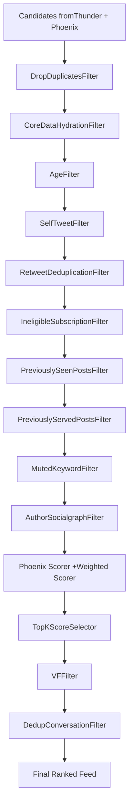

# Additional Filters

Relevant source files

-   [README.md](https://github.com/xai-org/x-algorithm/blob/aaa167b3/README.md?plain=1)
-   [home-mixer/candidate\_pipeline/phoenix\_candidate\_pipeline.rs](https://github.com/xai-org/x-algorithm/blob/aaa167b3/home-mixer/candidate_pipeline/phoenix_candidate_pipeline.rs)

This page documents the remaining filter implementations in the Home Mixer pipeline that were not covered in sections [4.6.1](/xai-org/x-algorithm/4.6.1-agefilter) (AgeFilter) and [4.6.2](/xai-org/x-algorithm/4.6.2-authorsocialgraphfilter) (AuthorSocialgraphFilter). These filters remove ineligible candidates at both pre-scoring and post-selection stages. All filters implement the `Filter<ScoredPostsQuery, PostCandidate>` trait from the candidate pipeline framework (see [3.5](/xai-org/x-algorithm/3.5-filter-trait) for trait details).

The filters documented here include deduplication filters, content eligibility filters, user preference filters, and post-selection validation filters. They execute sequentially in a defined order to progressively eliminate candidates that should not appear in the user's feed.

## Filter Pipeline Organization

The filtering occurs in two distinct stages within the pipeline execution flow:

**Pre-Scoring Filters**: Execute before ML scoring to cheaply eliminate obviously ineligible candidates, reducing computational cost of the expensive transformer inference.

**Post-Selection Filters**: Execute after top-K selection to perform final validation on candidates that will actually be served, including visibility checks for content safety.

Sources: [home-mixer/candidate\_pipeline/phoenix\_candidate\_pipeline.rs109-143](https://github.com/xai-org/x-algorithm/blob/aaa167b3/home-mixer/candidate_pipeline/phoenix_candidate_pipeline.rs#L109-L143) [README.md277-298](https://github.com/xai-org/x-algorithm/blob/aaa167b3/README.md?plain=1#L277-L298)

## Pre-Scoring Filter Implementations

### DropDuplicatesFilter

Removes candidates with duplicate post IDs to ensure each post appears at most once in the feed.

**Implementation**: `DropDuplicatesFilter`

**Location**: [home-mixer/filters/drop\_duplicates\_filter.rs](https://github.com/xai-org/x-algorithm/blob/aaa167b3/home-mixer/filters/drop_duplicates_filter.rs)

**Purpose**: Eliminates exact duplicates based on tweet ID. Multiple candidates may reference the same post ID if it was retrieved from both Thunder and Phoenix sources, or if it appears in different contexts (original post vs retweet).

**Filtering Logic**:

-   Tracks seen post IDs using a hash set
-   Keeps first occurrence of each post ID
-   Removes all subsequent occurrences

**Pipeline Position**: First in pre-scoring chain [home-mixer/candidate\_pipeline/phoenix\_candidate\_pipeline.rs110](https://github.com/xai-org/x-algorithm/blob/aaa167b3/home-mixer/candidate_pipeline/phoenix_candidate_pipeline.rs#L110-L110)

Sources: [home-mixer/candidate\_pipeline/phoenix\_candidate\_pipeline.rs110](https://github.com/xai-org/x-algorithm/blob/aaa167b3/home-mixer/candidate_pipeline/phoenix_candidate_pipeline.rs#L110-L110) [README.md282](https://github.com/xai-org/x-algorithm/blob/aaa167b3/README.md?plain=1#L282-L282)

---

### CoreDataHydrationFilter

Removes candidates that failed to hydrate core tweet metadata, indicating the tweet is deleted, inaccessible, or has data integrity issues.

**Implementation**: `CoreDataHydrationFilter`

**Location**: [home-mixer/filters/core\_data\_hydration\_filter.rs](https://github.com/xai-org/x-algorithm/blob/aaa167b3/home-mixer/filters/core_data_hydration_filter.rs)

**Purpose**: Ensures all remaining candidates have successfully fetched essential metadata from Tweet Entity Service (TES). Candidates without core data cannot be properly displayed or scored.

**Filtering Logic**:

-   Checks if `PostCandidate.core_data` field is populated
-   Removes candidates where hydration failed or returned null
-   Acts as a data quality gate after `CoreDataCandidateHydrator` execution

**Pipeline Position**: Second in pre-scoring chain, immediately after deduplication [home-mixer/candidate\_pipeline/phoenix\_candidate\_pipeline.rs111](https://github.com/xai-org/x-algorithm/blob/aaa167b3/home-mixer/candidate_pipeline/phoenix_candidate_pipeline.rs#L111-L111)

**Dependencies**: Requires `CoreDataCandidateHydrator` to have executed (see [4.5.1](/xai-org/x-algorithm/4.5.1-coredatacandidatehydrator))

Sources: [home-mixer/candidate\_pipeline/phoenix\_candidate\_pipeline.rs111](https://github.com/xai-org/x-algorithm/blob/aaa167b3/home-mixer/candidate_pipeline/phoenix_candidate_pipeline.rs#L111-L111) [README.md283](https://github.com/xai-org/x-algorithm/blob/aaa167b3/README.md?plain=1#L283-L283)

---

### SelfTweetFilter

Removes tweets authored by the requesting user themselves.

**Implementation**: `SelfTweetFilter`

**Location**: [home-mixer/filters/self\_tweet\_filter.rs](https://github.com/xai-org/x-algorithm/blob/aaa167b3/home-mixer/filters/self_tweet_filter.rs)

**Purpose**: Prevents users from seeing their own tweets in the "For You" feed. Users' own content appears in different feed contexts but not in recommendations.

**Filtering Logic**:

-   Compares `PostCandidate.author_id` with `ScoredPostsQuery.user_id`
-   Removes candidates where author matches viewer

**Pipeline Position**: Fourth in pre-scoring chain [home-mixer/candidate\_pipeline/phoenix\_candidate\_pipeline.rs113](https://github.com/xai-org/x-algorithm/blob/aaa167b3/home-mixer/candidate_pipeline/phoenix_candidate_pipeline.rs#L113-L113)

Sources: [home-mixer/candidate\_pipeline/phoenix\_candidate\_pipeline.rs113](https://github.com/xai-org/x-algorithm/blob/aaa167b3/home-mixer/candidate_pipeline/phoenix_candidate_pipeline.rs#L113-L113) [README.md285](https://github.com/xai-org/x-algorithm/blob/aaa167b3/README.md?plain=1#L285-L285)

---

### RetweetDeduplicationFilter

Deduplicates retweets of the same underlying content, keeping only the most relevant instance.

**Implementation**: `RetweetDeduplicationFilter`

**Location**: [home-mixer/filters/retweet\_deduplication\_filter.rs](https://github.com/xai-org/x-algorithm/blob/aaa167b3/home-mixer/filters/retweet_deduplication_filter.rs)

**Purpose**: When multiple users in the viewer's network retweet the same post, this filter ensures only one instance appears in the feed. This prevents repetitive content while preserving social signals.

**Filtering Logic**:

-   Identifies retweets by checking `PostCandidate.core_data.retweeted_status_id`
-   Groups candidates by the underlying original tweet ID
-   Keeps one representative (typically the highest-scored or most recent)
-   Removes other retweets of the same content

**Pipeline Position**: Fifth in pre-scoring chain [home-mixer/candidate\_pipeline/phoenix\_candidate\_pipeline.rs114](https://github.com/xai-org/x-algorithm/blob/aaa167b3/home-mixer/candidate_pipeline/phoenix_candidate_pipeline.rs#L114-L114)

Sources: [home-mixer/candidate\_pipeline/phoenix\_candidate\_pipeline.rs114](https://github.com/xai-org/x-algorithm/blob/aaa167b3/home-mixer/candidate_pipeline/phoenix_candidate_pipeline.rs#L114-L114) [README.md286](https://github.com/xai-org/x-algorithm/blob/aaa167b3/README.md?plain=1#L286-L286)

---

### IneligibleSubscriptionFilter

Removes premium subscription content that the viewer is not authorized to access.

**Implementation**: `IneligibleSubscriptionFilter`

**Location**: [home-mixer/filters/ineligible\_subscription\_filter.rs](https://github.com/xai-org/x-algorithm/blob/aaa167b3/home-mixer/filters/ineligible_subscription_filter.rs)

**Purpose**: Filters out paywalled content from subscription authors when the viewer does not have the required subscription. Prevents showing content the user cannot actually view.

**Filtering Logic**:

-   Checks `PostCandidate.subscription_author_id` field (populated by `SubscriptionHydrator`)
-   Determines if viewer has active subscription to that author
-   Removes candidates the viewer cannot access

**Pipeline Position**: Sixth in pre-scoring chain [home-mixer/candidate\_pipeline/phoenix\_candidate\_pipeline.rs115](https://github.com/xai-org/x-algorithm/blob/aaa167b3/home-mixer/candidate_pipeline/phoenix_candidate_pipeline.rs#L115-L115)

**Dependencies**: Requires `SubscriptionHydrator` to have populated subscription metadata (see [4.5.4](/xai-org/x-algorithm/4.5.4-subscriptionhydrator))

Sources: [home-mixer/candidate\_pipeline/phoenix\_candidate\_pipeline.rs115](https://github.com/xai-org/x-algorithm/blob/aaa167b3/home-mixer/candidate_pipeline/phoenix_candidate_pipeline.rs#L115-L115) [README.md287](https://github.com/xai-org/x-algorithm/blob/aaa167b3/README.md?plain=1#L287-L287)

---

### PreviouslySeenPostsFilter

Removes posts the user has previously seen, using engagement history to track impressions.

**Implementation**: `PreviouslySeenPostsFilter`

**Location**: [home-mixer/filters/previously\_seen\_posts\_filter.rs](https://github.com/xai-org/x-algorithm/blob/aaa167b3/home-mixer/filters/previously_seen_posts_filter.rs)

**Purpose**: Prevents re-showing content the user has already encountered in previous feed sessions. Improves feed freshness and reduces repetition.

**Filtering Logic**:

-   Uses `ScoredPostsQuery.seen_post_ids` from user action sequence
-   Checks each candidate's post ID against the seen set
-   Removes candidates that match

**Pipeline Position**: Seventh in pre-scoring chain [home-mixer/candidate\_pipeline/phoenix\_candidate\_pipeline.rs116](https://github.com/xai-org/x-algorithm/blob/aaa167b3/home-mixer/candidate_pipeline/phoenix_candidate_pipeline.rs#L116-L116)

**Data Source**: `seen_post_ids` populated by `UserActionSeqQueryHydrator` (see [4.4](/xai-org/x-algorithm/4.4-query-hydrators))

Sources: [home-mixer/candidate\_pipeline/phoenix\_candidate\_pipeline.rs116](https://github.com/xai-org/x-algorithm/blob/aaa167b3/home-mixer/candidate_pipeline/phoenix_candidate_pipeline.rs#L116-L116) [README.md288](https://github.com/xai-org/x-algorithm/blob/aaa167b3/README.md?plain=1#L288-L288)

---

### PreviouslyServedPostsFilter

Removes posts that have already been served to the user in the current session or recent requests.

**Implementation**: `PreviouslyServedPostsFilter`

**Location**: [home-mixer/filters/previously\_served\_posts\_filter.rs](https://github.com/xai-org/x-algorithm/blob/aaa167b3/home-mixer/filters/previously_served_posts_filter.rs)

**Purpose**: Prevents duplicate posts within the same session, which can occur when the user refreshes or loads additional pages. This is distinct from `PreviouslySeenPostsFilter` which uses historical engagement data.

**Filtering Logic**:

-   Uses `ScoredPostsQuery.previously_served_post_ids` from the query
-   May also use bloom filter `ScoredPostsQuery.served_post_ids_bloom_filter` for efficient membership testing
-   Removes candidates matching served IDs

**Pipeline Position**: Eighth in pre-scoring chain [home-mixer/candidate\_pipeline/phoenix\_candidate\_pipeline.rs117](https://github.com/xai-org/x-algorithm/blob/aaa167b3/home-mixer/candidate_pipeline/phoenix_candidate_pipeline.rs#L117-L117)

**Data Source**: `previously_served_post_ids` and bloom filter from request context

Sources: [home-mixer/candidate\_pipeline/phoenix\_candidate\_pipeline.rs117](https://github.com/xai-org/x-algorithm/blob/aaa167b3/home-mixer/candidate_pipeline/phoenix_candidate_pipeline.rs#L117-L117) [README.md289](https://github.com/xai-org/x-algorithm/blob/aaa167b3/README.md?plain=1#L289-L289)

---

### MutedKeywordFilter

Removes posts containing keywords the user has explicitly muted in their preferences.

**Implementation**: `MutedKeywordFilter`

**Location**: [home-mixer/filters/muted\_keyword\_filter.rs](https://github.com/xai-org/x-algorithm/blob/aaa167b3/home-mixer/filters/muted_keyword_filter.rs)

**Purpose**: Respects user content preferences by filtering out posts that match their muted keyword list. Enables users to avoid specific topics or terms.

**Filtering Logic**:

-   Retrieves user's muted keywords from user features or preferences
-   Scans `PostCandidate.core_data.text` for keyword matches
-   Performs case-insensitive matching
-   Removes candidates containing any muted keyword

**Instantiation**: Created with `MutedKeywordFilter::new()` [home-mixer/candidate\_pipeline/phoenix\_candidate\_pipeline.rs118](https://github.com/xai-org/x-algorithm/blob/aaa167b3/home-mixer/candidate_pipeline/phoenix_candidate_pipeline.rs#L118-L118)

**Pipeline Position**: Ninth in pre-scoring chain [home-mixer/candidate\_pipeline/phoenix\_candidate\_pipeline.rs118](https://github.com/xai-org/x-algorithm/blob/aaa167b3/home-mixer/candidate_pipeline/phoenix_candidate_pipeline.rs#L118-L118)

Sources: [home-mixer/candidate\_pipeline/phoenix\_candidate\_pipeline.rs118](https://github.com/xai-org/x-algorithm/blob/aaa167b3/home-mixer/candidate_pipeline/phoenix_candidate_pipeline.rs#L118-L118) [README.md290](https://github.com/xai-org/x-algorithm/blob/aaa167b3/README.md?plain=1#L290-L290)

---

## Post-Selection Filter Implementations

Post-selection filters execute after the `TopKScoreSelector` has chosen the top candidates based on ML scores. These filters perform expensive or final-validation checks only on the candidates that will actually be served.

### VFFilter

Applies visibility filtering rules to remove content that violates platform policies or is unavailable.

**Implementation**: `VFFilter`

**Location**: [home-mixer/filters/vf\_filter.rs](https://github.com/xai-org/x-algorithm/blob/aaa167b3/home-mixer/filters/vf_filter.rs)

**Purpose**: Final content safety check using the Visibility Filtering Service. Removes posts that are:

-   Deleted or suspended
-   Marked as spam
-   Containing graphic violence or gore
-   Violating other platform safety policies

**Filtering Logic**:

-   Checks `PostCandidate.vf_result` field populated by `VFCandidateHydrator`
-   Examines visibility filtering verdict and reason
-   Removes candidates marked as filtered
-   Different safety levels apply to in-network vs out-of-network content

**Pipeline Position**: First post-selection filter [home-mixer/candidate\_pipeline/phoenix\_candidate\_pipeline.rs143](https://github.com/xai-org/x-algorithm/blob/aaa167b3/home-mixer/candidate_pipeline/phoenix_candidate_pipeline.rs#L143-L143)

**Dependencies**: Requires `VFCandidateHydrator` in post-selection hydration stage (see [4.5.5](/xai-org/x-algorithm/4.5.5-vfcandidatehydrator))

**Rationale for Post-Selection**: Visibility filtering is computationally expensive and requires hydration data. By applying it post-selection, the system only validates the top-K candidates rather than all candidates, reducing latency and service load.

Sources: [home-mixer/candidate\_pipeline/phoenix\_candidate\_pipeline.rs139-143](https://github.com/xai-org/x-algorithm/blob/aaa167b3/home-mixer/candidate_pipeline/phoenix_candidate_pipeline.rs#L139-L143) [README.md295-296](https://github.com/xai-org/x-algorithm/blob/aaa167b3/README.md?plain=1#L295-L296)

---

### DedupConversationFilter

Deduplicates multiple posts from the same conversation thread to prevent feed domination by a single discussion.

**Implementation**: `DedupConversationFilter`

**Location**: [home-mixer/filters/dedup\_conversation\_filter.rs](https://github.com/xai-org/x-algorithm/blob/aaa167b3/home-mixer/filters/dedup_conversation_filter.rs)

**Purpose**: When multiple posts in a conversation thread are ranked highly, this filter ensures only one branch or reply is shown. Prevents repetitive content from the same discussion.

**Filtering Logic**:

-   Identifies conversation threads using `PostCandidate.core_data.conversation_id`
-   Groups candidates by conversation
-   Keeps highest-scored representative from each conversation
-   Removes other posts from the same thread

**Pipeline Position**: Second (final) post-selection filter [home-mixer/candidate\_pipeline/phoenix\_candidate\_pipeline.rs143](https://github.com/xai-org/x-algorithm/blob/aaa167b3/home-mixer/candidate_pipeline/phoenix_candidate_pipeline.rs#L143-L143)

**Rationale for Post-Selection**: Conversation deduplication requires comparing scored candidates to determine which branch is most relevant, so it must occur after scoring and selection.

Sources: [home-mixer/candidate\_pipeline/phoenix\_candidate\_pipeline.rs143](https://github.com/xai-org/x-algorithm/blob/aaa167b3/home-mixer/candidate_pipeline/phoenix_candidate_pipeline.rs#L143-L143) [README.md297](https://github.com/xai-org/x-algorithm/blob/aaa167b3/README.md?plain=1#L297-L297)

---

## Filter Implementation Details

```mermaid
flowchart TD
    classId_Filter_55["«trait»"]
    classId_FilterResult_56["FilterResult<C>"]
    classId_DropDuplicatesFilter_57["DropDuplicatesFilter"]
    classId_CoreDataHydrationFilter_58["CoreDataHydrationFilter"]
    classId_SelfTweetFilter_59["SelfTweetFilter"]
    classId_RetweetDeduplicationFilter_60["RetweetDeduplicationFilter"]
    classId_IneligibleSubscriptionFilter_61["IneligibleSubscriptionFilter"]
    classId_PreviouslySeenPostsFilter_62["PreviouslySeenPostsFilter"]
    classId_PreviouslyServedPostsFilter_63["PreviouslyServedPostsFilter"]
    classId_MutedKeywordFilter_64["MutedKeywordFilter"]
    classId_VFFilter_65["VFFilter"]
    classId_DedupConversationFilter_66["DedupConversationFilter"]
```

All filters implement the `Filter<ScoredPostsQuery, PostCandidate>` trait, which defines the `filter` method:

Sources: [home-mixer/candidate\_pipeline/phoenix\_candidate\_pipeline.rs22-33](https://github.com/xai-org/x-algorithm/blob/aaa167b3/home-mixer/candidate_pipeline/phoenix_candidate_pipeline.rs#L22-L33)

---

## Filter Execution Flow

The following diagram shows how filters progressively reduce the candidate set:

```mermaid
flowchart TD
    Start["Initial Candidates(Thunder + Phoenix)~500-1000 candidates"]
    DD["DropDuplicatesFilterRemove duplicate IDs"]
    DD_Result["~400-900 candidates"]
    CDH["CoreDataHydrationFilterRemove failed hydrations"]
    CDH_Result["~390-880 candidates"]
    Age["AgeFilterRemove old posts"]
    Age_Result["~370-850 candidates"]
    Self["SelfTweetFilterRemove own posts"]
    Self_Result["~368-845 candidates"]
    Retweet["RetweetDeduplicationFilterDedupe retweets"]
    Retweet_Result["~340-800 candidates"]
    Sub["IneligibleSubscriptionFilterRemove inaccessible content"]
    Sub_Result["~335-795 candidates"]
    Seen["PreviouslySeenPostsFilterRemove seen posts"]
    Seen_Result["~280-700 candidates"]
    Served["PreviouslyServedPostsFilterRemove recently served"]
    Served_Result["~270-690 candidates"]
    Muted["MutedKeywordFilterRemove muted keywords"]
    Muted_Result["~265-685 candidates"]
    SG["AuthorSocialgraphFilterRemove blocked/muted authors"]
    SG_Result["~260-680 candidates(Pre-scoring complete)"]
    Score["Phoenix Scoring +Weighted Scoring"]
    Score_Result["~260-680 scored candidates"]
    Select["TopKScoreSelectorSelect top K"]
    Select_Result["Top 50-100 candidates"]
    VF["VFFilterVisibility filtering"]
    VF_Result["~48-98 candidates"]
    Conv["DedupConversationFilterDedupe conversations"]
    Final["Final 45-95 candidatesfor feed display"]

    Start --> DD
    DD --> DD_Result
    DD --> Result_CDH
    CDH --> CDH_Result
    CDH --> Result_Age
    Age --> Age_Result
    Age --> Result_Self
    Self --> Self_Result
    Self --> Result_Retweet
    Retweet --> Retweet_Result
    Retweet --> Result_Sub
    Sub --> Sub_Result
    Sub --> Result_Seen
    Seen --> Seen_Result
    Seen --> Result_Served
    Served --> Served_Result
    Served --> Result_Muted
    Muted --> Muted_Result
    Muted --> Result_SG
    SG --> SG_Result
    SG --> Result_Score
    Score --> Score_Result
    Score --> Result_Select
    Select --> Select_Result
    Select --> Result_VF
    VF --> VF_Result
    VF --> Result_Conv
    Conv --> Final
```

**Note**: Candidate counts are approximate and vary based on user activity, network size, and content availability. The numbers illustrate the progressive reduction through the filter chain.

Sources: [home-mixer/candidate\_pipeline/phoenix\_candidate\_pipeline.rs109-143](https://github.com/xai-org/x-algorithm/blob/aaa167b3/home-mixer/candidate_pipeline/phoenix_candidate_pipeline.rs#L109-L143) [README.md277-298](https://github.com/xai-org/x-algorithm/blob/aaa167b3/README.md?plain=1#L277-L298)

---

## Filter Configuration

Filters are instantiated in `PhoenixCandidatePipeline::build_with_clients()` and stored in vectors for sequential execution:

```mermaid
flowchart TD
    SF1["VFFilter"]
    SF2["DedupConversationFilter"]
    PF1["DropDuplicatesFilter"]
    PF2["CoreDataHydrationFilter"]
    PF3["AgeFilter"]
    PF4["SelfTweetFilter"]
    PF5["RetweetDeduplicationFilter"]
    PF6["IneligibleSubscriptionFilter"]
    PF7["PreviouslySeenPostsFilter"]
    PF8["PreviouslyServedPostsFilter"]
    PF9["MutedKeywordFilter"]
    PF10["AuthorSocialgraphFilter"]
    PreFilters["filters: Vec~Box~dyn Filter~~"]
    PostFilters["post_selection_filters: Vec~Box~dyn Filter~~"]

    PreFilters --> PreScoring
    PostFilters --> PostScoring
```

Pre-scoring filters are defined at [home-mixer/candidate\_pipeline/phoenix\_candidate\_pipeline.rs109-120](https://github.com/xai-org/x-algorithm/blob/aaa167b3/home-mixer/candidate_pipeline/phoenix_candidate_pipeline.rs#L109-L120)

Post-selection filters are defined at [home-mixer/candidate\_pipeline/phoenix\_candidate\_pipeline.rs142-143](https://github.com/xai-org/x-algorithm/blob/aaa167b3/home-mixer/candidate_pipeline/phoenix_candidate_pipeline.rs#L142-L143)

Sources: [home-mixer/candidate\_pipeline/phoenix\_candidate\_pipeline.rs60-70](https://github.com/xai-org/x-algorithm/blob/aaa167b3/home-mixer/candidate_pipeline/phoenix_candidate_pipeline.rs#L60-L70) [home-mixer/candidate\_pipeline/phoenix\_candidate\_pipeline.rs109-143](https://github.com/xai-org/x-algorithm/blob/aaa167b3/home-mixer/candidate_pipeline/phoenix_candidate_pipeline.rs#L109-L143)

---

## Filter Performance Characteristics

| Filter | Complexity | Data Dependencies | Execution Cost |
| --- | --- | --- | --- |
| `DropDuplicatesFilter` | O(n) | None | Very Low (hash set) |
| `CoreDataHydrationFilter` | O(n) | CoreDataCandidateHydrator | Very Low (field check) |
| `SelfTweetFilter` | O(n) | None | Very Low (ID comparison) |
| `RetweetDeduplicationFilter` | O(n) | CoreDataCandidateHydrator | Low (grouping + selection) |
| `IneligibleSubscriptionFilter` | O(n) | SubscriptionHydrator | Low (field check + lookup) |
| `PreviouslySeenPostsFilter` | O(n) | UserActionSeqQueryHydrator | Low (hash set lookup) |
| `PreviouslyServedPostsFilter` | O(n) | Request context | Low (bloom filter + set) |
| `MutedKeywordFilter` | O(n\*m) | User preferences | Medium (text scanning) |
| `VFFilter` | O(n) | VFCandidateHydrator | Low (field check) |
| `DedupConversationFilter` | O(n) | CoreDataCandidateHydrator | Low (grouping + selection) |

**Note**: n = number of candidates, m = average keyword count per post

The sequential ordering of filters in the pre-scoring chain is designed to apply cheapest filters first, progressively reducing the candidate set before more expensive operations.

Sources: [home-mixer/candidate\_pipeline/phoenix\_candidate\_pipeline.rs109-143](https://github.com/xai-org/x-algorithm/blob/aaa167b3/home-mixer/candidate_pipeline/phoenix_candidate_pipeline.rs#L109-L143)

---

## Summary Table

| Filter | Stage | Primary Purpose | Data Source |
| --- | --- | --- | --- |
| `DropDuplicatesFilter` | Pre-scoring | Eliminate duplicate post IDs | Candidate IDs |
| `CoreDataHydrationFilter` | Pre-scoring | Remove hydration failures | CoreDataCandidateHydrator |
| `SelfTweetFilter` | Pre-scoring | Remove viewer's own posts | Query user\_id |
| `RetweetDeduplicationFilter` | Pre-scoring | Dedupe same underlying content | CoreDataCandidateHydrator |
| `IneligibleSubscriptionFilter` | Pre-scoring | Remove inaccessible premium content | SubscriptionHydrator |
| `PreviouslySeenPostsFilter` | Pre-scoring | Remove historically seen posts | UserActionSeqQueryHydrator |
| `PreviouslyServedPostsFilter` | Pre-scoring | Remove recently served posts | Request context |
| `MutedKeywordFilter` | Pre-scoring | Honor muted keyword preferences | User preferences |
| `VFFilter` | Post-selection | Content safety validation | VFCandidateHydrator |
| `DedupConversationFilter` | Post-selection | Prevent thread domination | CoreDataCandidateHydrator |

Sources: [home-mixer/candidate\_pipeline/phoenix\_candidate\_pipeline.rs109-143](https://github.com/xai-org/x-algorithm/blob/aaa167b3/home-mixer/candidate_pipeline/phoenix_candidate_pipeline.rs#L109-L143) [README.md277-298](https://github.com/xai-org/x-algorithm/blob/aaa167b3/README.md?plain=1#L277-L298)
