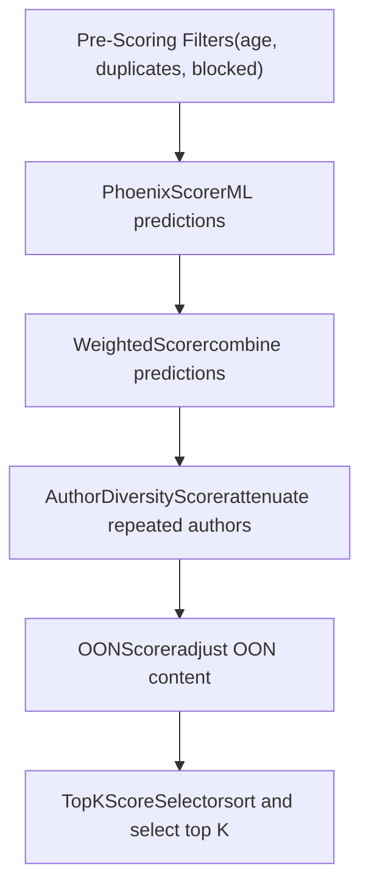
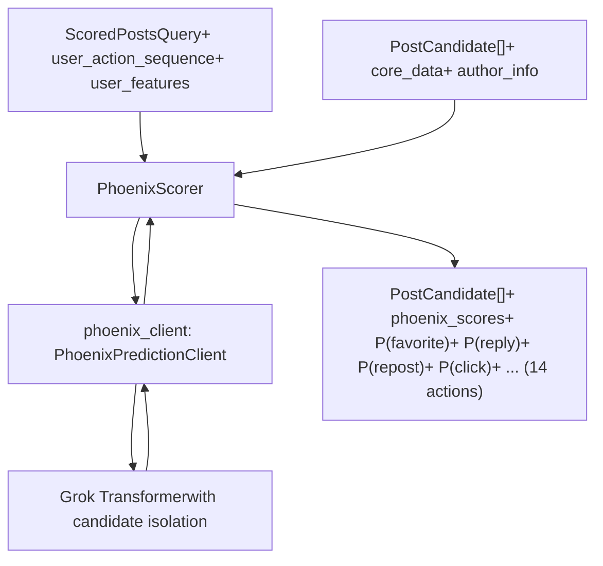
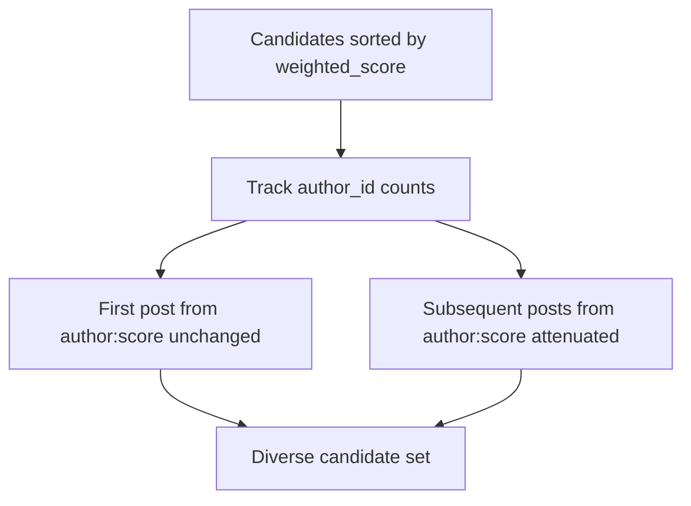
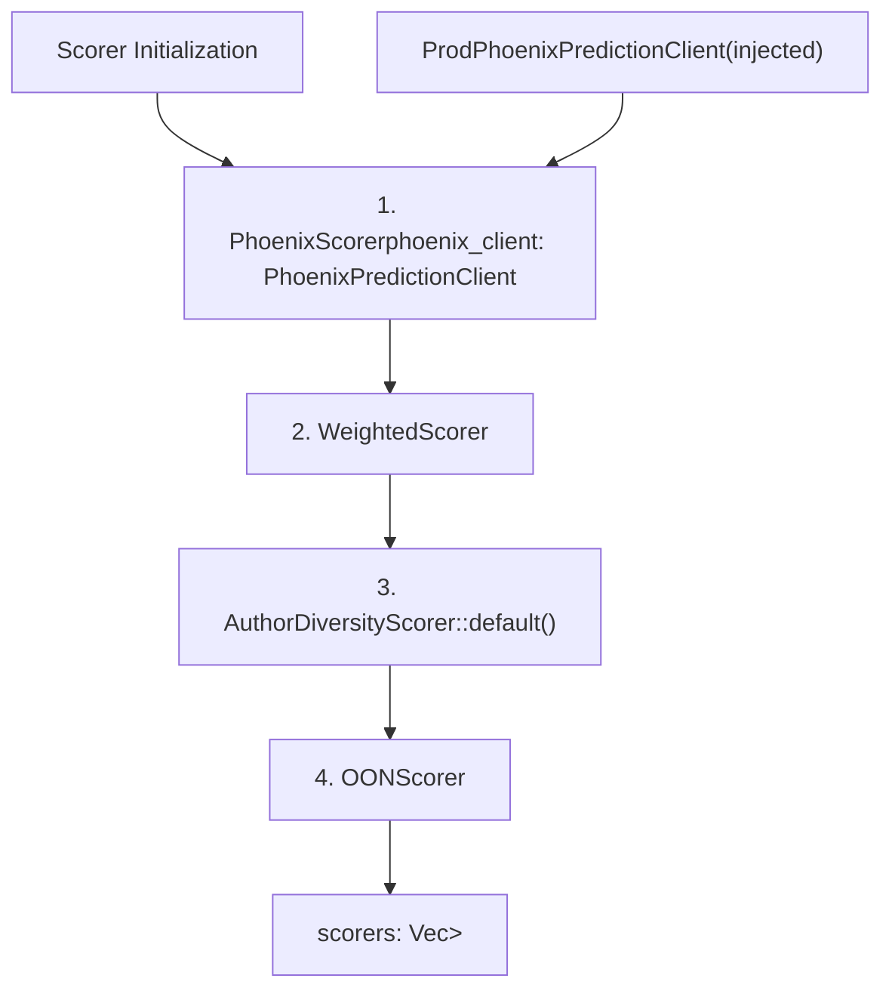
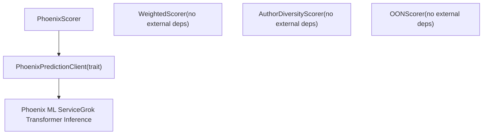

# Scorers

Relevant source files

-   [README.md](https://github.com/xai-org/x-algorithm/blob/aaa167b3/README.md?plain=1)
-   [home-mixer/candidate\_pipeline/phoenix\_candidate\_pipeline.rs](https://github.com/xai-org/x-algorithm/blob/aaa167b3/home-mixer/candidate_pipeline/phoenix_candidate_pipeline.rs)

## Purpose and Scope

This document describes the scoring implementations in the Home Mixer pipeline. Scorers are responsible for assigning numerical scores to candidates that determine their final ranking in the "For You" feed. The pipeline uses four scorers that execute sequentially, each building upon or modifying the scores from previous stages:

1.  **PhoenixScorer**: Generates ML-based engagement predictions using the Grok transformer
2.  **WeightedScorer**: Combines predictions into a single relevance score
3.  **AuthorDiversityScorer**: Attenuates scores for repeated authors to ensure diversity
4.  **OONScorer**: Applies adjustments specific to out-of-network content

For information about the generic `Scorer` trait abstraction, see [Scorer Trait](/xai-org/x-algorithm/3.6-scorer-trait). For details on the Phoenix ML service that powers the PhoenixScorer, see [Phoenix ML Services](/xai-org/x-algorithm/5.5-phoenix-ml-services).

**Sources:** [README.md230-240](https://github.com/xai-org/x-algorithm/blob/aaa167b3/README.md?plain=1#L230-L240) [home-mixer/candidate\_pipeline/phoenix\_candidate\_pipeline.rs122-132](https://github.com/xai-org/x-algorithm/blob/aaa167b3/home-mixer/candidate_pipeline/phoenix_candidate_pipeline.rs#L122-L132)

---

## Role in the Pipeline

Scorers execute after candidate hydration and pre-scoring filters have completed. At this stage, the pipeline has a filtered set of enriched candidates that need to be ranked. The scorers run sequentially (not in parallel) because each scorer may depend on scores or fields set by previous scorers.


**Diagram:** Sequential scorer execution flow in the Phoenix candidate pipeline

**Sources:** [home-mixer/candidate\_pipeline/phoenix\_candidate\_pipeline.rs122-136](https://github.com/xai-org/x-algorithm/blob/aaa167b3/home-mixer/candidate_pipeline/phoenix_candidate_pipeline.rs#L122-L136) [README.md230-237](https://github.com/xai-org/x-algorithm/blob/aaa167b3/README.md?plain=1#L230-L237)

---

## Scorer Trait Implementation

Each scorer implements the `Scorer<ScoredPostsQuery, PostCandidate>` trait defined in the candidate-pipeline framework. The trait requires implementing a single method:

```
async fn score(    &self,    query: &ScoredPostsQuery,    candidates: &mut [PostCandidate]) -> Result<(), ScorerError>
```
Scorers operate by mutating the `candidates` slice in place, adding or modifying score fields on each `PostCandidate` struct. The sequential execution ensures that downstream scorers can read fields set by upstream scorers.

**Sources:** [home-mixer/candidate\_pipeline/phoenix\_candidate\_pipeline.rs52-54](https://github.com/xai-org/x-algorithm/blob/aaa167b3/home-mixer/candidate_pipeline/phoenix_candidate_pipeline.rs#L52-L54)

---

## Phoenix Scorer

The `PhoenixScorer` is the primary scoring component that uses the Phoenix ML service to generate engagement probability predictions for each candidate.

### Architecture


**Diagram:** PhoenixScorer architecture and data flow

### Engagement Predictions

The Phoenix Grok-based transformer model predicts probabilities for 14 different engagement types. These predictions capture both positive engagement signals (actions that indicate interest) and negative signals (actions that indicate disinterest):

| Prediction Field | Description | Signal Type |
| --- | --- | --- |
| `P(favorite)` | Probability user will like the post | Positive |
| `P(reply)` | Probability user will reply to the post | Positive |
| `P(repost)` | Probability user will repost | Positive |
| `P(quote)` | Probability user will quote tweet | Positive |
| `P(click)` | Probability user will click into the post | Positive |
| `P(profile_click)` | Probability user will click author profile | Positive |
| `P(video_view)` | Probability user will view video | Positive |
| `P(photo_expand)` | Probability user will expand photo | Positive |
| `P(share)` | Probability user will share via external methods | Positive |
| `P(dwell)` | Probability user will dwell/linger on post | Positive |
| `P(follow_author)` | Probability user will follow the author | Positive |
| `P(not_interested)` | Probability user will mark "not interested" | Negative |
| `P(block_author)` | Probability user will block the author | Negative |
| `P(mute_author)` | Probability user will mute the author | Negative |
| `P(report)` | Probability user will report the post | Negative |

These predictions are stored in the `phoenix_scores` field of each `PostCandidate` for use by downstream scorers.

### Model Characteristics

The Phoenix ranker uses a Grok-based transformer architecture with special attention masking that enforces **candidate isolation**. This means:

-   Candidates cannot attend to each other during inference
-   Each candidate only attends to the user context (engagement history)
-   Scores are consistent regardless of which other candidates are in the batch
-   Scores can be cached per (user, post) pair

This design decision is critical for maintaining score consistency and enabling caching optimizations.

**Sources:** [README.md245-263](https://github.com/xai-org/x-algorithm/blob/aaa167b3/README.md?plain=1#L245-L263) [README.md176-182](https://github.com/xai-org/x-algorithm/blob/aaa167b3/README.md?plain=1#L176-L182) [home-mixer/candidate\_pipeline/phoenix\_candidate\_pipeline.rs123](https://github.com/xai-org/x-algorithm/blob/aaa167b3/home-mixer/candidate_pipeline/phoenix_candidate_pipeline.rs#L123-L123)

---

## Weighted Scorer

The `WeightedScorer` combines the multiple engagement probabilities from PhoenixScorer into a single relevance score using a weighted linear combination.

### Score Calculation

The weighted score is computed as:

```
weighted_score = Σ (weight_i × P(action_i))
```
Where:

-   Positive actions (favorite, reply, repost, etc.) have **positive weights**
-   Negative actions (block, mute, report) have **negative weights**

This formula produces a single scalar value that represents the overall predicted relevance of the post to the user. Posts with high positive engagement probabilities receive high scores, while posts with high negative engagement probabilities have their scores reduced.

### Weight Configuration

The specific weight values are configured in the codebase and can be tuned to emphasize different types of engagement. For example:

-   A higher weight on `P(favorite)` emphasizes posts users are likely to like
-   Negative weights on `P(not_interested)` push down content users would find irrelevant
-   Weights on `P(reply)` and `P(repost)` encourage conversation-starting content

The final `weighted_score` field is written to each `PostCandidate` and is the primary score used for ranking.

**Sources:** [README.md265-272](https://github.com/xai-org/x-algorithm/blob/aaa167b3/README.md?plain=1#L265-L272) [home-mixer/candidate\_pipeline/phoenix\_candidate\_pipeline.rs124](https://github.com/xai-org/x-algorithm/blob/aaa167b3/home-mixer/candidate_pipeline/phoenix_candidate_pipeline.rs#L124-L124)

---

## Author Diversity Scorer

The `AuthorDiversityScorer` ensures feed diversity by attenuating scores for candidates from authors who already have multiple posts in the candidate set.

### Diversity Mechanism


**Diagram:** Author diversity scoring attenuation logic

The scorer processes candidates and applies a penalty factor to posts from authors who have already appeared earlier in the candidate list. This prevents a single prolific author from dominating the feed, even if all their posts have high relevance scores.

### Implementation Details

The `AuthorDiversityScorer` is instantiated with default parameters:

```
let author_diversity_scorer = Box::new(AuthorDiversityScorer::default());
```
The attenuation typically works by:

1.  Tracking which `author_id` values have been seen
2.  For each repeated author, applying a multiplicative penalty to the `weighted_score`
3.  The penalty may increase with each additional post from the same author

This ensures users see content from a variety of authors rather than a concentration from a few highly-engaged creators.

**Sources:** [README.md99-101](https://github.com/xai-org/x-algorithm/blob/aaa167b3/README.md?plain=1#L99-L101) [home-mixer/candidate\_pipeline/phoenix\_candidate\_pipeline.rs125](https://github.com/xai-org/x-algorithm/blob/aaa167b3/home-mixer/candidate_pipeline/phoenix_candidate_pipeline.rs#L125-L125)

---

## OON Scorer

The `OONScorer` applies score adjustments specifically to out-of-network candidates retrieved from Phoenix Retrieval. This scorer modifies the final scores based on whether the candidate is in-network or out-of-network.

### Purpose

Out-of-network content requires different scoring treatment because:

-   Users have no prior relationship with the author
-   Discovery content may need different thresholds
-   The two-tower retrieval model provides different quality signals than in-network Thunder

The `OONScorer` reads the `is_in_network` field (set by `InNetworkCandidateHydrator` during hydration) and adjusts scores accordingly.

### Score Adjustments

The specific adjustments may include:

-   Scaling OON scores by a factor to balance in-network vs OON content
-   Applying minimum quality thresholds for OON content
-   Adjusting based on retrieval confidence scores from Phoenix Retrieval

**Sources:** [home-mixer/candidate\_pipeline/phoenix\_candidate\_pipeline.rs126](https://github.com/xai-org/x-algorithm/blob/aaa167b3/home-mixer/candidate_pipeline/phoenix_candidate_pipeline.rs#L126-L126)

---

## Scorer Pipeline Initialization

The scorers are instantiated and registered with the pipeline in a specific order during pipeline construction:


**Diagram:** Scorer instantiation order in pipeline construction

The order of instantiation matters because scorers execute in the same order they appear in the `scorers` vector. The sequential pipeline ensures:

1.  `PhoenixScorer` runs first to generate raw ML predictions
2.  `WeightedScorer` combines those predictions into a single score
3.  `AuthorDiversityScorer` attenuates for diversity
4.  `OONScorer` applies final adjustments based on content source

**Sources:** [home-mixer/candidate\_pipeline/phoenix\_candidate\_pipeline.rs122-132](https://github.com/xai-org/x-algorithm/blob/aaa167b3/home-mixer/candidate_pipeline/phoenix_candidate_pipeline.rs#L122-L132)

---

## Score Field Composition

The following table shows how score-related fields on `PostCandidate` are progressively set by each scorer:

| Scorer | Fields Written | Fields Read | Dependencies |
| --- | --- | --- | --- |
| `PhoenixScorer` | `phoenix_scores` (all 14 probabilities) | `user_action_sequence`, `core_data` | `PhoenixPredictionClient` |
| `WeightedScorer` | `weighted_score` | `phoenix_scores` | None |
| `AuthorDiversityScorer` | `weighted_score` (modified) | `weighted_score`, `author_id` | None |
| `OONScorer` | `weighted_score` (modified) | `weighted_score`, `is_in_network` | None |

After all scorers have executed, the `weighted_score` field contains the final score used by the `TopKScoreSelector` to sort and select the top-K candidates.

**Sources:** [home-mixer/candidate\_pipeline/phoenix\_candidate\_pipeline.rs122-136](https://github.com/xai-org/x-algorithm/blob/aaa167b3/home-mixer/candidate_pipeline/phoenix_candidate_pipeline.rs#L122-L136)

---

## Integration with External Services

The scorers integrate with external services through client abstractions:


**Diagram:** Scorer dependencies on external services

Only the `PhoenixScorer` requires external service communication. The other scorers operate purely on data already present in the query and candidates, making them lightweight and deterministic.

The `PhoenixPredictionClient` abstracts the communication with the Phoenix ML service, which runs the Grok transformer model to generate predictions. For details on the client interface and Phoenix service integration, see [Phoenix ML Services](/xai-org/x-algorithm/5.5-phoenix-ml-services).

**Sources:** [home-mixer/candidate\_pipeline/phoenix\_candidate\_pipeline.rs10-12](https://github.com/xai-org/x-algorithm/blob/aaa167b3/home-mixer/candidate_pipeline/phoenix_candidate_pipeline.rs#L10-L12) [home-mixer/candidate\_pipeline/phoenix\_candidate\_pipeline.rs75-76](https://github.com/xai-org/x-algorithm/blob/aaa167b3/home-mixer/candidate_pipeline/phoenix_candidate_pipeline.rs#L75-L76) [home-mixer/candidate\_pipeline/phoenix\_candidate\_pipeline.rs123](https://github.com/xai-org/x-algorithm/blob/aaa167b3/home-mixer/candidate_pipeline/phoenix_candidate_pipeline.rs#L123-L123)

---

## Summary

The scoring stage transforms enriched, filtered candidates into a ranked list through four sequential scorers:

1.  **PhoenixScorer** generates 14 engagement probability predictions using the Grok transformer
2.  **WeightedScorer** combines predictions into a single relevance score with positive and negative weights
3.  **AuthorDiversityScorer** attenuates scores for repeated authors to ensure variety
4.  **OONScorer** applies final adjustments for out-of-network content

This multi-stage scoring approach separates concerns: ML prediction generation, score composition, diversity enforcement, and content-type-specific adjustments. The sequential execution allows each scorer to build upon previous results while maintaining a clean separation of responsibilities.

The final `weighted_score` field on each `PostCandidate` is used by the `TopKScoreSelector` to sort candidates and select the top-K results for the "For You" feed.

**Sources:** [home-mixer/candidate\_pipeline/phoenix\_candidate\_pipeline.rs122-136](https://github.com/xai-org/x-algorithm/blob/aaa167b3/home-mixer/candidate_pipeline/phoenix_candidate_pipeline.rs#L122-L136) [README.md230-240](https://github.com/xai-org/x-algorithm/blob/aaa167b3/README.md?plain=1#L230-L240)
