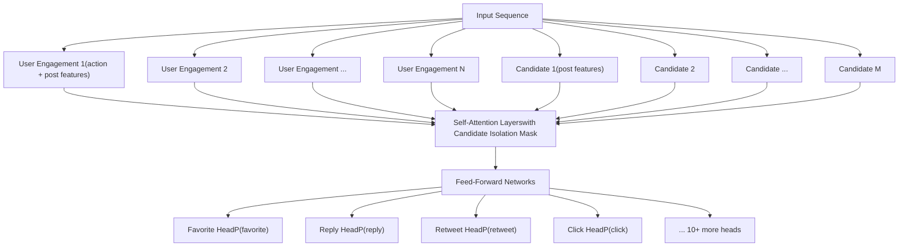
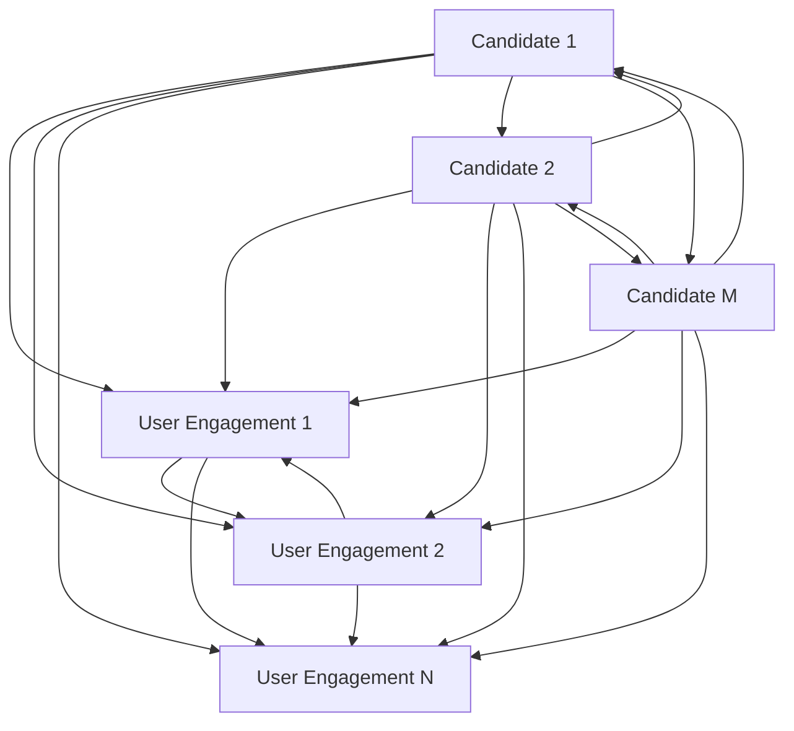
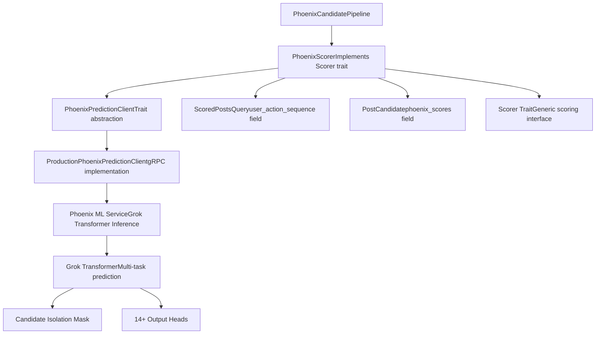

# Phoenix Scorer

Relevant source files

-   [README.md](https://github.com/xai-org/x-algorithm/blob/aaa167b3/README.md?plain=1)

## Purpose and Scope

The Phoenix Scorer is a scorer implementation that uses a Grok-based transformer model to predict engagement probabilities for candidate posts. It assigns multiple probability scores to each candidate representing the likelihood of different user actions (favorite, reply, retweet, etc.). This component is responsible for the primary ML-based scoring in the pipeline, which is then combined by downstream scorers.

For information about combining these predictions into a final score, see [Weighted Scorer](/xai-org/x-algorithm/4.7.2-weighted-scorer). For other scoring mechanisms like diversity adjustments, see [Author Diversity and OON Scorers](/xai-org/x-algorithm/4.7.3-author-diversity-and-oon-scorers).

---

## Overview

The `PhoenixScorer` is a sequential scorer that processes candidates through a Grok-based transformer model adapted from the [Grok-1 open source release](https://github.com/xai-org/x-algorithm/blob/aaa167b3/Grok-1 open source release) Unlike traditional ranking models that output a single relevance score, Phoenix predicts probabilities for multiple engagement types simultaneously, enabling fine-grained understanding of how users might interact with content.

The scorer is implemented as part of the Home Mixer's candidate pipeline and integrates with the Phoenix ML service through the `PhoenixPredictionClient` interface.

**Key Characteristics:**

-   **Sequential Execution**: Processes candidates in a single batch request
-   **Multi-Task Prediction**: Outputs probabilities for 14+ different engagement types
-   **Candidate Isolation**: Uses attention masking to prevent candidates from attending to each other
-   **Cacheable Scores**: Consistent scores enable caching for previously seen candidates

Sources: [README.md1-326](https://github.com/xai-org/x-algorithm/blob/aaa167b3/README.md?plain=1#L1-L326)

---

## Model Architecture

The Phoenix Scorer employs a transformer architecture derived from Grok-1, adapted specifically for recommendation use cases. The model processes both user context (engagement history) and candidate posts to generate engagement predictions.

### Transformer Structure


**Diagram: Phoenix Transformer Architecture with Multi-Head Output**

The transformer processes user engagement history alongside candidate posts, applying attention masking to implement candidate isolation. Each output head predicts a specific engagement type probability.

Sources: [README.md176-182](https://github.com/xai-org/x-algorithm/blob/aaa167b3/README.md?plain=1#L176-L182) [README.md244-263](https://github.com/xai-org/x-algorithm/blob/aaa167b3/README.md?plain=1#L244-L263)

---

## Candidate Isolation Mechanism

A critical design decision in the Phoenix Scorer is **candidate isolation**: candidates cannot attend to each other during transformer inference. This is implemented through a specialized attention mask that only allows candidates to attend to user context tokens.

### Attention Masking Pattern


**Diagram: Candidate Isolation Attention Mask**

### Benefits of Candidate Isolation

| Benefit | Description |
| --- | --- |
| **Score Consistency** | A candidate's score is independent of which other candidates are in the batch |
| **Caching Enabled** | Scores can be cached and reused across different request contexts |
| **Deterministic Ranking** | Same candidate always receives same score for a given user state |
| **Batch Size Invariance** | Scores remain consistent regardless of batch composition |

This design contrasts with traditional transformer rankers where candidates can attend to each other, making scores dependent on the entire candidate set.

Sources: [README.md176-182](https://github.com/xai-org/x-algorithm/blob/aaa167b3/README.md?plain=1#L176-L182) [README.md302-308](https://github.com/xai-org/x-algorithm/blob/aaa167b3/README.md?plain=1#L302-L308)

---

## Engagement Predictions

The Phoenix Scorer outputs probability predictions for multiple engagement types, covering both positive and negative user actions.

### Prediction Types

```mermaid
flowchart TD
    N1["P(not_interested)User marks not interested"]
    N2["P(block_author)User blocks author"]
    N3["P(mute_author)User mutes author"]
    N4["P(report)User reports post"]
    P1["P(favorite)User likes the post"]
    P2["P(reply)User replies to post"]
    P3["P(repost)User reposts content"]
    P4["P(quote)User quote tweets"]
    P5["P(click)User clicks on post"]
    P6["P(profile_click)User views author profile"]
    P7["P(video_view)User watches video"]
    P8["P(photo_expand)User expands photo"]
    P9["P(share)User shares externally"]
    P10["P(dwell)User dwells on post"]
    P11["P(follow_author)User follows author"]
```


**Diagram: Phoenix Multi-Task Prediction Outputs**

### Prediction Output Structure

Each candidate receives a structured set of predictions:

| Prediction Field | Type | Range | Purpose |
| --- | --- | --- | --- |
| `p_favorite` | float | \[0, 1\] | Probability user will like the post |
| `p_reply` | float | \[0, 1\] | Probability user will reply |
| `p_repost` | float | \[0, 1\] | Probability user will repost |
| `p_quote` | float | \[0, 1\] | Probability user will quote tweet |
| `p_click` | float | \[0, 1\] | Probability user will click to view details |
| `p_profile_click` | float | \[0, 1\] | Probability user will view author profile |
| `p_video_view` | float | \[0, 1\] | Probability user will watch video |
| `p_photo_expand` | float | \[0, 1\] | Probability user will expand photo |
| `p_share` | float | \[0, 1\] | Probability user will share externally |
| `p_dwell` | float | \[0, 1\] | Probability user will dwell on post |
| `p_follow_author` | float | \[0, 1\] | Probability user will follow author |
| `p_not_interested` | float | \[0, 1\] | Probability user will mark not interested |
| `p_block_author` | float | \[0, 1\] | Probability user will block author |
| `p_mute_author` | float | \[0, 1\] | Probability user will mute author |
| `p_report` | float | \[0, 1\] | Probability user will report post |

These probabilities are stored on the `PostCandidate` structure and used by downstream scorers to compute weighted relevance scores.

Sources: [README.md244-263](https://github.com/xai-org/x-algorithm/blob/aaa167b3/README.md?plain=1#L244-L263) [README.md265-272](https://github.com/xai-org/x-algorithm/blob/aaa167b3/README.md?plain=1#L265-L272)

---

## Integration with Pipeline

The Phoenix Scorer integrates with the candidate pipeline framework as a `Scorer` trait implementation, operating during the scoring phase of pipeline execution.

### Pipeline Integration

> **[Mermaid sequence]**
> *(图表结构无法解析)*

**Diagram: Phoenix Scorer Execution Sequence**

### Scorer Interface Implementation

The `PhoenixScorer` implements the `Scorer` trait from the candidate pipeline framework:

**Trait Contract:**

-   **Input**: `ScoredPostsQuery` (containing user context) and `Vec<PostCandidate>` (candidates to score)
-   **Output**: `Vec<PostCandidate>` with `phoenix_scores` field populated
-   **Execution**: Sequential (processes all candidates in single batch request)
-   **Error Handling**: Graceful degradation if ML service unavailable

**Data Flow:**

1.  Extract user engagement sequence from `ScoredPostsQuery`
2.  Extract candidate features from `PostCandidate` objects
3.  Call `PhoenixPredictionClient.predict()` with batched request
4.  Parse response and attach predictions to each candidate's `phoenix_scores` field
5.  Return candidates with populated ML predictions

Sources: [README.md230-235](https://github.com/xai-org/x-algorithm/blob/aaa167b3/README.md?plain=1#L230-L235) [README.md85-101](https://github.com/xai-org/x-algorithm/blob/aaa167b3/README.md?plain=1#L85-L101)

---

## Code Structure

### Component Hierarchy


**Diagram: Phoenix Scorer Code Structure and Dependencies**

### Key Code Entities

| Component | Location | Description |
| --- | --- | --- |
| `PhoenixScorer` | `home-mixer/src/scorers/phoenix_scorer.rs` | Main scorer implementation |
| `PhoenixPredictionClient` | `home-mixer/src/clients/phoenix_prediction_client.rs` | Trait defining ML service interface |
| `ProductionPhoenixPredictionClient` | `home-mixer/src/clients/impl/production_phoenix_prediction_client.rs` | gRPC client implementation |
| `PostCandidate.phoenix_scores` | `home-mixer/src/models/post_candidate.rs` | Struct field storing predictions |
| `ScoredPostsQuery.user_action_sequence` | `home-mixer/src/models/scored_posts_query.rs` | User context for predictions |
| Phoenix ML Service | `phoenix/src/service/` | Transformer inference service |
| Grok Transformer | `phoenix/src/model/transformer.rs` | Core model architecture |

### Data Structures

**Phoenix Scores Structure (stored in `PostCandidate`):**

```
struct PhoenixScores {    p_favorite: f32,    p_reply: f32,    p_repost: f32,    p_quote: f32,    p_click: f32,    p_profile_click: f32,    p_video_view: f32,    p_photo_expand: f32,    p_share: f32,    p_dwell: f32,    p_follow_author: f32,    p_not_interested: f32,    p_block_author: f32,    p_mute_author: f32,    p_report: f32,}
```
Sources: [README.md128-146](https://github.com/xai-org/x-algorithm/blob/aaa167b3/README.md?plain=1#L128-L146) [README.md163-183](https://github.com/xai-org/x-algorithm/blob/aaa167b3/README.md?plain=1#L163-L183) [README.md244-263](https://github.com/xai-org/x-algorithm/blob/aaa167b3/README.md?plain=1#L244-L263)

---

## Implementation Details

### Batch Processing

The Phoenix Scorer processes all candidates in a single batch request to the ML service. This approach:

-   Minimizes network overhead (single gRPC call)
-   Enables efficient GPU utilization on the ML service
-   Maintains candidate isolation through attention masking
-   Provides consistent performance regardless of candidate count

### Feature Extraction

**User Context Features:**

-   User engagement sequence (last N actions with timestamps)
-   User profile metadata
-   Temporal features (time of day, day of week)

**Candidate Features:**

-   Post text embeddings (hash-based lookup)
-   Author features (follower count, verification status)
-   Media type indicators
-   Post metadata (reply/repost status, conversation context)

### Error Handling

The scorer implements graceful degradation:

-   **ML Service Unavailable**: Falls back to default scores or skips scoring
-   **Partial Failures**: Processes successful predictions, logs failures
-   **Timeout Protection**: Enforces request timeout to prevent pipeline blocking
-   **Malformed Responses**: Validates prediction structure before attachment

Sources: [README.md176-182](https://github.com/xai-org/x-algorithm/blob/aaa167b3/README.md?plain=1#L176-L182) [README.md302-320](https://github.com/xai-org/x-algorithm/blob/aaa167b3/README.md?plain=1#L302-L320)

---

## Performance Characteristics

### Latency Profile

| Component | Typical Latency | Notes |
| --- | --- | --- |
| Feature Extraction | 1-2ms | In-memory field access |
| gRPC Request | 10-30ms | Network + ML inference |
| Response Parsing | 1-2ms | Deserialization and validation |
| **Total** | **15-40ms** | Dominant cost is ML inference |

### Optimization Strategies

1.  **Batching**: Single request for all candidates reduces overhead
2.  **Candidate Isolation**: Enables score caching for repeated candidates
3.  **Feature Pre-computation**: User context extracted once during query hydration
4.  **Parallel Service Calls**: Multiple Phoenix scorers can run concurrently if needed
5.  **Model Quantization**: ML service uses optimized model formats for faster inference

### Scalability Considerations

-   **Horizontal Scaling**: ML service can scale independently of Home Mixer
-   **Model Versioning**: Supports gradual rollout of new model versions
-   **A/B Testing**: Can run multiple model variants simultaneously
-   **Caching**: Scores cached in Strato for frequently seen candidates

Sources: [README.md302-320](https://github.com/xai-org/x-algorithm/blob/aaa167b3/README.md?plain=1#L302-L320)
