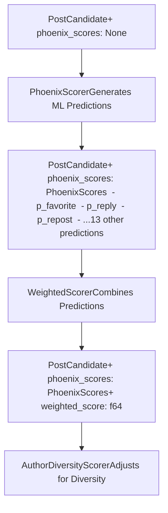
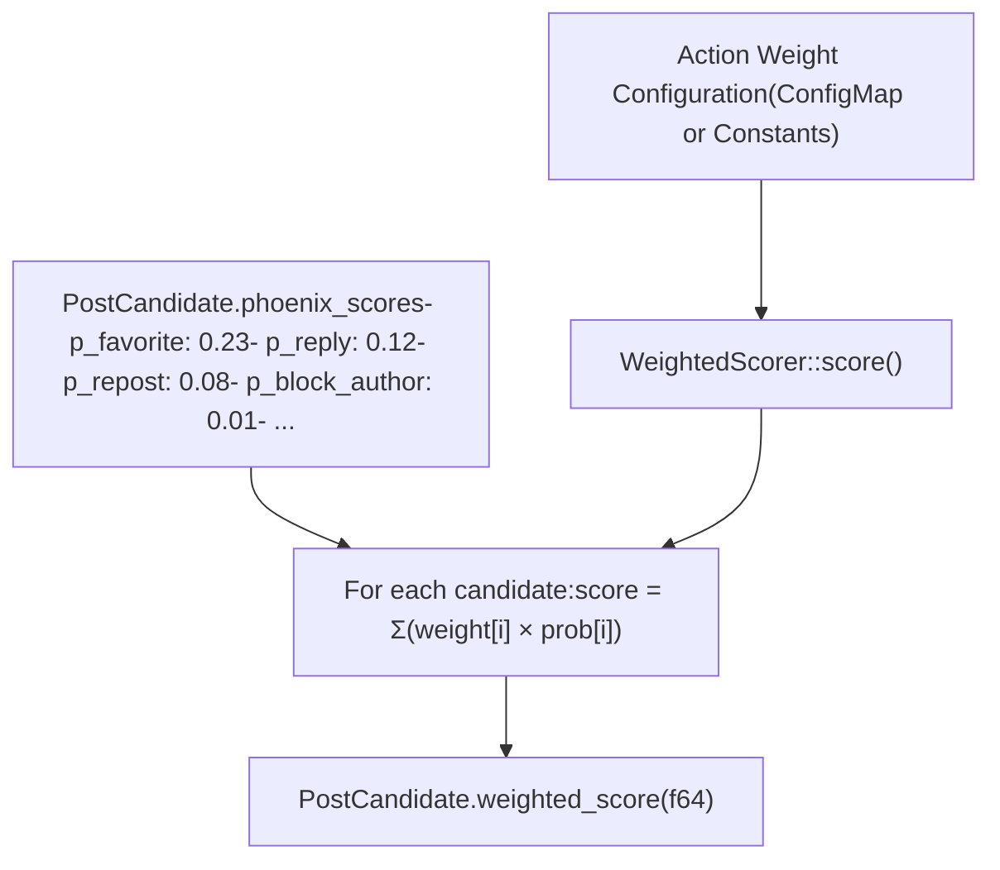
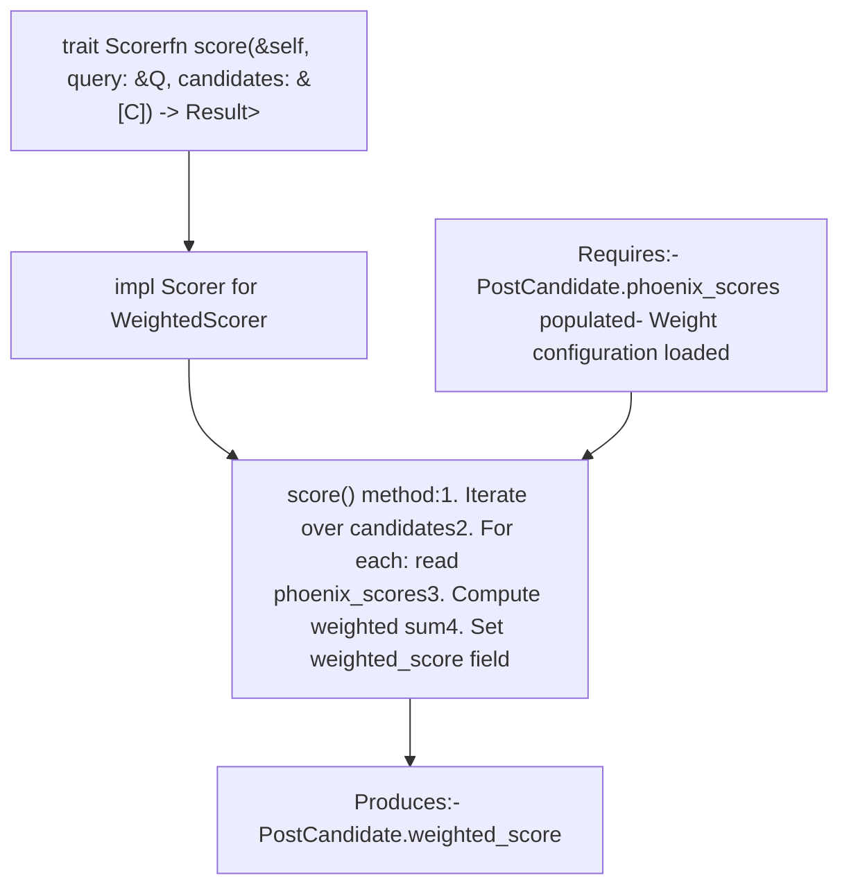

# Weighted Scorer

Relevant source files

-   [README.md](https://github.com/xai-org/x-algorithm/blob/aaa167b3/README.md?plain=1)

## Purpose and Scope

The Weighted Scorer combines multiple engagement probability predictions from the Phoenix Scorer into a single relevance score used for ranking candidates. It applies configurable weights to each predicted engagement action type and computes a weighted sum to produce the final score that determines candidate ranking.

For information about how engagement probabilities are generated, see [Phoenix Scorer](/xai-org/x-algorithm/4.7.1-phoenix-scorer). For information about score adjustments applied after weighted scoring, see [Author Diversity and OON Scorers](/xai-org/x-algorithm/4.7.3-author-diversity-and-oon-scorers).

**Sources:** [README.md1-326](https://github.com/xai-org/x-algorithm/blob/aaa167b3/README.md?plain=1#L1-L326)

---

## Overview

The Weighted Scorer operates on candidates that have already been scored by the Phoenix Scorer. It takes the multiple engagement probability predictions (P(favorite), P(reply), P(repost), etc.) and combines them into a single numerical score through a weighted linear combination. This consolidated score is used by the [TopKScoreSelector](/xai-org/x-algorithm/4.8-selectors) to rank and select the final candidates.


**Diagram: Weighted Scorer Position in Scoring Pipeline**

**Sources:** [README.md85-102](https://github.com/xai-org/x-algorithm/blob/aaa167b3/README.md?plain=1#L85-L102)

---

## Engagement Action Types

The Phoenix Scorer predicts probabilities for multiple engagement action types. The Weighted Scorer uses these predictions as inputs to compute the final score. The following table shows the engagement actions predicted by the Phoenix model:

| Action Type | Field Name | Description | Weight Category |
| --- | --- | --- | --- |
| Favorite | `p_favorite` | Probability user will like the post | Positive |
| Reply | `p_reply` | Probability user will reply to the post | Positive |
| Repost | `p_repost` | Probability user will repost the post | Positive |
| Quote | `p_quote` | Probability user will quote tweet the post | Positive |
| Click | `p_click` | Probability user will click on the post | Positive |
| Profile Click | `p_profile_click` | Probability user will click on author profile | Positive |
| Video View | `p_video_view` | Probability user will watch video (if video post) | Positive |
| Photo Expand | `p_photo_expand` | Probability user will expand photo (if photo post) | Positive |
| Share | `p_share` | Probability user will share the post externally | Positive |
| Dwell | `p_dwell` | Probability user will dwell on the post | Positive |
| Follow Author | `p_follow_author` | Probability user will follow the post author | Positive |
| Not Interested | `p_not_interested` | Probability user will mark "not interested" | Negative |
| Block Author | `p_block_author` | Probability user will block the post author | Negative |
| Mute Author | `p_mute_author` | Probability user will mute the post author | Negative |
| Report | `p_report` | Probability user will report the post | Negative |

**Sources:** [README.md244-263](https://github.com/xai-org/x-algorithm/blob/aaa167b3/README.md?plain=1#L244-L263)

---

## Score Calculation

### Weighted Sum Formula

The Weighted Scorer computes the final relevance score using a weighted linear combination of all engagement probabilities:

```
weighted_score = Σ (weight_i × P(action_i))
                 i∈actions
```
Where:

-   `weight_i` is the configured weight for action type `i`
-   `P(action_i)` is the probability prediction from Phoenix Scorer for action type `i`
-   The sum is computed over all engagement action types

**Sources:** [README.md267-269](https://github.com/xai-org/x-algorithm/blob/aaa167b3/README.md?plain=1#L267-L269)

### Weight Sign Convention

Weights are assigned positive or negative values based on whether the engagement action is desirable or undesirable:

-   **Positive Weights**: Applied to actions that indicate user interest and engagement (favorite, reply, repost, share, etc.). These increase the final score.
-   **Negative Weights**: Applied to actions that indicate user dissatisfaction (block, mute, report, not\_interested). These decrease the final score and push down content the user would likely dislike.

This allows the model to optimize for content that users will engage with positively while avoiding content that would generate negative reactions.

**Sources:** [README.md271-272](https://github.com/xai-org/x-algorithm/blob/aaa167b3/README.md?plain=1#L271-L272)

### Score Field Storage

The computed weighted score is stored in the `PostCandidate` structure's `weighted_score` field. This field is then used by subsequent pipeline stages:

1.  **AuthorDiversityScorer**: May attenuate the weighted score for repeated authors
2.  **OONScorer**: May adjust the weighted score for out-of-network content
3.  **TopKScoreSelector**: Uses the final score to sort and select top candidates

**Sources:** [README.md85-108](https://github.com/xai-org/x-algorithm/blob/aaa167b3/README.md?plain=1#L85-L108) [README.md231-235](https://github.com/xai-org/x-algorithm/blob/aaa167b3/README.md?plain=1#L231-L235)

---

## Weight Configuration


**Diagram: Weight Configuration and Score Computation Flow**

Weights are configured based on:

-   **Product goals**: Which engagements are most valuable to the platform
-   **User experience**: Optimizing for actions that indicate genuine interest
-   **Model calibration**: Accounting for differences in base rates across action types
-   **Experimentation**: Weights may be tuned through A/B testing and offline evaluation

The specific weight values are likely configurable and tunable to allow for optimization without requiring model retraining.

**Sources:** [README.md267-272](https://github.com/xai-org/x-algorithm/blob/aaa167b3/README.md?plain=1#L267-L272)

---

## Implementation in Pipeline

### Scorer Trait Implementation

The Weighted Scorer implements the `Scorer` trait from the candidate pipeline framework (see [Scorer Trait](/xai-org/x-algorithm/3.6-scorer-trait)). The trait's `score` method operates on a batch of candidates:


**Diagram: Scorer Trait Implementation for WeightedScorer**

**Sources:** [README.md190-201](https://github.com/xai-org/x-algorithm/blob/aaa167b3/README.md?plain=1#L190-L201) [README.md231-235](https://github.com/xai-org/x-algorithm/blob/aaa167b3/README.md?plain=1#L231-L235)

### Sequential Execution

The Weighted Scorer runs **sequentially** after the Phoenix Scorer. This is necessary because:

1.  It depends on `phoenix_scores` being populated by Phoenix Scorer
2.  Score computation is a lightweight operation (simple arithmetic)
3.  Sequential execution ensures correct data dependencies

The pipeline executes scorers in the following order:

1.  `PhoenixScorer` - Populates `phoenix_scores` field
2.  `WeightedScorer` - Computes `weighted_score` from `phoenix_scores`
3.  `AuthorDiversityScorer` - May attenuate `weighted_score`
4.  `OONScorer` - May adjust `weighted_score` for OON candidates

**Sources:** [README.md85-102](https://github.com/xai-org/x-algorithm/blob/aaa167b3/README.md?plain=1#L85-L102) [README.md231-235](https://github.com/xai-org/x-algorithm/blob/aaa167b3/README.md?plain=1#L231-L235)

---

## Design Rationale

### Separation of Prediction and Scoring

The separation of Phoenix Scorer (prediction) and Weighted Scorer (combination) provides several benefits:

| Benefit | Description |
| --- | --- |
| **Modularity** | ML predictions are independent of weight tuning |
| **Experimentation** | Weights can be adjusted without model retraining |
| **Transparency** | Individual engagement probabilities are preserved for debugging and analysis |
| **Flexibility** | Different weight configurations can be A/B tested easily |

### Multi-Action Prediction Advantages

Rather than predicting a single "relevance" score, the system predicts multiple action probabilities and combines them. This approach:

-   **Captures nuanced user intent**: Different users may engage in different ways (some prefer replying, others prefer liking)
-   **Enables negative signal incorporation**: Negative actions (blocks, reports) can be predicted and penalized
-   **Improves model training**: Multi-task learning helps the model learn better representations
-   **Supports diverse optimization goals**: Weights can be tuned to optimize for specific business metrics

**Sources:** [README.md304-314](https://github.com/xai-org/x-algorithm/blob/aaa167b3/README.md?plain=1#L304-L314)

### No Hand-Engineered Features

The system relies entirely on the Grok-based transformer to learn relevance from user engagement sequences, with no manual feature engineering. The Weighted Scorer's configurable weights are the primary mechanism for encoding product goals and preferences into the ranking function, without requiring complex feature engineering pipelines.

**Sources:** [README.md301-304](https://github.com/xai-org/x-algorithm/blob/aaa167b3/README.md?plain=1#L301-L304)

---

## Integration with Selection

After weighted scoring (and subsequent score adjustments by diversity and OON scorers), the final scores are used by the `TopKScoreSelector`:

> **[Mermaid sequence]**
> *(图表结构无法解析)*

**Diagram: Scoring to Selection Flow**

The `TopKScoreSelector` sorts candidates in descending order by their `weighted_score` field (after all score adjustments) and selects the top K candidates to return. See [Selectors](/xai-org/x-algorithm/4.8-selectors) for more details on the selection process.

**Sources:** [README.md85-108](https://github.com/xai-org/x-algorithm/blob/aaa167b3/README.md?plain=1#L85-L108) [README.md231-237](https://github.com/xai-org/x-algorithm/blob/aaa167b3/README.md?plain=1#L231-L237)
