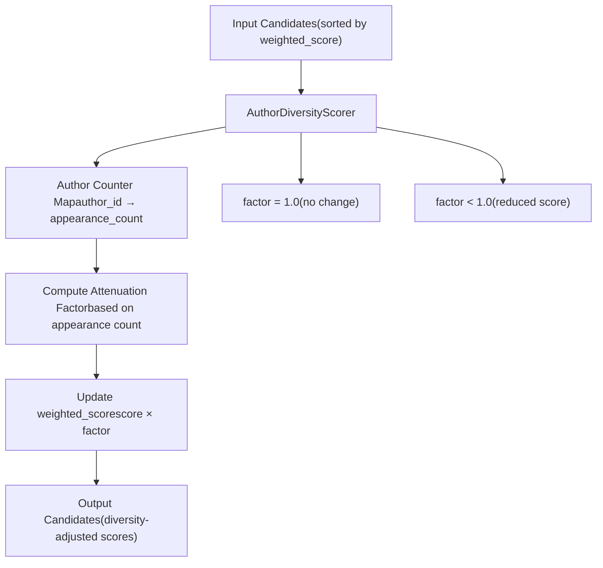
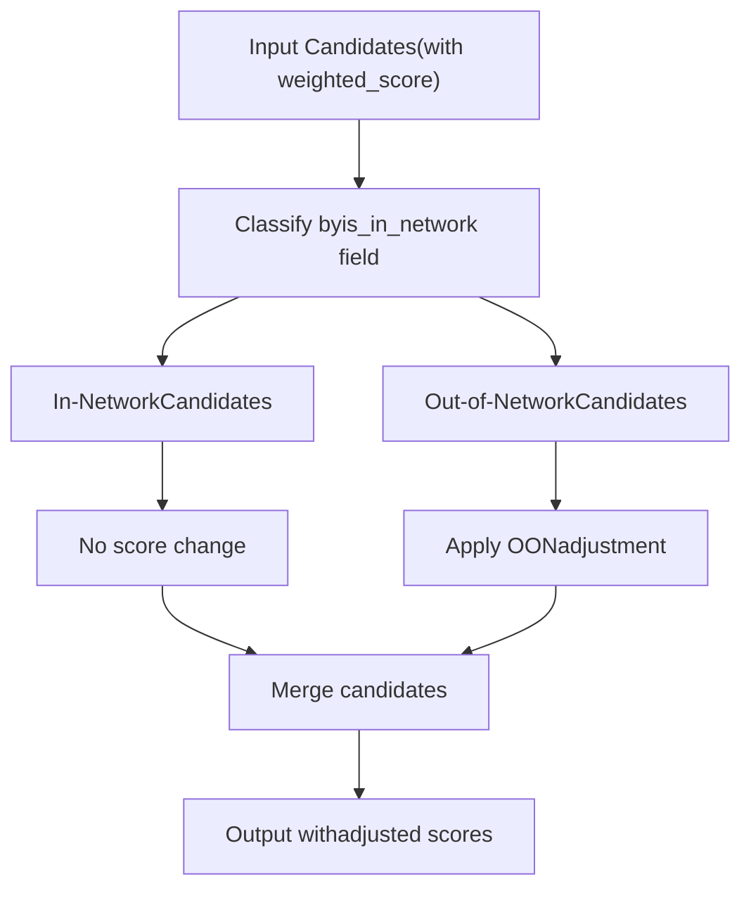
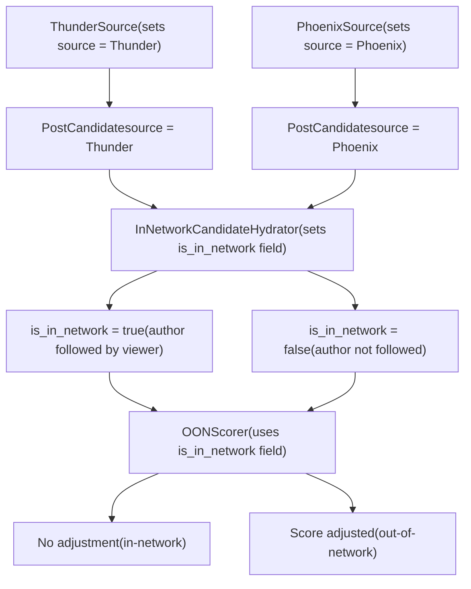
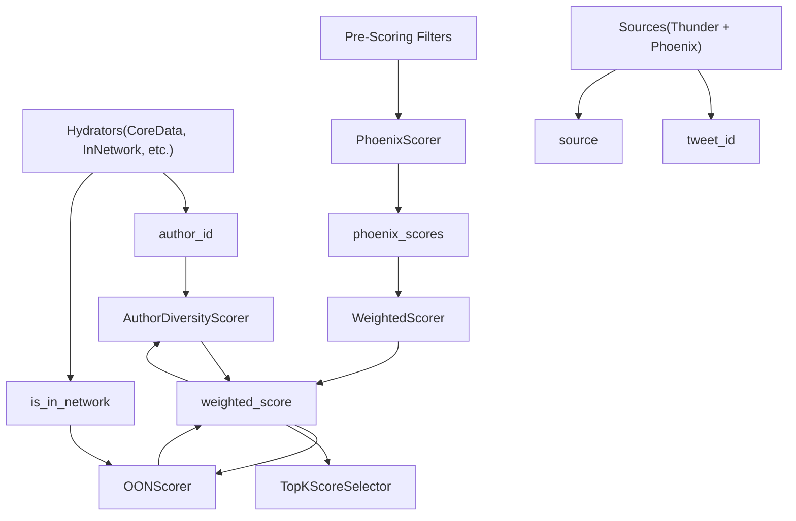

# Author Diversity and OON Scorers

Relevant source files

-   [README.md](https://github.com/xai-org/x-algorithm/blob/aaa167b3/README.md?plain=1)

## Purpose and Scope

This document describes the final scoring adjustments applied after Phoenix ML predictions and weighted score combination. The **Author Diversity Scorer** attenuates scores for candidates from repeatedly appearing authors to ensure feed diversity. The **OON Scorer** applies calibration adjustments specific to out-of-network content. These scorers execute sequentially after the weighted scoring stage and before candidate selection.

For information about Phoenix ML predictions, see [Phoenix Scorer](/xai-org/x-algorithm/4.7.1-phoenix-scorer). For information about weighted score combination, see [Weighted Scorer](/xai-org/x-algorithm/4.7.2-weighted-scorer). For information about the overall scoring pipeline, see [Scorers](/xai-org/x-algorithm/4.7-scorers).

---

## Post-Weighted Scoring Pipeline

After the Phoenix transformer generates engagement predictions and the Weighted Scorer combines them into a relevance score, two additional scoring stages modify the weighted scores to improve feed quality:

| Scorer | Purpose | Execution Mode |
| --- | --- | --- |
| Author Diversity Scorer | Attenuates scores for repeated authors | Sequential |
| OON Scorer | Adjusts out-of-network content scores | Sequential |

These scorers implement the `Scorer` trait and execute sequentially, with each scorer receiving the output from the previous stage. They modify the `weighted_score` field on `PostCandidate` instances without changing the underlying Phoenix predictions.

### Scoring Sequence Diagram

> **[Mermaid sequence]**
> *(图表结构无法解析)*

Sources: [README.md85-102](https://github.com/xai-org/x-algorithm/blob/aaa167b3/README.md?plain=1#L85-L102) [README.md230-235](https://github.com/xai-org/x-algorithm/blob/aaa167b3/README.md?plain=1#L230-L235)

---

## Author Diversity Scorer

### Purpose

The Author Diversity Scorer prevents feed homogeneity by attenuating scores for candidates when multiple posts from the same author appear in the candidate set. Without this adjustment, prolific authors or highly-engaging accounts could dominate the feed, reducing content variety.

### Operation

The scorer processes candidates sequentially (maintaining their current order) and tracks author occurrences:

1.  **Author Tracking**: Maintains a counter for each unique author ID encountered
2.  **Progressive Attenuation**: Applies increasing penalties to subsequent appearances of the same author
3.  **Score Modification**: Updates the `weighted_score` field with the attenuated value
4.  **Preserves Phoenix Scores**: Does not modify the underlying `phoenix_scores` field

### Attenuation Strategy

The typical attenuation approach uses a decay factor that increases with each appearance:

```
attenuated_score = original_score × decay_function(author_appearance_count)
```
Common decay functions include:

-   **Linear decay**: `factor = 1.0 - (count - 1) × decay_rate`
-   **Exponential decay**: `factor = decay_base ^ (count - 1)`
-   **Threshold-based**: Full score for first N appearances, then reduced score

The first appearance from each author typically receives no penalty (`count = 1, factor = 1.0`), ensuring the highest-scoring post from each author retains its original score.

### Interaction with Pipeline


Sources: [README.md99-101](https://github.com/xai-org/x-algorithm/blob/aaa167b3/README.md?plain=1#L99-L101) [README.md230-234](https://github.com/xai-org/x-algorithm/blob/aaa167b3/README.md?plain=1#L230-L234)

### Configuration Parameters

Typical configuration includes:

| Parameter | Description | Type |
| --- | --- | --- |
| `enabled` | Whether to apply author diversity scoring | boolean |
| `decay_rate` | Rate of score attenuation per appearance | float |
| `decay_function` | Type of decay (linear, exponential, threshold) | enum |
| `max_appearances` | Maximum appearances before full attenuation | integer (optional) |

### Example Effect

Consider three posts from the same author with original weighted scores:

| Post ID | Author ID | Original Score | Appearance Count | Attenuation Factor | Final Score |
| --- | --- | --- | --- | --- | --- |
| Post A | Author 123 | 0.95 | 1 | 1.0 | 0.95 |
| Post B | Author 123 | 0.88 | 2 | 0.7 | 0.616 |
| Post C | Author 123 | 0.82 | 3 | 0.4 | 0.328 |

This ensures Post A (the highest-scoring post from Author 123) maintains its position, while subsequent posts receive progressively lower scores, allowing content from other authors to interleave in the feed.

Sources: [README.md99-101](https://github.com/xai-org/x-algorithm/blob/aaa167b3/README.md?plain=1#L99-L101)

---

## OON Scorer

### Purpose

The OON (Out-of-Network) Scorer applies score adjustments specifically to candidates retrieved from Phoenix Retrieval (out-of-network content). These adjustments account for differences in score distributions, calibration, or policy requirements between in-network and out-of-network content.

### Out-of-Network Detection

The scorer identifies OON candidates using the `is_in_network` field on `PostCandidate`, which is set by the `InNetworkCandidateHydrator` during the hydration phase. This field indicates whether the candidate's author is followed by the viewer.

### Score Adjustment Types

OON score adjustments may include:

1.  **Calibration Adjustment**: Normalizes score distributions between in-network and OON content
2.  **Discovery Boost**: Increases OON scores to ensure sufficient discovery content appears
3.  **Quality Threshold**: Applies higher quality bars for OON content
4.  **Policy Adjustment**: Enforces content mix policies (e.g., minimum/maximum OON ratio)

### Operation Flow


Sources: [README.md234](https://github.com/xai-org/x-algorithm/blob/aaa167b3/README.md?plain=1#L234-L234) [README.md29-31](https://github.com/xai-org/x-algorithm/blob/aaa167b3/README.md?plain=1#L29-L31)

### Adjustment Formula

The typical adjustment applies a multiplier or additive factor:

```
adjusted_score = original_score × oon_multiplier + oon_offset
```
Alternatively, percentile-based adjustments may normalize OON scores to match in-network score distributions:

```
adjusted_score = percentile_match(oon_score, in_network_distribution)
```
### Configuration Parameters

| Parameter | Description | Type |
| --- | --- | --- |
| `enabled` | Whether to apply OON score adjustment | boolean |
| `oon_multiplier` | Score multiplier for OON content | float |
| `oon_offset` | Additive offset for OON content | float |
| `adjustment_strategy` | Type of adjustment (multiplier, percentile, threshold) | enum |
| `min_oon_ratio` | Minimum proportion of OON in results | float (optional) |
| `max_oon_ratio` | Maximum proportion of OON in results | float (optional) |

### Integration with Source Information

The OON Scorer relies on metadata set during earlier pipeline stages:


Note that `is_in_network` status is determined by social graph relationship (whether viewer follows author), not by candidate source. A Phoenix-retrieved candidate where the author is followed would be `is_in_network = true` and would not receive OON adjustments.

Sources: [README.md29-31](https://github.com/xai-org/x-algorithm/blob/aaa167b3/README.md?plain=1#L29-L31) [README.md234](https://github.com/xai-org/x-algorithm/blob/aaa167b3/README.md?plain=1#L234-L234)

---

## Execution Order and Dependencies

### Sequential Scoring Chain

The complete scoring pipeline executes in strict sequential order:

1.  **PhoenixScorer**: Generates ML predictions → sets `phoenix_scores` field
2.  **WeightedScorer**: Combines predictions → sets `weighted_score` field
3.  **AuthorDiversityScorer**: Attenuates repeated authors → modifies `weighted_score`
4.  **OONScorer**: Adjusts OON content → modifies `weighted_score`

Each scorer depends on the output of the previous scorer. The sequential execution ensures:

-   Consistent score transformations
-   Predictable attenuation order
-   No race conditions on score updates

### Data Dependencies


Sources: [README.md85-102](https://github.com/xai-org/x-algorithm/blob/aaa167b3/README.md?plain=1#L85-L102) [README.md230-235](https://github.com/xai-org/x-algorithm/blob/aaa167b3/README.md?plain=1#L230-L235)

### Trait Implementation

Both scorers implement the `Scorer` trait from the candidate pipeline framework:

```
Trait: Scorer<ScoredPostsQuery, PostCandidate>
├── score(query, candidates) -> Result<Vec<PostCandidate>>
└── Executed sequentially by PhoenixCandidatePipeline
```
The `Scorer` trait contract requires:

-   Input: Query object and candidate list
-   Output: Same candidates with modified scores
-   Guarantee: Does not add or remove candidates (only modifies scores)
-   Execution: Sequential processing (maintains candidate order)

Sources: [README.md196-198](https://github.com/xai-org/x-algorithm/blob/aaa167b3/README.md?plain=1#L196-L198)

---

## Configuration and Tuning

### Score Adjustment Trade-offs

The diversity and OON scorers balance competing objectives:

| Objective | Scorer | Adjustment Strategy |
| --- | --- | --- |
| Maximize relevance | None (preserve weighted scores) | No adjustment |
| Maximize diversity | Author Diversity | Strong attenuation |
| Balance in-network/OON | OON Scorer | Calibration multipliers |
| Discovery of new content | OON Scorer | OON boost |
| Prevent author domination | Author Diversity | Progressive decay |

### A/B Testing Considerations

These scorers are typically tuned through experimentation:

1.  **Metrics to Track**:

    -   Feed diversity metrics (unique authors per session)
    -   Engagement rates by author appearance position
    -   OON content engagement vs in-network engagement
    -   Session duration and return rate
2.  **Common Experiments**:

    -   Vary author diversity decay rates
    -   Test different OON multipliers
    -   Compare linear vs exponential decay functions
    -   Evaluate threshold-based vs continuous attenuation
3.  **Guardrail Metrics**:

    -   Overall engagement rate (prevent excessive diversity at cost of relevance)
    -   OON negative feedback rate (blocks, mutes, reports)
    -   User retention and satisfaction surveys

Sources: [README.md230-235](https://github.com/xai-org/x-algorithm/blob/aaa167b3/README.md?plain=1#L230-L235)

### Implementation Location

These scorers are implemented as part of the Home Mixer pipeline:

```
home-mixer/
├── phoenix_candidate_pipeline/
│   ├── scorers/
│   │   ├── phoenix_scorer.rs
│   │   ├── weighted_scorer.rs
│   │   ├── author_diversity_scorer.rs  ← Author Diversity Scorer
│   │   └── oon_scorer.rs               ← OON Scorer
│   └── pipeline.rs
```
The `PhoenixCandidatePipeline` struct configures and orchestrates all scorers in sequence.

Sources: [README.md130-146](https://github.com/xai-org/x-algorithm/blob/aaa167b3/README.md?plain=1#L130-L146)

---

## Summary

The Author Diversity Scorer and OON Scorer apply final score adjustments after ML prediction and weighted combination:

-   **Author Diversity Scorer**: Prevents feed homogeneity by progressively attenuating scores for repeated author appearances, ensuring users see content from multiple accounts
-   **OON Scorer**: Calibrates out-of-network content scores to balance discovery with relevance, adjusting for differences in score distributions or policy requirements

Both scorers execute sequentially, modifying the `weighted_score` field without changing underlying Phoenix predictions. They enable the pipeline to balance raw ML relevance with feed quality objectives like diversity and discovery.

Sources: [README.md85-102](https://github.com/xai-org/x-algorithm/blob/aaa167b3/README.md?plain=1#L85-L102) [README.md230-235](https://github.com/xai-org/x-algorithm/blob/aaa167b3/README.md?plain=1#L230-L235)
