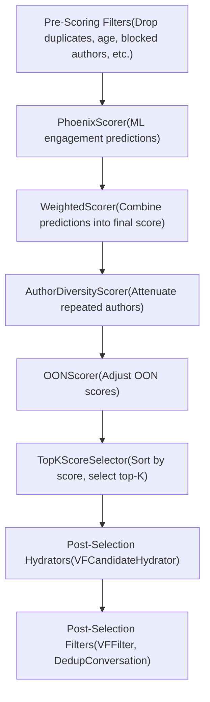
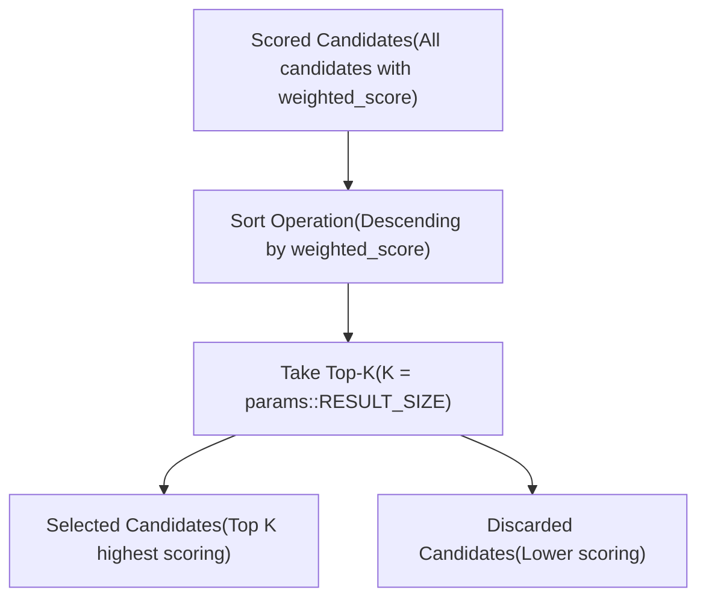
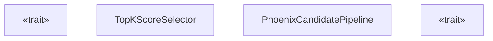
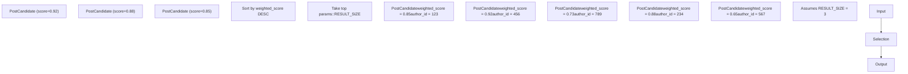
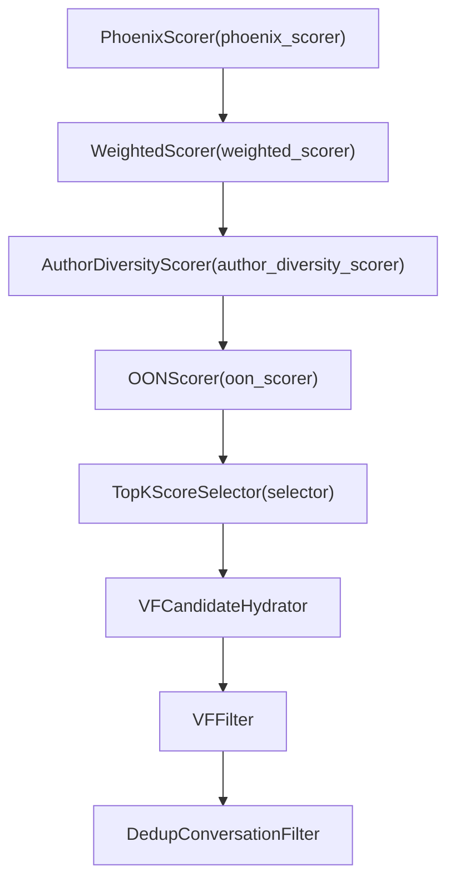

# Selectors

Relevant source files

-   [README.md](https://github.com/xai-org/x-algorithm/blob/aaa167b3/README.md?plain=1)
-   [home-mixer/candidate\_pipeline/phoenix\_candidate\_pipeline.rs](https://github.com/xai-org/x-algorithm/blob/aaa167b3/home-mixer/candidate_pipeline/phoenix_candidate_pipeline.rs)

## Purpose and Scope

This document describes the selector implementations used in the Home Mixer's Phoenix Candidate Pipeline. Selectors are responsible for sorting scored candidates and selecting the top-K results to return to the client. This page focuses on the concrete implementation (`TopKScoreSelector`) used in production. For documentation of the generic `Selector` trait from the candidate pipeline framework, see [Selector Trait](/xai-org/x-algorithm/3.7-selector-trait).

---

## Overview

The selector stage executes after all scoring operations have completed. Its purpose is to:

1.  Sort candidates by their final weighted score in descending order
2.  Select the top N candidates based on a configured result size
3.  Discard lower-scoring candidates to reduce downstream processing

The selector operates on candidates that have already been filtered for eligibility and enriched with ML-based scores from the Phoenix transformer model, weighted combinations, diversity adjustments, and out-of-network score modifications.

**Sources:** [README.md106-108](https://github.com/xai-org/x-algorithm/blob/aaa167b3/README.md?plain=1#L106-L108) [README.md236-237](https://github.com/xai-org/x-algorithm/blob/aaa167b3/README.md?plain=1#L236-L237)

---

## Pipeline Position

The selector executes at a specific point in the pipeline flow, after all scoring stages and before post-selection processing:


**Sources:** [home-mixer/candidate\_pipeline/phoenix\_candidate\_pipeline.rs122-135](https://github.com/xai-org/x-algorithm/blob/aaa167b3/home-mixer/candidate_pipeline/phoenix_candidate_pipeline.rs#L122-L135) [README.md230-237](https://github.com/xai-org/x-algorithm/blob/aaa167b3/README.md?plain=1#L230-L237)

---

## TopKScoreSelector

The `TopKScoreSelector` is the concrete implementation of the `Selector` trait used in the Phoenix Candidate Pipeline. It performs score-based sorting and top-K selection.

### Implementation Details

The selector is instantiated in the pipeline configuration:

| Component | Type | Location |
| --- | --- | --- |
| Struct Definition | `TopKScoreSelector` | `home-mixer/selectors/` (imported) |
| Pipeline Field | `selector: TopKScoreSelector` | [home-mixer/candidate\_pipeline/phoenix\_candidate\_pipeline.rs66](https://github.com/xai-org/x-algorithm/blob/aaa167b3/home-mixer/candidate_pipeline/phoenix_candidate_pipeline.rs#L66-L66) |
| Initialization | `let selector = TopKScoreSelector;` | [home-mixer/candidate\_pipeline/phoenix\_candidate\_pipeline.rs135](https://github.com/xai-org/x-algorithm/blob/aaa167b3/home-mixer/candidate_pipeline/phoenix_candidate_pipeline.rs#L135-L135) |
| Trait Method | `fn selector(&self) -> &dyn Selector<ScoredPostsQuery, PostCandidate>` | [home-mixer/candidate\_pipeline/phoenix\_candidate\_pipeline.rs236-238](https://github.com/xai-org/x-algorithm/blob/aaa167b3/home-mixer/candidate_pipeline/phoenix_candidate_pipeline.rs#L236-L238) |

**Sources:** [home-mixer/candidate\_pipeline/phoenix\_candidate\_pipeline.rs41](https://github.com/xai-org/x-algorithm/blob/aaa167b3/home-mixer/candidate_pipeline/phoenix_candidate_pipeline.rs#L41-L41) [home-mixer/candidate\_pipeline/phoenix\_candidate\_pipeline.rs66](https://github.com/xai-org/x-algorithm/blob/aaa167b3/home-mixer/candidate_pipeline/phoenix_candidate_pipeline.rs#L66-L66) [home-mixer/candidate\_pipeline/phoenix\_candidate\_pipeline.rs135](https://github.com/xai-org/x-algorithm/blob/aaa167b3/home-mixer/candidate_pipeline/phoenix_candidate_pipeline.rs#L135-L135) [home-mixer/candidate\_pipeline/phoenix\_candidate\_pipeline.rs236-238](https://github.com/xai-org/x-algorithm/blob/aaa167b3/home-mixer/candidate_pipeline/phoenix_candidate_pipeline.rs#L236-L238)

---

## Selection Logic

The selector implements the following logic:


### Sorting Key

Candidates are sorted by their `weighted_score` field, which contains the final relevance score computed by the `WeightedScorer` and potentially adjusted by `AuthorDiversityScorer` and `OONScorer`.

### Result Size Configuration

The number of candidates to select is determined by `params::RESULT_SIZE`:

```
fn result_size(&self) -> usize {    params::RESULT_SIZE}
```
This configuration value is accessed by the pipeline framework during selector execution to determine how many candidates to retain.

**Sources:** [home-mixer/candidate\_pipeline/phoenix\_candidate\_pipeline.rs252-254](https://github.com/xai-org/x-algorithm/blob/aaa167b3/home-mixer/candidate_pipeline/phoenix_candidate_pipeline.rs#L252-L254)

---

## Integration with Pipeline Framework

The `TopKScoreSelector` integrates with the generic candidate pipeline framework through trait implementation:


**Sources:** [home-mixer/candidate\_pipeline/phoenix\_candidate\_pipeline.rs60-70](https://github.com/xai-org/x-algorithm/blob/aaa167b3/home-mixer/candidate_pipeline/phoenix_candidate_pipeline.rs#L60-L70) [home-mixer/candidate\_pipeline/phoenix\_candidate\_pipeline.rs216-255](https://github.com/xai-org/x-algorithm/blob/aaa167b3/home-mixer/candidate_pipeline/phoenix_candidate_pipeline.rs#L216-L255)

---

## Data Flow Through Selection

The selector operates on fully-scored `PostCandidate` instances:


### Score Field Requirements

For the selector to function correctly, candidates must have:

-   `weighted_score`: The final combined score computed by scorers
-   Valid numeric score values (not NaN or infinity)

**Sources:** [README.md265-271](https://github.com/xai-org/x-algorithm/blob/aaa167b3/README.md?plain=1#L265-L271)

---

## Execution Context

### Sequential Execution

The selector executes sequentially (not in parallel) because:

1.  It requires all scoring to be complete
2.  Sorting is a sequential operation
3.  It depends on comparing all candidates against each other

### Position in Pipeline Stages

The selector executes between two major pipeline phases:

| Phase | Components | Execution |
| --- | --- | --- |
| **Scoring Phase** | `PhoenixScorer`, `WeightedScorer`, `AuthorDiversityScorer`, `OONScorer` | Sequential scorers |
| **Selection Phase** | `TopKScoreSelector` | Sequential selection |
| **Post-Selection Phase** | `VFCandidateHydrator`, `VFFilter`, `DedupConversationFilter` | Hydrators (parallel), then filters (sequential) |

**Sources:** [home-mixer/candidate\_pipeline/phoenix\_candidate\_pipeline.rs122-143](https://github.com/xai-org/x-algorithm/blob/aaa167b3/home-mixer/candidate_pipeline/phoenix_candidate_pipeline.rs#L122-L143)

---

## Configuration Parameters

The selector's behavior is controlled by the `result_size()` method:

```
fn result_size(&self) -> usize {    params::RESULT_SIZE}
```
| Parameter | Source | Purpose |
| --- | --- | --- |
| `params::RESULT_SIZE` | System configuration | Determines how many top-scoring candidates to select |

This value represents the target number of candidates to return after selection, though the final response may contain fewer candidates after post-selection filtering.

**Sources:** [home-mixer/candidate\_pipeline/phoenix\_candidate\_pipeline.rs252-254](https://github.com/xai-org/x-algorithm/blob/aaa167b3/home-mixer/candidate_pipeline/phoenix_candidate_pipeline.rs#L252-L254)

---

## Relationship to Other Pipeline Components

The selector receives input from scorers and provides output to post-selection stages:


**Sources:** [home-mixer/candidate\_pipeline/phoenix\_candidate\_pipeline.rs122-143](https://github.com/xai-org/x-algorithm/blob/aaa167b3/home-mixer/candidate_pipeline/phoenix_candidate_pipeline.rs#L122-L143)

---

## Summary

The `TopKScoreSelector` provides a simple, efficient mechanism for selecting the highest-scoring candidates after all scoring operations complete. Its implementation:

-   Sorts candidates by `weighted_score` in descending order
-   Selects the top `params::RESULT_SIZE` candidates
-   Executes sequentially after all scoring stages
-   Reduces the candidate set before expensive post-selection operations

The selector is a critical component that determines which candidates proceed to final visibility filtering and ultimately appear in the user's "For You" feed.

**Sources:** [home-mixer/candidate\_pipeline/phoenix\_candidate\_pipeline.rs60-255](https://github.com/xai-org/x-algorithm/blob/aaa167b3/home-mixer/candidate_pipeline/phoenix_candidate_pipeline.rs#L60-L255) [README.md106-108](https://github.com/xai-org/x-algorithm/blob/aaa167b3/README.md?plain=1#L106-L108) [README.md230-237](https://github.com/xai-org/x-algorithm/blob/aaa167b3/README.md?plain=1#L230-L237)
