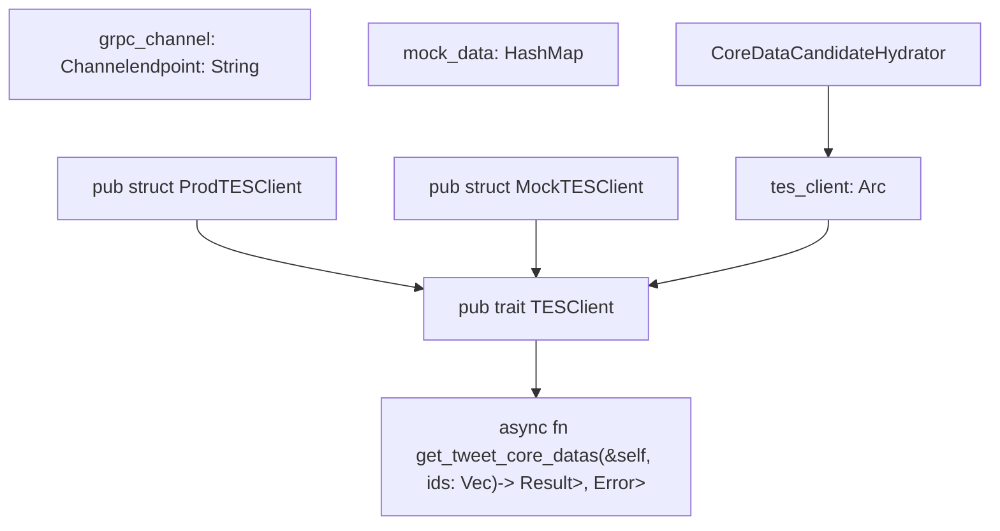
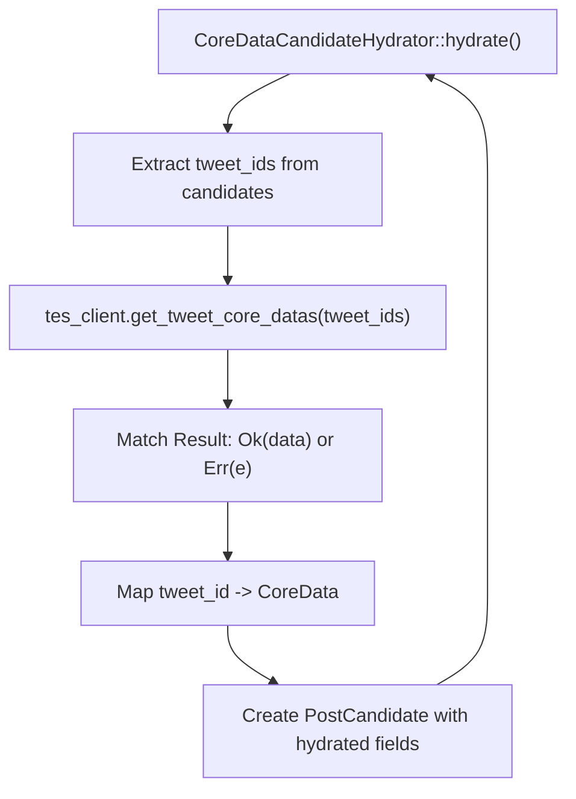

# External Services Integration

Relevant source files

-   [home-mixer/candidate\_hydrators/core\_data\_candidate\_hydrator.rs](https://github.com/xai-org/x-algorithm/blob/aaa167b3/home-mixer/candidate_hydrators/core_data_candidate_hydrator.rs)
-   [home-mixer/candidate\_pipeline/phoenix\_candidate\_pipeline.rs](https://github.com/xai-org/x-algorithm/blob/aaa167b3/home-mixer/candidate_pipeline/phoenix_candidate_pipeline.rs)

## Purpose and Scope

This document provides an overview of how the X Algorithm integrates with external services to retrieve data and perform specialized operations. The Home Mixer's Phoenix Candidate Pipeline depends on multiple external services for tweet metadata, user profiles, visibility filtering, machine learning predictions, and real-time post storage. These integrations follow a consistent architectural pattern using trait-based client abstractions and dependency injection.

This page covers the overall integration architecture, abstraction patterns, and initialization strategies. For detailed documentation of individual service integrations, see:

-   [Client Architecture](/xai-org/x-algorithm/5.1-client-architecture) - trait design and dependency injection patterns
-   [Tweet Entity Service (TES)](/xai-org/x-algorithm/5.2-tweet-entity-service-(tes)) - tweet metadata retrieval
-   [Gizmoduck Service](/xai-org/x-algorithm/5.3-gizmoduck-service) - user profile data
-   [Visibility Filtering Service](/xai-org/x-algorithm/5.4-visibility-filtering-service) - content safety checks
-   [Phoenix ML Services](/xai-org/x-algorithm/5.5-phoenix-ml-services) - retrieval and ranking
-   [Thunder Service](/xai-org/x-algorithm/5.6-thunder-service) - real-time in-network posts
-   [Strato and Other Services](/xai-org/x-algorithm/5.7-strato-and-other-services) - caching and user actions

## Integration Architecture

The external services integration follows a three-layer architecture that separates pipeline logic from service communication details:

```mermaid
flowchart TD
    QH["QueryHydrators(UserActionSeqQueryHydrator,UserFeaturesQueryHydrator)"]
    Sources["Sources(PhoenixSource,ThunderSource)"]
    Hydrators["Hydrators(CoreDataCandidateHydrator,GizmoduckHydrator,VFCandidateHydrator,VideoDurationCandidateHydrator,SubscriptionHydrator)"]
    Scorers["Scorers(PhoenixScorer)"]
    SideEffects["SideEffects(CacheRequestInfoSideEffect)"]
    UASF["UserActionSequenceFetcher"]
    TESClient["TESClient trait"]
    GizmoClient["GizmoduckClient trait"]
    VFClient["VisibilityFilteringClient trait"]
    PhoenixPredClient["PhoenixPredictionClient trait"]
    PhoenixRetClient["PhoenixRetrievalClient trait"]
    ThunderClient["ThunderClient struct"]
    StratoClient["StratoClient trait"]
    UASvc["User Action Service"]
    TESSvc["Tweet Entity Service"]
    GizmoSvc["Gizmoduck Service"]
    VFSvc["Visibility Filtering Service"]
    PhoenixSvc["Phoenix ML Service"]
    ThunderSvc["Thunder Service"]
    StratoSvc["Strato Cache"]

    QH --> UASF
    QH --> StratoClient
    Sources --> PhoenixRetClient
    Sources --> ThunderClient
    Hydrators --> TESClient
    Hydrators --> GizmoClient
    Hydrators --> VFClient
    Scorers --> PhoenixPredClient
    SideEffects --> StratoClient
    UASF --> UASvc
    TESClient --> TESSvc
    GizmoClient --> GizmoSvc
    VFClient --> VFSvc
    PhoenixPredClient --> PhoenixSvc
    PhoenixRetClient --> PhoenixSvc
    ThunderClient --> ThunderSvc
    StratoClient --> StratoSvc
```


**Sources:** [home-mixer/candidate\_pipeline/phoenix\_candidate\_pipeline.rs1-256](https://github.com/xai-org/x-algorithm/blob/aaa167b3/home-mixer/candidate_pipeline/phoenix_candidate_pipeline.rs#L1-L256)

### Layer Responsibilities

| Layer | Responsibility | Key Characteristics |
| --- | --- | --- |
| **Pipeline Components** | Business logic for query hydration, candidate retrieval, enrichment, scoring | Type-safe, framework-based, reusable |
| **Client Abstraction** | Service communication protocols, error handling, serialization | Trait-based, mockable, dependency-injected |
| **External Services** | Data storage, ML inference, real-time processing | Independent deployment, specialized functionality |

## Service Integration Overview

The Phoenix Candidate Pipeline integrates with seven major external services, each providing specialized functionality:

| Service | Client Interface | Primary Users | Purpose |
| --- | --- | --- | --- |
| **User Action Service** | `UserActionSequenceFetcher` | `UserActionSeqQueryHydrator` | Retrieve user engagement history for personalization |
| **Tweet Entity Service (TES)** | `TESClient` trait | `CoreDataCandidateHydrator`, `VideoDurationCandidateHydrator`, `SubscriptionHydrator` | Fetch tweet metadata, media entities, subscription data |
| **Gizmoduck** | `GizmoduckClient` trait | `GizmoduckCandidateHydrator` | Retrieve user profiles, follower counts, screen names |
| **Visibility Filtering** | `VisibilityFilteringClient` trait | `VFCandidateHydrator`, `VFFilter` | Apply content safety and policy filtering |
| **Phoenix ML Service** | `PhoenixPredictionClient` trait, `PhoenixRetrievalClient` trait | `PhoenixSource`, `PhoenixScorer` | Two-tower retrieval and Grok transformer ranking |
| **Thunder Service** | `ThunderClient` struct | `ThunderSource` | Real-time in-network post retrieval from in-memory store |
| **Strato Cache** | `StratoClient` trait | `UserFeaturesQueryHydrator`, `CacheRequestInfoSideEffect` | Distributed caching for user features and request metadata |

**Sources:** [home-mixer/candidate\_pipeline/phoenix\_candidate\_pipeline.rs9-21](https://github.com/xai-org/x-algorithm/blob/aaa167b3/home-mixer/candidate_pipeline/phoenix_candidate_pipeline.rs#L9-L21) [home-mixer/candidate\_pipeline/phoenix\_candidate\_pipeline.rs73-82](https://github.com/xai-org/x-algorithm/blob/aaa167b3/home-mixer/candidate_pipeline/phoenix_candidate_pipeline.rs#L73-L82)

## Client Abstraction Pattern

All external service integrations follow a consistent trait-based abstraction pattern that enables dependency injection, testing, and service evolution:


**Sources:** [home-mixer/candidate\_hydrators/core\_data\_candidate\_hydrator.rs8-10](https://github.com/xai-org/x-algorithm/blob/aaa167b3/home-mixer/candidate_hydrators/core_data_candidate_hydrator.rs#L8-L10)

### Key Design Principles

1.  **Trait-Based Contracts**: Each service defines a trait interface that specifies required methods and return types
2.  **Thread-Safe References**: Clients are wrapped in `Arc<dyn Trait + Send + Sync>` for concurrent access
3.  **Production vs Test Implementations**: Production clients implement actual gRPC communication, while test implementations provide mockable data
4.  **Async-First**: All client methods are async to support non-blocking I/O
5.  **Error Propagation**: Clients return `Result` types to propagate service errors to callers

## Client Initialization and Dependency Injection

The `PhoenixCandidatePipeline` follows a constructor-based dependency injection pattern, initializing all clients during pipeline creation and passing them to dependent components:

> **[Mermaid sequence]**
> *(图表结构无法解析)*

**Sources:** [home-mixer/candidate\_pipeline/phoenix\_candidate\_pipeline.rs162-212](https://github.com/xai-org/x-algorithm/blob/aaa167b3/home-mixer/candidate_pipeline/phoenix_candidate_pipeline.rs#L162-L212)

### Production Client Initialization

The `PhoenixCandidatePipeline::prod()` method [home-mixer/candidate\_pipeline/phoenix\_candidate\_pipeline.rs162-212](https://github.com/xai-org/x-algorithm/blob/aaa167b3/home-mixer/candidate_pipeline/phoenix_candidate_pipeline.rs#L162-L212) demonstrates the initialization sequence:

1.  **User Action Fetcher** - Creates connection to User Action Service for engagement history
2.  **Phoenix Clients** - Initializes both retrieval (two-tower) and prediction (Grok transformer) clients
3.  **Thunder Client** - Establishes connection to real-time in-network post store
4.  **Strato Client** - Connects to distributed cache for user features and request tracking
5.  **TES Client** - Initializes gRPC channel to Tweet Entity Service
6.  **Gizmoduck Client** - Creates connection for user profile retrieval
7.  **Visibility Filtering Client** - Configures mTLS with S2S certificates for content safety checks

All clients are wrapped in `Arc` to enable shared ownership across multiple pipeline components that may execute in parallel.

### Component Construction with Injected Clients

After client initialization, the `build_with_clients()` method [home-mixer/candidate\_pipeline/phoenix\_candidate\_pipeline.rs73-160](https://github.com/xai-org/x-algorithm/blob/aaa167b3/home-mixer/candidate_pipeline/phoenix_candidate_pipeline.rs#L73-L160) constructs pipeline components by injecting the appropriate clients:

```
// Example: CoreDataCandidateHydrator receives TESClientlet hydrators: Vec<Box<dyn Hydrator<ScoredPostsQuery, PostCandidate>>> = vec![    Box::new(CoreDataCandidateHydrator::new(tes_client.clone()).await),    Box::new(VideoDurationCandidateHydrator::new(tes_client.clone()).await),    Box::new(SubscriptionHydrator::new(tes_client.clone()).await),    Box::new(GizmoduckCandidateHydrator::new(gizmoduck_client).await),];
```
Multiple components can share the same client instance through `Arc::clone()`, which increments the reference count without duplicating the underlying client.

**Sources:** [home-mixer/candidate\_pipeline/phoenix\_candidate\_pipeline.rs100-106](https://github.com/xai-org/x-algorithm/blob/aaa167b3/home-mixer/candidate_pipeline/phoenix_candidate_pipeline.rs#L100-L106)

## Client Usage Patterns

Pipeline components interact with clients through their trait interfaces, enabling decoupling from implementation details:


**Sources:** [home-mixer/candidate\_hydrators/core\_data\_candidate\_hydrator.rs19-58](https://github.com/xai-org/x-algorithm/blob/aaa167b3/home-mixer/candidate_hydrators/core_data_candidate_hydrator.rs#L19-L58)

### Typical Client Interaction Flow

The `CoreDataCandidateHydrator` demonstrates the standard pattern for using clients [home-mixer/candidate\_hydrators/core\_data\_candidate\_hydrator.rs21-50](https://github.com/xai-org/x-algorithm/blob/aaa167b3/home-mixer/candidate_hydrators/core_data_candidate_hydrator.rs#L21-L50):

1.  **Extract Request Parameters** - Collect tweet IDs from candidates: `let tweet_ids = candidates.iter().map(|c| c.tweet_id).collect::<Vec<_>>()`
2.  **Invoke Client Method** - Call async trait method: `let post_features = client.get_tweet_core_datas(tweet_ids.clone()).await`
3.  **Handle Errors** - Convert service errors to pipeline errors: `let post_features = post_features.map_err(|e| e.to_string())?`
4.  **Map Response Data** - Associate returned data with candidates: `let post_features = post_features.get(&tweet_id)`
5.  **Update Candidates** - Create or modify candidate structures with fetched data
6.  **Return Results** - Return `Ok(Vec<PostCandidate>)` or propagate errors

This pattern ensures consistent error handling and data flow across all service integrations.

## Communication Protocols and Error Handling

External service clients use various communication protocols based on service requirements:

| Client | Protocol | Connection Management | Error Handling |
| --- | --- | --- | --- |
| `ProdTESClient` | gRPC | Persistent channel with connection pooling | Returns `Result<T, tonic::Status>` |
| `ProdGizmoduckClient` | gRPC | Persistent channel with connection pooling | Returns `Result<T, tonic::Status>` |
| `ProdVisibilityFilteringClient` | gRPC with mTLS | S2S authenticated channel with certificate rotation | Returns `Result<T, tonic::Status>` |
| `ProdPhoenixPredictionClient` | gRPC | Persistent channel to ML inference service | Returns `Result<T, tonic::Status>` |
| `ProdPhoenixRetrievalClient` | gRPC | Persistent channel to ML retrieval service | Returns `Result<T, tonic::Status>` |
| `ThunderClient` | gRPC | Persistent channel to real-time service | Returns `Result<T, tonic::Status>` |
| `ProdStratoClient` | gRPC | Persistent channel to cache service | Returns `Result<T, tonic::Status>` |

All gRPC clients handle connection failures, timeouts, and service errors by returning `Result` types. Pipeline components propagate these errors up the execution chain where the `CandidatePipeline::execute()` method can apply appropriate fallback strategies.

**Sources:** [home-mixer/candidate\_pipeline/phoenix\_candidate\_pipeline.rs162-212](https://github.com/xai-org/x-algorithm/blob/aaa167b3/home-mixer/candidate_pipeline/phoenix_candidate_pipeline.rs#L162-L212)

## Service Authentication and Security

The Visibility Filtering Service requires mutual TLS (mTLS) authentication using service-to-service (S2S) certificates:

```
let vf_client = Arc::new(    ProdVisibilityFilteringClient::new(        S2S_CHAIN_PATH.clone(),        S2S_CRT_PATH.clone(),        S2S_KEY_PATH.clone()    )    .await    .expect("Failed to create VF client"),);
```
The S2S certificate paths [home-mixer/candidate\_pipeline/phoenix\_candidate\_pipeline.rs16](https://github.com/xai-org/x-algorithm/blob/aaa167b3/home-mixer/candidate_pipeline/phoenix_candidate_pipeline.rs#L16-L16) point to:

-   `S2S_CHAIN_PATH` - Certificate authority chain
-   `S2S_CRT_PATH` - Client certificate
-   `S2S_KEY_PATH` - Private key

This authentication mechanism ensures that only authorized services can request content safety filtering operations.

**Sources:** [home-mixer/candidate\_pipeline/phoenix\_candidate\_pipeline.rs193-200](https://github.com/xai-org/x-algorithm/blob/aaa167b3/home-mixer/candidate_pipeline/phoenix_candidate_pipeline.rs#L193-L200)

## Performance Considerations

The client abstraction layer incorporates several optimizations:

1.  **Connection Pooling** - gRPC channels maintain persistent connections with connection pooling to minimize handshake overhead
2.  **Batched Requests** - Clients like `TESClient` and `GizmoduckClient` accept vectors of IDs and return batch responses, reducing round-trip count
3.  **Parallel Execution** - Multiple hydrators can invoke their respective clients concurrently since clients are `Send + Sync`
4.  **Shared Client Instances** - Using `Arc` avoids duplicating client state when multiple components need the same service
5.  **Async I/O** - All client methods are async, preventing thread blocking during network operations

## Summary

The external services integration architecture provides a clean separation between pipeline logic and service communication through trait-based client abstractions. The dependency injection pattern enables testability while the consistent error handling and async design support robust, high-performance operation. The following pages detail each service integration:

-   [Client Architecture](/xai-org/x-algorithm/5.1-client-architecture) - detailed trait design patterns and testing strategies
-   [Tweet Entity Service (TES)](/xai-org/x-algorithm/5.2-tweet-entity-service-(tes)) - core tweet metadata and media information
-   [Gizmoduck Service](/xai-org/x-algorithm/5.3-gizmoduck-service) - user profiles and social graph data
-   [Visibility Filtering Service](/xai-org/x-algorithm/5.4-visibility-filtering-service) - content safety and policy enforcement
-   [Phoenix ML Services](/xai-org/x-algorithm/5.5-phoenix-ml-services) - two-tower retrieval and Grok transformer ranking
-   [Thunder Service](/xai-org/x-algorithm/5.6-thunder-service) - real-time in-network post storage and retrieval
-   [Strato and Other Services](/xai-org/x-algorithm/5.7-strato-and-other-services) - caching, user actions, and auxiliary services

**Sources:** [home-mixer/candidate\_pipeline/phoenix\_candidate\_pipeline.rs1-256](https://github.com/xai-org/x-algorithm/blob/aaa167b3/home-mixer/candidate_pipeline/phoenix_candidate_pipeline.rs#L1-L256) [home-mixer/candidate\_hydrators/core\_data\_candidate\_hydrator.rs1-59](https://github.com/xai-org/x-algorithm/blob/aaa167b3/home-mixer/candidate_hydrators/core_data_candidate_hydrator.rs#L1-L59)
