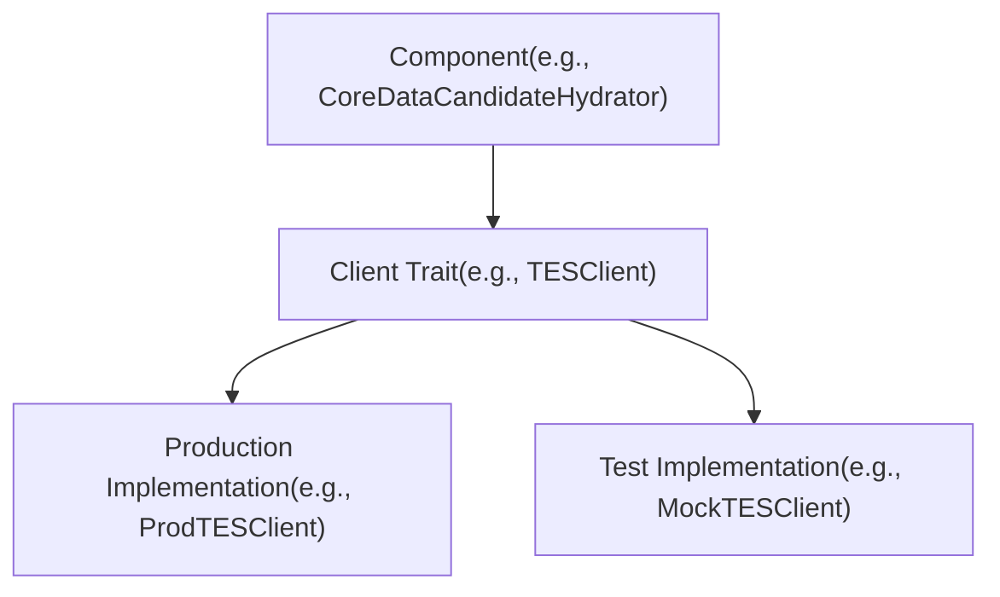
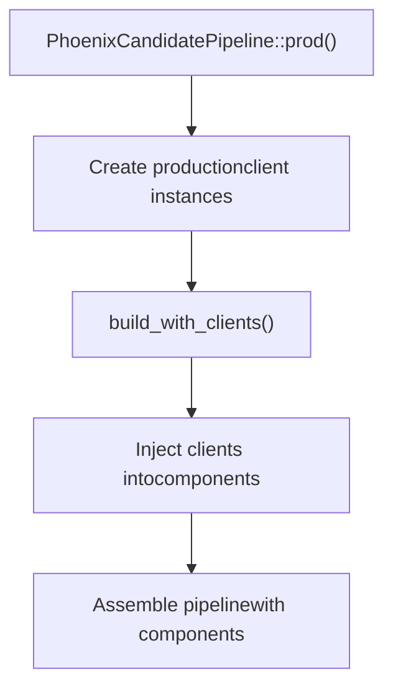
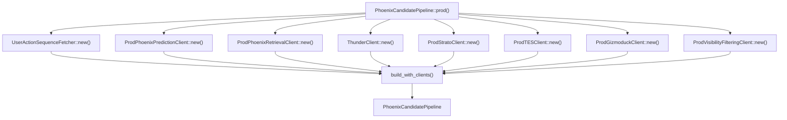
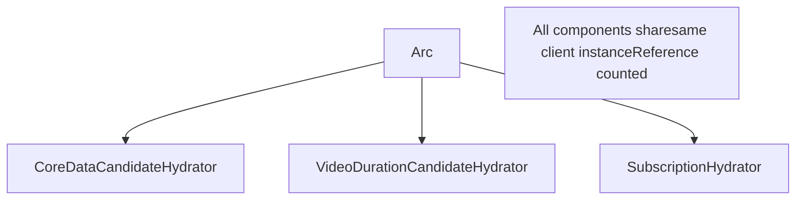

# Client Architecture

Relevant source files

-   [home-mixer/candidate\_pipeline/phoenix\_candidate\_pipeline.rs](https://github.com/xai-org/x-algorithm/blob/aaa167b3/home-mixer/candidate_pipeline/phoenix_candidate_pipeline.rs)

## Purpose and Scope

This page documents the trait-based abstraction layer that the Home Mixer uses to communicate with external services. It covers the client interface design patterns, dependency injection strategies, production vs test configurations, and the lifecycle of client instances throughout the pipeline.

For documentation on specific client implementations and their service interactions, see [Tweet Entity Service (TES)](/xai-org/x-algorithm/5.2-tweet-entity-service-(tes)), [Gizmoduck Service](/xai-org/x-algorithm/5.3-gizmoduck-service), [Visibility Filtering Service](/xai-org/x-algorithm/5.4-visibility-filtering-service), [Phoenix ML Services](/xai-org/x-algorithm/5.5-phoenix-ml-services), [Thunder Service](/xai-org/x-algorithm/5.6-thunder-service), and [Strato and Other Services](/xai-org/x-algorithm/5.7-strato-and-other-services).

---

## Overview

The client architecture follows a trait-based abstraction pattern that decouples the pipeline implementation from concrete service integrations. Each external service is accessed through a Rust trait interface, with production implementations that handle actual gRPC/HTTP communication and potential test implementations that provide mocks or stubs.

This architecture provides:

-   **Testability**: Mock clients can be injected for unit testing without requiring live services
-   **Modularity**: Services can be replaced or upgraded independently of pipeline logic
-   **Type safety**: Trait bounds enforce compile-time guarantees about client capabilities
-   **Thread safety**: `Send + Sync` bounds ensure clients can be safely shared across async tasks

Sources: [home-mixer/candidate\_pipeline/phoenix\_candidate\_pipeline.rs1-256](https://github.com/xai-org/x-algorithm/blob/aaa167b3/home-mixer/candidate_pipeline/phoenix_candidate_pipeline.rs#L1-L256)

---

## Client Trait Pattern

### Trait Definition and Implementation Structure

Each external service integration follows a consistent pattern:

1.  **Trait Interface**: Defines the contract for interacting with the service (e.g., `TESClient`, `GizmoduckClient`)
2.  **Production Implementation**: Concrete struct that implements the trait with actual service calls (e.g., `ProdTESClient`, `ProdGizmoduckClient`)
3.  **Trait Bounds**: All client traits require `Send + Sync` for thread-safe sharing across async contexts


**Trait Interface Example Pattern**

The trait typically defines async methods for service operations:

```
pub trait TESClient: Send + Sync {    async fn get_tweets(&self, ids: Vec<i64>) -> Result<Vec<Tweet>>;    async fn get_media_entities(&self, ids: Vec<i64>) -> Result<Vec<MediaEntity>>;}
```
**Production Implementation Pattern**

Production implementations contain the gRPC client and connection logic:

```
pub struct ProdTESClient {    grpc_client: TweetEntityServiceGrpcClient,} impl TESClient for ProdTESClient {    async fn get_tweets(&self, ids: Vec<i64>) -> Result<Vec<Tweet>> {        // Actual gRPC call to TES    }}
```
Sources: [home-mixer/candidate\_pipeline/phoenix\_candidate\_pipeline.rs9-21](https://github.com/xai-org/x-algorithm/blob/aaa167b3/home-mixer/candidate_pipeline/phoenix_candidate_pipeline.rs#L9-L21) [home-mixer/candidate\_pipeline/phoenix\_candidate\_pipeline.rs73-82](https://github.com/xai-org/x-algorithm/blob/aaa167b3/home-mixer/candidate_pipeline/phoenix_candidate_pipeline.rs#L73-L82)

---

## Client Inventory

The following table catalogs all client traits used in the pipeline:

| Client Trait | Production Implementation | Purpose | Used By |
| --- | --- | --- | --- |
| `TESClient` | `ProdTESClient` | Tweet metadata, media entities, subscription data | CoreDataCandidateHydrator, VideoDurationCandidateHydrator, SubscriptionHydrator |
| `GizmoduckClient` | `ProdGizmoduckClient` | User profile data, follower counts, screen names | GizmoduckCandidateHydrator |
| `VisibilityFilteringClient` | `ProdVisibilityFilteringClient` | Content safety filtering with safety levels | VFCandidateHydrator, VFFilter |
| `PhoenixPredictionClient` | `ProdPhoenixPredictionClient` | Grok transformer engagement predictions | PhoenixScorer |
| `PhoenixRetrievalClient` | `ProdPhoenixRetrievalClient` | Two-tower similarity search for OON candidates | PhoenixSource |
| `StratoClient` | `ProdStratoClient` | Distributed caching and user features | UserFeaturesQueryHydrator, CacheRequestInfoSideEffect |
| `ThunderClient` | `ThunderClient` | Real-time in-network post retrieval | ThunderSource |
| `SocialGraphClient` | `SocialGraphClient` | User relationships (follows, blocks, mutes) | AuthorSocialgraphFilter (indirect) |
| `UserActionSequenceFetcher` | `UserActionSequenceFetcher` | User engagement history and action sequences | UserActionSeqQueryHydrator |

Sources: [home-mixer/candidate\_pipeline/phoenix\_candidate\_pipeline.rs9-21](https://github.com/xai-org/x-algorithm/blob/aaa167b3/home-mixer/candidate_pipeline/phoenix_candidate_pipeline.rs#L9-L21) [home-mixer/candidate\_pipeline/phoenix\_candidate\_pipeline.rs35-44](https://github.com/xai-org/x-algorithm/blob/aaa167b3/home-mixer/candidate_pipeline/phoenix_candidate_pipeline.rs#L35-L44)

---

## Dependency Injection Pattern

### Build-with-Clients Method

The `PhoenixCandidatePipeline` uses a two-phase initialization pattern that separates client creation from pipeline construction.


**Build-with-Clients Signature**

The `build_with_clients` method accepts all client dependencies as trait object parameters wrapped in `Arc`:

[home-mixer/candidate\_pipeline/phoenix\_candidate\_pipeline.rs73-82](https://github.com/xai-org/x-algorithm/blob/aaa167b3/home-mixer/candidate_pipeline/phoenix_candidate_pipeline.rs#L73-L82)

```
async fn build_with_clients(    uas_fetcher: Arc<UserActionSequenceFetcher>,    phoenix_client: Arc<dyn PhoenixPredictionClient + Send + Sync>,    phoenix_retrieval_client: Arc<dyn PhoenixRetrievalClient + Send + Sync>,    thunder_client: Arc<ThunderClient>,    strato_client: Arc<dyn StratoClient + Send + Sync>,    tes_client: Arc<dyn TESClient + Send + Sync>,    gizmoduck_client: Arc<dyn GizmoduckClient + Send + Sync>,    vf_client: Arc<dyn VisibilityFilteringClient + Send + Sync>,) -> PhoenixCandidatePipeline
```
**Key Design Choices**:

-   **Arc wrapping**: Enables shared ownership across multiple components that need the same client
-   **Trait objects**: `Arc<dyn Trait + Send + Sync>` allows injection of any implementation
-   **Send + Sync bounds**: Required for sharing clients across async tasks in the pipeline

### Client Distribution to Components

Inside `build_with_clients`, clients are distributed to the components that need them:

[home-mixer/candidate\_pipeline/phoenix\_candidate\_pipeline.rs84-147](https://github.com/xai-org/x-algorithm/blob/aaa167b3/home-mixer/candidate_pipeline/phoenix_candidate_pipeline.rs#L84-L147)

**Query Hydrators receive clients**:

```
let query_hydrators: Vec<Box<dyn QueryHydrator<ScoredPostsQuery>>> = vec![    Box::new(UserActionSeqQueryHydrator::new(uas_fetcher)),    Box::new(UserFeaturesQueryHydrator {        strato_client: strato_client.clone(),    }),];
```
**Sources receive clients**:

```
let phoenix_source = Box::new(PhoenixSource {    phoenix_retrieval_client,});let thunder_source = Box::new(ThunderSource { thunder_client });
```
**Hydrators receive clients**:

```
let hydrators: Vec<Box<dyn Hydrator<ScoredPostsQuery, PostCandidate>>> = vec![    Box::new(CoreDataCandidateHydrator::new(tes_client.clone()).await),    Box::new(GizmoduckCandidateHydrator::new(gizmoduck_client).await),    Box::new(VideoDurationCandidateHydrator::new(tes_client.clone()).await),    Box::new(SubscriptionHydrator::new(tes_client.clone()).await),    // ...];
```
**Scorers receive clients**:

```
let phoenix_scorer = Box::new(PhoenixScorer { phoenix_client });
```
**Side effects receive clients**:

```
let side_effects: Arc<Vec<Box<dyn SideEffect<ScoredPostsQuery, PostCandidate>>>> =    Arc::new(vec![Box::new(CacheRequestInfoSideEffect { strato_client })]);
```
Sources: [home-mixer/candidate\_pipeline/phoenix\_candidate\_pipeline.rs73-160](https://github.com/xai-org/x-algorithm/blob/aaa167b3/home-mixer/candidate_pipeline/phoenix_candidate_pipeline.rs#L73-L160)

---

## Production vs Test Configurations

### Production Configuration

The `prod()` method creates the production configuration with real service clients:

[home-mixer/candidate\_pipeline/phoenix\_candidate\_pipeline.rs162-212](https://github.com/xai-org/x-algorithm/blob/aaa167b3/home-mixer/candidate_pipeline/phoenix_candidate_pipeline.rs#L162-L212)


Each production client performs:

1.  **Async initialization**: `.await` on `new()` to establish connections
2.  **Error handling**: `expect()` propagates initialization failures
3.  **Arc wrapping**: Wraps instances for shared ownership
4.  **Service-specific configuration**: Some clients (e.g., VF) require TLS certificate paths

**VF Client TLS Configuration Example**:

[home-mixer/candidate\_pipeline/phoenix\_candidate\_pipeline.rs192-200](https://github.com/xai-org/x-algorithm/blob/aaa167b3/home-mixer/candidate_pipeline/phoenix_candidate_pipeline.rs#L192-L200)

```
let vf_client = Arc::new(    ProdVisibilityFilteringClient::new(        S2S_CHAIN_PATH.clone(),        S2S_CRT_PATH.clone(),        S2S_KEY_PATH.clone()    )    .await    .expect("Failed to create VF client"),);
```
### Test Configuration Pattern

While not shown in the provided files, the test configuration pattern would follow:

```
impl PhoenixCandidatePipeline {    #[cfg(test)]    pub async fn test(        mock_tes: Arc<dyn TESClient + Send + Sync>,        mock_gizmoduck: Arc<dyn GizmoduckClient + Send + Sync>,        // ... other mocks    ) -> PhoenixCandidatePipeline {        PhoenixCandidatePipeline::build_with_clients(            // inject mock implementations        ).await    }}
```
This allows unit tests to inject mock clients that return controlled data without requiring live services.

Sources: [home-mixer/candidate\_pipeline/phoenix\_candidate\_pipeline.rs162-212](https://github.com/xai-org/x-algorithm/blob/aaa167b3/home-mixer/candidate_pipeline/phoenix_candidate_pipeline.rs#L162-L212)

---

## Client Lifecycle and Ownership

### Arc-Based Shared Ownership

Clients use `Arc<T>` (Atomic Reference Counting) for shared ownership across pipeline components:


**Client Cloning Pattern**:

When multiple components need the same client, `Arc::clone()` is used to increment the reference count without copying the underlying client:

[home-mixer/candidate\_pipeline/phoenix\_candidate\_pipeline.rs102-104](https://github.com/xai-org/x-algorithm/blob/aaa167b3/home-mixer/candidate_pipeline/phoenix_candidate_pipeline.rs#L102-L104)

```
Box::new(CoreDataCandidateHydrator::new(tes_client.clone()).await),Box::new(VideoDurationCandidateHydrator::new(tes_client.clone()).await),Box::new(SubscriptionHydrator::new(tes_client.clone()).await),
```
This pattern ensures:

-   **Single instance**: Only one connection pool per service
-   **Automatic cleanup**: Client is dropped when all references are released
-   **Thread safety**: `Arc` provides atomic reference counting for concurrent access

### Thread Safety Requirements

All clients must implement `Send + Sync`:

-   **Send**: Client can be transferred between threads
-   **Sync**: Client can be accessed from multiple threads simultaneously (via `&self` references)

These bounds are enforced in the trait object declarations:

```
Arc<dyn TESClient + Send + Sync>Arc<dyn GizmoduckClient + Send + Sync>Arc<dyn VisibilityFilteringClient + Send + Sync>
```
This is critical because the pipeline executes stages in parallel across async tasks, requiring concurrent access to shared client instances.

Sources: [home-mixer/candidate\_pipeline/phoenix\_candidate\_pipeline.rs73-82](https://github.com/xai-org/x-algorithm/blob/aaa167b3/home-mixer/candidate_pipeline/phoenix_candidate_pipeline.rs#L73-L82) [home-mixer/candidate\_pipeline/phoenix\_candidate\_pipeline.rs100-106](https://github.com/xai-org/x-algorithm/blob/aaa167b3/home-mixer/candidate_pipeline/phoenix_candidate_pipeline.rs#L100-L106)

---

## Client-to-Component Dependency Flow

The following diagram maps which pipeline components depend on which clients:

```mermaid
flowchart TD
    UASClient["UserActionSequenceFetcher"]
    StratoClient["Arc<dyn StratoClient>"]
    PhoenixPredClient["Arc<dyn PhoenixPredictionClient>"]
    PhoenixRetClient["Arc<dyn PhoenixRetrievalClient>"]
    ThunderClient["Arc<ThunderClient>"]
    TESClient["Arc<dyn TESClient>"]
    GizmoClient["Arc<dyn GizmoduckClient>"]
    VFClient["Arc<dyn VisibilityFilteringClient>"]
    UASQH["UserActionSeqQueryHydrator"]
    UFQH["UserFeaturesQueryHydrator"]
    PhoenixSrc["PhoenixSource"]
    ThunderSrc["ThunderSource"]
    CoreData["CoreDataCandidateHydrator"]
    VideoDur["VideoDurationCandidateHydrator"]
    Subscription["SubscriptionHydrator"]
    Gizmoduck["GizmoduckCandidateHydrator"]
    VFHydrator["VFCandidateHydrator"]
    PhoenixScorer["PhoenixScorer"]
    CacheSE["CacheRequestInfoSideEffect"]

    UASClient --> UASQH
    StratoClient --> UFQH
    StratoClient --> CacheSE
    PhoenixRetClient --> PhoenixSrc
    ThunderClient --> ThunderSrc
    TESClient --> CoreData
    TESClient --> VideoDur
    TESClient --> Subscription
    GizmoClient --> Gizmoduck
    VFClient --> VFHydrator
    PhoenixPredClient --> PhoenixScorer
```


This architecture creates clear separation of concerns:

-   **Query hydrators** fetch user context from UAS and Strato
-   **Sources** retrieve candidates from Thunder and Phoenix retrieval
-   **Hydrators** enrich candidates using TES, Gizmoduck, and VF
-   **Scorers** compute engagement predictions using Phoenix ML
-   **Side effects** cache request metadata using Strato

Sources: [home-mixer/candidate\_pipeline/phoenix\_candidate\_pipeline.rs73-147](https://github.com/xai-org/x-algorithm/blob/aaa167b3/home-mixer/candidate_pipeline/phoenix_candidate_pipeline.rs#L73-L147)

---

## Summary

The client architecture achieves a clean separation between pipeline logic and external service integration through:

1.  **Trait-based abstraction**: Service interactions defined by traits, not concrete implementations
2.  **Dependency injection**: Clients injected via `build_with_clients()` constructor
3.  **Arc-based sharing**: Single client instances shared across multiple components
4.  **Thread safety**: `Send + Sync` bounds enable safe concurrent access
5.  **Production/test separation**: Same pipeline code works with real or mock clients

This design enables the pipeline to remain testable, modular, and independent of service implementation details while maintaining type safety and thread safety guarantees.

Sources: [home-mixer/candidate\_pipeline/phoenix\_candidate\_pipeline.rs1-256](https://github.com/xai-org/x-algorithm/blob/aaa167b3/home-mixer/candidate_pipeline/phoenix_candidate_pipeline.rs#L1-L256)
