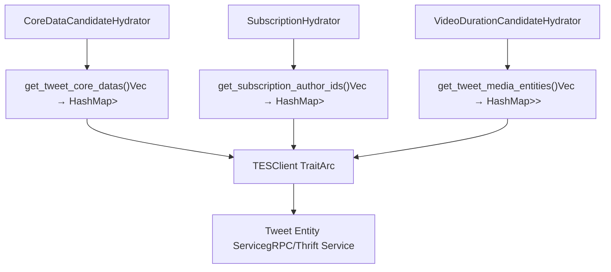
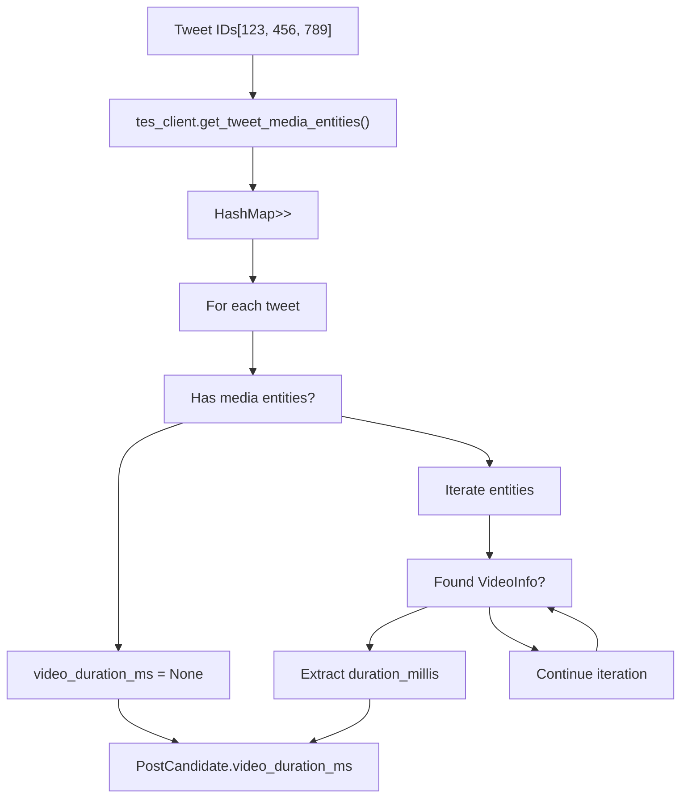
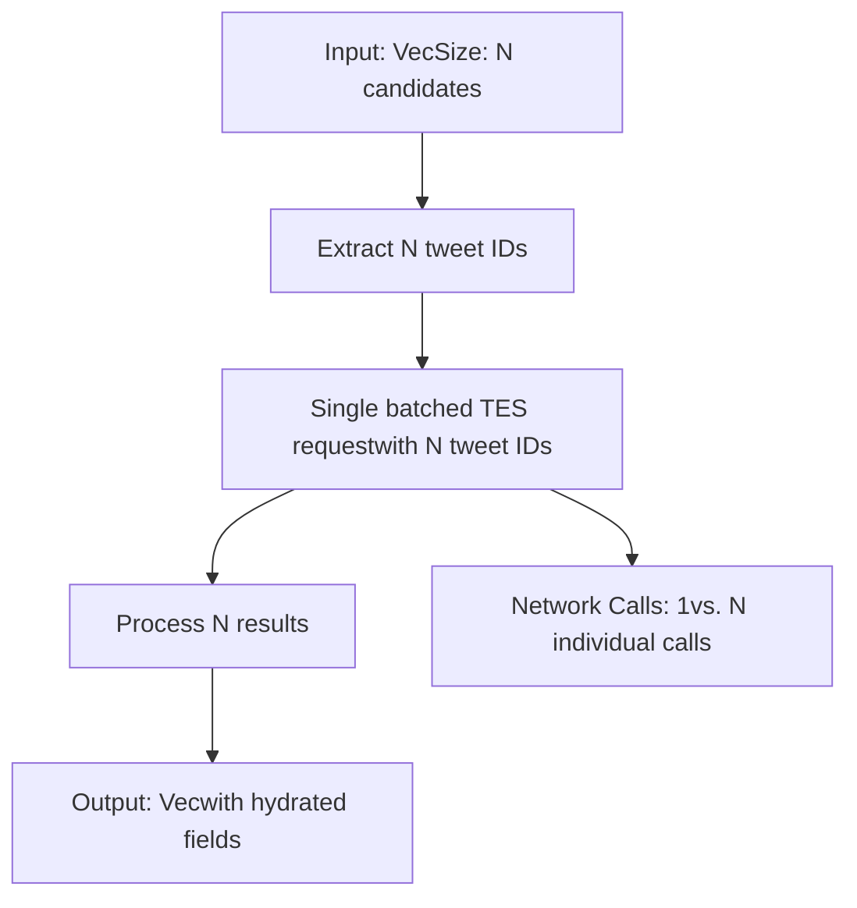
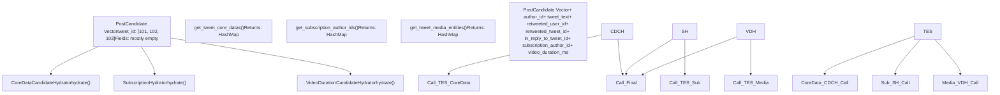

# Tweet Entity Service (TES)

Relevant source files

-   [home-mixer/candidate\_hydrators/core\_data\_candidate\_hydrator.rs](https://github.com/xai-org/x-algorithm/blob/aaa167b3/home-mixer/candidate_hydrators/core_data_candidate_hydrator.rs)
-   [home-mixer/candidate\_hydrators/subscription\_hydrator.rs](https://github.com/xai-org/x-algorithm/blob/aaa167b3/home-mixer/candidate_hydrators/subscription_hydrator.rs)
-   [home-mixer/candidate\_hydrators/video\_duration\_candidate\_hydrator.rs](https://github.com/xai-org/x-algorithm/blob/aaa167b3/home-mixer/candidate_hydrators/video_duration_candidate_hydrator.rs)

## Purpose and Scope

This document describes the integration with the Tweet Entity Service (TES) through the `TESClient` trait abstraction. TES provides tweet metadata including core data (text, author, retweet/reply information), media entities (video duration, images), and subscription-related information.

For general client architecture patterns and dependency injection, see [Client Architecture](/xai-org/x-algorithm/5.1-client-architecture). For other external service integrations, see [Gizmoduck Service](/xai-org/x-algorithm/5.3-gizmoduck-service), [Visibility Filtering Service](/xai-org/x-algorithm/5.4-visibility-filtering-service), and [Phoenix ML Services](/xai-org/x-algorithm/5.5-phoenix-ml-services).

## Overview

The Tweet Entity Service (TES) is a centralized external service that stores and serves tweet-level metadata. Within the Home Mixer pipeline, three hydrators depend on TESClient to enrich `PostCandidate` objects with different types of tweet data:

| Hydrator | TES Method | Data Retrieved |
| --- | --- | --- |
| `CoreDataCandidateHydrator` | `get_tweet_core_datas()` | Tweet text, author ID, retweet info, reply metadata |
| `SubscriptionHydrator` | `get_subscription_author_ids()` | Subscription author IDs for premium content |
| `VideoDurationCandidateHydrator` | `get_tweet_media_entities()` | Media entities with video duration in milliseconds |

All TES operations are batched by tweet ID to minimize network round-trips during the candidate hydration phase.

## TESClient Trait Interface

The `TESClient` trait defines the abstraction layer for communicating with TES. The trait is designed to support batched retrieval operations that accept multiple tweet IDs and return a map of results.


**TESClient Method Signatures**

The trait exposes three async methods, each returning a `Result<HashMap<i64, Option<T>>, Error>`:

1.  **`get_tweet_core_datas(tweet_ids: Vec<i64>)`**: Returns core tweet metadata including text, author ID, source tweet/user for retweets, and reply information.

2.  **`get_subscription_author_ids(tweet_ids: Vec<i64>)`**: Returns the subscription author ID for tweets that are part of premium/subscription content, or `None` for non-subscription tweets.

3.  **`get_tweet_media_entities(tweet_ids: Vec<i64>)`**: Returns a vector of media entities attached to tweets, which may include photos, videos, or GIFs with associated metadata.


All methods use `HashMap<i64, Option<T>>` as the return type to handle:

-   **Missing keys**: Tweets not found in TES are absent from the map
-   **None values**: Tweets found but lacking the requested data (e.g., no subscription, no media)

Sources: [home-mixer/candidate\_hydrators/core\_data\_candidate\_hydrator.rs1-59](https://github.com/xai-org/x-algorithm/blob/aaa167b3/home-mixer/candidate_hydrators/core_data_candidate_hydrator.rs#L1-L59) [home-mixer/candidate\_hydrators/subscription\_hydrator.rs1-51](https://github.com/xai-org/x-algorithm/blob/aaa167b3/home-mixer/candidate_hydrators/subscription_hydrator.rs#L1-L51) [home-mixer/candidate\_hydrators/video\_duration\_candidate\_hydrator.rs1-63](https://github.com/xai-org/x-algorithm/blob/aaa167b3/home-mixer/candidate_hydrators/video_duration_candidate_hydrator.rs#L1-L63)

## Data Models

### TweetCoreData

The `TweetCoreData` structure contains fundamental tweet information:

| Field | Type | Description |
| --- | --- | --- |
| `text` | `String` | The tweet's text content |
| `author_id` | `i64` | User ID of the tweet author |
| `source_user_id` | `Option<i64>` | Original author ID for retweets |
| `source_tweet_id` | `Option<i64>` | Original tweet ID for retweets |
| `in_reply_to_tweet_id` | `Option<i64>` | Parent tweet ID if this is a reply |

**Usage Pattern**: The `CoreDataCandidateHydrator` extracts these fields to populate the `PostCandidate` structure's core metadata fields [home-mixer/candidate\_hydrators/core\_data\_candidate\_hydrator.rs38-43](https://github.com/xai-org/x-algorithm/blob/aaa167b3/home-mixer/candidate_hydrators/core_data_candidate_hydrator.rs#L38-L43)

### MediaEntity and MediaInfo

The `MediaEntity` structure represents attached media with optional `MediaInfo`:


The `VideoDurationCandidateHydrator` iterates through media entities looking for `MediaInfo::VideoInfo` variants to extract the `duration_millis` field [home-mixer/candidate\_hydrators/video\_duration\_candidate\_hydrator.rs39-47](https://github.com/xai-org/x-algorithm/blob/aaa167b3/home-mixer/candidate_hydrators/video_duration_candidate_hydrator.rs#L39-L47)

Sources: [home-mixer/candidate\_hydrators/video\_duration\_candidate\_hydrator.rs1-63](https://github.com/xai-org/x-algorithm/blob/aaa167b3/home-mixer/candidate_hydrators/video_duration_candidate_hydrator.rs#L1-L63) [home-mixer/candidate\_hydrators/core\_data\_candidate\_hydrator.rs34-46](https://github.com/xai-org/x-algorithm/blob/aaa167b3/home-mixer/candidate_hydrators/core_data_candidate_hydrator.rs#L34-L46)

## Hydrator Integration Patterns

### CoreDataCandidateHydrator

**Purpose**: Enriches candidates with core tweet metadata from TES.

**Implementation Flow**:

> **[Mermaid sequence]**
> *(图表结构无法解析)*

**Field Mapping**:

The hydrator extracts specific fields from `TweetCoreData` and maps them to `PostCandidate` fields [home-mixer/candidate\_hydrators/core\_data\_candidate\_hydrator.rs38-46](https://github.com/xai-org/x-algorithm/blob/aaa167b3/home-mixer/candidate_hydrators/core_data_candidate_hydrator.rs#L38-L46):

```
TweetCoreData.author_id          → PostCandidate.author_id
TweetCoreData.source_user_id     → PostCandidate.retweeted_user_id
TweetCoreData.source_tweet_id    → PostCandidate.retweeted_tweet_id
TweetCoreData.in_reply_to_tweet_id → PostCandidate.in_reply_to_tweet_id
TweetCoreData.text               → PostCandidate.tweet_text
```
**Update Strategy**: The `update()` method merges the hydrated fields into existing candidates [home-mixer/candidate\_hydrators/core\_data\_candidate\_hydrator.rs52-57](https://github.com/xai-org/x-algorithm/blob/aaa167b3/home-mixer/candidate_hydrators/core_data_candidate_hydrator.rs#L52-L57) following the standard hydrator pattern where `hydrate()` produces new candidate objects and `update()` performs field-level merging.

Sources: [home-mixer/candidate\_hydrators/core\_data\_candidate\_hydrator.rs1-59](https://github.com/xai-org/x-algorithm/blob/aaa167b3/home-mixer/candidate_hydrators/core_data_candidate_hydrator.rs#L1-L59)

### SubscriptionHydrator

**Purpose**: Identifies premium/subscription tweets by retrieving subscription author IDs.

**Implementation Flow**:

The hydrator follows the same batching pattern:

1.  Extract tweet IDs from candidates [home-mixer/candidate\_hydrators/subscription\_hydrator.rs28](https://github.com/xai-org/x-algorithm/blob/aaa167b3/home-mixer/candidate_hydrators/subscription_hydrator.rs#L28-L28)
2.  Call `tes_client.get_subscription_author_ids(tweet_ids)` [home-mixer/candidate\_hydrators/subscription\_hydrator.rs30](https://github.com/xai-org/x-algorithm/blob/aaa167b3/home-mixer/candidate_hydrators/subscription_hydrator.rs#L30-L30)
3.  For each tweet, extract `subscription_author_id` from the result map [home-mixer/candidate\_hydrators/subscription\_hydrator.rs36](https://github.com/xai-org/x-algorithm/blob/aaa167b3/home-mixer/candidate_hydrators/subscription_hydrator.rs#L36-L36)
4.  Populate `PostCandidate.subscription_author_id` field [home-mixer/candidate\_hydrators/subscription\_hydrator.rs38](https://github.com/xai-org/x-algorithm/blob/aaa167b3/home-mixer/candidate_hydrators/subscription_hydrator.rs#L38-L38)

**Field Update**: The `update()` method assigns the `subscription_author_id` field [home-mixer/candidate\_hydrators/subscription\_hydrator.rs47-49](https://github.com/xai-org/x-algorithm/blob/aaa167b3/home-mixer/candidate_hydrators/subscription_hydrator.rs#L47-L49) which downstream filters can use to apply subscription-specific rules.

**Use Case**: This data enables the pipeline to differentiate between free and premium content, allowing for specialized filtering or ranking adjustments for subscription tweets.

Sources: [home-mixer/candidate\_hydrators/subscription\_hydrator.rs1-51](https://github.com/xai-org/x-algorithm/blob/aaa167b3/home-mixer/candidate_hydrators/subscription_hydrator.rs#L1-L51)

### VideoDurationCandidateHydrator

**Purpose**: Extracts video duration metadata for candidates with video attachments.

**Implementation Flow**:


**Key Logic**: The hydrator searches through the media entities vector for the first `MediaInfo::VideoInfo` variant and extracts its `duration_millis` field [home-mixer/candidate\_hydrators/video\_duration\_candidate\_hydrator.rs39-47](https://github.com/xai-org/x-algorithm/blob/aaa167b3/home-mixer/candidate_hydrators/video_duration_candidate_hydrator.rs#L39-L47):

```
// Pattern matching to find video durationlet video_duration_ms = media_entities.and_then(|entities| {    entities.iter().find_map(|entity| {        if let Some(MediaInfo::VideoInfo(video_info)) = &entity.media_info {            Some(video_info.duration_millis)        } else {            None        }    })});
```
**Result**: The `video_duration_ms` field is populated for video tweets, allowing downstream components to apply video-specific logic (e.g., filtering long videos, ranking video content differently).

Sources: [home-mixer/candidate\_hydrators/video\_duration\_candidate\_hydrator.rs1-63](https://github.com/xai-org/x-algorithm/blob/aaa167b3/home-mixer/candidate_hydrators/video_duration_candidate_hydrator.rs#L1-L63)

## Batching and Performance Characteristics

### Batched Request Pattern

All three hydrators follow the same batching pattern to optimize network efficiency:


**Efficiency**: By batching all tweet IDs in a single RPC call, the hydrators minimize:

-   Network round-trips (1 call vs. N calls)
-   Connection overhead
-   Service load from multiple small requests

**Implementation**: Each hydrator:

1.  Collects all tweet IDs from the candidate slice [home-mixer/candidate\_hydrators/core\_data\_candidate\_hydrator.rs28](https://github.com/xai-org/x-algorithm/blob/aaa167b3/home-mixer/candidate_hydrators/core_data_candidate_hydrator.rs#L28-L28)
2.  Makes a single batched call [home-mixer/candidate\_hydrators/core\_data\_candidate\_hydrator.rs30](https://github.com/xai-org/x-algorithm/blob/aaa167b3/home-mixer/candidate_hydrators/core_data_candidate_hydrator.rs#L30-L30)
3.  Processes the returned map to build hydrated candidates [home-mixer/candidate\_hydrators/core\_data\_candidate\_hydrator.rs33-49](https://github.com/xai-org/x-algorithm/blob/aaa167b3/home-mixer/candidate_hydrators/core_data_candidate_hydrator.rs#L33-L49)

### Error Handling

All hydrators use `.map_err(|e| e.to_string())?` to convert TES client errors into string errors [home-mixer/candidate\_hydrators/core\_data\_candidate\_hydrator.rs31](https://github.com/xai-org/x-algorithm/blob/aaa167b3/home-mixer/candidate_hydrators/core_data_candidate_hydrator.rs#L31-L31) If the TES call fails, the entire hydration step fails, which is propagated up to the pipeline executor.

**Missing Data Handling**: The code handles missing data gracefully:

-   Missing map entries: Use `.get(&tweet_id)` which returns `Option` [home-mixer/candidate\_hydrators/core\_data\_candidate\_hydrator.rs35](https://github.com/xai-org/x-algorithm/blob/aaa167b3/home-mixer/candidate_hydrators/core_data_candidate_hydrator.rs#L35-L35)
-   None values in map: Use `.and_then()` for safe chaining [home-mixer/candidate\_hydrators/core\_data\_candidate\_hydrator.rs36](https://github.com/xai-org/x-algorithm/blob/aaa167b3/home-mixer/candidate_hydrators/core_data_candidate_hydrator.rs#L36-L36)
-   Default values: Use `.unwrap_or_default()` or explicit defaults [home-mixer/candidate\_hydrators/core\_data\_candidate\_hydrator.rs39](https://github.com/xai-org/x-algorithm/blob/aaa167b3/home-mixer/candidate_hydrators/core_data_candidate_hydrator.rs#L39-L39)

This pattern ensures that individual missing tweets don't cause the entire batch to fail.

Sources: [home-mixer/candidate\_hydrators/core\_data\_candidate\_hydrator.rs28-49](https://github.com/xai-org/x-algorithm/blob/aaa167b3/home-mixer/candidate_hydrators/core_data_candidate_hydrator.rs#L28-L49) [home-mixer/candidate\_hydrators/subscription\_hydrator.rs28-44](https://github.com/xai-org/x-algorithm/blob/aaa167b3/home-mixer/candidate_hydrators/subscription_hydrator.rs#L28-L44) [home-mixer/candidate\_hydrators/video\_duration\_candidate\_hydrator.rs28-54](https://github.com/xai-org/x-algorithm/blob/aaa167b3/home-mixer/candidate_hydrators/video_duration_candidate_hydrator.rs#L28-L54)

## Dependency Injection

All three hydrators receive `TESClient` as an `Arc<dyn TESClient + Send + Sync>` through their constructors:

| Hydrator | Constructor |
| --- | --- |
| `CoreDataCandidateHydrator` | `new(tes_client: Arc<dyn TESClient + Send + Sync>)` |
| `SubscriptionHydrator` | `new(tes_client: Arc<dyn TESClient + Send + Sync>)` |
| `VideoDurationCandidateHydrator` | `new(tes_client: Arc<dyn TESClient + Send + Sync>)` |

This trait-based dependency injection enables:

-   **Testing**: Mock implementations can be injected for unit tests
-   **Configuration**: Production vs. staging TES endpoints can be swapped
-   **Shared instance**: The same `Arc<dyn TESClient>` instance is shared across all hydrators to enable connection pooling

The `PhoenixCandidatePipeline` instantiates a single TESClient and passes it to all three hydrators during pipeline construction.

Sources: [home-mixer/candidate\_hydrators/core\_data\_candidate\_hydrator.rs8-16](https://github.com/xai-org/x-algorithm/blob/aaa167b3/home-mixer/candidate_hydrators/core_data_candidate_hydrator.rs#L8-L16) [home-mixer/candidate\_hydrators/subscription\_hydrator.rs8-16](https://github.com/xai-org/x-algorithm/blob/aaa167b3/home-mixer/candidate_hydrators/subscription_hydrator.rs#L8-L16) [home-mixer/candidate\_hydrators/video\_duration\_candidate\_hydrator.rs9-17](https://github.com/xai-org/x-algorithm/blob/aaa167b3/home-mixer/candidate_hydrators/video_duration_candidate_hydrator.rs#L9-L17)

## Data Flow Summary

The following diagram illustrates the complete data flow from candidate pipeline through TES to enriched candidates:


Sources: [home-mixer/candidate\_hydrators/core\_data\_candidate\_hydrator.rs19-58](https://github.com/xai-org/x-algorithm/blob/aaa167b3/home-mixer/candidate_hydrators/core_data_candidate_hydrator.rs#L19-L58) [home-mixer/candidate\_hydrators/subscription\_hydrator.rs19-50](https://github.com/xai-org/x-algorithm/blob/aaa167b3/home-mixer/candidate_hydrators/subscription_hydrator.rs#L19-L50) [home-mixer/candidate\_hydrators/video\_duration\_candidate\_hydrator.rs19-62](https://github.com/xai-org/x-algorithm/blob/aaa167b3/home-mixer/candidate_hydrators/video_duration_candidate_hydrator.rs#L19-L62)
