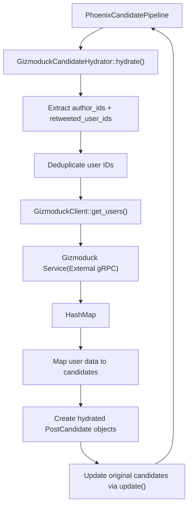
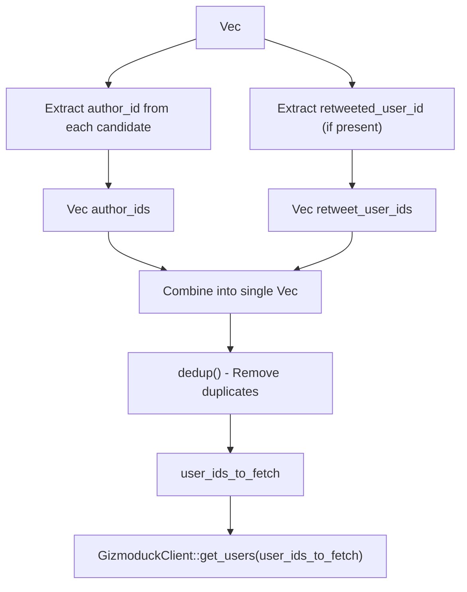
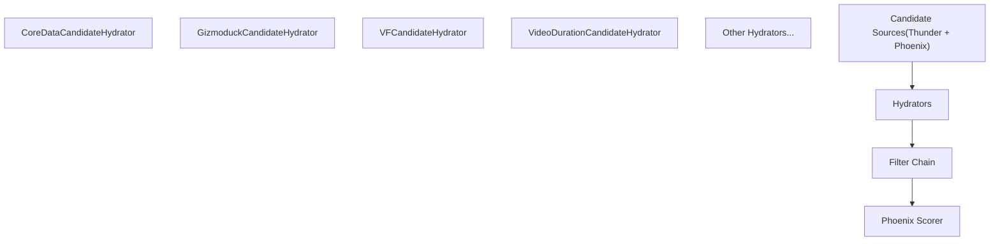

# Gizmoduck Service

Relevant source files

-   [home-mixer/candidate\_hydrators/gizmoduck\_hydrator.rs](https://github.com/xai-org/x-algorithm/blob/aaa167b3/home-mixer/candidate_hydrators/gizmoduck_hydrator.rs)

## Purpose and Scope

This document describes the integration between the Home Mixer pipeline and the Gizmoduck Service, an external system that provides user profile information and metadata. The primary interface is the `GizmoduckCandidateHydrator`, which enriches post candidates with author profile data including follower counts and screen names.

For general information about the candidate hydrator framework, see [Candidate Hydrators](/xai-org/x-algorithm/4.5-candidate-hydrators). For details on the broader client abstraction architecture, see [Client Architecture](/xai-org/x-algorithm/5.1-client-architecture).

---

## Service Overview

The Gizmoduck Service is an external user profile service that stores and provides access to user account information including:

-   Screen names
-   Follower and following counts
-   User profile metadata
-   Account status information

Within the Home Mixer pipeline, Gizmoduck is queried during the candidate enrichment phase to attach human-readable author information to post candidates. This data is essential for downstream filtering (e.g., blocked user checks) and for presentation in the final feed response.

**Key Characteristics:**

| Property | Value |
| --- | --- |
| **Service Type** | External gRPC/Thrift service |
| **Data Provided** | User profiles, counts, screen names |
| **Query Pattern** | Batched multi-get by user ID |
| **Pipeline Stage** | Candidate Hydration |
| **Execution Mode** | Parallel (with other hydrators) |

---

## Client Architecture

The integration follows the trait-based client abstraction pattern used throughout the pipeline. The `GizmoduckClient` trait defines the interface for querying user data, enabling dependency injection and test mocking.

### GizmoduckClient Trait

The client trait defines a single method for batch user retrieval:

```
trait GizmoduckClient {    async fn get_users(        &self,        user_ids: Vec<i64>    ) -> Result<HashMap<i64, Option<UserProfile>>, Error>;}
```
**Method Semantics:**

-   **Input:** Vector of user IDs (i64)
-   **Output:** Map from user ID to optional user profile data
-   **Error Handling:** Returns error if the service call fails; partial results returned as `None` values
-   **Batching:** Single call retrieves multiple users simultaneously

The production implementation likely wraps a gRPC or Thrift client to communicate with the Gizmoduck service. Test implementations can return mock data without external dependencies.

**Sources:** [home-mixer/candidate\_hydrators/gizmoduck\_hydrator.rs3-4](https://github.com/xai-org/x-algorithm/blob/aaa167b3/home-mixer/candidate_hydrators/gizmoduck_hydrator.rs#L3-L4)

---

## GizmoduckCandidateHydrator Implementation

The `GizmoduckCandidateHydrator` implements the `Hydrator<ScoredPostsQuery, PostCandidate>` trait to enrich candidates with user profile information during the pipeline's hydration phase.

### Struct Definition

```
GizmoduckCandidateHydrator {
    gizmoduck_client: Arc<dyn GizmoduckClient + Send + Sync>
}
```
The hydrator holds an `Arc` reference to the client, enabling shared ownership across the async pipeline without cloning the underlying service connection.

**Sources:** [home-mixer/candidate\_hydrators/gizmoduck\_hydrator.rs8-10](https://github.com/xai-org/x-algorithm/blob/aaa167b3/home-mixer/candidate_hydrators/gizmoduck_hydrator.rs#L8-L10)

### Data Flow Diagram


**Sources:** [home-mixer/candidate\_hydrators/gizmoduck\_hydrator.rs18-81](https://github.com/xai-org/x-algorithm/blob/aaa167b3/home-mixer/candidate_hydrators/gizmoduck_hydrator.rs#L18-L81)

---

## Batching Strategy

The hydrator implements an efficient batching strategy to minimize service calls and reduce latency. Instead of querying each user individually, it collects all unique user IDs across the candidate set and issues a single batch request.

### User ID Collection Process


### Implementation Details

The batching logic extracts two categories of user IDs from candidates:

1.  **Author IDs:** The user who created each post ([gizmoduck\_hydrator.rs28-29](https://github.com/xai-org/x-algorithm/blob/aaa167b3/gizmoduck_hydrator.rs#L28-L29))
2.  **Retweet User IDs:** The original author if the post is a retweet ([gizmoduck\_hydrator.rs30-32](https://github.com/xai-org/x-algorithm/blob/aaa167b3/gizmoduck_hydrator.rs#L30-L32))

The implementation performs the following steps:

1.  Map all candidates to their `author_id` values (always present)
2.  Map all candidates to their `retweeted_user_id` values (may be `None`)
3.  Flatten the retweet IDs to remove `None` entries
4.  Cast both ID lists from `u64` to `i64` (Gizmoduck's expected type)
5.  Combine both lists into a single vector
6.  Call `dedup()` to remove duplicate user IDs
7.  Issue a single `get_users()` call with the deduplicated list

This approach ensures that if multiple candidates share the same author or if an author appears both as a creator and retweeter, they are only fetched once.

**Sources:** [home-mixer/candidate\_hydrators/gizmoduck\_hydrator.rs28-37](https://github.com/xai-org/x-algorithm/blob/aaa167b3/home-mixer/candidate_hydrators/gizmoduck_hydrator.rs#L28-L37) [home-mixer/candidate\_hydrators/gizmoduck\_hydrator.rs39-40](https://github.com/xai-org/x-algorithm/blob/aaa167b3/home-mixer/candidate_hydrators/gizmoduck_hydrator.rs#L39-L40)

---

## Hydrated Fields

The hydrator enriches each `PostCandidate` with three fields extracted from the Gizmoduck service response.

### Field Mapping Table

| PostCandidate Field | Source | Type | Description |
| --- | --- | --- | --- |
| `author_followers_count` | `user.counts.followers_count` | `Option<i32>` | Number of followers for the post's author |
| `author_screen_name` | `user.profile.screen_name` | `Option<String>` | Screen name (handle) of the post's author |
| `retweeted_screen_name` | `retweeted_user.profile.screen_name` | `Option<String>` | Screen name of the original author (for retweets) |

### Field Extraction Logic

For each candidate, the hydrator:

1.  **Author Data Extraction:**

    -   Looks up the candidate's `author_id` in the returned user map
    -   Navigates through the nested structure: `user.user.counts.followers_count`
    -   Navigates through: `user.user.profile.screen_name`
    -   Casts follower count from `i64` to `i32`
    -   Clones the screen name string
2.  **Retweet Author Data Extraction (Conditional):**

    -   Checks if `retweeted_user_id` is present
    -   If present, looks up that user ID in the map
    -   Extracts `screen_name` from the retweeted user's profile
    -   If `retweeted_user_id` is `None`, the field remains `None`

All fields are `Option` types because:

-   User data may be missing (deleted accounts, service errors)
-   Nested fields may be `None` in the service response
-   Not all posts are retweets (most have `retweeted_user_id = None`)

**Sources:** [home-mixer/candidate\_hydrators/gizmoduck\_hydrator.rs44-70](https://github.com/xai-org/x-algorithm/blob/aaa167b3/home-mixer/candidate_hydrators/gizmoduck_hydrator.rs#L44-L70)

### Update Pattern

The hydrator follows the standard two-method hydration pattern:

1.  **`hydrate()` method:** Creates new `PostCandidate` structs with only the Gizmoduck fields populated, using `Default::default()` for all other fields ([gizmoduck\_hydrator.rs64-70](https://github.com/xai-org/x-algorithm/blob/aaa167b3/gizmoduck_hydrator.rs#L64-L70))

2.  **`update()` method:** Selectively copies the three Gizmoduck fields from the hydrated candidate into the original candidate, preserving all other fields ([gizmoduck\_hydrator.rs76-80](https://github.com/xai-org/x-algorithm/blob/aaa167b3/gizmoduck_hydrator.rs#L76-L80))


This pattern ensures that the hydrator only modifies the fields it owns, preventing accidental overwrites of data populated by other hydrators.

**Sources:** [home-mixer/candidate\_hydrators/gizmoduck\_hydrator.rs76-80](https://github.com/xai-org/x-algorithm/blob/aaa167b3/home-mixer/candidate_hydrators/gizmoduck_hydrator.rs#L76-L80)

---

## Integration in Pipeline

The `GizmoduckCandidateHydrator` executes during the candidate hydration phase of the `PhoenixCandidatePipeline`, running in parallel with other hydrators like `CoreDataCandidateHydrator`, `VFCandidateHydrator`, and `VideoDurationCandidateHydrator`.

### Pipeline Position


### Execution Characteristics

-   **Parallelism:** Executes concurrently with other hydrators to minimize total latency
-   **Error Handling:** Errors from `get_users()` are propagated up, causing the entire hydration stage to fail
-   **Stats Collection:** The `#[xai_stats_macro::receive_stats]` annotation on the `hydrate()` method automatically records latency and error metrics ([gizmoduck\_hydrator.rs20](https://github.com/xai-org/x-algorithm/blob/aaa167b3/gizmoduck_hydrator.rs#L20-L20))
-   **Dependencies:** Requires `author_id` to be present on candidates (populated by `CoreDataCandidateHydrator` or sources)

**Sources:** [home-mixer/candidate\_hydrators/gizmoduck\_hydrator.rs20](https://github.com/xai-org/x-algorithm/blob/aaa167b3/home-mixer/candidate_hydrators/gizmoduck_hydrator.rs#L20-L20)

---

## Code Entity Reference

### Primary Types

-   **Hydrator:** `GizmoduckCandidateHydrator` ([gizmoduck\_hydrator.rs8](https://github.com/xai-org/x-algorithm/blob/aaa167b3/gizmoduck_hydrator.rs#L8-L8))
-   **Client Trait:** `GizmoduckClient` ([gizmoduck\_hydrator.rs9](https://github.com/xai-org/x-algorithm/blob/aaa167b3/gizmoduck_hydrator.rs#L9-L9))
-   **Query Type:** `ScoredPostsQuery` ([gizmoduck\_hydrator.rs2](https://github.com/xai-org/x-algorithm/blob/aaa167b3/gizmoduck_hydrator.rs#L2-L2))
-   **Candidate Type:** `PostCandidate` ([gizmoduck\_hydrator.rs1](https://github.com/xai-org/x-algorithm/blob/aaa167b3/gizmoduck_hydrator.rs#L1-L1))

### Key Methods

-   **Constructor:** `GizmoduckCandidateHydrator::new()` ([gizmoduck\_hydrator.rs13-15](https://github.com/xai-org/x-algorithm/blob/aaa167b3/gizmoduck_hydrator.rs#L13-L15))
-   **Hydration:** `Hydrator::hydrate()` ([gizmoduck\_hydrator.rs21-74](https://github.com/xai-org/x-algorithm/blob/aaa167b3/gizmoduck_hydrator.rs#L21-L74))
-   **Field Update:** `Hydrator::update()` ([gizmoduck\_hydrator.rs76-80](https://github.com/xai-org/x-algorithm/blob/aaa167b3/gizmoduck_hydrator.rs#L76-L80))
-   **Client Call:** `GizmoduckClient::get_users()` ([gizmoduck\_hydrator.rs39](https://github.com/xai-org/x-algorithm/blob/aaa167b3/gizmoduck_hydrator.rs#L39-L39))

### File Location

-   **Implementation:** [home-mixer/candidate\_hydrators/gizmoduck\_hydrator.rs](https://github.com/xai-org/x-algorithm/blob/aaa167b3/home-mixer/candidate_hydrators/gizmoduck_hydrator.rs)

**Sources:** [home-mixer/candidate\_hydrators/gizmoduck\_hydrator.rs1-82](https://github.com/xai-org/x-algorithm/blob/aaa167b3/home-mixer/candidate_hydrators/gizmoduck_hydrator.rs#L1-L82)
