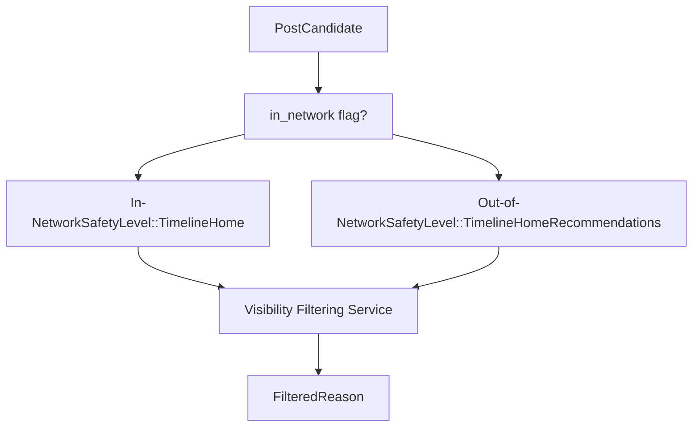
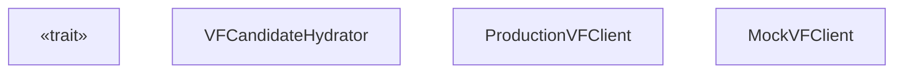
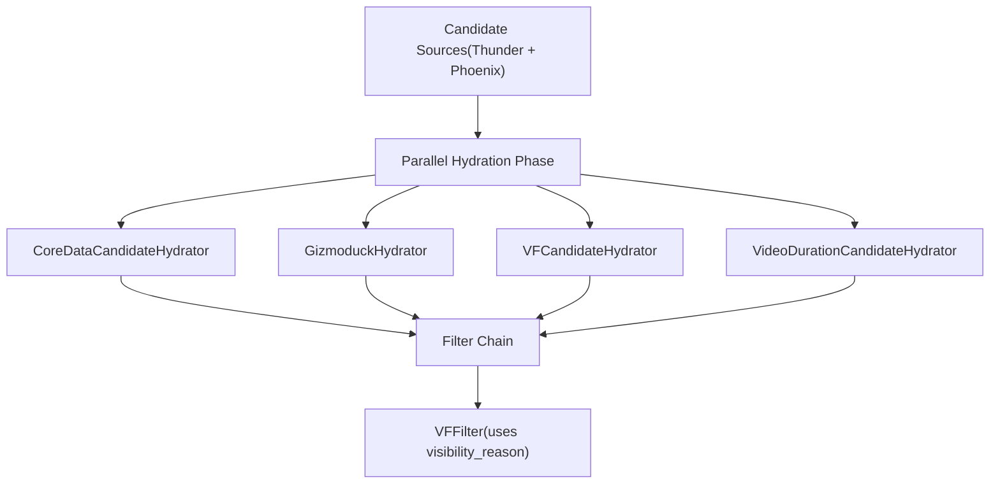

# Visibility Filtering Service

Relevant source files

-   [home-mixer/candidate\_hydrators/vf\_candidate\_hydrator.rs](https://github.com/xai-org/x-algorithm/blob/aaa167b3/home-mixer/candidate_hydrators/vf_candidate_hydrator.rs)

## Purpose and Scope

The Visibility Filtering Service is an external platform service that enforces content safety policies by determining whether specific tweets should be shown to specific users. This document covers the client abstraction layer (`VisibilityFilteringClient` trait), the hydrator integration (`VFCandidateHydrator`), safety level configurations, and the filtering decision model. For information about how visibility filtering results are used in subsequent filtering stages, see [Filters](/xai-org/x-algorithm/4.6-filters). For the broader client architecture pattern, see [Client Architecture](/xai-org/x-algorithm/5.1-client-architecture).

## Service Overview

The Visibility Filtering Service evaluates tweet content against platform safety rules, user-specific preferences (e.g., muted keywords, blocked accounts), and context-dependent policies. The service returns a `FilteredReason` for each tweet, which may indicate that content should be hidden, shown with warnings, or displayed normally.

The service is invoked during the candidate hydration phase of the pipeline, operating on batches of tweets to determine their visibility status before scoring and selection occur. This early-stage filtering allows the pipeline to avoid expensive ML operations on content that will ultimately be filtered out.

**Key characteristics:**

-   **Batch Processing**: Processes multiple tweet IDs in a single request for efficiency
-   **Context-Aware**: Considers viewer identity, relationships, and preferences
-   **Safety Level Differentiation**: Applies different policy strictness based on content source
-   **Non-Blocking**: Failures are handled gracefully without blocking the entire pipeline

Sources: [home-mixer/candidate\_hydrators/vf\_candidate\_hydrator.rs1-102](https://github.com/xai-org/x-algorithm/blob/aaa167b3/home-mixer/candidate_hydrators/vf_candidate_hydrator.rs#L1-L102)

## Safety Levels

The Visibility Filtering Service applies different levels of policy enforcement based on the content type and source. The Home Mixer uses two distinct safety levels:

| Safety Level | Applied To | Purpose | Strictness |
| --- | --- | --- | --- |
| `TimelineHome` | In-network candidates | Content from accounts the user follows | Lower strictness, prioritizes user choice |
| `TimelineHomeRecommendations` | Out-of-network candidates | Content from accounts the user doesn't follow | Higher strictness, more protective policies |

This differentiation recognizes that users have actively chosen to follow certain accounts, implying a desire to see their content even if it pushes policy boundaries. Conversely, recommended out-of-network content is held to stricter standards since the user has not explicitly opted into viewing it.


**Diagram: Safety Level Selection Logic**

The safety level is determined by examining the `in_network` field on each `PostCandidate`, which is set by the `InNetworkCandidateHydrator` earlier in the pipeline. See [InNetworkCandidateHydrator](/xai-org/x-algorithm/4.5.3-innetworkcandidatehydrator) for details on how this field is populated.

Sources: [home-mixer/candidate\_hydrators/vf\_candidate\_hydrator.rs54-78](https://github.com/xai-org/x-algorithm/blob/aaa167b3/home-mixer/candidate_hydrators/vf_candidate_hydrator.rs#L54-L78)

## Client Architecture

### VisibilityFilteringClient Trait

The `VisibilityFilteringClient` trait defines the interface for interacting with the Visibility Filtering Service. This abstraction enables dependency injection, testing with mock implementations, and isolation from service implementation details.


**Diagram: Client Trait and Implementation Structure**

### Interface Contract

The `get_result` method accepts:

-   **`tweet_ids: Vec<i64>`**: Batch of tweet IDs to evaluate
-   **`safety_level: SafetyLevel`**: Policy strictness level (TimelineHome or TimelineHomeRecommendations)
-   **`for_user_id: i64`**: Viewer's user ID for context-specific filtering
-   **`context: Option<TwitterContextViewer>`**: Additional viewer context for preference evaluation

The method returns a `HashMap<i64, Option<FilteredReason>>` where:

-   The key is the tweet ID
-   The value is `Some(FilteredReason)` if the tweet should be filtered, or `None` if it passes all checks

Sources: [home-mixer/candidate\_hydrators/vf\_candidate\_hydrator.rs15-40](https://github.com/xai-org/x-algorithm/blob/aaa167b3/home-mixer/candidate_hydrators/vf_candidate_hydrator.rs#L15-L40)

## VFCandidateHydrator Integration

The `VFCandidateHydrator` integrates the Visibility Filtering Service into the candidate pipeline by implementing the `Hydrator<ScoredPostsQuery, PostCandidate>` trait. This hydrator enriches candidates with visibility filtering results, which are later used by the `VFFilter` in the post-selection filtering stage.

### Structure

```
pub struct VFCandidateHydrator {    pub vf_client: Arc<dyn VisibilityFilteringClient + Send + Sync>,}
```
The hydrator holds a shared reference to a `VisibilityFilteringClient` implementation, enabling concurrent access from multiple pipeline executions.

Sources: [home-mixer/candidate\_hydrators/vf\_candidate\_hydrator.rs15-22](https://github.com/xai-org/x-algorithm/blob/aaa167b3/home-mixer/candidate_hydrators/vf_candidate_hydrator.rs#L15-L22)

### Hydration Process

The hydration process follows these steps:

> **[Mermaid sequence]**
> *(图表结构无法解析)*

**Diagram: VFCandidateHydrator Execution Flow**

Sources: [home-mixer/candidate\_hydrators/vf\_candidate\_hydrator.rs43-101](https://github.com/xai-org/x-algorithm/blob/aaa167b3/home-mixer/candidate_hydrators/vf_candidate_hydrator.rs#L43-L101)

### Implementation Details

#### 1\. Candidate Partitioning

The hydrator partitions candidates into two groups based on the `in_network` field:

[home-mixer/candidate\_hydrators/vf\_candidate\_hydrator.rs54-62](https://github.com/xai-org/x-algorithm/blob/aaa167b3/home-mixer/candidate_hydrators/vf_candidate_hydrator.rs#L54-L62)

This partitioning enables applying different safety levels to each group, as described in the Safety Levels section above.

#### 2\. Parallel Service Calls

The hydrator issues two concurrent requests to the Visibility Filtering Service using `futures::future::join`:

[home-mixer/candidate\_hydrators/vf\_candidate\_hydrator.rs64-80](https://github.com/xai-org/x-algorithm/blob/aaa167b3/home-mixer/candidate_hydrators/vf_candidate_hydrator.rs#L64-L80)

This parallel execution pattern minimizes latency by overlapping the two service calls rather than executing them sequentially.

#### 3\. Result Merging

After both service calls complete, the results are merged into a single `HashMap`:

[home-mixer/candidate\_hydrators/vf\_candidate\_hydrator.rs80-83](https://github.com/xai-org/x-algorithm/blob/aaa167b3/home-mixer/candidate_hydrators/vf_candidate_hydrator.rs#L80-L83)

#### 4\. Candidate Enrichment

For each candidate, the hydrator creates a `PostCandidate` update containing only the `visibility_reason` field:

[home-mixer/candidate\_hydrators/vf\_candidate\_hydrator.rs85-95](https://github.com/xai-org/x-algorithm/blob/aaa167b3/home-mixer/candidate_hydrators/vf_candidate_hydrator.rs#L85-L95)

The `update` method then merges this field into the existing candidate:

[home-mixer/candidate\_hydrators/vf\_candidate\_hydrator.rs98-100](https://github.com/xai-org/x-algorithm/blob/aaa167b3/home-mixer/candidate_hydrators/vf_candidate_hydrator.rs#L98-L100)

This pattern follows the framework's field-level update strategy, where hydrators only populate the fields they're responsible for. See [Hydrator Trait](/xai-org/x-algorithm/3.4-hydrator-trait) for more on this pattern.

#### 5\. Empty Batch Optimization

The `fetch_vf_results` helper method includes an optimization to avoid service calls when the batch is empty:

[home-mixer/candidate\_hydrators/vf\_candidate\_hydrator.rs31-33](https://github.com/xai-org/x-algorithm/blob/aaa167b3/home-mixer/candidate_hydrators/vf_candidate_hydrator.rs#L31-L33)

This prevents unnecessary network requests when all candidates belong to one category (e.g., all in-network or all out-of-network).

Sources: [home-mixer/candidate\_hydrators/vf\_candidate\_hydrator.rs24-40](https://github.com/xai-org/x-algorithm/blob/aaa167b3/home-mixer/candidate_hydrators/vf_candidate_hydrator.rs#L24-L40)

## Data Models

### FilteredReason

The `FilteredReason` enum (defined in the `xai_visibility_filtering` module) represents the reason a tweet should be filtered or shown with restrictions. This enum is stored in the `visibility_reason` field of `PostCandidate`:

```
pub struct PostCandidate {    // ... other fields    pub visibility_reason: Option<FilteredReason>,    // ... other fields}
```
The `visibility_reason` field semantics:

-   **`None`**: Tweet passes all visibility checks and should be shown normally
-   **`Some(FilteredReason)`**: Tweet violates policies and should be filtered or shown with warnings

The specific `FilteredReason` variants are defined by the Visibility Filtering Service's data model and may include reasons such as:

-   Blocked author relationships
-   Muted keywords
-   Content policy violations
-   Age-restricted content without viewer eligibility
-   NSFW content based on user preferences

### TwitterContextViewer

The `TwitterContextViewer` struct provides additional context about the viewing user for more accurate filtering decisions:

[home-mixer/candidate\_hydrators/vf\_candidate\_hydrator.rs8-9](https://github.com/xai-org/x-algorithm/blob/aaa167b3/home-mixer/candidate_hydrators/vf_candidate_hydrator.rs#L8-L9)

This context is retrieved from the query using the `get_viewer()` method:

[home-mixer/candidate\_hydrators/vf\_candidate\_hydrator.rs50](https://github.com/xai-org/x-algorithm/blob/aaa167b3/home-mixer/candidate_hydrators/vf_candidate_hydrator.rs#L50-L50)

The context includes information about the viewer's preferences, settings, and relationship state that may affect visibility decisions.

Sources: [home-mixer/candidate\_hydrators/vf\_candidate\_hydrator.rs1-13](https://github.com/xai-org/x-algorithm/blob/aaa167b3/home-mixer/candidate_hydrators/vf_candidate_hydrator.rs#L1-L13)

## Error Handling

The Visibility Filtering Service integration includes error handling at multiple levels:

### Service-Level Errors

Service call failures are converted to string errors and propagated up through the pipeline:

[home-mixer/candidate\_hydrators/vf\_candidate\_hydrator.rs35-38](https://github.com/xai-org/x-algorithm/blob/aaa167b3/home-mixer/candidate_hydrators/vf_candidate_hydrator.rs#L35-L38)

These errors may occur due to:

-   Network connectivity issues
-   Service timeouts
-   Service-side failures
-   Malformed requests or responses

### Result Propagation

The hydrator uses the `?` operator to propagate errors from the service calls:

[home-mixer/candidate\_hydrators/vf\_candidate\_hydrator.rs82-83](https://github.com/xai-org/x-algorithm/blob/aaa167b3/home-mixer/candidate_hydrators/vf_candidate_hydrator.rs#L82-L83)

When an error occurs, the entire hydration operation fails, and the pipeline's error handling mechanism determines whether to:

-   Retry the request
-   Fall back to cached results
-   Fail the entire request with an error response to the client

See [Pipeline Execution Model](/xai-org/x-algorithm/3.1-pipeline-execution-model) for details on pipeline-level error handling.

### Partial Failure Resilience

The parallel execution pattern provides some resilience to partial failures. If one safety level's request succeeds while the other fails, the entire hydration still fails, but the service call overhead is minimized by the concurrent execution.

Sources: [home-mixer/candidate\_hydrators/vf\_candidate\_hydrator.rs24-40](https://github.com/xai-org/x-algorithm/blob/aaa167b3/home-mixer/candidate_hydrators/vf_candidate_hydrator.rs#L24-L40) [home-mixer/candidate\_hydrators/vf\_candidate\_hydrator.rs80-83](https://github.com/xai-org/x-algorithm/blob/aaa167b3/home-mixer/candidate_hydrators/vf_candidate_hydrator.rs#L80-L83)

## Performance Considerations

### Batching Strategy

The Visibility Filtering Service is called with batches of tweet IDs rather than individual requests, reducing network overhead and service load. The batch size is determined by the number of candidates that survive earlier pipeline stages (sources and pre-hydration filters).

### Parallel Execution

By issuing parallel requests for in-network and out-of-network candidates, the hydrator reduces the critical path latency. The total time is approximately:

```
total_time ≈ max(in_network_request_time, oon_request_time)
```
rather than:

```
total_time ≈ in_network_request_time + oon_request_time
```
This optimization is particularly beneficial when one category has many more candidates than the other, as the smaller request completes quickly while waiting for the larger request.

### Caching and Memoization

The Visibility Filtering Service itself may implement caching strategies for frequently evaluated tweet-viewer pairs. The client interface does not expose caching controls, delegating cache management to the service implementation.

Sources: [home-mixer/candidate\_hydrators/vf\_candidate\_hydrator.rs64-80](https://github.com/xai-org/x-algorithm/blob/aaa167b3/home-mixer/candidate_hydrators/vf_candidate_hydrator.rs#L64-L80)

## Pipeline Integration

The `VFCandidateHydrator` executes during the candidate hydration phase of the `PhoenixCandidatePipeline`, alongside other hydrators like `CoreDataCandidateHydrator`, `GizmoduckHydrator`, and `VideoDurationCandidateHydrator`. The hydrators execute in parallel where possible.


**Diagram: VFCandidateHydrator in Pipeline Context**

After hydration, the `visibility_reason` field is used by the `VFFilter` (a post-selection filter) to remove candidates that failed visibility checks. This two-stage approach (hydrate first, filter later) allows the visibility results to be available for logging, debugging, and metrics collection even when candidates are ultimately filtered out.

For details on how the `VFFilter` uses the `visibility_reason` field, see [Additional Filters](/xai-org/x-algorithm/4.6.3-additional-filters).

Sources: [home-mixer/candidate\_hydrators/vf\_candidate\_hydrator.rs1-102](https://github.com/xai-org/x-algorithm/blob/aaa167b3/home-mixer/candidate_hydrators/vf_candidate_hydrator.rs#L1-L102)
