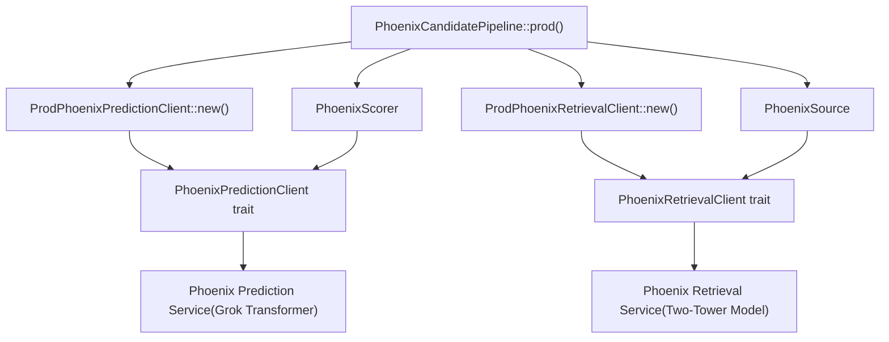
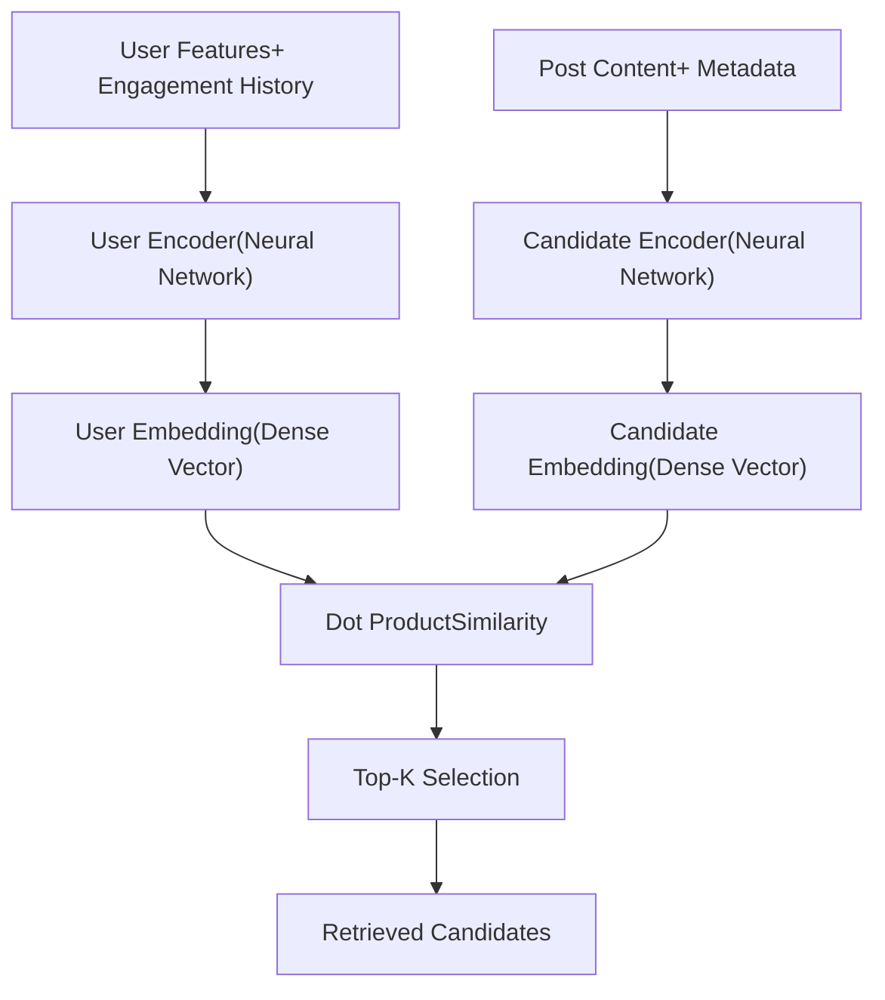
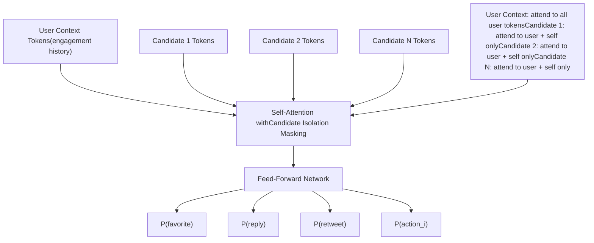
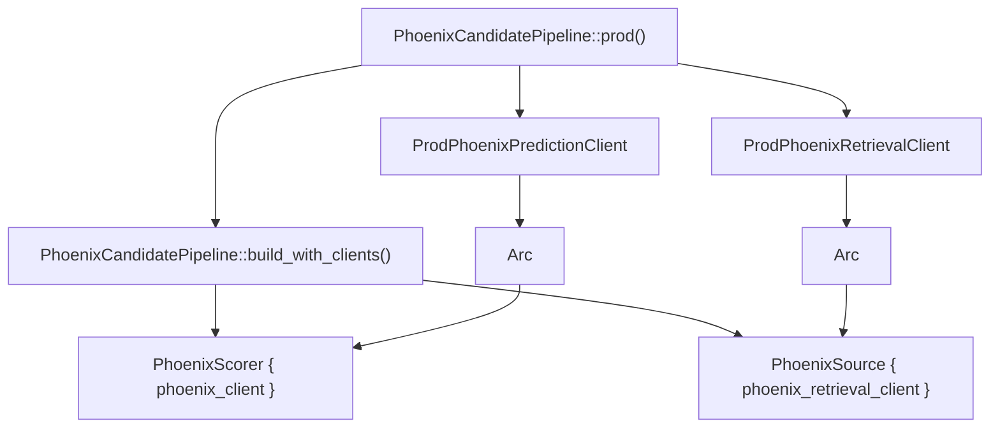

# Phoenix ML Services

Relevant source files

-   [README.md](https://github.com/xai-org/x-algorithm/blob/aaa167b3/README.md?plain=1)
-   [home-mixer/candidate\_pipeline/phoenix\_candidate\_pipeline.rs](https://github.com/xai-org/x-algorithm/blob/aaa167b3/home-mixer/candidate_pipeline/phoenix_candidate_pipeline.rs)

## Purpose and Scope

This document describes the integration with Phoenix ML services, which provide machine learning capabilities for candidate retrieval and ranking in the "For You" feed. Phoenix consists of two distinct services accessed through client interfaces: `PhoenixRetrievalClient` for out-of-network content discovery using a two-tower model, and `PhoenixPredictionClient` for engagement probability prediction using a Grok-based transformer.

For information about how Phoenix fits into the overall pipeline execution, see [Phoenix Candidate Pipeline](/xai-org/x-algorithm/4.1-phoenix-candidate-pipeline). For details on the Phoenix Scorer implementation that uses `PhoenixPredictionClient`, see [Phoenix Scorer](/xai-org/x-algorithm/4.7.1-phoenix-scorer). For details on the Phoenix Retrieval Source that uses `PhoenixRetrievalClient`, see [Phoenix Retrieval Source](/xai-org/x-algorithm/4.3.2-phoenix-retrieval-source).

## Overview

Phoenix provides two core ML capabilities accessed through separate client interfaces:

| Service | Client Interface | Purpose | Use Case |
| --- | --- | --- | --- |
| **Phoenix Retrieval** | `PhoenixRetrievalClient` | Two-tower similarity search | Out-of-network content discovery |
| **Phoenix Prediction** | `PhoenixPredictionClient` | Grok transformer ranking | Multi-action engagement probability prediction |

Both services are initialized as production clients in the pipeline and injected into their respective components through dependency injection.

**Sources:** [README.md163-183](https://github.com/xai-org/x-algorithm/blob/aaa167b3/README.md?plain=1#L163-L183) [home-mixer/candidate\_pipeline/phoenix\_candidate\_pipeline.rs10-14](https://github.com/xai-org/x-algorithm/blob/aaa167b3/home-mixer/candidate_pipeline/phoenix_candidate_pipeline.rs#L10-L14)

## Client Integration Architecture

The following diagram illustrates how Phoenix ML service clients are integrated into the Home Mixer pipeline:


**Sources:** [home-mixer/candidate\_pipeline/phoenix\_candidate\_pipeline.rs73-212](https://github.com/xai-org/x-algorithm/blob/aaa167b3/home-mixer/candidate_pipeline/phoenix_candidate_pipeline.rs#L73-L212)

## Phoenix Retrieval Service

### Two-Tower Architecture

Phoenix Retrieval uses a two-tower neural network architecture to discover relevant out-of-network content through embedding similarity search. This enables the system to recommend posts from accounts the user does not follow.


The two towers operate independently:

-   **User Tower**: Encodes user features and engagement history into a single dense embedding vector
-   **Candidate Tower**: Encodes all posts in the corpus into embedding vectors
-   **Similarity Search**: Retrieves top-K candidates via dot product similarity between user and candidate embeddings

**Sources:** [README.md169-175](https://github.com/xai-org/x-algorithm/blob/aaa167b3/README.md?plain=1#L169-L175)

### PhoenixRetrievalClient Integration

The `PhoenixRetrievalClient` trait abstracts communication with the Phoenix Retrieval service. The production implementation `ProdPhoenixRetrievalClient` is instantiated during pipeline initialization and injected into `PhoenixSource`.

> **[Mermaid sequence]**
> *(图表结构无法解析)*

The retrieval client is used exclusively by `PhoenixSource` to fetch out-of-network candidates during the candidate sourcing phase. The source transforms the service response into `PostCandidate` structs with initial metadata.

**Sources:** [home-mixer/candidate\_pipeline/phoenix\_candidate\_pipeline.rs92-94](https://github.com/xai-org/x-algorithm/blob/aaa167b3/home-mixer/candidate_pipeline/phoenix_candidate_pipeline.rs#L92-L94) [README.md169-175](https://github.com/xai-org/x-algorithm/blob/aaa167b3/README.md?plain=1#L169-L175)

### Client Initialization

The production Phoenix Retrieval client is created during pipeline initialization:

```
// From phoenix_candidate_pipeline.rs:171-174let phoenix_retrieval_client = Arc::new(    ProdPhoenixRetrievalClient::new()        .await        .expect("Failed to create Phoenix retrieval client"),);
```
The client is wrapped in an `Arc` to enable shared ownership across pipeline components and injected into `PhoenixSource` during pipeline construction.

**Sources:** [home-mixer/candidate\_pipeline/phoenix\_candidate\_pipeline.rs171-174](https://github.com/xai-org/x-algorithm/blob/aaa167b3/home-mixer/candidate_pipeline/phoenix_candidate_pipeline.rs#L171-L174) [home-mixer/candidate\_pipeline/phoenix\_candidate\_pipeline.rs92-94](https://github.com/xai-org/x-algorithm/blob/aaa167b3/home-mixer/candidate_pipeline/phoenix_candidate_pipeline.rs#L92-L94)

## Phoenix Prediction Service

### Grok Transformer with Candidate Isolation

Phoenix Prediction uses a Grok-based transformer model to predict engagement probabilities for candidate posts. The key architectural feature is **candidate isolation**: candidates cannot attend to each other during inference, only to the user context.


This attention masking pattern ensures that the score for each candidate is independent of which other candidates appear in the batch, making scores **consistent and cacheable**.

**Sources:** [README.md176-181](https://github.com/xai-org/x-algorithm/blob/aaa167b3/README.md?plain=1#L176-L181) [README.md306-308](https://github.com/xai-org/x-algorithm/blob/aaa167b3/README.md?plain=1#L306-L308)

### Multi-Action Prediction

The Phoenix transformer predicts probabilities for multiple engagement actions rather than a single relevance score:

| Prediction Output | Description | Use in Scoring |
| --- | --- | --- |
| `P(favorite)` | Probability user will like the post | Positive weight |
| `P(reply)` | Probability user will reply | Positive weight |
| `P(repost)` | Probability user will repost | Positive weight |
| `P(quote)` | Probability user will quote-tweet | Positive weight |
| `P(click)` | Probability user will click details | Positive weight |
| `P(profile_click)` | Probability user will view author profile | Positive weight |
| `P(video_view)` | Probability user will watch video | Positive weight |
| `P(photo_expand)` | Probability user will expand photo | Positive weight |
| `P(share)` | Probability user will share externally | Positive weight |
| `P(dwell)` | Probability user will dwell on post | Positive weight |
| `P(follow_author)` | Probability user will follow author | Positive weight |
| `P(not_interested)` | Probability user will mark "not interested" | Negative weight |
| `P(block_author)` | Probability user will block author | Negative weight |
| `P(mute_author)` | Probability user will mute author | Negative weight |
| `P(report)` | Probability user will report post | Negative weight |

These predictions are stored in the `PostCandidate` struct and consumed by the `WeightedScorer` to compute the final ranking score.

**Sources:** [README.md244-263](https://github.com/xai-org/x-algorithm/blob/aaa167b3/README.md?plain=1#L244-L263) [README.md313](https://github.com/xai-org/x-algorithm/blob/aaa167b3/README.md?plain=1#L313-L313)

### PhoenixPredictionClient Integration

The `PhoenixPredictionClient` trait abstracts communication with the Phoenix Prediction service. The production implementation `ProdPhoenixPredictionClient` is instantiated during pipeline initialization and injected into `PhoenixScorer`.

> **[Mermaid sequence]**
> *(图表结构无法解析)*

The prediction client is used exclusively by `PhoenixScorer` during the scoring phase. The scorer receives predictions for all candidates and updates each `PostCandidate` with its Phoenix scores.

**Sources:** [home-mixer/candidate\_pipeline/phoenix\_candidate\_pipeline.rs123](https://github.com/xai-org/x-algorithm/blob/aaa167b3/home-mixer/candidate_pipeline/phoenix_candidate_pipeline.rs#L123-L123) [README.md176-181](https://github.com/xai-org/x-algorithm/blob/aaa167b3/README.md?plain=1#L176-L181)

### Client Initialization

The production Phoenix Prediction client is created during pipeline initialization:

```
// From phoenix_candidate_pipeline.rs:166-169let phoenix_client = Arc::new(    ProdPhoenixPredictionClient::new()        .await        .expect("Failed to create Phoenix prediction client"),);
```
The client is wrapped in an `Arc` to enable shared ownership and injected into `PhoenixScorer` during pipeline construction.

**Sources:** [home-mixer/candidate\_pipeline/phoenix\_candidate\_pipeline.rs166-169](https://github.com/xai-org/x-algorithm/blob/aaa167b3/home-mixer/candidate_pipeline/phoenix_candidate_pipeline.rs#L166-L169) [home-mixer/candidate\_pipeline/phoenix\_candidate\_pipeline.rs123](https://github.com/xai-org/x-algorithm/blob/aaa167b3/home-mixer/candidate_pipeline/phoenix_candidate_pipeline.rs#L123-L123)

## Pipeline Integration

### Component Dependency Graph

The following diagram shows how Phoenix clients are integrated into the pipeline's dependency graph:


**Sources:** [home-mixer/candidate\_pipeline/phoenix\_candidate\_pipeline.rs73-212](https://github.com/xai-org/x-algorithm/blob/aaa167b3/home-mixer/candidate_pipeline/phoenix_candidate_pipeline.rs#L73-L212)

### Usage Pattern

Both Phoenix clients follow the same integration pattern:

1.  **Client Creation**: Production client instances are created asynchronously in `PhoenixCandidatePipeline::prod()`
2.  **Trait Wrapping**: Clients are wrapped in `Arc<dyn Trait>` for shared ownership and trait object polymorphism
3.  **Component Injection**: Trait objects are injected into pipeline components during construction
4.  **Execution**: Components call trait methods during pipeline execution to access ML services

This pattern enables:

-   **Testability**: Mock implementations can be injected for testing
-   **Abstraction**: Pipeline components depend on traits, not concrete implementations
-   **Shared Ownership**: Multiple components can reference the same client instance

**Sources:** [home-mixer/candidate\_pipeline/phoenix\_candidate\_pipeline.rs73-212](https://github.com/xai-org/x-algorithm/blob/aaa167b3/home-mixer/candidate_pipeline/phoenix_candidate_pipeline.rs#L73-L212)

## Key Design Decisions

### Trait-Based Abstraction

Both Phoenix services are accessed through trait abstractions rather than concrete types. This enables dependency injection, testing with mock implementations, and isolation of service implementation details from pipeline logic.

| Design Choice | Benefit |
| --- | --- |
| Trait-based client interfaces | Enables mock implementations for testing |
| `Arc<dyn Trait>` ownership | Shared client instances across components |
| Async initialization | Non-blocking service connection setup |
| Production/test separation | Pipeline logic independent of client implementation |

**Sources:** [home-mixer/candidate\_pipeline/phoenix\_candidate\_pipeline.rs75-81](https://github.com/xai-org/x-algorithm/blob/aaa167b3/home-mixer/candidate_pipeline/phoenix_candidate_pipeline.rs#L75-L81)

### Candidate Isolation in Ranking

The Phoenix Prediction service implements candidate isolation through attention masking. This ensures that the score assigned to a candidate depends only on the user context and the candidate itself, not on other candidates in the batch. This property enables:

-   **Score Consistency**: Same candidate receives same score regardless of batch composition
-   **Cacheability**: Scores can be cached and reused across requests
-   **Parallel Scoring**: Candidates can be scored in different batches without affecting results

**Sources:** [README.md306-308](https://github.com/xai-org/x-algorithm/blob/aaa167b3/README.md?plain=1#L306-L308)

### Hash-Based Embeddings

Both retrieval and ranking use hash-based embedding lookups rather than traditional vocabulary-based embeddings. This approach provides:

-   **Open Vocabulary**: No out-of-vocabulary issues with new terms
-   **Memory Efficiency**: Fixed embedding table size regardless of vocabulary
-   **Collision Handling**: Multiple hash functions reduce collision impact

**Sources:** [README.md310](https://github.com/xai-org/x-algorithm/blob/aaa167b3/README.md?plain=1#L310-L310)
