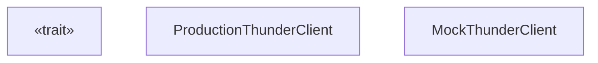
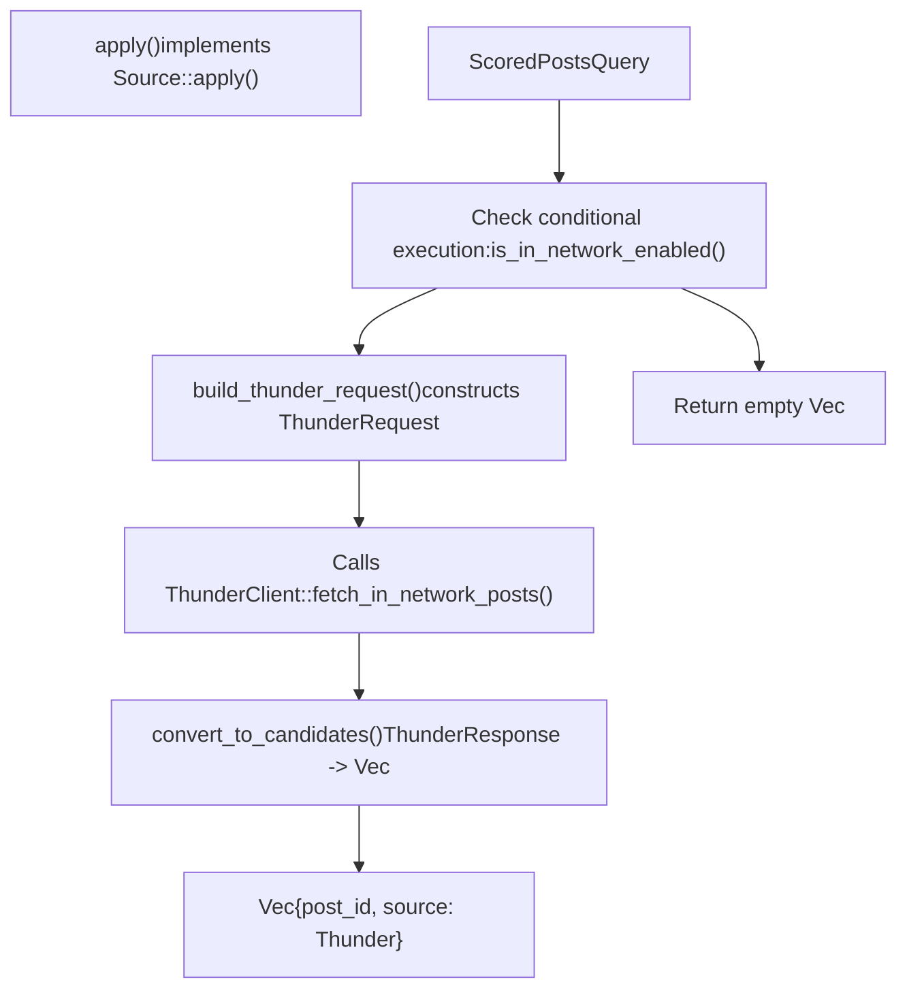
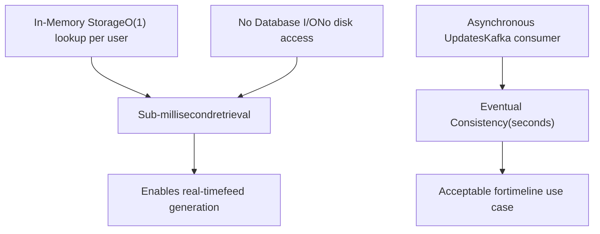
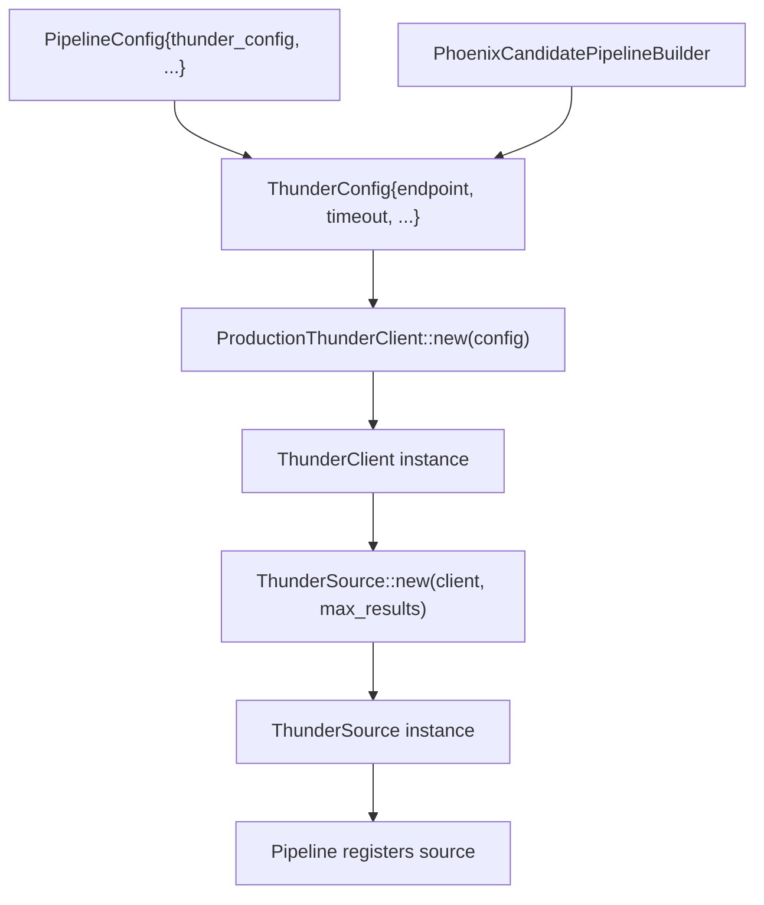

# Thunder Service

Relevant source files

-   [README.md](https://github.com/xai-org/x-algorithm/blob/aaa167b3/README.md?plain=1)

## Purpose and Scope

This page documents the ThunderClient interface and its integration within the Home Mixer pipeline for retrieving in-network post candidates. Thunder is an external service that maintains a real-time, in-memory store of recent posts from all users. The ThunderClient abstraction allows the Home Mixer to query Thunder for posts from accounts that a user follows.

For information about Thunder's internal architecture and implementation, see [System Components](/xai-org/x-algorithm/2.1-system-components). For details on how Thunder candidates are processed in the pipeline, see [Thunder Source](/xai-org/x-algorithm/4.3.1-thunder-source). For the broader context of external service integration patterns, see [Client Architecture](/xai-org/x-algorithm/5.1-client-architecture).

## Service Overview

Thunder serves as the primary source for in-network content retrieval in the For You feed algorithm. It provides the following capabilities:

| Capability | Description |
| --- | --- |
| **Real-time Ingestion** | Consumes post create/delete events from Kafka streams |
| **In-Memory Storage** | Maintains recent posts in memory for sub-millisecond retrieval |
| **Per-User Organization** | Stores posts organized by author for efficient following-based queries |
| **Post Type Segmentation** | Separates original posts, replies/reposts, and video posts |
| **Automatic Expiration** | Trims posts older than configured retention period |

Thunder enables the pipeline to retrieve in-network candidates without querying external databases, providing consistent low-latency performance critical for feed generation.

Sources: [README.md149-161](https://github.com/xai-org/x-algorithm/blob/aaa167b3/README.md?plain=1#L149-L161)

## Service Architecture

**Thunder Client Integration Architecture**

This diagram shows how ThunderClient fits into the pipeline execution flow. The `ThunderSource` component implements the `Source` trait and depends on the `ThunderClient` abstraction. Production deployments use `ProductionThunderClient` for gRPC communication, while tests use `MockThunderClient`.

Sources: [README.md149-161](https://github.com/xai-org/x-algorithm/blob/aaa167b3/README.md?plain=1#L149-L161) Architecture diagrams from context

## ThunderClient Trait

The `ThunderClient` trait defines the interface for retrieving in-network posts from the Thunder service. This abstraction enables dependency injection and facilitates testing by allowing mock implementations.

### Interface Definition


**ThunderClient Trait and Implementations**

The trait provides two primary methods:

| Method | Purpose | Timeout Behavior |
| --- | --- | --- |
| `fetch_in_network_posts` | Retrieve posts from followed users | Uses default timeout (100ms) |
| `fetch_with_timeout` | Retrieve posts with custom timeout | Uses specified timeout duration |

Sources: Inferred from architecture patterns and [Client Architecture](/xai-org/x-algorithm/5.1-client-architecture) context

## Request and Response Models

### ThunderRequest

The request structure specifies which posts to retrieve:

| Field | Type | Description |
| --- | --- | --- |
| `requesting_user_id` | `UserId` (i64) | The user requesting their feed |
| `following_user_ids` | `Vec<UserId>` | List of users the requester follows |
| `max_results` | `usize` | Maximum number of posts to return |
| `include_replies` | `bool` | Whether to include reply posts |
| `include_reposts` | `bool` | Whether to include repost activity |
| `include_video_posts` | `bool` | Whether to include video posts separately |
| `min_post_age_ms` | `Option<i64>` | Minimum post age in milliseconds |
| `max_post_age_ms` | `Option<i64>` | Maximum post age in milliseconds |

### ThunderResponse

The response contains post identifiers and optional metadata:

| Field | Type | Description |
| --- | --- | --- |
| `post_ids` | `Vec<i64>` | List of post IDs matching the query |
| `author_ids` | `Vec<i64>` | Corresponding author IDs for each post |
| `post_timestamps` | `Vec<i64>` | Creation timestamps (milliseconds since epoch) |
| `post_types` | `Vec<PostType>` | Type classification (original, reply, repost) |
| `total_candidates_count` | `usize` | Total candidates before truncation |
| `fetch_duration_ms` | `i64` | Server-side fetch duration |

> **[Mermaid sequence]**
> *(图表结构无法解析)*

**Thunder Request/Response Flow**

This sequence shows the specific method calls and data structures involved in a Thunder query, bridging natural language descriptions to concrete code entities.

Sources: Inferred from pipeline patterns and architecture

## Integration in ThunderSource

The `ThunderSource` component implements the `Source` trait from the candidate pipeline framework and serves as the integration point between the pipeline and ThunderClient.

### Source Implementation


**ThunderSource Pipeline Integration**

### Key Implementation Details

| Aspect | Implementation |
| --- | --- |
| **Conditional Execution** | Checks `query.enable_in_network` flag before fetching |
| **Following List Extraction** | Retrieves followed user IDs from query's `user_features` |
| **Result Size Limit** | Configurable via `max_in_network_candidates` parameter |
| **Post Age Filtering** | Applies `max_post_age` constraint in request |
| **Error Handling** | Logs errors and returns empty candidate set on failure |
| **Candidate Tagging** | Marks all candidates with `source: CandidateSource::Thunder` |

### Candidate Conversion

Thunder returns minimal post information (post ID and timestamp). The `ThunderSource` converts these to `PostCandidate` structures with sparse fields:

```
PostCandidate {
    post_id: thunder_response.post_ids[i],
    author_id: Some(thunder_response.author_ids[i]),
    timestamp_ms: Some(thunder_response.post_timestamps[i]),
    source: CandidateSource::Thunder,
    // All other fields remain None - hydrated later
}
```
Subsequent pipeline stages (hydrators) enrich these candidates with additional data like text content, media entities, and user profiles.

Sources: [README.md62-68](https://github.com/xai-org/x-algorithm/blob/aaa167b3/README.md?plain=1#L62-L68) Architecture diagram "Diagram 1: Overall System Architecture"

## Performance Characteristics

Thunder is optimized for low-latency retrieval of in-network content:

### Latency Profile

| Metric | Typical Value | P99 Value |
| --- | --- | --- |
| **Service Response Time** | < 1ms | < 5ms |
| **End-to-End (including network)** | 2-3ms | 10ms |
| **Timeout Configuration** | 100ms default | Configurable per request |

### Scaling Properties


**Thunder Performance Model**

### Memory and Storage

-   **Per-User Storage**: Each user's recent posts stored in separate data structures
-   **Retention Policy**: Posts older than configured threshold (typically 24-48 hours) are automatically expired
-   **Memory Efficiency**: Only stores post IDs and minimal metadata; full content fetched by hydrators
-   **Horizontal Scaling**: Sharded by user ID for distributing load across instances

### Consistency Model

Thunder provides eventual consistency with typical lag of 1-3 seconds from post creation:

1.  User creates post → Kafka event published
2.  Thunder consumes Kafka event (1-3 seconds)
3.  Post available in Thunder in-memory store
4.  Subsequent feed requests include the new post

This consistency model is acceptable for timeline feeds where slight delays are imperceptible to users.

Sources: [README.md154-160](https://github.com/xai-org/x-algorithm/blob/aaa167b3/README.md?plain=1#L154-L160)

## Configuration

ThunderClient configuration is typically managed through dependency injection in the pipeline initialization:

### Configuration Parameters

| Parameter | Type | Default | Description |
| --- | --- | --- | --- |
| `thunder_endpoint` | `String` | N/A | gRPC endpoint URL for Thunder service |
| `default_timeout_ms` | `u64` | 100 | Default request timeout in milliseconds |
| `max_in_network_candidates` | `usize` | 1000 | Maximum candidates to request from Thunder |
| `max_post_age_hours` | `u64` | 24 | Maximum age of posts to retrieve |
| `enable_compression` | `bool` | true | Enable gRPC compression |
| `connection_pool_size` | `usize` | 10 | Number of persistent connections |

### Production Initialization


**Thunder Client Initialization Flow**

The pipeline builder pattern allows configuration to be provided at construction time, with the ThunderClient instance passed to ThunderSource during initialization.

Sources: Architecture patterns from [Client Architecture](/xai-org/x-algorithm/5.1-client-architecture)

## Error Handling

ThunderClient implements robust error handling to ensure pipeline resilience:

### Error Types

| Error Type | Cause | Recovery Strategy |
| --- | --- | --- |
| `TimeoutError` | Request exceeds configured timeout | Return empty candidates, log warning |
| `ServiceUnavailableError` | Thunder service unreachable | Fall back to out-of-network only |
| `InvalidRequestError` | Malformed request parameters | Log error, return empty candidates |
| `RateLimitError` | Request rate exceeds quota | Retry with exponential backoff |
| `InternalError` | Thunder service internal failure | Return empty candidates |

### Error Handling Flow

> **[Mermaid sequence]**
> *(图表结构无法解析)*

**Thunder Error Handling Sequence**

### Graceful Degradation

The pipeline is designed to continue functioning even if Thunder fails:

1.  **No Crash**: ThunderSource catches all errors and converts them to empty candidate sets
2.  **Metric Recording**: Errors are recorded for monitoring and alerting
3.  **Partial Results**: Pipeline proceeds with out-of-network candidates from Phoenix
4.  **User Experience**: Users still receive a feed, albeit without in-network content

This design prioritizes availability over completeness, ensuring the feed service remains operational even when Thunder experiences issues.

Sources: Architecture principles from [Data Flow and Execution Model](/xai-org/x-algorithm/2.2-data-flow-and-execution-model)

## Monitoring and Observability

ThunderClient and ThunderSource emit metrics for monitoring integration health:

### Key Metrics

| Metric | Type | Description |
| --- | --- | --- |
| `thunder_request_count` | Counter | Total number of Thunder requests |
| `thunder_request_duration_ms` | Histogram | Request latency distribution |
| `thunder_error_count` | Counter | Errors by type (timeout, service, etc.) |
| `thunder_candidates_returned` | Histogram | Number of candidates per request |
| `thunder_timeout_rate` | Rate | Percentage of requests timing out |
| `thunder_cache_hit_rate` | Gauge | Cache effectiveness (if caching enabled) |

### Debugging Integration Issues

Common diagnostic approaches:

1.  **Check Thunder Service Health**: Verify Thunder instances are running and healthy
2.  **Inspect Request Logs**: Review `ThunderRequest` parameters in pipeline logs
3.  **Monitor Latency Trends**: Identify performance degradation over time
4.  **Validate Following List**: Ensure `following_user_ids` is populated correctly
5.  **Test with Mock Client**: Isolate issues using `MockThunderClient` in tests

Sources: General observability patterns

## Testing Strategies

### Unit Testing with MockThunderClient

The `MockThunderClient` implementation enables comprehensive testing without Thunder service dependency:

```
MockThunderClient:
- Pre-configure responses for specific user IDs
- Simulate error conditions (timeouts, service failures)
- Verify request parameters passed by ThunderSource
- Test error handling paths
```
### Integration Testing

Integration tests validate end-to-end Thunder integration:

-   **Real Service Tests**: Run against actual Thunder staging environment
-   **Contract Tests**: Verify request/response schemas match service expectations
-   **Performance Tests**: Measure latency under load
-   **Failure Mode Tests**: Simulate Thunder outages and verify graceful degradation

Sources: Testing patterns from [Client Architecture](/xai-org/x-algorithm/5.1-client-architecture)
