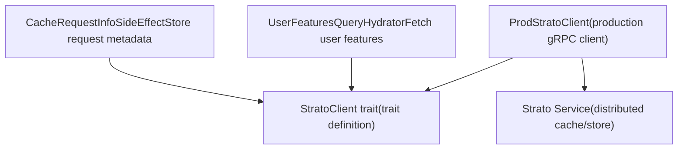
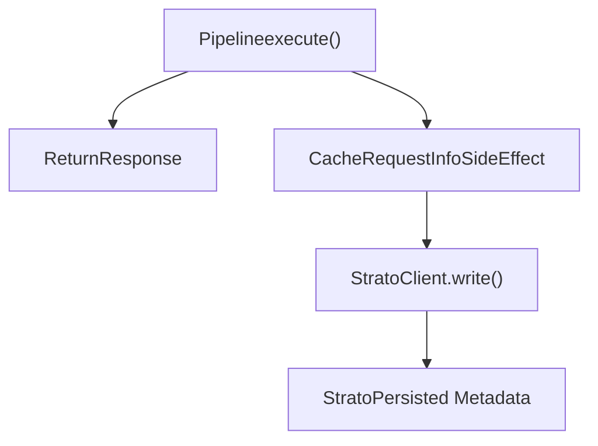
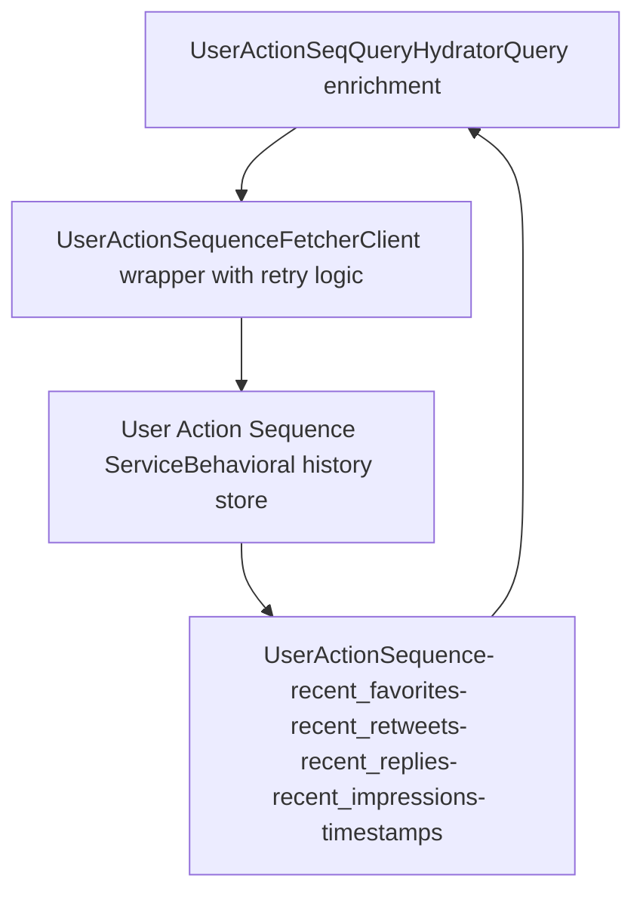
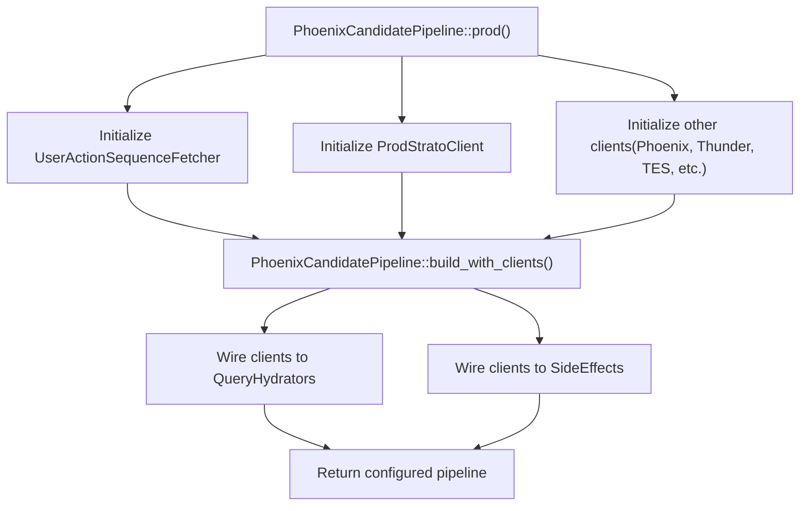
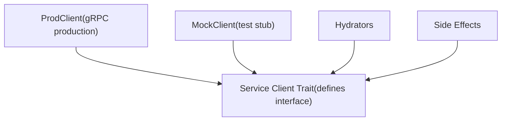

# Strato and Other Services

Relevant source files

-   [home-mixer/candidate\_pipeline/phoenix\_candidate\_pipeline.rs](https://github.com/xai-org/x-algorithm/blob/aaa167b3/home-mixer/candidate_pipeline/phoenix_candidate_pipeline.rs)

## Purpose and Scope

This page documents the integration with Strato, a distributed caching service, and other miscellaneous service clients that support the candidate pipeline. The primary focus is on `StratoClient` for caching operations and `UserActionSequenceFetcher` for retrieving user behavioral data. For other major service integrations, see Tweet Entity Service [5.2](/xai-org/x-algorithm/5.2-tweet-entity-service-(tes)), Gizmoduck [5.3](/xai-org/x-algorithm/5.3-gizmoduck-service), Visibility Filtering [5.4](/xai-org/x-algorithm/5.4-visibility-filtering-service), Phoenix ML Services [5.5](/xai-org/x-algorithm/5.5-phoenix-ml-services), and Thunder [5.6](/xai-org/x-algorithm/5.6-thunder-service).

## Overview

The candidate pipeline relies on several supporting services beyond the major data sources and ML systems:

-   **Strato**: A distributed caching and storage service used for persisting request metadata and retrieving user features
-   **User Action Sequence Service**: Provides user behavioral history including recent engagements, impressions, and actions

These services support pipeline operations through caching side effects, query enrichment, and behavioral signal retrieval.

Sources: [home-mixer/candidate\_pipeline/phoenix\_candidate\_pipeline.rs1-256](https://github.com/xai-org/x-algorithm/blob/aaa167b3/home-mixer/candidate_pipeline/phoenix_candidate_pipeline.rs#L1-L256)

## StratoClient Architecture

### Client Interface

The `StratoClient` trait defines the abstraction for interacting with the Strato service. The trait-based design enables dependency injection and test mocking.


**StratoClient Integration Architecture**

The `StratoClient` trait provides asynchronous methods for reading and writing data to Strato. The production implementation `ProdStratoClient` establishes gRPC connections to the Strato service cluster.

Sources: [home-mixer/candidate\_pipeline/phoenix\_candidate\_pipeline.rs18](https://github.com/xai-org/x-algorithm/blob/aaa167b3/home-mixer/candidate_pipeline/phoenix_candidate_pipeline.rs#L18-L18) [home-mixer/candidate\_pipeline/phoenix\_candidate\_pipeline.rs78](https://github.com/xai-org/x-algorithm/blob/aaa167b3/home-mixer/candidate_pipeline/phoenix_candidate_pipeline.rs#L78-L78)

### Production Implementation

The `ProdStratoClient` is instantiated during pipeline initialization with connection configuration:

| Component | Description |
| --- | --- |
| **ProdStratoClient** | Production gRPC client implementation for Strato |
| **Connection** | Established asynchronously during pipeline setup |
| **Lifecycle** | Created once and shared via `Arc` across pipeline components |

The production client is initialized in the `PhoenixCandidatePipeline::prod()` method:

```
let strato_client = Arc::new(    ProdStratoClient::new()        .await        .expect("Failed to create Strato client"),);
```
This client instance is then passed to components requiring Strato access through dependency injection.

Sources: [home-mixer/candidate\_pipeline/phoenix\_candidate\_pipeline.rs177-181](https://github.com/xai-org/x-algorithm/blob/aaa167b3/home-mixer/candidate_pipeline/phoenix_candidate_pipeline.rs#L177-L181)

## Strato Usage in Pipeline

### User Features Query Hydrator

The `UserFeaturesQueryHydrator` uses `StratoClient` to retrieve user-level features that enrich the query context. This hydrator runs during the query hydration phase to fetch stored user attributes and preferences.

> **[Mermaid sequence]**
> *(图表结构无法解析)*

**User Features Retrieval Flow**

The hydrator attaches the Strato client and invokes it to retrieve cached user features, which are then merged into the `ScoredPostsQuery` object for downstream consumption.

Sources: [home-mixer/candidate\_pipeline/phoenix\_candidate\_pipeline.rs85-89](https://github.com/xai-org/x-algorithm/blob/aaa167b3/home-mixer/candidate_pipeline/phoenix_candidate_pipeline.rs#L85-L89)

### Cache Request Info Side Effect

The `CacheRequestInfoSideEffect` uses `StratoClient` to asynchronously persist request metadata for analytics and debugging purposes. This side effect executes after the main pipeline response without blocking.


**Asynchronous Cache Side Effect Pattern**

The side effect is fired asynchronously and does not impact response latency. Request metadata (query parameters, candidate IDs, scores, timestamps) is written to Strato for later analysis.

Sources: [home-mixer/candidate\_pipeline/phoenix\_candidate\_pipeline.rs146-147](https://github.com/xai-org/x-algorithm/blob/aaa167b3/home-mixer/candidate_pipeline/phoenix_candidate_pipeline.rs#L146-L147)

## UserActionSequenceFetcher

### Purpose and Architecture

The `UserActionSequenceFetcher` client retrieves user behavioral history from the User Action Sequence service. This service maintains a time-ordered log of user actions (favorites, retweets, replies, impressions, etc.) used to personalize recommendations.


**UserActionSequenceFetcher Architecture**

The fetcher abstracts the complexity of querying the UAS service, including connection pooling, retry logic, and data deserialization.

Sources: [home-mixer/candidate\_pipeline/phoenix\_candidate\_pipeline.rs21](https://github.com/xai-org/x-algorithm/blob/aaa167b3/home-mixer/candidate_pipeline/phoenix_candidate_pipeline.rs#L21-L21) [home-mixer/candidate\_pipeline/phoenix\_candidate\_pipeline.rs74](https://github.com/xai-org/x-algorithm/blob/aaa167b3/home-mixer/candidate_pipeline/phoenix_candidate_pipeline.rs#L74-L74)

### Implementation Details

The `UserActionSequenceFetcher` is instantiated during pipeline initialization:

```
let uas_fetcher =    Arc::new(UserActionSequenceFetcher::new().expect("Failed to create UAS fetcher"));
```
Key characteristics:

| Feature | Description |
| --- | --- |
| **Connection** | Establishes gRPC connection to UAS service cluster |
| **Error Handling** | Returns Result types; pipeline fails fast on initialization errors |
| **Lifecycle** | Singleton instance shared across query hydrators via `Arc` |
| **Query Pattern** | Fetches action sequences by user ID with configurable time windows |

Sources: [home-mixer/candidate\_pipeline/phoenix\_candidate\_pipeline.rs163-164](https://github.com/xai-org/x-algorithm/blob/aaa167b3/home-mixer/candidate_pipeline/phoenix_candidate_pipeline.rs#L163-L164)

### Usage in Query Hydration

The `UserActionSeqQueryHydrator` consumes the fetcher to enrich the query with user behavioral signals:

> **[Mermaid sequence]**
> *(图表结构无法解析)*

**User Action Sequence Hydration Flow**

The hydrator fetches the user's recent action history and attaches it to the query object. This behavioral data is later used by scorers (e.g., for recency-based boosting) and filters (e.g., for deduplication).

Sources: [home-mixer/candidate\_pipeline/phoenix\_candidate\_pipeline.rs85](https://github.com/xai-org/x-algorithm/blob/aaa167b3/home-mixer/candidate_pipeline/phoenix_candidate_pipeline.rs#L85-L85)

## Client Initialization and Dependency Injection

### Production Pipeline Construction

The `PhoenixCandidatePipeline::prod()` method demonstrates the initialization and wiring of Strato and other service clients:


**Pipeline Client Initialization Flow**

All service clients are initialized asynchronously before pipeline construction. The `build_with_clients()` method receives these clients and injects them into the appropriate pipeline components.

Sources: [home-mixer/candidate\_pipeline/phoenix\_candidate\_pipeline.rs162-212](https://github.com/xai-org/x-algorithm/blob/aaa167b3/home-mixer/candidate_pipeline/phoenix_candidate_pipeline.rs#L162-L212)

### Client Dependency Mapping

The following table shows which pipeline components depend on Strato and UAS clients:

| Pipeline Component | Client Dependency | Usage Purpose |
| --- | --- | --- |
| `UserActionSeqQueryHydrator` | `UserActionSequenceFetcher` | Fetch user behavioral history |
| `UserFeaturesQueryHydrator` | `StratoClient` | Retrieve cached user features |
| `CacheRequestInfoSideEffect` | `StratoClient` | Persist request metadata |

These dependencies are satisfied through constructor injection, with clients wrapped in `Arc` for shared ownership across the async pipeline execution.

Sources: [home-mixer/candidate\_pipeline/phoenix\_candidate\_pipeline.rs84-89](https://github.com/xai-org/x-algorithm/blob/aaa167b3/home-mixer/candidate_pipeline/phoenix_candidate_pipeline.rs#L84-L89) [home-mixer/candidate\_pipeline/phoenix\_candidate\_pipeline.rs146-147](https://github.com/xai-org/x-algorithm/blob/aaa167b3/home-mixer/candidate_pipeline/phoenix_candidate_pipeline.rs#L146-L147)

## Integration Patterns

### Trait-Based Abstraction

Both `StratoClient` and service fetchers follow the trait-based abstraction pattern used throughout the pipeline:


**Service Client Abstraction Pattern**

Consumers depend on trait interfaces rather than concrete implementations, enabling test isolation and future service migrations.

Sources: [home-mixer/candidate\_pipeline/phoenix\_candidate\_pipeline.rs18-21](https://github.com/xai-org/x-algorithm/blob/aaa167b3/home-mixer/candidate_pipeline/phoenix_candidate_pipeline.rs#L18-L21)

### Error Handling Strategy

Service client initialization follows a fail-fast pattern:

```
ProdStratoClient::new()    .await    .expect("Failed to create Strato client")
```
This approach ensures that:

-   Configuration errors are detected at startup
-   The pipeline never runs with missing dependencies
-   Errors are logged immediately during service initialization
-   Runtime errors are prevented through compile-time trait enforcement

Sources: [home-mixer/candidate\_pipeline/phoenix\_candidate\_pipeline.rs177-181](https://github.com/xai-org/x-algorithm/blob/aaa167b3/home-mixer/candidate_pipeline/phoenix_candidate_pipeline.rs#L177-L181)

### Shared Ownership with Arc

All service clients are wrapped in `Arc<T>` to enable:

-   **Shared Ownership**: Multiple pipeline components reference the same client instance
-   **Thread Safety**: Clients are `Send + Sync`, allowing parallel hydrator execution
-   **Resource Efficiency**: Single connection pool per client, avoiding redundant connections
-   **Async Compatibility**: Arc enables cloning into async tasks without lifetime issues

Sources: [home-mixer/candidate\_pipeline/phoenix\_candidate\_pipeline.rs74-81](https://github.com/xai-org/x-algorithm/blob/aaa167b3/home-mixer/candidate_pipeline/phoenix_candidate_pipeline.rs#L74-L81)
