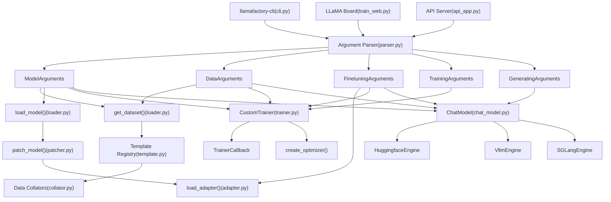
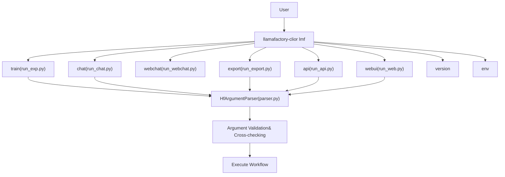
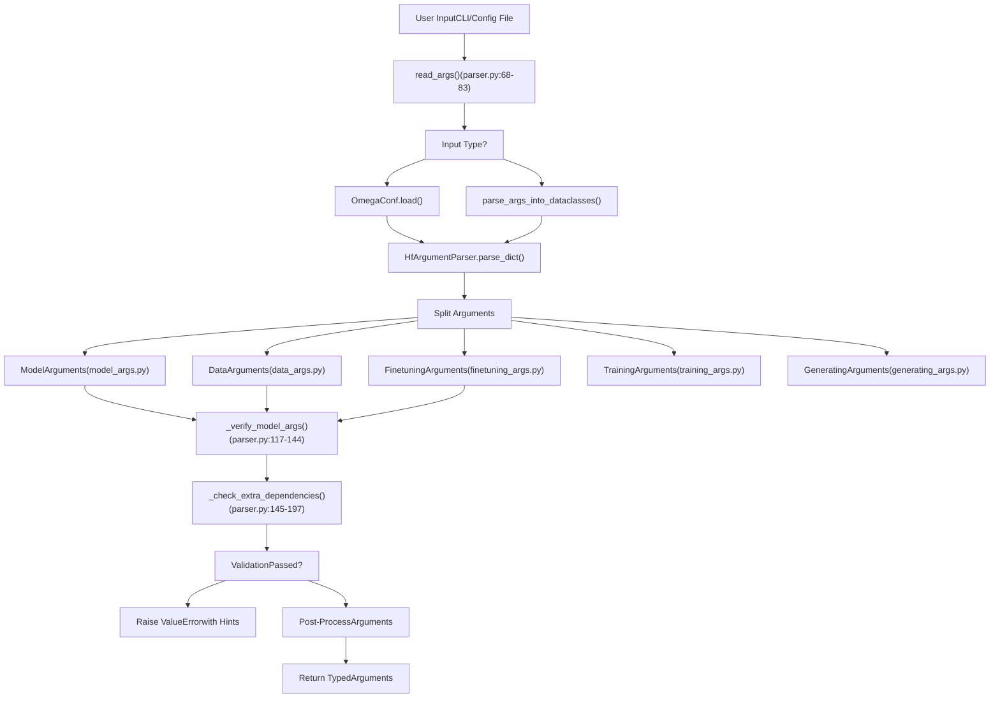
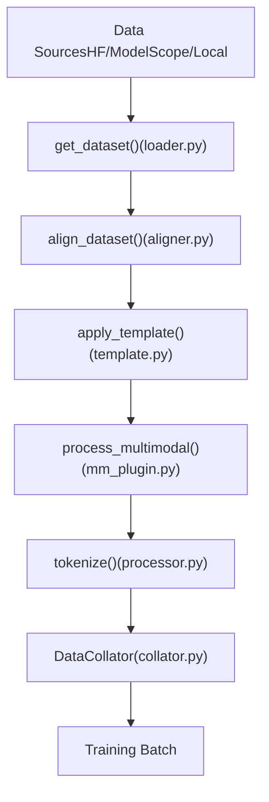
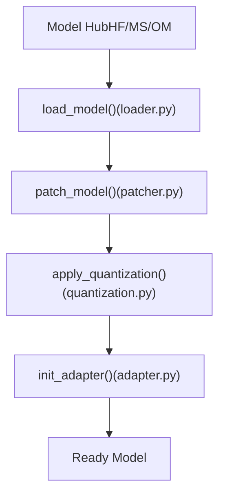
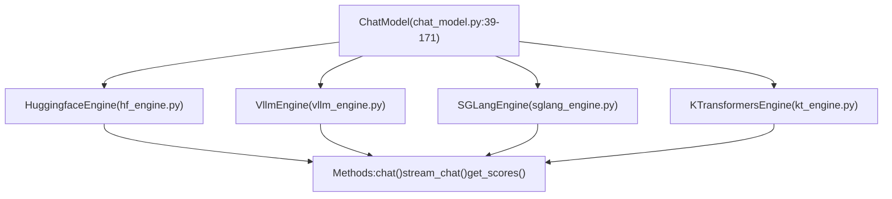

# LlamaFactory 概览

相关源文件

-   [.github/workflows/tests.yml](https://github.com/hiyouga/LlamaFactory/blob/355d5c5e/.github/workflows/tests.yml)
-   [Makefile](https://github.com/hiyouga/LlamaFactory/blob/355d5c5e/Makefile)
-   [README.md](https://github.com/hiyouga/LlamaFactory/blob/355d5c5e/README.md?plain=1)
-   [README\_zh.md](https://github.com/hiyouga/LlamaFactory/blob/355d5c5e/README_zh.md?plain=1)
-   [docker/docker-cuda/Dockerfile.megatron](https://github.com/hiyouga/LlamaFactory/blob/355d5c5e/docker/docker-cuda/Dockerfile.megatron)
-   [examples/README.md](https://github.com/hiyouga/LlamaFactory/blob/355d5c5e/examples/README.md?plain=1)
-   [examples/README\_zh.md](https://github.com/hiyouga/LlamaFactory/blob/355d5c5e/examples/README_zh.md?plain=1)
-   [pyproject.toml](https://github.com/hiyouga/LlamaFactory/blob/355d5c5e/pyproject.toml)
-   [src/llamafactory/chat/base\_engine.py](https://github.com/hiyouga/LlamaFactory/blob/355d5c5e/src/llamafactory/chat/base_engine.py)
-   [src/llamafactory/chat/chat\_model.py](https://github.com/hiyouga/LlamaFactory/blob/355d5c5e/src/llamafactory/chat/chat_model.py)
-   [src/llamafactory/cli.py](https://github.com/hiyouga/LlamaFactory/blob/355d5c5e/src/llamafactory/cli.py)
-   [src/llamafactory/hparams/parser.py](https://github.com/hiyouga/LlamaFactory/blob/355d5c5e/src/llamafactory/hparams/parser.py)
-   [src/llamafactory/v1/launcher.py](https://github.com/hiyouga/LlamaFactory/blob/355d5c5e/src/llamafactory/v1/launcher.py)

## 目的与范围

本文档提供了 LlamaFactory 的高级介绍。LlamaFactory 是一个统一的框架，用于高效微调 100 多个大语言模型。它涵盖了系统的架构、核心组件以及它们如何交互以支持训练、评估和推理工作流。本概览旨在让新开发人员和用户在深入研究特定子系统之前了解代码库结构。

有关特定主题的详细信息，请参阅：

-   安装与使用：[入门指南](/hiyouga/LlamaFactory/2-getting-started)
-   配置详情：[配置系统](/hiyouga/LlamaFactory/3-configuration-system)
-   数据处理：[数据流水线](/hiyouga/LlamaFactory/4-data-pipeline)
-   模型操作：[模型加载与配置](/hiyouga/LlamaFactory/5-model-loading-and-configuration)
-   训练详情：[训练系统](/hiyouga/LlamaFactory/6-training-system)
-   部署：[推理与部署](/hiyouga/LlamaFactory/7-inference-and-deployment)
-   Web 界面：[Web UI (LLaMA Board)](/hiyouga/LlamaFactory/8-web-ui-(llama-board))

**来源：** [README.md1-103](https://github.com/hiyouga/LlamaFactory/blob/355d5c5e/README.md?plain=1#L1-L103) [README\_zh.md1-104](https://github.com/hiyouga/LlamaFactory/blob/355d5c5e/README_zh.md?plain=1#L1-L104) [pyproject.toml1-98](https://github.com/hiyouga/LlamaFactory/blob/355d5c5e/pyproject.toml#L1-L98)

---

## 什么是 LlamaFactory？

LlamaFactory 是一个全面的微调框架，旨在简化并统一大语言模型的训练过程。它提供：

-   **多模型支持**：支持包括 LLaMA、Qwen、GLM、Mistral、Gemma、Yi 等在内的 100 多个模型系列
-   **灵活的训练方法**：全参数微调、冻结微调、LoRA、QLoRA、OFT
-   **多个训练阶段**：预训练、指令监督微调 (SFT)、奖励模型训练 (RM)、PPO、DPO、KTO、ORPO、SimPO
-   **三个用户界面**：命令行界面 (`llamafactory-cli`)、Web UI (LLaMA Board) 和 OpenAI 风格的 API 服务器
-   **多个推理后端**：HuggingFace Transformers、vLLM、SGLang、KTransformers
-   **高级功能**：多模态支持（图像、视频、音频）、量化（2/4/8 位）、分布式训练（DeepSpeed、FSDP）、自定义优化器（GaLore、BAdam、APOLLO）

该框架基于 PyTorch 构建，并利用了 HuggingFace Transformers，使其易于被熟悉这些生态系统的研究人员和从业者使用。

**来源：** [README.md93-103](https://github.com/hiyouga/LlamaFactory/blob/355d5c5e/README.md?plain=1#L93-L103) [pyproject.toml6-8](https://github.com/hiyouga/LlamaFactory/blob/355d5c5e/pyproject.toml#L6-L8)

---

## 系统架构概览

### 高级组件交互


**架构概览**

LlamaFactory 遵循模块化架构，所有入口点（CLI、Web UI、API）都汇集到 `parser.py` 中实现的统一配置系统。解析器验证输入并将其分发到五个类型的参数类中，确保类型安全和早期错误检测。

系统分为五个主要子系统：

1.  **配置系统** ([parser.py1-472](https://github.com/hiyouga/LlamaFactory/blob/355d5c5e/parser.py#L1-L472))：核心验证和路由枢纽
2.  **数据系统**：处理来自不同来源的加载、格式化和批处理
3.  **模型系统**：管理模型加载、补丁应用、量化和适配器应用
4.  **训练系统**：提供具有自定义损失函数的阶段专用训练器
5.  **推理系统**：为部署场景提供多种后端

**来源：** [src/llamafactory/cli.py16-31](https://github.com/hiyouga/LlamaFactory/blob/355d5c5e/src/llamafactory/cli.py#L16-L31) [src/llamafactory/hparams/parser.py49-66](https://github.com/hiyouga/LlamaFactory/blob/355d5c5e/src/llamafactory/hparams/parser.py#L49-L66) [src/llamafactory/chat/chat\_model.py39-85](https://github.com/hiyouga/LlamaFactory/blob/355d5c5e/src/llamafactory/chat/chat_model.py#L39-L85)

---

## 入口点与命令结构

### 命令行界面

主要入口点是 `llamafactory-cli` 命令（别名 `lmf`），它分发到不同的工作流：

| 命令 | 用途 | 实现 |
| --- | --- | --- |
| `llamafactory-cli train` | 训练模型 | 使用解析后的参数启动训练 |
| `llamafactory-cli chat` | 交互式命令行聊天 | [chat\_model.py173-211](https://github.com/hiyouga/LlamaFactory/blob/355d5c5e/chat_model.py#L173-L211) |
| `llamafactory-cli webchat` | 基于 Web 的聊天 UI | Gradio 界面 |
| `llamafactory-cli api` | OpenAI 风格的 API 服务器 | FastAPI 应用 |
| `llamafactory-cli webui` | LLaMA Board 图形界面 | 完整的训练/推理 UI |
| `llamafactory-cli export` | 合并/导出模型 | 适配器合并与量化 |
| `llamafactory-cli version` | 版本信息 | 显示框架版本 |
| `llamafactory-cli env` | 环境信息 | 系统诊断 |


**命令执行流**

所有命令都遵循以下模式：

1.  解析命令行参数或 YAML/JSON 配置文件
2.  验证并交叉检查参数（例如，量化需要 LoRA/OFT）
3.  设置日志记录和环境变量
4.  执行请求的工作流

框架支持通过以下方式进行配置：

-   命令行参数：`llamafactory-cli train --model_name_or_path Qwen/Qwen3-4B ...`
-   YAML 文件：`llamafactory-cli train examples/train_lora/qwen3_lora_sft.yaml`
-   JSON 文件：`llamafactory-cli train config.json`
-   混合方式：`llamafactory-cli train config.yaml learning_rate=1e-5`

**来源：** [src/llamafactory/cli.py16-31](https://github.com/hiyouga/LlamaFactory/blob/355d5c5e/src/llamafactory/cli.py#L16-L31) [examples/README.md1-40](https://github.com/hiyouga/LlamaFactory/blob/355d5c5e/examples/README.md?plain=1#L1-L40) [src/llamafactory/hparams/parser.py68-83](https://github.com/hiyouga/LlamaFactory/blob/355d5c5e/src/llamafactory/hparams/parser.py#L68-L83)

---

## 配置系统架构

### 参数解析与验证


**配置验证逻辑**

解析器执行广泛的验证以尽早捕获配置错误：

| 验证类型 | 示例规则 | 位置 |
| --- | --- | --- |
| 类型兼容性 | 量化仅适用于 LoRA/OFT | [parser.py125-140](https://github.com/hiyouga/LlamaFactory/blob/355d5c5e/parser.py#L125-L140) |
| 阶段要求 | `predict_with_generate` 仅在 SFT 中可用 | [parser.py256-267](https://github.com/hiyouga/LlamaFactory/blob/355d5c5e/parser.py#L256-L267) |
| 硬件约束 | `pure_bf16` 需要 BF16 支持 | [parser.py318-323](https://github.com/hiyouga/LlamaFactory/blob/355d5c5e/parser.py#L318-L323) |
| 分布式约束 | 分层 GaLore 与 DDP 不兼容 | [parser.py325-340](https://github.com/hiyouga/LlamaFactory/blob/355d5c5e/parser.py#L325-L340) |
| 后端要求 | vLLM 不支持 BnB 量化 | [parser.py481-492](https://github.com/hiyouga/LlamaFactory/blob/355d5c5e/parser.py#L481-L492) |

**参数类**

五个参数类封装了配置的不同方面：

1.  **`ModelArguments`**：模型选择、量化、注意力机制、RoPE 缩放、适配器路径
2.  **`DataArguments`**：数据集选择、模板、截断长度、打包设置、多模态配置
3.  **`FinetuningArguments`**：训练阶段 (pt/sft/rm/ppo/dpo)、LoRA 配置、优化器设置
4.  **`TrainingArguments`**：HuggingFace Trainer 设置（学习率、批次大小、周期、DeepSpeed、FSDP）
5.  **`GeneratingArguments`**：生成参数（温度、top\_p、最大 token 数、束搜索）

**来源：** [src/llamafactory/hparams/parser.py85-100](https://github.com/hiyouga/LlamaFactory/blob/355d5c5e/src/llamafactory/hparams/parser.py#L85-L100) [src/llamafactory/hparams/parser.py117-197](https://github.com/hiyouga/LlamaFactory/blob/355d5c5e/src/llamafactory/hparams/parser.py#L117-L197) [src/llamafactory/hparams/parser.py244-471](https://github.com/hiyouga/LlamaFactory/blob/355d5c5e/src/llamafactory/hparams/parser.py#L244-L471)

---

## 主要子系统概览

### 数据流水线摘要

数据流水线将原始数据集转换为准备好用于训练的 token 化批次。关键组件：


-   **数据集加载器**：支持 HuggingFace Hub、ModelScope、OpenMind、本地文件（JSON/CSV/Parquet）和云存储
-   **格式对齐器**：将 Alpaca 和 ShareGPT 格式转换为统一的内部表示
-   **模板系统**：应用模型特定的聊天模板（已注册 100 多个模板）
-   **多模态插件**：处理图像、视频和音频输入并进行格式正则化
-   **数据整理器**：处理填充、序列打包 e 4D 注意力掩码生成

**来源：** 高级架构中的图表 3

### 模型系统摘要

模型系统加载基础模型、应用补丁并初始化适配器：


-   **模型加载器**：从多个枢纽获取模型，并具有自动回退机制
-   **模型补丁器**：应用注意力机制、RoPE 缩放、MoE 设置的配置补丁
-   **量化**：通过 BitsAndBytes、GPTQ、AWQ、AQLM 支持 2/4/8 位量化
-   **适配器系统**：实现 LoRA、QLoRA、OFT、QOFT、冻结微调和全参数微调

**来源：** 高级架构中的图表 4

### 训练系统摘要

训练系统提供具有自定义损失函数的阶段专用训练器：

| 训练阶段 | 训练器类 | 损失函数 | 使用场景 |
| --- | --- | --- | --- |
| `pt` | `CustomTrainer` | 交叉熵 | 增量预训练 |
| `sft` | `CustomSeq2SeqTrainer` | 掩码交叉熵 | 指令微调 |
| `rm` | `PairwiseTrainer` | 成对损失 | 奖励模型训练 |
| `ppo` | `PPOTrainer` | 策略梯度 | 强化学习 |
| `dpo` | `CustomDPOTrainer` | DPO 损失 | 直接偏好优化 |
| `kto` | `KTOTrainer` | KTO 损失 | Kahneman-Tversky 优化 |
| `orpo` | `ORPOTrainer` | ORPO 损失 | 胜率偏好优化 |
| `simpo` | `SimPOTrainer` | SimPO 损失 | 简单偏好优化 |

**高级优化器**：

-   **GaLore**：梯度低秩投影，用于节省显存的全参数微调
-   **BAdam**：块级 Adam，具有自适应块选择功能
-   **APOLLO**：自适应伪正交低秩优化
-   **Adam-mini**：显存高效的 Adam 变体
-   **Muon**：适用于大模型的基于动量的优化器
-   **LoRA+**：增强版 LoRA，为 A 矩阵和 B 矩阵设置不同的学习率

**来源：** 高级架构中的图表 4，[README.md98-99](https://github.com/hiyouga/LlamaFactory/blob/355d5c5e/README.md?plain=1#L98-L99)

### 推理系统摘要

推理系统提供一个由多个引擎支持的统一 `ChatModel` 接口：


**引擎特性**：

-   **HuggingfaceEngine**：标准的 Transformers 后端，支持全功能
-   **VllmEngine**：推理速度提升 270% 以上，针对高吞吐量进行了优化
-   **SGLangEngine**：基于 HTTP 服务器，适用于并发请求
-   **KTransformersEngine**：大模型的 CPU-GPU 混合卸载

所有引擎都公开相同的接口：

-   `chat()`：同步批量推理
-   `stream_chat()`：逐 token 流式输出
-   `get_scores()`：奖励模型评分

**来源：** [src/llamafactory/chat/chat\_model.py39-171](https://github.com/hiyouga/LlamaFactory/blob/355d5c5e/src/llamafactory/chat/chat_model.py#L39-L171) [src/llamafactory/chat/base\_engine.py39-99](https://github.com/hiyouga/LlamaFactory/blob/355d5c5e/src/llamafactory/chat/base_engine.py#L39-L99) 高级架构中的图表 5

---

## 关键功能与能力

### 多模态支持

LlamaFactory 支持多种模态的训练和推理：

| 模态 | 占位符 | 支持的模型 | 处理方式 |
| --- | --- | --- | --- |
| 图像 | `<image>` | LLaVA, Qwen2-VL, InternVL, MiniCPM-V | 调整大小、归一化、像素值 |
| 视频 | `<video>` | LLaVA-NeXT-Video, Qwen2-VL | 帧提取、时序编码 |
| 音频 | `<audio>` | Qwen2-Audio, MiniCPM-o | 音频特征、梅尔频谱图 |

多模态插件 ([mm\_plugin.py](https://github.com/hiyouga/LlamaFactory/blob/355d5c5e/mm_plugin.py)) 检测文本中的占位符，加载媒体文件，并生成无缝集成到 token 化序列中的处理器输入。

**来源：** [README.md100](https://github.com/hiyouga/LlamaFactory/blob/355d5c5e/README.md?plain=1#L100-L100) 高级架构中的图表 3

### 分布式训练支持

LlamaFactory 支持多种分布式训练策略：

-   **数据并行 (DDP)**：标准的 PyTorch 分布式训练
-   **完全分片数据并行 (FSDP)**：分片模型参数、梯度和优化器状态
-   **DeepSpeed ZeRO-1/2/3**：渐进式内存优化阶段
-   **FSDP+QLoRA**：支持在 2x24GB GPU 上训练 70B 模型

配置通过 `TrainingArguments` 处理，并根据环境进行自动检测和设置。

**来源：** [examples/README.md90-108](https://github.com/hiyouga/LlamaFactory/blob/355d5c5e/examples/README.md?plain=1#L90-L108) [README.md224](https://github.com/hiyouga/LlamaFactory/blob/355d5c5e/README.md?plain=1#L224-L224)

### 量化方法

| 方法 | 位数 | 训练支持 | 推理支持 | 硬件 |
| --- | --- | --- | --- | --- |
| BitsAndBytes | 4/8 | ✓ (QLoRA) | ✓ | CUDA, NPU |
| GPTQ | 2/3/4/8 | ✓ (后量化) | ✓ | CUDA |
| AWQ | 4 | ✓ (后量化) | ✓ | CUDA |
| AQLM | 2 | ✓ (后量化) | ✓ | CUDA |
| HQQ | 4/8 | ✓ (QLoRA) | ✓ | CUDA |
| EETQ | 8 | ✓ (QLoRA) | ✓ | CUDA |

所有量化方法都兼容 LoRA 和 OFT 微调。

**来源：** [README.md97](https://github.com/hiyouga/LlamaFactory/blob/355d5c5e/README.md?plain=1#L97-L97) [examples/README.md109-147](https://github.com/hiyouga/LlamaFactory/blob/355d5c5e/examples/README.md?plain=1#L109-L147)

### 硬件兼容性

LlamaFactory 通过条件导入和设备专用优化运行在不同硬件上：

-   **CUDA (NVIDIA)**：全功能支持、FlashAttention-2、FP8 训练
-   **NPU (昇腾)**：NPU 优化量化、自定义算子
-   **ROCm (AMD)**：通过 ROCm 工具包支持 AMD GPU
-   **MPS (Apple Silicon)**：Mac 上的 CPU/GPU 混合推理

设备选择基于可用性自动进行，并可通过环境变量进行微调。

**来源：** [README.md483-498](https://github.com/hiyouga/LlamaFactory/blob/355d5c5e/README.md?plain=1#L483-L498) [src/llamafactory/hparams/parser.py109-115](https://github.com/hiyouga/LlamaFactory/blob/355d5c5e/src/llamafactory/hparams/parser.py#L109-L115)

---

## 工作流示例

### 训练工作流

> **[Mermaid sequence]**
> *(图表结构无法解析)*

**典型的训练命令**：

```
llamafactory-cli train \
    --model_name_or_path Qwen/Qwen3-4B \
    --stage sft \
    --dataset alpaca_en \
    --template qwen3_nothink \
    --finetuning_type lora \
    --lora_target q_proj,v_proj \
    --output_dir outputs/qwen3_lora \
    --per_device_train_batch_size 4 \
    --learning_rate 5e-5 \
    --num_train_epochs 3
```
**来源：** [examples/README.md18-34](https://github.com/hiyouga/LlamaFactory/blob/355d5c5e/examples/README.md?plain=1#L18-L34)

### 推理工作流

> **[Mermaid sequence]**
> *(图表结构无法解析)*

**推理方法**：

-   **批量推理**：`chat_model.chat(messages)` 返回完整响应
-   **流式输出**：`chat_model.stream_chat(messages)` 增量生成 token
-   **评分**：`chat_model.get_scores(inputs)` 返回奖励分数

**来源：** [src/llamafactory/chat/chat\_model.py91-170](https://github.com/hiyouga/LlamaFactory/blob/355d5c5e/src/llamafactory/chat/chat_model.py#L91-L170)

---

## 扩展点

LlamaFactory 旨在实现可扩展性：

1.  **自定义模型**：在 [constants.py](https://github.com/hiyouga/LlamaFactory/blob/355d5c5e/constants.py) 中添加模型定义，并在 [template.py](https://github.com/hiyouga/LlamaFactory/blob/355d5c5e/template.py) 中添加模板
2.  **自定义数据集**：在 [dataset\_info.json](https://github.com/hiyouga/LlamaFactory/blob/355d5c5e/dataset_info.json) 中注册或提供本地路径
3.  **自定义训练器**：继承自 `CustomTrainer` 并重写损失计算
4.  **自定义优化器**：实现优化器包装器并在训练器中注册
5.  **自定义推理引擎**：实现 `BaseEngine` 接口

模块化架构确保新组件可以干净地集成，而无需修改核心代码。

**来源：** [README.md345-348](https://github.com/hiyouga/LlamaFactory/blob/355d5c5e/README.md?plain=1#L345-L348) [src/llamafactory/chat/base\_engine.py39-99](https://github.com/hiyouga/LlamaFactory/blob/355d5c5e/src/llamafactory/chat/base_engine.py#L39-L99)

---

## 性能注意事项

### 内存优化技术

-   **梯度检查点**：通过重新计算激活值以计算换空间
-   **序列打包**：每个序列组合多个示例以最大化 GPU 利用率
-   **混合精度**：FP16/BF16 训练可减少内存占用并提高速度
-   **LoRA**：仅训练低秩适配器（通常 <1% 的参数）
-   **量化**：4 位训练可减少 75% 的显存占用

### 推理优化

-   **vLLM 后端**：PagedAttention 和连续批处理可实现 270% 以上的加速
-   **FlashAttention-2**：显存高效的注意力实现
-   **Liger Kernel**：用于常用操作的融合算子
-   **Unsloth**：针对 LLaMA/Mistral/Yi 模型的优化算子（170% 加速）

**来源：** [README.md99-102](https://github.com/hiyouga/LlamaFactory/blob/355d5c5e/README.md?plain=1#L99-L102)

---

## 下一步

了解概览后，探索具体的子系统：

-   **安装**：查看 [入门指南](/hiyouga/LlamaFactory/2-getting-started) 获取设置说明
-   **运行首次训练**：[CLI 命令与用法](/hiyouga/LlamaFactory/2.2-cli-commands-and-usage)
-   **理解配置**：[配置系统](/hiyouga/LlamaFactory/3-configuration-system)
-   **处理数据集**：[数据流水线](/hiyouga/LlamaFactory/4-data-pipeline)
-   **高级训练**：[训练系统](/hiyouga/LlamaFactory/6-training-system)
-   **部署模型**：[推理与部署](/hiyouga/LlamaFactory/7-inference-and-deployment)
-   **使用 Web UI**：[Web UI (LLaMA Board)](/hiyouga/LlamaFactory/8-web-ui-(llama-board))

**来源：** 系统概览中的目录
