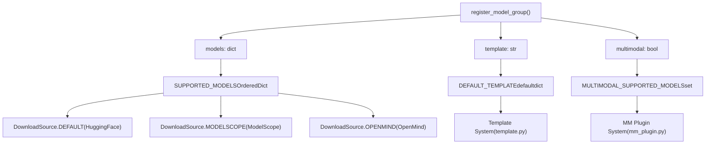
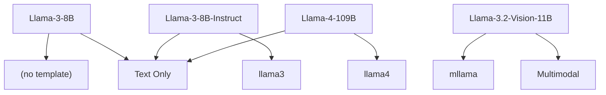
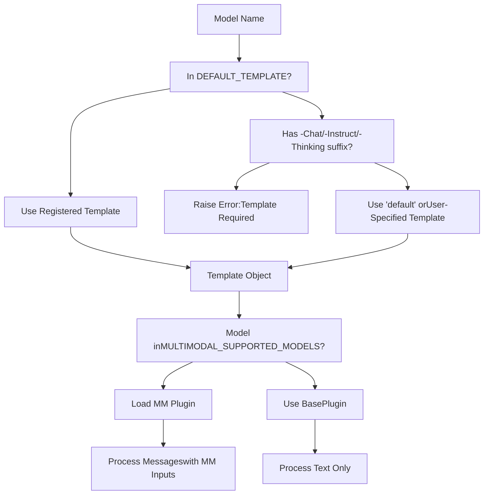
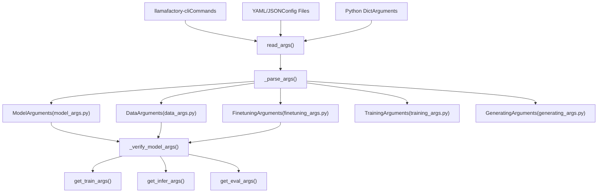
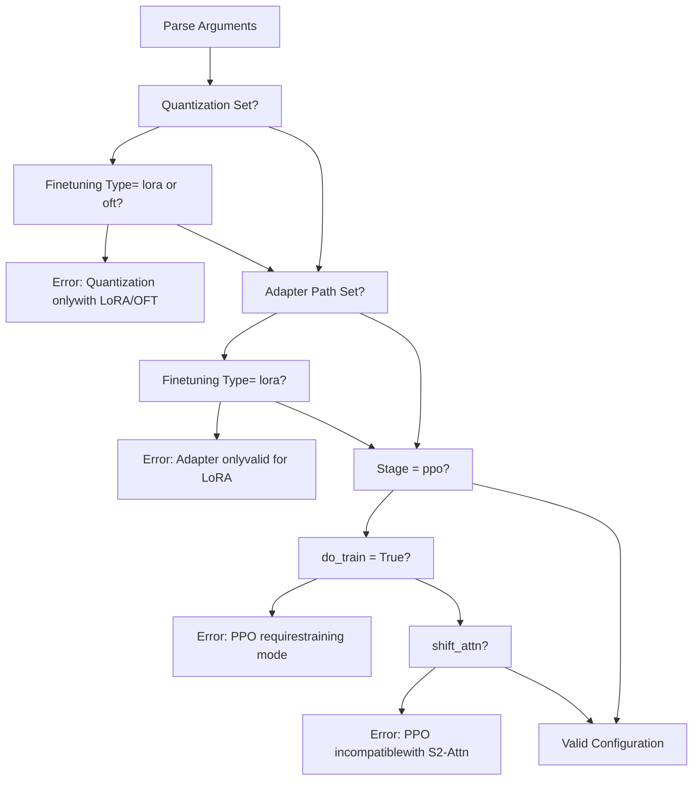
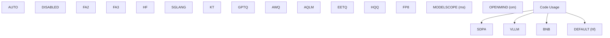
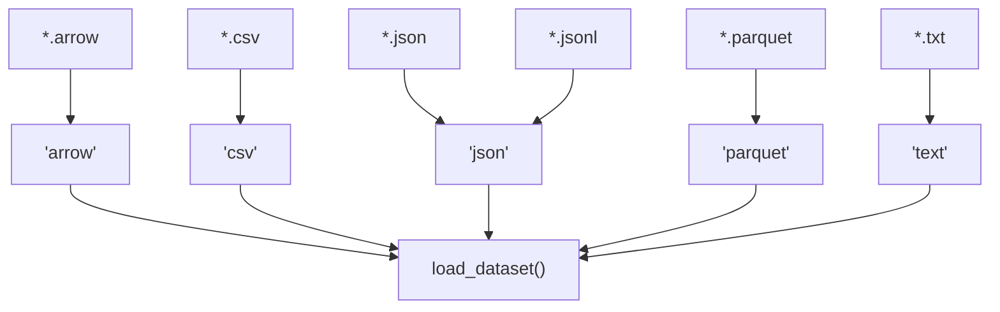
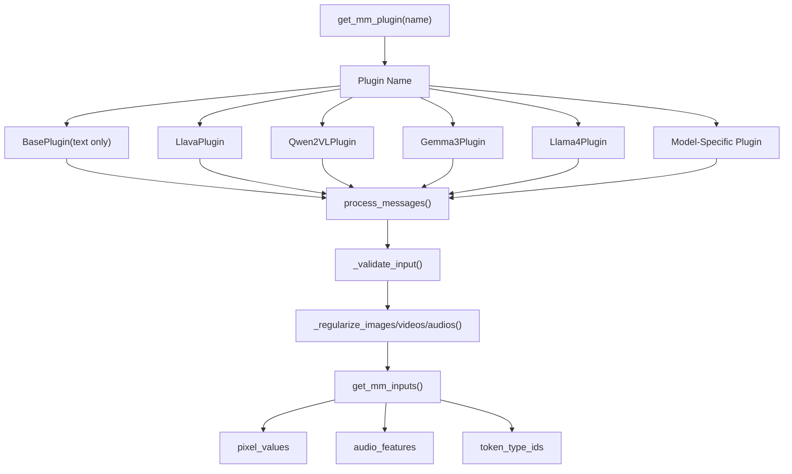
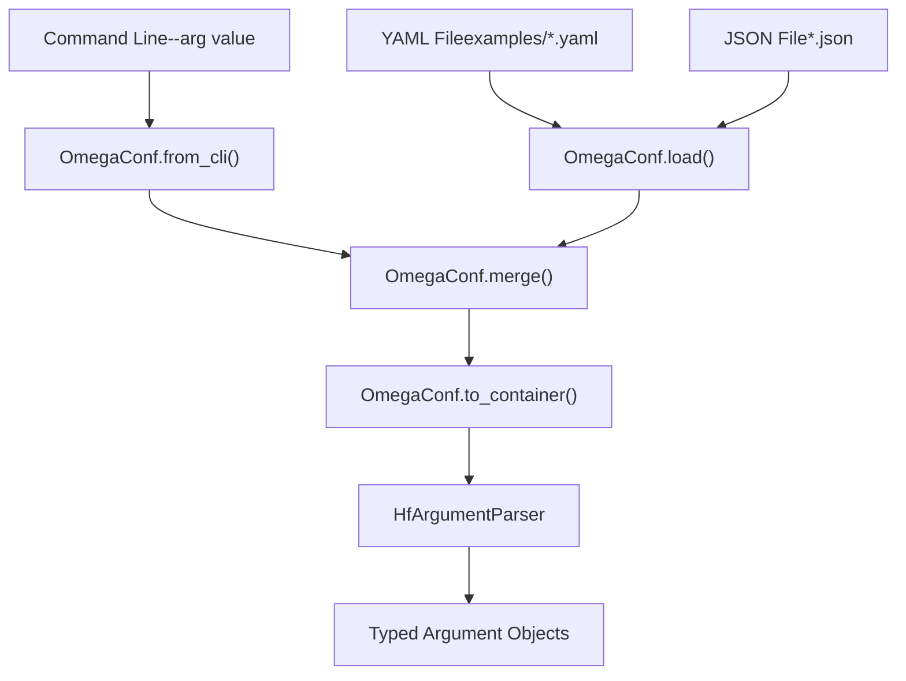
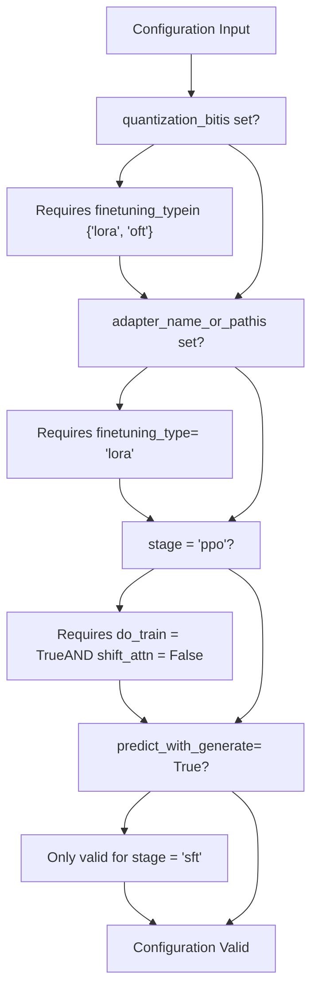

# 参考指南

相关源码文件

-   [README.md](https://github.com/hiyouga/LlamaFactory/blob/355d5c5e/README.md?plain=1)
-   [README\_zh.md](https://github.com/hiyouga/LlamaFactory/blob/355d5c5e/README_zh.md?plain=1)
-   [src/llamafactory/data/collator.py](https://github.com/hiyouga/LlamaFactory/blob/355d5c5e/src/llamafactory/data/collator.py)
-   [src/llamafactory/data/mm\_plugin.py](https://github.com/hiyouga/LlamaFactory/blob/355d5c5e/src/llamafactory/data/mm_plugin.py)
-   [src/llamafactory/data/template.py](https://github.com/hiyouga/LlamaFactory/blob/355d5c5e/src/llamafactory/data/template.py)
-   [src/llamafactory/extras/constants.py](https://github.com/hiyouga/LlamaFactory/blob/355d5c5e/src/llamafactory/extras/constants.py)
-   [src/llamafactory/hparams/parser.py](https://github.com/hiyouga/LlamaFactory/blob/355d5c5e/src/llamafactory/hparams/parser.py)
-   [src/llamafactory/model/model\_utils/misc.py](https://github.com/hiyouga/LlamaFactory/blob/355d5c5e/src/llamafactory/model/model_utils/misc.py)
-   [src/llamafactory/model/model\_utils/visual.py](https://github.com/hiyouga/LlamaFactory/blob/355d5c5e/src/llamafactory/model/model_utils/visual.py)
-   [tests/data/test\_mm\_plugin.py](https://github.com/hiyouga/LlamaFactory/blob/355d5c5e/tests/data/test_mm_plugin.py)
-   [tests/version.txt](https://github.com/hiyouga/LlamaFactory/blob/355d5c5e/tests/version.txt)

## 目的与范围

本章节为 LlamaFactory 支持的模型、数据集格式和配置参数提供快速查询参考。使用本指南可以：

-   查询受支持的模型及其对应的模板
-   理解数据集格式规范和 `dataset_info.json` 架构
-   查阅所有可用配置参数的类型、默认值和有效值

有关特定子系统的详细信息：

-   关于模型加载和配置详情，请参阅[模型加载与配置](/hiyouga/LlamaFactory/zh/5-model-loading-and-configuration)
-   关于数据流水线实现，请参阅[数据流水线](/hiyouga/LlamaFactory/zh/4-data-pipeline)
-   关于实际训练配置，请参阅[训练系统](/hiyouga/LlamaFactory/zh/6-training-system)

参考内容分为三个主要部分：

-   [受支持模型](/hiyouga/LlamaFactory/zh/10.1-supported-models)：100 多个受支持模型及其模板和能力的完整注册表
-   [数据集格式参考](/hiyouga/LlamaFactory/zh/10.2-dataset-format-reference)：数据集格式规范和 `dataset_info.json` 结构
-   [配置参数参考](/hiyouga/LlamaFactory/zh/10.3-configuration-parameter-reference)：所有参数类型的详尽列表

---

## 模型注册系统

LlamaFactory 为受支持的模型、模板和多模态能力维护了一个集中的注册系统。该系统使用 `constants.py` 中定义的字典和枚举，将模型名称映射到下载源、模板和特殊处理要求。

### 模型注册架构


**源码：** [src/llamafactory/extras/constants.py155-169](https://github.com/hiyouga/LlamaFactory/blob/355d5c5e/src/llamafactory/extras/constants.py#L155-L169)

`register_model_group()` 函数是注册新模型的入口。它填充了三个全局注册表：

| 注册表 | 类型 | 用途 |
| --- | --- | --- |
| `SUPPORTED_MODELS` | `OrderedDict[str, dict[DownloadSource, str]]` | 将模型名称映射到各平台的下载路径 |
| `DEFAULT_TEMPLATE` | `defaultdict[str, str]` | 将模型名称映射到其默认对话模板 |
| `MULTIMODAL_SUPPORTED_MODELS` | `set[str]` | 追踪哪些模型支持多模态输入 |

### 模型命名规范

注册表中的模型遵循指示其类型的命名模式：

-   基座模型：例如 `Llama-3-8B`, `Qwen2-7B`
-   对话/指令模型：以 `-Chat`, `-Instruct`, `-Thinking` 为后缀（自动分配模板）
-   蒸馏模型：以 `-Distill` 为后缀
-   多模态模型：包含视觉/音频能力（例如 `Qwen2-VL`, `LLaVA`）

**源码：** [src/llamafactory/extras/constants.py162-165](https://github.com/hiyouga/LlamaFactory/blob/355d5c5e/src/llamafactory/extras/constants.py#L162-L165)

### 模型注册示例


**源码：** [README.md277-333](https://github.com/hiyouga/LlamaFactory/blob/355d5c5e/README.md?plain=1#L277-L333) [src/llamafactory/extras/constants.py171-1690](https://github.com/hiyouga/LlamaFactory/blob/355d5c5e/src/llamafactory/extras/constants.py#L171-L1690)

---

## 模板与插件系统

模板定义了不同模型的对话格式，而插件处理多模态输入。这些系统协同工作，为训练和推理准备数据。

### 模板分配流程


**源码：** [src/llamafactory/data/template.py40-58](https://github.com/hiyouga/LlamaFactory/blob/355d5c5e/src/llamafactory/data/template.py#L40-L58) [src/llamafactory/data/mm\_plugin.py145-191](https://github.com/hiyouga/LlamaFactory/blob/355d5c5e/src/llamafactory/data/mm_plugin.py#L145-L191)

### 复合模型注册

对于多模态模型，系统使用 `CompositeModel` 数据类来定义组件结构：

| 字段 | 用途 | 示例 |
| --- | --- | --- |
| `model_type` | 模型架构标识符 | `"llava"`, `"qwen2_vl"` |
| `projector_key` | 多模态投影器路径 | `"multi_modal_projector"` |
| `vision_model_keys` | 视觉冻结组件 | `["vision_tower"]` |
| `language_model_keys` | 语言模型组件 | `["language_model", "lm_head"]` |
| `lora_conflict_keys` | 与 LoRA 不兼容的模块 | `["patch_embed"]` |

**源码：** [src/llamafactory/model/model\_utils/visual.py40-82](https://github.com/hiyouga/LlamaFactory/blob/355d5c5e/src/llamafactory/model/model_utils/visual.py#L40-L82)

---

## 配置参数类别

配置参数组织在五个类型的参数类中，每个类处理系统的一个特定方面。

### 参数类型层次结构


**源码：** [src/llamafactory/hparams/parser.py44-98](https://github.com/hiyouga/LlamaFactory/blob/355d5c5e/src/llamafactory/hparams/parser.py#L44-L98)

### 参数类别

| 类别 | 参数类 | 主要关注点 | 示例参数 |
| --- | --- | --- | --- |
| 模型选择 | `ModelArguments` | 模型、量化、适配器 | `model_name_or_path`, `quantization_bit`, `adapter_name_or_path` |
| 数据处理 | `DataArguments` | 数据集、模板、预处理 | `dataset`, `template`, `cutoff_len`, `packing` |
| 微调方法 | `FinetuningArguments` | LoRA/OFT/freeze 设置、阶段 | `finetuning_type`, `lora_rank`, `stage` |
| 训练配置 | `TrainingArguments` | 学习率、批次大小、分布式 | `learning_rate`, `per_device_train_batch_size`, `deepspeed` |
| 文本生成 | `GeneratingArguments` | 推理采样参数 | `temperature`, `top_p`, `max_new_tokens` |

**源码：** [src/llamafactory/hparams/parser.py49-54](https://github.com/hiyouga/LlamaFactory/blob/355d5c5e/src/llamafactory/hparams/parser.py#L49-L54)

### 跨参数校验

解析器对不同参数类型进行校验以确保兼容性：


**源码：** [src/llamafactory/hparams/parser.py117-143](https://github.com/hiyouga/LlamaFactory/blob/355d5c5e/src/llamafactory/hparams/parser.py#L117-L143) [src/llamafactory/hparams/parser.py256-289](https://github.com/hiyouga/LlamaFactory/blob/355d5c5e/src/llamafactory/hparams/parser.py#L256-L289)

---

## 常量与枚举

系统使用各种常量和枚举以保证类型安全和有效性验证。

### 关键常量

| 常量 | 类型 | 值 | 用途 |
| --- | --- | --- | --- |
| `IMAGE_PLACEHOLDER` | `str` | `"<image>"` | 提示词中的默认图像占位符 |
| `VIDEO_PLACEHOLDER` | `str` | `"<video>"` | 提示词中的默认视频占位符 |
| `AUDIO_PLACEHOLDER` | `str` | `"<audio>"` | 提示词中的默认音频占位符 |
| `IGNORE_INDEX` | `int` | `-100` | 损失掩码值 |
| `DATA_CONFIG` | `str` | `"dataset_info.json"` | 数据集注册文件名 |
| `LLAMABOARD_CONFIG` | `str` | `"llamaboard_config.yaml"` | Web UI 配置文件名 |

**源码：** [src/llamafactory/extras/constants.py24-56](https://github.com/hiyouga/LlamaFactory/blob/355d5c5e/src/llamafactory/extras/constants.py#L24-L56)

### 类型安全的枚举


**源码：** [src/llamafactory/extras/constants.py112-153](https://github.com/hiyouga/LlamaFactory/blob/355d5c5e/src/llamafactory/extras/constants.py#L112-L153)

### 训练阶段注册表

```python
TRAINING_STAGES = {
    "Supervised Fine-Tuning": "sft",
    "Reward Modeling": "rm",
    "PPO": "ppo",
    "DPO": "dpo",
    "KTO": "kto",
    "Pre-Training": "pt",
}
STAGES_USE_PAIR_DATA = {"rm", "dpo"}
```
这些常量将面向用户的阶段名称映射到内部标识符，并指定哪些阶段需要成对的偏好数据。

**源码：** [src/llamafactory/extras/constants.py90-99](https://github.com/hiyouga/LlamaFactory/blob/355d5c5e/src/llamafactory/extras/constants.py#L90-L99)

---

## 数据集格式系统

数据集在 `dataset_info.json` 文件中注册，该文件指定了如何加载和处理每个数据集。该格式支持多种文件类型和列映射。

### 文件类型支持


**源码：** [src/llamafactory/extras/constants.py41-48](https://github.com/hiyouga/LlamaFactory/blob/355d5c5e/src/llamafactory/extras/constants.py#L41-L48)

### 数据集格式类别

LlamaFactory 支持两种主要的对话格式：

| 格式 | 结构 | 使用场景 | 列要求 |
| --- | --- | --- | --- |
| **Alpaca** | 单次指令-响应对 | 简单问答、补全 | `instruction`, `output`, 可选 `input`, `history` |
| **ShareGPT** | 多轮对话列表 | 聊天、对话 | 包含 `from` 和 `value` 字段的 `conversations` |

有关完整规范，请参阅[数据集格式参考](/hiyouga/LlamaFactory/zh/10.2-dataset-format-reference)。

**源码：** [README.md388-463](https://github.com/hiyouga/LlamaFactory/blob/355d5c5e/README.md?plain=1#L388-L463)

---

## 多模态处理流水线

多模态模型需要对图像、视频和音频进行特殊处理。`mm_plugin.py` 模块为不同架构定义了插件系统。

### 插件注册与使用


**源码：** [src/llamafactory/data/mm\_plugin.py145-191](https://github.com/hiyouga/LlamaFactory/blob/355d5c5e/src/llamafactory/data/mm_plugin.py#L145-191) [src/llamafactory/data/mm\_plugin.py325-385](https://github.com/hiyouga/LlamaFactory/blob/355d5c5e/src/llamafactory/data/mm_plugin.py#L325-L385)

### 插件方法职责

每个插件实现了三个关键方法：

| 方法 | 输入 | 输出 | 用途 |
| --- | --- | --- | --- |
| `process_messages()` | 带有占位符的原始消息 | 格式化后的消息 | 将 `<image>`, `<video>`, `<audio>` 替换为模型特定的标记 |
| `process_token_ids()` | 标记 ID 和标签 | 修改后的标记 ID 和标签 | 在正确位置插入特殊标记（例如图像标记） |
| `get_mm_inputs()` | 原始媒体文件 | 处理器输出 | 调用图像/视频/音频处理器并返回张量 |

**源码：** [src/llamafactory/data/mm\_plugin.py192-220](https://github.com/hiyouga/LlamaFactory/blob/355d5c5e/src/llamafactory/data/mm_plugin.py#L192-L220) [src/llamafactory/data/mm\_plugin.py325-385](https://github.com/hiyouga/LlamaFactory/blob/355d5c5e/src/llamafactory/data/mm_plugin.py#L325-L385)

---

## 配置文件结构

配置可以通过 YAML、JSON 或命令行参数提供。所有三种格式都解析为相同的类型化参数类。

### 配置来源


**源码：** [src/llamafactory/hparams/parser.py68-82](https://github.com/hiyouga/LlamaFactory/blob/355d5c5e/src/llamafactory/hparams/parser.py#L68-L82)

### 配置文件示例

```yaml
# 模型选择
model_name_or_path: meta-llama/Llama-3-8B-Instruct
template: llama3

# 数据处理
dataset: alpaca_en
cutoff_len: 2048
packing: true

# 微调方法
finetuning_type: lora
lora_rank: 16
lora_target: all

# 训练配置
stage: sft
learning_rate: 5e-5
num_train_epochs: 3
per_device_train_batch_size: 2

# 文本生成（用于评估）
temperature: 0.7
top_p: 0.9
max_new_tokens: 512
```
**源码：** [examples/ 目录](https://github.com/hiyouga/LlamaFactory/blob/355d5c5e/examples/)

---

## 校验规则

系统对不同参数之间强制执行兼容性规则，以防止无效配置。

### 关键校验规则


| 约束 | 原理 |
| --- | --- |
| 量化需要 LoRA/OFT | 量化后的模型无法进行全参数微调 |
| PPO 需要训练模式 | PPO 不支持评估模式 |
| PPO 与 S²-Attn 不兼容 | 技术限制 |
| `predict_with_generate` 仅限 SFT | 其他阶段不支持生成式预测 |

**源码：** [src/llamafactory/hparams/parser.py117-143](https://github.com/hiyouga/LlamaFactory/blob/355d5c5e/src/llamafactory/hparams/parser.py#L117-L143) [src/llamafactory/hparams/parser.py256-289](https://github.com/hiyouga/LlamaFactory/blob/355d5c5e/src/llamafactory/hparams/parser.py#L256-L289)

---

## 快速参考表

### 受支持模型类别

| 类别 | 数量 | 示例模型 | 默认模板 |
| --- | --- | --- | --- |
| 基座 LLM | 30+ | Llama-3, Qwen2, Mistral | `default`, 用户指定 |
| 对话/指令 | 70+ | Llama-3-Instruct, Qwen2-Chat | 注册表自动分配 |
| 多模态 VLM | 20+ | LLaVA, Qwen2-VL, Gemma3 | 专用模板 |
| 代码模型 | 10+ | DeepSeek-Coder, CodeGemma | 模型特定 |
| MoE 模型 | 8+ | Mixtral, DeepSeek-MoE | 特殊处理 |

请参阅[受支持模型](/hiyouga/LlamaFactory/zh/10.1-supported-models)获取完整列表。

### 配置参数组

| 组别 | 数量 | 关键参数 |
| --- | --- | --- |
| 模型参数 (Model Args) | 30+ | `model_name_or_path`, `quantization_bit`, `adapter_name_or_path`, `attention_implementation` |
| 数据参数 (Data Args) | 25+ | `dataset`, `template`, `cutoff_len`, `packing`, `train_on_prompt` |
| 微调参数 (Finetuning Args) | 40+ | `finetuning_type`, `lora_rank`, `lora_target`, `stage`, `use_galore` |
| 训练参数 (Training Args) | 100+ | `learning_rate`, `batch_size`, `num_train_epochs`, `deepspeed`, `fsdp` |
| 生成参数 (Generating Args) | 15+ | `temperature`, `top_p`, `top_k`, `max_new_tokens`, `repetition_penalty` |

请参阅[配置参数参考](/hiyouga/LlamaFactory/zh/10.3-configuration-parameter-reference)获取详尽列表。

### 推理后端选项

| 后端 | 枚举值 | 使用场景 | 速度 | 显存 |
| --- | --- | --- | --- | --- |
| HuggingFace | `EngineName.HF` | 开发、完整功能 | 基准 | 基准 |
| vLLM | `EngineName.VLLM` | 生产、高吞吐量 | 270%+ | 已优化 |
| SGLang | `EngineName.SGLANG` | HTTP 服务部署 | 高 | 已优化 |
| KTransformers | `EngineName.KT` | CPU-GPU 混合推理 | 变化 | CPU 卸载 |

**源码：** [src/llamafactory/extras/constants.py120-125](https://github.com/hiyouga/LlamaFactory/blob/355d5c5e/src/llamafactory/extras/constants.py#L120-L125) [README.md102](https://github.com/hiyouga/LlamaFactory/blob/355d5c5e/README.md?plain=1#L102-L102)

---

## 导航

获取详细参考资料：

-   **[受支持模型](/hiyouga/LlamaFactory/zh/10.1-supported-models)**：包含模板、能力和下载源的 100 多个模型的完整列表
-   **[数据集格式参考](/hiyouga/LlamaFactory/zh/10.2-dataset-format-reference)**：`dataset_info.json` 和列映射格式规范
-   **[配置参数参考](/hiyouga/LlamaFactory/zh/10.3-configuration-parameter-reference)**：所有参数及其类型和默认值的详尽列表

获取实现详情：

-   模型加载：[模型加载与配置](/hiyouga/LlamaFactory/zh/5-model-loading-and-configuration)
-   数据处理：[数据流水线](/hiyouga/LlamaFactory/zh/4-data-pipeline)
-   训练配置：[训练系统](/hiyouga/LlamaFactory/zh/6-training-system)
-   推理：[推理与部署](/hiyouga/LlamaFactory/zh/7-inference-and-deployment)

**源码：** [README.md1-91](https://github.com/hiyouga/LlamaFactory/blob/355d5c5e/README.md?plain=1#L1-L91) [src/llamafactory/extras/constants.py1-1690](https://github.com/hiyouga/LlamaFactory/blob/355d5c5e/src/llamafactory/extras/constants.py#L1-L1690) [src/llamafactory/hparams/parser.py1-442](https://github.com/hiyouga/LlamaFactory/blob/355d5c5e/src/llamafactory/hparams/parser.py#L1-L442) [src/llamafactory/data/template.py1-400](https://github.com/hiyouga/LlamaFactory/blob/355d5c5e/src/llamafactory/data/template.py#L1-L400) [src/llamafactory/data/mm\_plugin.py1-900](https://github.com/hiyouga/LlamaFactory/blob/355d5c5e/src/llamafactory/data/mm_plugin.py#L1-L900)
