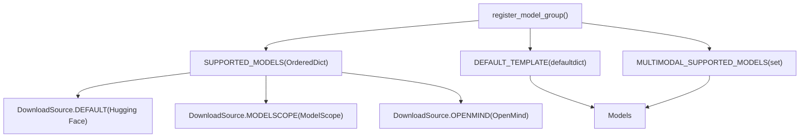
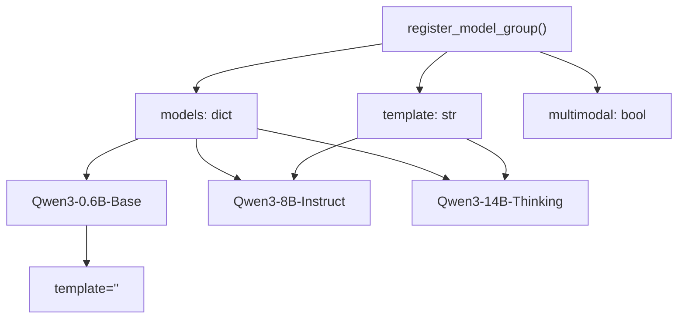
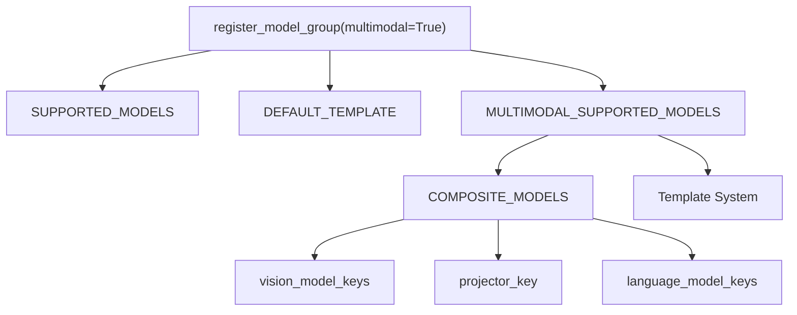
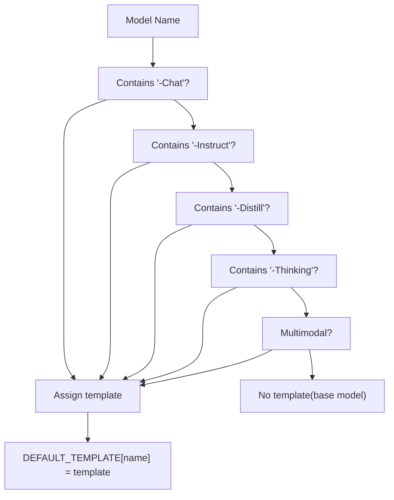

# 受支持模型

相关源码文件

-   [README.md](https://github.com/hiyouga/LlamaFactory/blob/355d5c5e/README.md?plain=1)
-   [README\_zh.md](https://github.com/hiyouga/LlamaFactory/blob/355d5c5e/README_zh.md?plain=1)
-   [src/llamafactory/data/collator.py](https://github.com/hiyouga/LlamaFactory/blob/355d5c5e/src/llamafactory/data/collator.py)
-   [src/llamafactory/data/mm\_plugin.py](https://github.com/hiyouga/LlamaFactory/blob/355d5c5e/src/llamafactory/data/mm_plugin.py)
-   [src/llamafactory/data/template.py](https://github.com/hiyouga/LlamaFactory/blob/355d5c5e/src/llamafactory/data/template.py)
-   [src/llamafactory/extras/constants.py](https://github.com/hiyouga/LlamaFactory/blob/355d5c5e/src/llamafactory/extras/constants.py)
-   [src/llamafactory/hparams/parser.py](https://github.com/hiyouga/LlamaFactory/blob/355d5c5e/src/llamafactory/hparams/parser.py)
-   [src/llamafactory/model/model\_utils/misc.py](https://github.com/hiyouga/LlamaFactory/blob/355d5c5e/src/llamafactory/model/model_utils/misc.py)
-   [src/llamafactory/model/model\_utils/visual.py](https://github.com/hiyouga/LlamaFactory/blob/355d5c5e/src/llamafactory/model/model_utils/visual.py)
-   [tests/data/test\_mm\_plugin.py](https://github.com/hiyouga/LlamaFactory/blob/355d5c5e/tests/data/test_mm_plugin.py)
-   [tests/version.txt](https://github.com/hiyouga/LlamaFactory/blob/355d5c5e/tests/version.txt)

本页面提供 LlamaFactory 支持的所有模型的全面参考。它记录了模型注册系统、模型能力、默认模板，以及模型在代码库中是如何组织和配置的。

有关对话模板和格式的信息，请参阅[数据集格式与模板](/hiyouga/LlamaFactory/zh/4.2-dataset-formats-and-templates)。有关模型加载和配置的详情，请参阅[模型加载流水线](/hiyouga/LlamaFactory/zh/5.1-model-loading-pipeline)。

---

## 模型注册系统

LlamaFactory 维护了一个集中的模型注册表，将模型名称映射到下载源，并为指令微调模型分配默认模板。该注册系统按家族组织模型。

### 核心注册组件

模型注册表由 [src/llamafactory/extras/constants.py84-169](https://github.com/hiyouga/LlamaFactory/blob/355d5c5e/src/llamafactory/extras/constants.py#L84-L169) 中定义的三个主要数据结构组成：


**图表：模型注册架构**

`register_model_group()` 函数是向注册表添加模型的入口：

-   **`SUPPORTED_MODELS`**：将模型名称映射到各平台（Hugging Face, ModelScope, OpenMind）的下载路径
-   **`DEFAULT_TEMPLATE`**：自动为名称以 `-Chat`, `-Instruct`, `-Thinking` 结尾的模型或多模态模型分配模板
-   **`MULTIMODAL_SUPPORTED_MODELS`**：追踪哪些模型支持图像/视频/音频输入

**源码：** [src/llamafactory/extras/constants.py84-169](https://github.com/hiyouga/LlamaFactory/blob/355d5c5e/src/llamafactory/extras/constants.py#L84-L169)

---

## 模型组织

### 注册模式

模型使用一致的模式按家族组进行注册。以下是 Qwen3 家族的示例：


**图表：模型家族注册示例**

注册逻辑选择性地应用模板：

-   **基座模型**：不分配默认模板（使用 `default`, `alpaca`, `vicuna` 等）
-   **指令/对话模型**：自动分配家族模板（`qwen3`, `llama3` 等）
-   **推理模型**：具有 reasoning 能力的特殊后缀模型
-   **多模态模型**：标记为 `multimodal=True` 以启用视觉/音频处理

**源码：** [src/llamafactory/extras/constants.py155-169](https://github.com/hiyouga/LlamaFactory/blob/355d5c5e/src/llamafactory/extras/constants.py#L155-L169)

---

## 下载源

注册表中的每个模型都可以从多个平台访问。系统支持三个下载源：

| 来源 | 枚举值 | 典型平台 |
| --- | --- | --- |
| **默认** | `DownloadSource.DEFAULT` | Hugging Face Hub |
| **ModelScope** | `DownloadSource.MODELSCOPE` | 魔搭社区 (Alibaba) |
| **OpenMind** | `DownloadSource.OPENMIND` | OpenMind Hub |

模型为每个可用源指定路径：

```python
# 摘自 constants.py 的示例
"Qwen3-8B-Instruct": {
    DownloadSource.DEFAULT: "Qwen/Qwen3-8B-Instruct",
    DownloadSource.MODELSCOPE: "Qwen/Qwen3-8B-Instruct",
}
```
用户可以通过 `ModelArguments` 中的 `download_source` 参数选择下载源。模型加载器会自动从相应的平台获取模型。

**源码：** [src/llamafactory/extras/constants.py127-131](https://github.com/hiyouga/LlamaFactory/blob/355d5c5e/src/llamafactory/extras/constants.py#L127-L131)

---

## 完整模型列表

LlamaFactory 支持 **100 多个语言模型**，涵盖多个模型家族和参数规模。模型按家族分类，包含规模变体和专用版本。

### 模型家族与模板

下表列出了主要模型家族及其参数范围和分配的模板：

| 模型家族 | 参数规模 | 模板 | 多模态 |
| --- | --- | --- | --- |
| **BLOOM/BLOOMZ** | 560M, 1.1B, 1.7B, 3B, 7.1B, 176B | `-` | 否 |
| **Command R** | 35B, 104B | `cohere` | 否 |
| **DeepSeek (LLM/Code/MoE)** | 7B, 16B, 67B, 236B | `deepseek` | 否 |
| **DeepSeek 3-3.2** | 236B, 671B | `deepseek3` | 否 |
| **DeepSeek R1 (Distill)** | 1.5B, 7B, 8B, 14B, 32B, 70B, 671B | `deepseekr1` | 否 |
| **ERNIE-4.5** | 0.3B, 21B, 300B | `ernie`, `ernie_nothink` | 否 |
| **Falcon/Falcon H1** | 0.5B, 1.5B, 3B, 7B, 11B, 34B, 40B, 180B | `falcon`, `falcon_h1` | 否 |
| **Gemma/Gemma 2/CodeGemma** | 2B, 7B, 9B, 27B | `gemma`, `gemma2` | 否 |
| **Gemma 3/Gemma 3n** | 270M, 1B, 4B, 6B, 8B, 12B, 27B | `gemma3`, `gemma3n` | 是 (3n) |
| **GLM-4/GLM-Z1** | 9B, 32B | `glm4`, `glmz1` | 否 |
| **GLM-4.5/GLM-4.5V** | 9B, 106B, 355B | `glm4_moe`, `glm4_5v` | 是 (4.5V) |
| **GPT-2** | 0.1B, 0.4B, 0.8B, 1.5B | `-` | 否 |
| **GPT-OSS** | 20B, 120B | `gpt_oss` | 否 |
| **Granite 3-4** | 1B, 2B, 3B, 7B, 8B | `granite3`, `granite4` | 否 |
| **InternLM 2-3** | 7B, 8B, 20B | `intern2` | 否 |
| **InternVL 2.5-3.5** | 1B, 2B, 4B, 8B, 14B, 30B, 38B, 78B, 241B | `intern_vl` | 是 |
| **Intern-S1-mini** | 8B | `intern_s1` | 否 |
| **Kimi-VL** | 16B | `kimi_vl` | 是 |
| **Llama** | 7B, 13B, 33B, 65B | `-` | 否 |
| **Llama 2** | 7B, 13B, 70B | `llama2` | 否 |
| **Llama 3-3.3** | 1B, 3B, 8B, 70B | `llama3` | 否 |
| **Llama 4** | 109B, 402B | `llama4` | 是 |
| **Llama 3.2 Vision** | 11B, 90B | `mllama` | 是 |
| **LLaVA-1.5** | 7B, 13B | `llava` | 是 |
| **LLaVA-NeXT** | 7B, 8B, 13B, 34B, 72B, 110B | `llava_next` | 是 |
| **LLaVA-NeXT-Video** | 7B, 34B | `llava_next_video` | 是 |
| **MiniCPM 1-4.1** | 0.5B, 1B, 2B, 4B, 8B | `cpm`, `cpm3`, `cpm4` | 否 |
| **MiniCPM-o-2.6/V-2.6** | 8B | `minicpm_o`, `minicpm_v` | 是 |
| **MiniMax-M1/M2** | 229B, 456B | `minimax1`, `minimax2` | 否 |
| **Mistral/Mixtral** | 7B, 8x7B, 8x22B | `mistral` | 否 |
| **Phi-3/Phi-3.5** | 4B, 14B | `phi` | 否 |
| **Phi-4** | 14B | `phi4` | 否 |
| **Pixtral** | 12B | `pixtral` | 是 |
| **Qwen (1-2.5)** | 0.5B, 1.5B, 3B, 7B, 14B, 32B, 72B, 110B | `qwen` | 否 |
| **Qwen3** | 0.6B, 1.7B, 4B, 8B, 14B, 32B, 80B, 235B | `qwen3`, `qwen3_nothink` | 否 |
| **Qwen2-Audio** | 7B | `qwen2_audio` | 是 (音频) |
| **Qwen2.5-Omni** | 3B, 7B | `qwen2_omni` | 是 (音频) |
| **Qwen3-Omni** | 30B | `qwen3_omni` | 是 (音频) |
| **Qwen2-VL/Qwen2.5-VL** | 2B, 3B, 7B, 32B, 72B | `qwen2_vl` | 是 |
| **Qwen3-VL** | 2B, 4B, 8B, 30B, 32B, 235B | `qwen3_vl` | 是 |
| **Yi/Yi-1.5** | 1.5B, 6B, 9B, 34B | `yi` | 否 |

> **注意：** 对于未分配模板的基座模型，请根据具体用例使用 `template: default`、`template: alpaca` 或 `template: vicuna`。对于指令/对话模型，请务必使用表中所示的对应模板。

**源码：** [README.md277-333](https://github.com/hiyouga/LlamaFactory/blob/355d5c5e/README.md?plain=1#L277-L333) [src/llamafactory/extras/constants.py171](https://github.com/hiyouga/LlamaFactory/blob/355d5c5e/src/llamafactory/extras/constants.py#L171-LNaN)

---

## 多模态模型支持

### 多模态模型注册

具有视觉、视频或音频能力的模型在 `MULTIMODAL_SUPPORTED_MODELS` 集合中独立追踪。当模型以 `multimodal=True` 注册时，它会自动添加到此集合。


**图表：多模态模型注册与配置**

### 复合模型配置

多模态模型需要额外配置以识别其组件模块。这由 [src/llamafactory/model/model\_utils/visual.py55-81](https://github.com/hiyouga/LlamaFactory/blob/355d5c5e/src/llamafactory/model/model_utils/visual.py#L55-L81) 中的 `COMPOSITE_MODELS` 注册表处理：

```python
@dataclass
class CompositeModel:
    model_type: str
    projector_key: str                # 例如 "multi_modal_projector"
    vision_model_keys: list[str]      # 例如 ["vision_tower"]
    language_model_keys: list[str]    # 例如 ["language_model", "lm_head"]
    lora_conflict_keys: list[str]     # LoRA 中不兼容的模块
```
该配置支持：

-   在微调期间**冻结视觉组件** (`freeze_vision_tower`)
-   **选择性应用 LoRA**（排除视觉模块）
-   混合模态训练中**正确的梯度流动**

### 多模态模型示例

| 模型类型 | 图像 | 视频 | 音频 | 模板 |
| --- | --- | --- | --- | --- |
| **LLaVA-1.5** | ✓ | ✗ | ✗ | `llava` |
| **LLaVA-NeXT-Video** | ✓ | ✓ | ✗ | `llava_next_video` |
| **Qwen2-VL** | ✓ | ✓ | ✗ | `qwen2_vl` |
| **Qwen2-Audio** | ✗ | ✗ | ✓ | `qwen2_audio` |
| **Qwen2.5-Omni** | ✓ | ✗ | ✓ | `qwen2_omni` |
| **MiniCPM-o-2.6** | ✓ | ✓ | ✓ | `minicpm_o` |
| **Llama 4** | ✓ | ✗ | ✗ | `llama4` |
| **Gemma 3n** | ✓ | ✗ | ✓ | `gemma3n` |

**源码：** [src/llamafactory/extras/constants.py76-77](https://github.com/hiyouga/LlamaFactory/blob/355d5c5e/src/llamafactory/extras/constants.py#L76-L77) [src/llamafactory/model/model\_utils/visual.py55-332](https://github.com/hiyouga/LlamaFactory/blob/355d5c5e/src/llamafactory/model/model_utils/visual.py#L55-L332)

---

## 模板分配逻辑

### 自动模板选择

`register_model_group()` 函数基于命名约定自动分配模板：


**图表：模板分配决策树**

该逻辑在 [src/llamafactory/extras/constants.py155-169](https://github.com/hiyouga/LlamaFactory/blob/355d5c5e/src/llamafactory/extras/constants.py#L155-L169) 中实现：

```python
def register_model_group(
    models: dict[str, dict[DownloadSource, str]],
    template: str | None = None,
    multimodal: bool = False,
) -> None:
    for name, path in models.items():
        SUPPORTED_MODELS[name] = path
        if template is not None and (
            any(suffix in name for suffix in ("-Chat", "-Distill", "-Instruct", "-Thinking")) or multimodal
        ):
            DEFAULT_TEMPLATE[name] = template
```
### 特殊模型的模板后缀

部分模型家族使用模板后缀来区分推理版本和非推理版本：

| 模型家族 | 标准模板 | 推理 (Thinking) 模板 | 用法 |
| --- | --- | --- | --- |
| **Qwen3** | `qwen3` | `qwen3_nothink` | 区分推理/非推理模式 |
| **ERNIE-4.5** | `ernie` | `ernie_nothink` | 区分思考/预训练模型 |
| **DeepSeek R1** | `deepseekr1` | 不适用 | 所有变体使用相同的推理模板 |

> **重要：** 训练和推理时必须使用相同的模板。模板不匹配会导致分词错误和模型性能下降。

**源码：** [README.md335-343](https://github.com/hiyouga/LlamaFactory/blob/355d5c5e/README.md?plain=1#L335-L343) [src/llamafactory/extras/constants.py155-169](https://github.com/hiyouga/LlamaFactory/blob/355d5c5e/src/llamafactory/extras/constants.py#L155-L169)

---

## 模型查找与使用

### 获取模型信息

模型注册表提供对模型元数据的程序化访问：

```python
from llamafactory.extras.constants import SUPPORTED_MODELS, DEFAULT_TEMPLATE, MULTIMODAL_SUPPORTED_MODELS

# 检查模型是否受支持
model_name = "Qwen3-8B-Instruct"
if model_name in SUPPORTED_MODELS:
    paths = SUPPORTED_MODELS[model_name]
    hf_path = paths[DownloadSource.DEFAULT]
    # 获取默认模板
    template = DEFAULT_TEMPLATE[model_name]  # 返回 "qwen3"

# 检查是否为多模态
is_multimodal = model_name in MULTIMODAL_SUPPORTED_MODELS
```
### 训练中的模型选择

配置训练时，指定模型名称，并可选择性覆盖模板：

```yaml
# training_config.yaml
model_name_or_path: Qwen/Qwen3-8B-Instruct
template: qwen3  # 可选：省略则使用 DEFAULT_TEMPLATE
```
模型加载器会自动：

1.  在 `SUPPORTED_MODELS` 中查找模型
2.  根据 `download_source` 参数选择下载源
3.  如果未指定，则应用默认模板
4.  如果模型在 `MULTIMODAL_SUPPORTED_MODELS` 中，则配置多模态插件

**源码：** [src/llamafactory/extras/constants.py84-169](https://github.com/hiyouga/LlamaFactory/blob/355d5c5e/src/llamafactory/extras/constants.py#L84-L169) [src/llamafactory/hparams/parser.py117-144](https://github.com/hiyouga/LlamaFactory/blob/355d5c5e/src/llamafactory/hparams/parser.py#L117-L144)

---

## 添加自定义模型

### 扩展注册表

要添加新的模型家族，在 [src/llamafactory/extras/constants.py](https://github.com/hiyouga/LlamaFactory/blob/355d5c5e/src/llamafactory/extras/constants.py) 中使用 `register_model_group()` 注册：

```python
register_model_group(
    models={
        "YourModel-7B-Base": {
            DownloadSource.DEFAULT: "org/model-7b-base",
            DownloadSource.MODELSCOPE: "org/model-7b-base",
        },
        "YourModel-7B-Instruct": {
            DownloadSource.DEFAULT: "org/model-7b-instruct",
        },
    },
    template="yourmodel",  # 必须与 template.py 中的模板名称匹配
    multimodal=False,      # VLM 请设置为 True
)
```
### 模板创建

如果模型需要自定义对话格式，在 [src/llamafactory/data/template.py](https://github.com/hiyouga/LlamaFactory/blob/355d5c5e/src/llamafactory/data/template.py) 中添加模板定义：

1.  定义用户/助手/系统消息的格式化函数
2.  使用唯一名称注册模板
3.  在 `register_model_group()` 中使用该名称

对于多模态模型，还需在 [src/llamafactory/model/model\_utils/visual.py](https://github.com/hiyouga/LlamaFactory/blob/355d5c5e/src/llamafactory/model/model_utils/visual.py) 中注册：

```python
_register_composite_model(
    model_type="yourmodel",
    projector_key="multi_modal_projector",
    vision_model_keys=["vision_tower"],
    language_model_keys=["language_model", "lm_head"],
)
```
**源码：** [src/llamafactory/extras/constants.py155-169](https://github.com/hiyouga/LlamaFactory/blob/355d5c5e/src/llamafactory/extras/constants.py#L155-L169) [src/llamafactory/data/template.py334](https://github.com/hiyouga/LlamaFactory/blob/355d5c5e/src/llamafactory/data/template.py#L334-LNaN) [src/llamafactory/model/model\_utils/visual.py55-332](https://github.com/hiyouga/LlamaFactory/blob/355d5c5e/src/llamafactory/model/model_utils/visual.py#L55-L332)

---

## 特殊模型配置

### 混合专家 (MoE) 模型

DeepSeek-V2/V3 和 Mixtral 等 MoE 模型需要特殊处理。支持的 MoE 模型在 [src/llamafactory/extras/constants.py58-70](https://github.com/hiyouga/LlamaFactory/blob/355d5c5e/src/llamafactory/extras/constants.py#L58-L70) 中追踪：

```python
MCA_SUPPORTED_MODELS = {
    "deepseek_v3",
    "mixtral",
    "qwen2",
    "qwen2_vl",
    # ... 其他 MoE 架构
}
```
对于 MoE 模型，建议使用 DeepSpeed Zero3 以在有限显存下实现高效训练。

### 量化兼容性

当加载方式不同于标准流程时，量化模型变体（4-bit, 8-bit）会在注册表中独立列出：

-   **4-bit 模型**：通常使用 GPTQ 或 AWQ 量化
-   **8-bit 模型**：通常使用 LLM.int8 或 HQQ
-   **示例**：`CommandR-35B-4bit-Chat` 提供预量化检查点

也可以在加载时通过 `quantization_bit` 参数应用量化（见[量化与精度](/hiyouga/LlamaFactory/zh/5.3-quantization-and-precision)）。

**源码：** [src/llamafactory/extras/constants.py58-75](https://github.com/hiyouga/LlamaFactory/blob/355d5c5e/src/llamafactory/extras/constants.py#L58-L75) [README.md242-244](https://github.com/hiyouga/LlamaFactory/blob/355d5c5e/README.md?plain=1#L242-L244)

---

## 模型验证

### 测试模型支持

使用提供的测试套件验证模型配置：

```bash
# 测试特定模型的多模态插件
pytest tests/data/test_mm_plugin.py::test_llava_plugin

# 运行所有模型插件测试
pytest tests/data/test_mm_plugin.py
```
测试套件验证：

-   带占位符（`<image>`, `<video>`, `<audio>`）的消息处理
-   标记 ID 生成和标签对齐
-   多模态输入处理
-   模板展开的正确性

**源码：** [tests/data/test\_mm\_plugin.py1](https://github.com/hiyouga/LlamaFactory/blob/355d5c5e/tests/data/test_mm_plugin.py#L1-LNaN)

---

## 总结

LlamaFactory 的模型注册表提供：

-   涵盖 30 多个模型家族的 **100 多个受支持模型**
-   为指令微调模型**自动分配模板**
-   **多平台支持**（Hugging Face, ModelScope, OpenMind）
-   针对 20 多个视觉/音频模型的**多模态能力**
-   用于添加自定义模型的**可扩展架构**

`constants.py` 中的集中式注册表确保了模型在训练、推理和评估工作流中的一致处理。所有模型均经过测试和验证，以确保与框架的训练方法和优化技术兼容。

接下来的步骤：请参阅[数据集格式与模板](/hiyouga/LlamaFactory/zh/4.2-dataset-formats-and-templates)了解对话格式，或参阅[模型加载流水线](/hiyouga/LlamaFactory/zh/5.1-model-loading-pipeline)了解模型加载和配置的细节。

**源码：** [src/llamafactory/extras/constants.py84](https://github.com/hiyouga/LlamaFactory/blob/355d5c5e/src/llamafactory/extras/constants.py#L84-LNaN) [README.md277-348](https://github.com/hiyouga/LlamaFactory/blob/355d5c5e/README.md?plain=1#L277-L348) [src/llamafactory/model/model\_utils/visual.py55-332](https://github.com/hiyouga/LlamaFactory/blob/355d5c5e/src/llamafactory/model/model_utils/visual.py#L55-L332)
