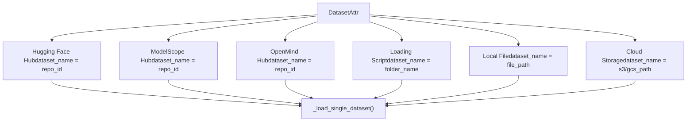
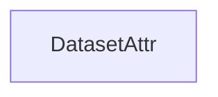
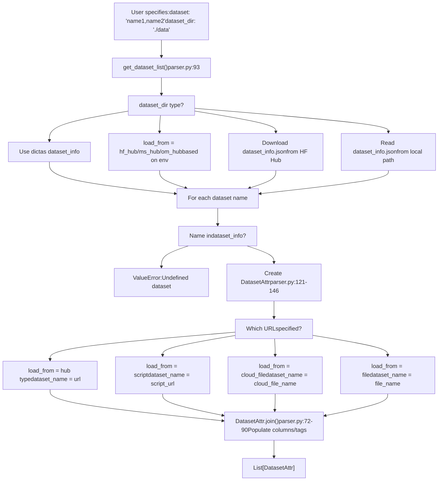
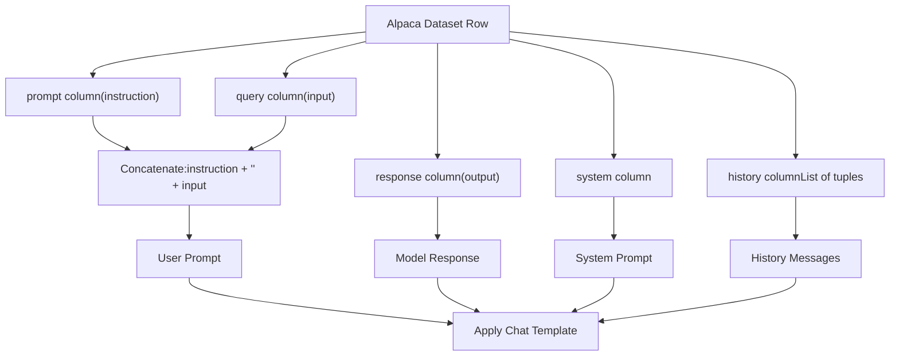
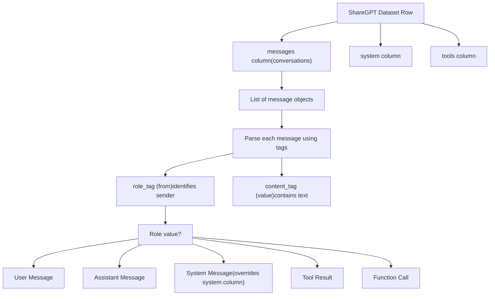
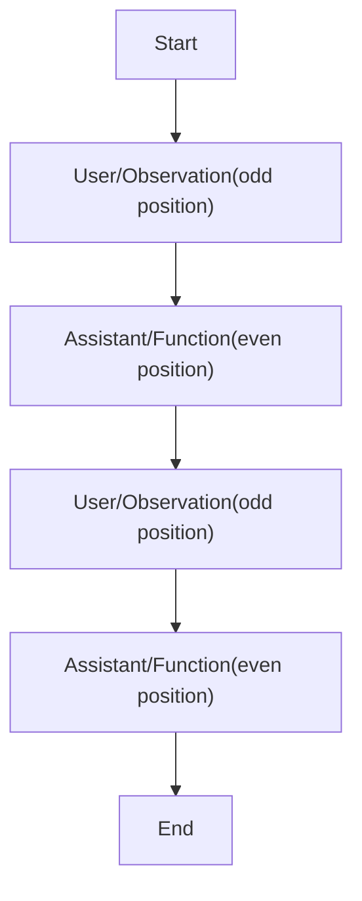
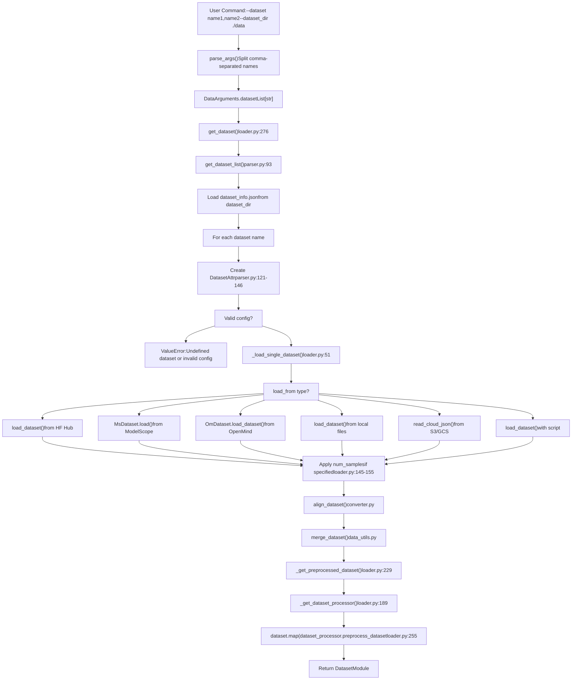

# 数据集格式参考

相关源文件

-   [data/README.md](https://github.com/hiyouga/LlamaFactory/blob/355d5c5e/data/README.md?plain=1)
-   [data/README\_zh.md](https://github.com/hiyouga/LlamaFactory/blob/355d5c5e/data/README_zh.md?plain=1)
-   [src/llamafactory/data/loader.py](https://github.com/hiyouga/LlamaFactory/blob/355d5c5e/src/llamafactory/data/loader.py)
-   [src/llamafactory/data/parser.py](https://github.com/hiyouga/LlamaFactory/blob/355d5c5e/src/llamafactory/data/parser.py)
-   [src/llamafactory/hparams/data\_args.py](https://github.com/hiyouga/LlamaFactory/blob/355d5c5e/src/llamafactory/hparams/data_args.py)
-   [src/llamafactory/webui/components/\_\_init\_\_.py](https://github.com/hiyouga/LlamaFactory/blob/355d5c5e/src/llamafactory/webui/components/__init__.py)
-   [src/llamafactory/webui/components/footer.py](https://github.com/hiyouga/LlamaFactory/blob/355d5c5e/src/llamafactory/webui/components/footer.py)

本文档提供 LlamaFactory 支持的数据集格式、`dataset_info.json` 配置文件结构，以及用于解析数据集的列/标签映射的全面规范。此参考文档旨在供准备自定义数据集或配置数据集加载的用户使用。

有关数据处理管道和数据集如何被分词的信息，请参阅[数据流水线](/hiyouga/LlamaFactory/zh/4-data-pipeline)。有关在训练中使用数据集的指导，请参阅[快速开始](/hiyouga/LlamaFactory/zh/2-getting-started)。

---

## 数据集配置概述

LlamaFactory 使用集中的 `dataset_info.json` 文件来注册和配置数据集。此文件必须放置在 `dataset_dir` 指定的目录中（默认：`./data`），并定义每个数据集的元数据，包括其源位置、格式、列映射和其他属性。

系统支持两种主要的数据集格式：

-   **Alpaca 格式**：指令-输入-输出 (instruction-input-output) 结构
-   **ShareGPT 格式**：带角色标签的多轮对话结构

支持的文件类型包括：`json`, `jsonl`, `csv`, `parquet` 和 `arrow`。

**源码：** [data/README.md1-5](https://github.com/hiyouga/LlamaFactory/blob/355d5c5e/data/README.md?plain=1#L1-L5) [src/llamafactory/hparams/data\_args.py38-41](https://github.com/hiyouga/LlamaFactory/blob/355d5c5e/src/llamafactory/hparams/data_args.py#L38-L41)

---

## 数据集来源类型

数据集可以从六种不同的来源类型加载，由 `DatasetAttr` 中的 `load_from` 字段确定：


| 来源类型 | 配置键 | 说明 | 示例 |
| --- | --- | --- | --- |
| `hf_hub` | `hf_hub_url` | Hugging Face 数据集仓库 | `"yahma/alpaca-cleaned"` |
| `ms_hub` | `ms_hub_url` | ModelScope 数据集仓库 | `"modelscope/alpaca-gpt4-data"` |
| `om_hub` | `om_hub_url` | OpenMind 数据集仓库 | `"openmind/dataset-name"` |
| `script` | `script_url` | 包含数据集加载脚本的本地文件夹 | `"custom_loader"` |
| `file` | `file_name` | 本地文件或文件夹路径 | `"alpaca_data.json"` |
| `cloud_file` | `cloud_file_name` | S3 或 GCS 云存储路径 | `"s3://bucket/data.json"` |

优先级顺序（如果指定了多个）：`hf_hub_url` / `ms_hub_url` / `om_hub_url` > `script_url` > `cloud_file_name` > `file_name`。

**源码：** [src/llamafactory/data/parser.py26-64](https://github.com/hiyouga/LlamaFactory/blob/355d5c5e/src/llamafactory/data/parser.py#L26-L64) [src/llamafactory/data/loader.py51-91](https://github.com/hiyouga/LlamaFactory/blob/355d5c5e/src/llamafactory/data/loader.py#L51-L91) [data/README.md8-13](https://github.com/hiyouga/LlamaFactory/blob/355d5c5e/data/README.md?plain=1#L8-L13)

---

## DatasetAttr 结构

`DatasetAttr` 类 ([src/llamafactory/data/parser.py26-91](https://github.com/hiyouga/LlamaFactory/blob/355d5c5e/src/llamafactory/data/parser.py#L26-L91)) 定义了所有数据集属性。这是解析 `dataset_info.json` 后的内部表示。


### 基础配置字段

| 字段 | 类型 | 默认值 | 说明 |
| --- | --- | --- | --- |
| `load_from` | `Literal` | (必填) | 来源类型：`hf_hub`, `ms_hub`, `om_hub`, `script`, `file`, `cloud_file` |
| `dataset_name` | `str` | (必填) | 仓库 ID、文件夹名称或文件路径，取决于 `load_from` |
| `formatting` | `Literal` | `"alpaca"` | 数据集格式：`alpaca`, `sharegpt`, 或 `openai` |
| `ranking` | `bool` | `False` | 是否为偏好数据集（用于奖励建模、DPO 等） |

### 额外配置字段

| 字段 | 类型 | 默认值 | 说明 |
| --- | --- | --- | --- |
| `subset` | `str` | `None` | 数据集子集名称（用于具有多个配置的数据集） |
| `split` | `str` | `"train"` | 要使用的数据集拆分（`train`, `test`, `validation` 等） |
| `folder` | `str` | `None` | 仓库内的文件夹（用于 Hugging Face 数据集） |
| `num_samples` | `int` | `None` | 要从数据集中使用的样本数（如果需要，将进行带放回的随机采样） |

**源码：** [src/llamafactory/data/parser.py26-65](https://github.com/hiyouga/LlamaFactory/blob/355d5c5e/src/llamafactory/data/parser.py#L26-L65) [data/README.md14-19](https://github.com/hiyouga/LlamaFactory/blob/355d5c5e/data/README.md?plain=1#L14-L19)

---

## Dataset Info JSON 格式

`dataset_info.json` 文件是一个 JSON 对象，其中每个键是数据集名称，每个值是配置对象。

### 完整架构

```json
{
  "dataset_name": {
    "hf_hub_url": "string (可选)",
    "ms_hub_url": "string (可选)",
    "om_hub_url": "string (可选)",
    "script_url": "string (可选)",
    "cloud_file_name": "string (可选)",
    "file_name": "string (可选，如果上述均未指定则必填)",
    "formatting": "alpaca | sharegpt | openai (可选, 默认: alpaca)",
    "ranking": "boolean (可选, 默认: false)",
    "subset": "string (可选)",
    "split": "string (可选, 默认: train)",
    "folder": "string (可选)",
    "num_samples": "integer (可选)",
    "columns": {
      "prompt": "string (可选, 默认: instruction)",
      "query": "string (可选, 默认: input)",
      "response": "string (可选, 默认: output)",
      "history": "string (可选)",
      "messages": "string (可选, 默认: conversations)",
      "system": "string (可选)",
      "tools": "string (可选)",
      "images": "string (可选)",
      "videos": "string (可选)",
      "audios": "string (可选)",
      "chosen": "string (可选)",
      "rejected": "string (可选)",
      "kto_tag": "string (可选)"
    },
    "tags": {
      "role_tag": "string (可选, 默认: from)",
      "content_tag": "string (可选, 默认: value)",
      "user_tag": "string (可选, 默认: human)",
      "assistant_tag": "string (可选, 默认: gpt)",
      "observation_tag": "string (可选, 默认: observation)",
      "function_tag": "string (可选, 默认: function_call)",
      "system_tag": "string (可选, 默认: system)"
    }
  }
}
```
### 配置解析流程


**源码：** [src/llamafactory/data/parser.py93-149](https://github.com/hiyouga/LlamaFactory/blob/355d5c5e/src/llamafactory/data/parser.py#L93-L149) [data/README.md1-44](https://github.com/hiyouga/LlamaFactory/blob/355d5c5e/data/README.md?plain=1#L1-L44)

---

## 列映射

列映射允许将具有不同列名的数据集规范化为标准的内部表示。`dataset_info.json` 中的 `columns` 对象指定了实际的列名对应于哪些语义字段。

### 通用列

| 语义字段 | 默认列名 | 使用场景 | 说明 |
| --- | --- | --- | --- |
| `system` | `None` | 所有格式 | 系统提示词（可选） |
| `tools` | `None` | 所有格式 | JSON 格式的工具/函数描述（可选） |
| `images` | `None` | 多模态 | 图像文件路径列表（可选） |
| `videos` | `None` | 多模态 | 视频文件路径列表（可选） |
| `audios` | `None` | 多模态 | 音频文件路径列表（可选） |

### Alpaca 格式列

| 语义字段 | 默认列名 | 是否必填 | 说明 |
| --- | --- | --- | --- |
| `prompt` | `"instruction"` | 是 | 用户指令/提示词 |
| `query` | `"input"` | 否 | 额外用户输入（与提示词拼接） |
| `response` | `"output"` | 是 (SFT/PT) | 模型响应 |
| `history` | `None` | 否 | 多轮历史对话的 `[instruction, response]` 元组列表 |

**Alpaca 格式结构：**


### ShareGPT 格式列

| 语义字段 | 默认列名 | 是否必填 | 说明 |
| --- | --- | --- | --- |
| `messages` | `"conversations"` | 是 | 包含角色和内容的对话消息对象列表 |

**ShareGPT 格式结构：**


### 偏好数据集列

| 语义字段 | 默认列名 | 是否必填 | 使用场景 | 说明 |
| --- | --- | --- | --- | --- |
| `chosen` | `None` | 是 | DPO, ORPO, SimPO, RM | 较好的响应 (Alpaca) 或消息对象 (ShareGPT) |
| `rejected` | `None` | 是 | DPO, ORPO, SimPO, RM | 较差的响应 (Alpaca) 或消息对象 (ShareGPT) |
| `kto_tag` | `None` | 是 | KTO | 布尔反馈 (`true` = 正面, `false` = 负面) |

**源码：** [src/llamafactory/data/parser.py40-64](https://github.com/hiyouga/LlamaFactory/blob/355d5c5e/src/llamafactory/data/parser.py#L40-L64) [data/README.md20-34](https://github.com/hiyouga/LlamaFactory/blob/355d5c5e/data/README.md?plain=1#L20-L34)

---

## 标签映射 (ShareGPT 格式)

标签定义了如何解析 ShareGPT 格式中的消息对象。它们指定了哪些键标识角色和内容，以及哪些值代表不同的消息类型。

### 标签配置

| 标签 | 默认值 | 说明 |
| --- | --- | --- |
| `role_tag` | `"from"` | 消息对象中包含角色的键 |
| `content_tag` | `"value"` | 消息对象中包含文本内容的键 |
| `user_tag` | `"human"` | `role_tag` 的值，表示用户消息 |
| `assistant_tag` | `"gpt"` | `role_tag` 的值，表示助手消息 |
| `observation_tag` | `"observation"` | `role_tag` 的值，表示工具输出 |
| `function_tag` | `"function_call"` | `role_tag` 的值，表示函数调用 |
| `system_tag` | `"system"` | `role_tag` 的值，表示系统提示词（覆盖 `system` 列） |

### 示例：OpenAI 格式映射

OpenAI 格式使用 `role`/`content` 键和 `user`/`assistant`/`system` 角色值：

```json
{
  "dataset_name": {
    "file_name": "openai_data.json",
    "formatting": "sharegpt",
    "columns": {
      "messages": "messages"
    },
    "tags": {
      "role_tag": "role",
      "content_tag": "content",
      "user_tag": "user",
      "assistant_tag": "assistant",
      "system_tag": "system"
    }
  }
}
```
**源码：** [src/llamafactory/data/parser.py57-64](https://github.com/hiyouga/LlamaFactory/blob/355d5c5e/src/llamafactory/data/parser.py#L57-L64) [data/README.md35-43](https://github.com/hiyouga/LlamaFactory/blob/355d5c5e/data/README.md?plain=1#L35-L43) [data/README.md460-477](https://github.com/hiyouga/LlamaFactory/blob/355d5c5e/data/README.md?plain=1#L460-L477)

---

## Alpaca 格式规范

### 指令微调数据集

**数据文件结构：**

```json
[
  {
    "instruction": "用户指令 (必填)",
    "input": "用户输入 (可选)",
    "output": "模型响应 (必填)",
    "system": "系统提示词 (可选)",
    "history": [
      ["第一轮指令 (可选)", "第一轮响应 (可选)"],
      ["第二轮指令 (可选)", "第二轮响应 (可选)"]
    ]
  }
]
```
**Dataset Info 配置：**

```json
{
  "dataset_name": {
    "file_name": "alpaca_data.json",
    "columns": {
      "prompt": "instruction",
      "query": "input",
      "response": "output",
      "system": "system",
      "history": "history"
    }
  }
}
```
**关键点：**

-   最终的用户提示词为 `instruction + "\n" + input`（如果 input 不为空）
-   `output` 列是将被学习的模型响应
-   `history` 列中的历史消息**也会被学习**（未被掩码）
-   对于推理模型（如 Qwen3），如果数据集包含思维链 (CoT)，其格式应为：`output`
-   如果模型具有推理能力但数据集缺少 CoT，LlamaFactory 会根据 `enable_thinking` 参数自动添加空的 CoT

**源码：** [data/README.md49-95](https://github.com/hiyouga/LlamaFactory/blob/355d5c5e/data/README.md?plain=1#L49-L95)

---

### 预训练数据集

**数据文件结构：**

```json
[
  {"text": "文档内容"},
  {"text": "文档内容"}
]
```
**Dataset Info 配置：**

```json
{
  "dataset_name": {
    "file_name": "pretrain_data.jsonl",
    "columns": {
      "prompt": "text"
    }
  }
}
```
**关键点：**

-   仅使用 `text` 列；它被映射到 `prompt` 字段
-   没有指令-响应结构；整个文本被视为一个连续序列
-   通常在流式模式 (streaming mode) 下用于大型语料库

**源码：** [data/README.md96-118](https://github.com/hiyouga/LlamaFactory/blob/355d5c5e/data/README.md?plain=1#L96-L118)

---

### 偏好数据集

**数据文件结构：**

```json
[
  {
    "instruction": "用户指令 (必填)",
    "input": "用户输入 (可选)",
    "chosen": "选中的回答 (必填)",
    "rejected": "拒绝的回答 (必填)"
  }
]
```
**Dataset Info 配置：**

```json
{
  "dataset_name": {
    "file_name": "preference_data.json",
    "ranking": true,
    "columns": {
      "prompt": "instruction",
      "query": "input",
      "chosen": "chosen",
      "rejected": "rejected"
    }
  }
}
```
**关键点：**

-   偏好数据集**必须**设置 `ranking: true` 标志
-   用于奖励建模、DPO、ORPO 和 SimPO 训练
-   `chosen` 包含较好的响应；`rejected` 包含较差的响应
-   两个响应都是针对同一个提示词的

**源码：** [data/README.md120-150](https://github.com/hiyouga/LlamaFactory/blob/355d5c5e/data/README.md?plain=1#L120-L150)

---

### KTO 数据集

**数据文件结构 (Alpaca)：**

```json
[
  {
    "instruction": "用户指令 (必填)",
    "input": "用户输入 (可选)",
    "output": "模型响应 (必填)",
    "kto_tag": true
  }
]
```
**Dataset Info 配置：**

```json
{
  "dataset_name": {
    "file_name": "kto_data.json",
    "columns": {
      "prompt": "instruction",
      "query": "input",
      "response": "output",
      "kto_tag": "kto_tag"
    }
  }
}
```
**关键点：**

-   `kto_tag` 是一个布尔值，表示人类反馈：`true` = 正面, `false` = 负面
-   与偏好数据集不同，KTO 使用带有二元反馈的单一响应
-   专门用于 KTO (Kahneman-Tversky Optimization) 训练

**源码：** [data/README.md152-154](https://github.com/hiyouga/LlamaFactory/blob/355d5c5e/data/README.md?plain=1#L152-L154) [data/README\_zh.md152-154](https://github.com/hiyouga/LlamaFactory/blob/355d5c5e/data/README_zh.md?plain=1#L152-L154)

---

### 多模态数据集（图像、视频、音频）

**数据文件结构：**

```json
[
  {
    "instruction": "<image>描述这张图像",
    "input": "",
    "output": "模型响应",
    "images": ["path/to/image1.jpg"]
  }
]
```
**Dataset Info 配置：**

```json
{
  "dataset_name": {
    "file_name": "multimodal_data.json",
    "columns": {
      "prompt": "instruction",
      "query": "input",
      "response": "output",
      "images": "images"
    }
  }
}
```
**关键点：**

-   在文本中使用 `<image>`, `<video>` 或 `<audio>` 标记作为占位符
-   标记的数量**必须与**对应列表中路径的数量相匹配
-   路径可以是绝对路径，也可以是相对于 `media_dir`（默认为 `dataset_dir`）的相对路径
-   支持同时包含多种模态

**列名：**

-   图像：`images` 列（图像路径列表）
-   视频：`videos` 列（视频路径列表）
-   音频：`audios` 列（音频路径列表）

**源码：** [data/README.md156-166](https://github.com/hiyouga/LlamaFactory/blob/355d5c5e/data/README.md?plain=1#L156-L166) [src/llamafactory/hparams/data\_args.py42-45](https://github.com/hiyouga/LlamaFactory/blob/355d5c5e/src/llamafactory/hparams/data_args.py#L42-L45)

---

## ShareGPT 格式规范

### 指令微调数据集

**数据文件结构：**

```json
[
  {
    "conversations": [
      {
        "from": "human",
        "value": "用户指令"
      },
      {
        "from": "function_call",
        "value": "{\"name\": \"tool\", \"arguments\": {}}"
      },
      {
        "from": "observation",
        "value": "工具结果"
      },
      {
        "from": "gpt",
        "value": "模型响应"
      }
    ],
    "system": "系统提示词 (可选)",
    "tools": "[{\"name\": \"tool\", \"description\": \"...\"}]"
  }
]
```
**Dataset Info 配置：**

```json
{
  "dataset_name": {
    "file_name": "sharegpt_data.json",
    "formatting": "sharegpt",
    "columns": {
      "messages": "conversations",
      "system": "system",
      "tools": "tools"
    }
  }
}
```
**消息角色约束：**


**关键点：**

-   `human` 和 `observation` 角色必须出现在**奇数位置**（第 1, 3, 5, ... 条）
-   `gpt` 和 `function_call` 角色必须出现在**偶数位置**（第 2, 4, 6, ... 条）
-   仅学习 `gpt` 和 `function_call` 消息（计算损失）
-   支持带有 `function_call` 和 `observation` 角色的工具/函数调用工作流

**源码：** [data/README.md170-217](https://github.com/hiyouga/LlamaFactory/blob/355d5c5e/data/README.md?plain=1#L170-L217)

---

### 偏好数据集

**数据文件结构：**

```json
[
  {
    "conversations": [
      {
        "from": "human",
        "value": "用户指令"
      },
      {
        "from": "gpt",
        "value": "背景响应"
      },
      {
        "from": "human",
        "value": "后续指令"
      }
    ],
    "chosen": {
      "from": "gpt",
      "value": "选中的回答 (必填)"
    },
    "rejected": {
      "from": "gpt",
      "value": "拒绝的回答 (必填)"
    }
  }
]
```
**Dataset Info 配置：**

```json
{
  "dataset_name": {
    "file_name": "dpo_data.json",
    "formatting": "sharegpt",
    "ranking": true,
    "columns": {
      "messages": "conversations",
      "chosen": "chosen",
      "rejected": "rejected"
    }
  }
}
```
**关键点：**

-   必须设置 `ranking: true`
-   `chosen` 和 `rejected` 是消息对象，而非普通字符串
-   `conversations` 列表提供上下文；偏好在最后一轮产生分歧

**源码：** [data/README.md223-271](https://github.com/hiyouga/LlamaFactory/blob/355d5c5e/data/README.md?plain=1#L223-L271)

---

### KTO 数据集

**数据文件结构：**

```json
[
  {
    "conversations": [
      {
        "from": "human",
        "value": "用户指令"
      },
      {
        "from": "gpt",
        "value": "模型响应"
      }
    ],
    "kto_tag": true
  }
]
```
**Dataset Info 配置：**

```json
{
  "dataset_name": {
    "file_name": "kto_data.json",
    "formatting": "sharegpt",
    "columns": {
      "messages": "conversations",
      "kto_tag": "kto_tag"
    }
  }
}
```
**关键点：**

-   与 Alpaca 格式 KTO 相同：`kto_tag` 是表示人类反馈的布尔值
-   可以在 `conversations` 中包含多轮上下文

**源码：** [data/README.md273-308](https://github.com/hiyouga/LlamaFactory/blob/355d5c5e/data/README.md?plain=1#L273-L308)

---

### 多模态数据集（图像、视频、音频）

**数据文件结构（图像示例）：**

```json
[
  {
    "conversations": [
      {
        "from": "human",
        "value": "<image><image>描述这些图像"
      },
      {
        "from": "gpt",
        "value": "模型响应"
      }
    ],
    "images": [
      "path/to/image1.jpg",
      "path/to/image2.jpg"
    ]
  }
]
```
**Dataset Info 配置：**

```json
{
  "dataset_name": {
    "file_name": "mllm_data.json",
    "formatting": "sharegpt",
    "columns": {
      "messages": "conversations",
      "images": "images"
    }
  }
}
```
**关键点：**

-   在消息内容中使用 `<image>`, `<video>` 或 `<audio>` 标记
-   标记数量必须**严格匹配**路径数量
-   关于路径和 `media_dir` 的规则与 Alpaca 格式相同

**源码：** [data/README.md310-432](https://github.com/hiyouga/LlamaFactory/blob/355d5c5e/data/README.md?plain=1#L310-L432)

---

### OpenAI 格式（特殊情况）

OpenAI 格式是 ShareGPT 格式的一种标准变体，使用特定的角色和内容键。

**数据文件结构：**

```json
[
  {
    "messages": [
      {
        "role": "system",
        "content": "系统提示词 (可选)"
      },
      {
        "role": "user",
        "content": "用户指令"
      },
      {
        "role": "assistant",
        "content": "模型响应"
      }
    ]
  }
]
```
**Dataset Info 配置：**

```json
{
  "dataset_name": {
    "file_name": "openai_data.json",
    "formatting": "sharegpt",
    "columns": {
      "messages": "messages"
    },
    "tags": {
      "role_tag": "role",
      "content_tag": "content",
      "user_tag": "user",
      "assistant_tag": "assistant",
      "system_tag": "system"
    }
  }
}
```
**关键点：**

-   第一条消息可以是系统提示词 (role = "system")
-   使用 `role`/`content` 代替 `from`/`value`
-   需要显式的标签配置来覆盖默认值

**源码：** [data/README.md433-476](https://github.com/hiyouga/LlamaFactory/blob/355d5c5e/data/README.md?plain=1#L433-L476)

---

## 完整配置示例

### 示例 1：使用默认列的本地 Alpaca 数据集

```json
{
  "my_alpaca_dataset": {
    "file_name": "my_data.json"
  }
}
```
这将使用所有默认值：

-   `formatting`: `"alpaca"`
-   `columns.prompt`: `"instruction"`
-   `columns.query`: `"input"`
-   `columns.response`: `"output"`

### 示例 2：具有自定义列的 Hugging Face Hub ShareGPT 数据集

```json
{
  "my_custom_dataset": {
    "hf_hub_url": "user/dataset-repo",
    "subset": "default",
    "split": "train",
    "formatting": "sharegpt",
    "columns": {
      "messages": "dialogue",
      "system": "sys_prompt"
    }
  }
}
```
### 示例 3：带有采样的偏好数据集

```json
{
  "dpo_subset": {
    "file_name": "preference_data.json",
    "formatting": "sharegpt",
    "ranking": true,
    "num_samples": 10000,
    "columns": {
      "messages": "conversations",
      "chosen": "winner",
      "rejected": "loser"
    }
  }
}
```
### 示例 4：来自 ModelScope 的多模态数据集

```json
{
  "vision_dataset": {
    "ms_hub_url": "modelscope/visual-instruction-data",
    "formatting": "sharegpt",
    "columns": {
      "messages": "conversations",
      "images": "image_paths"
    }
  }
}
```
### 示例 5：来自不同来源的多个数据集

```json
{
  "alpaca_local": {
    "file_name": "alpaca.json"
  },
  "sharegpt_hf": {
    "hf_hub_url": "openchat/openchat_sharegpt4_dataset",
    "formatting": "sharegpt"
  },
  "custom_dpo": {
    "file_name": "dpo_pairs.jsonl",
    "formatting": "alpaca",
    "ranking": true,
    "columns": {
      "prompt": "question",
      "chosen": "good_answer",
      "rejected": "bad_answer"
    }
  }
}
```
**用法：**

```bash
llamafactory-cli train \
  --dataset alpaca_local,sharegpt_hf,custom_dpo \
  --dataset_dir ./data \
  ...
```
**源码：** [data/README.md1-476](https://github.com/hiyouga/LlamaFactory/blob/355d5c5e/data/README.md?plain=1#L1-L476) [src/llamafactory/data/parser.py93-149](https://github.com/hiyouga/LlamaFactory/blob/355d5c5e/src/llamafactory/data/parser.py#L93-L149)

---

## 数据集加载与验证流程


**关键验证点：**

1.  **数据集名称查找** ([src/llamafactory/data/parser.py125-126](https://github.com/hiyouga/LlamaFactory/blob/355d5c5e/src/llamafactory/data/parser.py#L125-L126))：检查数据集名称是否存在于 `dataset_info.json` 中
2.  **列是否存在** (在 `align_dataset` 中)：验证指定的列名是否存在于加载的数据集中
3.  **格式验证** (在处理器中)：确保数据符合训练阶段的预期结构
4.  **样本数量** ([src/llamafactory/data/loader.py145-155](https://github.com/hiyouga/LlamaFactory/blob/355d5c5e/src/llamafactory/data/loader.py#L145-L155))：如果 `num_samples` 超过数据集大小，则进行带放回采样

**源码：** [src/llamafactory/data/loader.py51-336](https://github.com/hiyouga/LlamaFactory/blob/355d5c5e/src/llamafactory/data/loader.py#L51-L336) [src/llamafactory/data/parser.py93-149](https://github.com/hiyouga/LlamaFactory/blob/355d5c5e/src/llamafactory/data/parser.py#L93-L149)

---

## 特别注意事项

### 推理模型的思维模式

对于具有推理能力的模型（如 Qwen3, Qwen2.5, DeepSeek-R1）：

-   **数据集中带有 CoT**：将 CoT 作为 `output` 放入模型响应中
-   **数据集中缺少 CoT**：LlamaFactory 会根据 `enable_thinking` 参数自动添加空的 CoT：
    -   `enable_thinking=True` (默认)：向响应中添加空 CoT（慢速思考，计算损失）
    -   `enable_thinking=False`：向提示词中添加空 CoT（快速思考，不计算损失）
    -   `enable_thinking=None`：混合模式（有 CoT 的数据使用慢速思考，无 CoT 的数据使用快速思考）

**源码：** [data/README.md91-94](https://github.com/hiyouga/LlamaFactory/blob/355d5c5e/data/README.md?plain=1#L91-L94)

### 序列打包

当 `DataArguments` 中的 `packing=True` 时：

-   多个序列被打包到单个训练示例中
-   使用块对角注意力掩码以防止序列间的交叉注意力
-   `cutoff_len` 会减少 1，以避免填充问题 ([src/llamafactory/hparams/data\_args.py182-183](https://github.com/hiyouga/LlamaFactory/blob/355d5c5e/src/llamafactory/hparams/data_args.py#L182-L183))

**源码：** [src/llamafactory/hparams/data\_args.py106-113](https://github.com/hiyouga/LlamaFactory/blob/355d5c5e/src/llamafactory/hparams/data_args.py#L106-L113) [src/llamafactory/hparams/data\_args.py179-183](https://github.com/hiyouga/LlamaFactory/blob/355d5c5e/src/llamafactory/hparams/data_args.py#L179-L183)

### 数据集混合策略

当使用多个数据集（在 `dataset` 参数中以逗号分隔）时：

| 策略 | 参数 | 说明 |
| --- | --- | --- |
| `concat` | `mix_strategy="concat"` | 按顺序拼接数据集（默认） |
| `interleave_under` | `mix_strategy="interleave_under"` + `interleave_probs` | 带有欠采样的交错（较小的数据集采样较少） |
| `interleave_over` | `mix_strategy="interleave_over"` + `interleave_probs` | 带有过采样的交错（较小的数据集重复采样） |

**源码：** [src/llamafactory/hparams/data\_args.py66-73](https://github.com/hiyouga/LlamaFactory/blob/355d5c5e/src/llamafactory/hparams/data_args.py#L66-L73)

### 流式模式

当 `streaming=True` 时：

-   数据集被加载为 `IterableDataset` 而非 `Dataset`
-   支持处理显存无法容纳的超大型数据集
-   与 `max_samples` 和分数形式的 `val_size` 不兼容
-   文件形式的数据集将使用 `to_iterable_dataset()` 转换为可迭代对象

**源码：** [src/llamafactory/hparams/data\_args.py58-61](https://github.com/hiyouga/LlamaFactory/blob/355d5c5e/src/llamafactory/hparams/data_args.py#L58-L61) [src/llamafactory/data/loader.py142-143](https://github.com/hiyouga/LlamaFactory/blob/355d5c5e/src/llamafactory/data/loader.py#L142-L143)

---

## 常见问题故障排除

### 问题："Undefined dataset X in dataset\_info.json"

**原因：** `--dataset` 中指定的数据集名称在 `dataset_info.json` 中不存在

**解决方案：** 将数据集配置添加到 `dataset_info.json` 或检查拼写错误

**代码参考：** [src/llamafactory/data/parser.py125-126](https://github.com/hiyouga/LlamaFactory/blob/355d5c5e/src/llamafactory/data/parser.py#L125-L126)

---

### 问题："Column 'X' not found in dataset"

**原因：** `columns` 映射中指定的列在加载的数据集文件中不存在

**解决方案：**

1.  检查数据文件中的实际列名
2.  更新 `dataset_info.json` 中的 `columns` 映射以匹配
3.  或重命名数据文件中的列以匹配默认值

**代码参考：** [src/llamafactory/data/loader.py161](https://github.com/hiyouga/LlamaFactory/blob/355d5c5e/src/llamafactory/data/loader.py#L161-L161) (调用 `align_dataset`)

---

### 问题："File X not found"

**原因：** `file_name` 路径不正确或文件不存在

**解决方案：**

1.  确保文件存在于 `dataset_dir` 中
2.  检查 `dataset_dir` 参数是否指向正确的目录
3.  如有必要，使用绝对路径

**代码参考：** [src/llamafactory/data/loader.py73-82](https://github.com/hiyouga/LlamaFactory/blob/355d5c5e/src/llamafactory/data/loader.py#L73-L82)

---

### 问题："Number of images does not match tokens"

**原因：** 文本中 `<image>` 标记的数量与 `images` 列表的长度不匹配

**解决方案：** 确保每个 `<image>` 标记在 `images` 数组中都有对应的路径

**代码参考：** 见多模态处理（[多模态数据处理](/hiyouga/LlamaFactory/zh/4.3-multimodal-data-processing)）

---

### 问题："The dataset is not applicable in the current training stage"

**原因：** 在非 RM 阶段使用偏好数据集 (`ranking=true`)，或反之亦然

**解决方案：**

-   仅在 RM, DPO, KTO, ORPO, SimPO 训练阶段使用 `ranking=true`
-   在 PT, SFT, PPO 阶段使用 `ranking=false`（或省略）

**代码参考：** [src/llamafactory/data/loader.py178-179](https://github.com/hiyouga/LlamaFactory/blob/355d5c5e/src/llamafactory/data/loader.py#L178-L179)

---

至此，数据集格式参考已完成。有关数据集如何在处理流水线中流动的信息，请参阅[数据流水线](/hiyouga/LlamaFactory/zh/4-data-pipeline)。有关训练参数的配置，请参阅[配置系统](/hiyouga/LlamaFactory/zh/3-configuration-system)。
