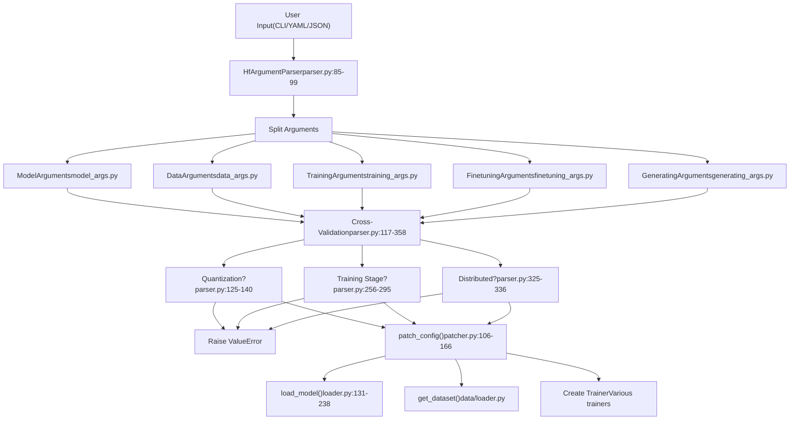
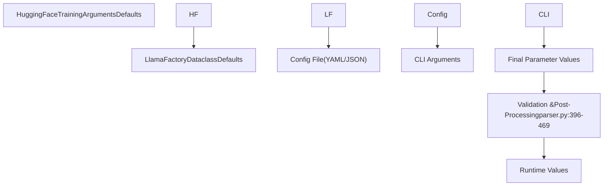

# 配置参数参考

相关源文件

-   [README.md](https://github.com/hiyouga/LlamaFactory/blob/355d5c5e/README.md?plain=1)
-   [README\_zh.md](https://github.com/hiyouga/LlamaFactory/blob/355d5c5e/README_zh.md?plain=1)
-   [src/llamafactory/hparams/finetuning\_args.py](https://github.com/hiyouga/LlamaFactory/blob/355d5c5e/src/llamafactory/hparams/finetuning_args.py)
-   [src/llamafactory/hparams/model\_args.py](https://github.com/hiyouga/LlamaFactory/blob/355d5c5e/src/llamafactory/hparams/model_args.py)
-   [src/llamafactory/hparams/parser.py](https://github.com/hiyouga/LlamaFactory/blob/355d5c5e/src/llamafactory/hparams/parser.py)
-   [src/llamafactory/model/adapter.py](https://github.com/hiyouga/LlamaFactory/blob/355d5c5e/src/llamafactory/model/adapter.py)
-   [src/llamafactory/model/loader.py](https://github.com/hiyouga/LlamaFactory/blob/355d5c5e/src/llamafactory/model/loader.py)
-   [src/llamafactory/model/model\_utils/unsloth.py](https://github.com/hiyouga/LlamaFactory/blob/355d5c5e/src/llamafactory/model/model_utils/unsloth.py)
-   [src/llamafactory/model/patcher.py](https://github.com/hiyouga/LlamaFactory/blob/355d5c5e/src/llamafactory/model/patcher.py)
-   [src/llamafactory/train/dpo/trainer.py](https://github.com/hiyouga/LlamaFactory/blob/355d5c5e/src/llamafactory/train/dpo/trainer.py)
-   [src/llamafactory/train/kto/trainer.py](https://github.com/hiyouga/LlamaFactory/blob/355d5c5e/src/llamafactory/train/kto/trainer.py)
-   [src/llamafactory/train/ppo/trainer.py](https://github.com/hiyouga/LlamaFactory/blob/355d5c5e/src/llamafactory/train/ppo/trainer.py)
-   [src/llamafactory/train/pt/trainer.py](https://github.com/hiyouga/LlamaFactory/blob/355d5c5e/src/llamafactory/train/pt/trainer.py)
-   [src/llamafactory/train/rm/trainer.py](https://github.com/hiyouga/LlamaFactory/blob/355d5c5e/src/llamafactory/train/rm/trainer.py)
-   [src/llamafactory/train/sft/trainer.py](https://github.com/hiyouga/LlamaFactory/blob/355d5c5e/src/llamafactory/train/sft/trainer.py)
-   [src/llamafactory/train/trainer\_utils.py](https://github.com/hiyouga/LlamaFactory/blob/355d5c5e/src/llamafactory/train/trainer_utils.py)

本页面提供 LlamaFactory 中所有可用配置参数的全面参考。在配置训练、推理或导出操作时，可以使用此页面查找参数名称、类型、默认值、有效值和约束条件。

有关创建和组织配置文件的信息，请参阅[配置文件 (YAML/JSON)](/hiyouga/LlamaFactory/zh/3.2-configuration-files-(yamljson))。有关参数如何被验证并在系统中流转的信息，请参阅[参数类型与验证](/hiyouga/LlamaFactory/zh/3.1-argument-types-and-validation)。

---

## 概述

LlamaFactory 将配置参数组织为五个主要的参数类，每个类处理系统的一个特定方面：

```mermaid
flowchart TD
    Config["Configuration(YAML/JSON/CLI)"]
    MA["ModelArgumentsmodel_args.py"]
    DA["DataArgumentsdata_args.py"]
    TA["TrainingArgumentstraining_args.py"]
    FA["FinetuningArgumentsfinetuning_args.py"]
    GA["GeneratingArgumentsgenerating_args.py"]
    BaseModel["BaseModelArguments"]
    Quant["QuantizationArguments"]
    Proc["ProcessorArguments"]
    Export["ExportArguments"]
    VLLM["VllmArguments"]
    KT["KTransformersArguments"]
    Freeze["FreezeArguments"]
    LoRA["LoraArguments"]
    OFT["OFTArguments"]
    RLHF["RLHFArguments"]
    GaLore["GaloreArguments"]
    Apollo["ApolloArguments"]
    BAdam["BAdamArguments"]

    Config --> MA
    Config --> DA
    Config --> TA
    Config --> FA
    Config --> GA
    MA --> BaseModel
    MA --> Quant
    MA --> Proc
    MA --> Export
    MA --> VLLM
    MA --> KT
    FA --> Freeze
    FA --> LoRA
    FA --> OFT
    FA --> RLHF
    FA --> GaLore
    FA --> Apollo
    FA --> BAdam
```

**源码：** [src/llamafactory/hparams/parser.py49-54](https://github.com/hiyouga/LlamaFactory/blob/355d5c5e/src/llamafactory/hparams/parser.py#L49-L54) [src/llamafactory/hparams/model\_args.py33-403](https://github.com/hiyouga/LlamaFactory/blob/355d5c5e/src/llamafactory/hparams/model_args.py#L33-L403) [src/llamafactory/hparams/finetuning\_args.py19-467](https://github.com/hiyouga/LlamaFactory/blob/355d5c5e/src/llamafactory/hparams/finetuning_args.py#L19-L467)

---

## ModelArguments

`ModelArguments` 控制模型加载、量化、处理器设置、导出行为以及推理后端配置。这些参数在 [src/llamafactory/hparams/model\_args.py](https://github.com/hiyouga/LlamaFactory/blob/355d5c5e/src/llamafactory/hparams/model_args.py) 中的多个数据类中定义。

### 基础模型参数

| 参数 | 类型 | 默认值 | 说明 |
| --- | --- | --- | --- |
| `model_name_or_path` | `str` | 必填 | 模型权重路径，或来自 huggingface.co 或 modelscope.cn 的标识符 |
| `adapter_name_or_path` | `str | None` | `None` | 适配器权重路径。使用逗号分隔多个适配器 |
| `adapter_folder` | `str | None` | `None` | 包含要加载的适配器权重的文件夹 |
| `cache_dir` | `str | None` | `None` | 存储从 HuggingFace 或 ModelScope 下载的模型目录 |
| `use_fast_tokenizer` | `bool` | `True` | 是否使用快速分词器 (基于 tokenizers 库) |
| `resize_vocab` | `bool` | `False` | 是否调整分词器词表和嵌入层大小 |
| `split_special_tokens` | `bool` | `False` | 分词期间是否应拆分特殊标记 |
| `add_tokens` | `str | None` | `None` | 要添加的非特殊标记。使用逗号分隔多个标记 |
| `add_special_tokens` | `str | None` | `None` | 要添加的特殊标记。使用逗号分隔多个标记 |
| `new_special_tokens_config` | `str | None` | `None` | 带有特殊标记描述的 YAML 配置路径，用于语义初始化 |
| `init_special_tokens` | `Literal` | `"noise_init"` | 初始化方法：`"noise_init"`, `"desc_init"`, `"desc_init_w_noise"` |
| `model_revision` | `str` | `"main"` | 模型版本（分支、标签或 commit ID） |
| `low_cpu_mem_usage` | `bool` | `True` | 是否使用显存效率高的模型加载方式 |
| `rope_scaling` | `RopeScaling | None` | `None` | RoPE 缩放策略：`"linear"`, `"dynamic"` 或 `None` |
| `flash_attn` | `AttentionFunction` | `"auto"` | FlashAttention 模式：`"auto"`, `"disabled"`, `"fa2"`, `"sdpa"` |
| `shift_attn` | `bool` | `False` | 启用来自 LongLoRA 的偏移短注意力 (S²-Attn) |
| `mixture_of_depths` | `Literal | None` | `None` | 将模型转换为 MoD：`"convert"`, `"load"` 或 `None` |
| `use_unsloth` | `bool` | `False` | 使用 Unsloth 优化进行 LoRA 训练 |
| `use_unsloth_gc` | `bool` | `False` | 使用 Unsloth 梯度检查点 (无需安装 Unsloth) |
| `enable_liger_kernel` | `bool` | `False` | 启用 Liger 内核以加快训练速度 |
| `moe_aux_loss_coef` | `float | None` | `None` | MoE 模型中路由器辅助损失的系数 |
| `disable_gradient_checkpointing` | `bool` | `False` | 禁用梯度检查点 |
| `use_reentrant_gc` | `bool` | `True` | 使用可重入梯度检查点 |
| `upcast_layernorm` | `bool` | `False` | 将 LayerNorm 权重上采样至 fp32 |
| `upcast_lmhead_output` | `bool` | `False` | 将 lm\_head 输出上采样至 fp32 |
| `train_from_scratch` | `bool` | `False` | 随机初始化模型权重 |
| `infer_backend` | `EngineName` | `"huggingface"` | 后端引擎：`"huggingface"`, `"vllm"`, `"sglang"`, `"ktransformers"` |
| `offload_folder` | `str` | `"offload"` | 卸载模型权重的路径 |
| `use_kv_cache` | `bool` | `True` | 在生成中使用 KV 缓存 |
| `use_v1_kernels` | `bool | None` | `False` | 在训练中使用高性能内核 |
| `infer_dtype` | `Literal` | `"auto"` | 推理时的数据类型：`"auto"`, `"float16"`, `"bfloat16"`, `"float32"` |
| `hf_hub_token` | `str | None` | `None` | Hugging Face Hub 身份验证令牌 |
| `ms_hub_token` | `str | None` | `None` | ModelScope Hub 身份验证令牌 |
| `om_hub_token` | `str | None` | `None` | OpenMind Hub 身份验证令牌 |
| `print_param_status` | `bool` | `False` | 打印参数状态以进行调试 |
| `trust_remote_code` | `bool` | `False` | 信任 Hub 上数据集/模型的远程代码执行 |

**源码：** [src/llamafactory/hparams/model\_args.py33-203](https://github.com/hiyouga/LlamaFactory/blob/355d5c5e/src/llamafactory/hparams/model_args.py#L33-L203)

### 量化参数

| 参数 | 类型 | 默认值 | 说明 |
| --- | --- | --- | --- |
| `quantization_method` | `QuantizationMethod` | `"bitsandbytes"` | 量化方法：`"bitsandbytes"`, `"hqq"`, `"eetq"` |
| `quantization_bit` | `int | None` | `None` | 运行时量化的位数：`4`, `8` 或 `None` |
| `quantization_type` | `Literal` | `"nf4"` | bitsandbytes int4 的数据类型：`"fp4"` 或 `"nf4"` |
| `double_quantization` | `bool` | `True` | 在 bitsandbytes int4 训练中使用双重量化 |
| `quantization_device_map` | `Literal | None` | `None` | 4-bit 量化模型的设备映射：`"auto"` 或 `None` |

**约束条件：**

-   量化仅适用于 LoRA 或 OFT 微调 ([src/llamafactory/hparams/parser.py125-127](https://github.com/hiyouga/LlamaFactory/blob/355d5c5e/src/llamafactory/hparams/parser.py#L125-L127))
-   不能在 `resize_vocab=True` 时使用量化 ([src/llamafactory/hparams/parser.py132-133](https://github.com/hiyouga/LlamaFactory/blob/355d5c5e/src/llamafactory/hparams/parser.py#L132-L133))
-   不能在量化模型上创建新适配器 ([src/llamafactory/hparams/parser.py135-136](https://github.com/hiyouga/LlamaFactory/blob/355d5c5e/src/llamafactory/hparams/parser.py#L135-L136))

**源码：** [src/llamafactory/hparams/model\_args.py278-300](https://github.com/hiyouga/LlamaFactory/blob/355d5c5e/src/llamafactory/hparams/model_args.py#L278-L300)

### 处理器参数 (多模态)

| 参数 | 类型 | 默认值 | 说明 |
| --- | --- | --- | --- |
| `image_max_pixels` | `int` | `768 * 768` | 图像输入的最大像素数 |
| `image_min_pixels` | `int` | `32 * 32` | 图像输入的最小像素数 |
| `image_do_pan_and_scan` | `bool` | `False` | 图像处理中使用平移和扫描 (Gemma3) |
| `crop_to_patches` | `bool` | `False` | 将图像裁剪为补丁 (InternVL) |
| `video_max_pixels` | `int` | `256 * 256` | 视频输入的最大像素数 |
| `video_min_pixels` | `int` | `16 * 16` | 视频输入的最小像素数 |
| `video_fps` | `float` | `2.0` | 视频输入每秒采样的帧数 |
| `video_maxlen` | `int` | `128` | 视频输入采样的最大帧数 |
| `use_audio_in_video` | `bool` | `False` | 在视频输入中使用音频 |
| `audio_sampling_rate` | `int` | `16000` | 音频输入的采样率 |

**源码：** [src/llamafactory/hparams/model\_args.py304-346](https://github.com/hiyouga/LlamaFactory/blob/355d5c5e/src/llamafactory/hparams/model_args.py#L304-L346)

### 导出参数

| 参数 | 类型 | 默认值 | 说明 |
| --- | --- | --- | --- |
| `export_dir` | `str | None` | `None` | 保存导出模型的目录 |
| `export_size` | `int` | `5` | 导出模型的文件分块大小 (GB) |
| `export_device` | `Literal` | `"cpu"` | 导出的设备：`"cpu"` 或 `"auto"` |
| `export_quantization_bit` | `int | None` | `None` | 对导出模型进行量化的位数 |
| `export_quantization_dataset` | `str | None` | `None` | 用于量化的数据集 (进行量化时必填) |
| `export_quantization_nsamples` | `int` | `128` | 用于量化的样本数量 |
| `export_quantization_maxlen` | `int` | `1024` | 量化输入的最大长度 |
| `export_legacy_format` | `bool` | `False` | 保存为 `.bin` 文件而非 `.safetensors` |
| `export_hub_model_id` | `str | None` | `None` | 推送到 Hugging Face Hub 时的仓库名称 |

**源码：** [src/llamafactory/hparams/model\_args.py357-399](https://github.com/hiyouga/LlamaFactory/blob/355d5c5e/src/llamafactory/hparams/model_args.py#L357-L399)

### vLLM 参数

| 参数 | 类型 | 默认值 | 说明 |
| --- | --- | --- | --- |
| `vllm_maxlen` | `int` | `4096` | 最大序列 (提示词 + 响应) 长度 |
| `vllm_gpu_util` | `float` | `0.7` | vLLM 引擎占用的 GPU 显存比例 (0,1) |
| `vllm_enforce_eager` | `bool` | `False` | 在 vLLM 引擎中禁用 CUDA 图 (CUDA graph) |
| `vllm_max_lora_rank` | `int` | `32` | vLLM 引擎中所有 LoRA 的最大秩 |
| `vllm_config` | `dict | str | None` | `None` | 初始化 vLLM 引擎的配置 |

**约束条件：**

-   vLLM 仅支持自回归模型 (SFT 阶段) ([src/llamafactory/hparams/parser.py482-483](https://github.com/hiyouga/LlamaFactory/blob/355d5c5e/src/llamafactory/hparams/parser.py#L482-L483))
-   vLLM 不支持 bnb 量化 ([src/llamafactory/hparams/parser.py485-486](https://github.com/hiyouga/LlamaFactory/blob/355d5c5e/src/llamafactory/hparams/parser.py#L485-L486))
-   vLLM 不支持 RoPE 缩放 ([src/llamafactory/hparams/parser.py488-489](https://github.com/hiyouga/LlamaFactory/blob/355d5c5e/src/llamafactory/hparams/parser.py#L488-L489))

**源码：** [src/llamafactory/hparams/model\_args.py403-430](https://github.com/hiyouga/LlamaFactory/blob/355d5c5e/src/llamafactory/hparams/model_args.py#L403-L430)

### KTransformers 参数

| 参数 | 类型 | 默认值 | 说明 |
| --- | --- | --- | --- |
| `use_kt` | `bool` | `False` | 启用 KTransformers 进行 CPU-GPU 混合推理 |
| `kt_config` | `str | None` | `None` | KTransformers 优化配置文件的路径 |

**约束条件：**

-   KTransformers 与 DeepSpeed ZeRO-3 不兼容 ([src/llamafactory/hparams/parser.py350-351](https://github.com/hiyouga/LlamaFactory/blob/355d5c5e/src/llamafactory/hparams/parser.py#L350-L351))
-   不能在 PPO 中将 KTransformers 与 LoRA 奖励模型配合使用 ([src/llamafactory/hparams/parser.py279-280](https://github.com/hiyouga/LlamaFactory/blob/355d5c5e/src/llamafactory/hparams/parser.py#L279-L280))

**源码：** [src/llamafactory/hparams/model\_args.py433-443](https://github.com/hiyouga/LlamaFactory/blob/355d5c5e/src/llamafactory/hparams/model_args.py#L433-L443)

---

## FinetuningArguments

`FinetuningArguments` 控制微调方法、适配器配置、优化算法以及 RLHF 超参数。这些参数在 [src/llamafactory/hparams/finetuning\_args.py](https://github.com/hiyouga/LlamaFactory/blob/355d5c5e/src/llamafactory/hparams/finetuning_args.py) 中的多个数据类中定义。

### 核心微调参数

| 参数 | 类型 | 默认值 | 说明 |
| --- | --- | --- | --- |
| `stage` | `Literal` | 必填 | 训练阶段：`"pt"`, `"sft"`, `"rm"`, `"ppo"`, `"dpo"`, `"kto"`, `"orpo"`, `"simpo"` |
| `finetuning_type` | `Literal` | `"lora"` | 微调方法：`"lora"`, `"oft"`, `"freeze"`, `"full"` |
| `use_llama_pro` | `bool` | `False` | 启用 LLaMA Pro 块扩展 |
| `freeze_vision_tower` | `bool` | `True` | 冻结多模态模型中的视觉塔 |
| `freeze_multi_modal_projector` | `bool` | `True` | 冻结多模态投影器 |
| `train_mm_proj_only` | `bool` | `False` | 仅训练多模态投影器 |
| `plot_loss` | `bool` | `False` | 训练结束后绘制训练损失图 |
| `disable_shuffling` | `bool` | `False` | 禁用数据集打乱 |

**源码：** [src/llamafactory/hparams/finetuning\_args.py467-523](https://github.com/hiyouga/LlamaFactory/blob/355d5c5e/src/llamafactory/hparams/finetuning_args.py#L467-L523)

### 冻结微调参数 (Freeze Tuning)

| 参数 | 类型 | 默认值 | 说明 |
| --- | --- | --- | --- |
| `freeze_trainable_layers` | `int` | `2` | 可训练层的数量。正数：最后 n 层。负数：最前 n 层 |
| `freeze_trainable_modules` | `str` | `"all"` | 设置为可训练的模块名称。使用逗号分隔。使用 `"all"` 表示所有模块 |
| `freeze_extra_modules` | `str | None` | `None` | 设置为可训练的额外模块名称 (隐藏层除外) |

**源码：** [src/llamafactory/hparams/finetuning\_args.py20-52](https://github.com/hiyouga/LlamaFactory/blob/355d5c5e/src/llamafactory/hparams/finetuning_args.py#L20-L52)

### LoRA 参数

| 参数 | 类型 | 默认值 | 说明 |
| --- | --- | --- | --- |
| `additional_target` | `str | None` | `None` | 除了 LoRA 层之外，设置为可训练并保存的模块。使用逗号分隔 |
| `lora_alpha` | `int | None` | `None` | LoRA 的缩放因子 (默认：`lora_rank * 2`) |
| `lora_dropout` | `float` | `0.0` | LoRA 的丢弃率 (dropout) |
| `lora_rank` | `int` | `8` | LoRA 的本征维度 |
| `lora_target` | `str` | `"all"` | LoRA 的目标模块。使用逗号分隔。使用 `"all"` 表示所有线性模块 |
| `loraplus_lr_ratio` | `float | None` | `None` | LoRA+ 学习率比率 (lr\_B / lr\_A) |
| `loraplus_lr_embedding` | `float` | `1e-6` | LoRA+ 嵌入层的学习率 |
| `use_rslora` | `bool` | `False` | 使用秩稳定缩放因子 (rank stabilization scaling factor) |
| `use_dora` | `bool` | `False` | 使用权重分解 LoRA (DoRA) |
| `pissa_init` | `bool` | `False` | 初始化 PiSSA 适配器 |
| `pissa_iter` | `int` | `16` | PiSSA 中 FSVD 迭代步骤的数量。使用 `-1` 禁用 |
| `pissa_convert` | `bool` | `False` | 将 PiSSA 适配器转换为普通 LoRA 适配器 |
| `create_new_adapter` | `bool` | `False` | 使用随机初始化的权重创建新适配器 |

**约束条件：**

-   `pissa_init` 与量化不兼容 ([src/llamafactory/hparams/parser.py129-130](https://github.com/hiyouga/LlamaFactory/blob/355d5c5e/src/llamafactory/hparams/parser.py#L129-L130))
-   `pissa_init` 与 DeepSpeed ZeRO-3 不兼容 ([src/llamafactory/hparams/parser.py315-316](https://github.com/hiyouga/LlamaFactory/blob/355d5c5e/src/llamafactory/hparams/parser.py#L315-L316))

**源码：** [src/llamafactory/hparams/finetuning\_args.py56-123](https://github.com/hiyouga/LlamaFactory/blob/355d5c5e/src/llamafactory/hparams/finetuning_args.py#L56-L123)

### OFT 参数

| 参数 | 类型 | 默认值 | 说明 |
| --- | --- | --- | --- |
| `additional_target` | `str | None` | `None` | 除了 OFT 层之外，设置为可训练并保存的模块 |
| `module_dropout` | `float` | `0.0` | OFT 的丢弃率 |
| `oft_rank` | `int` | `0` | OFT 的本征维度 |
| `oft_block_size` | `int` | `32` | OFT 的块大小 (block size) |
| `oft_target` | `str` | `"all"` | OFT 的目标模块。使用逗号分隔。使用 `"all"` 表示所有线性模块 |
| `create_new_adapter` | `bool` | `False` | 使用随机初始化的权重创建新适配器 |

**源码：** [src/llamafactory/hparams/finetuning\_args.py126-164](https://github.com/hiyouga/LlamaFactory/blob/355d5c5e/src/llamafactory/hparams/finetuning_args.py#L126-L164)

### RLHF 参数 (PPO, DPO, KTO)

| 参数 | 类型 | 默认值 | 说明 |
| --- | --- | --- | --- |
| `pref_beta` | `float` | `0.1` | 偏好损失中的 Beta 参数 |
| `pref_ftx` | `float` | `0.0` | DPO 中监督微调损失的系数 |
| `pref_bco_weight` | `float` | `0.0` | DPO 中的二元分类优化系数 |
| `pref_loss` | `Literal` | `"sigmoid"` | DPO 损失类型：`"sigmoid"`, `"hinge"`, `"ipo"`, `"kto_pair"`, `"orpo"`, `"simpo"` |
| `dpo_label_smoothing` | `float` | `0.0` | DPO 标签平滑参数 (0 到 0.5) |
| `kto_chosen_weight` | `float` | `1.0` | KTO 中理想损失的权重因子 |
| `kto_rejected_weight` | `float` | `1.0` | KTO 中非理想损失的权重因子 |
| `simpo_gamma` | `float` | `0.5` | SimPO 损失中的目标奖励间隔项 |
| `ppo_buffer_size` | `int` | `1` | PPO 经验缓冲区中的迷你批次数量 |
| `ppo_epochs` | `int` | `4` | PPO 优化步骤中的周期数 |
| `ppo_score_norm` | `bool` | `False` | 在 PPO 中使用得分归一化 |
| `ppo_target` | `float` | `6.0` | PPO 中自适应 KL 控制的目标 KL 值 |
| `ppo_whiten_rewards` | `bool` | `False` | 在计算优势之前对奖励进行白化处理 (PPO) |
| `ref_model` | `str | None` | `None` | PPO/DPO 参考模型的路径 |
| `ref_model_adapters` | `str | None` | `None` | 参考模型的适配器路径 |
| `ref_model_quantization_bit` | `int | None` | `None` | 对参考模型进行量化的位数 |
| `reward_model` | `str | None` | `None` | PPO 奖励模型的路径 |
| `reward_model_adapters` | `str | None` | `None` | 奖励模型的适配器路径 |
| `reward_model_quantization_bit` | `int | None` | `None` | 对奖励模型进行量化的位数 |
| `reward_model_type` | `Literal` | `"lora"` | 奖励模型类型：`"lora"`, `"full"`, `"api"` |
| `ld_alpha` | `float | None` | `None` | 来自 LD-DPO 论文的 Alpha 参数 |

**约束条件：**

-   PPO 不支持评估模式 ([src/llamafactory/hparams/parser.py273-274](https://github.com/hiyouga/LlamaFactory/blob/355d5c5e/src/llamafactory/hparams/parser.py#L273-L274))
-   PPO 与 S²-Attn 不兼容 ([src/llamafactory/hparams/parser.py276-277](https://github.com/hiyouga/LlamaFactory/blob/355d5c5e/src/llamafactory/hparams/parser.py#L276-L277))
-   PPO 仅接受 wandb 或 tensorboard 日志记录器 ([src/llamafactory/hparams/parser.py285-286](https://github.com/hiyouga/LlamaFactory/blob/355d5c5e/src/llamafactory/hparams/parser.py#L285-L286))

**源码：** [src/llamafactory/hparams/finetuning\_args.py168-259](https://github.com/hiyouga/LlamaFactory/blob/355d5c5e/src/llamafactory/hparams/finetuning_args.py#L168-L259)

### GaLore 参数

| 参数 | 类型 | 默认值 | 说明 |
| --- | --- | --- | --- |
| `use_galore` | `bool` | `False` | 使用梯度低秩投影 (GaLore) |
| `galore_target` | `str` | `"all"` | 应用 GaLore 的模块。使用逗号分隔。使用 `"all"` 表示所有线性模块 |
| `galore_rank` | `int` | `16` | GaLore 梯度的秩 |
| `galore_update_interval` | `int` | `200` | 更新 GaLore 投影的步数 |
| `galore_scale` | `float` | `2.0` | GaLore 缩放系数 |
| `galore_proj_type` | `Literal` | `"std"` | GaLore 投影类型：`"std"`, `"reverse_std"`, `"right"`, `"left"`, `"full"` |
| `galore_layerwise` | `bool` | `False` | 使用逐层 GaLore |

**约束条件：**

-   GaLore 与 DeepSpeed 不兼容 ([src/llamafactory/hparams/parser.py338-339](https://github.com/hiyouga/LlamaFactory/blob/355d5c5e/src/llamafactory/hparams/parser.py#L338-L339))
-   逐层 GaLore 在分布式训练中不受支持 ([src/llamafactory/hparams/parser.py326-327](https://github.com/hiyouga/LlamaFactory/blob/355d5c5e/src/llamafactory/hparams/parser.py#L326-L327))

**源码：** [src/llamafactory/hparams/finetuning\_args.py263-294](https://github.com/hiyouga/LlamaFactory/blob/355d5c5e/src/llamafactory/hparams/finetuning_args.py#L263-L294)

### APOLLO 参数

| 参数 | 类型 | 默认值 | 说明 |
| --- | --- | --- | --- |
| `use_apollo` | `bool` | `False` | 使用 APOLLO 优化器 |
| `apollo_target` | `str` | `"all"` | 应用 APOLLO 的模块。使用逗号分隔。使用 `"all"` 表示所有线性模块 |
| `apollo_rank` | `int` | `256` | APOLLO 梯度的秩 |
| `apollo_update_interval` | `int` | `50` | 更新 APOLLO 投影的步数 |
| `apollo_scale` | `float` | `1.0` | APOLLO 缩放系数 |
| `apollo_proj_type` | `Literal` | `"std"` | APOLLO 投影类型：`"std"`, `"reverse_std"`, `"right"`, `"left"`, `"full"` |
| `apollo_layerwise` | `bool` | `False` | 使用逐层 APOLLO |

**约束条件：**

-   APOLLO 与 DeepSpeed 不兼容 ([src/llamafactory/hparams/parser.py338-339](https://github.com/hiyouga/LlamaFactory/blob/355d5c5e/src/llamafactory/hparams/parser.py#L338-L339))
-   逐层 APOLLO 在分布式训练中不受支持 ([src/llamafactory/hparams/parser.py329-330](https://github.com/hiyouga/LlamaFactory/blob/355d5c5e/src/llamafactory/hparams/parser.py#L329-L330))

**源码：** [src/llamafactory/hparams/finetuning\_args.py298-329](https://github.com/hiyouga/LlamaFactory/blob/355d5c5e/src/llamafactory/hparams/finetuning_args.py#L298-L329)

### BAdam 参数

| 参数 | 类型 | 默认值 | 说明 |
| --- | --- | --- | --- |
| `use_badam` | `bool` | `False` | 使用 BAdam 优化器 |
| `badam_mode` | `Literal` | `"layer"` | BAdam 模式：`"layer"` 或 `"ratio"` |
| `badam_start_block` | `int | None` | `None` | BAdam 的起始块索引 |
| `badam_switch_mode` | `Literal` | `"ascending"` | BAdam 切换模式：`"ascending"`, `"descending"`, `"random"`, `"fixed"` |
| `badam_switch_interval` | `int | None` | `50` | 更新 BAdam 掩码的步数 |
| `badam_update_ratio` | `float` | `0.05` | BAdam 中更新块的比例 |
| `badam_mask_mode` | `Literal` | `"adjacent"` | BAdam 掩码模式：`"adjacent"` 或 `"scatter"` |
| `badam_verbose` | `int` | `0` | BAdam 的详细程度 |

**约束条件：**

-   基于比例的 BAdam 在分布式训练中不受支持 ([src/llamafactory/hparams/parser.py333-334](https://github.com/hiyouga/LlamaFactory/blob/355d5c5e/src/llamafactory/hparams/parser.py#L333-L334))
-   逐层 BAdam 仅支持 DeepSpeed ZeRO-3 ([src/llamafactory/hparams/parser.py335-336](https://github.com/hiyouga/LlamaFactory/blob/355d5c5e/src/llamafactory/hparams/parser.py#L335-L336))

**源码：** [src/llamafactory/hparams/finetuning\_args.py333-370](https://github.com/hiyouga/LlamaFactory/blob/355d5c5e/src/llamafactory/hparams/finetuning_args.py#L333-L370)

### 额外优化参数

| 参数 | 类型 | 默认值 | 说明 |
| --- | --- | --- | --- |
| `use_adam_mini` | `bool` | `False` | 使用 Adam-mini 优化器 |
| `adam_mini_target` | `str` | `"all"` | 应用 Adam-mini 的模块。使用逗号分隔 |
| `use_muon` | `bool` | `False` | 使用 Muon 优化器 |
| `muon_init_lr_ratio` | `float` | `1.0` | Muon 的初始学习率比例 |
| `muon_momentum` | `float` | `0.95` | Muon 优化器的动量系数 |
| `pure_bf16` | `bool` | `False` | 以纯 bf16 精度训练模型 (仅限 ZeRO-2) |
| `compute_accuracy` | `bool` | `False` | 在评估中计算预测准确率 |
| `use_dft_loss` | `bool` | `False` | 使用 DFT 损失以减少过拟合 |

**源码：** [src/llamafactory/hparams/finetuning\_args.py374-416](https://github.com/hiyouga/LlamaFactory/blob/355d5c5e/src/llamafactory/hparams/finetuning_args.py#L374-L416)

### 监控参数

| 参数 | 类型 | 默认值 | 说明 |
| --- | --- | --- | --- |
| `use_swanlab` | `bool` | `False` | 使用 SwanLab 进行实验跟踪 |
| `swanlab_api_key` | `str | None` | `None` | SwanLab 的 API 密钥 |
| `swanlab_project_name` | `str | None` | `None` | SwanLab 的项目名称 |

**源码：** [src/llamafactory/hparams/finetuning\_args.py420-438](https://github.com/hiyouga/LlamaFactory/blob/355d5c5e/src/llamafactory/hparams/finetuning_args.py#L420-L438)

---

## 参数流向

下图展示了配置参数如何从用户输入通过验证流向各个系统组件：

**源码：** [src/llamafactory/hparams/parser.py68-99](https://github.com/hiyouga/LlamaFactory/blob/355d5c5e/src/llamafactory/hparams/parser.py#L68-L99) [src/llamafactory/hparams/parser.py117-358](https://github.com/hiyouga/LlamaFactory/blob/355d5c5e/src/llamafactory/hparams/parser.py#L117-L358) [src/llamafactory/model/patcher.py106-166](https://github.com/hiyouga/LlamaFactory/blob/355d5c5e/src/llamafactory/model/patcher.py#L106-L166)

---

## 跨参数验证规则

下表记录了强制执行参数间约束的重要验证规则：

| 约束条件 | 涉及的参数 | 错误条件 | 位置 |
| --- | --- | --- | --- |
| 适配器需要 LoRA | `adapter_name_or_path`, `finetuning_type` | 指定了适配器但未使用 LoRA | [parser.py122-123](https://github.com/hiyouga/LlamaFactory/blob/355d5c5e/parser.py#L122-L123) |
| 量化兼容性 | `quantization_bit`, `finetuning_type` | 使用非 LoRA/OFT 方法进行量化 | [parser.py125-127](https://github.com/hiyouga/LlamaFactory/blob/355d5c5e/parser.py#L125-L127) |
| PiSSA 与量化 | `pissa_init`, `quantization_bit` | 无法对量化模型初始化 PiSSA | [parser.py129-130](https://github.com/hiyouga/LlamaFactory/blob/355d5c5e/parser.py#L129-L130) |
| 词表调整与量化 | `resize_vocab`, `quantization_bit` | 无法对量化模型调整词表大小 | [parser.py132-133](https://github.com/hiyouga/LlamaFactory/blob/355d5c5e/parser.py#L132-L133) |
| 量化上的新适配器 | `adapter_name_or_path`, `create_new_adapter`, `quantization_bit` | 无法在量化模型上创建新适配器 | [parser.py135-136](https://github.com/hiyouga/LlamaFactory/blob/355d5c5e/parser.py#L135-L136) |
| 量化仅限单适配器 | `adapter_name_or_path`, `quantization_bit` | 量化模型仅接受单个适配器 | [parser.py138-139](https://github.com/hiyouga/LlamaFactory/blob/355d5c5e/parser.py#L138-L139) |
| PPO 需要训练 | `stage`, `do_train` | PPO 阶段需要 `do_train=True` | [parser.py273-274](https://github.com/hiyouga/LlamaFactory/blob/355d5c5e/parser.py#L273-L274) |
| PPO 与 S²-Attn | `stage`, `shift_attn` | PPO 与偏移注意力不兼容 | [parser.py276-277](https://github.com/hiyouga/LlamaFactory/blob/355d5c5e/parser.py#L276-L277) |
| 分布式逐层 GaLore | `use_galore`, `galore_layerwise`, `parallel_mode` | 逐层 GaLore 无法在分布式训练中使用 | [parser.py326-327](https://github.com/hiyouga/LlamaFactory/blob/355d5c5e/parser.py#L326-L327) |
| 分布式逐层 APOLLO | `use_apollo`, `apollo_layerwise`, `parallel_mode` | 逐层 APOLLO 无法在分布式训练中使用 | [parser.py329-330](https://github.com/hiyouga/LlamaFactory/blob/355d5c5e/parser.py#L329-L330) |
| 分布式比例 BAdam | `use_badam`, `badam_mode` | 比例模式 BAdam 无法在分布式训练中使用 | [parser.py333-334](https://github.com/hiyouga/LlamaFactory/blob/355d5c5e/parser.py#L333-L334) |
| 逐层 BAdam 需要 ZeRO-3 | `use_badam`, `badam_mode`, `deepspeed` | 逐层 BAdam 需要 DeepSpeed ZeRO-3 | [parser.py335-336](https://github.com/hiyouga/LlamaFactory/blob/355d5c5e/parser.py#L335-L336) |
| GaLore/APOLLO 与 DeepSpeed | `use_galore`/`use_apollo`, `deepspeed` | GaLore/APOLLO 与 DeepSpeed 不兼容 | [parser.py338-339](https://github.com/hiyouga/LlamaFactory/blob/355d5c5e/parser.py#L338-L339) |
| FP8 与量化 | `fp8`, `quantization_bit` | FP8 与量化不兼容 | [parser.py341-342](https://github.com/hiyouga/LlamaFactory/blob/355d5c5e/parser.py#L341-L342) |
| Unsloth 与 ZeRO-3 | `use_unsloth`, `deepspeed` | Unsloth 与 DeepSpeed ZeRO-3 不兼容 | [parser.py347-348](https://github.com/hiyouga/LlamaFactory/blob/355d5c5e/parser.py#L347-L348) |
| KTransformers 与 ZeRO-3 | `use_kt`, `deepspeed` | KTransformers 与 ZeRO-3 不兼容 | [parser.py350-351](https://github.com/hiyouga/LlamaFactory/blob/355d5c5e/parser.py#L350-L351) |

**源码：** [src/llamafactory/hparams/parser.py117-358](https://github.com/hiyouga/LlamaFactory/blob/355d5c5e/src/llamafactory/hparams/parser.py#L117-L358)

---

## 各训练阶段的参数用法

不同的训练阶段需要不同的参数组合：

**源码：** [src/llamafactory/hparams/parser.py256-274](https://github.com/hiyouga/LlamaFactory/blob/355d5c5e/src/llamafactory/hparams/parser.py#L256-L274) [src/llamafactory/train/pt/trainer.py](https://github.com/hiyouga/LlamaFactory/blob/355d5c5e/src/llamafactory/train/pt/trainer.py) [src/llamafactory/train/sft/trainer.py](https://github.com/hiyouga/LlamaFactory/blob/355d5c5e/src/llamafactory/train/sft/trainer.py) [src/llamafactory/train/rm/trainer.py](https://github.com/hiyouga/LlamaFactory/blob/355d5c5e/src/llamafactory/train/rm/trainer.py) [src/llamafactory/train/ppo/trainer.py](https://github.com/hiyouga/LlamaFactory/blob/355d5c5e/src/llamafactory/train/ppo/trainer.py) [src/llamafactory/train/dpo/trainer.py](https://github.com/hiyouga/LlamaFactory/blob/355d5c5e/src/llamafactory/train/dpo/trainer.py) [src/llamafactory/train/kto/trainer.py](https://github.com/hiyouga/LlamaFactory/blob/355d5c5e/src/llamafactory/train/kto/trainer.py)

---

## 环境变量

以下环境变量会影响参数行为：

| 变量 | 效果 | 默认值 | 位置 |
| --- | --- | --- | --- |
| `LLAMAFACTORY_VERBOSITY` | 日志详细程度 | `"INFO"` | [parser.py103](https://github.com/hiyouga/LlamaFactory/blob/355d5c5e/parser.py#L103-L103) |
| `USE_MCA` | 使用 Megatron-core 适配器 | `False` | [parser.py56](https://github.com/hiyouga/LlamaFactory/blob/355d5c5e/parser.py#L56-L56) |
| `ALLOW_EXTRA_ARGS` | 允许解析器中存在未知参数 | `False` | [parser.py201](https://github.com/hiyouga/LlamaFactory/blob/355d5c5e/parser.py#L201-L201) |
| `NPU_JIT_COMPILE` | 在 NPU 上启用 JIT 编译 | `False` | [parser.py112](https://github.com/hiyouga/LlamaFactory/blob/355d5c5e/parser.py#L112-L112) |
| `VLLM_WORKER_MULTIPROC_METHOD` | vLLM 工作者产生方法 | 由系统设置 | [parser.py114](https://github.com/hiyouga/LlamaFactory/blob/355d5c5e/parser.py#L114-L114) |
| `DISABLE_VERSION_CHECK` | 跳过版本检查 | `False` | 在依赖项中使用 |
| `LOCAL_RANK` | 分布式训练的本地秩 | `"0"` | [loader.py234](https://github.com/hiyouga/LlamaFactory/blob/355d5c5e/loader.py#L234-L234) |

**源码：** [src/llamafactory/hparams/parser.py102-115](https://github.com/hiyouga/LlamaFactory/blob/355d5c5e/src/llamafactory/hparams/parser.py#L102-L115) [src/llamafactory/model/loader.py234](https://github.com/hiyouga/LlamaFactory/blob/355d5c5e/src/llamafactory/model/loader.py#L234-L234)

---

## 参数继承与默认值

下图说明了参数如何被覆盖以及默认值的来源：

**优先级顺序 (从高到低)：**

1.  CLI 参数 (最高优先级)
2.  配置文件中的值
3.  LlamaFactory 默认值 (在数据类的 `field(default=...)` 中)
4.  HuggingFace `TrainingArguments` 默认值

**后处理调整：**

-   `generation_max_length` 如果未设置，默认为 `cutoff_len` ([parser.py397](https://github.com/hiyouga/LlamaFactory/blob/355d5c5e/parser.py#L397-L397))
-   `generation_num_beams` 如果提供了 `eval_num_beams`，则使用该值 ([parser.py398](https://github.com/hiyouga/LlamaFactory/blob/355d5c5e/parser.py#L398-L398))
-   `compute_dtype` 从 `bf16`/`fp16` 标志推断 ([parser.py452-455](https://github.com/hiyouga/LlamaFactory/blob/355d5c5e/parser.py#L452-L455))
-   `device_map` 根据分布式模式设置 ([parser.py457](https://github.com/hiyouga/LlamaFactory/blob/355d5c5e/parser.py#L457-L457))
-   `model_max_length` 设置为 `cutoff_len` ([parser.py458](https://github.com/hiyouga/LlamaFactory/blob/355d5c5e/parser.py#L458-L458))

**源码：** [src/llamafactory/hparams/parser.py396-471](https://github.com/hiyouga/LlamaFactory/blob/355d5c5e/src/llamafactory/hparams/parser.py#L396-L471)
