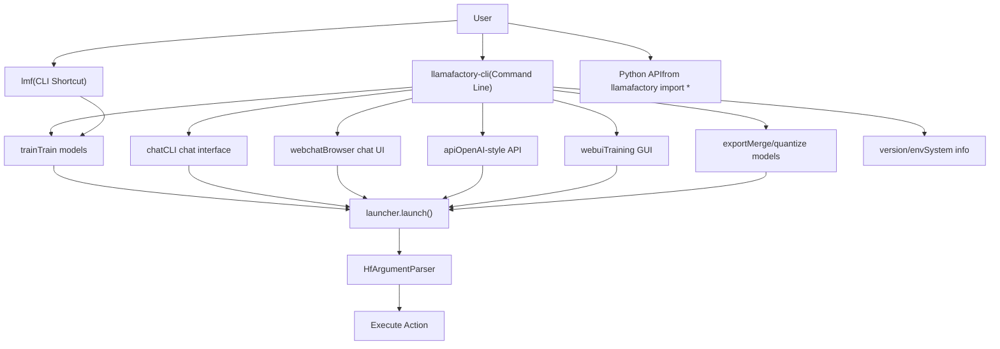
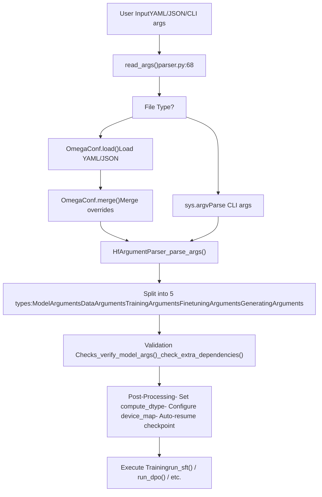
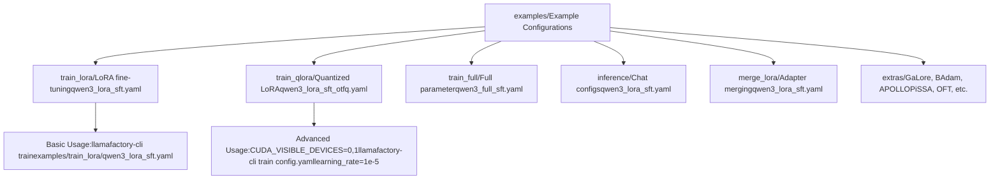

# 入门指南

相关源文件

-   [.github/workflows/tests.yml](https://github.com/hiyouga/LlamaFactory/blob/355d5c5e/.github/workflows/tests.yml)
-   [Makefile](https://github.com/hiyouga/LlamaFactory/blob/355d5c5e/Makefile)
-   [README.md](https://github.com/hiyouga/LlamaFactory/blob/355d5c5e/README.md?plain=1)
-   [README\_zh.md](https://github.com/hiyouga/LlamaFactory/blob/355d5c5e/README_zh.md?plain=1)
-   [docker/docker-cuda/Dockerfile.megatron](https://github.com/hiyouga/LlamaFactory/blob/355d5c5e/docker/docker-cuda/Dockerfile.megatron)
-   [examples/README.md](https://github.com/hiyouga/LlamaFactory/blob/355d5c5e/examples/README.md?plain=1)
-   [examples/README\_zh.md](https://github.com/hiyouga/LlamaFactory/blob/355d5c5e/examples/README_zh.md?plain=1)
-   [pyproject.toml](https://github.com/hiyouga/LlamaFactory/blob/355d5c5e/pyproject.toml)
-   [src/llamafactory/chat/base\_engine.py](https://github.com/hiyouga/LlamaFactory/blob/355d5c5e/src/llamafactory/chat/base_engine.py)
-   [src/llamafactory/chat/chat\_model.py](https://github.com/hiyouga/LlamaFactory/blob/355d5c5e/src/llamafactory/chat/chat_model.py)
-   [src/llamafactory/cli.py](https://github.com/hiyouga/LlamaFactory/blob/355d5c5e/src/llamafactory/cli.py)
-   [src/llamafactory/hparams/parser.py](https://github.com/hiyouga/LlamaFactory/blob/355d5c5e/src/llamafactory/hparams/parser.py)
-   [src/llamafactory/v1/launcher.py](https://github.com/hiyouga/LlamaFactory/blob/355d5c5e/src/llamafactory/v1/launcher.py)

本指南简要介绍了如何安装 LlamaFactory 并运行您的第一个训练任务。它涵盖了在几分钟内从零开始搭建起微调环境的关键步骤。有关详细的安装说明和环境配置，请参阅[安装与环境](/hiyouga/LlamaFactory/2.1-installation-and-environment)。有关全面的命令行界面 (CLI) 文档，请参阅 [CLI 命令与用法](/hiyouga/LlamaFactory/2.2-cli-commands-and-usage)。

## 前置条件概览

LlamaFactory 需要满足以下最低系统规格：

| 组件 | 最低要求 | 推荐配置 |
| --- | --- | --- |
| Python | 3.9 | 3.10+ |
| PyTorch | 2.0.0 | 2.6.0+ |
| Transformers | 4.49.0 | 4.50.0+ |
| CUDA (GPU) | 11.8+ | 12.1+ |
| GPU 显存 | 8GB | 24GB+ |

**操作系统**：Linux、Windows、macOS（通过 Apple Silicon 的 MPS 支持）

**硬件支持**：NVIDIA CUDA GPU、AMD ROCm GPU、昇腾 (Ascend) NPU、Apple MPS

来源：[README.md473-485](https://github.com/hiyouga/LlamaFactory/blob/355d5c5e/README.md?plain=1#L473-L485)

## 安装快速入门

### 选项 1：通过 PyPI 安装（推荐）

```
pip install llamafactory
```
### 选项 2：从源码安装

```
git clone --depth 1 https://github.com/hiyouga/LlamaFactory.git
cd LlamaFactory
pip install -e ".[torch,metrics]"
```
### 选项 3：使用 Docker

```
docker pull hiyouga/llamafactory:latest
docker run -it --gpus all hiyouga/llamafactory:latest bash
```
### 验证安装

安装完成后，验证 `llamafactory-cli` 命令是否可用：

```
llamafactory-cli version
```
您应该会看到类似以下的输出：

```
----------------------------------------------------------
| Welcome to LLaMA Factory, version X.X.X                |
|                                                         |
| Project page: https://github.com/hiyouga/LLaMA-Factory |
----------------------------------------------------------
```
来源：[README.md486-529](https://github.com/hiyouga/LlamaFactory/blob/355d5c5e/README.md?plain=1#L486-L529) [pyproject.toml84-86](https://github.com/hiyouga/LlamaFactory/blob/355d5c5e/pyproject.toml#L84-L86)

## 系统入口点

LlamaFactory 为不同的使用场景提供了多个入口点：


**CLI 入口点**：主要入口点位于 [src/llamafactory/cli.py16-31](https://github.com/hiyouga/LlamaFactory/blob/355d5c5e/src/llamafactory/cli.py#L16-L31)，它会检查 `USE_V1` 环境变量并启动相应的启动器。`llamafactory-cli` 和 `lmf` 都注册为命令行脚本。

来源：[src/llamafactory/cli.py1-32](https://github.com/hiyouga/LlamaFactory/blob/355d5c5e/src/llamafactory/cli.py#L1-L32) [pyproject.toml84-86](https://github.com/hiyouga/LlamaFactory/blob/355d5c5e/pyproject.toml#L84-L86) [src/llamafactory/v1/launcher.py44-63](https://github.com/hiyouga/LlamaFactory/blob/355d5c5e/src/llamafactory/v1/launcher.py#L44-L63)

## 您的首次训练任务

本节将引导您完成一个小模型的完整 LoRA 微调任务。

### 第 1 步：准备配置

创建一个 YAML 配置文件 `quickstart_train.yaml`：

```
### 模型配置
model_name_or_path: Qwen/Qwen2.5-0.5B-Instruct
trust_remote_code: true

### 训练方法
stage: sft
do_train: true
finetuning_type: lora
lora_target: all

### 数据集配置
dataset: identity
template: qwen
cutoff_len: 1024
max_samples: 1000
overwrite_cache: true
preprocessing_num_workers: 16

### 输出配置
output_dir: saves/qwen2.5-0.5b/lora/sft
logging_steps: 10
save_steps: 500
plot_loss: true
overwrite_output_dir: true

### 训练超参数
per_device_train_batch_size: 2
gradient_accumulation_steps: 4
learning_rate: 1.0e-4
num_train_epochs: 3.0
lr_scheduler_type: cosine
warmup_ratio: 0.1
bf16: true
ddp_timeout: 180000000

### LoRA 配置
lora_rank: 8
lora_alpha: 16
lora_dropout: 0
```
### 第 2 步：执行训练

运行训练命令：

```
llamafactory-cli train quickstart_train.yaml
```
或者通过命令行参数进行覆盖：

```
llamafactory-cli train quickstart_train.yaml \
    learning_rate=1e-5 \
    num_train_epochs=1
```
或者使用 shell 脚本处理更复杂的配置：

```
CUDA_VISIBLE_DEVICES=0 llamafactory-cli train quickstart_train.yaml
```
### 第 3 步：监控训练

在训练过程中，您会看到类似以下的输出：

```
Process rank: 0, world size: 1, device: cuda:0, distributed training: False, compute dtype: torch.bfloat16
Loading checkpoint shards: 100%|████████████| 2/2 [00:01<00:00]
...
{'loss': 2.3456, 'learning_rate': 9.8e-05, 'epoch': 0.1}
{'loss': 1.9876, 'learning_rate': 9.5e-05, 'epoch': 0.2}
```
训练产物将保存到 `output_dir`：

-   `adapter_config.json`：LoRA 适配器配置
-   `adapter_model.safetensors`：训练好的 LoRA 权重
-   `trainer_state.json`：训练状态和指标
-   `training_args.bin`：训练参数
-   `all_results.json`：最终评估结果

来源：[examples/README.md18-51](https://github.com/hiyouga/LlamaFactory/blob/355d5c5e/examples/README.md?plain=1#L18-L51) [README.md769-826](https://github.com/hiyouga/LlamaFactory/blob/355d5c5e/README.md?plain=1#L769-L826)

## 配置流

下图展示了配置如何从用户输入流向训练执行：


**关键函数**：

-   `read_args()`：确定输入类型并加载配置 [src/llamafactory/hparams/parser.py68-83](https://github.com/hiyouga/LlamaFactory/blob/355d5c5e/src/llamafactory/hparams/parser.py#L68-L83)
-   `_parse_args()`：解析为数据类 [src/llamafactory/hparams/parser.py85-99](https://github.com/hiyouga/LlamaFactory/blob/355d5c5e/src/llamafactory/hparams/parser.py#L85-L99)
-   `get_train_args()`：训练参数的主要入口点 [src/llamafactory/hparams/parser.py244-471](https://github.com/hiyouga/LlamaFactory/blob/355d5c5e/src/llamafactory/hparams/parser.py#L244-L471)
-   `_verify_model_args()`：交叉验证模型设置 [src/llamafactory/hparams/parser.py117-144](https://github.com/hiyouga/LlamaFactory/blob/355d5c5e/src/llamafactory/hparams/parser.py#L117-L144)
-   `_check_extra_dependencies()`：验证所需的软件包 [src/llamafactory/hparams/parser.py145-197](https://github.com/hiyouga/LlamaFactory/blob/355d5c5e/src/llamafactory/hparams/parser.py#L145-L197)

来源：[src/llamafactory/hparams/parser.py68-471](https://github.com/hiyouga/LlamaFactory/blob/355d5c5e/src/llamafactory/hparams/parser.py#L68-L471)

## 测试您的环境

### 测试 1：验证模型加载

测试系统能否加载模型：

```
llamafactory-cli chat examples/inference/qwen3_lora_sft.yaml
```
这将打开交互式聊天界面。输入一条消息并验证是否得到回复。输入 `exit` 退出。

### 测试 2：快速训练测试

运行一个微型训练测试（1 步）：

```
llamafactory-cli train quickstart_train.yaml \
    max_steps=1 \
    output_dir=test_output
```
这应该在不到一分钟内完成，并在 `test_output/` 中创建检查点文件。

### 测试 3：检查可用命令

验证所有命令是否可以访问：

```
llamafactory-cli --help
llamafactory-cli train --help
llamafactory-cli chat --help
```
来源：[examples/README.md202-217](https://github.com/hiyouga/LlamaFactory/blob/355d5c5e/examples/README.md?plain=1#L202-L217) [README.md857-894](https://github.com/hiyouga/LlamaFactory/blob/355d5c5e/README.md?plain=1#L857-L894)

## 首次运行常见问题

| 问题 | 现象 | 解决方案 |
| --- | --- | --- |
| CUDA 不可用 | `RuntimeError: No CUDA GPUs are available` | 安装支持 CUDA 的 PyTorch：`pip install torch --index-url https://download.pytorch.org/whl/cu121` |
| 显存溢出 | `torch.cuda.OutOfMemoryError` | 减小 `per_device_train_batch_size` 或开启 `quantization_bit: 4` |
| 模型未找到 | `OSError: model_name_or_path not found` | 登录 HuggingFace：`huggingface-cli login` |
| 分布式错误 | `ValueError: Please launch distributed training` | 使用 `FORCE_TORCHRUN=1` 或在多 GPU 上运行 |
| 缺少依赖项 | `ModuleNotFoundError` | 安装可选依赖项：`pip install llamafactory[metrics,deepspeed]` |

来源：[src/llamafactory/hparams/parser.py256-355](https://github.com/hiyouga/LlamaFactory/blob/355d5c5e/src/llamafactory/hparams/parser.py#L256-L355)

## 使用示例

LlamaFactory 在 `examples/` 目录中提供了丰富的示例：


**示例用法模式**：

```
# 基本 LoRA 训练
llamafactory-cli train examples/train_lora/qwen3_lora_sft.yaml

# 配合量化的 QLoRA
llamafactory-cli train examples/train_qlora/qwen3_lora_sft_otfq.yaml

# 使用 DeepSpeed 进行多 GPU 训练
FORCE_TORCHRUN=1 llamafactory-cli train examples/train_lora/qwen3_lora_sft_ds3.yaml

# 训练后的推理
llamafactory-cli chat examples/inference/qwen3_lora_sft.yaml

# 导出合并后的模型
llamafactory-cli export examples/merge_lora/qwen3_lora_sft.yaml
```
来源：[examples/README.md1-293](https://github.com/hiyouga/LlamaFactory/blob/355d5c5e/examples/README.md?plain=1#L1-L293) [examples/README\_zh.md1-293](https://github.com/hiyouga/LlamaFactory/blob/355d5c5e/examples/README_zh.md?plain=1#L1-L293)

## 环境变量

可以通过环境变量控制 LlamaFactory 的行为：

| 变量 | 用途 | 取值 |
| --- | --- | --- |
| `CUDA_VISIBLE_DEVICES` | 选择 GPU | `0`, `0,1`, `0,1,2,3` |
| `FORCE_TORCHRUN` | 强制使用分布式模式 | `1` (开启) |
| `WANDB_DISABLED` | 禁用 W&B 日志 | `true` (禁用) |
| `HF_TOKEN` | HuggingFace 身份验证 | 您的 HF 令牌 |
| `USE_MCA` | 开启 Megatron-Core 适配器 | `1` (开启) |
| `DISABLE_VERSION_CHECK` | 跳过版本校验 | `1` (跳过) |
| `LLAMAFACTORY_VERBOSITY` | 日志级别 | `DEBUG`, `INFO`, `WARNING` |

**使用环境变量的示例**：

```
CUDA_VISIBLE_DEVICES=0 \
WANDB_DISABLED=true \
HF_TOKEN=hf_xxxx \
llamafactory-cli train config.yaml
```
来源：[src/llamafactory/hparams/parser.py102-115](https://github.com/hiyouga/LlamaFactory/blob/355d5c5e/src/llamafactory/hparams/parser.py#L102-L115) [.github/workflows/tests.yml54-56](https://github.com/hiyouga/LlamaFactory/blob/355d5c5e/.github/workflows/tests.yml#L54-L56)

## 后续步骤

完成本快速入门后：

1.  **学习 CLI**：在 [CLI 命令与用法](/hiyouga/LlamaFactory/2.2-cli-commands-and-usage)中探索所有 CLI 命令和选项
2.  **配置您的环境**：在[安装与环境](/hiyouga/LlamaFactory/2.1-installation-and-environment)中设置针对特定硬件的优化
3.  **了解配置系统**：在[配置系统](/hiyouga/LlamaFactory/3-configuration-system)中深入了解参数类型
4.  **准备您的数据**：在[数据流水线](/hiyouga/LlamaFactory/4-data-pipeline)中学习数据集格式
5.  **选择训练方法**：在[训练系统](/hiyouga/LlamaFactory/6-training-system)中探索不同的训练阶段

**有用资源**：

-   官方示例：`examples/` 目录
-   模型模板：[src/llamafactory/data/template.py](https://github.com/hiyouga/LlamaFactory/blob/355d5c5e/src/llamafactory/data/template.py)
-   支持的模型：[src/llamafactory/extras/constants.py](https://github.com/hiyouga/LlamaFactory/blob/355d5c5e/src/llamafactory/extras/constants.py)
-   示例数据集：`data/` 目录

来源：[README.md67-92](https://github.com/hiyouga/LlamaFactory/blob/355d5c5e/README.md?plain=1#L67-L92)
