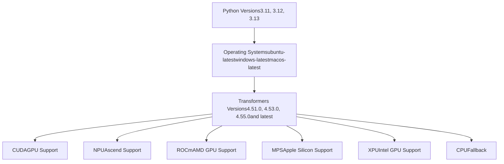
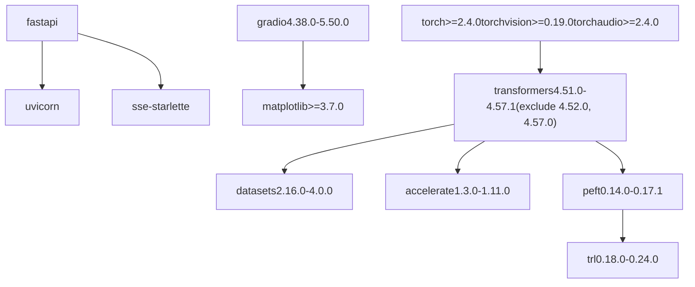
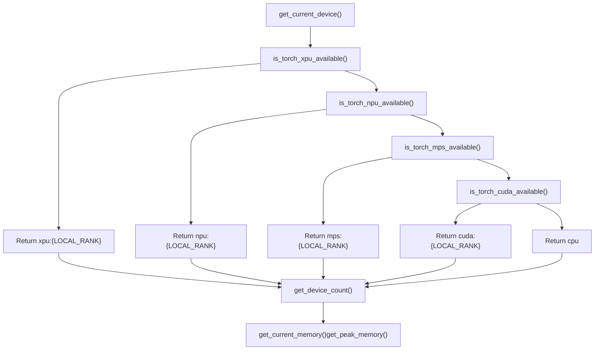
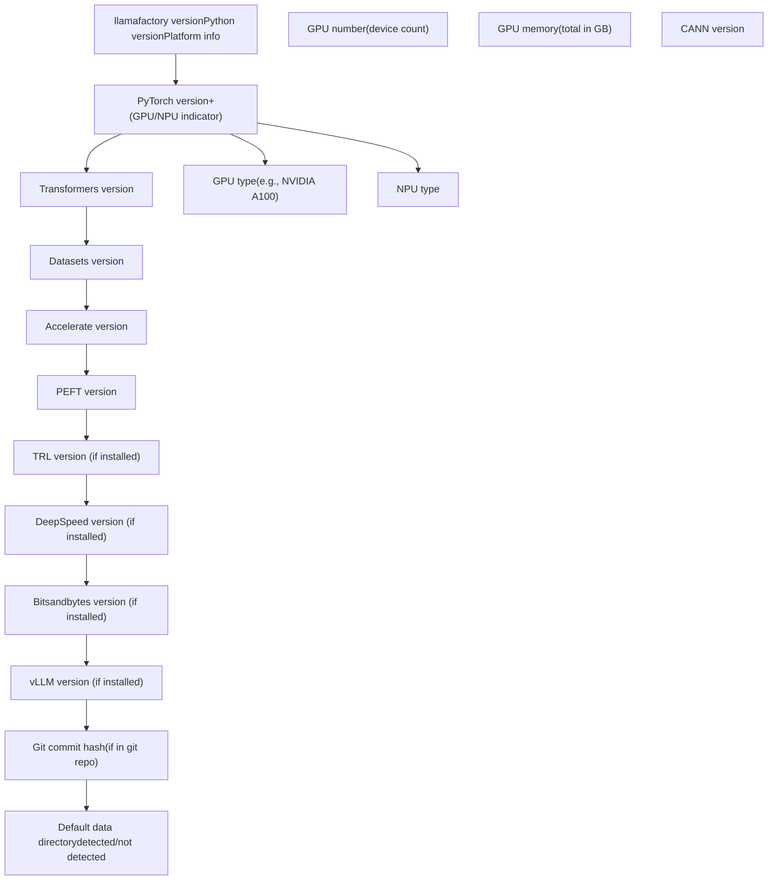

# 安装与环境

相关源文件

-   [.github/workflows/tests.yml](https://github.com/hiyouga/LlamaFactory/blob/355d5c5e/.github/workflows/tests.yml)
-   [Makefile](https://github.com/hiyouga/LlamaFactory/blob/355d5c5e/Makefile)
-   [docker/docker-cuda/Dockerfile.megatron](https://github.com/hiyouga/LlamaFactory/blob/355d5c5e/docker/docker-cuda/Dockerfile.megatron)
-   [pyproject.toml](https://github.com/hiyouga/LlamaFactory/blob/355d5c5e/pyproject.toml)
-   [src/llamafactory/\_\_init\_\_.py](https://github.com/hiyouga/LlamaFactory/blob/355d5c5e/src/llamafactory/__init__.py)
-   [src/llamafactory/extras/env.py](https://github.com/hiyouga/LlamaFactory/blob/355d5c5e/src/llamafactory/extras/env.py)
-   [src/llamafactory/extras/misc.py](https://github.com/hiyouga/LlamaFactory/blob/355d5c5e/src/llamafactory/extras/misc.py)
-   [src/llamafactory/extras/packages.py](https://github.com/hiyouga/LlamaFactory/blob/355d5c5e/src/llamafactory/extras/packages.py)
-   [src/llamafactory/model/model\_utils/attention.py](https://github.com/hiyouga/LlamaFactory/blob/355d5c5e/src/llamafactory/model/model_utils/attention.py)
-   [src/llamafactory/model/model\_utils/liger\_kernel.py](https://github.com/hiyouga/LlamaFactory/blob/355d5c5e/src/llamafactory/model/model_utils/liger_kernel.py)
-   [src/llamafactory/model/model\_utils/longlora.py](https://github.com/hiyouga/LlamaFactory/blob/355d5c5e/src/llamafactory/model/model_utils/longlora.py)
-   [src/llamafactory/model/model\_utils/moe.py](https://github.com/hiyouga/LlamaFactory/blob/355d5c5e/src/llamafactory/model/model_utils/moe.py)
-   [src/llamafactory/model/model\_utils/packing.py](https://github.com/hiyouga/LlamaFactory/blob/355d5c5e/src/llamafactory/model/model_utils/packing.py)
-   [src/llamafactory/model/model\_utils/valuehead.py](https://github.com/hiyouga/LlamaFactory/blob/355d5c5e/src/llamafactory/model/model_utils/valuehead.py)
-   [src/llamafactory/train/callbacks.py](https://github.com/hiyouga/LlamaFactory/blob/355d5c5e/src/llamafactory/train/callbacks.py)

本文档提供了安装 LlamaFactory 和配置运行环境的详细说明。它涵盖了系统要求、安装方法、依赖管理、硬件支持和环境配置。

有关安装后运行 CLI 命令的信息，请参阅 [CLI 命令与用法](/hiyouga/LlamaFactory/2.2-cli-commands-and-usage)。有关特定硬件的优化，请参阅[硬件支持](/hiyouga/LlamaFactory/9.1-hardware-support)。

---

## 概览与系统要求

### 支持的平台

LlamaFactory 支持多种平台和 Python 版本。测试矩阵验证了以下内容的兼容性：

| 组件 | 支持的版本 |
| --- | --- |
| Python | 3.11, 3.12, 3.13 |
| 操作系统 | Ubuntu (Linux), Windows, macOS |
| Transformers | 4.51.0 - 4.57.1 (不包括 4.52.0, 4.57.0) |

**测试矩阵**


**来源：** [.github/workflows/tests.yml27-46](https://github.com/hiyouga/LlamaFactory/blob/355d5c5e/.github/workflows/tests.yml#L27-L46) [pyproject.toml11](https://github.com/hiyouga/LlamaFactory/blob/355d5c5e/pyproject.toml#L11-L11) [pyproject.toml44](https://github.com/hiyouga/LlamaFactory/blob/355d5c5e/pyproject.toml#L44-L44)

---

## 安装方法

### 方法 1：从 PyPI 安装（推荐）

直接从 PyPI 安装最新的稳定版本：

```
pip install llamafactory
```
对于 PyPI 访问速度较慢地区的用户，请使用镜像源：

```
pip install llamafactory --index-url https://mirrors.aliyun.com/pypi/simple/
```
### 方法 2：从源码安装

用于开发或使用最新功能：

```
git clone https://github.com/hiyouga/LlamaFactory.git
cd LlamaFactory
pip install -e ".[dev]"
```
`-e` 标志以可编辑模式安装，允许您在无需重新安装的情况下修改源代码。

### 方法 3：使用 UV 安装（更快的替代方案）

使用 [uv](https://github.com/hiyouga/LlamaFactory/blob/355d5c5e/uv) 更快地解决依赖关系：

```
# 首先安装 uv
pip install uv

# 创建虚拟环境并安装
uv venv
uv pip install -e ".[dev]"
```
### 方法 4：Docker 安装

对于容器化部署，LlamaFactory 提供了 Docker 镜像：

```
docker pull registry.hub.docker.com/hiyouga/llamafactory:latest
docker run -it --gpus all registry.hub.docker.com/hiyouga/llamafactory:latest
```
对于具有优化 CUDA 环境的 Megatron-LM 支持：

```
# 摘自 Dockerfile.megatron
FROM nvcr.io/nvidia/pytorch:24.05-py3

# 安装带有 CUDA 12.4 的 PyTorch 2.6.0
RUN pip install torch==2.6.0 torchvision==0.21.0 torchaudio==2.6.0 \
    --index-url https://download.pytorch.org/whl/cu124

# 安装 LlamaFactory
COPY . /app
WORKDIR /app
RUN pip install --no-cache-dir -e ".[metrics]" --no-build-isolation
```
**来源：** [pyproject.toml1-77](https://github.com/hiyouga/LlamaFactory/blob/355d5c5e/pyproject.toml#L1-L77) [docker/docker-cuda/Dockerfile.megatron1-78](https://github.com/hiyouga/LlamaFactory/blob/355d5c5e/docker/docker-cuda/Dockerfile.megatron#L1-L78) [.github/workflows/tests.yml62-73](https://github.com/hiyouga/LlamaFactory/blob/355d5c5e/.github/workflows/tests.yml#L62-L73) [Makefile5-10](https://github.com/hiyouga/LlamaFactory/blob/355d5c5e/Makefile#L5-L10)

---

## 核心依赖

### 必选软件包

LlamaFactory 需要几个具有特定版本约束的核心软件包：

**依赖版本要求**


**版本检查机制**

`check_dependencies()` 函数在运行时强制执行版本约束：

```python
# 摘自 src/llamafactory/extras/misc.py:95-102
def check_dependencies() -> None:
    check_version("transformers>=4.51.0,<=4.57.1")
    check_version("datasets>=2.16.0,<=4.0.0")
    check_version("accelerate>=1.3.0,<=1.11.0")
    check_version("peft>=0.14.0,<=0.17.1")
    check_version("trl>=0.18.0,<=0.24.0")
```
用户可以通过设置 `DISABLE_VERSION_CHECK=1` 来禁用版本检查，但这可能会导致意外行为。

**来源：** [pyproject.toml39-76](https://github.com/hiyouga/LlamaFactory/blob/355d5c5e/pyproject.toml#L39-L76) [src/llamafactory/extras/misc.py95-102](https://github.com/hiyouga/LlamaFactory/blob/355d5c5e/src/llamafactory/extras/misc.py#L95-L102)

### 可选依赖项

使用 extras 安装附加功能：

| 附加项 | 用途 | 安装命令 |
| --- | --- | --- |
| `dev` | 开发工具 (pre-commit, ruff, pytest) | `pip install "llamafactory[dev]"` |
| `metrics` | 评估指标 (nltk, jieba, rouge-chinese) | `pip install "llamafactory[metrics]"` |
| `deepspeed` | 使用 DeepSpeed 进行分布式训练 | `pip install "llamafactory[deepspeed]"` |

**安装所有功能的完整命令**

```
pip install "llamafactory[dev,metrics,deepspeed]"
```
**来源：** [pyproject.toml79-82](https://github.com/hiyouga/LlamaFactory/blob/355d5c5e/pyproject.toml#L79-L82)

---

## 硬件支持与检测

### 支持的加速器

LlamaFactory 会自动检测并利用可用的硬件加速器：

**硬件检测流程**


**设备检测实现**

系统为不同的硬件后端提供统一的 API：

| 函数 | 用途 | 返回值 |
| --- | --- | --- |
| `get_current_device()` | 返回当前活动设备 | `torch.device` 对象 |
| `get_device_count()` | 获取可用设备数量 | 整数 (CPU 为 0) |
| `get_current_memory()` | 获取已用/总内存 | `Tuple[int, int]` (字节) |
| `get_peak_memory()` | 获取峰值已分配/预留内存 | `Tuple[int, int]` (字节) |
| `is_accelerator_available()` | 检查是否存在加速器 | 布尔值 |

**来源：** [src/llamafactory/extras/misc.py144-228](https://github.com/hiyouga/LlamaFactory/blob/355d5c5e/src/llamafactory/extras/misc.py#L144-L228)

### 精度支持

**FP16 与 BF16 可用性检查**

```python
# 摘自 src/llamafactory/extras/misc.py:41-45
_is_fp16_available = is_torch_npu_available() or is_torch_cuda_available()

try:
    _is_bf16_available = is_torch_bf16_gpu_available() or \
                        (is_torch_npu_available() and torch.npu.is_bf16_supported())
except Exception:
    _is_bf16_available = False
```
`infer_optim_dtype()` 函数会自动选择最佳精度：

| 条件 | 选定 dtype | 理由 |
| --- | --- | --- |
| BF16 可用 且 (模型为 BF16 或 模型 dtype 未知) | `torch.bfloat16` | BF16 提供更好的数值稳定性 |
| FP16 可用 | `torch.float16` | FP16 具有更高的内存效率 |
| 其他情况 | `torch.float32` | 回退至 FP32 |

**来源：** [src/llamafactory/extras/misc.py41-45](https://github.com/hiyouga/LlamaFactory/blob/355d5c5e/src/llamafactory/extras/misc.py#L41-L45) [src/llamafactory/extras/misc.py214-222](https://github.com/hiyouga/LlamaFactory/blob/355d5c5e/src/llamafactory/extras/misc.py#L214-L222)

### 内存管理

**GPU 内存清理**

```python
# 摘自 src/llamafactory/extras/misc.py:254-264
def torch_gc() -> None:
    """清理设备显存。"""
    gc.collect()
    if is_torch_xpu_available():
        torch.xpu.empty_cache()
    elif is_torch_npu_available():
        torch.npu.empty_cache()
    elif is_torch_mps_available():
        torch.mps.empty_cache()
    elif is_torch_cuda_available():
        torch.cuda.empty_cache()
```
**来源：** [src/llamafactory/extras/misc.py254-264](https://github.com/hiyouga/LlamaFactory/blob/355d5c5e/src/llamafactory/extras/misc.py#L254-L264)

---

## 环境变量

LlamaFactory 使用环境变量来控制系统行为，无需修改代码。

### 核心配置变量

**环境变量参考**

```mermaid
flowchart TD
    LlamaFactoryVerbosity["LLAMAFACTORY_VERBOSITYLog levelValues: DEBUG, INFO, WARN, ERROR"]
    LlamaBoardEnabled["LLAMABOARD_ENABLEDWeb UI mode activeSet automatically"]
    LlamaBoardWorkDir["LLAMABOARD_WORKDIRWeb UI working directorySet automatically"]
    ForceTorchrun["FORCE_TORCHRUNForce torchrun usageDefault: disabled"]
    UseRay["USE_RAYEnable Ray backendDefault: disabled"]
    UseKT["USE_KTUse KTransformersDefault: disabled"]
    UseModelScope["USE_MODELSCOPE_HUBUse ModelScope HubDefault: disabled"]
    UseOpenMind["USE_OPENMIND_HUBUse OpenMind HubDefault: disabled"]
    RecordVRAM["RECORD_VRAMTrack memory usageDefault: disabled"]
    WandBProject["WANDB_PROJECTWandB project nameDefault: llamafactory"]
    DisableVersionCheck["DISABLE_VERSION_CHECKSkip dependency checksDefault: 0"]
    ForceCheckImports["FORCE_CHECK_IMPORTSEnable import checksDefault: disabled"]
```


**Hub 选择逻辑**

系统支持多个模型 Hub，优先级顺序如下：

```python
# 摘自 src/llamafactory/extras/misc.py:267-302
def try_download_model_from_other_hub(model_args):
    if (not use_modelscope() and not use_openmind()) or os.path.exists(model_args.model_name_or_path):
        return model_args.model_name_or_path  # 使用 HuggingFace 或本地路径

    if use_modelscope():
        # 使用 ModelScope Hub (中国镜像)
        check_version("modelscope>=1.14.0", mandatory=True)
        from modelscope import snapshot_download
        # ... 下载模型

    if use_openmind():
        # 使用 OpenMind Hub
        check_version("openmind>=0.8.0", mandatory=True)
        from openmind.utils.hub import snapshot_download
        # ... 下载模型
```
**来源：** [src/llamafactory/\_\_init\_\_.py18-26](https://github.com/hiyouga/LlamaFactory/blob/355d5c5e/src/llamafactory/__init__.py#L18-L26) [src/llamafactory/extras/misc.py231-318](https://github.com/hiyouga/LlamaFactory/blob/355d5c5e/src/llamafactory/extras/misc.py#L231-L318) [src/llamafactory/train/callbacks.py185-189](https://github.com/hiyouga/LlamaFactory/blob/355d5c5e/src/llamafactory/train/callbacks.py#L185-L189)

### 设置环境变量

**Linux/macOS:**

```bash
export DISABLE_VERSION_CHECK=1
export RECORD_VRAM=1
export USE_MODELSCOPE_HUB=1
```
**Windows (PowerShell):**

```powershell
$env:DISABLE_VERSION_CHECK="1"
$env:RECORD_VRAM="1"
$env:USE_MODELSCOPE_HUB="1"
```
**Python 脚本中:**

```python
import os
os.environ["DISABLE_VERSION_CHECK"] = "1"
os.environ["RECORD_VRAM"] = "1"
```
**来源：** [src/llamafactory/\_\_init\_\_.py20-26](https://github.com/hiyouga/LlamaFactory/blob/355d5c5e/src/llamafactory/__init__.py#L20-L26) [src/llamafactory/extras/misc.py231-234](https://github.com/hiyouga/LlamaFactory/blob/355d5c5e/src/llamafactory/extras/misc.py#L231-L234)

---

## 版本信息与验证

### 检查安装情况

安装后，使用 `print_env()` 函数验证设置：

```bash
llamafactory-cli env
```
或者在 Python 中：

```python
from llamafactory.extras.env import print_env
print_env()
```
**输出结构示例**


**环境报告实现**

`print_env()` 函数会收集全面的系统信息：

```python
# 摘自 src/llamafactory/extras/env.py:25-102
def print_env() -> None:
    info = OrderedDict({
        "`llamafactory` version": VERSION,
        "Platform": platform.platform(),
        "Python version": platform.python_version(),
        "PyTorch version": torch.__version__,
        "Transformers version": transformers.__version__,
        "Datasets version": datasets.__version__,
        "Accelerate version": accelerate.__version__,
        "PEFT version": peft.__version__,
    })

    if is_torch_cuda_available():
        info["PyTorch version"] += " (GPU)"
        info["GPU type"] = torch.cuda.get_device_name()
        info["GPU number"] = torch.cuda.device_count()
        info["GPU memory"] = f"{torch.cuda.mem_get_info()[1] / (1024**3):.2f}GB"
        # 检测到的其他可选软件包...
```
**来源：** [src/llamafactory/extras/env.py22-102](https://github.com/hiyouga/LlamaFactory/blob/355d5c5e/src/llamafactory/extras/env.py#L22-L102)

---

## 高级安装场景

### 使用特定后端进行安装

**用于高吞吐量推理的 vLLM:**

```bash
pip install llamafactory vllm
```
**用于分布式训练的 DeepSpeed:**

```bash
pip install "llamafactory[deepspeed]"
```
**用于提升性能的 Liger Kernel:**

```bash
pip install llamafactory liger-kernel
```
**安装多个后端:**

```bash
pip install llamafactory vllm "deepspeed>=0.10.0" liger-kernel
```
**来源：** [pyproject.toml82](https://github.com/hiyouga/LlamaFactory/blob/355d5c5e/pyproject.toml#L82-L82) [src/llamafactory/extras/packages.py53-124](https://github.com/hiyouga/LlamaFactory/blob/355d5c5e/src/llamafactory/extras/packages.py#L53-L124)

### 自定义软件包安装

对于需要特殊构建标志的软件包（例如 gptmodel, autoawq）:

```python
# 摘自 src/llamafactory/extras/misc.py:76-92
def check_version(requirement: str, mandatory: bool = False) -> None:
    if "gptmodel" in requirement or "autoawq" in requirement:
        pip_command = f"pip install {requirement} --no-build-isolation"
    else:
        pip_command = f"pip install {requirement}"
        # 提供带有修复命令的有用错误信息
```
**示例:**

```bash
# 安装需要自定义构建的软件包
pip install gptmodel --no-build-isolation
pip install autoawq --no-build-isolation
```
**来源：** [src/llamafactory/extras/misc.py76-92](https://github.com/hiyouga/LlamaFactory/blob/355d5c5e/src/llamafactory/extras/misc.py#L76-L92)

### ModelScope 与 OpenMind Hub 配置

对于访问 Hugging Face 受限地区的用户，系统支持替代 Hub：

**ModelScope Hub (中国):**

```bash
export USE_MODELSCOPE_HUB=1
# 需要安装: pip install "modelscope>=1.14.0"
```
**OpenMind Hub:**

```bash
export USE_OPENMIND_HUB=1
# 需要安装: pip install "openmind>=0.8.0"
```
系统会自动从配置的 Hub 下载模型，并使用文件锁以防止并发下载冲突：

```python
# 摘自 src/llamafactory/extras/misc.py:281-286
with WeakFileLock(os.path.abspath(os.path.expanduser("~/.cache/llamafactory/modelscope.lock"))):
    model_path = snapshot_download(
        model_args.model_name_or_path,
        revision=revision,
        cache_dir=model_args.cache_dir,
    )
```
**来源：** [src/llamafactory/extras/misc.py267-302](https://github.com/hiyouga/LlamaFactory/blob/355d5c5e/src/llamafactory/extras/misc.py#L267-L302)

---

## 故障排除

### 常见安装问题

**问题：版本冲突**

```bash
# 现象: 导入错误或版本不匹配错误
# 解决方案: 使用版本检查
python -c "from llamafactory.extras.misc import check_dependencies; check_dependencies()"

# 或临时禁用版本检查
export DISABLE_VERSION_CHECK=1
```
**问题：未检测到 CUDA**

```bash
# 验证 CUDA 可用性
python -c "import torch; print(f'CUDA Available: {torch.cuda.is_available()}')"
python -c "import torch; print(f'CUDA Version: {torch.version.cuda}')"

# 检查设备检测情况
python -c "from llamafactory.extras.misc import get_current_device; print(get_current_device())"
```
**问题：内存不足**

```bash
# 开启显存记录以监控显存使用情况
export RECORD_VRAM=1

# 或手动调用 torch_gc() 以释放内存
python -c "from llamafactory.extras.misc import torch_gc; torch_gc()"
```
**问题：FlashAttention 不可用**

```bash
# 检查注意力机制实现的运行情况
python -c "from transformers.utils import is_flash_attn_2_available; print(f'Flash Attention 2: {is_flash_attn_2_available()}')"
```
**来源：** [src/llamafactory/extras/misc.py76-102](https://github.com/hiyouga/LlamaFactory/blob/355d5c5e/src/llamafactory/extras/misc.py#L76-L102) [src/llamafactory/extras/misc.py144-264](https://github.com/hiyouga/LlamaFactory/blob/355d5c5e/src/llamafactory/extras/misc.py#L144-L264) [src/llamafactory/model/model\_utils/attention.py31-103](https://github.com/hiyouga/LlamaFactory/blob/355d5c5e/src/llamafactory/model/model_utils/attention.py#L31-L103)

### 软件包可用性检查

LlamaFactory 提供了实用函数来检查可选软件包的可用性：

| 函数 | 检查的软件包 | 用途 |
| --- | --- | --- |
| `is_vllm_available()` | vllm | 高吞吐量推理 |
| `is_gradio_available()` | gradio | Web UI |
| `is_galore_available()` | galore\_torch | GaLore 优化器 |
| `is_apollo_available()` | apollo\_torch | Apollo 优化器 |
| `is_safetensors_available()` | safetensors | 安全张量序列化 |
| `is_ray_available()` | ray | 分布式计算 |
| `is_kt_available()` | ktransformers | KTransformers 引擎 |

**来源：** [src/llamafactory/extras/packages.py30-125](https://github.com/hiyouga/LlamaFactory/blob/355d5c5e/src/llamafactory/extras/packages.py#L30-L125)

---

## 总结

本页面涵盖了 LlamaFactory 完整的安装与环境设置流程：

1.  **系统要求**：支持 Python 3.11-3.13，多操作系统，以及经过测试的 Transformers 版本。
2.  **安装方法**：包括 PyPI, 源码, UV 和 Docker 安装。
3.  **依赖管理**：具有版本约束的核心及可选软件包要求。
4.  **硬件支持**：自动检测 CUDA, NPU, ROCm, MPS, XPU 和 CPU。
5.  **环境变量**：针对 Hub, 监控和执行的配置选项。
6.  **验证方法**：使用 `print_env()` 验证安装情况。
7.  **高级场景**：特定后端的安装及 Hub 配置。

安装完成后，请继续阅读 [CLI 命令与用法](/hiyouga/LlamaFactory/2.2-cli-commands-and-usage) 以学习如何使用 LlamaFactory 的命令行界面。
