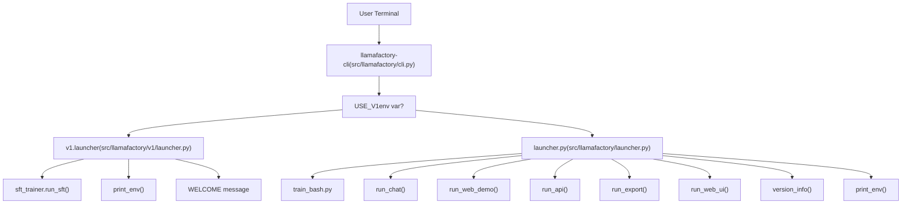
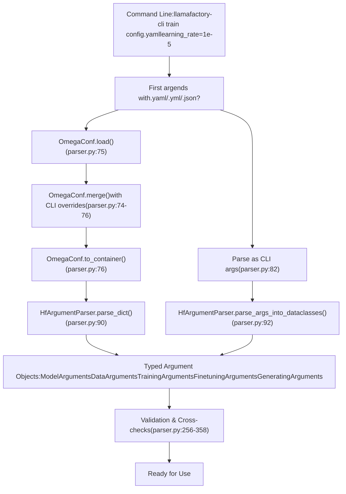
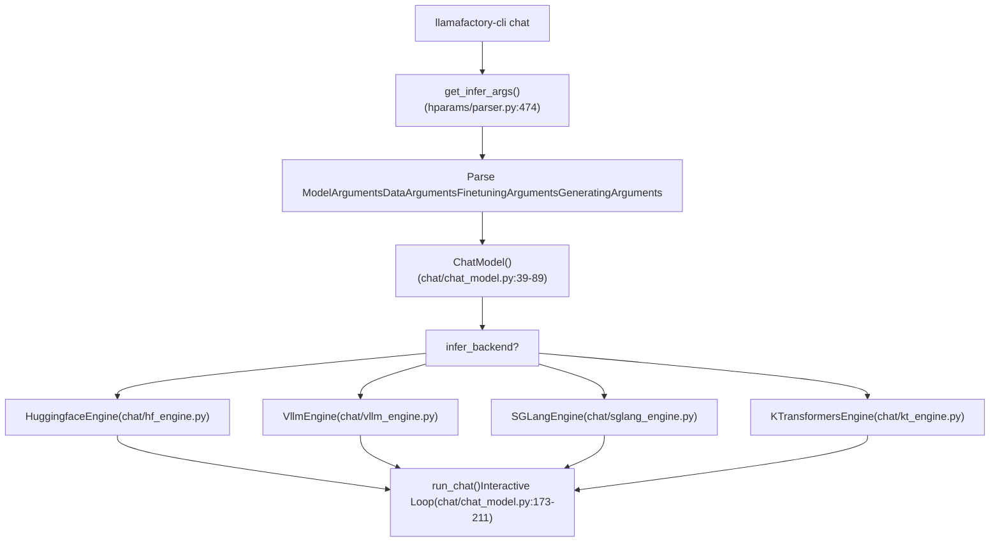
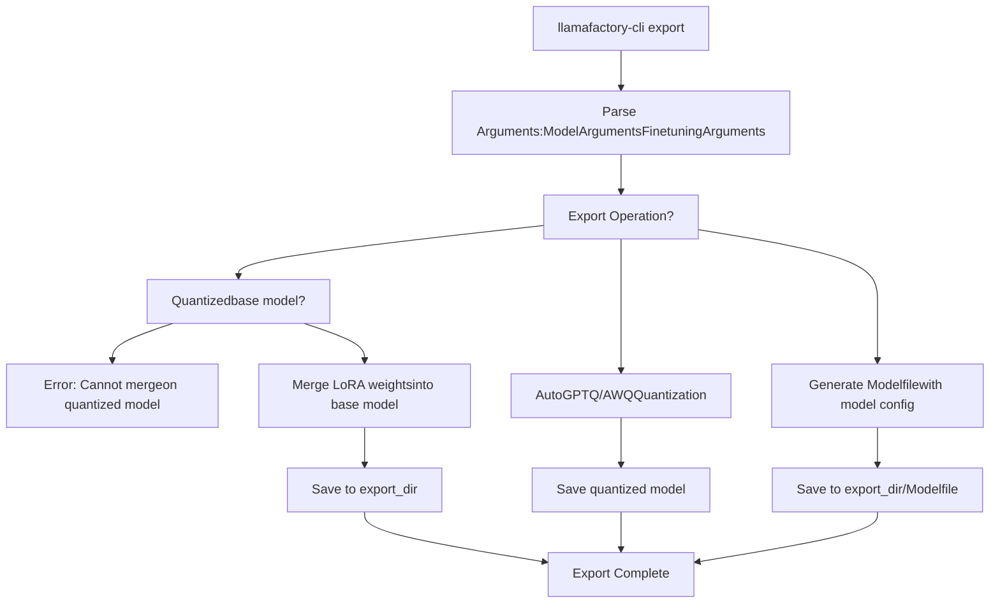
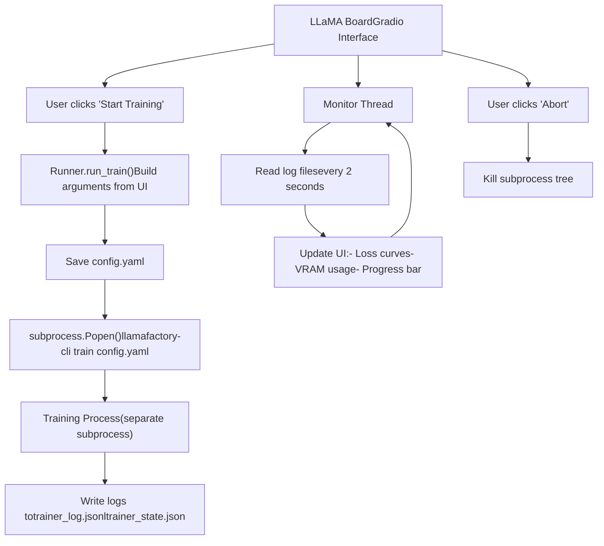

# CLI 命令与用法

相关源文件

-   [README.md](https://github.com/hiyouga/LlamaFactory/blob/355d5c5e/README.md?plain=1)
-   [README\_zh.md](https://github.com/hiyouga/LlamaFactory/blob/355d5c5e/README_zh.md?plain=1)
-   [examples/README.md](https://github.com/hiyouga/LlamaFactory/blob/355d5c5e/examples/README.md?plain=1)
-   [examples/README\_zh.md](https://github.com/hiyouga/LlamaFactory/blob/355d5c5e/examples/README_zh.md?plain=1)
-   [src/llamafactory/chat/base\_engine.py](https://github.com/hiyouga/LlamaFactory/blob/355d5c5e/src/llamafactory/chat/base_engine.py)
-   [src/llamafactory/chat/chat\_model.py](https://github.com/hiyouga/LlamaFactory/blob/355d5c5e/src/llamafactory/chat/chat_model.py)
-   [src/llamafactory/cli.py](https://github.com/hiyouga/LlamaFactory/blob/355d5c5e/src/llamafactory/cli.py)
-   [src/llamafactory/hparams/parser.py](https://github.com/hiyouga/LlamaFactory/blob/355d5c5e/src/llamafactory/hparams/parser.py)
-   [src/llamafactory/v1/launcher.py](https://github.com/hiyouga/LlamaFactory/blob/355d5c5e/src/llamafactory/v1/launcher.py)

本文档为 `llamafactory-cli` 命令行界面提供了全面的参考。该界面作为所有 LlamaFactory 操作的主要入口点，包括训练、推理、模型导出和启动服务。有关详细的配置参数，请参阅[配置参数参考](/hiyouga/LlamaFactory/10.3-configuration-parameter-reference)。有关安装说明，请参阅[安装与环境](/hiyouga/LlamaFactory/2.1-installation-and-environment)。

---

## 概览

`llamafactory-cli` 命令（别名为 `lmf`）为所有 LlamaFactory 功能提供了统一界面。它根据第一个位置参数将用户命令路由到相应的子系统，并处理来自 YAML/JSON 文件或命令行参数的配置。

**入口点架构**


**来源：** [src/llamafactory/cli.py16-24](https://github.com/hiyouga/LlamaFactory/blob/355d5c5e/src/llamafactory/cli.py#L16-L24) [src/llamafactory/v1/launcher.py44-63](https://github.com/hiyouga/LlamaFactory/blob/355d5c5e/src/llamafactory/v1/launcher.py#L44-L63)

---

## 命令参考表

| 命令 | 用途 | 配置文件 | 需要训练参数 | 需要 GPU |
| --- | --- | --- | --- | --- |
| `train` | 训练或微调模型 | 必填 | 是 | 是（通常需要） |
| `chat` | 交互式命令行聊天界面 | 可选 | 否 | 是 |
| `webchat` | 启动 Gradio 聊天界面 | 可选 | 否 | 是 |
| `api` | 启动 OpenAI 兼容的 API 服务器 | 可选 | 否 | 是 |
| `export` | 合并适配器或量化模型 | 必填 | 否 | 可选 |
| `webui` | 启动 LLaMA Board 训练 GUI | 可选 | 否 | 否 |
| `version` | 显示版本信息 | 不适用 | 否 | 否 |
| `env` | 打印环境诊断信息 | 不适用 | 否 | 否 |

**来源：** [README.md49-86](https://github.com/hiyouga/LlamaFactory/blob/355d5c5e/README.md?plain=1#L49-L86) [examples/README.md18-35](https://github.com/hiyouga/LlamaFactory/blob/355d5c5e/examples/README.md?plain=1#L18-L35)

---

## 配置方法

LlamaFactory 支持三种传递配置的方法，这些方法可以组合使用：

### YAML/JSON 配置文件

指定训练或推理参数的主要方法。第一个以 `.yaml`、`.yml` 或 `.json` 结尾的命令行参数将被视为配置文件路径。

**配置文件处理流**


**来源：** [src/llamafactory/hparams/parser.py68-99](https://github.com/hiyouga/LlamaFactory/blob/355d5c5e/src/llamafactory/hparams/parser.py#L68-L99)

**YAML 配置示例：**

```yaml
### 模型
model_name_or_path: Qwen/Qwen3-4B-Instruct-2507
template: qwen3_nothink

### 方法
stage: sft
finetuning_type: lora
lora_rank: 8
lora_target: all

### 数据集
dataset: alpaca_en_demo
cutoff_len: 1024

### 输出
output_dir: saves/qwen3-4b/lora/sft
logging_steps: 10
save_steps: 500

### 训练
per_device_train_batch_size: 2
learning_rate: 1e-4
num_train_epochs: 3.0
```
**来源：** [examples/train\_lora/qwen3\_lora\_sft.yaml](https://github.com/hiyouga/LlamaFactory/blob/355d5c5e/examples/train_lora/qwen3_lora_sft.yaml)

### 命令行参数

直接在命令行上覆盖单个参数：

```bash
llamafactory-cli train config.yaml \
    learning_rate=1e-5 \
    per_device_train_batch_size=4 \
    logging_steps=1
```
**来源：** [examples/README.md26-30](https://github.com/hiyouga/LlamaFactory/blob/355d5c5e/examples/README.md?plain=1#L26-L30) [src/llamafactory/hparams/parser.py74](https://github.com/hiyouga/LlamaFactory/blob/355d5c5e/src/llamafactory/hparams/parser.py#L74-L74)

### 混合方法

将基础配置文件与命令行覆盖相结合，以获得灵活性：

```bash
CUDA_VISIBLE_DEVICES=0,1 llamafactory-cli train examples/train_lora/qwen3_lora_sft.yaml \
    output_dir=saves/custom_run \
    num_train_epochs=5.0
```
**来源：** [examples/README.md27-30](https://github.com/hiyouga/LlamaFactory/blob/355d5c5e/examples/README.md?plain=1#L27-L30)

---

## 命令详情

### train

根据配置中的 `stage` 参数执行模型训练（预训练、微调、奖励模型训练、PPO、DPO 等）。

**基本语法：**

```bash
llamafactory-cli train <config_file.yaml> [overrides...]
```
**配置要求：**

-   **必需参数：** 定义在 `ModelArguments`, `DataArguments`, `TrainingArguments`, `FinetuningArguments`, `GeneratingArguments` 中
-   **关键参数：** `model_name_or_path`, `dataset`, `stage`, `finetuning_type`, `output_dir`
-   **验证：** 在 [parser.py256-358](https://github.com/hiyouga/LlamaFactory/blob/355d5c5e/parser.py#L256-L358) 中执行了广泛的交叉验证

**示例：**

| 训练类型 | 命令 | 配置文件 |
| --- | --- | --- |
| LoRA SFT | `llamafactory-cli train examples/train_lora/qwen3_lora_sft.yaml` | [examples/train\_lora/qwen3\_lora\_sft.yaml](https://github.com/hiyouga/LlamaFactory/blob/355d5c5e/examples/train_lora/qwen3_lora_sft.yaml) |
| QLoRA SFT | `llamafactory-cli train examples/train_qlora/qwen3_lora_sft_otfq.yaml` | [examples/train\_qlora/qwen3\_lora\_sft\_otfq.yaml](https://github.com/hiyouga/LlamaFactory/blob/355d5c5e/examples/train_qlora/qwen3_lora_sft_otfq.yaml) |
| 全参数 SFT | `FORCE_TORCHRUN=1 llamafactory-cli train examples/train_full/qwen3_full_sft.yaml` | [examples/train\_full/qwen3\_full\_sft.yaml](https://github.com/hiyouga/LlamaFactory/blob/355d5c5e/examples/train_full/qwen3_full_sft.yaml) |
| DPO 训练 | `llamafactory-cli train examples/train_lora/qwen3_lora_dpo.yaml` | [examples/train\_lora/qwen3\_lora\_dpo.yaml](https://github.com/hiyouga/LlamaFactory/blob/355d5c5e/examples/train_lora/qwen3_lora_dpo.yaml) |
| 奖励模型训练 | `llamafactory-cli train examples/train_lora/qwen3_lora_reward.yaml` | [examples/train\_lora/qwen3\_lora\_reward.yaml](https://github.com/hiyouga/LlamaFactory/blob/355d5c5e/examples/train_lora/qwen3_lora_reward.yaml) |
| 多模态 SFT | `llamafactory-cli train examples/train_lora/qwen3vl_lora_sft.yaml` | [examples/train\_lora/qwen3vl\_lora\_sft.yaml](https://github.com/hiyouga/LlamaFactory/blob/355d5c5e/examples/train_lora/qwen3vl_lora_sft.yaml) |

**多节点训练：**

对于跨多个节点的分布式训练，请使用环境变量：

```bash
# 节点 0
FORCE_TORCHRUN=1 NNODES=2 NODE_RANK=0 MASTER_ADDR=192.168.0.1 MASTER_PORT=29500 \
    llamafactory-cli train examples/train_lora/qwen3_lora_sft.yaml

# 节点 1
FORCE_TORCHRUN=1 NNODES=2 NODE_RANK=1 MASTER_ADDR=192.168.0.1 MASTER_PORT=29500 \
    llamafactory-cli train examples/train_lora/qwen3_lora_sft.yaml
```
**具备容错能力的弹性训练：**

```bash
FORCE_TORCHRUN=1 MIN_NNODES=1 MAX_NNODES=3 MAX_RESTARTS=3 RDZV_ID=llamafactory \
    MASTER_ADDR=192.168.0.1 MASTER_PORT=29500 \
    llamafactory-cli train examples/train_full/qwen3_full_sft.yaml
```
**来源：** [examples/README.md20-108](https://github.com/hiyouga/LlamaFactory/blob/355d5c5e/examples/README.md?plain=1#L20-L108) [examples/README\_zh.md20-116](https://github.com/hiyouga/LlamaFactory/blob/355d5c5e/examples/README_zh.md?plain=1#L20-L116) [src/llamafactory/hparams/parser.py244-471](https://github.com/hiyouga/LlamaFactory/blob/355d5c5e/src/llamafactory/hparams/parser.py#L244-L471)

---

### chat

启动一个交互式命令行聊天界面，用于对训练好的模型进行推理。

**基本语法：**

```bash
llamafactory-cli chat <config_file.yaml> [overrides...]
```
**配置要求：**

-   **必需参数：** 定义在 `ModelArguments`, `DataArguments`, `FinetuningArguments`, `GeneratingArguments` 中
-   **关键参数：** `model_name_or_path`, `template`, `adapter_name_or_path`（针对 LoRA）, `finetuning_type`

**交互式命令：**

-   正常输入消息即可与模型聊天
-   `clear` - 清除对话历史并释放内存
-   `exit` - 退出应用

**示例：**

```bash
llamafactory-cli chat examples/inference/qwen3_lora_sft.yaml
```
**会话示例：**

```
Welcome to the CLI application, use `clear` to remove the history, use `exit` to exit the application.

User: What is machine learning?
Assistant: Machine learning is a subset of artificial intelligence...

User: clear
History has been removed.

User: exit
```
**推理后端引擎选择：**

chat 命令使用由 `infer_backend` 参数指定的推理后端：

-   `huggingface`（默认值） - 标准 HuggingFace transformers
-   `vllm` - 高吞吐量 vLLM 引擎
-   `sglang` - SGLang 推理服务器
-   `kt` - KTransformers CPU-GPU 混合引擎

**实现详情：**


**来源：** [src/llamafactory/chat/chat\_model.py39-89](https://github.com/hiyouga/LlamaFactory/blob/355d5c5e/src/llamafactory/chat/chat_model.py#L39-L89) [src/llamafactory/chat/chat\_model.py173-211](https://github.com/hiyouga/LlamaFactory/blob/355d5c5e/src/llamafactory/chat/chat_model.py#L173-L211) [examples/README.md202-205](https://github.com/hiyouga/LlamaFactory/blob/355d5c5e/examples/README.md?plain=1#L202-L205)

---

### webchat

启动一个基于 Gradio 的 Web 界面，用于与训练好的模型进行交互式聊天。

**基本语法：**

```bash
llamafactory-cli webchat <config_file.yaml> [overrides...]
```
**配置要求：**

-   与 `chat` 命令相同
-   Gradio 服务器的其他可选参数：`server_name`, `server_port`, `share`

**示例：**

```bash
llamafactory-cli webchat examples/inference/qwen3_lora_sft.yaml
```
**功能：**

-   基于 Web 的聊天界面
-   对话历史显示
-   参数调节（temperature, top\_p, max\_tokens）
-   支持多模态输入（图像、视频、音频），前提是模型支持
-   通过 `share=True` 获取可共享的公开 URL

**来源：** [examples/README.md207-211](https://github.com/hiyouga/LlamaFactory/blob/355d5c5e/examples/README.md?plain=1#L207-L211) [examples/README\_zh.md207-211](https://github.com/hiyouga/LlamaFactory/blob/355d5c5e/examples/README_zh.md?plain=1#L207-L211)

---

## api

启动一个 OpenAI 兼容的 API 服务器，用于模型推理，支持流式和非流式响应。

**基本语法：**

```bash
llamafactory-cli api <config_file.yaml> [overrides...]
```
**配置要求：**

-   与 `chat` 命令相同
-   其他可选参数：`server_name`, `server_port`, `api_key`

**示例：**

```bash
llamafactory-cli api examples/inference/qwen3_lora_sft.yaml
```
**API 端点：**

该服务器实现了 OpenAI 兼容的端点：

| 端点 | 方法 | 用途 |
| --- | --- | --- |
| `/v1/models` | GET | 列出可用模型 |
| `/v1/chat/completions` | POST | 聊天补全（流式/非流式） |
| `/v1/completions` | POST | 文本补全 |
| `/v1/embeddings` | POST | 生成嵌入 |
| `/v1/score/evaluation` | POST | 奖励模型评分 |

**API 调用示例：**

```bash
curl -X POST http://localhost:8000/v1/chat/completions \
  -H "Content-Type: application/json" \
  -H "Authorization: Bearer YOUR_API_KEY" \
  -d '{
    "model": "qwen3-4b",
    "messages": [{"role": "user", "content": "Hello!"}],
    "stream": false
  }'
```
**使用 vLLM 后端实现高性能：**

对于生产环境的工作负载，使用 vLLM 后端可显著提高吞吐量：

```bash
llamafactory-cli api examples/inference/qwen3_lora_sft.yaml infer_backend=vllm
```
**来源：** [examples/README.md213-217](https://github.com/hiyouga/LlamaFactory/blob/355d5c5e/examples/README.md?plain=1#L213-L217) [examples/README\_zh.md213-217](https://github.com/hiyouga/LlamaFactory/blob/355d5c5e/examples/README_zh.md?plain=1#L213-L217) [README.md268](https://github.com/hiyouga/LlamaFactory/blob/355d5c5e/README.md?plain=1#L268-L268)

---

### export

合并 LoRA 适配器与基础模型、量化模型，或将模型导出为不同格式，包括 Ollama 的 modelfiles。

**基本语法：**

```bash
llamafactory-cli export <config_file.yaml> [overrides...]
```
**配置要求：**

-   **必需参数：** 定义在 `ModelArguments`, `DataArguments`, `FinetuningArguments` 中
-   **关键参数：** `model_name_or_path`, `adapter_name_or_path`, `export_dir`, `export_quantization_bit`, `export_quantization_dataset`

**导出操作：**


**示例：**

| 操作 | 命令 | 备注 |
| --- | --- | --- |
| 合并 LoRA | `llamafactory-cli export examples/merge_lora/qwen3_lora_sft.yaml` | 请勿使用已量化的基础模型 |
| GPTQ 量化 | `llamafactory-cli export examples/merge_lora/qwen3_gptq.yaml` | 需要安装 AutoGPTQ |
| 保存 Ollama Modelfile | `llamafactory-cli export examples/merge_lora/qwen3_full_sft.yaml` | 创建 Ollama 兼容配置 |

**重要约束：**

-   合并 LoRA 适配器时，请勿使用已量化的模型作为基础模型 ([parser.py 验证])
-   GPTQ 量化需要由 `export_quantization_dataset` 指定的校准数据集
-   合并后的模型可以直接使用，无需加载适配器的额外开销

**来源：** [examples/README.md170-190](https://github.com/hiyouga/LlamaFactory/blob/355d5c5e/examples/README.md?plain=1#L170-L190) [examples/README\_zh.md170-190](https://github.com/hiyouga/LlamaFactory/blob/355d5c5e/examples/README_zh.md?plain=1#L170-L190) [README.md168](https://github.com/hiyouga/LlamaFactory/blob/355d5c5e/README.md?plain=1#L168-L168)

---

### webui

启动 LLaMA Board Web 界面。这是一个基于 Gradio 的综合 GUI，用于训练、评估、聊天和模型导出。

**基本语法：**

```bash
llamafactory-cli webui
```
**配置：** 不需要配置文件。所有设置都通过 Web 界面进行配置。

**可选参数：**

```bash
llamafactory-cli webui --server_name 0.0.0.0 --server_port 7860 --share
```
**功能：**

-   **训练选项卡：** 配置并启动训练任务，并进行实时监控
-   **评估选项卡：** 在测试集上评估模型性能
-   **聊天选项卡：** 用于测试模型的交互式聊天界面
-   **导出选项卡：** 合并适配器并导出模型

**进程管理：**

Web UI 会启动训练子进程，并根据日志文件进行监控：


**访问 Web UI：**

-   本地访问：`http://localhost:7860`
-   公开分享（使用 `--share`）：Gradio 会提供一个临时公开 URL
-   在线演示：[https://huggingface.co/spaces/hiyouga/LLaMA-Board](https://huggingface.co/spaces/hiyouga/LLaMA-Board)

**来源：** [README.md80](https://github.com/hiyouga/LlamaFactory/blob/355d5c5e/README.md?plain=1#L80-L80) [README\_zh.md82](https://github.com/hiyouga/LlamaFactory/blob/355d5c5e/README_zh.md?plain=1#L82-L82) 高层架构中的图表 6

---

### version

显示 LlamaFactory 版本信息和欢迎消息。

**基本语法：**

```bash
llamafactory-cli version
```
**输出示例：**

```
----------------------------------------------------------
| Welcome to LLaMA Factory, version 0.x.x                |
|                                                        |
| Project page: https://github.com/hiyouga/LLaMA-Factory |
----------------------------------------------------------
```
**来源：** [src/llamafactory/v1/launcher.py31-41](https://github.com/hiyouga/LlamaFactory/blob/355d5c5e/src/llamafactory/v1/launcher.py#L31-L41) [src/llamafactory/v1/launcher.py55-56](https://github.com/hiyouga/LlamaFactory/blob/355d5c5e/src/llamafactory/v1/launcher.py#L55-L56)

---

### env

打印有关当前环境的诊断信息，包括硬件、已安装软件包和配置。

**基本语法：**

```bash
llamafactory-cli env
```
**输出信息：**

-   Python 版本
-   PyTorch 版本和 CUDA 可用性
-   Transformers, datasets, accelerate 的版本
-   GPU 信息（如果可用）
-   NPU 信息（针对昇腾设备）
-   影响 LlamaFactory 的环境变量

**使用场景：** 调试安装问题或报告 bug。

**来源：** [src/llamafactory/v1/launcher.py52-53](https://github.com/hiyouga/LlamaFactory/blob/355d5c5e/src/llamafactory/v1/launcher.py#L52-L53)

---

## 设备选择

通过环境变量控制 LlamaFactory 可见的 GPU 或 NPU。

**GPU 选择 (CUDA)：**

```bash
# 仅使用 GPU 0
CUDA_VISIBLE_DEVICES=0 llamafactory-cli train config.yaml

# 使用 GPU 0 和 1
CUDA_VISIBLE_DEVICES=0,1 llamafactory-cli train config.yaml
```
**NPU 选择 (昇腾)：**

```bash
# 仅使用 NPU 0
ASCEND_RT_VISIBLE_DEVICES=0 llamafactory-cli train config.yaml

# 使用 NPU 0 和 1
ASCEND_RT_VISIBLE_DEVICES=0,1 llamafactory-cli train config.yaml
```
**默认行为：** LlamaFactory 默认使用所有可见设备。在启动前设置 `CUDA_VISIBLE_DEVICES` 或 `ASCEND_RT_VISIBLE_DEVICES` 可限制设备使用。

**来源：** [examples/README.md14-16](https://github.com/hiyouga/LlamaFactory/blob/355d5c5e/examples/README.md?plain=1#L14-L16) [examples/README\_zh.md14-16](https://github.com/hiyouga/LlamaFactory/blob/355d5c5e/examples/README_zh.md?plain=1#L14-L16)

---

## 环境变量

影响 CLI 行为的关键环境变量：

| 变量 | 作用 | 取值 |
| --- | --- | --- |
| `CUDA_VISIBLE_DEVICES` | 选择可见 GPU | 以逗号分隔的 GPU ID |
| `ASCEND_RT_VISIBLE_DEVICES` | 选择可见 NPU | 以逗号分隔的 NPU ID |
| `FORCE_TORCHRUN` | 强制使用分布式训练模式 | `0`（默认）或 `1` |
| `USE_RAY` | 为分布式训练启用 Ray | `0`（默认）或 `1` |
| `USE_V1` | 使用实验性的 v1 API | `0`（默认）或 `1` |
| `USE_MCA` | 使用 Megatron-core 适配器后端 | `0`（默认）或 `1` |
| `ALLOW_EXTRA_ARGS` | 允许无法识别的参数 | `0`（默认）或 `1` |
| `DISABLE_VERSION_CHECK` | 跳过 transformers 版本校验 | `0`（默认）或 `1` |
| `NPU_JIT_COMPILE` | 在 NPU 上启用 JIT 编译 | `0`（默认）或 `1` |
| `VLLM_WORKER_MULTIPROC_METHOD` | vLLM 工作器生成方法 | `fork`（默认）或 `spawn` |
| `LLAMAFACTORY_VERBOSITY` | 日志详细程度 | `INFO`（默认）、`DEBUG` |

**分布式训练变量：**

| 变量 | 用途 | 必需于 |
| --- | --- | --- |
| `NNODES` | 节点总数 | 多节点训练 |
| `NODE_RANK` | 当前节点排名（从 0 开始） | 多节点训练 |
| `MASTER_ADDR` | 主节点 IP 地址 | 多节点训练 |
| `MASTER_PORT` | 主节点端口 | 多节点训练 |
| `MIN_NNODES` | 弹性训练的最小节点数 | 弹性训练 |
| `MAX_NNODES` | 弹性训练的最大节点数 | 弹性训练 |
| `MAX_RESTARTS` | 中止前的最大失败次数 | 弹性训练 |
| `RDZV_ID` | 唯一的任务 ID | 弹性训练 |

**来源：** [src/llamafactory/hparams/parser.py109-115](https://github.com/hiyouga/LlamaFactory/blob/355d5c5e/src/llamafactory/hparams/parser.py#L109-L115) [examples/README.md93-95](https://github.com/hiyouga/LlamaFactory/blob/355d5c5e/examples/README.md?plain=1#L93-L95) [examples/README.md156-162](https://github.com/hiyouga/LlamaFactory/blob/355d5c5e/examples/README.md?plain=1#L156-L162)

---

## 常用用法模式

### 模式 1：快速实验

使用命令行覆盖功能快速迭代：

```bash
# 基准运行
llamafactory-cli train config.yaml

# 测试不同的学习率
llamafactory-cli train config.yaml learning_rate=5e-5
llamafactory-cli train config.yaml learning_rate=1e-5
llamafactory-cli train config.yaml learning_rate=5e-6

# 测试不同的批次大小
llamafactory-cli train config.yaml per_device_train_batch_size=4
llamafactory-cli train config.yaml per_device_train_batch_size=8
```
### 模式 2：开发 → 生产流水线

```bash
# 1. 在单卡 GPU 上进行开发
CUDA_VISIBLE_DEVICES=0 llamafactory-cli train dev_config.yaml

# 2. 在单节点上使用 LoRA 进行测试
llamafactory-cli train lora_config.yaml

# 3. 使用 DeepSpeed 扩展到多卡 GPU
FORCE_TORCHRUN=1 llamafactory-cli train lora_ds3_config.yaml

# 4. 使用 vLLM API 进行部署
llamafactory-cli api inference_config.yaml infer_backend=vllm
```
### 模式 3：预处理 → 训练 → 导出 → 部署

```bash
# 1. 预处理大型数据集
llamafactory-cli train preprocess_config.yaml

# 2. 使用预处理后的数据进行训练
llamafactory-cli train train_config.yaml tokenized_path=preprocessed_data/

# 3. 合并 LoRA 适配器
llamafactory-cli export merge_config.yaml

# 4. 使用合并后的模型启动 API 服务器
llamafactory-cli api api_config.yaml model_name_or_path=merged_model/
```
### 模式 4：用于可复现性的 Shell 脚本

创建包装了常用配置的 shell 脚本：

```bash
#!/bin/bash
# train_qwen3.sh

CUDA_VISIBLE_DEVICES=0,1 llamafactory-cli train examples/train_lora/qwen3_lora_sft.yaml \
    output_dir=saves/qwen3-${RUN_NAME} \
    learning_rate=${LR:-1e-4} \
    num_train_epochs=${EPOCHS:-3.0} \
    logging_steps=10
```
运行方式：

```bash
RUN_NAME=experiment1 LR=5e-5 EPOCHS=5 bash train_qwen3.sh
```
**来源：** [examples/README.md33-34](https://github.com/hiyouga/LlamaFactory/blob/355d5c5e/examples/README.md?plain=1#L33-L34) [examples/README\_zh.md32-34](https://github.com/hiyouga/LlamaFactory/blob/355d5c5e/examples/README_zh.md?plain=1#L32-L34)

---

## 参数验证与错误消息

CLI 在启动操作前会执行广泛验证。常见错误场景：

| 错误条件 | 错误消息 | 解决方案 |
| --- | --- | --- |
| 未配合 LoRA/OFT 进行量化 | "Quantization is only compatible with the LoRA or OFT method" | 设置 `finetuning_type: lora` 或 `finetuning_type: oft` |
| 已量化的 PiSSA | "Please use scripts/pissa\_init.py to initialize PiSSA for a quantized model" | 先单独初始化 PiSSA |
| 缺少数据集 | "Please specify dataset for training" | 添加 `dataset` 参数 |
| 无效的评估配置 | "Please make sure eval\_dataset be provided or val\_size >1e-6" | 设置 `eval_dataset` 或 `val_size` |
| 未使用 torchrun 运行 DeepSpeed | "Please use `FORCE_TORCHRUN=1` to launch DeepSpeed training" | 添加 `FORCE_TORCHRUN=1` |
| 流式模式下缺少 max\_steps | "Please specify `max_steps` in streaming mode" | 在使用 `streaming: true` 时添加 `max_steps` |

**验证位置：** [src/llamafactory/hparams/parser.py256-358](https://github.com/hiyouga/LlamaFactory/blob/355d5c5e/parser.py#L256-L358)

**来源：** [src/llamafactory/hparams/parser.py122-140](https://github.com/hiyouga/LlamaFactory/blob/355d5c5e/src/llamafactory/hparams/parser.py#L122-L140) [src/llamafactory/hparams/parser.py256-358](https://github.com/hiyouga/LlamaFactory/blob/355d5c5e/src/llamafactory/hparams/parser.py#L256-L358)

---

## 简写别名

`llamafactory-cli` 命令可以简写为 `lmf`：

```bash
# 这两者是等价的
llamafactory-cli train config.yaml
lmf train config.yaml

# 对所有子命令也有效
lmf chat config.yaml
lmf api config.yaml
lmf webui
```
**来源：** [src/llamafactory/v1/launcher.py26](https://github.com/hiyouga/LlamaFactory/blob/355d5c5e/src/llamafactory/v1/launcher.py#L26-L26)
