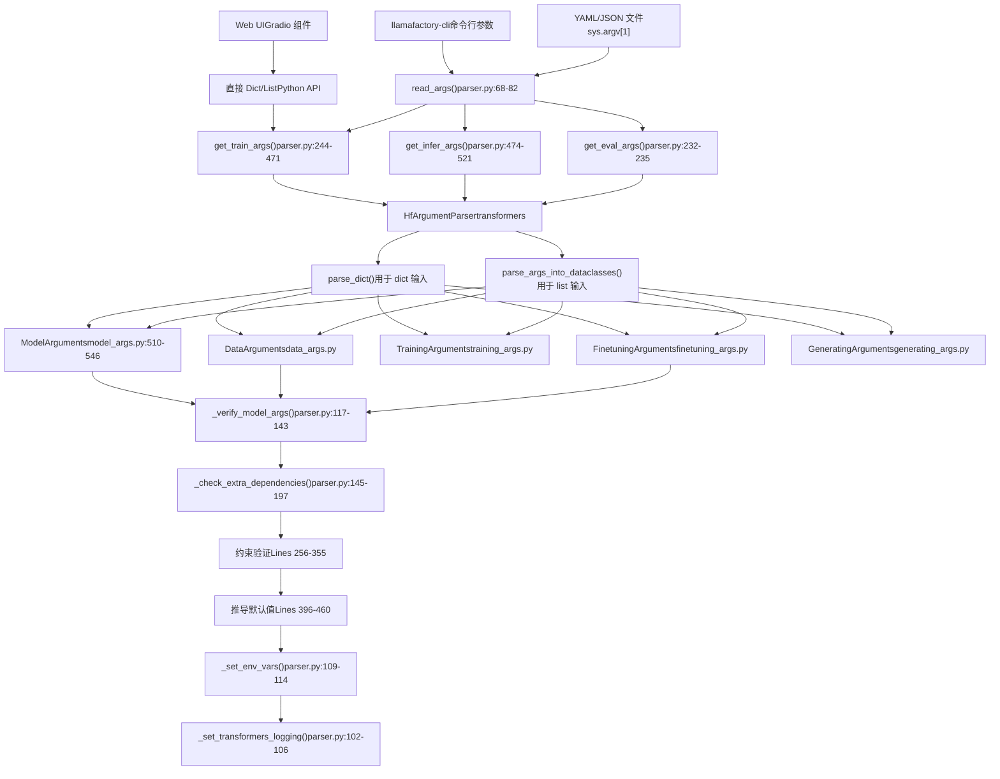
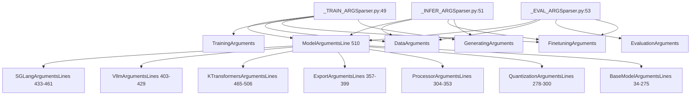
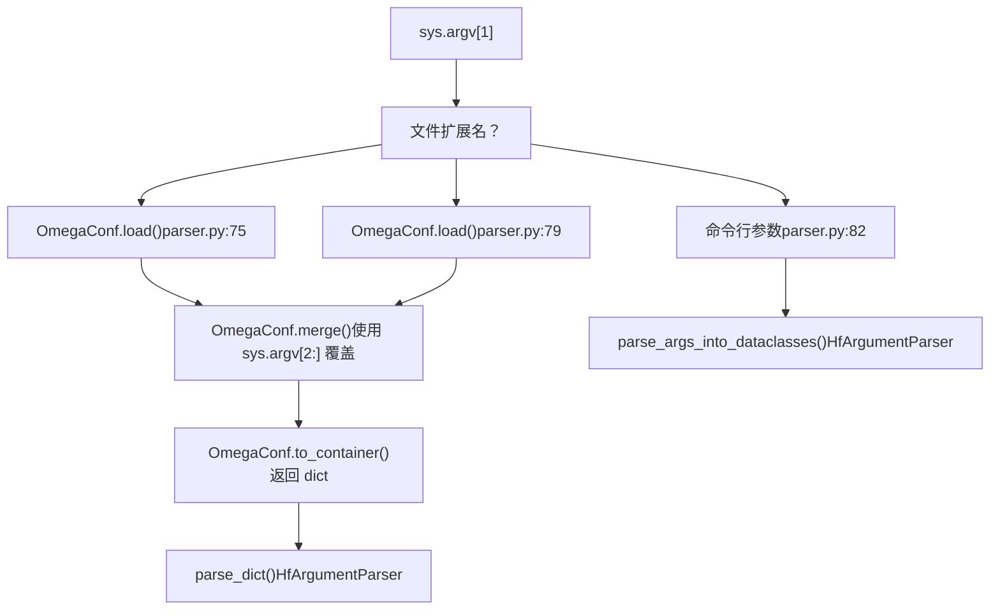
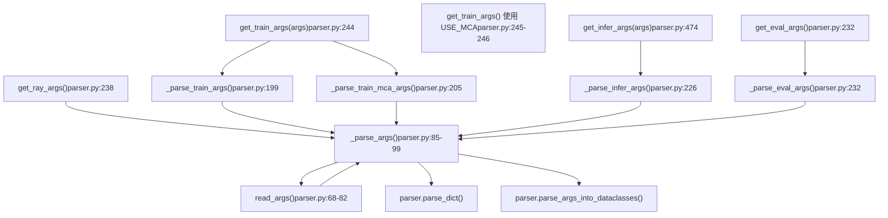
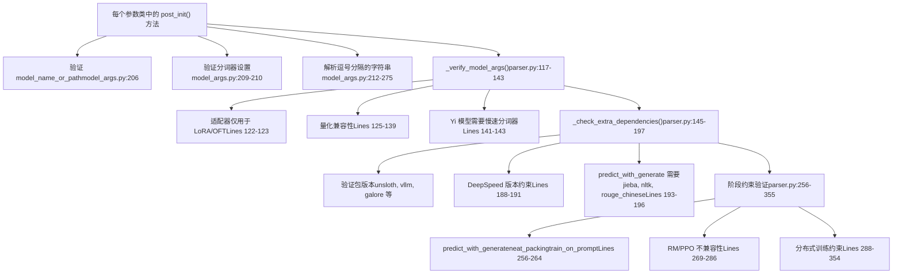
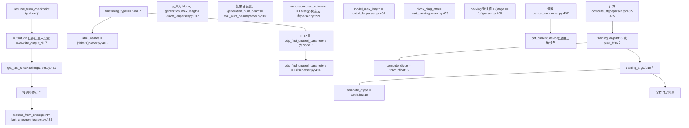
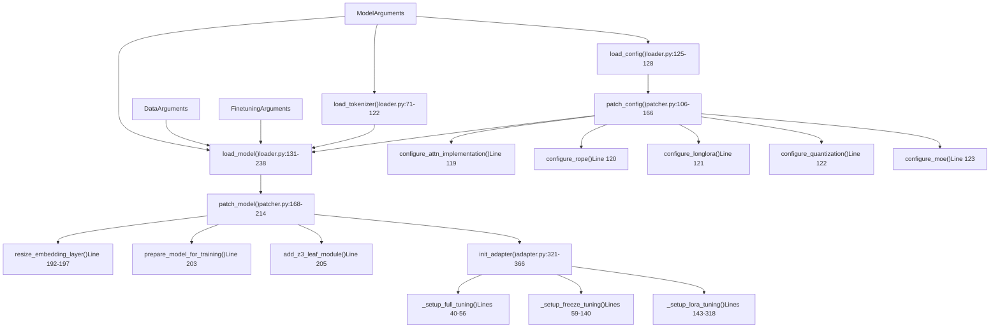

# 配置系统

相关源文件

-   [README.md](https://github.com/hiyouga/LlamaFactory/blob/355d5c5e/README.md?plain=1)
-   [README\_zh.md](https://github.com/hiyouga/LlamaFactory/blob/355d5c5e/README_zh.md?plain=1)
-   [src/llamafactory/hparams/model\_args.py](https://github.com/hiyouga/LlamaFactory/blob/355d5c5e/src/llamafactory/hparams/model_args.py)
-   [src/llamafactory/hparams/parser.py](https://github.com/hiyouga/LlamaFactory/blob/355d5c5e/src/llamafactory/hparams/parser.py)
-   [src/llamafactory/model/adapter.py](https://github.com/hiyouga/LlamaFactory/blob/355d5c5e/src/llamafactory/model/adapter.py)
-   [src/llamafactory/model/loader.py](https://github.com/hiyouga/LlamaFactory/blob/355d5c5e/src/llamafactory/model/loader.py)
-   [src/llamafactory/model/model\_utils/unsloth.py](https://github.com/hiyouga/LlamaFactory/blob/355d5c5e/src/llamafactory/model/model_utils/unsloth.py)
-   [src/llamafactory/model/patcher.py](https://github.com/hiyouga/LlamaFactory/blob/355d5c5e/src/llamafactory/model/patcher.py)

## 目的与范围

配置系统是 LlamaFactory 的中枢神经系统，负责解析、验证并将所有用户指定的参数路由到相应的子系统。本文档涵盖了参数解析流水线、五种主要的参数类型、验证逻辑以及配置文件格式。

有关特定参数类别及其参数的详细信息，请参阅[参数类型与验证](/hiyouga/LlamaFactory/3.1-argument-types-and-validation)。有关创建配置文件的实用示例，请参阅[配置文件 (YAML/JSON)](/hiyouga/LlamaFactory/3.2-configuration-files-(yamljson))。有关这些配置如何影响模型加载的信息，请参阅[模型加载与配置](/hiyouga/LlamaFactory/5-model-loading-and-configuration)。有关训练特定的参数，请参阅[训练系统](/hiyouga/LlamaFactory/6-training-system)。

---

## 系统概览

配置系统处理来自三个入口点（CLI、Web UI、API）的用户输入，并将其转换为有类型的、经过验证的参数对象，以控制训练和推理的所有方面。


**来源：** [src/llamafactory/hparams/parser.py68-471](https://github.com/hiyouga/LlamaFactory/blob/355d5c5e/src/llamafactory/hparams/parser.py#L68-L471)

---

## 参数类型

LlamaFactory 将配置组织为五个有类型的参数类，每个类管理系统的一个独特方面。这些类使用 Python 的 `@dataclass` 装饰器，并带有广泛的字段验证。

### 参数类型层次结构


**来源：** [src/llamafactory/hparams/parser.py49-54](https://github.com/hiyouga/LlamaFactory/blob/355d5c5e/src/llamafactory/hparams/parser.py#L49-L54) [src/llamafactory/hparams/model\_args.py510-546](https://github.com/hiyouga/LlamaFactory/blob/355d5c5e/src/llamafactory/hparams/model_args.py#L510-L546)

### 参数类型职责

| 参数类型 | 主要职责 | 关键文件 | 示例参数 |
| --- | --- | --- | --- |
| `ModelArguments` | 模型选择、加载、量化、推理后端 | [model\_args.py510-546](https://github.com/hiyouga/LlamaFactory/blob/355d5c5e/model_args.py#L510-L546) | `model_name_or_path`, `quantization_bit`, `adapter_name_or_path`, `infer_backend` |
| `DataArguments` | 数据集加载、预处理、模板、截断长度 | data\_args.py | `dataset`, `template`, `cutoff_len`, `packing`, `val_size` |
| `TrainingArguments` | 优化器、学习率、批次大小、分布式训练 | training\_args.py | `learning_rate`, `per_device_train_batch_size`, `num_train_epochs`, `deepspeed` |
| `FinetuningArguments` | 微调方法、LoRA 配置、训练阶段 | finetuning\_args.py | `finetuning_type`, `lora_rank`, `lora_target`, `stage` |
| `GeneratingArguments` | 推理/评估的生成参数 | generating\_args.py | `temperature`, `top_p`, `top_k`, `max_new_tokens` |

**来源：** [src/llamafactory/hparams/parser.py49-54](https://github.com/hiyouga/LlamaFactory/blob/355d5c5e/src/llamafactory/hparams/parser.py#L49-L54)

### ModelArguments 内部结构

`ModelArguments` 是一个复合类，继承自七个专门的参数组：

```python
@dataclass
class ModelArguments(
    SGLangArguments,        # SGLang 推理引擎配置
    VllmArguments,          # vLLM 推理引擎配置
    KTransformersArguments, # KTransformers 训练配置
    ExportArguments,        # 模型导出与合并
    ProcessorArguments,     # 图像/视频/音频处理
    QuantizationArguments,  # 4/8-bit 量化
    BaseModelArguments,     # 核心模型参数
):
    # 推导字段（计算得出，非用户指定）
    compute_dtype: torch.dtype | None = field(default=None, init=False)
    device_map: str | dict[str, Any] | None = field(default=None, init=False)
    model_max_length: int | None = field(default=None, init=False)
    block_diag_attn: bool = field(default=False, init=False)
```
**BaseModelArguments 中的关键字段：**

| 字段 | 类型 | 用途 | 验证 |
| --- | --- | --- | --- |
| `model_name_or_path` | `str` | HuggingFace/ModelScope 模型标识符 | 必填，在 `__post_init__` 中验证 [model\_args.py206-207](https://github.com/hiyouga/LlamaFactory/blob/355d5c5e/model_args.py#L206-L207) |
| `adapter_name_or_path` | `str` | 要加载/合并的逗号分隔的适配器路径 | 拆分为列表 [model\_args.py212-213](https://github.com/hiyouga/LlamaFactory/blob/355d5c5e/model_args.py#L212-L213) |
| `quantization_bit` | `int` | 量化位数 (4/8) | 必须与 LoRA/OFT 一起使用 [parser.py125-139](https://github.com/hiyouga/LlamaFactory/blob/355d5c5e/parser.py#L125-L139) |
| `flash_attn` | `AttentionFunction` | FlashAttention 模式 (auto/fa2/sdpa/disabled) | 在 [patcher.py119](https://github.com/hiyouga/LlamaFactory/blob/355d5c5e/patcher.py#L119-L119) 中配置 |
| `rope_scaling` | `RopeScaling` | RoPE 缩放策略 (linear/dynamic/yarn) | 应用于 [patcher.py120](https://github.com/hiyouga/LlamaFactory/blob/355d5c5e/patcher.py#L120-L120) |
| `infer_backend` | `EngineName` | 推理引擎 (hf/vllm/sglang/kt) | 训练时必须为 `hf` [parser.py344-345](https://github.com/hiyouga/LlamaFactory/blob/355d5c5e/parser.py#L344-L345) |

**来源：** [src/llamafactory/hparams/model\_args.py33-546](https://github.com/hiyouga/LlamaFactory/blob/355d5c5e/src/llamafactory/hparams/model_args.py#L33-L546)

---

## 配置文件格式

LlamaFactory 支持 YAML 和 JSON 配置文件。解析器根据文件扩展名自动检测格式。

### 文件检测逻辑


**来源：** [src/llamafactory/hparams/parser.py68-82](https://github.com/hiyouga/LlamaFactory/blob/355d5c5e/src/llamafactory/hparams/parser.py#L68-L82)

### YAML 配置结构

YAML 文件为复杂配置提供了最清晰的语法：

```yaml
# 模型配置
model_name_or_path: meta-llama/Llama-2-7b-hf
adapter_name_or_path: path/to/lora1,path/to/lora2  # 逗号分隔用于合并
quantization_bit: 4
flash_attn: fa2

# 数据配置
dataset: alpaca_en,alpaca_zh  # 多个数据集
template: llama2
cutoff_len: 2048
val_size: 0.1

# 训练配置
output_dir: ./output
num_train_epochs: 3
per_device_train_batch_size: 4
learning_rate: 5.0e-5
fp16: true

# 微调配置
finetuning_type: lora
lora_rank: 8
lora_target: q_proj,v_proj
stage: sft
```
### 命令行覆盖

配置文件可以通过命令行使用 OmegaConf 语法进行覆盖：

```bash
llamafactory-cli train config.yaml \
    learning_rate=1e-4 \
    output_dir=./custom_output \
    lora_rank=16
```
覆盖机制将 CLI 参数与加载的配置合并 [parser.py74-76](https://github.com/hiyouga/LlamaFactory/blob/355d5c5e/parser.py#L74-L76)

**来源：** [src/llamafactory/hparams/parser.py73-80](https://github.com/hiyouga/LlamaFactory/blob/355d5c5e/src/llamafactory/hparams/parser.py#L73-L80)

---

## 解析流水线

解析流水线由多个阶段组成：读取、解析、验证和后处理。

### 主要入口点


**来源：** [src/llamafactory/hparams/parser.py68-241](https://github.com/hiyouga/LlamaFactory/blob/355d5c5e/src/llamafactory/hparams/parser.py#L68-L241)

### 参数解析流程

`_parse_args` 函数同时处理字典和列表输入：

```python
def _parse_args(
    parser: "HfArgumentParser", 
    args: dict[str, Any] | list[str] | None = None, 
    allow_extra_keys: bool = False
) -> tuple[Any]:
    args = read_args(args)  # 从文件加载或使用提供的参数
    
    if isinstance(args, dict):
        # 直接字典解析（来自 YAML/JSON 或 Python 字典）
        return parser.parse_dict(args, allow_extra_keys=allow_extra_keys)
    
    # 列表解析（来自命令行）
    (*parsed_args, unknown_args) = parser.parse_args_into_dataclasses(
        args=args, 
        return_remaining_strings=True
    )
    
    if unknown_args and not allow_extra_keys:
        print(parser.format_help())
        raise ValueError(f"某些指定的参数未被使用: {unknown_args}")
    
    return tuple(parsed_args)
```
**来源：** [src/llamafactory/hparams/parser.py85-99](https://github.com/hiyouga/LlamaFactory/blob/355d5c5e/src/llamafactory/hparams/parser.py#L85-L99)

### 环境变量支持

多个环境变量影响解析行为：

| 环境变量 | 影响 | 位置 |
| --- | --- | --- |
| `USE_MCA` | 启用 Megatron-core adapter 训练参数 | [parser.py56-65](https://github.com/hiyouga/LlamaFactory/blob/355d5c5e/parser.py#L56-L65) |
| `ALLOW_EXTRA_ARGS` | 允许未知参数而不报错 | [parser.py201](https://github.com/hiyouga/LlamaFactory/blob/355d5c5e/parser.py#L201-L201) |
| `LLAMAFACTORY_VERBOSITY` | 设置 transformers 日志详细程度 | [parser.py103-106](https://github.com/hiyouga/LlamaFactory/blob/355d5c5e/parser.py#L103-L106) |
| `NPU_JIT_COMPILE` | 在 NPU 设备上启用 JIT 编译 | [parser.py112](https://github.com/hiyouga/LlamaFactory/blob/355d5c5e/parser.py#L112-L112) |
| `VLLM_WORKER_MULTIPROC_METHOD` | 设置 vLLM 多进程方法 | [parser.py114](https://github.com/hiyouga/LlamaFactory/blob/355d5c5e/parser.py#L114-L114) |

**来源：** [src/llamafactory/hparams/parser.py56-114](https://github.com/hiyouga/LlamaFactory/blob/355d5c5e/src/llamafactory/hparams/parser.py#L56-L114)

---

## 验证系统

验证发生在多个阶段，以确保配置一致性并及早捕获错误。

### 验证架构


**来源：** [src/llamafactory/hparams/parser.py117-355](https://github.com/hiyouga/LlamaFactory/blob/355d5c5e/src/llamafactory/hparams/parser.py#L117-L355)

### 关键验证规则

#### 量化约束

量化在 [parser.py125-139](https://github.com/hiyouga/LlamaFactory/blob/355d5c5e/parser.py#L125-L139) 中强制执行严格的兼容性要求：

```python
if model_args.quantization_bit is not None:
    # 规则 1：只有 LoRA 或 OFT 支持量化
    if finetuning_args.finetuning_type not in ["lora", "oft"]:
        raise ValueError("量化仅与 LoRA 或 OFT 方法兼容。")
    
    # 规则 2：不能对量化模型使用 PiSSA
    if finetuning_args.pissa_init:
        raise ValueError("请使用 scripts/pissa_init.py 为量化模型初始化 PiSSA。")
    
    # 规则 3：不能在量化模型上调整词表大小
    if model_args.resize_vocab:
        raise ValueError("无法调整量化模型嵌入层的词表大小。")
    
    # 规则 4：不能在量化模型上创建新适配器
    if model_args.adapter_name_or_path is not None and finetuning_args.create_new_adapter:
        raise ValueError("无法在量化模型上创建新适配器。")
    
    # 规则 5：量化仅允许单个适配器
    if model_args.adapter_name_or_path is not None and len(model_args.adapter_name_or_path) != 1:
        raise ValueError("量化模型仅接受单个适配器。请先合并它们。")
```
**来源：** [src/llamafactory/hparams/parser.py125-139](https://github.com/hiyouga/LlamaFactory/blob/355d5c5e/src/llamafactory/hparams/parser.py#L125-L139)

#### 阶段特定约束

不同的训练阶段有不同的要求 [parser.py256-286](https://github.com/hiyouga/LlamaFactory/blob/355d5c5e/parser.py#L256-L286)：

| 约束 | 适用于 | 理由 | 行号 |
| --- | --- | --- | --- |
| `predict_with_generate` 仅用于 SFT | 除 SFT 外的所有阶段 | 生成指标仅对自回归模型有意义 | 256-258 |
| `neat_packing` 仅用于 SFT | 除 SFT 外的所有阶段 | 打包序列仅对 SFT 有效 | 260-261 |
| `train_on_prompt`/`mask_history` 仅用于 SFT | 除 SFT 外的所有阶段 | 掩码逻辑是 SFT 特有的 | 263-264 |
| 预测时需要 `predict_with_generate` | 带有 `do_predict` 的 SFT | 需要生成来保存预测结果 | 266-267 |
| RM/PPO 不支持 `load_best_model_at_end` | RM, PPO | Value head 会导致检查点问题 | 269-270 |
| PPO 需要训练模式 | PPO | PPO 无法进行评估 | 272-274 |
| PPO 与 S²-Attn 不兼容 | PPO | 偏移注意力会破坏 PPO | 276-277 |

**来源：** [src/llamafactory/hparams/parser.py256-286](https://github.com/hiyouga/LlamaFactory/blob/355d5c5e/src/llamafactory/hparams/parser.py#L256-L286)

#### 分布式训练约束

分布式训练有特定的局限性 [parser.py325-339](https://github.com/hiyouga/LlamaFactory/blob/355d5c5e/parser.py#L325-L339)：

```python
if training_args.parallel_mode == ParallelMode.DISTRIBUTED:
    # 逐层优化器不支持分布式
    if finetuning_args.use_galore and finetuning_args.galore_layerwise:
        raise ValueError("分布式训练不支持逐层 GaLore。")
    
    if finetuning_args.use_apollo and finetuning_args.apollo_layerwise:
        raise ValueError("分布式训练不支持逐层 APOLLO。")
    
    # BAdam 有特殊要求
    if finetuning_args.use_badam:
        if finetuning_args.badam_mode == "ratio":
            raise ValueError("基于比例的 BAdam 尚不支持分布式训练...")
        elif not is_deepspeed_zero3_enabled():
            raise ValueError("逐层 BAdam 仅支持 DeepSpeed ZeRO-3 训练。")
```
**来源：** [src/llamafactory/hparams/parser.py325-336](https://github.com/hiyouga/LlamaFactory/blob/355d5c5e/src/llamafactory/hparams/parser.py#L325-L336)

---

## 后处理

验证之后，系统执行后处理以计算派生值并应用默认值。

### 后处理流水线


**来源：** [src/llamafactory/hparams/parser.py396-460](https://github.com/hiyouga/LlamaFactory/blob/355d5c5e/src/llamafactory/hparams/parser.py#L396-L460)

### 派生参数

多个参数是计算得出的，而非用户指定的：

```python
# 根据训练精度计算数据类型
if training_args.bf16 or finetuning_args.pure_bf16:
    model_args.compute_dtype = torch.bfloat16
elif training_args.fp16:
    model_args.compute_dtype = torch.float16
# parser.py:452-455

# 设备放置
model_args.device_map = {"": get_current_device()}
# parser.py:457

# 将截断长度同步到模型
model_args.model_max_length = data_args.cutoff_len
# parser.py:458

# 如果使用 neat packing，则启用块对角线注意力
model_args.block_diag_attn = data_args.neat_packing
# parser.py:459

# 如果未显式设置，则为预训练自动启用打包
data_args.packing = data_args.packing if data_args.packing is not None else finetuning_args.stage == "pt"
# parser.py:460
```
**来源：** [src/llamafactory/hparams/parser.py452-460](https://github.com/hiyouga/LlamaFactory/blob/355d5c5e/src/llamafactory/hparams/parser.py#L452-L460)

### 检查点自动恢复

如果满足条件，系统会自动检测并从最后一个检查点恢复 [parser.py424-440](https://github.com/hiyouga/LlamaFactory/blob/355d5c5e/parser.py#L424-L440)：

```python
if (
    training_args.resume_from_checkpoint is None  # 未显式设置
    and training_args.do_train                     # 训练模式
    and os.path.isdir(training_args.output_dir)   # 输出目录存在
    and not training_args.overwrite_output_dir    # 未设置覆盖
    and can_resume_from_checkpoint                 # 阶段支持恢复
):
    last_checkpoint = get_last_checkpoint(training_args.output_dir)
    
    # 检查输出目录是否有模型文件但没有检查点元数据
    if last_checkpoint is None and any(
        os.path.isfile(os.path.join(training_args.output_dir, name)) 
        for name in CHECKPOINT_NAMES
    ):
        raise ValueError("输出目录已存在且不为空。请设置 `overwrite_output_dir`。")
    
    if last_checkpoint is not None:
        training_args.resume_from_checkpoint = last_checkpoint
        logger.info_rank0(f"正在从 {training_args.resume_from_checkpoint} 恢复训练。")
```
**来源：** [src/llamafactory/hparams/parser.py424-440](https://github.com/hiyouga/LlamaFactory/blob/355d5c5e/src/llamafactory/hparams/parser.py#L424-L440)

---

## 到模型系统的配置流

经过验证的配置流向模型加载和补丁系统。

### 配置到模型流水线


**来源：** [src/llamafactory/model/loader.py71-238](https://github.com/hiyouga/LlamaFactory/blob/355d5c5e/src/llamafactory/model/loader.py#L71-L238) [src/llamafactory/model/patcher.py106-214](https://github.com/hiyouga/LlamaFactory/blob/355d5c5e/src/llamafactory/model/patcher.py#L106-L214) [src/llamafactory/model/adapter.py321-366](https://github.com/hiyouga/LlamaFactory/blob/355d5c5e/src/llamafactory/model/adapter.py#L321-L366)

### 配置应用示例

#### 示例 1：应用量化配置

当设置 `quantization_bit=4` 时：

1.  **解析器验证** [parser.py125-127](https://github.com/hiyouga/LlamaFactory/blob/355d5c5e/parser.py#L125-L127)：必须与 LoRA/OFT 一起使用
2.  **配置打补丁** [patcher.py122](https://github.com/hiyouga/LlamaFactory/blob/355d5c5e/patcher.py#L122-L122)：调用 `configure_quantization(config, tokenizer, model_args, is_trainable, init_kwargs)`
3.  **量化设置**（在 configure\_quantization 中）：在 `init_kwargs` 中设置 BitsAndBytes 配置
4.  **模型加载** [loader.py179](https://github.com/hiyouga/LlamaFactory/blob/355d5c5e/loader.py#L179-L179)：`AutoModelForCausalLM.from_pretrained(**init_kwargs)` 加载量化模型
5.  **适配器设置** [adapter.py334-336](https://github.com/hiyouga/LlamaFactory/blob/355d5c5e/adapter.py#L334-L336)：再次强制执行 LoRA/OFT 约束

#### 示例 2：适配器加载与合并

当设置 `adapter_name_or_path="lora1,lora2,lora3"` 时：

1.  **解析器拆分字符串** [model\_args.py212-213](https://github.com/hiyouga/LlamaFactory/blob/355d5c5e/model_args.py#L212-L213)：创建列表 `["lora1", "lora2", "lora3"]`
2.  **验证检查** [parser.py122-123](https://github.com/hiyouga/LlamaFactory/blob/355d5c5e/parser.py#L122-L123)：确保 LoRA 微调类型
3.  **适配器初始化** [adapter.py159-212](https://github.com/hiyouga/LlamaFactory/blob/355d5c5e/adapter.py#L159-L212)：
    -   如果是训练且不创建新适配器：合并前 N-1 个，加载最后一个
    -   如果是推理：合并所有适配器
    -   为每个适配器调用 `PeftModel.from_pretrained()` [adapter.py198](https://github.com/hiyouga/LlamaFactory/blob/355d5c5e/adapter.py#L198-L198)
    -   为要合并的适配器调用 `model.merge_and_unload()` [adapter.py199](https://github.com/hiyouga/LlamaFactory/blob/355d5c5e/adapter.py#L199-L199)

**来源：** [src/llamafactory/hparams/parser.py125-139](https://github.com/hiyouga/LlamaFactory/blob/355d5c5e/src/llamafactory/hparams/parser.py#L125-L139) [src/llamafactory/hparams/model\_args.py212-213](https://github.com/hiyouga/LlamaFactory/blob/355d5c5e/src/llamafactory/hparams/model_args.py#L212-L213) [src/llamafactory/model/adapter.py159-212](https://github.com/hiyouga/LlamaFactory/blob/355d5c5e/src/llamafactory/model/adapter.py#L159-L212)

---

## 使用模式

### 命令行用法

```bash
# 纯命令行（所有参数作为标志）
llamafactory-cli train \
    --model_name_or_path meta-llama/Llama-2-7b-hf \
    --dataset alpaca_en \
    --template llama2 \
    --finetuning_type lora \
    --lora_rank 8 \
    --output_dir ./output \
    --per_device_train_batch_size 4 \
    --learning_rate 5e-5

# 带有覆盖的 YAML 配置文件
llamafactory-cli train config.yaml \
    learning_rate=1e-4 \
    output_dir=./custom_output

# JSON 配置文件
llamafactory-cli train config.json
```
### Python API 用法

```python
from llamafactory.hparams import get_train_args

# 基于字典的配置
config = {
    "model_name_or_path": "meta-llama/Llama-2-7b-hf",
    "dataset": "alpaca_en",
    "template": "llama2",
    "finetuning_type": "lora",
    "lora_rank": 8,
    "output_dir": "./output",
    "per_device_train_batch_size": 4,
    "learning_rate": 5e-5,
}

model_args, data_args, training_args, finetuning_args, generating_args = get_train_args(config)
```
### Web UI 集成

Web UI 根据 Gradio 组件值构建参数字典，并将其传递给 `get_train_args()`。详见 [Web UI 架构](/hiyouga/LlamaFactory/8.1-web-ui-architecture)。

**来源：** [src/llamafactory/hparams/parser.py68-82](https://github.com/hiyouga/LlamaFactory/blob/355d5c5e/src/llamafactory/hparams/parser.py#L68-L82) [src/llamafactory/hparams/parser.py244-471](https://github.com/hiyouga/LlamaFactory/blob/355d5c5e/src/llamafactory/hparams/parser.py#L244-L471)

---

## 特殊配置模式

### Megatron-Core Adapter 模式

当设置 `USE_MCA` 环境变量时，系统使用 Megatron-core 训练参数 [parser.py56-65](https://github.com/hiyouga/LlamaFactory/blob/355d5c5e/parser.py#L56-L65)：

```python
if is_mcore_adapter_available() and is_env_enabled("USE_MCA"):
    from mcore_adapter import TrainingArguments as McaTrainingArguments
    
    _TRAIN_MCA_ARGS = [ModelArguments, DataArguments, McaTrainingArguments,
                       FinetuningArguments, GeneratingArguments]
```
`_configure_mca_training_args()` 函数对特定参数打补丁 [parser.py217-223](https://github.com/hiyouga/LlamaFactory/blob/355d5c5e/parser.py#L217-L223)：

```python
def _configure_mca_training_args(training_args, data_args, finetuning_args) -> None:
    training_args.predict_with_generate = False
    training_args.generation_max_length = data_args.cutoff_len
    training_args.generation_num_beams = 1
    training_args.use_mca = True
    finetuning_args.use_mca = True
```
**来源：** [src/llamafactory/hparams/parser.py56-65](https://github.com/hiyouga/LlamaFactory/blob/355d5c5e/src/llamafactory/hparams/parser.py#L56-L65) [src/llamafactory/hparams/parser.py217-224](https://github.com/hiyouga/LlamaFactory/blob/355d5c5e/src/llamafactory/hparams/parser.py#L217-L224)

### 仅推理配置

对于推理，使用 `get_infer_args()`，它排除了 `TrainingArguments` [parser.py474-521](https://github.com/hiyouga/LlamaFactory/blob/355d5c5e/parser.py#L474-L521)：

```python
model_args, data_args, finetuning_args, generating_args = get_infer_args(args)
```
关键的推理特定验证 [parser.py481-492](https://github.com/hiyouga/LlamaFactory/blob/355d5c5e/parser.py#L481-L492)：

-   vLLM 引擎仅支持 SFT 阶段
-   vLLM 不支持 BitsAndBytes 量化（支持 GPTQ/AWQ）
-   vLLM 不支持 RoPE 缩放
-   vLLM 仅接受单个适配器

**来源：** [src/llamafactory/hparams/parser.py474-521](https://github.com/hiyouga/LlamaFactory/blob/355d5c5e/src/llamafactory/hparams/parser.py#L474-L521)

---

## 配置表

### 关键配置组合

| 场景 | 必填参数 | 禁用参数 | 备注 |
| --- | --- | --- | --- |
| QLoRA 训练 | `quantization_bit=4`, `finetuning_type=lora` | `pissa_init`, `resize_vocab`, `create_new_adapter` | 仅允许单个适配器 [parser.py125-139](https://github.com/hiyouga/LlamaFactory/blob/355d5c5e/parser.py#L125-L139) |
| 全参数微调 | `finetuning_type=full` | `adapter_name_or_path` | 训练所有参数，除了禁用的模块 [adapter.py40-56](https://github.com/hiyouga/LlamaFactory/blob/355d5c5e/adapter.py#L40-L56) |
| 合并多个 LoRA | `adapter_name_or_path="lora1,lora2"` | `quantization_bit`, `deepspeed` ZeRO-3 | 合并前 N-1 个适配器，加载最后一个 [adapter.py177-181](https://github.com/hiyouga/LlamaFactory/blob/355d5c5e/adapter.py#L177-L181) |
| PPO 训练 | `stage=ppo` | `shift_attn`, `predict_with_generate` | 需要训练模式，特定的奖励模型配置 [parser.py272-286](https://github.com/hiyouga/LlamaFactory/blob/355d5c5e/parser.py#L272-L286) |
| vLLM 推理 | `infer_backend=vllm` | `quantization_bit` (BNB), `rope_scaling` | 仅用于 training=False [parser.py481-492](https://github.com/hiyouga/LlamaFactory/blob/355d5c5e/parser.py#L481-L492) |

### 环境变量参考

| 变量 | 影响 | 默认值 | 位置 |
| --- | --- | --- | --- |
| `USE_MCA` | 启用 Megatron-core adapter 训练 | 未设置 | [parser.py56](https://github.com/hiyouga/LlamaFactory/blob/355d5c5e/parser.py#L56-L56) |
| `ALLOW_EXTRA_ARGS` | 允许未知 CLI 参数 | 未设置 | [parser.py201](https://github.com/hiyouga/LlamaFactory/blob/355d5c5e/parser.py#L201-L201) |
| `LLAMAFACTORY_VERBOSITY` | 日志级别 (DEBUG/INFO/WARNING/ERROR) | INFO | [parser.py103](https://github.com/hiyouga/LlamaFactory/blob/355d5c5e/parser.py#L103-L103) |
| `NPU_JIT_COMPILE` | 在 NPU 设备上启用 JIT | 未设置 | [parser.py112](https://github.com/hiyouga/LlamaFactory/blob/355d5c5e/parser.py#L112-L112) |
| `VLLM_WORKER_MULTIPROC_METHOD` | vLLM 进程衍生方法 | spawn (在 NPU 上) | [parser.py114](https://github.com/hiyouga/LlamaFactory/blob/355d5c5e/parser.py#L114-L114) |
| `DISABLE_VERSION_CHECK` | 跳过 transformers 版本检查 | 未设置 | README |
| `FORCE_TORCHRUN` | 为 DeepSpeed 强制使用 torchrun | 未设置 | [parser.py292](https://github.com/hiyouga/LlamaFactory/blob/355d5c5e/parser.py#L292-L292) |

**来源：** [src/llamafactory/hparams/parser.py56-114](https://github.com/hiyouga/LlamaFactory/blob/355d5c5e/src/llamafactory/hparams/parser.py#L56-L114) [src/llamafactory/hparams/parser.py201](https://github.com/hiyouga/LlamaFactory/blob/355d5c5e/src/llamafactory/hparams/parser.py#L201-L201) [src/llamafactory/hparams/parser.py292](https://github.com/hiyouga/LlamaFactory/blob/355d5c5e/src/llamafactory/hparams/parser.py#L292-L292)
