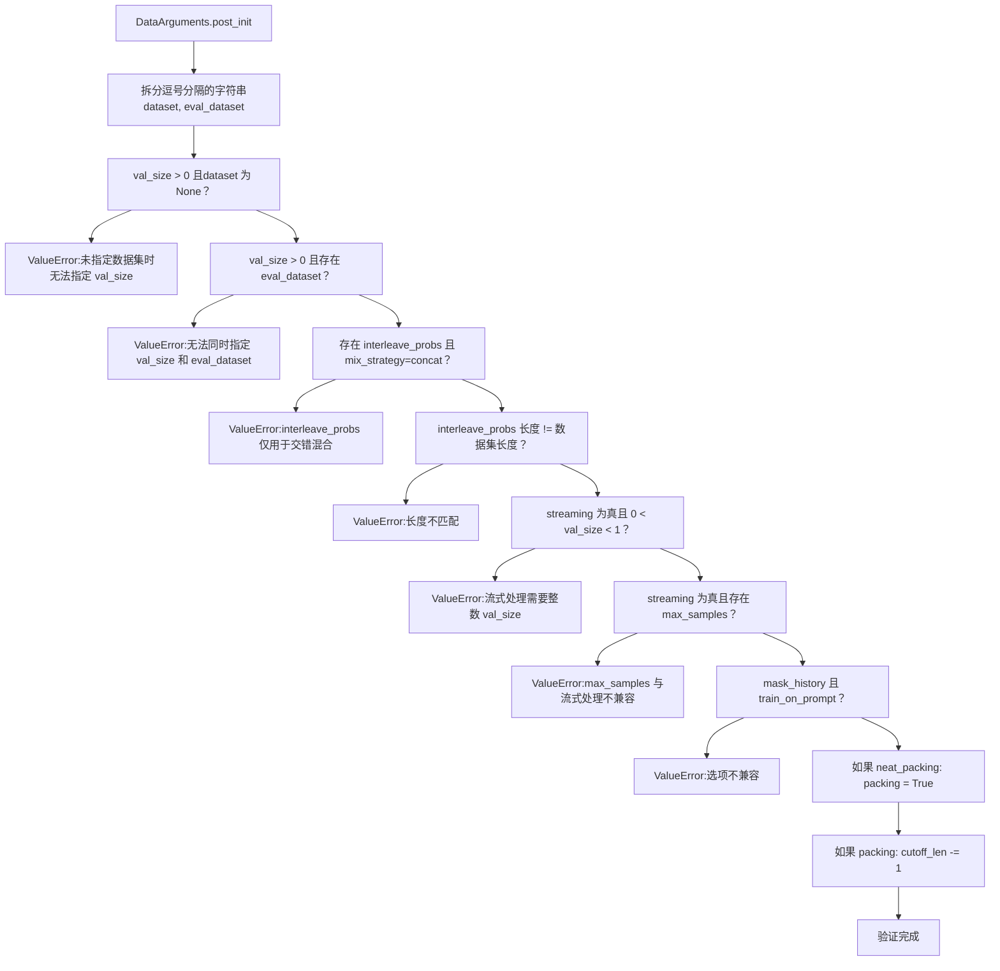
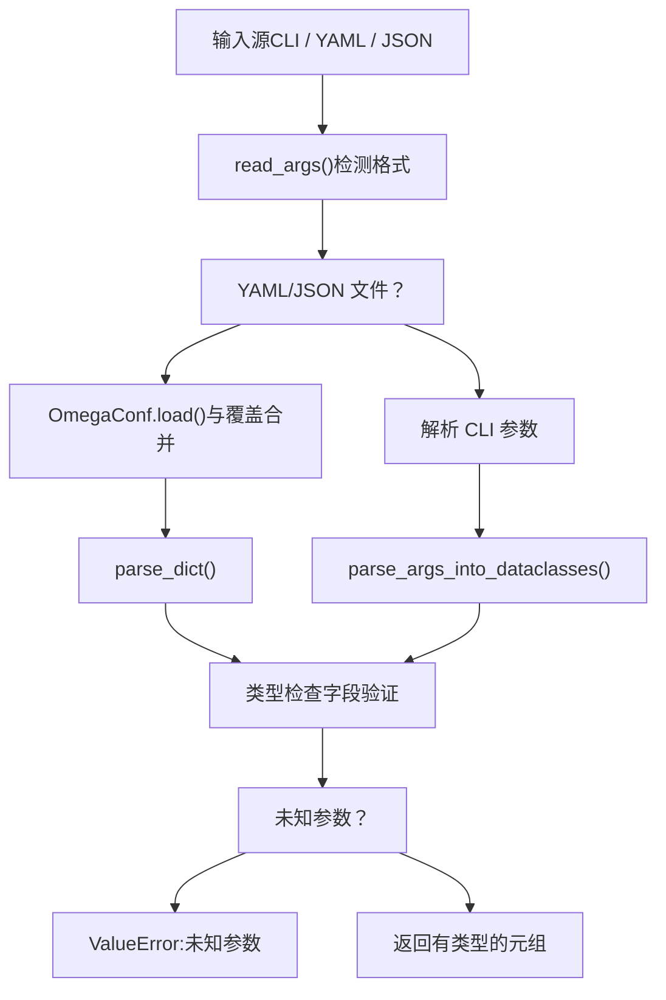
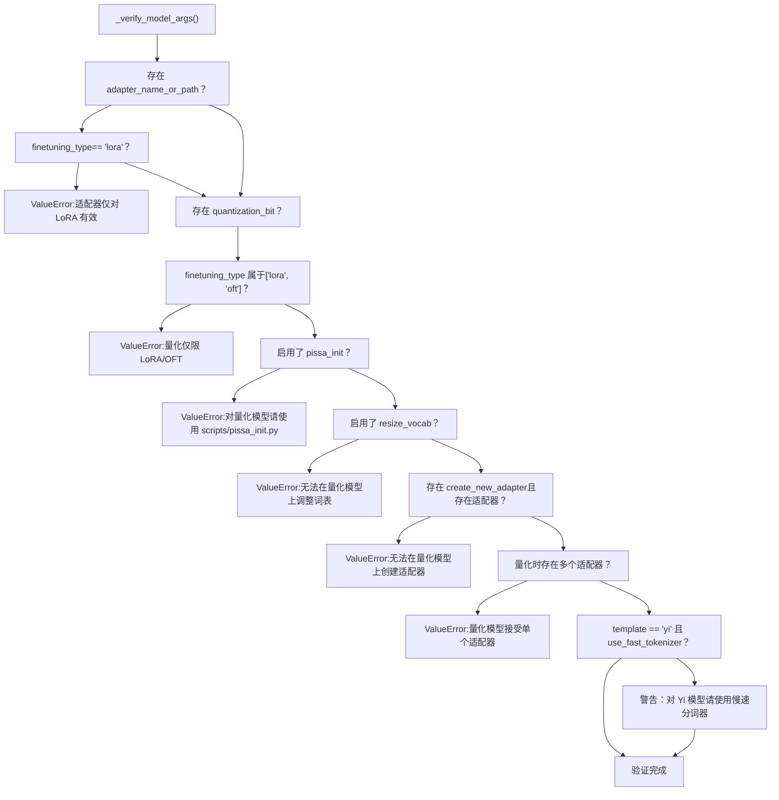
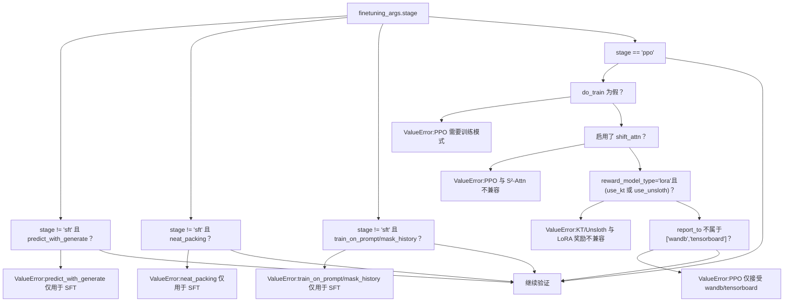
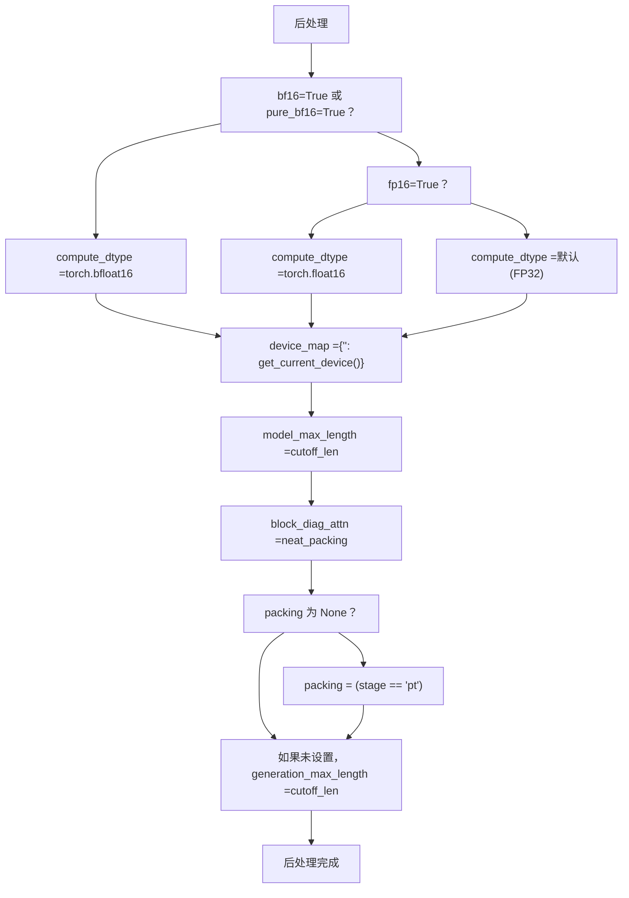
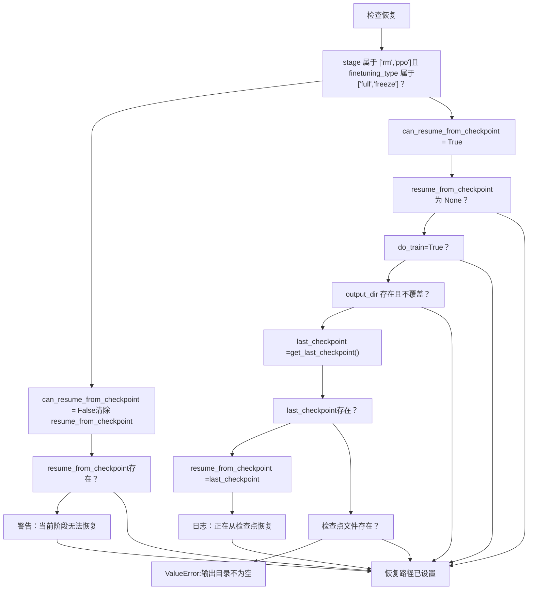

# 参数类型与验证

相关源文件

-   [README.md](https://github.com/hiyouga/LlamaFactory/blob/355d5c5e/README.md?plain=1)
-   [README\_zh.md](https://github.com/hiyouga/LlamaFactory/blob/355d5c5e/README_zh.md?plain=1)
-   [src/llamafactory/data/loader.py](https://github.com/hiyouga/LlamaFactory/blob/355d5c5e/src/llamafactory/data/loader.py)
-   [src/llamafactory/data/parser.py](https://github.com/hiyouga/LlamaFactory/blob/355d5c5e/src/llamafactory/data/parser.py)
-   [src/llamafactory/hparams/data\_args.py](https://github.com/hiyouga/LlamaFactory/blob/355d5c5e/src/llamafactory/hparams/data_args.py)
-   [src/llamafactory/hparams/parser.py](https://github.com/hiyouga/LlamaFactory/blob/355d5c5e/src/llamafactory/hparams/parser.py)

## 目的与范围

本文档描述了 LlamaFactory 中使用的五种核心参数类型（`ModelArguments`、`DataArguments`、`FinetuningArguments`、`TrainingArguments` 和 `GeneratingArguments`），以及在开始昂贵操作之前确保配置一致性的多阶段验证流水线。验证系统能在执行流的早期捕获不兼容的参数组合、缺失的依赖项和无效的训练配置。

有关配置文件 (YAML/JSON) 的信息，请参阅[配置文件](/hiyouga/LlamaFactory/3.2-configuration-files-(yamljson))。有关参数如何在训练流水线中流动的详细信息，请参阅[配置系统](/hiyouga/LlamaFactory/3-configuration-system)。

## 参数类型概述

LlamaFactory 使用有类型的参数系统，所有配置参数被组织到五个数据类（dataclass）中。每个数据类封装了相关的参数，并通过 `__post_init__` 方法包含字段级验证。

### 参数类型结构

```mermaid
flowchart TD
    MA["ModelArgumentsmodel_name_or_pathquantization_bitadapter_name_or_pathinfer_backend..."]
    DA["DataArgumentsdatasettemplatecutoff_lenpacking..."]
    FA["FinetuningArgumentsfinetuning_typestagelora_ranklora_alpha..."]
    TA["TrainingArgumentslearning_ratenum_train_epochsper_device_train_batch_sizedeepspeed..."]
    GA["GeneratingArgumentstemperaturetop_pmax_new_tokens..."]
    Train["训练MA + DA + TA + FA + GA"]
    Infer["推理MA + DA + FA + GA"]
    Eval["评估MA + DA + EvalArgs + FA"]

    MA --> Train
    DA --> Train
    TA --> Train
    FA --> Train
    GA --> Train
    MA --> Infer
    DA --> Infer
    FA --> Infer
    GA --> Infer
    MA --> Eval
    DA --> Eval
    FA --> Eval
```

**来源：** [src/llamafactory/hparams/parser.py49-54](https://github.com/hiyouga/LlamaFactory/blob/355d5c5e/src/llamafactory/hparams/parser.py#L49-L54)

### 根据上下文选择参数类型

不同的入口点需要不同的参数组合：

| 上下文 | 所需参数 | 入口函数 |
| --- | --- | --- |
| 训练 | `ModelArguments`, `DataArguments`, `TrainingArguments`, `FinetuningArguments`, `GeneratingArguments` | `get_train_args()` |
| 推理 | `ModelArguments`, `DataArguments`, `FinetuningArguments`, `GeneratingArguments` | `get_infer_args()` |
| 评估 | `ModelArguments`, `DataArguments`, `EvaluationArguments`, `FinetuningArguments` | `get_eval_args()` |

**来源：** [src/llamafactory/hparams/parser.py244-527](https://github.com/hiyouga/LlamaFactory/blob/355d5c5e/src/llamafactory/hparams/parser.py#L244-L527)

## ModelArguments

`ModelArguments` 包含用于模型加载、量化、适配器配置和推理后端选择的参数。这些参数控制基础模型的初始化和修改方式。

**关键字段：**

-   `model_name_or_path`: HuggingFace 模型 ID 或本地路径
-   `quantization_bit`: 量化精度（4, 8 等）
-   `adapter_name_or_path`: 要加载的 LoRA/适配器路径列表
-   `infer_backend`: 后端引擎 (`hf`, `vllm`, `sglang`, `kt`)
-   `use_unsloth`: 启用 Unsloth 优化
-   `use_kt`: 启用 KTransformers 优化
-   `shift_attn`: 启用 LongLoRA 的 S²-Attn
-   `rope_scaling`: RoPE 缩放方法
-   `flash_attn`: Flash attention 实现

**来源：** [src/llamafactory/hparams/parser.py40-144](https://github.com/hiyouga/LlamaFactory/blob/355d5c5e/src/llamafactory/hparams/parser.py#L40-L144)

## DataArguments

`DataArguments` 包含数据集配置、模板选择、预处理参数和数据混合策略。该类包含广泛的 `__post_init__` 验证。

**关键字段：**

-   `dataset`: 以逗号分隔的数据集名称列表
-   `eval_dataset`: 以逗号分隔的评估数据集列表
-   `template`: 对话模板名称
-   `cutoff_len`: 最大序列长度（默认：2048）
-   `packing`: 启用序列打包
-   `neat_packing`: 启用不带跨注意力的打包
-   `streaming`: 启用数据集流式处理
-   `mix_strategy`: 数据集混合方法 (`concat`, `interleave_under`, `interleave_over`)
-   `val_size`: 验证集划分大小
-   `train_on_prompt`: 是否在提示词（prompt）标记上计算损失
-   `mask_history`: 是否掩码对话历史

### DataArguments 验证规则

`DataArguments` 中的 `__post_init__` 方法强制执行以下几项约束：

**来源：** [src/llamafactory/hparams/data\_args.py141-184](https://github.com/hiyouga/LlamaFactory/blob/355d5c5e/src/llamafactory/hparams/data_args.py#L141-L184)

## FinetuningArguments

`FinetuningArguments` 指定微调方法（full, freeze, LoRA, OFT）、训练阶段以及特定方法的超参数。该类对于确定兼容性约束至关重要。

**关键字段：**

-   `stage`: 训练阶段 (`pt`, `sft`, `rm`, `ppo`, `dpo`, `kto`, `orpo`, `simpo`)
-   `finetuning_type`: 方法类型 (`full`, `freeze`, `lora`, `oft`)
-   `lora_rank`: LoRA 秩参数
-   `lora_alpha`: LoRA alpha 参数
-   `additional_target`: 应用适配器的额外模块
-   `pissa_init`: 启用 PiSSA 初始化
-   `use_galore`: 启用 GaLore 优化器
-   `use_apollo`: 启用 APOLLO 优化器
-   `use_badam`: 启用 BAdam 优化器
-   `use_adam_mini`: 启用 Adam-mini 优化器
-   `pure_bf16`: 启用纯 BF16 训练
-   `compute_accuracy`: 计算准确率指标
-   `reward_model_type`: PPO 的奖励模型类型

**来源：** [src/llamafactory/hparams/parser.py38-126](https://github.com/hiyouga/LlamaFactory/blob/355d5c5e/src/llamafactory/hparams/parser.py#L38-L126)

## TrainingArguments

`TrainingArguments` 扩展了 HuggingFace 的 `Seq2SeqTrainingArguments`，增加了用于分布式训练、监控和 LlamaFactory 特定优化的额外字段。

**关键字段（超出 HF TrainingArguments 的部分）：**

-   `deepspeed`: DeepSpeed 配置文件
-   `fsdp`: FSDP 配置
-   `report_to`: 监控服务列表
-   `fp8`: 启用 FP8 训练
-   `predict_with_generate`: 评估时使用生成
-   `generation_max_length`: 最大生成长度
-   `generation_num_beams`: 集束搜索（beam search）大小

**来源：** [src/llamafactory/hparams/parser.py41](https://github.com/hiyouga/LlamaFactory/blob/355d5c5e/src/llamafactory/hparams/parser.py#L41-L41)

## GeneratingArguments

`GeneratingArguments` 包含生成/推理参数，如温度、top-p 采样和标记限制。

**关键字段：**

-   `temperature`: 采样温度
-   `top_p`: 核采样阈值
-   `top_k`: Top-k 采样参数
-   `max_new_tokens`: 最大生成标记数
-   `num_return_sequences`: 生成序列的数量

**来源：** [src/llamafactory/hparams/parser.py39](https://github.com/hiyouga/LlamaFactory/blob/355d5c5e/src/llamafactory/hparams/parser.py#L39-L39)

## 验证流水线

验证流水线由四个按顺序执行的阶段组成，确保逐步严格的一致性检查。

### 第 1 阶段：参数解析

来自 HuggingFace Transformers 的 `HfArgumentParser` 解析 CLI、YAML 或 JSON 中的参数并执行类型检查。

**来源：** [src/llamafactory/hparams/parser.py68-100](https://github.com/hiyouga/LlamaFactory/blob/355d5c5e/src/llamafactory/hparams/parser.py#L68-L100)

### 第 2 阶段：字段级验证

每个参数数据类的 `__post_init__` 方法验证其自身字段的内部一致性（上方显示了 `DataArguments` 的示例）。

**来源：** [src/llamafactory/hparams/data\_args.py141-184](https://github.com/hiyouga/LlamaFactory/blob/355d5c5e/src/llamafactory/hparams/data_args.py#L141-L184)

### 第 3 阶段：跨参数验证

`_verify_model_args()` 函数验证 `ModelArguments`、`DataArguments` 和 `FinetuningArguments` 之间的关系：

**来源：** [src/llamafactory/hparams/parser.py117-144](https://github.com/hiyouga/LlamaFactory/blob/355d5c5e/src/llamafactory/hparams/parser.py#L117-L144)

### 第 4 阶段：训练特定验证

`get_train_args()` 函数对训练场景执行广泛验证，检查内容包括：

#### 阶段与方法兼容性

**来源：** [src/llamafactory/hparams/parser.py256-286](https://github.com/hiyouga/LlamaFactory/blob/355d5c5e/src/llamafactory/hparams/parser.py#L256-L286)

#### 分布式训练约束

| 约束 | 错误消息 |
| --- | --- |
| 未通过分布式启动 | "Please launch distributed training with `llamafactory-cli` or `torchrun`" |
| 未开启分布式模式使用 DeepSpeed | "Please use `FORCE_TORCHRUN=1` to launch DeepSpeed training" |
| 流式处理未指定 `max_steps` | "Please specify `max_steps` in streaming mode" |
| 逐层 GaLore + 分布式 | "Distributed training does not support layer-wise GaLore" |
| 逐层 APOLLO + 分布式 | "Distributed training does not support layer-wise APOLLO" |
| BAdam 比例模式 + 分布式 | "Radio-based BAdam does not yet support distributed training" |
| 逐层 BAdam 且非 DeepSpeed ZeRO-3 | "Layer-wise BAdam only supports DeepSpeed ZeRO-3 training" |

**来源：** [src/llamafactory/hparams/parser.py288-337](https://github.com/hiyouga/LlamaFactory/blob/355d5c5e/src/llamafactory/hparams/parser.py#L288-L337)

#### 优化与精度约束

| 组合 | 验证结果 |
| --- | --- |
| GaLore/APOLLO + DeepSpeed | 无效："GaLore and APOLLO are incompatible with DeepSpeed yet" |
| FP8 + 量化 | 无效："FP8 training is not compatible with quantization" |
| `pure_bf16` 且无 BF16 硬件 | 无效："This device does not support `pure_bf16`" |
| `pure_bf16` + DeepSpeed ZeRO-3 | 无效："`pure_bf16` is incompatible with DeepSpeed ZeRO-3" |
| Unsloth + DeepSpeed ZeRO-3 | 无效："Unsloth is incompatible with DeepSpeed ZeRO-3" |
| KTransformers + DeepSpeed ZeRO-3 | 无效："KTransformers is incompatible with DeepSpeed ZeRO-3" |
| `predict_with_generate` + DeepSpeed ZeRO-3 | 无效："`predict_with_generate` is incompatible with DeepSpeed ZeRO-3" |
| PiSSA 初始化 + DeepSpeed ZeRO-3 | 无效："Please use scripts/pissa\_init.py to initialize PiSSA in DeepSpeed ZeRO-3" |

**来源：** [src/llamafactory/hparams/parser.py306-354](https://github.com/hiyouga/LlamaFactory/blob/355d5c5e/src/llamafactory/hparams/parser.py#L306-L354)

## 依赖检查

`_check_extra_dependencies()` 函数验证特定功能所需的包是否已安装：

```mermaid
flowchart TD
    DeepSpeed["deepspeed 配置"]
    CheckDS["check_version'deepspeed>=0.10.0,<=0.16.9'"]
    PredictGenerate["predict_with_generate=True"]
    CheckNLP["check_version'jieba, nltk, rouge_chinese'"]
    UseSwanLab["use_swanlab=True"]
    CheckSwanLab["check_version'swanlab'"]
    PlotLoss["plot_loss=True"]
    CheckMatplotlib["check_version'matplotlib'"]
    UseGaLore["use_galore=True"]
    CheckGaLore["check_version'galore_torch'"]
    UseApollo["use_apollo=True"]
    CheckApollo["check_version'apollo_torch'"]
    UseBadam["use_badam=True"]
    CheckBadam["check_version'badam>=1.2.1'"]
    UseAdamMini["use_adam_mini=True"]
    CheckAdamMini["check_version'adam-mini'"]
    VLLMBackend["infer_backend='vllm'"]
    CheckVLLM["check_version'vllm>=0.4.3,<=0.11.0'"]
    SGLangBackend["infer_backend='sglang'"]
    CheckSGLang["check_version'sglang>=0.4.5'"]
    UseKT["use_kt=True"]
    CheckKT["check_version'ktransformers'"]
    UseUnsloth["use_unsloth=True"]
    CheckUnsloth["check_version'unsloth'"]
    Liger["enable_liger_kernel=True"]
    CheckLiger["check_version'liger-kernel'"]
    MoD["mixture_of_depths"]
    CheckMoD["check_version'mixture-of-depth>=1.1.6'"]

    DeepSpeed --> CheckDS
    PredictGenerate --> CheckNLP
    UseSwanLab --> CheckSwanLab
    PlotLoss --> CheckMatplotlib
    UseGaLore --> CheckGaLore
    UseApollo --> CheckApollo
    UseBadam --> CheckBadam
    UseAdamMini --> CheckAdamMini
    VLLMBackend --> CheckVLLM
    SGLangBackend --> CheckSGLang
    UseKT --> CheckKT
    UseUnsloth --> CheckUnsloth
    Liger --> CheckLiger
    MoD --> CheckMoD
```

**来源：** [src/llamafactory/hparams/parser.py145-197](https://github.com/hiyouga/LlamaFactory/blob/355d5c5e/src/llamafactory/hparams/parser.py#L145-L197)

## 后处理

验证后，对参数进行后处理以设置派生值并确保一致性：

### 计算 Dtype 选择

**来源：** [src/llamafactory/hparams/parser.py452-461](https://github.com/hiyouga/LlamaFactory/blob/355d5c5e/src/llamafactory/hparams/parser.py#L452-L461)

### 训练参数调整

| 字段 | 调整方式 |
| --- | --- |
| `generation_max_length` | 如果未指定，设置为 `cutoff_len` |
| `generation_num_beams` | 如果提供了 `eval_num_beams`，则将其设置为该值 |
| `remove_unused_columns` | 对于多模态数据集始终设置为 `False` |
| `label_names` | 对于 LoRA 训练设置为 `["labels"]` |
| `ddp_find_unused_parameters` | 对于 DDP + LoRA 设置为 `False` 以优化性能 |

**来源：** [src/llamafactory/hparams/parser.py397-414](https://github.com/hiyouga/LlamaFactory/blob/355d5c5e/src/llamafactory/hparams/parser.py#L397-L414)

### 检查点恢复逻辑

**来源：** [src/llamafactory/hparams/parser.py416-450](https://github.com/hiyouga/LlamaFactory/blob/355d5c5e/src/llamafactory/hparams/parser.py#L416-L450)

## 警告消息

除了错误之外，验证系统还会对次优但有效的配置发出警告：

| 条件 | 警告内容 |
| --- | --- |
| LoRA + 量化 + `resize_vocab` 且无 `additional_target` | "Remember to add embedding layers to `additional_target` to make the added tokens trainable" |
| 量化训练未开启 `upcast_layernorm` | "We recommend enable `upcast_layernorm` in quantized training" |
| 未开启 FP16 或 BF16 的训练 | "We recommend enable mixed precision training" |
| GaLore/APOLLO 未使用 `pure_bf16` | "Using GaLore or APOLLO with mixed precision training may significantly increases GPU memory usage" |
| 在 4/8-bit 模式下进行评估 | "Evaluating model in 4/8-bit mode may cause lower scores" |
| 未指定 `ref_model` 的 DPO 评估 | "Specify `ref_model` for computing rewards at evaluation" |

**来源：** [src/llamafactory/hparams/parser.py364-394](https://github.com/hiyouga/LlamaFactory/blob/355d5c5e/src/llamafactory/hparams/parser.py#L364-L394)

## 推理特定验证
`get_infer_args()` 函数执行具有不同约束的推理特定验证：

| 约束 | 错误消息 |
| --- | --- |
| vLLM 用于非 SFT 阶段 | "vLLM engine only supports auto-regressive models" |
| vLLM 用于 BnB 量化 | "vLLM engine does not support bnb quantization (GPTQ and AWQ are supported)" |
| vLLM 用于 RoPE 缩放 | "vLLM engine does not support RoPE scaling" |
| vLLM 用于多个适配器 | "vLLM only accepts a single adapter. Merge them first" |

**来源：** [src/llamafactory/hparams/parser.py474-506](https://github.com/hiyouga/LlamaFactory/blob/355d5c5e/src/llamafactory/hparams/parser.py#L474-L506)

## 验证流程总结

从用户输入到经过验证的参数的完整验证流程：

> **[Mermaid 序列图]**
> *(图表结构无法解析)*

**来源：** [src/llamafactory/hparams/parser.py244-471](https://github.com/hiyouga/LlamaFactory/blob/355d5c5e/src/llamafactory/hparams/parser.py#L244-L471)
