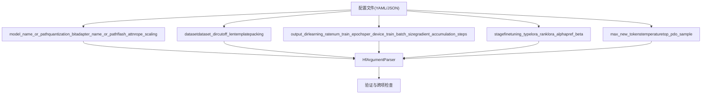
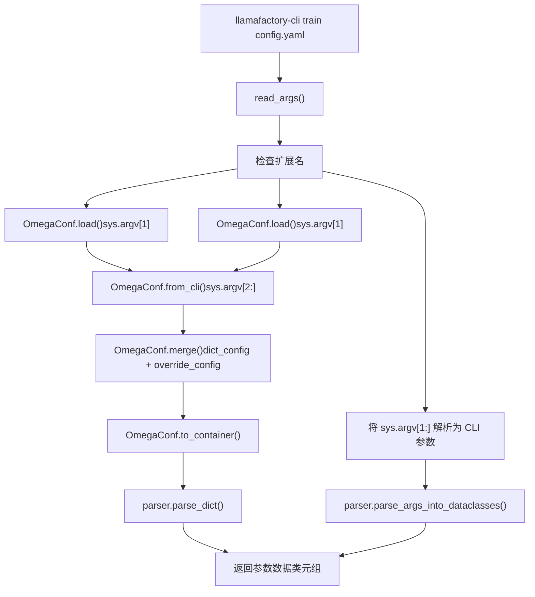
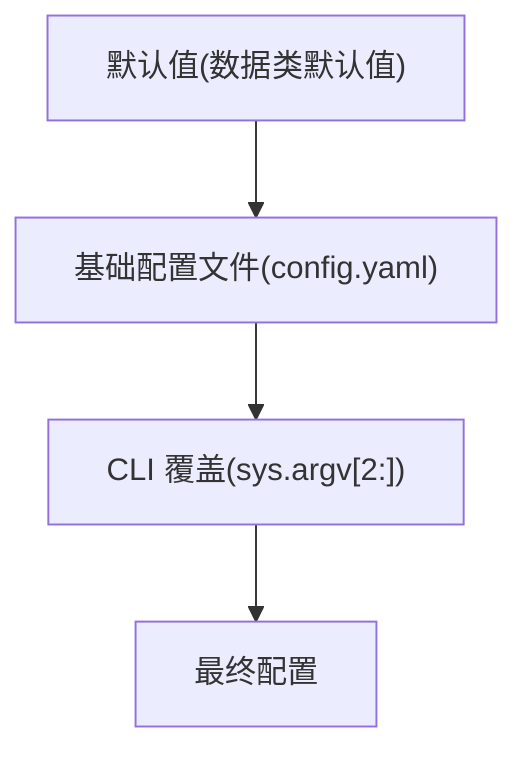
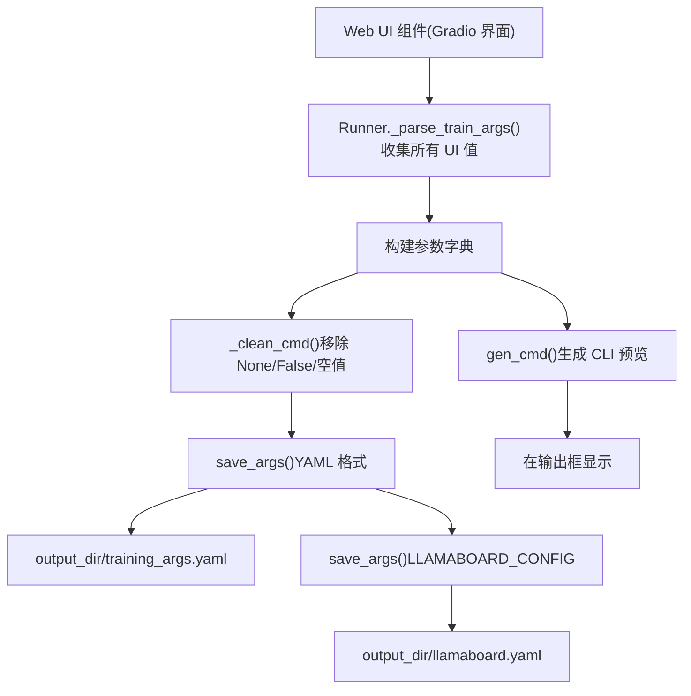
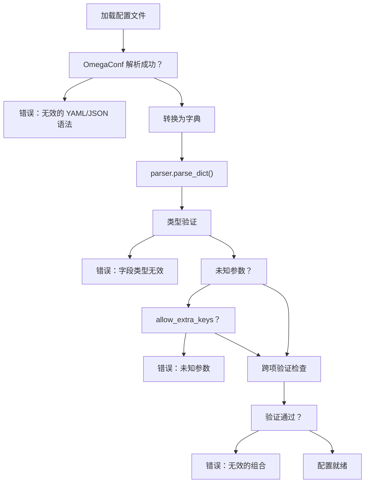

# 配置文件 (YAML/JSON)

相关源文件

-   [README.md](https://github.com/hiyouga/LlamaFactory/blob/355d5c5e/README.md?plain=1)
-   [README\_zh.md](https://github.com/hiyouga/LlamaFactory/blob/355d5c5e/README_zh.md?plain=1)
-   [src/llamafactory/hparams/parser.py](https://github.com/hiyouga/LlamaFactory/blob/355d5c5e/src/llamafactory/hparams/parser.py)
-   [src/llamafactory/webui/chatter.py](https://github.com/hiyouga/LlamaFactory/blob/355d5c5e/src/llamafactory/webui/chatter.py)
-   [src/llamafactory/webui/common.py](https://github.com/hiyouga/LlamaFactory/blob/355d5c5e/src/llamafactory/webui/common.py)
-   [src/llamafactory/webui/components/export.py](https://github.com/hiyouga/LlamaFactory/blob/355d5c5e/src/llamafactory/webui/components/export.py)
-   [src/llamafactory/webui/components/top.py](https://github.com/hiyouga/LlamaFactory/blob/355d5c5e/src/llamafactory/webui/components/top.py)
-   [src/llamafactory/webui/components/train.py](https://github.com/hiyouga/LlamaFactory/blob/355d5c5e/src/llamafactory/webui/components/train.py)
-   [src/llamafactory/webui/engine.py](https://github.com/hiyouga/LlamaFactory/blob/355d5c5e/src/llamafactory/webui/engine.py)
-   [src/llamafactory/webui/locales.py](https://github.com/hiyouga/LlamaFactory/blob/355d5c5e/src/llamafactory/webui/locales.py)
-   [src/llamafactory/webui/manager.py](https://github.com/hiyouga/LlamaFactory/blob/355d5c5e/src/llamafactory/webui/manager.py)
-   [src/llamafactory/webui/runner.py](https://github.com/hiyouga/LlamaFactory/blob/355d5c5e/src/llamafactory/webui/runner.py)

## 目的与范围

配置文件提供了一种声明式的、版本控制友好的替代方案，用于取代通过命令行传递参数。LlamaFactory 支持 YAML 和 JSON 两种配置格式，允许用户将训练设置存储在文件中，这些文件可以提交到代码仓库、在团队间共享并易于修改。本页面涵盖了配置文件的结构、加载机制和使用模式。

有关参数类型及其验证逻辑的详细信息，请参阅[参数类型与验证](/hiyouga/LlamaFactory/3.1-argument-types-and-validation)。有关 CLI 命令的用法，请参阅[CLI 命令与用法](/hiyouga/LlamaFactory/2.2-cli-commands-and-usage)。

---

## 文件格式与位置

LlamaFactory 接受两种格式的配置文件：

| 格式 | 扩展名 | 解析器 |
| --- | --- | --- |
| YAML | `.yaml`, `.yml` | OmegaConf |
| JSON | `.json` | OmegaConf |

配置文件可以放置在文件系统的任何位置。最常见的位置包括：

-   项目根目录，用于共享配置
-   `examples/` 目录，用于参考配置
-   使用 Web UI 时的 `llamaboard_config/` 目录（默认：`DEFAULT_CONFIG_DIR`）
-   训练输出目录（自动保存为 `training_args.yaml`）

**来源：** [src/llamafactory/hparams/parser.py68-83](https://github.com/hiyouga/LlamaFactory/blob/355d5c5e/src/llamafactory/hparams/parser.py#L68-L83) [src/llamafactory/webui/common.py39-43](https://github.com/hiyouga/LlamaFactory/blob/355d5c5e/src/llamafactory/webui/common.py#L39-L43)

---

## 配置结构

配置文件直接映射到 LlamaFactory 使用的五个参数数据类。所有键都对应于这些类中的字段名称：


### 基本 YAML 结构

```yaml
# 模型配置
model_name_or_path: meta-llama/Llama-2-7b-hf
template: llama2
finetuning_type: lora

# 数据配置
dataset: alpaca_en
dataset_dir: data
cutoff_len: 2048

# 训练配置
stage: sft
do_train: true
output_dir: saves/llama2-7b/lora/sft
learning_rate: 5.0e-5
num_train_epochs: 3.0
per_device_train_batch_size: 2
gradient_accumulation_steps: 8

# LoRA 配置
lora_rank: 8
lora_alpha: 16
lora_dropout: 0.05
lora_target: all

# 优化
fp16: true
ddp_timeout: 180000000
```
### 等效的 JSON 结构

```json
{
  "model_name_or_path": "meta-llama/Llama-2-7b-hf",
  "template": "llama2",
  "finetuning_type": "lora",
  "dataset": "alpaca_en",
  "dataset_dir": "data",
  "cutoff_len": 2048,
  "stage": "sft",
  "do_train": true,
  "output_dir": "saves/llama2-7b/lora/sft",
  "learning_rate": 5.0e-5,
  "num_train_epochs": 3.0,
  "per_device_train_batch_size": 2,
  "gradient_accumulation_steps": 8,
  "lora_rank": 8,
  "lora_alpha": 16,
  "lora_dropout": 0.05,
  "lora_target": "all",
  "fp16": true,
  "ddp_timeout": 180000000
}
```
**来源：** [src/llamafactory/hparams/parser.py49-54](https://github.com/hiyouga/LlamaFactory/blob/355d5c5e/src/llamafactory/hparams/parser.py#L49-L54) [src/llamafactory/webui/runner.py126-290](https://github.com/hiyouga/LlamaFactory/blob/355d5c5e/src/llamafactory/webui/runner.py#L126-L290)

---

## 加载配置文件

### 加载机制流程


### 代码实现

`read_args` 函数处理文件加载：

```python
# 来自 parser.py:68-82 的简化逻辑
if sys.argv[1].endswith(".yaml") or sys.argv[1].endswith(".yml"):
    override_config = OmegaConf.from_cli(sys.argv[2:])
    dict_config = OmegaConf.load(Path(sys.argv[1]).absolute())
    return OmegaConf.to_container(OmegaConf.merge(dict_config, override_config))
elif sys.argv[1].endswith(".json"):
    override_config = OmegaConf.from_cli(sys.argv[2:])
    dict_config = OmegaConf.load(Path(sys.argv[1]).absolute())
    return OmegaConf.to_container(OmegaConf.merge(dict_config, override_config))
else:
    return sys.argv[1:]
```
解析器随后将字典转换为有类型的数据类：

```python
# 来自 parser.py:85-99
if isinstance(args, dict):
    return parser.parse_dict(args, allow_extra_keys=allow_extra_keys)

(*parsed_args, unknown_args) = parser.parse_args_into_dataclasses(
    args=args, return_remaining_strings=True)
```
**来源：** [src/llamafactory/hparams/parser.py68-99](https://github.com/hiyouga/LlamaFactory/blob/355d5c5e/src/llamafactory/hparams/parser.py#L68-L99)

---

## CLI 参数覆盖

配置文件支持通过 CLI 参数进行运行时覆盖。OmegaConf 将覆盖项与基础配置合并：

### 覆盖语法

```bash
# 基本覆盖
llamafactory-cli train config.yaml learning_rate=1e-4

# 多个覆盖
llamafactory-cli train config.yaml \
    learning_rate=1e-4 \
    num_train_epochs=5.0 \
    output_dir=saves/custom_run

# 嵌套覆盖（使用点符号）
llamafactory-cli train config.yaml \
    lora_rank=16 \
    lora_alpha=32

# 布尔值覆盖
llamafactory-cli train config.yaml \
    fp16=true \
    do_eval=false

# 列表覆盖
llamafactory-cli train config.yaml \
    dataset=alpaca_en,alpaca_zh
```
### 覆盖优先级


| 优先级级别 | 来源 | 示例 |
| --- | --- | --- |
| 1 (最低) | 数据类默认值 | `FinetuningArguments` 中的 `lora_rank=8` |
| 2 | 配置文件 | `config.yaml` 中的 `lora_rank: 16` |
| 3 (最高) | CLI 覆盖 | 命令行中的 `lora_rank=32` |

**来源：** [src/llamafactory/hparams/parser.py73-80](https://github.com/hiyouga/LlamaFactory/blob/355d5c5e/src/llamafactory/hparams/parser.py#L73-L80)

---

## 常用配置示例

### 使用 LoRA 的有监督微调 (SFT)

```yaml
### model
model_name_or_path: meta-llama/Llama-2-7b-hf
template: llama2

### method
stage: sft
do_train: true
finetuning_type: lora
lora_target: all
lora_rank: 8
lora_alpha: 16
lora_dropout: 0.05

### dataset
dataset: alpaca_en
dataset_dir: data
cutoff_len: 2048
max_samples: 1000
overwrite_cache: true
preprocessing_num_workers: 16

### output
output_dir: saves/llama2-7b/lora/sft
logging_steps: 10
save_steps: 500
plot_loss: true

### train
per_device_train_batch_size: 2
gradient_accumulation_steps: 8
learning_rate: 5.0e-5
num_train_epochs: 3.0
lr_scheduler_type: cosine
warmup_steps: 100
fp16: true

### eval
val_size: 0.1
per_device_eval_batch_size: 1
eval_strategy: steps
eval_steps: 500
```
### DPO 训练配置

```yaml
### model
model_name_or_path: meta-llama/Llama-2-7b-hf
adapter_name_or_path: saves/llama2-7b/lora/sft
template: llama2
finetuning_type: lora

### method
stage: dpo
pref_beta: 0.1
pref_loss: sigmoid

### dataset
dataset: dpo_en
dataset_dir: data
cutoff_len: 2048

### output
output_dir: saves/llama2-7b/lora/dpo
logging_steps: 10
save_steps: 500

### train
per_device_train_batch_size: 2
gradient_accumulation_steps: 8
learning_rate: 5.0e-6
num_train_epochs: 3.0
lr_scheduler_type: cosine
warmup_ratio: 0.1
bf16: true
```
### 使用 DeepSpeed 的全参数微调

```yaml
### model
model_name_or_path: meta-llama/Llama-2-7b-hf
template: llama2

### method
stage: sft
do_train: true
finetuning_type: full

### dataset
dataset: alpaca_en
dataset_dir: data
cutoff_len: 2048

### output
output_dir: saves/llama2-7b/full/sft

### train
per_device_train_batch_size: 1
gradient_accumulation_steps: 16
learning_rate: 2.0e-5
num_train_epochs: 3.0
bf16: true

### distributed
deepspeed: examples/deepspeed/ds_z3_config.json
ddp_timeout: 180000000
```
### 量化训练 (QLoRA)

```yaml
### model
model_name_or_path: meta-llama/Llama-2-7b-hf
quantization_bit: 4
quantization_method: bnb
template: llama2

### method
stage: sft
do_train: true
finetuning_type: lora
lora_rank: 64
lora_alpha: 128
lora_target: all

### dataset
dataset: alpaca_en
dataset_dir: data
cutoff_len: 2048

### output
output_dir: saves/llama2-7b/qlora/sft

### train
per_device_train_batch_size: 4
gradient_accumulation_steps: 4
learning_rate: 1.0e-4
num_train_epochs: 3.0
bf16: true
```
**来源：** [src/llamafactory/webui/runner.py126-290](https://github.com/hiyouga/LlamaFactory/blob/355d5c5e/src/llamafactory/webui/runner.py#L126-L290) [README.md 中提到的 examples 目录](https://github.com/hiyouga/LlamaFactory/blob/355d5c5e/README.md?plain=1)

---

## Web UI 配置生成

Web UI (LLaMA Board) 自动生成并保存配置文件：


### 保存的配置文件

通过 Web UI 训练时，会自动保存两个配置文件：

| 文件 | 格式 | 用途 | 位置 |
| --- | --- | --- | --- |
| `training_args.yaml` | YAML | 用于 CLI 重放的纯净训练参数 | `{output_dir}/training_args.yaml` |
| `llamaboard.yaml` | YAML | 包含显示设置在内的完整 UI 状态 | `{output_dir}/llamaboard.yaml` |

### 配置清理逻辑

`_clean_cmd` 函数在保存前会移除不必要的键：

```python
# 来自 common.py:169-179
no_skip_keys = [
    "packing",
    "enable_thinking",
    "use_reentrant_gc",
    "double_quantization",
    "freeze_vision_tower",
    "freeze_multi_modal_projector",
]
return {
    k: v for k, v in args.items()
    if (k in no_skip_keys) or (v is not None and v is not False and v != "")
}
```
值为 `None`、`False` 或空字符串的键会被移除，但应显式保留的布尔标志（如 `packing`）除外。

### 加载 Web UI 配置

可以将 Web UI 配置加载回界面：

```python
# 来自 runner.py:381-390
def _build_config_dict(self, data: dict["Component", Any]) -> dict[str, Any]:
    config_dict = {}
    skip_ids = ["top.lang", "top.model_path", "train.output_dir", "train.config_path"]
    for elem, value in data.items():
        elem_id = self.manager.get_id_by_elem(elem)
        if elem_id not in skip_ids:
            config_dict[elem_id] = value
    return config_dict
```
**来源：** [src/llamafactory/webui/runner.py381-390](https://github.com/hiyouga/LlamaFactory/blob/355d5c5e/src/llamafactory/webui/runner.py#L381-L390) [src/llamafactory/webui/common.py163-209](https://github.com/hiyouga/LlamaFactory/blob/355d5c5e/src/llamafactory/webui/common.py#L163-L209)

---

## 验证与错误处理

### 配置文件验证流程


### 常见验证错误

| 错误类型 | 原因 | 示例 | 解决方案 |
| --- | --- | --- | --- |
| 未知参数 | 数据类中不存在多余的键 | `unknown_param: value` | 移除或使用 `ALLOW_EXTRA_ARGS=1` |
| 类型不匹配 | 值类型错误 | `learning_rate: "high"` | 使用正确类型：`learning_rate: 5.0e-5` |
| 缺失必填项 | 未提供必填字段 | 缺失 `output_dir` | 添加必选字段 |
| 无效组合 | 设置冲突 | `quantization_bit: 4` 与 `finetuning_type: full` | 使用兼容的设置 |
| JSON 解码错误 (Web UI) | `extra_args` 格式错误 | `{"optim": invalid}` | 修正 JSON 语法 |

### 验证代码点

```python
# 来自 parser.py:92-97
(*parsed_args, unknown_args) = parser.parse_args_into_dataclasses(
    args=args, return_remaining_strings=True)

if unknown_args and not allow_extra_keys:
    raise ValueError(f"某些指定的参数未被使用: {unknown_args}")
```
跨项验证检查在 `get_train_args` 中执行：

```python
# 来自 parser.py:256-376 (示例)
if finetuning_args.stage != "sft":
    if training_args.predict_with_generate:
        raise ValueError("除了 SFT 外，无法设置 `predict_with_generate`。")

if model_args.quantization_bit is not None:
    if finetuning_args.finetuning_type not in ["lora", "oft"]:
        raise ValueError("量化仅与 LoRA 或 OFT 兼容。")
```
### 环境变量覆盖

使用环境变量允许未知参数：

```bash
ALLOW_EXTRA_ARGS=1 llamafactory-cli train config.yaml
```
**来源：** [src/llamafactory/hparams/parser.py92-97](https://github.com/hiyouga/LlamaFactory/blob/355d5c5e/src/llamafactory/hparams/parser.py#L92-L97) [src/llamafactory/hparams/parser.py256-376](https://github.com/hiyouga/LlamaFactory/blob/355d5c5e/src/llamafactory/hparams/parser.py#L256-L376) [src/llamafactory/webui/runner.py99-102](https://github.com/hiyouga/LlamaFactory/blob/355d5c5e/src/llamafactory/webui/runner.py#L99-L102)

---

## 最佳实践

### 组织与命名

```text
configs/
├── base/
│   ├── llama2_base.yaml          # 基础模型配置
│   └── qwen_base.yaml
├── methods/
│   ├── lora_sft.yaml             # 方法特定设置
│   ├── full_sft.yaml
│   └── dpo.yaml
├── experiments/
│   ├── exp001_llama2_alpaca.yaml # 完整的实验配置
│   └── exp002_qwen_dpo.yaml
└── production/
    └── prod_model_v1.yaml        # 生产环境配置
```
### 配置组合

使用多个配置文件以获得更好的模块化：

```yaml
# base_model.yaml
model_name_or_path: meta-llama/Llama-2-7b-hf
template: llama2
cutoff_len: 2048
```
```yaml
# lora_config.yaml  
finetuning_type: lora
lora_rank: 8
lora_alpha: 16
lora_target: all
```
```bash
# 加载基础配置并使用方法特定配置覆盖
llamafactory-cli train base_model.yaml \
    $(cat lora_config.yaml | grep -v "^#" | tr '\n' ' ')
```
### 配置文件中的文档

```yaml
### 模型配置
# 基础模型：来自 Meta 的 Llama-2-7b
# 模板：标准的 Llama-2 对话格式
model_name_or_path: meta-llama/Llama-2-7b-hf
template: llama2

### 训练策略
# 阶段：有监督微调
# 方法：用于高效训练的 LoRA
# 原因：GPU 显存限制 (24GB)
stage: sft
finetuning_type: lora

### 超参数  
# 学习率：保守设置 5e-5 以保持稳定
# 批次大小：有效批次大小 = 2 * 8 = 16
learning_rate: 5.0e-5
per_device_train_batch_size: 2
gradient_accumulation_steps: 8
```
### 版本控制集成

```yaml
# config.yaml
# 版本：1.2.0
# 作者：team@example.com
# 上次更新：2025-01-15
# 用途：用于客户服务模型的生产环境 SFT 配置

model_name_or_path: meta-llama/Llama-2-7b-hf
# ... 其余配置
```
### 配置验证脚本

```python
# validate_config.py
from llamafactory.hparams import get_train_args

try:
    model_args, data_args, training_args, finetuning_args, generating_args = \
        get_train_args(["config.yaml"])
    print("✓ 配置有效")
except Exception as e:
    print(f"✗ 配置错误: {e}")
```
### 参考表：必填字段 vs 可选字段

| 类别 | 必填字段 | 常用可选字段 |
| --- | --- | --- |
| 模型 | `model_name_or_path`, `template` | `quantization_bit`, `rope_scaling`, `flash_attn` |
| 数据 | `dataset`, `dataset_dir` | `cutoff_len`, `max_samples`, `val_size` |
| 训练 | `stage`, `output_dir` | `learning_rate`, `num_train_epochs`, `warmup_steps` |
| 方法 | `finetuning_type` | `lora_rank`, `lora_alpha`, `pref_beta` |
| 生成 | \- | `max_new_tokens`, `temperature`, `top_p` |

### 性能考量

**配置参数影响：**

```yaml
# 显存优化配置
per_device_train_batch_size: 1          # 减少显存占用
gradient_accumulation_steps: 32         # 保持有效批次大小
gradient_checkpointing: true            # 如果显存极其紧张则开启
fp16: true                              # 使用混合精度

# 速度优化配置
per_device_train_batch_size: 8          # 更大的批次
gradient_accumulation_steps: 2
flash_attn: fa2                         # 启用 FlashAttention-2
dataloader_num_workers: 4               # 并行数据加载
preprocessing_num_workers: 16           # 并行预处理
```
**来源：** [src/llamafactory/webui/runner.py126-290](https://github.com/hiyouga/LlamaFactory/blob/355d5c5e/src/llamafactory/webui/runner.py#L126-L290) [src/llamafactory/hparams/parser.py68-471](https://github.com/hiyouga/LlamaFactory/blob/355d5c5e/src/llamafactory/hparams/parser.py#L68-L471)

---

## 总结

LlamaFactory 中的配置文件为管理训练实验提供了一种健壮且支持版本控制的方法。关键要点：

-   **格式：** 通过 OmegaConf 支持 YAML（推荐）和 JSON。
-   **结构：** 通过扁平的键值对直接映射到五个参数数据类。
-   **加载：** 支持基于文件的配置，并允许使用合并优先级的 CLI 覆盖。
-   **Web UI：** 自动生成并保存配置，以实现可复现性。
-   **验证：** 多阶段验证，包括语法、类型和跨项检查。
-   **最佳实践：** 按用途组织、详尽记录并在训练前进行验证。

配置系统弥合了声明式设置与底层参数解析器之间的鸿沟，实现了可复现的实验和训练方案的轻松共享。
