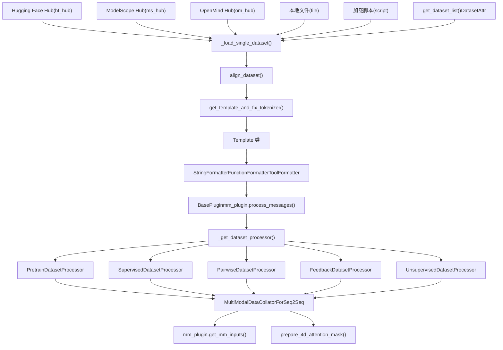
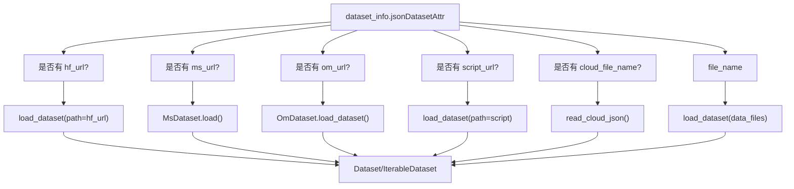
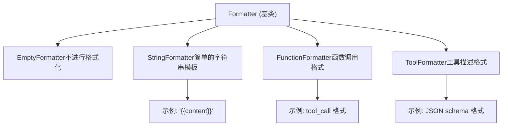
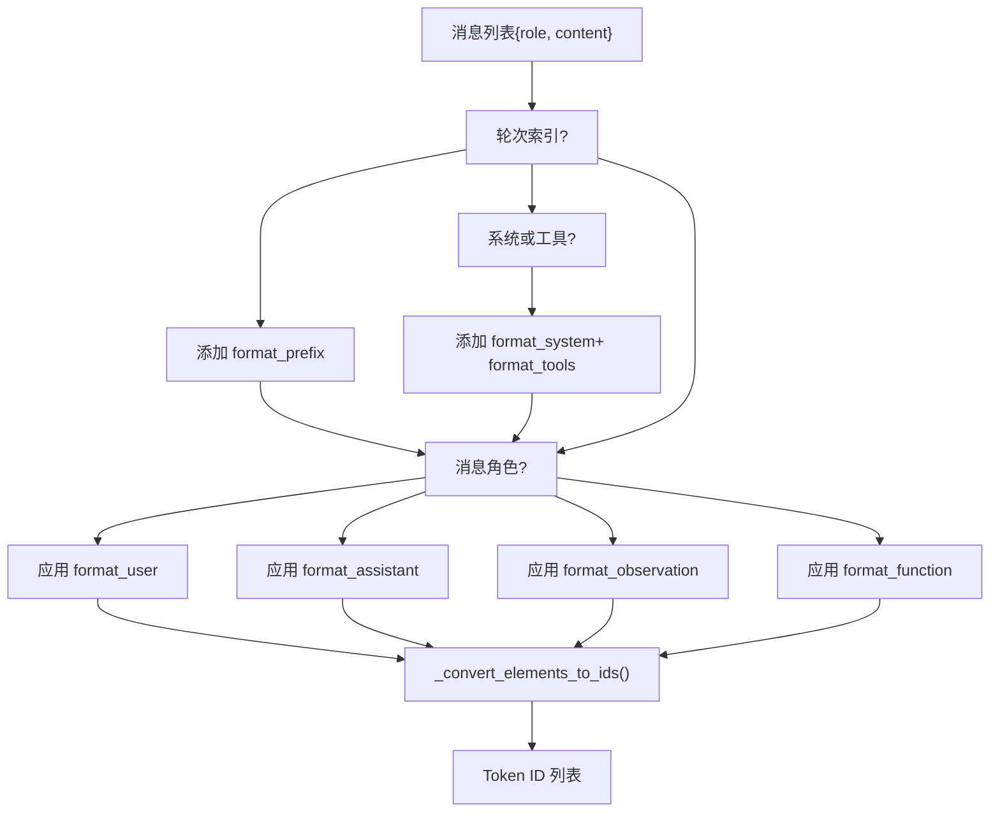
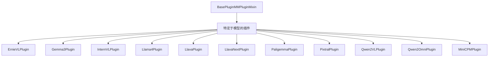
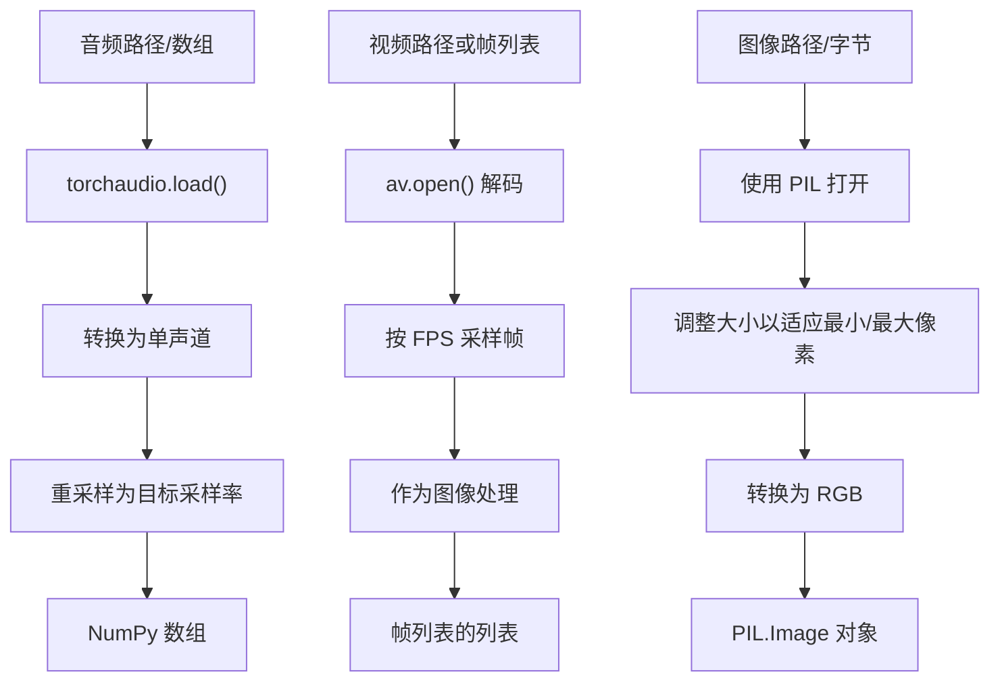
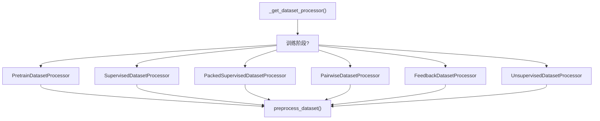
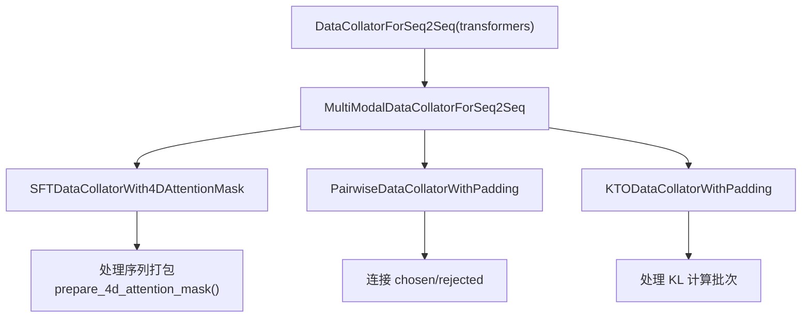
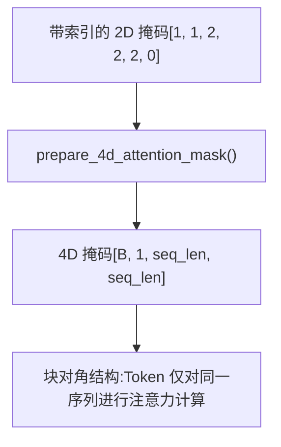

# 数据流水线

相关源文件

-   [data/README.md](https://github.com/hiyouga/LlamaFactory/blob/355d5c5e/data/README.md?plain=1)
-   [data/README\_zh.md](https://github.com/hiyouga/LlamaFactory/blob/355d5c5e/data/README_zh.md?plain=1)
-   [src/llamafactory/data/collator.py](https://github.com/hiyouga/LlamaFactory/blob/355d5c5e/src/llamafactory/data/collator.py)
-   [src/llamafactory/data/loader.py](https://github.com/hiyouga/LlamaFactory/blob/355d5c5e/src/llamafactory/data/loader.py)
-   [src/llamafactory/data/mm\_plugin.py](https://github.com/hiyouga/LlamaFactory/blob/355d5c5e/src/llamafactory/data/mm_plugin.py)
-   [src/llamafactory/data/parser.py](https://github.com/hiyouga/LlamaFactory/blob/355d5c5e/src/llamafactory/data/parser.py)
-   [src/llamafactory/data/template.py](https://github.com/hiyouga/LlamaFactory/blob/355d5c5e/src/llamafactory/data/template.py)
-   [src/llamafactory/extras/constants.py](https://github.com/hiyouga/LlamaFactory/blob/355d5c5e/src/llamafactory/extras/constants.py)
-   [src/llamafactory/hparams/data\_args.py](https://github.com/hiyouga/LlamaFactory/blob/355d5c5e/src/llamafactory/hparams/data_args.py)
-   [src/llamafactory/model/model\_utils/misc.py](https://github.com/hiyouga/LlamaFactory/blob/355d5c5e/src/llamafactory/model/model_utils/misc.py)
-   [src/llamafactory/model/model\_utils/visual.py](https://github.com/hiyouga/LlamaFactory/blob/355d5c5e/src/llamafactory/model/model_utils/visual.py)
-   [src/llamafactory/webui/components/\_\_init\_\_.py](https://github.com/hiyouga/LlamaFactory/blob/355d5c5e/src/llamafactory/webui/components/__init__.py)
-   [src/llamafactory/webui/components/footer.py](https://github.com/hiyouga/LlamaFactory/blob/355d5c5e/src/llamafactory/webui/components/footer.py)
-   [tests/data/test\_mm\_plugin.py](https://github.com/hiyouga/LlamaFactory/blob/355d5c5e/tests/data/test_mm_plugin.py)
-   [tests/version.txt](https://github.com/hiyouga/LlamaFactory/blob/355d5c5e/tests/version.txt)

## 目的与范围

数据流水线负责为模型训练的所有阶段（预训练、指令微调、奖励建模、偏好学习）加载、处理和准备训练数据。它处理来自多个源的数据，应用特定于模型的聊天模板，处理多模态输入（图像、视频、音频），进行文本标记化（Tokenization），生成训练标签，并将序列分批（Batching）以实现高效训练。

有关模型加载和配置，请参见[模型加载与配置](/hiyouga/LlamaFactory/5-model-loading-and-configuration)。有关训练系统的详细信息，请参见[训练系统](/hiyouga/LlamaFactory/6-training-system)。有关数据集格式规范，请参见[数据集格式参考](/hiyouga/LlamaFactory/10.2-dataset-format-reference)。

## 概览

数据流水线流经六个主要阶段：

| 阶段 | 主要组件 | 输出 |
| --- | --- | --- |
| **数据集加载** | `get_dataset_list()`, `_load_single_dataset()` | 来自各种源的原始数据集 |
| **格式对齐** | 转换器中的 `align_dataset()` | 标准化格式 (Alpaca/ShareGPT) |
| **模板应用** | `Template` 类, `Formatter` 类 | 格式化的对话字符串 |
| **多模态处理** | `BasePlugin` 及其子类 | 正则化的媒体 + 占位符扩展 |
| **标记化** | 数据集处理器 (`SupervisedDatasetProcessor` 等) | Token ID + 标签 |
| **批处理** | `MultiModalDataCollatorForSeq2Seq` | 带有注意力掩码的训练批次 |

**来源:** [src/llamafactory/data/loader.py276-337](https://github.com/hiyouga/LlamaFactory/blob/355d5c5e/src/llamafactory/data/loader.py#L276-L337)

## 流水线架构


**来源:** [src/llamafactory/data/loader.py51-162](https://github.com/hiyouga/LlamaFactory/blob/355d5c5e/src/llamafactory/data/loader.py#L51-L162) [src/llamafactory/data/loader.py276-337](https://github.com/hiyouga/LlamaFactory/blob/355d5c5e/src/llamafactory/data/loader.py#L276-L337)

## 数据集加载与数据源

### 来源路由

流水线支持五种数据源类型，通过 `dataset_info.json` 配置：


**来源:** [src/llamafactory/data/parser.py93-149](https://github.com/hiyouga/LlamaFactory/blob/355d5c5e/src/llamafactory/data/parser.py#L93-L149) [src/llamafactory/data/loader.py51-162](https://github.com/hiyouga/LlamaFactory/blob/355d5c5e/src/llamafactory/data/loader.py#L51-L162)

### DatasetAttr 配置

`DatasetAttr` 类存储所有数据集元数据：

| 字段 | 类型 | 目的 |
| --- | --- | --- |
| `load_from` | Literal | 来源类型：`hf_hub`, `ms_hub`, `om_hub`, `script`, `file` |
| `dataset_name` | str | 存储库 ID 或文件路径 |
| `formatting` | Literal | 数据格式：`alpaca`, `sharegpt`, `openai` (默认：`alpaca`) |
| `ranking` | bool | 数据集是否用于偏好学习 (默认：`False`) |
| `subset` | str | 数据集子集名称 |
| `split` | str | 要使用的数据集拆分 (默认：`train`) |
| `folder` | str | 存储库内的文件夹 |
| `num_samples` | int | 要使用的样本数量 |

**列映射** (Alpaca 格式):

-   `prompt`: 指令列 (默认：`instruction`)
-   `query`: 输入列 (默认：`input`)
-   `response`: 输出列 (默认：`output`)
-   `history`: 对话历史列
-   `system`: 系统提示词列
-   `tools`: 工具描述列
-   `images`, `videos`, `audios`: 多模态输入列
-   `chosen`, `rejected`: 偏好学习列
-   `kto_tag`: KTO 反馈列

**列映射** (ShareGPT 格式):

-   `messages`: 对话列表列 (默认：`conversations`)
-   角色标签: `role_tag`, `content_tag`, `user_tag`, `assistant_tag`, `observation_tag`, `function_tag`, `system_tag`

**来源:** [src/llamafactory/data/parser.py26-91](https://github.com/hiyouga/LlamaFactory/blob/355d5c5e/src/llamafactory/data/parser.py#L26-L91) [data/README.md7-44](https://github.com/hiyouga/LlamaFactory/blob/355d5c5e/data/README.md?plain=1#L7-L44)

### 加载过程

`_load_single_dataset()` 函数实现加载工作流：

1.  **解析配置**: 从 `DatasetAttr` 提取 `data_path`, `data_name`, `data_dir`, `data_files`
2.  **加载数据集**: 根据 `load_from` 调用相应的加载函数
3.  **样本数据集**: 如果指定了 `num_samples`，则进行随机采样（如果需要则有放回采样）
4.  **截断数据集**: 如果指定了 `max_samples`，则选择前 N 个样本
5.  **对齐格式**: 调用 `align_dataset()` 转换为标准化格式

**关键特性**:

-   通过 `data_args.streaming` 支持流式模式
-   处理多种文件类型：json, jsonl, csv, parquet, arrow (参见 `FILEEXT2TYPE`)
-   自动从 ModelScope/OpenMind 格式转换为 HuggingFace `Dataset`

**来源:** [src/llamafactory/data/loader.py51-162](https://github.com/hiyouga/LlamaFactory/blob/355d5c5e/src/llamafactory/data/loader.py#L51-L162) [src/llamafactory/extras/constants.py41-48](https://github.com/hiyouga/LlamaFactory/blob/355d5c5e/src/llamafactory/extras/constants.py#L41-L48)

### 数据集合并

多个数据集通过 `merge_dataset()` 合并，共有三种策略：

| 策略 | 行为 | 使用场景 |
| --- | --- | --- |
| `concat` | 按顺序连接所有数据集 | 简单组合 |
| `interleave_under` | 使用欠采样进行交错 (从最小的数据集采样) | 在不平衡的数据集上进行平衡训练 |
| `interleave_over` | 使用过采样进行交错 (从最大的数据集采样) | 保留所有数据 |

由 `data_args.mix_strategy` 和 `data_args.interleave_probs`（用于加权采样）控制。

**来源:** [src/llamafactory/data/loader.py164-187](https://github.com/hiyouga/LlamaFactory/blob/355d5c5e/src/llamafactory/data/loader.py#L164-L187) [src/llamafactory/hparams/data\_args.py66-73](https://github.com/hiyouga/LlamaFactory/blob/355d5c5e/src/llamafactory/hparams/data_args.py#L66-L73)

## 模板系统

模板系统将原始对话格式化为模型特定的提示词格式。有关详细的格式规范，请参见[数据集格式与模板](/hiyouga/LlamaFactory/4.2-dataset-formats-and-templates)。

### 模板组件

一个 `Template` 对象包含：

| 组件 | 类型 | 目的 |
| --- | --- | --- |
| `format_user` | Formatter | 格式化用户消息 |
| `format_assistant` | Formatter | 格式化助手响应 |
| `format_system` | Formatter | 格式化系统提示词 |
| `format_function` | Formatter | 格式化函数调用 |
| `format_observation` | Formatter | 格式化函数结果 |
| `format_tools` | Formatter | 格式化工具描述 |
| `format_prefix` | Formatter | 格式化对话前缀 |
| `default_system` | str | 默认系统消息 |
| `stop_words` | list\[str\] | 额外的停止 Token |
| `thought_words` | tuple\[str, str\] | CoT 分隔符 (例如：\`\`) |
| `tool_call_words` | tuple\[str, str\] | 工具调用分隔符 |
| `efficient_eos` | bool | 是否在格式化器中省略 EOS Token |
| `replace_eos` | bool | 用停止词替换分词器的 EOS |
| `mm_plugin` | BasePlugin | 多模态处理插件 |

**来源:** [src/llamafactory/data/template.py40-58](https://github.com/hiyouga/LlamaFactory/blob/355d5c5e/src/llamafactory/data/template.py#L40-L58)

### 格式化器类型


每个格式化器都有一个包含模板元素的 `slots` 属性：

-   **字符串**: 带有 `{{content}}` 占位符的字面文本
-   **字典**: 特殊 Token，如 `{"token": "<reserved_102>"}`
-   **集合**: Token 引用，如 `{"bos_token"}`, `{"eos_token"}`

**来源:** [src/llamafactory/data/formatter.py](https://github.com/hiyouga/LlamaFactory/blob/355d5c5e/src/llamafactory/data/formatter.py) [src/llamafactory/data/template.py505-536](https://github.com/hiyouga/LlamaFactory/blob/355d5c5e/src/llamafactory/data/template.py#L505-L536)

### 模板应用

`Template._encode()` 方法将消息转换为 Token ID：


**关键方法**:

-   `encode_oneturn()`: 返回用于单轮编码的 `(prompt_ids, response_ids)`
-   `encode_multiturn()`: 返回多轮对话的 `(prompt_ids, response_ids)` 元组列表
-   `extract_tool()`: 从助手消息中提取函数调用
-   `get_stop_token_ids()`: 返回所有停止 Token ID，包括自定义停止词

**来源:** [src/llamafactory/data/template.py59-169](https://github.com/hiyouga/LlamaFactory/blob/355d5c5e/src/llamafactory/data/template.py#L59-L169)

### 推理模板

`ReasoningTemplate` 子类处理具有思维链（Chain-of-Thought）能力的模型：

**行为**:

-   如果数据中不存在空 CoT 标签 (\`\`)，则自动添加
-   当 `enable_thinking=True` 时：CoT 添加到响应中（在 CoT 上计算损失）
-   当 `enable_thinking=False` 时：CoT 添加到提示词中（不在 CoT 上计算损失）
-   当 `enable_thinking=None` 时：根据数据内容采用自适应模式

**方法**:

-   `add_thought()`: 用思维分隔符包装内容
-   `remove_thought()`: 从内容中剥离 CoT 标签
-   `get_thought_word_ids()`: 返回标记化的空 CoT 序列

**来源:** [src/llamafactory/data/template.py404-460](https://github.com/hiyouga/LlamaFactory/blob/355d5c5e/src/llamafactory/data/template.py#L404-L460)

### 模板注册

模板通过 `register_template()` 注册：

```python
register_template(
    name="alpaca",
    format_user=StringFormatter(slots=["### Instruction:\n{{content}}\n\n### Response:\n"]),
    format_assistant=StringFormatter(slots=["{{content}}", {"eos_token"}, "\n\n"]),
    default_system="Below is an instruction...",
    replace_jinja_template=True,
)
```
注册表 `TEMPLATES` 包含 100 多个预定义模板（alpaca, llama2, chatglm, qwen 等）。

**来源:** [src/llamafactory/data/template.py465-536](https://github.com/hiyouga/LlamaFactory/blob/355d5c5e/src/llamafactory/data/template.py#L465-L536) [src/llamafactory/data/template.py641-1978](https://github.com/hiyouga/LlamaFactory/blob/355d5c5e/src/llamafactory/data/template.py#L641-L1978)

## 多模态处理

多模态插件系统处理图像、视频和音频输入。详见[多模态数据处理](/hiyouga/LlamaFactory/4.3-multimodal-data-processing)。

### 插件架构


**来源:** [src/llamafactory/data/mm\_plugin.py412-466](https://github.com/hiyouga/LlamaFactory/blob/355d5c5e/src/llamafactory/data/mm_plugin.py#L412-L466)

### 插件接口

每个插件实现三个关键方法：

| 方法 | 目的 | 输入 | 输出 |
| --- | --- | --- | --- |
| `process_messages()` | 标记化前的消息处理 | messages, images, videos, audios, processor | 扩展了占位符的修改后消息 |
| `process_token_ids()` | 标记化后的 ID 处理 | input\_ids, labels, images, videos, audios, tokenizer, processor | 修改后的 (input\_ids, labels) |
| `get_mm_inputs()` | 批处理多模态输入准备 | images, videos, audios, lens, batch\_ids, processor | 张量字典 (pixel\_values 等) |

**来源:** [src/llamafactory/data/mm\_plugin.py413-466](https://github.com/hiyouga/LlamaFactory/blob/355d5c5e/src/llamafactory/data/mm_plugin.py#L413-L466)

### 媒体正则化

`MMPluginMixin` 提供媒体预处理：


**关键参数**:

-   图像: `image_max_pixels` (默认：768×768), `image_min_pixels` (默认：32×32)
-   视频: `video_max_pixels` (默认：256×256), `video_min_pixels` (默认：16×16), `video_fps` (默认：2.0), `video_maxlen` (默认：128 帧)
-   音频: `audio_sampling_rate` (默认：16000 Hz)

**来源:** [src/llamafactory/data/mm\_plugin.py221-324](https://github.com/hiyouga/LlamaFactory/blob/355d5c5e/src/llamafactory/data/mm_plugin.py#L221-L324)

### 多模态输入生成

`_get_mm_inputs()` 方法将正则化的媒体处理为模型输入：

**图像处理**:

```python
image_processor(images, return_tensors="pt")
# 返回: {"pixel_values": Tensor[B, C, H, W]}
# 对于 Qwen2-VL: {"pixel_values": Tensor[num_patches, patch_dim], 
#                "image_grid_thw": Tensor[num_images, 3]}
```
**视频处理**:

```python
video_processor(videos=videos, return_tensors="pt")
# 返回: {"pixel_values": Tensor[...], "video_grid_thw": Tensor[...]}
```
**音频处理**:

```python
feature_extractor(audios, sampling_rate=16000, return_tensors="pt")
# 返回: {"input_features": Tensor[...], "feature_attention_mask": Tensor[...]}
```
**来源:** [src/llamafactory/data/mm\_plugin.py325-409](https://github.com/hiyouga/LlamaFactory/blob/355d5c5e/src/llamafactory/data/mm_plugin.py#L325-L409)

### 占位符扩展

不同模型使用不同的占位符策略：

| 模型 | 策略 | 示例 |
| --- | --- | --- |
| LLaVA | 重复 Token N 次 | `<image>` → `<image>` × 576 |
| PaliGemma | 移除占位符，在开头添加 Token | `<image>` → (移除), Token 在开头添加 |
| Qwen2-VL | 基于网格的动态扩展 | `<image>` → \`< |
| InternVL | 在特殊标签中的上下文 Token | `<image>` → `<IMG_CONTEXT>×256</img>` |
| Pixtral | 带中断的网格布局 | `<image>` → `[IMG][IMG_BREAK][IMG][IMG_END]` |

**来源:** [tests/data/test\_mm\_plugin.py135-337](https://github.com/hiyouga/LlamaFactory/blob/355d5c5e/tests/data/test_mm_plugin.py#L135-L337)

## 标记化与标签生成

### 数据集处理器

流水线根据训练阶段选择处理器：


**来源:** [src/llamafactory/data/loader.py189-227](https://github.com/hiyouga/LlamaFactory/blob/355d5c5e/src/llamafactory/data/loader.py#L189-L227)

### 指令微调处理器

`SupervisedDatasetProcessor` 实现了核心标记化逻辑：

**处理流程**:

1.  **提取消息**: 将数据集解析为对话消息
2.  **处理消息**: 应用 `mm_plugin.process_messages()` 进行多模态占位符处理
3.  **应用模板**: 使用 `template.encode_oneturn()` 或 `template.encode_multiturn()`
4.  **处理 Token ID**: 应用 `mm_plugin.process_token_ids()` 进行标记化后的调整
5.  **生成标签**: 掩码（Mask）提示词 Token（设置为 `IGNORE_INDEX=-100`），保留响应 Token
6.  **处理历史掩码**: 如果 `mask_history=True`，则仅在最后一轮计算损失

**标签掩码策略**:

```text
第 0 轮: [PROMPT_IDS][RESPONSE_IDS]
标签: [-100...    ][RESPONSE_IDS]  (提示词被掩码)

第 1 轮: [PROMPT_IDS][RESPONSE_IDS]
标签: [-100...    ][RESPONSE_IDS]  (提示词被掩码)
```
如果 `train_on_prompt=True`，则不掩码提示词标签。

**来源:** [src/llamafactory/data/processor.py](https://github.com/hiyouga/LlamaFactory/blob/355d5c5e/src/llamafactory/data/processor.py)

### 序列打包

当 `packing=True` 时，`PackedSupervisedDatasetProcessor` 将多个序列打包到固定长度的块（Block）中：

**打包算法**:

1.  收集序列，直到累积长度 ≥ `cutoff_len`
2.  使用唯一的注意力掩码索引进行连接：`[1, 1, 2, 2, 2, 0, 0]`
    -   相同索引 = 相同序列
    -   索引 0 = 填充 (Padding)
3.  序列仅对自身进行注意力计算（通过块对角注意力掩码）

**优点**:

-   减少填充开销
-   提高训练吞吐量（对于短序列可提高多达 2-3 倍）

**局限性**:

-   跨注意力模型需要 `neat_packing=True`
-   与 `train_on_prompt=True` 不兼容

**来源:** [src/llamafactory/data/processor.py](https://github.com/hiyouga/LlamaFactory/blob/355d5c5e/src/llamafactory/data/processor.py) [src/llamafactory/hparams/data\_args.py106-113](https://github.com/hiyouga/LlamaFactory/blob/355d5c5e/src/llamafactory/hparams/data_args.py#L106-L113)

### 偏好数据集处理

**成对（Pairwise）格式** (用于 DPO, ORPO, SimPO):

```json
{
    "chosen_input_ids": [...],
    "chosen_labels": [...],
    "rejected_input_ids": [...],
    "rejected_labels": [...]
}
```
**KTO 格式**:

```json
{
    "input_ids": [...],        # 补全
    "labels": [...],
    "kl_input_ids": [...],     # 仅提示词 (用于 KL 项)
    "kl_labels": [...],
    "kto_tags": bool           # True=被选中, False=被拒绝
}
```
**来源:** [src/llamafactory/data/processor.py](https://github.com/hiyouga/LlamaFactory/blob/355d5c5e/src/llamafactory/data/processor.py)

## 数据整理与批处理

### 整理器（Collator）架构


**来源:** [src/llamafactory/data/collator.py84-332](https://github.com/hiyouga/LlamaFactory/blob/355d5c5e/src/llamafactory/data/collator.py#L84-L332)

### 多模态批次准备

`MultiModalDataCollatorForSeq2Seq.__call__()` 方法：

**步骤**:

1.  **提取多模态输入**: 从特征中收集 `images`, `videos`, `audios`
2.  **处理空批次**: 对于 zero3/FSDP，注入伪多模态数据以避免挂起
3.  **获取多模态输入**: 调用 `mm_plugin.get_mm_inputs()` 处理所有媒体
4.  **处理 Token 类型 ID**: 对于 PaliGemma/Gemma3，提取并分配 `token_type_ids`
5.  **调用父类整理器**: 运行基础 `DataCollatorForSeq2Seq` 进行填充
6.  **计算 RoPE 索引**: 对于 Qwen2-VL 模型，为 M-RoPE 计算 3D 位置 ID
7.  **合并多模态输入**: 将 `pixel_values`, `image_grid_thw` 等添加到批次中

**来源:** [src/llamafactory/data/collator.py108-242](https://github.com/hiyouga/LlamaFactory/blob/355d5c5e/src/llamafactory/data/collator.py#L108-L242)

### 打包所需的 4D 注意力掩码

当 `block_diag_attn=True` 且 `attn_implementation!="flash_attention_2"` 时，整理器生成 4D 注意力掩码：


**掩码构造**:

```text
输入:  [1, 1, 2, 2, 2, 0]

输出 (简化):
        [o, x, x, x, x, x]  # Token 0 注意到 [0-1]
        [o, o, x, x, x, x]  # Token 1 注意到 [0-1]
        [x, x, o, x, x, x]  # Token 2 注意到 [2-4]
        [x, x, o, o, x, x]  # Token 3 注意到 [2-4]
        [x, x, o, o, o, x]  # Token 4 注意到 [2-4]
        [x, x, x, x, x, x]  # Token 5 (填充)

其中: o = 0.0 (计算注意力), x = min_dtype (掩码)
```
**来源:** [src/llamafactory/data/collator.py41-82](https://github.com/hiyouga/LlamaFactory/blob/355d5c5e/src/llamafactory/data/collator.py#L41-L82) [src/llamafactory/data/collator.py244-262](https://github.com/hiyouga/LlamaFactory/blob/355d5c5e/src/llamafactory/data/collator.py#L244-L262)

### 批次输出格式

最终训练批次结构：

| 键 | 形状 | 描述 |
| --- | --- | --- |
| `input_ids` | `[batch_size, seq_len]` | Token ID |
| `attention_mask` | `[batch_size, seq_len]` 或 `[batch_size, 1, seq_len, seq_len]` | 注意力掩码 (2D 或 4D) |
| `labels` | `[batch_size, seq_len]` | 目标 Token ID (带有 `-100` 掩码) |
| `pixel_values` | 依模型而异 | 图像/视频像素值 |
| `image_grid_thw` | `[num_images, 3]` | Qwen2-VL 图像网格维度 |
| `video_grid_thw` | `[num_videos, 3]` | Qwen2-VL 视频网格维度 |
| `input_features` | `[batch_size, ...]` | 音频特征 |
| `feature_attention_mask` | `[batch_size, ...]` | 音频注意力掩码 |
| `position_ids` | `[batch_size, seq_len]` 或 `[batch_size, 3, seq_len]` | 位置 ID (2D 或 3D 针对 M-RoPE) |
| `rope_deltas` | `[batch_size, seq_len]` | Qwen2-VL RoPE 增量值 |
| `token_type_ids` | `[batch_size, seq_len]` | PaliGemma/Gemma3 Token 类型 |
| `cross_attention_mask` | `[batch_size, seq_len, num_tiles]` | Mllama 跨注意力掩码 |

**来源:** [src/llamafactory/data/collator.py183-242](https://github.com/hiyouga/LlamaFactory/blob/355d5c5e/src/llamafactory/data/collator.py#L183-L242)

## 关键配置参数

### 数据参数

`DataArguments` 类控制整个流水线：

| 参数 | 类型 | 默认值 | 目的 |
| --- | --- | --- | --- |
| `template` | str | None | 模板名称 (例如：`"llama3"`, `"qwen2"`) |
| `dataset` | str | None | 数据集名称 (逗号分隔) |
| `eval_dataset` | str | None | 评估数据集名称 |
| `dataset_dir` | str | `"data"` | 包含数据集和 `dataset_info.json` 的目录 |
| `media_dir` | str | None | 媒体文件目录 (默认为 `dataset_dir`) |
| `cutoff_len` | int | 2048 | 最大序列长度 |
| `train_on_prompt` | bool | False | 是否在提示词上计算损失 |
| `mask_history` | bool | False | 是否掩码历史轮次 (仅在最后一轮训练) |
| `streaming` | bool | False | 启用流式模式 |
| `buffer_size` | int | 16384 | 流式缓冲区大小 |
| `mix_strategy` | Literal | `"concat"` | 数据集混合策略：`concat`, `interleave_under`, `interleave_over` |
| `interleave_probs` | str | None | 交错策略的采样概率 |
| `packing` | bool | None | 启用序列打包 (预训练时自动启用) |
| `neat_packing` | bool | False | 不使用跨注意力的打包 |
| `preprocessing_num_workers` | int | None | 预处理的工作进程数 |
| `preprocessing_batch_size` | int | 1000 | 预处理的批次大小 |
| `val_size` | float | 0.0 | 验证集拆分大小 |
| `max_samples` | int | None | 每个数据集的最大样本数 (用于调试) |
| `tool_format` | str | None | 函数调用格式 |
| `default_system` | str | None | 覆盖默认系统消息 |
| `enable_thinking` | bool | None | 为推理模型启用 CoT |
| `tokenized_path` | str | None | 保存/加载标记化后的数据集的路径 |

**来源:** [src/llamafactory/hparams/data\_args.py22-175](https://github.com/hiyouga/LlamaFactory/blob/355d5c5e/src/llamafactory/hparams/data_args.py#L22-L175)

### 模板选择

模板选择依据：

1.  **明确指定**: `data_args.template="llama3"`
2.  **自动检测**: 如果可用，从 `tokenizer.chat_template` 解析
3.  **后备**: 如果两者都未指定，则使用 `"empty"` 模板

`DEFAULT_TEMPLATE` 映射（在 `constants.py` 中）基于模型名称模式（例如 `-Chat`, `-Instruct`）为指令微调模型提供默认值。

**来源:** [src/llamafactory/data/template.py600-639](https://github.com/hiyouga/LlamaFactory/blob/355d5c5e/src/llamafactory/data/template.py#L600-L639) [src/llamafactory/extras/constants.py39-169](https://github.com/hiyouga/LlamaFactory/blob/355d5c5e/src/llamafactory/extras/constants.py#L39-L169)

### 内存与性能

**流式模式** (`streaming=True`):

-   从磁盘/Hub 增量加载数据
-   减少大型数据集的内存占用
-   与 `val_size` < 1 和 `max_samples` 不兼容

**预处理并行化**:

-   `preprocessing_num_workers`: `.map()` 操作的进程数
-   `preprocessing_batch_size`: 数据集处理的批次大小（影响内存）

**缓存**:

-   `overwrite_cache=True`: 强制重新计算预处理数据
-   `tokenized_path`: 保存/加载完整的预处理数据集以跳过流水线

**来源:** [src/llamafactory/hparams/data\_args.py58-77](https://github.com/hiyouga/LlamaFactory/blob/355d5c5e/src/llamafactory/hparams/data_args.py#L58-L77) [src/llamafactory/data/loader.py229-274](https://github.com/hiyouga/LlamaFactory/blob/355d5c5e/src/llamafactory/data/loader.py#L229-L274)

## 流水线集成

完整的流水线通过 `get_dataset()` 调用：

```python
from llamafactory.data import get_dataset

dataset_module = get_dataset(
    template=template,
    model_args=model_args,
    data_args=data_args,
    training_args=training_args,
    stage="sft",  # pt, sft, rm, ppo, kto
    tokenizer=tokenizer,
    processor=processor,
)

# 返回: 包含 train_dataset, eval_dataset, data_collator 的 DatasetModule
```
**内部流程**:

1.  检查 `tokenized_path` 处的缓存标记化数据
2.  通过 `_get_merged_dataset()` 加载并合并数据集
3.  通过 `split_dataset()` 拆分为训练集/评估集
4.  通过 `_get_preprocessed_dataset()` 进行预处理（应用处理器）
5.  可选地保存标记化数据
6.  返回带有数据集和整理器的 `DatasetModule`

**来源:** [src/llamafactory/data/loader.py276-337](https://github.com/hiyouga/LlamaFactory/blob/355d5c5e/src/llamafactory/data/loader.py#L276-L337)
