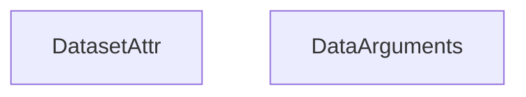
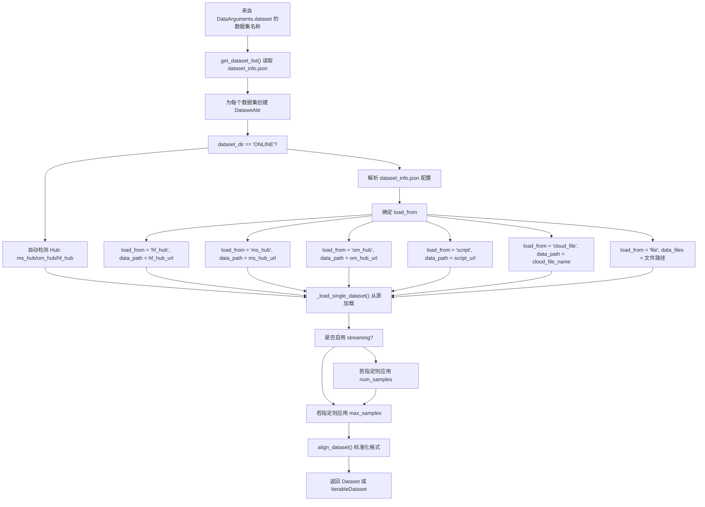
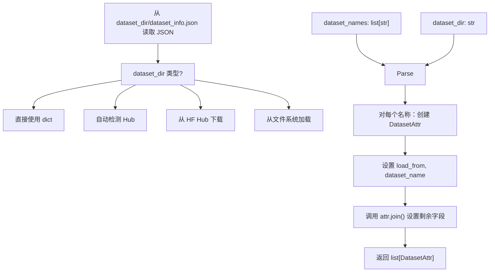
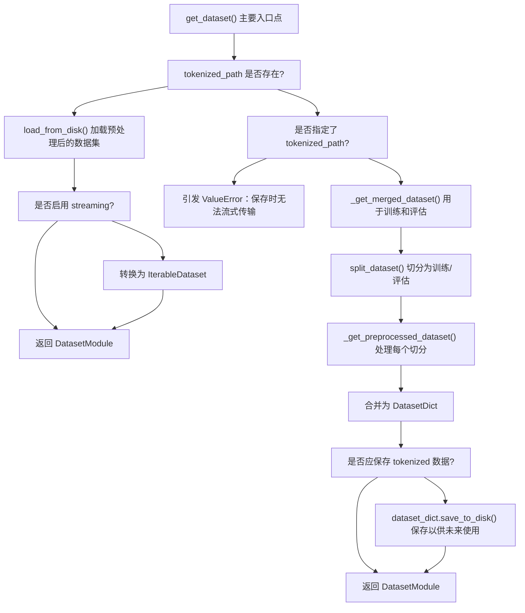
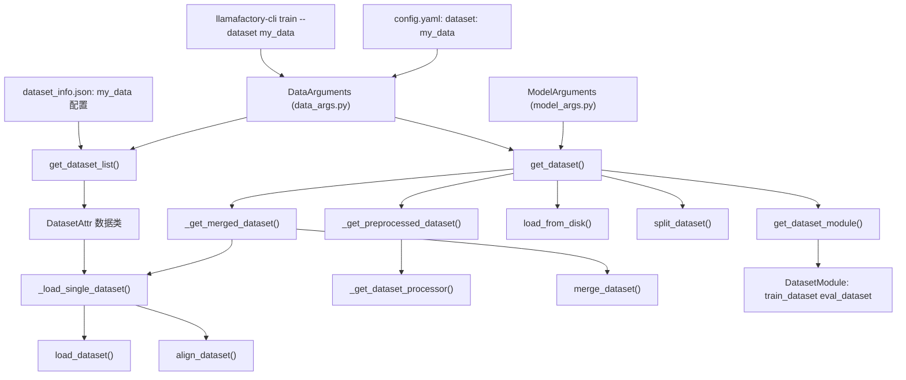

# 数据集加载与数据源

相关源文件

-   [data/README.md](https://github.com/hiyouga/LlamaFactory/blob/355d5c5e/data/README.md?plain=1)
-   [data/README\_zh.md](https://github.com/hiyouga/LlamaFactory/blob/355d5c5e/data/README_zh.md?plain=1)
-   [src/llamafactory/data/loader.py](https://github.com/hiyouga/LlamaFactory/blob/355d5c5e/src/llamafactory/data/loader.py)
-   [src/llamafactory/data/parser.py](https://github.com/hiyouga/LlamaFactory/blob/355d5c5e/src/llamafactory/data/parser.py)
-   [src/llamafactory/hparams/data\_args.py](https://github.com/hiyouga/LlamaFactory/blob/355d5c5e/src/llamafactory/hparams/data_args.py)
-   [src/llamafactory/webui/components/\_\_init\_\_.py](https://github.com/hiyouga/LlamaFactory/blob/355d5c5e/src/llamafactory/webui/components/__init__.py)
-   [src/llamafactory/webui/components/footer.py](https://github.com/hiyouga/LlamaFactory/blob/355d5c5e/src/llamafactory/webui/components/footer.py)

本页档详细说明了 LlamaFactory 如何从各种来源加载数据集并为其配置训练与评估。涵盖了数据集配置系统（`dataset_info.json`）、受支持的数据源，以及将原始数据转换为标准数据集的加载流水线。

有关已加载数据集如何进行格式化及模板处理的信息，请参阅[数据集格式与模板](/hiyouga/LlamaFactory/4.2-dataset-formats-and-templates)。有关多模态数据处理，请参阅[多模态数据处理](/hiyouga/LlamaFactory/4.3-multimodal-data-processing)。有关数据集如何分批进行训练，请参阅[数据整理与分批](/hiyouga/LlamaFactory/4.4-data-collation-and-batching)。

## 概览

LlamaFactory 的数据加载系统提供了一个统一的接口，用于从多个来源加载数据集，同时保持了数据集配置的灵活性。该系统使用声明式配置文件（`dataset_info.json`）来指定数据集的位置、格式和列映射，随后通过多阶段流水线加载并标准化数据集。

## 数据集配置系统

### dataset\_info.json 文件

`dataset_info.json` 文件是 LlamaFactory 中使用的所有数据集的中央注册表。它必须放置在 `dataset_dir` 参数指定的目录中（默认：`./data`）。此文件将数据集名称映射到其配置。

**基本结构：**

| 字段 | 类型 | 必要性 | 描述 |
| --- | --- | --- | --- |
| `hf_hub_url` | string | 条件性 | Hugging Face Hub 仓库路径 |
| `ms_hub_url` | string | 条件性 | ModelScope Hub 仓库路径 |
| `om_hub_url` | string | 条件性 | OpenMind Hub 仓库路径 |
| `script_url` | string | 条件性 | 包含数据集加载脚本的本地目录 |
| `cloud_file_name` | string | 条件性 | S3/GCS 云存储文件路径 |
| `file_name` | string | 条件性 | 本地文件或文件夹名称（若未指定 Hub URL 则为必填） |
| `formatting` | string | 可选 | 数据集格式：`alpaca`（默认）或 `sharegpt` |
| `ranking` | boolean | 可选 | 数据集是否用于偏好学习（默认：false） |
| `subset` | string | 可选 | 数据集子集名称 |
| `split` | string | 可选 | 使用的数据集切分（默认：`train`） |
| `folder` | string | 可选 | 仓库内的文件夹 |
| `num_samples` | integer | 可选 | 从数据集中使用的样本数量 |

**列映射：**

`columns` 字段将数据集列映射到 LlamaFactory 的标准名称：

| 标准名称 | 默认列 | 用途 |
| --- | --- | --- |
| `prompt` | `instruction` | 用户指令/提示词 |
| `query` | `input` | 额外的用户输入 |
| `response` | `output` | 模型响应 |
| `history` | None | 对话历史 |
| `messages` | `conversations` | 消息列表（ShareGPT 格式） |
| `system` | None | 系统提示词 |
| `tools` | None | 工具描述 |
| `images` | None | 图像文件路径 |
| `videos` | None | 视频文件路径 |
| `audios` | None | 音频文件路径 |
| `chosen` | None | 偏好的响应（偏好数据集） |
| `rejected` | None | 拒绝的响应（偏好数据集） |
| `kto_tag` | None | KTO 反馈标签 |

**ShareGPT 标签：**

对于 ShareGPT 格式的数据集，`tags` 字段可自定义角色标识符：

| 标签 | 默认值 | 用途 |
| --- | --- | --- |
| `role_tag` | `from` | 发送者角色的键 |
| `content_tag` | `value` | 消息内容的键 |
| `user_tag` | `human` | 用户角色标识符 |
| `assistant_tag` | `gpt` | 助手角色标识符 |
| `observation_tag` | `observation` | 工具结果角色 |
| `function_tag` | `function_call` | 函数调用角色 |
| `system_tag` | `system` | 系统提示词角色 |

**配置示例：**

```json
{
  "alpaca_demo": {
    "file_name": "alpaca_en_demo.json",
    "columns": {
      "prompt": "instruction",
      "query": "input",
      "response": "output"
    }
  },
  "identity": {
    "hf_hub_url": "AI-ModelScope/alpaca-gpt4-data-en",
    "ms_hub_url": "AI-ModelScope/alpaca-gpt4-data",
    "subset": "default"
  },
  "glaive_toolcall": {
    "file_name": "glaive_toolcall_en_demo.json",
    "formatting": "sharegpt",
    "columns": {
      "messages": "conversations",
      "tools": "tools"
    }
  }
}
```
资料来源：[data/README.md7-44](https://github.com/hiyouga/LlamaFactory/blob/355d5c5e/data/README.md?plain=1#L7-L44) [src/llamafactory/data/parser.py26-91](https://github.com/hiyouga/LlamaFactory/blob/355d5c5e/src/llamafactory/data/parser.py#L26-L91)

### DatasetAttr 类

`DatasetAttr` 数据类代表已解析的数据集配置。它是在读取 `dataset_info.json` 时由 `get_dataset_list()` 创建的。


**数据集加载流程：**

资料来源：[src/llamafactory/data/parser.py26-91](https://github.com/hiyouga/LlamaFactory/blob/355d5c5e/src/llamafactory/data/parser.py#L26-L91) [src/llamafactory/hparams/data\_args.py22-187](https://github.com/hiyouga/LlamaFactory/blob/355d5c5e/src/llamafactory/hparams/data_args.py#L22-L187)

## 数据源

LlamaFactory 支持六种不同的数据源，由 `DatasetAttr` 中的 `load_from` 字段决定：

### 1. Hugging Face Hub (`hf_hub`)

直接从 Hugging Face 的数据集仓库加载数据集。

**配置：**

-   在 `dataset_info.json` 中指定 `hf_hub_url`
-   使用 `datasets.load_dataset()` 进行 Hugging Face 身份验证
-   遵循来自 `ModelArguments` 的 `cache_dir` 和 `hf_hub_token`

**加载逻辑：**

```python
# 来自 loader.py:131-141
dataset = load_dataset(
    path=data_path,
    name=data_name,
    data_dir=data_dir,
    data_files=data_files,
    split=dataset_attr.split,
    cache_dir=model_args.cache_dir,
    token=model_args.hf_hub_token,
    num_proc=data_args.preprocessing_num_workers,
    streaming=data_args.streaming
)
```

### 2. ModelScope Hub (`ms_hub`)

从 ModelScope 的仓库加载数据集，常用于中国。

**配置：**

-   在 `dataset_info.json` 中指定 `ms_hub_url`
-   要求 `modelscope>=1.14.0`
-   使用 `MS_DATASETS_CACHE` 进行缓存

**加载逻辑：**

```python
# 来自 loader.py:93-110
from modelscope import MsDataset
dataset = MsDataset.load(
    dataset_name=data_path,
    subset_name=data_name,
    data_dir=data_dir,
    split=dataset_attr.split,
    cache_dir=cache_dir,
    token=model_args.ms_hub_token,
    use_streaming=data_args.streaming
)
if isinstance(dataset, MsDataset):
    dataset = dataset.to_hf_dataset()
```

### 3. OpenMind Hub (`om_hub`)

从 OpenMind 的仓库加载数据集。

**配置：**

-   在 `dataset_info.json` 中指定 `om_hub_url`
-   要求 `openmind>=0.8.0`
-   使用 `OM_DATASETS_CACHE` 进行缓存

**加载逻辑：**

```python
# 来自 loader.py:112-127
from openmind import OmDataset
dataset = OmDataset.load_dataset(
    path=data_path,
    name=data_name,
    data_dir=data_dir,
    split=dataset_attr.split,
    cache_dir=cache_dir,
    token=model_args.om_hub_token,
    streaming=data_args.streaming
)
```

### 4. 本地文件 (`file`)

从各种格式的本地文件加载数据集。

**配置：**

-   在 `dataset_info.json` 中指定 `file_name`
-   路径相对于 `dataset_dir`
-   支持目录或单个文件

**受支持的文件类型：**

| 扩展名 | 数据集类型 | 描述 |
| --- | --- | --- |
| `.json` | JSON | 标准 JSON 格式 |
| `.jsonl` | JSON Lines | 换行符分隔的 JSON |
| `.csv` | CSV | 逗号分隔值 |
| `.parquet` | Parquet | Apache Parquet 列式格式 |
| `.arrow` | Arrow | Apache Arrow 格式 |

**加载逻辑：**

```python
# 来自 loader.py:73-89
data_files = []
local_path = os.path.join(data_args.dataset_dir, dataset_attr.dataset_name)
if os.path.isdir(local_path):
    for file_name in os.listdir(local_path):
        data_files.append(os.path.join(local_path, file_name))
elif os.path.isfile(local_path):
    data_files.append(local_path)
else:
    raise ValueError(f"File {local_path} not found.")
data_path = FILEEXT2TYPE.get(os.path.splitext(data_files[0])[-1][1:], None)
```

**验证：**

-   目录中的所有文件必须具有相同的扩展名
-   文件类型必须在受支持的列表中

### 5. 云存储 (`cloud_file`)

从 S3 或 GCS 云存储加载数据集。

**配置：**

-   在 `dataset_info.json` 中指定 `cloud_file_name`
-   文件必须为 JSON 格式
-   使用 `read_cloud_json()` 获取数据

**加载逻辑：**

```python
# 来自 loader.py:128-129
dataset = Dataset.from_list(
    read_cloud_json(data_path), 
    split=dataset_attr.split
)
```

### 6. 自定义加载脚本 (`script`)

使用自定义 Python 加载脚本加载数据集。

**配置：**

-   在 `dataset_info.json` 中指定 `script_url`
-   指向包含数据集加载脚本的目录
-   脚本必须与 `datasets.load_dataset()` 兼容

**加载逻辑：**

```python
# 来自 loader.py:65-68
data_path = os.path.join(data_args.dataset_dir, dataset_attr.dataset_name)
data_name = dataset_attr.subset
data_dir = dataset_attr.folder
```

**Hub 优先级：**

当指定了多个 Hub URL 时，系统使用以下优先级：

1.  ModelScope Hub（若使用 `use_modelscope()` 或无 HF URL）
2.  OpenMind Hub（若使用 `use_openmind()` 或无 HF URL）
3.  Hugging Face Hub（默认）

资料来源：[src/llamafactory/data/loader.py51-161](https://github.com/hiyouga/LlamaFactory/blob/355d5c5e/src/llamafactory/data/loader.py#L51-L161) [src/llamafactory/data/parser.py93-149](https://github.com/hiyouga/LlamaFactory/blob/355d5c5e/src/llamafactory/data/parser.py#L93-L149)

## 数据集加载流水线


资料来源：[src/llamafactory/data/loader.py51-161](https://github.com/hiyouga/LlamaFactory/blob/355d5c5e/src/llamafactory/data/loader.py#L51-L161) [src/llamafactory/data/parser.py93-149](https://github.com/hiyouga/LlamaFactory/blob/355d5c5e/src/llamafactory/data/parser.py#L93-L149)

### 加载过程阶段

#### 阶段 1：配置解析

`get_dataset_list()` 函数读取 `dataset_info.json` 并创建 `DatasetAttr` 对象：


**远程配置：**

若 `dataset_dir` 以 `REMOTE:` 开头，则配置将从 Hugging Face 仓库获取：

```python
# 来自 parser.py:103-104
config_path = hf_hub_download(
    repo_id=dataset_dir[7:], 
    filename=DATA_CONFIG, 
    repo_type="dataset"
)
```
资料来源：[src/llamafactory/data/parser.py93-149](https://github.com/hiyouga/LlamaFactory/blob/355d5c5e/src/llamafactory/data/parser.py#L93-L149)

#### 阶段 2：单个数据集加载

`_load_single_dataset()` 函数负责从确定的源进行加载：

**关键步骤：**

1.  根据 `load_from` 字段**确定加载参数** [src/llamafactory/data/loader.py59-91](https://github.com/hiyouga/LlamaFactory/blob/355d5c5e/src/llamafactory/data/loader.py#L59-L91)
2.  **调用相应的加载器**（HF、ModelScope、OpenMind 或内置） [src/llamafactory/data/loader.py93-143](https://github.com/hiyouga/LlamaFactory/blob/355d5c5e/src/llamafactory/data/loader.py#L93-L143)
3.  若本地文件启用了流式传输，则**转换为可迭代对象** [src/llamafactory/data/loader.py142-143](https://github.com/hiyouga/LlamaFactory/blob/355d5c5e/src/llamafactory/data/loader.py#L142-L143)
4.  若指定了 `num_samples`，则**应用采样** [src/llamafactory/data/loader.py145-155](https://github.com/hiyouga/LlamaFactory/blob/355d5c5e/src/llamafactory/data/loader.py#L145-L155)
5.  若指定了 `max_samples`，则**进行截断** [src/llamafactory/data/loader.py157-159](https://github.com/hiyouga/LlamaFactory/blob/355d5c5e/src/llamafactory/data/loader.py#L157-L159)
6.  使用 `align_dataset()` **对齐格式** [src/llamafactory/data/loader.py161](https://github.com/hiyouga/LlamaFactory/blob/355d5c5e/src/llamafactory/data/loader.py#L161-L161)

**采样逻辑：**

当指定 `num_samples` 时（与流式传输不兼容）：

```python
# 来自 loader.py:145-154
target_num = dataset_attr.num_samples
indexes = np.random.permutation(len(dataset))[:target_num]
target_num -= len(indexes)
if target_num > 0:  # 需要更多样本 - 进行过采样
    expand_indexes = np.random.choice(len(dataset), target_num)
    indexes = np.concatenate((indexes, expand_indexes), axis=0)
assert len(indexes) == dataset_attr.num_samples
dataset = dataset.select(indexes)
```
资料来源：[src/llamafactory/data/loader.py51-161](https://github.com/hiyouga/LlamaFactory/blob/355d5c5e/src/llamafactory/data/loader.py#L51-L161)

#### 阶段 3：数据集合并

`_get_merged_dataset()` 函数组合多个数据集：

**合并策略：**

| 策略 | 描述 | 何时使用 |
| --- | --- | --- |
| `concat` | 按顺序连接数据集 | 默认，保留数据集顺序 |
| `interleave_under` | 欠采样交错 | 通过限制较大的数据集来平衡数据集 |
| `interleave_over` | 过采样交错 | 通过重复较小的数据集来平衡数据集 |

**配置：**

`DataArguments` 中的 `mix_strategy` 和 `interleave_probs` 参数控制合并：

-   `mix_strategy`：要使用的策略（默认：`concat`）
-   `interleave_probs`：交错策略的采样概率（必须与数据集数量匹配）

**加载流程：**

```python
# 来自 loader.py:164-186
def _get_merged_dataset(dataset_names, ...):
    if dataset_names is None:
        return None
    datasets = {}
    for dataset_name, dataset_attr in zip(
        dataset_names, 
        get_dataset_list(dataset_names, data_args.dataset_dir)
    ):
        # 验证数据集是否适用于当前训练阶段
        if (stage == "rm" and dataset_attr.ranking is False) or \
           (stage != "rm" and dataset_attr.ranking is True):
            raise ValueError("Dataset not applicable in current stage.")
        datasets[dataset_name] = _load_single_dataset(...)
    if return_dict:
        return datasets
    else:
        return merge_dataset(
            list(datasets.values()), 
            data_args, 
            seed=training_args.seed
        )
```
**阶段验证：**

数据集会根据训练阶段进行验证：

-   奖励建模（`rm`）：要求 `ranking=True`
-   其他阶段：要求 `ranking=False`（除非是偏好学习阶段，如 `dpo`、`kto`）

资料来源：[src/llamafactory/data/loader.py164-186](https://github.com/hiyouga/LlamaFactory/blob/355d5c5e/src/llamafactory/data/loader.py#L164-L186)

## 主要入口点：get\_dataset()

`get_dataset()` 函数是加载数据集的主要接口：


**函数签名：**

```python
# 来自 loader.py:276-284
def get_dataset(
    template: "Template",
    model_args: "ModelArguments",
    data_args: "DataArguments",
    training_args: "Seq2SeqTrainingArguments",
    stage: Literal["pt", "sft", "rm", "ppo", "kto"],
    tokenizer: "PreTrainedTokenizer",
    processor: Optional["ProcessorMixin"] = None,
) -> "DatasetModule":
```
**Tokenized 数据集缓存：**

系统支持将预处理后的数据集缓存到磁盘：

1.  **保存**：若指定了 `tokenized_path` 且其不存在，则在预处理后保存数据集 [src/llamafactory/data/loader.py330-334](https://github.com/hiyouga/LlamaFactory/blob/355d5c5e/src/llamafactory/data/loader.py#L330-L334)
2.  **加载**：若 `tokenized_path` 存在，则直接加载数据集，跳过所有预处理步骤 [src/llamafactory/data/loader.py286-296](https://github.com/hiyouga/LlamaFactory/blob/355d5c5e/src/llamafactory/data/loader.py#L286-L296)
3.  **警告**：从磁盘加载会忽略所有其他数据参数 [src/llamafactory/data/loader.py289](https://github.com/hiyouga/LlamaFactory/blob/355d5c5e/src/llamafactory/data/loader.py#L289-L289)

**进程同步：**

加载与预处理使用 `training_args.main_process_first()` 以确保：

-   仅由主进程首先加载数据集 [src/llamafactory/data/loader.py302](https://github.com/hiyouga/LlamaFactory/blob/355d5c5e/src/llamafactory/data/loader.py#L302-L302)
-   其他进程等待并重复使用缓存结果
-   `data_shared_file_system` 参数控制进程是否共享文件系统访问 [src/llamafactory/data/loader.py302](https://github.com/hiyouga/LlamaFactory/blob/355d5c5e/src/llamafactory/data/loader.py#L302-L302)

资料来源：[src/llamafactory/data/loader.py276-336](https://github.com/hiyouga/LlamaFactory/blob/355d5c5e/src/llamafactory/data/loader.py#L276-L336)

## 数据参数配置

[src/llamafactory/hparams/data\_args.py22-187](https://github.com/hiyouga/LlamaFactory/blob/355d5c5e/src/llamafactory/hparams/data_args.py#L22-L187) 中的 `DataArguments` 类定义了所有与数据相关的配置参数：

### 核心参数

| 参数 | 类型 | 默认值 | 描述 |
| --- | --- | --- | --- |
| `dataset` | str | None | 用于训练的以逗号分隔的数据集名称 |
| `eval_dataset` | str | None | 用于评估的以逗号分隔的数据集名称 |
| `dataset_dir` | str | `"data"` | 包含数据集和 `dataset_info.json` 的目录 |
| `media_dir` | str | None | 图像/视频/音频的目录（默认指向 `dataset_dir`） |

### 加载参数

| 参数 | 类型 | 默认值 | 描述 |
| --- | --- | --- | --- |
| `streaming` | bool | False | 为大型数据集启用数据集流式传输 |
| `buffer_size` | int | 16384 | 流式随机采样的缓冲区大小 |
| `max_samples` | int | None | 每个数据集的最大样本数（用于调试） |
| `overwrite_cache` | bool | False | 忽略已缓存的预处理数据集 |
| `preprocessing_num_workers` | int | None | 并行预处理工作进程的数量 |
| `preprocessing_batch_size` | int | 1000 | 预处理操作的批次大小 |

### 混合参数

| 参数 | 类型 | 默认值 | 描述 |
| --- | --- | --- | --- |
| `mix_strategy` | Literal | `"concat"` | 策略：`concat`、`interleave_under`、`interleave_over` |
| `interleave_probs` | str | None | 用于交错的以逗号分隔的采样概率 |

### 切分参数

| 参数 | 类型 | 默认值 | 描述 |
| --- | --- | --- | --- |
| `val_size` | float | 0.0 | 验证集切分大小（整数计数或浮点比例） |
| `eval_on_each_dataset` | bool | False | 分别对每个数据集进行评估 |

### 分词缓存

| 参数 | 类型 | 默认值 | 描述 |
| --- | --- | --- | --- |
| `tokenized_path` | str | None | 保存/加载已分词数据集的路径 |
| `data_shared_file_system` | bool | False | 进程是否共享数据文件系统 |

### 验证规则

`__post_init__` 方法强制执行多项约束：

1.  **无法同时指定 `eval_dataset` 和 `val_size`** [src/llamafactory/hparams/data\_args.py156-157](https://github.com/hiyouga/LlamaFactory/blob/355d5c5e/src/llamafactory/hparams/data_args.py#L156-L157)
2.  **若无 `dataset` 则无法使用 `val_size`** [src/llamafactory/hparams/data\_args.py153-154](https://github.com/hiyouga/LlamaFactory/blob/355d5c5e/src/llamafactory/hparams/data_args.py#L153-L154)
3.  **交错概率必须与数据集数量匹配** [src/llamafactory/hparams/data\_args.py164-168](https://github.com/hiyouga/LlamaFactory/blob/355d5c5e/src/llamafactory/hparams/data_args.py#L164-L168)
4.  **流式模式要求 `val_size` 为整数** [src/llamafactory/hparams/data\_args.py170-171](https://github.com/hiyouga/LlamaFactory/blob/355d5c5e/src/llamafactory/hparams/data_args.py#L170-L171)
5.  **`max_samples` 与流式传输不兼容** [src/llamafactory/hparams/data\_args.py173-174](https://github.com/hiyouga/LlamaFactory/blob/355d5c5e/src/llamafactory/hparams/data_args.py#L173-L174)

资料来源：[src/llamafactory/hparams/data\_args.py22-187](https://github.com/hiyouga/LlamaFactory/blob/355d5c5e/src/llamafactory/hparams/data_args.py#L22-L187)

## 示例

### 示例 1：加载单个本地数据集

**`dataset_info.json` 中的配置：**

```json
{
  "my_dataset": {
    "file_name": "my_data.json",
    "columns": {
      "prompt": "instruction",
      "response": "output"
    }
  }
}
```
**用法：**

```python
data_args.dataset = "my_dataset"
data_args.dataset_dir = "./data"
```
系统将：

1.  解析 `./data/dataset_info.json`
2.  创建具有 `load_from="file"` 和 `dataset_name="my_data.json"` 的 `DatasetAttr`
3.  使用 `load_dataset("json", data_files=...)` 加载 `./data/my_data.json`
4.  映射 `instruction` → `prompt` 以及 `output` → `response`

### 示例 2：交错混合多个数据集

**配置：**

```json
{
  "dataset_a": {"file_name": "dataset_a.json"},
  "dataset_b": {"file_name": "dataset_b.json"},
  "dataset_c": {"file_name": "dataset_c.json"}
}
```
**用法：**

```python
data_args.dataset = "dataset_a,dataset_b,dataset_c"
data_args.mix_strategy = "interleave_under"
data_args.interleave_probs = "0.5,0.3,0.2"
```
系统将加载所有三个数据集，并按照指定的概率进行交错，同时对较大的数据集进行欠采样以实现平衡。

### 示例 3：从 Hugging Face Hub 加载

**配置：**

```json
{
  "alpaca_gpt4": {
    "hf_hub_url": "vicgalle/alpaca-gpt4",
    "subset": "default",
    "split": "train"
  }
}
```
系统将直接从 Hugging Face Hub 加载，无需本地文件。

### 示例 4：使用 ONLINE 模式

**用法：**

```python
data_args.dataset = "tatsu-lab/alpaca"
data_args.dataset_dir = "ONLINE"
```
当 `dataset_dir="ONLINE"` 时，系统会绕过 `dataset_info.json` 并直接从 Hub 加载数据集，同时根据环境自动检测使用 Hugging Face、ModelScope 还是 OpenMind。

### 示例 5：Tokenized 数据集缓存

**第一次运行（预处理）：**

```python
data_args.dataset = "my_dataset"
data_args.tokenized_path = "./tokenized_data"
```
系统会预处理数据集并将其保存到 `./tokenized_data`。

**后续运行（加载）：**

```python
data_args.tokenized_path = "./tokenized_data"
# dataset、template 和其他数据参数将被忽略
```
系统将直接加载预处理后的数据集，从而大幅缩短启动时间。

资料来源：[data/README.md1-475](https://github.com/hiyouga/LlamaFactory/blob/355d5c5e/data/README.md?plain=1#L1-L475) [src/llamafactory/data/loader.py276-336](https://github.com/hiyouga/LlamaFactory/blob/355d5c5e/src/llamafactory/data/loader.py#L276-L336)

## 代码实体图


资料来源：[src/llamafactory/data/loader.py1-336](https://github.com/hiyouga/LlamaFactory/blob/355d5c5e/src/llamafactory/data/loader.py#L1-L336) [src/llamafactory/data/parser.py1-149](https://github.com/hiyouga/LlamaFactory/blob/355d5c5e/src/llamafactory/data/parser.py#L1-L149) [src/llamafactory/hparams/data\_args.py1-187](https://github.com/hiyouga/LlamaFactory/blob/355d5c5e/src/llamafactory/hparams/data_args.py#L1-L187)
