# 数据集格式与模板

相关源文件

-   [data/README.md](https://github.com/hiyouga/LlamaFactory/blob/355d5c5e/data/README.md?plain=1)
-   [data/README\_zh.md](https://github.com/hiyouga/LlamaFactory/blob/355d5c5e/data/README_zh.md?plain=1)
-   [src/llamafactory/data/collator.py](https://github.com/hiyouga/LlamaFactory/blob/355d5c5e/src/llamafactory/data/collator.py)
-   [src/llamafactory/data/mm\_plugin.py](https://github.com/hiyouga/LlamaFactory/blob/355d5c5e/src/llamafactory/data/mm_plugin.py)
-   [src/llamafactory/data/template.py](https://github.com/hiyouga/LlamaFactory/blob/355d5c5e/src/llamafactory/data/template.py)
-   [src/llamafactory/extras/constants.py](https://github.com/hiyouga/LlamaFactory/blob/355d5c5e/src/llamafactory/extras/constants.py)
-   [src/llamafactory/model/model\_utils/misc.py](https://github.com/hiyouga/LlamaFactory/blob/355d5c5e/src/llamafactory/model/model_utils/misc.py)
-   [src/llamafactory/model/model\_utils/visual.py](https://github.com/hiyouga/LlamaFactory/blob/355d5c5e/src/llamafactory/model/model_utils/visual.py)
-   [src/llamafactory/webui/components/\_\_init\_\_.py](https://github.com/hiyouga/LlamaFactory/blob/355d5c5e/src/llamafactory/webui/components/__init__.py)
-   [src/llamafactory/webui/components/footer.py](https://github.com/hiyouga/LlamaFactory/blob/355d5c5e/src/llamafactory/webui/components/footer.py)
-   [tests/data/test\_mm\_plugin.py](https://github.com/hiyouga/LlamaFactory/blob/355d5c5e/tests/data/test_mm_plugin.py)
-   [tests/version.txt](https://github.com/hiyouga/LlamaFactory/blob/355d5c5e/tests/version.txt)

## 目的与范围

本文档介绍了 LlamaFactory 接受的数据集格式，以及将这些格式转换为特定模型输入序列的聊天模板系统。内容涵盖了用于监督微调、预训练、偏好学习和多模态数据的 **Alpaca** 和 **ShareGPT** 格式，以及处理基于角色的格式化和特定模型对话结构的 **Template** 抽象。

有关从各种来源加载数据集的信息，请参阅[数据集加载与来源](/hiyouga/LlamaFactory/4.1-dataset-loading-and-sources)。有关多模态数据处理的详细信息，请参阅[多模态数据处理](/hiyouga/LlamaFactory/4.3-multimodal-data-processing)。

---

## 数据集格式

LlamaFactory 支持两种主要的数据集格式，这些格式在 `dataset_info.json` 配置文件中定义。系统会根据列映射自动加载并处理这些格式。

### Alpaca 格式

Alpaca 格式是一种简单的指令-响应结构，适用于监督微调、预训练和偏好学习。

**结构：**

| 字段 | 类型 | 是否必填 | 描述 |
| --- | --- | --- | --- |
| `instruction` | string | 是 | 用户指令或提示词 |
| `input` | string | 否 | 附加上下文或查询 |
| `output` | string | 是 (SFT) | 模型响应 |
| `system` | string | 否 | 系统提示词 |
| `history` | list\[tuple\[str, str\]\] | 否 | 对话历史（指令、响应对） |
| `chosen` | string | 是 (preference) | 偏好的响应 |
| `rejected` | string | 是 (preference) | 拒绝的响应 |
| `kto_tag` | boolean | 是 (KTO) | 人类反馈标签 |
| `images` | list\[string\] | 否 | 图像文件路径 |
| `videos` | list\[string\] | 否 | 视频文件路径 |
| `audios` | list\[string\] | 否 | 音频文件路径 |

**监督微调示例：**

```
{  "instruction": "Translate to French",  "input": "Hello world",  "output": "Bonjour le monde",  "system": "You are a translator",  "history": [    ["What is 2+2?", "The answer is 4."]  ]}
```
提示词构建会将 `instruction` 和 `input` 连接为：`instruction\ninput`。模板系统随后会使用特定模型的格式进行包装。

**预训练示例：**

对于预训练，只需要一个映射到 `prompt` 字段的 `text` 列：

```
{"text": "This is a document for language modeling."}
```
**偏好数据集示例：**

```
{  "instruction": "Write a story",  "input": "",  "chosen": "Once upon a time...",  "rejected": "Story goes here..."}
```
**`dataset_info.json` 中的配置：**

```
{  "dataset_name": {    "file_name": "data.json",    "formatting": "alpaca",    "ranking": false,    "columns": {      "prompt": "instruction",      "query": "input",      "response": "output",      "system": "system",      "history": "history"    }  }}
```
**来源：** [data/README.md1-479](https://github.com/hiyouga/LlamaFactory/blob/355d5c5e/data/README.md?plain=1#L1-L479) [data/README\_zh.md1-479](https://github.com/hiyouga/LlamaFactory/blob/355d5c5e/data/README_zh.md?plain=1#L1-L479)

### ShareGPT 格式

ShareGPT 格式通过单个 `conversations` 或 `messages` 数组支持包含各种角色（用户、助手、系统、函数、观察结果）的多轮对话。

**结构：**

数据集包含一个 `conversations`（或 `messages`）列，其中包含消息对象列表：

```
{  "conversations": [    {"from": "system", "value": "System prompt"},    {"from": "human", "value": "User message"},    {"from": "gpt", "value": "Assistant response"},    {"from": "function_call", "value": "Tool call"},    {"from": "observation", "value": "Tool result"},    {"from": "gpt", "value": "Final response"}  ],  "system": "Optional system override",  "tools": "Tool descriptions",  "images": ["image1.jpg"],  "videos": ["video1.mp4"],  "audios": ["audio1.wav"]}
```
**角色标签：**

| 默认标签 | 可通过此项自定义 | 位置 | 计算损失 |
| --- | --- | --- | --- |
| `human` | `user_tag` | 奇数 (0, 2, 4...) | 否 |
| `gpt` | `assistant_tag` | 偶数 (1, 3, 5...) | 是 |
| `system` | `system_tag` | 仅首位 | 否 |
| `function_call` | `function_tag` | 偶数 | 是 |
| `observation` | `observation_tag` | 奇数 | 否 |

**`dataset_info.json` 中的配置：**

```
{  "dataset_name": {    "file_name": "data.json",    "formatting": "sharegpt",    "columns": {      "messages": "conversations",      "system": "system",      "tools": "tools",      "images": "images"    },    "tags": {      "role_tag": "from",      "content_tag": "value",      "user_tag": "human",      "assistant_tag": "gpt",      "observation_tag": "observation",      "function_tag": "function_call",      "system_tag": "system"    }  }}
```
**OpenAI 格式：**

OpenAI 格式是 ShareGPT 的变体，其中角色为 `user`、`assistant` 和 `system`：

```
{  "messages": [    {"role": "system", "content": "System prompt"},    {"role": "user", "content": "User message"},    {"role": "assistant", "content": "Response"}  ]}
```
配置使用不同的标签映射：

```
{  "tags": {    "role_tag": "role",    "content_tag": "content",    "user_tag": "user",    "assistant_tag": "assistant",    "system_tag": "system"  }}
```
**来源：** [data/README.md168-479](https://github.com/hiyouga/LlamaFactory/blob/355d5c5e/data/README.md?plain=1#L168-L479) [data/README\_zh.md167-479](https://github.com/hiyouga/LlamaFactory/blob/355d5c5e/data/README_zh.md?plain=1#L167-L479)

---

## 模板系统架构

```mermaid
flowchart TD
    TEMPLATES["TEMPLATES 字典名称 -> Template"]
    register_template["register_template"]
    get_template_and_fix_tokenizer["get_template_and_fix_tokenizer"]
    Template["Template 类src/llamafactory/data/template.py"]
    Formatters["格式化器"]
    StringFormatter["StringFormatter简单字符串槽位"]
    FunctionFormatter["FunctionFormatter工具调用格式化"]
    ToolFormatter["ToolFormatter工具描述"]
    EmptyFormatter["EmptyFormatter前缀/BOS 标记"]
    format_user["format_user用户消息包装器"]
    format_assistant["format_assistant助手消息包装器"]
    format_system["format_system系统提示词包装器"]
    format_function["format_function函数调用包装器"]
    format_observation["format_observation工具结果包装器"]
    format_tools["format_tools工具描述"]
    format_prefix["format_prefixBOS/初始标记"]
    Llama2Template["Llama2Template系统融合"]
    ReasoningTemplate["ReasoningTemplate思考处理"]

    Template --> format_user
    Template --> format_assistant
    Template --> format_system
    Template --> format_function
    Template --> format_observation
    Template --> format_tools
    Template --> format_prefix
    Formatters --> StringFormatter
    Formatters --> FunctionFormatter
    Formatters --> ToolFormatter
    Formatters --> EmptyFormatter
    format --> user_StringFormatter
    format --> assistant_StringFormatter
    format --> system_StringFormatter
    Template --> Llama2Template
    Template --> ReasoningTemplate
    register --> template_TEMPLATES
    TEMPLATES --> get_template_and_fix_tokenizer
```


**Template 类架构**

`Template` 类 [src/llamafactory/data/template.py40-332](https://github.com/hiyouga/LlamaFactory/blob/355d5c5e/src/llamafactory/data/template.py#L40-L332) 是核心抽象，定义了如何针对特定模型格式化消息。每个模板包含：

1.  **角色格式化器 (Role Formatters)**：定义如何包装每个角色的内容

    -   `format_user`：包装用户消息
    -   `format_assistant`：包装助手响应
    -   `format_system`：包装系统提示词
    -   `format_function`：包装函数调用输出
    -   `format_observation`：包装工具执行结果
    -   `format_tools`：格式化工具描述
    -   `format_prefix`：初始标记（例如 BOS 标记）
2.  **格式化槽位 (Formatting Slots)**：每个格式化器包含带有占位符的槽位

    -   字符串字面量：`"### Instruction:\n"`
    -   内容占位符：`"{{content}}"`（替换为实际文本）
    -   特殊标记：`{"eos_token"}`，`{"bos_token"}`
    -   标记引用：`{"token": "<reserved_102>"}`
3.  **模板元数据 (Template Metadata)**：

    -   `default_system`：默认系统提示词
    -   `stop_words`：附加停止标记
    -   `thought_words`：推理的分隔符（例如 \`\text\`)
    -   `tool_call_words`：工具调用的分隔符
    -   `efficient_eos`：EOS 是否是隐式的
    -   `replace_eos`：替换分词器的 EOS 标记
    -   `replace_jinja_template`：覆盖分词器的聊天模板

**编码过程：**

> **[Mermaid 序列]**
> *(图表结构无法解析)*

`encode_oneturn()` 方法 [src/llamafactory/data/template.py59-73](https://github.com/hiyouga/LlamaFactory/blob/355d5c5e/src/llamafactory/data/template.py#L59-L73) 处理单轮对话：

1.  调用 `_encode()` 来格式化所有消息
2.  将除最后一条消息外的所有消息连接为 `prompt_ids`
3.  将最后一条消息作为 `response_ids` 返回

`encode_multiturn()` 方法 [src/llamafactory/data/template.py75-84](https://github.com/hiyouga/LlamaFactory/blob/355d5c5e/src/llamafactory/data/template.py#L75-L84) 处理多轮对话：

1.  调用 `_encode()` 来格式化所有消息
2.  配对相邻消息：(messages\[0\], messages\[1\]), (messages\[2\], messages\[3\]), ...
3.  返回 (prompt\_ids, response\_ids) 元组列表

**来源：** [src/llamafactory/data/template.py40-332](https://github.com/hiyouga/LlamaFactory/blob/355d5c5e/src/llamafactory/data/template.py#L40-L332)

---

## 聊天模板示例

### Alpaca 模板

Alpaca 模板 [src/llamafactory/data/template.py641-649](https://github.com/hiyouga/LlamaFactory/blob/355d5c5e/src/llamafactory/data/template.py#L641-L649) 使用清晰的章节标记来格式化指令：

```
register_template(    name="alpaca",    format_user=StringFormatter(slots=["### Instruction:\n{{content}}\n\n### Response:\n"]),    format_assistant=StringFormatter(slots=["{{content}}", {"eos_token"}, "\n\n"]),    default_system=(        "Below is an instruction that describes a task. "        "Write a response that appropriately completes the request.\n\n"    ),    replace_jinja_template=True,)
```
**渲染示例：**

```
Below is an instruction that describes a task. Write a response that appropriately completes the request.

### Instruction:
Translate to French: Hello world

### Response:
Bonjour le monde<eos>\n\n
```
### ChatML 模板

ChatML 模板 [src/llamafactory/data/template.py1072-1079](https://github.com/hiyouga/LlamaFactory/blob/355d5c5e/src/llamafactory/data/template.py#L1072-L1079) 使用特殊标记进行角色分离：

```
register_template(    name="chatml",    format_user=StringFormatter(slots=["<|im_start|>user\n{{content}}<|im_end|>\n<|im_start|>assistant\n"]),    format_system=StringFormatter(slots=["<|im_start|>system\n{{content}}<|im_end|>\n"]),    format_observation=StringFormatter(slots=["<|im_start|>tool\n{{content}}<|im_end|>\n<|im_start|>assistant\n"]),    stop_words=["<|im_end|>"],    replace_eos=True,)
```
**渲染示例：**

```
<|im_start|>system
You are a helpful assistant<|im_end|>
<|im_start|>user
Hello<|im_end|>
<|im_start|>assistant
Hi there!<|im_end|>
```
### Llama2 模板（系统融合）

`Llama2Template` 类 [src/llamafactory/data/template.py334-401](https://github.com/hiyouga/LlamaFactory/blob/355d5c5e/src/llamafactory/data/template.py#L334-L401) 将系统提示词融合到第一条用户消息中：

```
register_template(    name="llama2",    format_user=StringFormatter(slots=["[INST] {{content}} [/INST]"]),    format_system=StringFormatter(slots=["<<SYS>>\n{{content}}\n<</SYS>>\n\n"]),    default_system=(        "You are a helpful, respectful and honest assistant. "        "Always answer as helpfully as possible, while being safe."    ),    template_class=Llama2Template,)
```
**渲染示例：**

```
[INST] <<SYS>>
You are a helpful assistant.
<</SYS>>

What is 2+2? [/INST] The answer is 4. [INST] Thank you [/INST]
```
系统提示词仅出现在第一轮中，并与第一条用户消息连接 [src/llamafactory/data/template.py354-356](https://github.com/hiyouga/LlamaFactory/blob/355d5c5e/src/llamafactory/data/template.py#L354-L356)

**来源：** [src/llamafactory/data/template.py641-2686](https://github.com/hiyouga/LlamaFactory/blob/355d5c5e/src/llamafactory/data/template.py#L641-L2686)

---

## 模型-模板映射

```mermaid
flowchart TD
    register_model_group["register_model_group()src/llamafactory/extras/constants.py:155"]
    SUPPORTED_MODELS["SUPPORTED_MODELSOrderedDict"]
    DEFAULT_TEMPLATE["DEFAULT_TEMPLATEdefaultdict(str)"]
    Qwen["Qwen2-7B-Instruct模板: qwen"]
    Llama["Llama-3-8B-Instruct模板: llama3"]
    GLM["GLM-4-9B-Chat模板: glm4"]
    Baichuan["Baichuan2-7B-Chat模板: baichuan2"]
    get_template["get_template_and_fix_tokenizer()src/llamafactory/data/template.py:600"]
    TEMPLATES["TEMPLATES 字典注册的模板"]
    parse_template["parse_template()回退: 从分词器解析"]

    register --> model_group_SUPPORTED_MODELS
    register --> model_group_DEFAULT_TEMPLATE
    Qwen --> DEFAULT_TEMPLATE
    Llama --> DEFAULT_TEMPLATE
    GLM --> DEFAULT_TEMPLATE
    Baichuan --> DEFAULT_TEMPLATE
    DEFAULT --> TEMPLATE_get_template
    TEMPLATES --> get_template
    get --> template_parse_template
```


### 模型注册

模型与模板的注册在 [src/llamafactory/extras/constants.py155-169](https://github.com/hiyouga/LlamaFactory/blob/355d5c5e/src/llamafactory/extras/constants.py#L155-L169) 中完成：

```
def register_model_group(    models: dict[str, dict[DownloadSource, str]],    template: str | None = None,    multimodal: bool = False,) -> None:    for name, path in models.items():        SUPPORTED_MODELS[name] = path        if template is not None and (            any(suffix in name for suffix in ("-Chat", "-Distill", "-Instruct", "-Thinking")) or multimodal        ):            DEFAULT_TEMPLATE[name] = template
```
带有 `-Chat`、`-Instruct` 或 `-Thinking` 等后缀的模型会自动继承指定的模板。

### 注册示例

**Qwen 模型** [src/llamafactory/extras/constants.py2100-2128](https://github.com/hiyouga/LlamaFactory/blob/355d5c5e/src/llamafactory/extras/constants.py#L2100-L2128)：

```
register_model_group(    models={        "Qwen2-0.5B": {...},        "Qwen2-7B-Instruct": {...},  # 获取 template="qwen"    },    template="qwen",)
```
**GLM 模型** [src/llamafactory/extras/constants.py932-961](https://github.com/hiyouga/LlamaFactory/blob/355d5c5e/src/llamafactory/extras/constants.py#L932-L961)：

```
register_model_group(    models={        "GLM-4-9B-Chat": {...},  # 获取 template="glm4"    },    template="glm4",)
```
**多模态模型** [src/llamafactory/extras/constants.py1003-1020](https://github.com/hiyouga/LlamaFactory/blob/355d5c5e/src/llamafactory/extras/constants.py#L1003-L1020)：

```
register_model_group(    models={        "GLM-4.5V-Air-Thinking": {...},    },    template="glm4_5v",    multimodal=True,  # 添加到 MULTIMODAL_SUPPORTED_MODELS)
```
### 模板选择逻辑

`get_template_and_fix_tokenizer()` 函数 [src/llamafactory/data/template.py600-638](https://github.com/hiyouga/LlamaFactory/blob/355d5c5e/src/llamafactory/data/template.py#L600-L638) 按以下优先级选择模板：

1.  **显式 `template` 参数**：如果指定了 `data_args.template`，则使用它
2.  **从分词器解析**：如果分词器具有 `chat_template`，则使用 `parse_template()` 进行解析
3.  **使用 empty 模板**：回退占位符

```
def get_template_and_fix_tokenizer(tokenizer: "PreTrainedTokenizer", data_args: "DataArguments") -> "Template":    if data_args.template is None:        if isinstance(tokenizer.chat_template, str):            logger.warning_rank0("Parsing chat template from tokenizer.")            template = parse_template(tokenizer)        else:            logger.warning_rank0("Use `empty` template.")            template = TEMPLATES["empty"]    else:        if data_args.template not in TEMPLATES:            raise ValueError(f"Template {data_args.template} does not exist.")        template = TEMPLATES[data_args.template]
```
该函数还会：

-   验证 `train_on_prompt` 兼容性 [src/llamafactory/data/template.py615-616](https://github.com/hiyouga/LlamaFactory/blob/355d5c5e/src/llamafactory/data/template.py#L615-L616)
-   如果指定了 `data_args.tool_format`，则覆盖工具格式 [src/llamafactory/data/template.py618-622](https://github.com/hiyouga/LlamaFactory/blob/355d5c5e/src/llamafactory/data/template.py#L618-L622)
-   如果指定了 `data_args.default_system`，则覆盖默认系统提示词 [src/llamafactory/data/template.py624-626](https://github.com/hiyouga/LlamaFactory/blob/355d5c5e/src/llamafactory/data/template.py#L624-L626)
-   处理推理模板配置 [src/llamafactory/data/template.py628-634](https://github.com/hiyouga/LlamaFactory/blob/355d5c5e/src/llamafactory/data/template.py#L628-L634)

**来源：** [src/llamafactory/extras/constants.py155-3207](https://github.com/hiyouga/LlamaFactory/blob/355d5c5e/src/llamafactory/extras/constants.py#L155-L3207) [src/llamafactory/data/template.py600-638](https://github.com/hiyouga/LlamaFactory/blob/355d5c5e/src/llamafactory/data/template.py#L600-L638)

---

## 特殊模板类型

### Llama2Template：系统消息融合

`Llama2Template` 类 [src/llamafactory/data/template.py334-401](https://github.com/hiyouga/LlamaFactory/blob/355d5c5e/src/llamafactory/data/template.py#L334-L401) 覆盖了 `_encode()` 方法，将系统提示词融合到第一条用户消息中，而不是单独放在前面：

**标准模板编码：**

```
[System: You are helpful]
[User: Hello]
[Assistant: Hi]
```
**Llama2Template 编码：**

```
[User: [System: You are helpful] Hello]
[Assistant: Hi]
```
**实现：**

```
@overridedef _encode(self, tokenizer, messages, system, tools) -> list[list[int]]:    system = system or self.default_system    encoded_messages = []    for i, message in enumerate(messages):        elements = []        system_text = ""        if i == 0:            elements += self.format_prefix.apply()            if system or tools:                tool_text = self.format_tools.apply(content=tools)[0] if tools else ""                system_text = self.format_system.apply(content=(system + tool_text))[0]                if message["role"] == Role.USER:            elements += self.format_user.apply(content=system_text + message["content"])        # ... 处理其他角色
```
关键区别：`system_text` 被直接连接到第一条用户消息内容中 [src/llamafactory/data/template.py359](https://github.com/hiyouga/LlamaFactory/blob/355d5c5e/src/llamafactory/data/template.py#L359-L359)

**使用 Llama2Template 的模型：**

-   `llama2` [src/llamafactory/data/template.py1595-1606](https://github.com/hiyouga/LlamaFactory/blob/355d5c5e/src/llamafactory/data/template.py#L1595-L1606)
-   `llama2_zh` [src/llamafactory/data/template.py1609-1620](https://github.com/hiyouga/LlamaFactory/blob/355d5c5e/src/llamafactory/data/template.py#L1609-L1620)
-   `atom` [src/llamafactory/data/template.py665-671](https://github.com/hiyouga/LlamaFactory/blob/355d5c5e/src/llamafactory/data/template.py#L665-L671)

**来源：** [src/llamafactory/data/template.py334-401](https://github.com/hiyouga/LlamaFactory/blob/355d5c5e/src/llamafactory/data/template.py#L334-L401)

### ReasoningTemplate：思维链处理

`ReasoningTemplate` 类 [src/llamafactory/data/template.py404-459](https://github.com/hiyouga/LlamaFactory/blob/355d5c5e/src/llamafactory/data/template.py#L404-L459) 通过管理响应中的“思维”部分来处理具有推理能力的模型。

**思考词配置：**

模板通过 `thought_words` 元组定义思维分隔符：

-   默认：`("\n\n")` [src/llamafactory/data/template.py528](https://github.com/hiyouga/LlamaFactory/blob/355d5c5e/src/llamafactory/data/template.py#L528-L528)
-   模型输出示例：`\n\nThe answer is 4.`

**行为模式（由 `enable_thinking` 控制）：**

| 模式 | `enable_thinking` | 思维位置 | 计算损失 |
| --- | --- | --- | --- |
| 慢思考 (Slow Thinking) | `True` (默认) | 添加到响应中 | 是 |
| 快思考 (Fast Thinking) | `False` | 添加到提示词中 | 否 |
| 自动 (Auto) | `None` | 取决于数据 | 变化 |

**单轮编码：**

```
def encode_oneturn(self, tokenizer, messages, system=None, tools=None):    messages = deepcopy(messages)    # 从历史记录中移除思维    for i in range(1, len(messages) - 2, 2):        messages[i]["content"] = self.remove_thought(messages[i]["content"])        # 根据 enable_thinking 处理最后一次响应    if self.enable_thinking is False:        messages[-1]["content"] = self.remove_thought(messages[-1]["content"])        prompt_ids, response_ids = super().encode_oneturn(tokenizer, messages, system, tools)        # 如果缺失，则添加空思维    if thought_words not in messages[-1]["content"]:        if not self.enable_thinking:  # 快思考            prompt_ids += self.get_thought_word_ids(tokenizer)        else:  # 慢思考            response_ids = self.get_thought_word_ids(tokenizer) + response_ids        return prompt_ids, response_ids
```
**多轮编码：**

对于多轮对话，模板会处理每次响应中的思维 [src/llamafactory/data/template.py436-459](https://github.com/hiyouga/LlamaFactory/blob/355d5c5e/src/llamafactory/data/template.py#L436-L459)：

1.  如果 `enable_thinking=False`，移除所有思维
2.  如果 `enable_thinking=True`，在训练数据中保留思维
3.  在缺失的地方添加空思维标记

**使用 ReasoningTemplate 的模型：**

-   `deepseek3` [src/llamafactory/data/template.py1237-1252](https://github.com/hiyouga/LlamaFactory/blob/355d5c5e/src/llamafactory/data/template.py#L1237-L1252)
-   `deepseekr1` [src/llamafactory/data/template.py1255-1271](https://github.com/hiyouga/LlamaFactory/blob/355d5c5e/src/llamafactory/data/template.py#L1255-L1271)
-   `qwen3_vl` [src/llamafactory/data/template.py2340-2364](https://github.com/hiyouga/LlamaFactory/blob/355d5c5e/src/llamafactory/data/template.py#L2340-L2364)
-   `qwen3_vl_nothink` [src/llamafactory/data/template.py2367-2388](https://github.com/hiyouga/LlamaFactory/blob/355d5c5e/src/llamafactory/data/template.py#L2367-L2388)（设置 `enable_thinking=False`）

**从分词器检测：**

`parse_template()` 函数 [src/llamafactory/data/template.py538-597](https://github.com/hiyouga/LlamaFactory/blob/355d5c5e/src/llamafactory/data/template.py#L538-L597) 会自动检测推理模板：

```
assistant_slot = tokenizer.apply_chat_template(messages, ...)template_class = ReasoningTemplate if "<think>" in assistant_slot else Template
```
**来源：** [src/llamafactory/data/template.py404-459](https://github.com/hiyouga/LlamaFactory/blob/355d5c5e/src/llamafactory/data/template.py#L404-L459) [src/llamafactory/data/template.py628-634](https://github.com/hiyouga/LlamaFactory/blob/355d5c5e/src/llamafactory/data/template.py#L628-L634)

---

## 多模态模板支持

```mermaid
flowchart TD
    IMAGE_PLACEHOLDER["IMAGE_PLACEHOLDER<image>src/llamafactory/extras/constants.py:52"]
    VIDEO_PLACEHOLDER["VIDEO_PLACEHOLDER<video>:105"]
    AUDIO_PLACEHOLDER["AUDIO_PLACEHOLDER<audio>:24"]
    Template["Template+mm_plugin: BasePlugin"]
    get_mm_plugin["get_mm_plugin(name)src/llamafactory/data/mm_plugin.py"]
    BasePlugin["BasePlugin无操作处理"]
    LlavaPlugin["LlavaPlugin展开 <image> 标记"]
    Qwen2VLPlugin["Qwen2VLPlugin包装视觉标签"]
    PaligemmaPlugin["PaligemmaPlugin预置到 input_ids"]
    Gemma3Plugin["Gemma3Plugin替换为 image_soft_token"]
    InternVLPlugin["InternVLPlugin包装 <img> 标签"]
    process_messages["process_messages()分词前处理"]
    process_token_ids["process_token_ids()分词后处理"]
    get_mm_inputs["get_mm_inputs()构建批次输入"]

    IMAGE --> PLACEHOLDER_Template
    VIDEO --> PLACEHOLDER_Template
    AUDIO --> PLACEHOLDER_Template
    get --> mm_plugin_BasePlugin
    get --> mm_plugin_LlavaPlugin
    get --> mm_plugin_Qwen2VLPlugin
    get --> mm_plugin_PaligemmaPlugin
    get --> mm_plugin_Gemma3Plugin
    get --> mm_plugin_InternVLPlugin
    Template --> process_messages
    Template --> process_token_ids
    Template --> get_mm_inputs
```


### 多模态插件架构

每个模板都有一个关联的 `mm_plugin`，用于处理图像、视频和音频占位符 [src/llamafactory/data/template.py57](https://github.com/hiyouga/LlamaFactory/blob/355d5c5e/src/llamafactory/data/template.py#L57-L57)

**插件基类：**

`BasePlugin` [src/llamafactory/data/mm\_plugin.py412-466](https://github.com/hiyouga/LlamaFactory/blob/355d5c5e/src/llamafactory/data/mm_plugin.py#L412-L466) 提供了三个关键方法：

1.  **`process_messages()`**：在分词前预处理消息

    -   将占位符替换为模型特定的标记
    -   示例：`<image>` → `<image>` × 576（用于 LLaVA）
2.  **`process_token_ids()`**：在分词后后处理标记 ID

    -   插入特殊的标记 ID
    -   示例：为 PaliGemma 预置图像标记 ID
3.  **`get_mm_inputs()`**：构建多模态批次输入

    -   使用处理器处理图像/视频/音频
    -   返回 `pixel_values`、`image_grid_thw` 等

**插件配置：**

模板通过 `mm_plugin` 参数指定其多模态插件 [src/llamafactory/data/template.py482](https://github.com/hiyouga/LlamaFactory/blob/355d5c5e/src/llamafactory/data/template.py#L482-L482)：

```
register_template(    name="llava",    ...,    mm_plugin=get_mm_plugin(name="llava", image_token="<image>"),)
```
### 多模态插件示例

**LLaVA 插件** [src/llamafactory/data/mm\_plugin.py827-878](https://github.com/hiyouga/LlamaFactory/blob/355d5c5e/src/llamafactory/data/mm_plugin.py#L827-L878)：

根据图像分辨率将 `<image>` 占位符展开为多个图像标记：

```
@overridedef process_messages(self, messages, images, videos, audios, processor):    # 从处理器配置计算图像序列长度    image_seqlen = processor.image_seq_length  # 例如 576        for message in messages:        content = message["content"]        while IMAGE_PLACEHOLDER in content:            # 将单个 <image> 替换为重复的标记            content = content.replace(IMAGE_PLACEHOLDER, self.image_token * image_seqlen, 1)        message["content"] = content
```
**Qwen2-VL 插件** [src/llamafactory/data/mm\_plugin.py1143-1191](https://github.com/hiyouga/LlamaFactory/blob/355d5c5e/src/llamafactory/data/mm_plugin.py#L1143-L1191)：

使用视觉开始/结束标签包装占位符，并根据 `image_grid_thw` 进行展开：

```
@overridedef process_messages(self, messages, images, videos, audios, processor):    mm_inputs = self._get_mm_inputs(images, videos, audios, processor)    image_grid_thw = mm_inputs.get("image_grid_thw", [])        image_idx = 0    for message in messages:        content = message["content"]        while IMAGE_PLACEHOLDER in content:            # 根据网格维度计算标记            image_seqlen = image_grid_thw[image_idx].prod() // merge_length            content = content.replace(                IMAGE_PLACEHOLDER,                f"<|vision_start|>{self.image_token * image_seqlen}<|vision_end|>",                1            )            image_idx += 1
```
**PaliGemma 插件** [src/llamafactory/data/mm\_plugin.py1021-1073](https://github.com/hiyouga/LlamaFactory/blob/355d5c5e/src/llamafactory/data/mm_plugin.py#L1021-L1073)：

将图像标记 ID 预置到输入序列：

```
@overridedef process_token_ids(self, input_ids, labels, images, videos, audios, tokenizer, processor):    image_token_id = tokenizer.convert_tokens_to_ids(self.image_token)    image_seqlen = processor.image_seq_length * len(images)        # 预置图像标记    input_ids = [image_token_id] * image_seqlen + input_ids    if labels is not None:        labels = [IGNORE_INDEX] * image_seqlen + labels        return input_ids, labels
```
**Gemma3 插件** [src/llamafactory/data/mm\_plugin.py519-577](https://github.com/hiyouga/LlamaFactory/blob/355d5c5e/src/llamafactory/data/mm_plugin.py#L519-L577)：

将 `{{image}}` 占位符替换为完整的图像序列或 BOI 标记：

```
@overridedef process_messages(self, messages, images, videos, audios, processor):    boi_token = getattr(processor, "boi_token")    full_image_sequence = getattr(processor, "full_image_sequence")    image_str = full_image_sequence if self.expand_mm_tokens else boi_token        for message in messages:        content = message["content"]        # 在训练期间替换为完整序列，在推理期间替换为 BOI        message["content"] = content.replace("{{image}}", image_str)
```
**验证：**

插件会验证占位符计数是否与媒体计数匹配 [src/llamafactory/data/mm\_plugin.py192-219](https://github.com/hiyouga/LlamaFactory/blob/355d5c5e/src/llamafactory/data/mm_plugin.py#L192-L219)：

```
def _validate_messages(self, messages, images, videos, audios):    num_image_tokens = sum(m["content"].count(IMAGE_PLACEHOLDER) for m in messages)    if len(images) != num_image_tokens:        raise ValueError(            f"Number of images ({len(images)}) doesn't match "            f"number of {IMAGE_PLACEHOLDER} tokens ({num_image_tokens})"        )
```
**来源：** [src/llamafactory/data/mm\_plugin.py412-2245](https://github.com/hiyouga/LlamaFactory/blob/355d5c5e/src/llamafactory/data/mm_plugin.py#L412-L2245) [src/llamafactory/extras/constants.py24-105](https://github.com/hiyouga/LlamaFactory/blob/355d5c5e/src/llamafactory/extras/constants.py#L24-L105)

---

## Jinja 和 Ollama 模板生成

### Jinja 模板转换

模板可以转换为 Jinja2 格式，以便与 `tokenizer.apply_chat_template()` 配合使用 [src/llamafactory/data/template.py243-269](https://github.com/hiyouga/LlamaFactory/blob/355d5c5e/src/llamafactory/data/template.py#L243-L269)：

```
def _get_jinja_template(self, tokenizer: "PreTrainedTokenizer") -> str:    # 将格式化器转换为 Jinja 表达式    prefix = self._convert_slots_to_jinja(self.format_prefix.apply(), tokenizer)    system = self._convert_slots_to_jinja(self.format_system.apply(), tokenizer, placeholder="system_message")    user = self._convert_slots_to_jinja(self.format_user.apply(), tokenizer)    assistant = self._convert_slots_to_jinja(self.format_assistant.apply(), tokenizer)        # 构建 Jinja 模板字符串    jinja_template = ""    if prefix:        jinja_template += "{{ " + prefix + " }}"        if self.default_system:        jinja_template += ""        jinja_template += (        ""        ""        ""        ""        "{{ " + system + " }}"        ""        ""        "{{ " + user + " }}"        "{{ " + assistant + " }}"        ""    )    return jinja_template
```
**槽位转换：**

`_convert_slots_to_jinja()` 方法 [src/llamafactory/data/template.py221-241](https://github.com/hiyouga/LlamaFactory/blob/355d5c5e/src/llamafactory/data/template.py#L221-L241) 将模板槽位转换为 Jinja 表达式：

| 槽位类型 | 示例 | Jinja 输出 |
| --- | --- | --- |
| 字符串字面量 | `"Hello "` | `'Hello '` |
| 内容占位符 | `"{{content}}"` | `content`（变量引用） |
| BOS 标记 | `{"bos_token"}` | `'<bos>'`（实际标记字符串） |
| EOS 标记 | `{"eos_token"}` | `'<eos>'`（实际标记字符串） |

**修复分词器：**

模板的 Jinja 表示形式被注入到分词器中 [src/llamafactory/data/template.py271-277](https://github.com/hiyouga/LlamaFactory/blob/355d5c5e/src/llamafactory/data/template.py#L271-L277)：

```
def fix_jinja_template(self, tokenizer: "PreTrainedTokenizer") -> None:    if tokenizer.chat_template is None or self.replace_jinja_template:        try:            tokenizer.chat_template = self._get_jinja_template(tokenizer)        except ValueError as e:            logger.info_rank0(f"Cannot add chat template: {e}")
```
### Ollama Modelfile 生成

模板可以生成 Ollama `Modelfile` 格式 [src/llamafactory/data/template.py316-331](https://github.com/hiyouga/LlamaFactory/blob/355d5c5e/src/llamafactory/data/template.py#L316-L331)：

```
def get_ollama_modelfile(self, tokenizer: "PreTrainedTokenizer") -> str:    modelfile = "# ollama modelfile auto-generated by llamafactory\n\n"    modelfile += f'FROM .\n\nTEMPLATE """{self._get_ollama_template(tokenizer)}"""\n\n'        if self.default_system:        modelfile += f'SYSTEM """{self.default_system}"""\n\n'        for stop_token_id in self.get_stop_token_ids(tokenizer):        modelfile += f'PARAMETER stop "{tokenizer.convert_ids_to_tokens(stop_token_id)}"\n'        modelfile += "PARAMETER num_ctx 4096\n"    return modelfile
```
**Ollama 模板格式：**

`_get_ollama_template()` 方法 [src/llamafactory/data/template.py304-314](https://github.com/hiyouga/LlamaFactory/blob/355d5c5e/src/llamafactory/data/template.py#L304-L314) 使用 Ollama 的 Go 模板语法：

```
def _get_ollama_template(self, tokenizer: "PreTrainedTokenizer") -> str:    prefix = self._convert_slots_to_ollama(self.format_prefix.apply(), tokenizer)    system = self._convert_slots_to_ollama(self.format_system.apply(), tokenizer, placeholder=".System")    user = self._convert_slots_to_ollama(self.format_user.apply(), tokenizer, placeholder=".Content")    assistant = self._convert_slots_to_ollama(self.format_assistant.apply(), tokenizer, placeholder=".Content")    return (        f"{prefix}{{{{ if .System }}}}{system}{{{{ end }}}}"        f"""{{{{ range .Messages }}}}{{{{ if eq .Role "user" }}}}{user}"""        f"""{{{{ else if eq .Role "assistant" }}}}{assistant}{{{{ end }}}}{{{{ end }}}}"""    )
```
**输出示例：**

对于 ChatML 模板：

```
# ollama modelfile auto-generated by llamafactory

FROM .

TEMPLATE """{{ if .System }}<|im_start|>system
{{ .System }}<|im_end|>
{{ end }}{{ range .Messages }}{{ if eq .Role "user" }}<|im_start|>user
{{ .Content }}<|im_end|>
<|im_start|>assistant
{{ else if eq .Role "assistant" }}{{ .Content }}<|im_end|>
{{ end }}{{ end }}"""

SYSTEM """You are a helpful assistant"""

PARAMETER stop "<|im_end|>"
PARAMETER num_ctx 4096
```
**来源：** [src/llamafactory/data/template.py216-331](https://github.com/hiyouga/LlamaFactory/blob/355d5c5e/src/llamafactory/data/template.py#L216-L331)

---

## 模板配置与使用

### 指定模板

通过 `DataArguments` 中的 `template` 参数选择模板：

**命令行：**

```
llamafactory-cli train \    --model_name_or_path Qwen/Qwen2-7B-Instruct \    --template qwen \    --dataset alpaca_en
```
**YAML 配置：**

```
model_name_or_path: Qwen/Qwen2-7B-Instructtemplate: qwendataset: alpaca_en
```
**Python API：**

```
from llamafactory.hparams import get_train_argsfrom llamafactory.model import load_tokenizerfrom llamafactory.data import get_dataset model_args, data_args, training_args, finetuning_args, generating_args = get_train_args({    "model_name_or_path": "Qwen/Qwen2-7B-Instruct",    "template": "qwen",    "dataset": "alpaca_en"}) tokenizer_module = load_tokenizer(model_args)dataset = get_dataset(model_args, data_args, training_args, tokenizer_module)
```
### 自定义模板注册

用户可以通过创建新的模板定义来注册自定义模板：

```
from llamafactory.data import register_templatefrom llamafactory.data.formatter import StringFormatter register_template(    name="custom_model",    format_user=StringFormatter(slots=["<|user|>\n{{content}}\n<|assistant|>\n"]),    format_assistant=StringFormatter(slots=["{{content}}", {"eos_token"}, "\n"]),    format_system=StringFormatter(slots=["<|system|>\n{{content}}\n"]),    default_system="You are a helpful AI assistant.",    stop_words=["<|endoftext|>"],    efficient_eos=False,    replace_eos=True,)
```
**参数：**

| 参数 | 类型 | 描述 |
| --- | --- | --- |
| `name` | str | 唯一的模板标识符 |
| `format_user` | Formatter | 用户消息包装器 |
| `format_assistant` | Formatter | 助手消息包装器 |
| `format_system` | Formatter | 系统提示词包装器（可选） |
| `format_function` | Formatter | 函数调用包装器（可选） |
| `format_observation` | Formatter | 工具结果包装器（可选） |
| `format_tools` | Formatter | 工具描述格式化器（可选） |
| `format_prefix` | Formatter | 初始标记（可选） |
| `default_system` | str | 默认系统提示词 |
| `stop_words` | list\[str\] | 附加停止标记 |
| `thought_words` | tuple\[str, str\] | 推理分隔符（针对推理模型） |
| `tool_call_words` | tuple\[str, str\] | 工具调用分隔符 |
| `efficient_eos` | bool | EOS 是否隐含在格式中 |
| `replace_eos` | bool | 替换分词器的 EOS 标记 |
| `replace_jinja_template` | bool | 覆盖分词器的聊天模板 |
| `enable_thinking` | bool | None | 推理模式（针对 ReasoningTemplate） |
| `mm_plugin` | BasePlugin | 多模态插件 |
| `template_class` | type\[Template\] | 模板类 (Template, Llama2Template, ReasoningTemplate) |

### 覆盖模板组件

可以通过 `DataArguments` 覆盖单个模板组件：

**工具格式覆盖：**

```
data_args.tool_format = "glm4"  # 覆盖函数格式化器
```
这将把函数调用格式从默认改为 GLM4 的格式 [src/llamafactory/data/template.py618-622](https://github.com/hiyouga/LlamaFactory/blob/355d5c5e/src/llamafactory/data/template.py#L618-L622)

**默认系统提示词覆盖：**

```
data_args.default_system = "You are a coding assistant."
```
这将替换模板的默认系统提示词 [src/llamafactory/data/template.py624-626](https://github.com/hiyouga/LlamaFactory/blob/355d5c5e/src/llamafactory/data/template.py#L624-L626)

**推理模式覆盖：**

```
data_args.enable_thinking = False  # 快思考模式
```
对于推理模板，这控制是否在损失中计算思维 [src/llamafactory/data/template.py628-634](https://github.com/hiyouga/LlamaFactory/blob/355d5c5e/src/llamafactory/data/template.py#L628-L634)

### 从分词器解析模板

如果没有指定模板且分词器具有 `chat_template` 属性，LlamaFactory 可以自动解析它 [src/llamafactory/data/template.py538-597](https://github.com/hiyouga/LlamaFactory/blob/355d5c5e/src/llamafactory/data/template.py#L538-L597)：

```
def parse_template(tokenizer: "PreTrainedTokenizer") -> "Template":    # 使用示例消息测试以提取槽位    prefix = tokenizer.decode(tokenizer.encode(""))        messages = [{"role": "system", "content": "{{content}}"}]    system_slot = tokenizer.apply_chat_template(messages, tokenize=False)[len(prefix):]        messages = [{"role": "user", "content": "{{content}}"}]    user_slot = tokenizer.apply_chat_template(messages, add_generation_prompt=True, tokenize=False)[len(prefix):]        messages = [        {"role": "user", "content": "{{content}}"},         {"role": "assistant", "content": "{{content}}"}    ]    assistant_slot = tokenizer.apply_chat_template(messages, tokenize=False)    assistant_slot = assistant_slot[len(prefix) + len(user_slot):]        # 检测推理模板    template_class = ReasoningTemplate if "<think>" in assistant_slot else Template        # 从提取的槽位构建模板    return template_class(        format_user=StringFormatter(slots=[user_slot]),        format_assistant=StringFormatter(slots=[assistant_slot]),        format_system=StringFormatter(slots=[system_slot]),        # ... 其他格式化器    )
```
这为具有正确分词器聊天模板的模型实现了零配置使用。

**来源：** [src/llamafactory/data/template.py465-638](https://github.com/hiyouga/LlamaFactory/blob/355d5c5e/src/llamafactory/data/template.py#L465-L638)

---

## 总结

LlamaFactory 的模板系统为 100 多个模型的对话数据格式化提供了灵活的抽象：

1.  **数据集格式**：支持 Alpaca（基于指令）和 ShareGPT（基于对话）格式，并通过 `dataset_info.json` 提供全面的列映射。

2.  **模板架构**：每个模板由特定角色的格式化器（用户、助手、系统、函数、观察结果、工具、前缀）组成，定义了如何包装内容。

3.  **模型特定模板**：模型在 `constants.py` 中使用默认模板注册，并根据模型名称后缀自动应用。

4.  **特殊模板**：

    -   `Llama2Template` 将系统提示词融合到第一条用户消息中。
    -   `ReasoningTemplate` 管理思维链，具有慢/快思考模式。

5.  **多模态支持**：插件架构通过模型特定的预处理（标记展开、标签包装、预置）处理图像/视频/音频占位符。

6.  **模板选择**：基于显式参数、分词器解析或回退到 empty 模板的优先级选择。

7.  **格式转换**：模板可以为 `apply_chat_template()` 生成 Jinja2 模板，并为部署生成 Ollama Modelfile。


**来源：** [src/llamafactory/data/template.py1-2686](https://github.com/hiyouga/LlamaFactory/blob/355d5c5e/src/llamafactory/data/template.py#L1-L2686) [src/llamafactory/extras/constants.py1-3207](https://github.com/hiyouga/LlamaFactory/blob/355d5c5e/src/llamafactory/extras/constants.py#L1-L3207) [src/llamafactory/data/mm\_plugin.py1-2245](https://github.com/hiyouga/LlamaFactory/blob/355d5c5e/src/llamafactory/data/mm_plugin.py#L1-L2245) [data/README.md1-479](https://github.com/hiyouga/LlamaFactory/blob/355d5c5e/data/README.md?plain=1#L1-L479) [data/README\_zh.md1-479](https://github.com/hiyouga/LlamaFactory/blob/355d5c5e/data/README_zh.md?plain=1#L1-L479)
