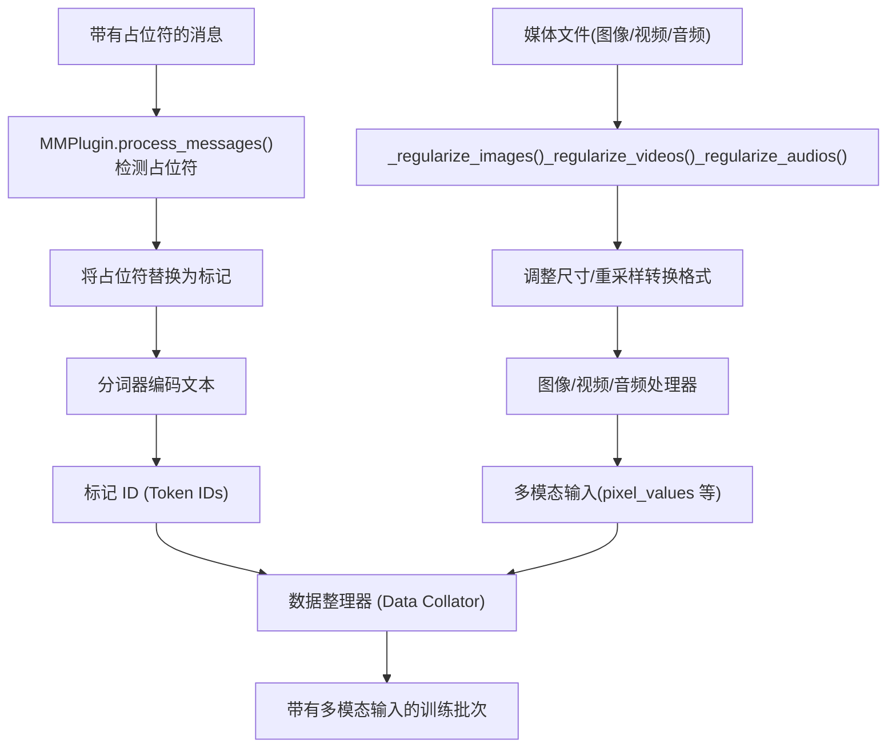
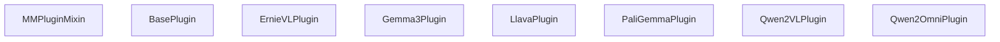
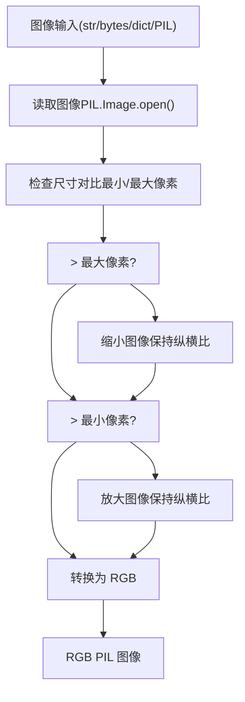
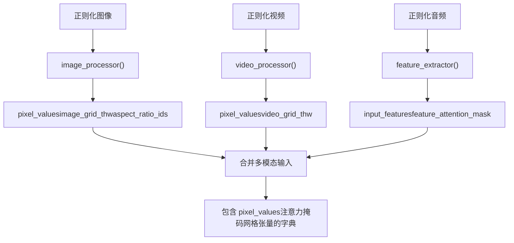

# 多模态数据处理

相关源文件

-   [src/llamafactory/data/collator.py](https://github.com/hiyouga/LlamaFactory/blob/355d5c5e/src/llamafactory/data/collator.py)
-   [src/llamafactory/data/loader.py](https://github.com/hiyouga/LlamaFactory/blob/355d5c5e/src/llamafactory/data/loader.py)
-   [src/llamafactory/data/mm\_plugin.py](https://github.com/hiyouga/LlamaFactory/blob/355d5c5e/src/llamafactory/data/mm_plugin.py)
-   [src/llamafactory/data/parser.py](https://github.com/hiyouga/LlamaFactory/blob/355d5c5e/src/llamafactory/data/parser.py)
-   [src/llamafactory/data/template.py](https://github.com/hiyouga/LlamaFactory/blob/355d5c5e/src/llamafactory/data/template.py)
-   [src/llamafactory/extras/constants.py](https://github.com/hiyouga/LlamaFactory/blob/355d5c5e/src/llamafactory/extras/constants.py)
-   [src/llamafactory/hparams/data\_args.py](https://github.com/hiyouga/LlamaFactory/blob/355d5c5e/src/llamafactory/hparams/data_args.py)
-   [src/llamafactory/model/model\_utils/misc.py](https://github.com/hiyouga/LlamaFactory/blob/355d5c5e/src/llamafactory/model/model_utils/misc.py)
-   [src/llamafactory/model/model\_utils/visual.py](https://github.com/hiyouga/LlamaFactory/blob/355d5c5e/src/llamafactory/model/model_utils/visual.py)
-   [tests/data/test\_mm\_plugin.py](https://github.com/hiyouga/LlamaFactory/blob/355d5c5e/tests/data/test_mm_plugin.py)
-   [tests/version.txt](https://github.com/hiyouga/LlamaFactory/blob/355d5c5e/tests/version.txt)

## 目的与范围

本文档说明了 LlamaFactory 如何为视觉语言模型 (VLMs)、音频语言模型以及其他多模态架构处理多模态数据（图像、视频和音频）。该多模态处理系统负责检测文本中的媒体占位符，将媒体文件正则化为合适的格式和尺寸，并为训练和推理生成模型特定的输入。

有关包含多模态数据的数据集格式规范，请参阅[数据集格式与模板](/hiyouga/LlamaFactory/4.2-dataset-formats-and-templates)。有关视觉塔 (Vision Towers) 和投影器 (Projectors) 的模型特定配置，请参阅[模型补丁与特殊配置](/hiyouga/LlamaFactory/5.5-model-patching-and-special-configurations)。有关在训练期间如何对多模态数据进行批处理，请参阅[数据整理与批处理](/hiyouga/LlamaFactory/4.4-data-collation-and-batching)。

## 系统概览


**来源：** [src/llamafactory/data/mm\_plugin.py1-466](https://github.com/hiyouga/LlamaFactory/blob/355d5c5e/src/llamafactory/data/mm_plugin.py#L1-L466) [src/llamafactory/data/template.py40-57](https://github.com/hiyouga/LlamaFactory/blob/355d5c5e/src/llamafactory/data/template.py#L40-L57)

多模态处理系统采用基于插件的架构，每个 `BasePlugin` 实现处理不同模型家族的特定需求。处理过程主要分为三个阶段：占位符检测与替换、媒体正则化以及多模态输入生成。

## 媒体占位符

LlamaFactory 使用三个可通过环境配置的占位符标记来标记媒体内容的插入位置：

| 占位符 | 默认标记 | 环境变量 | 用法 |
| --- | --- | --- | --- |
| 图像 | `<image>` | `IMAGE_PLACEHOLDER` | 插入单张图像 |
| 视频 | `<video>` | `VIDEO_PLACEHOLDER` | 插入视频或图像序列 |
| 音频 | `<audio>` | `AUDIO_PLACEHOLDER` | 插入音频剪辑 |

**来源：** [src/llamafactory/extras/constants.py24](https://github.com/hiyouga/LlamaFactory/blob/355d5c5e/src/llamafactory/extras/constants.py#L24-L24) [src/llamafactory/extras/constants.py52](https://github.com/hiyouga/LlamaFactory/blob/355d5c5e/src/llamafactory/extras/constants.py#L52-L52) [src/llamafactory/extras/constants.py105](https://github.com/hiyouga/LlamaFactory/blob/355d5c5e/src/llamafactory/extras/constants.py#L105-L105)

这些占位符出现在数据集消息中，并在处理过程中被替换为模型特定的标记。例如：

```
{  "role": "user",  "content": "<image>What is shown in this image?"}
```
`MMPlugin` 会验证占位符的数量是否与提供的媒体文件数量匹配：

**来源：** [src/llamafactory/data/mm\_plugin.py192-219](https://github.com/hiyouga/LlamaFactory/blob/355d5c5e/src/llamafactory/data/mm_plugin.py#L192-L219)

## MMPlugin 架构


**来源：** [src/llamafactory/data/mm\_plugin.py145-466](https://github.com/hiyouga/LlamaFactory/blob/355d5c5e/src/llamafactory/data/mm_plugin.py#L145-L466)

### 核心插件方法

每个插件实现三个关键方法：

1.  **`process_messages(messages, images, videos, audios, processor)`** - 在分词前预处理消息，将占位符替换为模型特定的标记
2.  **`process_token_ids(input_ids, labels, images, videos, audios, tokenizer, processor)`** - 在分词后后处理标记 ID，可能插入图像标记
3.  **`get_mm_inputs(images, videos, audios, imglens, vidlens, audlens, batch_ids, processor)`** - 生成批次多模态输入（像素值、注意力掩码等）

**来源：** [src/llamafactory/data/mm\_plugin.py413-466](https://github.com/hiyouga/LlamaFactory/blob/355d5c5e/src/llamafactory/data/mm_plugin.py#L413-L466)

### 插件注册

插件使用 `get_mm_plugin()` 注册到模板系统中：

```
register_template(    name="qwen2_vl",    mm_plugin=get_mm_plugin(        name="qwen2_vl",        image_token="<|image_pad|>",        video_token="<|video_pad|>",    ),)
```
**来源：** [src/llamafactory/data/template.py465-536](https://github.com/hiyouga/LlamaFactory/blob/355d5c5e/src/llamafactory/data/template.py#L465-L536)

## 媒体正则化

### 图像正则化

`_regularize_images()` 方法处理图像以确保它们满足模型要求：


**来源：** [src/llamafactory/data/mm\_plugin.py221-271](https://github.com/hiyouga/LlamaFactory/blob/355d5c5e/src/llamafactory/data/mm_plugin.py#L221-L271)

关键特性：

-   接受多种输入格式：文件路径 (str)、二进制流、字节、编码字典或 PIL Image 对象
-   根据处理器配置中的 `image_max_pixels` 和 `image_min_pixels` 调整图像尺寸
-   在调整尺寸过程中保持纵横比
-   将所有图像转换为 RGB 模式

### 视频正则化

`_regularize_videos()` 方法通过两种输入模式处理视频：

**来源：** [src/llamafactory/data/mm\_plugin.py240-302](https://github.com/hiyouga/LlamaFactory/blob/355d5c5e/src/llamafactory/data/mm_plugin.py#L240-L302)

1.  **嵌套图像模式 (Nested Images Mode)** - 以图像对象列表形式提供视频（用于预提取的帧）
2.  **视频文件模式 (Video File Mode)** - 使用 PyAV 库处理视频文件

对于视频文件，帧采样由 `_get_video_sample_indices()` 控制：

```
sample_frames = max(1, floor(duration * video_fps))sample_frames = min(total_frames, video_maxlen, sample_frames)sample_indices = linspace(0, total_frames - 1, sample_frames)
```
**来源：** [src/llamafactory/data/mm\_plugin.py240-250](https://github.com/hiyouga/LlamaFactory/blob/355d5c5e/src/llamafactory/data/mm_plugin.py#L240-L250)

配置参数：

-   `video_fps` - 采样的目标每秒帧数（默认：2.0）
-   `video_maxlen` - 最大帧数（默认：128）
-   `video_max_pixels` / `video_min_pixels` - 每帧的尺寸约束

### 音频正则化

`_regularize_audios()` 方法处理音频输入：

**来源：** [src/llamafactory/data/mm\_plugin.py304-323](https://github.com/hiyouga/LlamaFactory/blob/355d5c5e/src/llamafactory/data/mm_plugin.py#L304-L323)

处理步骤：

1.  使用 `torchaudio.load()` 加载音频
2.  如果需要，将立体声转换为单声道（平均通道）
3.  使用 `torchaudio.functional.resample()` 重采样到目标 `sampling_rate`（默认：16000 Hz）
4.  转换为 numpy 数组
5.  返回音频数组及其采样率的列表

## 模型特定插件

### Gemma3Plugin

处理 Gemma 3 的视觉输入格式，支持全景切片 (pan-and-scan) 裁剪：

**来源：** [src/llamafactory/data/mm\_plugin.py520-577](https://github.com/hiyouga/LlamaFactory/blob/355d5c5e/src/llamafactory/data/mm_plugin.py#L520-L577)

关键特性：

-   将 `<image>` 替换为 `imag<image_soft_token>*N<end_of_image>`，其中 N 取决于图像分辨率
-   支持全景切片裁剪 (`image_do_pan_and_scan=True`)，这会为每张图像生成多个切片
-   生成 `token_type_ids` 来标记图像标记的位置
-   使用 `_get_gemma3_token_type_ids()` 创建标记类型数组

### Qwen2VLPlugin

处理具有动态分辨率的 Qwen2-VL 模型的图像/视频：

**来源：** [src/llamafactory/data/mm\_plugin.py768-874](https://github.com/hiyouga/LlamaFactory/blob/355d5c5e/src/llamafactory/data/mm_plugin.py#L768-L874)

关键特性：

-   将占位符替换为 `<|vision_start|><|image_pad|>*N<|vision_end|>`，其中 N 根据图像维度计算
-   计算包含每张图像/视频 (时间, 高度, 宽度) 的 `image_grid_thw` 张量
-   使用带有 `merge_length` 参数的基于分块 (patch-based) 的处理
-   使用统一的视觉标记格式处理图像和视频

### PaliGemmaPlugin

处理 PaliGemma 独特的基于前缀的图像编码：

**来源：** [src/llamafactory/data/mm\_plugin.py688-730](https://github.com/hiyouga/LlamaFactory/blob/355d5c5e/src/llamafactory/data/mm_plugin.py#L688-L730)

关键特性：

-   从消息中移除 `<image>` 占位符（图像始终作为前缀）
-   在 `process_token_ids()` 中将图像标记预置到 `input_ids`
-   在标签中掩码图像标记位置（设置为 `IGNORE_INDEX`）
-   使用 `_get_paligemma_token_type_ids()` 生成 `token_type_ids`，以区分图像标记 (0) 和文本标记 (1)

### LlavaPlugin 家族

多个插件处理具有不同图像序列长度的 Llava 风格模型：

**来源：** [src/llamafactory/data/mm\_plugin.py618-685](https://github.com/hiyouga/LlamaFactory/blob/355d5c5e/src/llamafactory/data/mm_plugin.py#L618-L685)

-   **LlavaPlugin** - 基础 Llava 模型，将 `<image>` 替换为重复的图像标记（通常为 576 个标记）
-   **LlavaNextPlugin** - Llava 1.6+，基于分辨率的动态图像标记（例如 1176 个标记）
-   **LlavaNextVideoPlugin** - 视频变体，将视频帧作为图像处理

所有这些插件都将 `<image>` 占位符展开为多个图像标记：`<image><image>...<image>`

### Qwen2OmniPlugin

处理具有视觉和音频功能的 Qwen2.5-Omni 模型：

**来源：** [src/llamafactory/data/mm\_plugin.py876-956](https://github.com/hiyouga/LlamaFactory/blob/355d5c5e/src/llamafactory/data/mm_plugin.py#L876-L956)

关键特性：

-   同时处理图像和音频
-   将 `<image>` 替换为 `<|vision_start|><|image_pad|>*N<|vision_end|>`
-   将 `<audio>` 替换为 `<audio><audio>...<audio>`（展开后的音频标记）
-   同时为视觉生成 `image_grid_thw` 并为语音生成音频标记

### MllamaPlugin

处理 Meta 的 Mllama (Llama 3.2 Vision) 模型：

**来源：** [src/llamafactory/data/mm\_plugin.py594-617](https://github.com/hiyouga/LlamaFactory/blob/355d5c5e/src/llamafactory/data/mm_plugin.py#L594-L617)

关键特性：

-   将 `<image>` 替换为 `<|image|>`（单个标记）
-   生成用于视觉-语言交互的复杂交叉注意力掩码 (cross-attention masks)
-   为多图块 (multi-tile) 图像生成 `aspect_ratio_ids`、`aspect_ratio_mask` 和 `num_tiles`
-   交叉注意力掩码形状：`(batch_size, num_images, max_num_chunks, seq_len)`

## 多模态输入生成

`_get_mm_inputs()` 方法从正则化媒体生成模型就绪的张量：


**来源：** [src/llamafactory/data/mm\_plugin.py325-409](https://github.com/hiyouga/LlamaFactory/blob/355d5c5e/src/llamafactory/data/mm_plugin.py#L325-L409)

### 常见输出格式

不同的模型架构产生不同的张量格式：

| 模型类型 | 关键张量 | 形状描述 |
| --- | --- | --- |
| Llava, Llava-Next | `pixel_values` | `(B, C, H, W)` - 标准图像批次 |
| Qwen2-VL, Qwen3-VL | `pixel_values`, `image_grid_thw` | 分块：`(num_patches, patch_dim)`，网格：`(num_images, 3)` |
| Mllama | `pixel_values`, `aspect_ratio_ids`, `aspect_ratio_mask`, `num_tiles` | 图块化：`(B, max_images, max_tiles, C, H, W)` |
| PaliGemma | `pixel_values`, `token_type_ids` | 标准图像 + 标记类型数组 |
| Gemma3 | `pixel_values`, `token_type_ids`, `num_crops` | 带有可选的全景切片裁剪 |
| Qwen2-Omni | `pixel_values`, `image_grid_thw`, `input_features`, `feature_attention_mask` | 视觉 + 音频特征 |

**来源：** [src/llamafactory/data/mm\_plugin.py325-410](https://github.com/hiyouga/LlamaFactory/blob/355d5c5e/src/llamafactory/data/mm_plugin.py#L325-L410)

### 处理器配置

`processor` 对象（通常是 `ProcessorMixin`）提供模型特定配置：

**来源：** [src/llamafactory/data/mm\_plugin.py85-93](https://github.com/hiyouga/LlamaFactory/blob/355d5c5e/src/llamafactory/data/mm_plugin.py#L85-L93)

常见的处理器属性：

-   `image_max_pixels`, `image_min_pixels` - 图像的尺寸约束
-   `video_max_pixels`, `video_min_pixels` - 视频帧的尺寸约束
-   `video_fps` - 视频采样率
-   `video_maxlen` - 每个视频的最大帧数
-   `audio_sampling_rate` - 目标音频采样率
-   `patch_size`, `image_seq_length` - 分词参数

## 与数据整理器集成

`MultiModalDataCollatorForSeq2Seq` 将多模态输入集成到训练批次中：

**来源：** [src/llamafactory/data/collator.py84-241](https://github.com/hiyouga/LlamaFactory/blob/355d5c5e/src/llamafactory/data/collator.py#L84-L241)

### 整理过程

1.  **媒体提取** - 从每个特征中提取图像/视频/音频，统计每样本的长度
2.  **虚假输入处理 (Fake Inputs Handling)** - 对于分布式训练 (Zero3/FSDP)，当批次中没有媒体时，生成虚假的多模态输入以避免进程挂起
3.  **多模态输入生成** - 调用 `mm_plugin.get_mm_inputs()` 处理批次媒体
4.  **文本整理** - 使用基础 `DataCollatorForSeq2Seq` 对文本序列进行填充
5.  **张量合并** - 将文本张量与多模态张量合并
6.  **特殊处理** - 为使用多维 RoPE 的模型（Qwen2-VL, Qwen3-VL, GLM4V 等）生成 `position_ids` 和 `rope_deltas`

**来源：** [src/llamafactory/data/collator.py108-241](https://github.com/hiyouga/LlamaFactory/blob/355d5c5e/src/llamafactory/data/collator.py#L108-L241)

### MRope（多模态旋转位置嵌入）

Qwen2-VL 等模型需要为多模态内容提供 3D 位置嵌入：

**来源：** [src/llamafactory/data/collator.py185-226](https://github.com/hiyouga/LlamaFactory/blob/355d5c5e/src/llamafactory/data/collator.py#L185-L226)

整理器调用 `model.get_rope_index()`，传入：

-   `input_ids` - 标记 ID
-   `image_grid_thw` - 图像网格维度
-   `video_grid_thw` - 视频网格维度
-   `attention_mask` - 序列注意力掩码
-   `second_per_grid_ts` 或 `video_second_per_grid` - 视频的时间信息

这将生成：

-   `position_ids` - 3D 位置张量 `(batch_size, 3, seq_len)`，包含（时间, 高度, 宽度）
-   `rope_deltas` - 位置嵌入计算的调整值

## 验证与错误处理

插件系统包含全面的验证机制：

### 输入验证

**来源：** [src/llamafactory/data/mm\_plugin.py152-191](https://github.com/hiyouga/LlamaFactory/blob/355d5c5e/src/llamafactory/data/mm_plugin.py#L152-L191)

`_validate_input()` 检查：

-   如果提供了图像，模型是否支持图像输入 (`image_token` 不为 None)
-   如果提供了视频，模型是否支持视频输入 (`video_token` 不为 None)
-   如果提供了音频，模型是否支持音频输入 (`audio_token` 不为 None)
-   处理器是否存在并包含所需组件 (image\_processor, video\_processor, feature\_extractor)

### 消息验证

**来源：** [src/llamafactory/data/mm\_plugin.py192-219](https://github.com/hiyouga/LlamaFactory/blob/355d5c5e/src/llamafactory/data/mm_plugin.py#L192-219)

`_validate_messages()` 验证：

-   `<image>` 占位符的数量与图像列表的长度是否匹配
-   `<video>` 占位符的数量与视频列表的长度是否匹配
-   `<audio>` 占位符的数量与音频列表的长度是否匹配

## 支持的模型架构

系统中注册了以下多模态模型：

**来源：** [src/llamafactory/model/model\_utils/visual.py202-386](https://github.com/hiyouga/LlamaFactory/blob/355d5c5e/src/llamafactory/model/model_utils/visual.py#L202-L386) [src/llamafactory/extras/constants.py155-169](https://github.com/hiyouga/LlamaFactory/blob/355d5c5e/src/llamafactory/extras/constants.py#L155-L169)

| 模型类型 | 视觉塔键名 (Vision Tower Keys) | 投影器键名 (Projector Key) | 特殊功能 |
| --- | --- | --- | --- |
| `dots_ocr` | `vision_tower` | `vision_tower.merger` | OCR 专用 |
| `gemma3` | `vision_tower` | `multi_modal_projector` | 全景切片裁剪 |
| `gemma3n` | `vision_tower`, `audio_tower` | `multi_modal_projector` | 视觉 + 音频 |
| `glm4v` | `visual.patch_embed`, `visual.blocks` | `visual.merger` | Qwen2-VL 风格 |
| `internvl` | `vision_tower` | `multi_modal_projector` | InternViT 编码器 |
| `llama4` | `vision_model` | `multi_modal_projector` | 多图块图像 |
| `llava`, `llava_next` | `vision_tower` | `multi_modal_projector` | 标准 VLM |
| `llava_next_video` | `vision_tower` | `multi_modal_projector` | 视频帧 |
| `minicpmv` | `vpm` | `resampler` | 高效重采样器 |
| `minicpmo` | `vpm`, `apm`, `tts` | `resampler` | 全模态 (Omni-modal) |
| `mllama` | `vision_model` | `multi_modal_projector` | 交叉注意力 |
| `paligemma` | `vision_tower` | `multi_modal_projector` | 前缀图像 |
| `qwen2_audio` | `audio_tower` | `multi_modal_projector` | 仅音频 |
| `qwen2_vl`, `qwen2_5_vl`, `qwen3_vl` | `visual.patch_embed`, `visual.blocks` | `visual.merger` | 动态分辨率, MRope |
| `qwen2_5_omni_thinker`, `qwen3_omni_moe_thinker` | `visual.*`, `audio_tower` | `visual.merger` | 视觉 + 音频 + 推理 |

在调用 `register_model_group()` 时，模型会使用 `multimodal=True` 标志进行注册，这会将它们添加到 `MULTIMODAL_SUPPORTED_MODELS` 集合中。

## 性能考量

### 内存优化

-   **延迟加载 (Lazy Loading)** - 媒体文件在处理前才读取，而不是在数据集构建时读取
-   **流式支持 (Streaming Support)** - 与数据集流式模式配合，适用于大规模训练
-   **分辨率限制** - `image_max_pixels` 防止极大的图像消耗过多内存
-   **视频采样** - `video_maxlen` 和 `video_fps` 控制帧数以限制内存

### 预处理效率

-   **批处理** - `preprocessing_batch_size` 参数控制数据集映射过程中的批次大小
-   **多进程** - `preprocessing_num_workers` 支持并行预处理
-   **缓存** - 经过处理的数据集可以通过 `tokenized_path` 缓存到磁盘

**来源：** [src/llamafactory/data/loader.py229-273](https://github.com/hiyouga/LlamaFactory/blob/355d5c5e/src/llamafactory/data/loader.py#L229-L273) [src/llamafactory/hparams/data\_args.py78-85](https://github.com/hiyouga/LlamaFactory/blob/355d5c5e/src/llamafactory/hparams/data_args.py#L78-L85)

## 示例：完整的处理流程

以下是包含一张图像的样本在系统中的流动方式：

> **[Mermaid 序列]**
> *(图表结构无法解析)*

**来源：** [src/llamafactory/data/processor.py](https://github.com/hiyouga/LlamaFactory/blob/355d5c5e/src/llamafactory/data/processor.py) [src/llamafactory/data/mm\_plugin.py413-466](https://github.com/hiyouga/LlamaFactory/blob/355d5c5e/src/llamafactory/data/mm_plugin.py#L413-L466) [src/llamafactory/data/collator.py108-241](https://github.com/hiyouga/LlamaFactory/blob/355d5c5e/src/llamafactory/data/collator.py#L108-L241)
