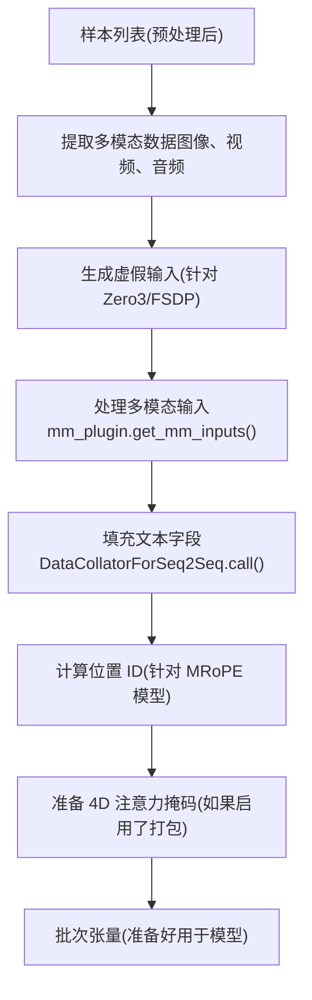
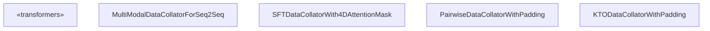
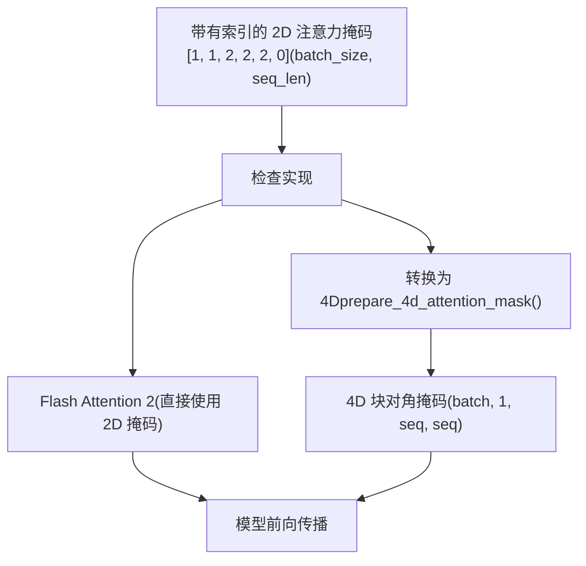
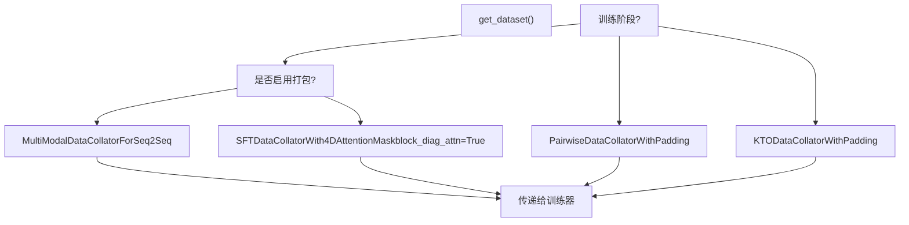

# 数据整理与批处理

相关源文件

-   [src/llamafactory/data/collator.py](https://github.com/hiyouga/LlamaFactory/blob/355d5c5e/src/llamafactory/data/collator.py)
-   [src/llamafactory/data/loader.py](https://github.com/hiyouga/LlamaFactory/blob/355d5c5e/src/llamafactory/data/loader.py)
-   [src/llamafactory/data/mm\_plugin.py](https://github.com/hiyouga/LlamaFactory/blob/355d5c5e/src/llamafactory/data/mm_plugin.py)
-   [src/llamafactory/data/parser.py](https://github.com/hiyouga/LlamaFactory/blob/355d5c5e/src/llamafactory/data/parser.py)
-   [src/llamafactory/data/template.py](https://github.com/hiyouga/LlamaFactory/blob/355d5c5e/src/llamafactory/data/template.py)
-   [src/llamafactory/extras/constants.py](https://github.com/hiyouga/LlamaFactory/blob/355d5c5e/src/llamafactory/extras/constants.py)
-   [src/llamafactory/hparams/data\_args.py](https://github.com/hiyouga/LlamaFactory/blob/355d5c5e/src/llamafactory/hparams/data_args.py)
-   [src/llamafactory/model/model\_utils/misc.py](https://github.com/hiyouga/LlamaFactory/blob/355d5c5e/src/llamafactory/model/model_utils/misc.py)
-   [src/llamafactory/model/model\_utils/visual.py](https://github.com/hiyouga/LlamaFactory/blob/355d5c5e/src/llamafactory/model/model_utils/visual.py)
-   [tests/data/test\_mm\_plugin.py](https://github.com/hiyouga/LlamaFactory/blob/355d5c5e/tests/data/test_mm_plugin.py)
-   [tests/version.txt](https://github.com/hiyouga/LlamaFactory/blob/355d5c5e/tests/version.txt)

## 目的与范围

数据整理是数据流水线的最后阶段，它将预处理后的单个样本转换为准备好用于训练的批次张量。本文档涵盖了整理器实现、带有块对角注意力掩码 (block-diagonal attention masks) 的序列打包、多模态输入批处理以及填充 (padding) 策略。

有关整理前的加载与预处理信息，请参阅[数据集加载与来源](/hiyouga/LlamaFactory/4.1-dataset-loading-and-sources)和[多模态数据处理](/hiyouga/LlamaFactory/4.3-multimodal-data-processing)。有关数据集格式与分词的信息，请参阅[数据集格式与模板](/hiyouga/LlamaFactory/4.2-dataset-formats-and-templates)。

---

## 整理流水线概览

整理过程将预处理后的样本列表转换为批次张量字典。流水线处理：

1.  **标准文本字段** (`input_ids`、`labels`、`attention_mask`)
2.  **多模态输入**（图像、视频、音频）
3.  **特殊模型需求**（位置 ID、RoPE 增量、标记类型 ID）
4.  **序列打包**（可选，带有块对角注意力）


**流水线流程**

| 阶段 | 输入 | 输出 | 关键操作 |
| --- | --- | --- | --- |
| 提取多模态数据 | 包含 `images`、`videos`、`audios` 的字典列表 | 平铺列表：`batch_images`、`batch_videos`、`batch_audios` | 提取并平铺多模态数据 |
| 虚假输入 | 空多模态列表（Zero3/FSDP 情况） | 虚假输入以防止挂起 | 生成虚拟图像/音频以避免进程挂起 |
| 多模态处理 | 平铺多模态列表 + 处理器 | `pixel_values`、`image_grid_thw` 等 | 调用处理器，正则化媒体 |
| 填充 | 标记列表 | 填充后的张量：`input_ids`、`labels`、`attention_mask` | 应用 DataCollatorForSeq2Seq |
| 位置 ID | `input_ids` + `image_grid_thw` | `position_ids`、`rope_deltas` | 为 MRoPE 模型（Qwen2-VL 等）计算 |
| 4D 注意力 | 带有索引的 2D 注意力掩码 | 4D 注意力掩码 (batch, 1, seq, seq) | 转换为块对角形式 |

来源：[src/llamafactory/data/collator.py108-241](https://github.com/hiyouga/LlamaFactory/blob/355d5c5e/src/llamafactory/data/collator.py#L108-L241)

---

## 核心整理器类

### MultiModalDataCollatorForSeq2Seq

基础整理器，扩展了 Transformers 的 `DataCollatorForSeq2Seq` 以支持多模态输入。它与文本一起处理图像、视频和音频。


**关键职责：**

1.  从特征中**提取多模态数据**
2.  **处理分布式训练的极端情况**（针对 Zero3/FSDP 的虚假输入）
3.  通过 `mm_plugin.get_mm_inputs()` **处理多模态输入**
4.  为 MRoPE 模型（Qwen2-VL、GLM-4V 等）**计算位置 ID**
5.  为 Mllama **填充交叉注意力掩码**

来源：[src/llamafactory/data/collator.py84-242](https://github.com/hiyouga/LlamaFactory/blob/355d5c5e/src/llamafactory/data/collator.py#L84-L242)

#### 多模态数据提取

```
# 从特征列表中提取并平铺多模态数据batch_images, batch_videos, batch_audios = [], [], []batch_imglens, batch_vidlens, batch_audlens, batch_input_ids = [], [], [], [] for feature in features:    images = feature.pop("images", None) or []    videos = feature.pop("videos", None) or []    audios = feature.pop("audios", None) or []    batch_images.extend(images)         # 平铺：[[img1], [img2]] -> [img1, img2]    batch_videos.extend(videos)    batch_audios.extend(audios)    batch_imglens.append(len(images))   # 跟踪每个样本的数量：[1, 0, 2]    batch_vidlens.append(len(videos))    batch_audlens.append(len(audios))    batch_input_ids.append(feature["input_ids"])
```
整理器从每个特征中提取多模态数据，并维护长度列表（`imglens`、`vidlens`、`audlens`）以跟踪每个样本所属的图像/视频/音频数量。

来源：[src/llamafactory/data/collator.py108-122](https://github.com/hiyouga/LlamaFactory/blob/355d5c5e/src/llamafactory/data/collator.py#L108-L122)

#### 分布式训练的虚假输入

当使用 DeepSpeed Zero3 或 FSDP 时，如果批次中不包含图像或音频，由于没有调用处理器，进程可能会挂起。整理器生成虚假输入来防止这种情况：

```
if self.template.mm_plugin.image_token is not None and sum(batch_imglens) == 0:    # 生成虚假图像以避免 Zero3/FSDP 挂起    fake_messages = [{"role": "user", "content": IMAGE_PLACEHOLDER}]    fake_images = [Image.new("RGB", (64, 64), (255, 255, 255))]    # 处理虚假消息并附加虚假标记 ID    # ... (附加到第一个样本)    batch_images = fake_images    batch_imglens[0] = 1
```
虚假输入被附加到带有 `IGNORE_INDEX` 标签的第一个样本中，因此它们不会影响训练损失。

来源：[src/llamafactory/data/collator.py123-167](https://github.com/hiyouga/LlamaFactory/blob/355d5c5e/src/llamafactory/data/collator.py#L123-L167)

#### MRoPE 位置 ID 计算

对于使用多维 RoPE (MRoPE) 的模型（如 Qwen2-VL、GLM-4V、Qwen3-VL），整理器计算 3D 位置 ID：

```
if self.get_rope_func is not None:    rope_index_kwargs = {        "input_ids": features["input_ids"],        "image_grid_thw": mm_inputs.get("image_grid_thw"),        "video_grid_thw": mm_inputs.get("video_grid_thw"),        "attention_mask": (features["attention_mask"] >= 1).float(),    }    features["position_ids"], features["rope_deltas"] = self.get_rope_func(**rope_index_kwargs)
```
`get_rope_func` 在 `__post_init__()` 中从模型中提取，并根据图像/视频的时间、高度和宽度维度计算位置 ID。

来源：[src/llamafactory/data/collator.py101-106](https://github.com/hiyouga/LlamaFactory/blob/355d5c5e/src/llamafactory/data/collator.py#L101-L106) [src/llamafactory/data/collator.py185-226](https://github.com/hiyouga/LlamaFactory/blob/355d5c5e/src/llamafactory/data/collator.py#L185-L226)

### SFTDataCollatorWith4DAttentionMask

扩展了 `MultiModalDataCollatorForSeq2Seq` 以支持用于序列打包的 4D 注意力掩码。当 `block_diag_attn=True` 且注意力实现不是 Flash Attention 2 时，它将 2D 注意力掩码转换为 4D 块对角形式。

**配置：**

-   `block_diag_attn`：启用块对角注意力（默认：False）
-   `attn_implementation`：注意力后端 ("eager"、"sdpa"、"flash\_attention\_2")
-   `compute_dtype`：计算数据类型（例如 torch.float32、torch.bfloat16）

来源：[src/llamafactory/data/collator.py244-262](https://github.com/hiyouga/LlamaFactory/blob/355d5c5e/src/llamafactory/data/collator.py#L244-L262)

### PairwiseDataCollatorWithPadding

用于偏好学习算法（DPO、ORPO、SimPO），这些算法需要成对的选定 (chosen)/拒绝 (rejected) 响应。它复制特征以创建 2n 个样本，其中前 n 个是选定的，后 n 个是拒绝的。

```
# 输入特征包含 chosen 和 rejected 字段# 输出：[chosen_0, chosen_1, ..., rejected_0, rejected_1, ...]concatenated_features = []for key in ("chosen", "rejected"):    for feature in features:        target_feature = {            "input_ids": feature[f"{key}_input_ids"],            "attention_mask": feature[f"{key}_attention_mask"],            "labels": feature[f"{key}_labels"],            "images": feature["images"],  # 共享的多模态数据            "videos": feature["videos"],            "audios": feature["audios"],        }        concatenated_features.append(target_feature)
```
来源：[src/llamafactory/data/collator.py264-288](https://github.com/hiyouga/LlamaFactory/blob/355d5c5e/src/llamafactory/data/collator.py#L264-L288)

### KTODataCollatorWithPadding

用于 KTO (Kahneman-Tversky Optimization) 训练，这需要目标补全 (target completions) 和 KL 参考补全 (KL reference completions)。它为目标和 KL 输入创建单独的批次，然后将它们合并。

**输出结构：**

-   标准字段：`input_ids`、`labels`、`attention_mask`
-   KL 字段：`kl_input_ids`、`kl_labels`、`kl_attention_mask`
-   标签：`kto_tags`（指示期望的/不期望的）

来源：[src/llamafactory/data/collator.py290-332](https://github.com/hiyouga/LlamaFactory/blob/355d5c5e/src/llamafactory/data/collator.py#L290-L332)

---

## 带有块对角注意力的序列打包

序列打包将多个样本连接成单个序列，以提高 GPU 利用率。为了防止样本之间的注意力泄露，使用了 4D 块对角注意力掩码。

### 4D 注意力掩码格式


2D 注意力掩码使用**索引**来指示每个标记所属的样本：

-   `0`：填充标记 (padding token)
-   `1`：第一个样本
-   `2`：第二个样本
-   `3`：第三个样本，依此类推

`prepare_4d_attention_mask` 函数将其转换为 4D 块对角矩阵，其中：

-   标记可以关注**同一样本**（相同索引）中的其他标记
-   标记**不能**关注不同样本中的标记
-   下三角形式可防止查看未来信息

来源：[src/llamafactory/data/collator.py41-82](https://github.com/hiyouga/LlamaFactory/blob/355d5c5e/src/llamafactory/data/collator.py#L41-L82)

### 转换示例

**输入的 2D 掩码（带索引）：**

```
[[1, 1, 2, 2, 2, 0]]
```
**输出的 4D 掩码（转换后）：**

```
[
    [
        [
            [0.0,    -inf,   -inf,   -inf,   -inf,   -inf],
            [0.0,    0.0,    -inf,   -inf,   -inf,   -inf],
            [-inf,   -inf,   0.0,    -inf,   -inf,   -inf],
            [-inf,   -inf,   0.0,    0.0,    -inf,   -inf],
            [-inf,   -inf,   0.0,    0.0,    0.0,    -inf],
            [-inf,   -inf,   -inf,   -inf,   -inf,   -inf],
        ]
    ]
]
```
其中：

-   `0.0` = 可以关注
-   `-inf` (min\_dtype) = 不能关注
-   每个样本在对角线上形成一个三角块

来源：[src/llamafactory/data/collator.py41-82](https://github.com/hiyouga/LlamaFactory/blob/355d5c5e/src/llamafactory/data/collator.py#L41-L82)

### Flash Attention 2 优化

Flash Attention 2 原生支持打包序列，并可以直接使用 2D 注意力掩码。当 `attn_implementation="flash_attention_2"` 时，整理器会跳过 4D 转换：

```
if self.block_diag_attn and self.attn_implementation != "flash_attention_2":    features["attention_mask"] = prepare_4d_attention_mask(        features["attention_mask"],         self.compute_dtype    )
```
来源：[src/llamafactory/data/collator.py254-255](https://github.com/hiyouga/LlamaFactory/blob/355d5c5e/src/llamafactory/data/collator.py#L254-L255)

### 配置

序列打包通过 `DataArguments` 配置：

| 参数 | 类型 | 默认值 | 描述 |
| --- | --- | --- | --- |
| `packing` | bool | None | 启用序列打包（预训练自动启用） |
| `neat_packing` | bool | False | 启用不带交叉注意力的打包（设置 `packing=True`） |
| `cutoff_len` | int | 2048 | 最大序列长度（启用打包时减 1） |

当 `packing=True` 时，`cutoff_len` 会减少 1 以避免 `pad_to_multiple_of` 问题。

来源：[src/llamafactory/hparams/data\_args.py106-113](https://github.com/hiyouga/LlamaFactory/blob/355d5c5e/src/llamafactory/hparams/data_args.py#L106-L113) [src/llamafactory/hparams/data\_args.py179-184](https://github.com/hiyouga/LlamaFactory/blob/355d5c5e/src/llamafactory/hparams/data_args.py#L179-L184)

---

## 多模态输入集成

### MM 插件集成

整理器使用模板的 `mm_plugin` 来处理多模态输入：

```
mm_inputs = self.template.mm_plugin.get_mm_inputs(    batch_images,      # 所有图像的平铺列表    batch_videos,      # 所有视频的平铺列表    batch_audios,      # 所有音频的平铺列表    batch_imglens,     # [1, 0, 2] - 每个样本的图像数量    batch_vidlens,     # [0, 1, 0] - 每个样本的视频数量    batch_audlens,     # [0, 0, 1] - 每个样本的音频数量    batch_input_ids,   # 用于计算标记类型 ID    self.processor,)
```
插件返回一个张量字典，这些张量被合并到最终批次中：

-   **图像模型**：`pixel_values`
-   **Qwen2-VL**：`pixel_values`、`image_grid_thw`、`video_grid_thw`
-   **Mllama**：`pixel_values`、`aspect_ratio_ids`、`aspect_ratio_mask`、`cross_attention_mask`
-   **PaliGemma/Gemma3**：`token_type_ids`
-   **音频模型**：`input_features`、`feature_attention_mask`

来源：[src/llamafactory/data/collator.py168-177](https://github.com/hiyouga/LlamaFactory/blob/355d5c5e/src/llamafactory/data/collator.py#L168-L177)

#### 标记类型 ID (Token Type IDs)

某些模型（PaliGemma、Gemma3）需要标记类型 ID 来区分图像标记和文本标记，以便进行正确的损失掩码：

**PaliGemma：**

```
def _get_paligemma_token_type_ids(imglens, seqlens, processor):    batch_token_type_ids = []    for imglen, seqlen in zip(imglens, seqlens):        image_seqlen = imglen * processor.image_seq_length        # 图像标记为 0，文本标记为 1        batch_token_type_ids.append([0] * image_seqlen + [1] * (seqlen - image_seqlen))    return batch_token_type_ids
```
**Gemma3：**

```
def _get_gemma3_token_type_ids(batch_ids, processor):    image_token_id = processor.image_token_id    batch_token_type_ids = []    for token_ids in batch_ids:        token_type_ids = np.zeros_like(token_ids)        token_type_ids[token_ids == image_token_id] = 1  # 图像标记为 1        batch_token_type_ids.append(token_type_ids.tolist())    return batch_token_type_ids
```
模型使用这些标记类型 ID 进行：

1.  **掩码损失计算** - 仅在文本标记上计算损失
2.  **应用不同的嵌入** - 图像 vs 文本嵌入
3.  **控制注意力模式** - 在某些架构中

来源：[src/llamafactory/data/mm\_plugin.py95-128](https://github.com/hiyouga/LlamaFactory/blob/355d5c5e/src/llamafactory/data/mm_plugin.py#L95-L128) [src/llamafactory/data/collator.py178-182](https://github.com/hiyouga/LlamaFactory/blob/355d5c5e/src/llamafactory/data/collator.py#L178-L182)

#### 交叉注意力掩码填充

对于 Mllama 模型，当启用 `pad_to_multiple_of` 时，可能需要填充 `cross_attention_mask`：

```
if "cross_attention_mask" in mm_inputs:    cross_attention_mask = mm_inputs.pop("cross_attention_mask")    seq_len = features["input_ids"].size(1)    orig_len = cross_attention_mask.size(1)    # 填充以匹配填充后的 input_ids 长度    mm_inputs["cross_attention_mask"] = F.pad(        cross_attention_mask,         (0, 0, 0, 0, 0, seq_len - orig_len)    )
```
来源：[src/llamafactory/data/collator.py228-233](https://github.com/hiyouga/LlamaFactory/blob/355d5c5e/src/llamafactory/data/collator.py#L228-L233)

---

## 填充策略

整理器继承了 Transformers 的 `DataCollatorForSeq2Seq` 的填充行为，并增加了多模态考量。

### 标准填充

| 字段 | 填充值 | 说明 |
| --- | --- | --- |
| `input_ids` | `tokenizer.pad_token_id` | 通常为 0 或特定填充标记 |
| `labels` | `IGNORE_INDEX` (-100) | 排除在损失计算之外 |
| `attention_mask` | 0 | 指示填充位置 |

### 填充侧 (Padding Side)

填充侧由 `tokenizer.padding_side` 控制：

-   **右填充** (默认)：在序列右侧填充
-   **左填充**：在左侧填充（对生成很有用）

当添加虚假输入时，它们会遵循填充侧：

```
if self.tokenizer.padding_side == "right":    features[0]["input_ids"] = features[0]["input_ids"] + fake_input_ids    features[0]["attention_mask"] = features[0]["attention_mask"] + [0] * len(fake_input_ids)    features[0]["labels"] = features[0]["labels"] + [IGNORE_INDEX] * len(fake_input_ids)else:  # 左填充    features[0]["input_ids"] = fake_input_ids + features[0]["input_ids"]    features[0]["attention_mask"] = [0] * len(fake_input_ids) + features[0]["attention_mask"]    features[0]["labels"] = [IGNORE_INDEX] * len(fake_input_ids) + features[0]["labels"]
```
来源：[src/llamafactory/data/collator.py156-165](https://github.com/hiyouga/LlamaFactory/blob/355d5c5e/src/llamafactory/data/collator.py#L156-L165)

### 多模态填充考量

多模态张量通常**不会**由整理器进行填充，因为它们已经从处理器中获得了准备好用于批处理的格式：

-   `pixel_values`：形状取决于模型（例如 LLaVA 为 `(B, C, H, W)`，Qwen2-VL 为 `(num_patches, patch_dim)`）
-   `image_grid_thw`：每个样本的图像数量可变，但每个条目是固定大小的
-   音频特征：可能具有指示有效帧的注意力掩码

处理器会在视觉输入到达整理器之前处理任何必要的填充/尺寸调整。

---

## 输出批次结构

整理器的最终输出是准备好进行模型前向传播的张量字典：

### 标准字段（始终存在）

| 键名 | 形状 | 描述 |
| --- | --- | --- |
| `input_ids` | `(batch_size, seq_len)` | 填充后的标记 ID |
| `attention_mask` | `(batch_size, seq_len)` 或 `(batch_size, 1, seq_len, seq_len)` | 2D 或 4D 注意力掩码 |
| `labels` | `(batch_size, seq_len)` | 已掩码填充位置的目标标记 ID |

### 模型特定字段（有条件存在）

| 键名 | 存在条件 | 形状 | 描述 |
| --- | --- | --- | --- |
| `pixel_values` | 存在图像/视频 | 模型相关 | 图像像素值 |
| `image_grid_thw` | Qwen2-VL/Qwen3-VL | `(num_images, 3)` | 时间、高度、宽度网格 |
| `position_ids` | MRoPE 模型 | `(batch_size, 3, seq_len)` | 3D 位置 ID |
| `rope_deltas` | MRoPE 模型 | `(batch_size, 1)` | RoPE 增量值 |
| `token_type_ids` | PaliGemma/Gemma3 | `(batch_size, seq_len)` | 图像 vs 文本标记 |
| `cross_attention_mask` | Mllama | `(batch_size, seq_len, num_images, num_tiles)` | 交叉注意力掩码 |
| `feature_attention_mask` | 音频模型 | `(batch_size, num_features)` | 有效音频帧 |
| `aspect_ratio_ids` | Mllama | `(batch_size, max_num_images)` | 纵横比 ID |
| `aspect_ratio_mask` | Mllama | `(batch_size, max_num_images, max_tiles)` | 纵横比掩码 |

### 特殊情况

**MiniCPM-V**：返回嵌套结构：

```
{    "data": {        "input_ids": ...,        "labels": ...,        "image_bound": ...,        "position_ids": ...,  # 顺序位置 ID        ...    },    "input_ids": ...,  # 为训练器兼容性而复制    "labels": ...,}
```
来源：[src/llamafactory/data/collator.py236-241](https://github.com/hiyouga/LlamaFactory/blob/355d5c5e/src/llamafactory/data/collator.py#_L236-L241)

---

## 整理器选择与创建

根据训练阶段和配置选择适当的整理器：


所有整理器都会接收：

-   `tokenizer`：用于填充配置
-   `model`：用于提取 RoPE 函数
-   `template`：用于多模态插件
-   `processor`：用于处理图像/视频/音频
-   `pad_to_multiple_of`：用于高效的硬件利用

对于 `SFTDataCollatorWith4DAttentionMask`，还有额外参数：

-   `block_diag_attn`：设置为 `data_args.neat_packing`
-   `attn_implementation`：来自模型配置
-   `compute_dtype`：来自模型参数

来源：[src/llamafactory/data/loader.py276-336](https://github.com/hiyouga/LlamaFactory/blob/355d5c5e/src/llamafactory/data/loader.py#L276-L336) [src/llamafactory/train/sft/workflow.py70-80](https://github.com/hiyouga/LlamaFactory/blob/355d5c5e/src/llamafactory/train/sft/workflow.py#L70-L80)（未提供，但从结构中推断）
