# 模型加载与配置

相关源码文件

-   [src/llamafactory/extras/env.py](https://github.com/hiyouga/LlamaFactory/blob/355d5c5e/src/llamafactory/extras/env.py)
-   [src/llamafactory/extras/packages.py](https://github.com/hiyouga/LlamaFactory/blob/355d5c5e/src/llamafactory/extras/packages.py)
-   [src/llamafactory/hparams/model_args.py](https://github.com/hiyouga/LlamaFactory/blob/355d5c5e/src/llamafactory/hparams/model_args.py)
-   [src/llamafactory/model/adapter.py](https://github.com/hiyouga/LlamaFactory/blob/355d5c5e/src/llamafactory/model/adapter.py)
-   [src/llamafactory/model/loader.py](https://github.com/hiyouga/LlamaFactory/blob/355d5c5e/src/llamafactory/model/loader.py)
-   [src/llamafactory/model/model_utils/attention.py](https://github.com/hiyouga/LlamaFactory/blob/355d5c5e/src/llamafactory/model/model_utils/attention.py)
-   [src/llamafactory/model/model_utils/liger_kernel.py](https://github.com/hiyouga/LlamaFactory/blob/355d5c5e/src/llamafactory/model/model_utils/liger_kernel.py)
-   [src/llamafactory/model/model_utils/moe.py](https://github.com/hiyouga/LlamaFactory/blob/355d5c5e/src/llamafactory/model/model_utils/moe.py)
-   [src/llamafactory/model/model_utils/unsloth.py](https://github.com/hiyouga/LlamaFactory/blob/355d5c5e/src/llamafactory/model/model_utils/unsloth.py)
-   [src/llamafactory/model/model_utils/valuehead.py](https://github.com/hiyouga/LlamaFactory/blob/355d5c5e/src/llamafactory/model/model_utils/valuehead.py)
-   [src/llamafactory/model/patcher.py](https://github.com/hiyouga/LlamaFactory/blob/355d5c5e/src/llamafactory/model/patcher.py)
-   [src/llamafactory/train/callbacks.py](https://github.com/hiyouga/LlamaFactory/blob/355d5c5e/src/llamafactory/train/callbacks.py)

本文档描述了 LlamaFactory 中的模型加载与配置系统。它涵盖了从各个枢纽（Hub）加载预训练模型，到配置修补、适配器初始化、量化设置以及注意力机制配置的完整流程。该系统旨在支持 100 多种模型架构，并提供灵活的适配器方法、量化选项和优化技术。

有关训练特定配置的信息，请参阅[训练系统](/hiyouga/LlamaFactory/6-training-system)。有关推理引擎后端，请参阅[推理引擎](/hiyouga/LlamaFactory/7.1-inference-engines)。有关数据集和数据处理配置，请参阅[数据流水线](/hiyouga/LlamaFactory/4-data-pipeline)。

---

## 系统架构

模型加载系统遵循顺序流水线，将模型从预训练状态转换为准备好进行训练或推理的状态。下图显示了高层流程：

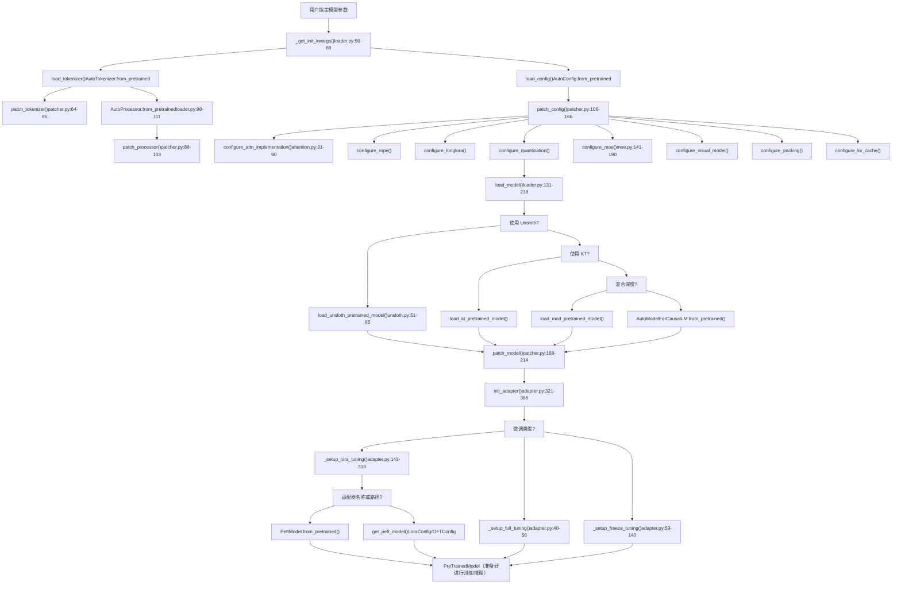
**来源：** [src/llamafactory/model/loader.py131-238](https://github.com/hiyouga/LlamaFactory/blob/355d5c5e/src/llamafactory/model/loader.py#L131-L238) [src/llamafactory/model/patcher.py106-214](https://github.com/hiyouga/LlamaFactory/blob/355d5c5e/src/llamafactory/model/patcher.py#L106-L214) [src/llamafactory/model/adapter.py321-366](https://github.com/hiyouga/LlamaFactory/blob/355d5c5e/src/llamafactory/model/adapter.py#L321-L366)

---

## 核心组件

### 分词器模块与模型参数

该系统使用一个集中的 `ModelArguments` 类，它汇总了所有与模型相关的配置：

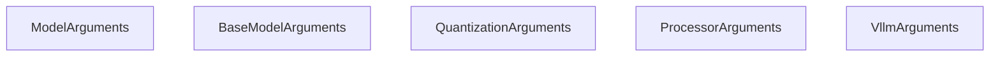
**来源：** [src/llamafactory/hparams/model_args.py510-572](https://github.com/hiyouga/LlamaFactory/blob/355d5c5e/src/llamafactory/hparams/model_args.py#L510-L572)

`load_tokenizer()` 函数返回一个 `TokenizerModule` 类型字典：

| 字段 | 类型 | 描述 |
| --- | --- | --- |
| `tokenizer` | `PreTrainedTokenizer` | 从 `AutoTokenizer` 加载的主分词器 |
| `processor` | `ProcessorMixin | None` | 用于多模态模型的可选处理器 |

**来源：** [src/llamafactory/model/loader.py51-122](https://github.com/hiyouga/LlamaFactory/blob/355d5c5e/src/llamafactory/model/loader.py#L51-L122)

---

## 模型加载流水线

### 枢纽选择与模型检索

系统支持通过 `_get_init_kwargs()` 和 `try_download_model_from_other_hub()` 从三个枢纽加载模型：

| 枢纽 | 环境变量 | 令牌参数 | 优先级 |
| --- | --- | --- | --- |
| Hugging Face | `USE_MODELSCOPE_HUB!=1` | `hf_hub_token` | 默认 |
| ModelScope | `USE_MODELSCOPE_HUB=1` | `ms_hub_token` | 中国地区 |
| OpenMind | 自定义逻辑 | `om_hub_token` | 备选 |

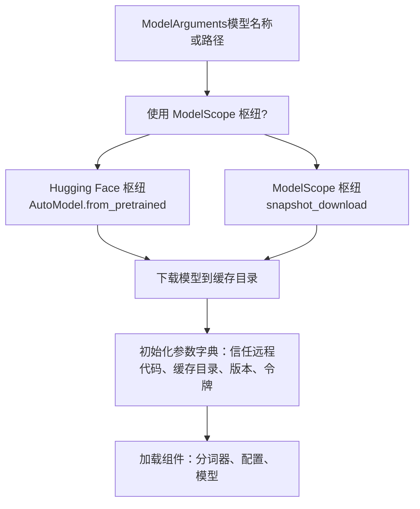
**来源：** [src/llamafactory/model/loader.py56-68](https://github.com/hiyouga/LlamaFactory/blob/355d5c5e/src/llamafactory/model/loader.py#L56-L68) [src/llamafactory/extras/misc.py](https://github.com/hiyouga/LlamaFactory/blob/355d5c5e/src/llamafactory/extras/misc.py#LNaN-LNaN)

### 分词器与处理器加载

`load_tokenizer()` 函数执行以下步骤：

1.  **加载分词器**，带有回退逻辑（快速 → 慢速）：

    ```
    # loader.py:78-93try:    tokenizer = AutoTokenizer.from_pretrained(        model_args.model_name_or_path,        use_fast=model_args.use_fast_tokenizer,        split_special_tokens=model_args.split_special_tokens,        padding_side="right",        **init_kwargs,    )except ValueError:  # 尝试备选分词器类型    tokenizer = AutoTokenizer.from_pretrained(        model_args.model_name_or_path,        use_fast=not model_args.use_fast_tokenizer,        padding_side="right",        **init_kwargs,    )
    ```

2.  **修补分词器**，通过 `patch_tokenizer()`：

    -   如果被覆盖，则还原 `_pad` 方法 [patcher.py65-66](https://github.com/hiyouga/LlamaFactory/blob/355d5c5e/patcher.py#L65-L66)
    -   如果需要，扩展 `model_max_length` [patcher.py68-69](https://github.com/hiyouga/LlamaFactory/blob/355d5c5e/patcher.py#L68-L69)
    -   添加自定义令牌 [patcher.py71-76](https://github.com/hiyouga/LlamaFactory/blob/355d5c5e/patcher.py#L71-L76)
    -   添加特殊令牌，并带有可选的语义初始化 [patcher.py78-85](https://github.com/hiyouga/LlamaFactory/blob/355d5c5e/patcher.py#L78-L85)
3.  **加载处理器**，用于多模态模型：

    -   尝试 `AutoProcessor.from_pretrained()` [loader.py98-108](https://github.com/hiyouga/LlamaFactory/blob/355d5c5e/loader.py#L98-L108)
    -   验证它是否是真实的处理器 [loader.py115-117](https://github.com/hiyouga/LlamaFactory/blob/355d5c5e/loader.py#L115-L117)
    -   根据图像/视频/音频设置进行修补 [patcher.py88-103](https://github.com/hiyouga/LlamaFactory/blob/355d5c5e/patcher.py#L88-L103)

**来源：** [src/llamafactory/model/loader.py71-122](https://github.com/hiyouga/LlamaFactory/blob/355d5c5e/src/llamafactory/model/loader.py#L71-L122) [src/llamafactory/model/patcher.py64-103](https://github.com/hiyouga/LlamaFactory/blob/355d5c5e/src/llamafactory/model/patcher.py#L64-L103)

### 配置加载与修补

`patch_config()` 函数协调所有配置修改：

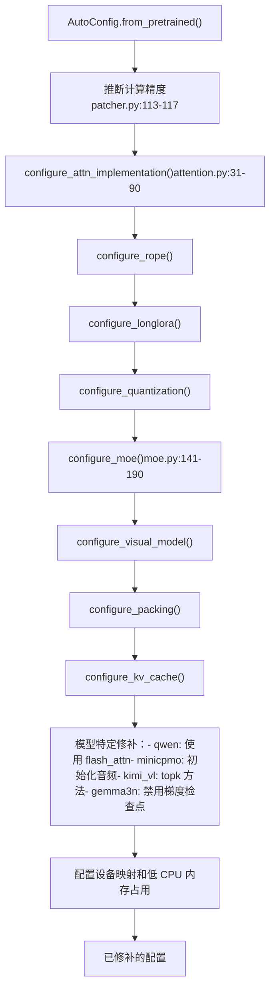
**来源：** [src/llamafactory/model/patcher.py106-166](https://github.com/hiyouga/LlamaFactory/blob/355d5c5e/src/llamafactory/model/patcher.py#L106-L166)

---

## 注意力机制配置

`configure_attn_implementation()` 函数基于 `model_args.flash_attn` 选择注意力机制：

| `flash_attn` 值 | 实现 | 要求 | 说明 |
| --- | --- | --- | --- |
| `AttentionFunction.AUTO` | 自动选择 | 无 | 默认行为 |
| `AttentionFunction.DISABLED` | `eager` | 无 | 标准 PyTorch 注意力机制 |
| `AttentionFunction.SDPA` | `sdpa` | torch >= 2.1.1 | 缩放点积注意力机制 |
| `AttentionFunction.FA2` | `flash_attention_2` | flash-attn-2 或 NPU | FlashAttention-2 |
| `AttentionFunction.FA3` | 自定义内核 | GPT-OSS 模型 | 带有注意力池的 FlashAttention-3 |

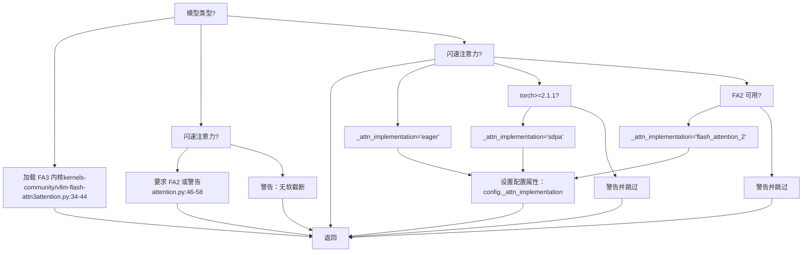
**特殊情况：**

-   **InternLM2**：使用 `config.attn_implementation` 而非 `config._attn_implementation` [attention.py83-84](https://github.com/hiyouga/LlamaFactory/blob/355d5c5e/attention.py#L83-L84)
-   **Kimi-VL**：同时为视觉和文本配置设置注意力机制 [attention.py85-87](https://github.com/hiyouga/LlamaFactory/blob/355d5c5e/attention.py#L85-L87)
-   **Gemma2**：注意力软截断需要 FA2 [attention.py46-58](https://github.com/hiyouga/LlamaFactory/blob/355d5c5e/attention.py#L46-L58)

**来源：** [src/llamafactory/model/model_utils/attention.py31-104](https://github.com/hiyouga/LlamaFactory/blob/355d5c5e/src/llamafactory/model/model_utils/attention.py#L31-L104)

---

## 量化系统

### 量化配置

系统通过 `configure_quantization()` 支持多种量化方法：

| 方法 | 位数 | 库 | 使用场景 |
| --- | --- | --- | --- |
| `QuantizationMethod.BNB` | 4, 8 | BitsAndBytes | 使用 QLoRA 进行训练 |
| `QuantizationMethod.HQQ` | 2, 4, 8 | HQQ | 推理优化 |
| `QuantizationMethod.EETQ` | 8 | EETQ | 推理优化 |
| `QuantizationMethod.GGUF` | 多种 | llama.cpp | 特定推理 |
| `QuantizationMethod.GPTQ` | 2-8 | AutoGPTQ | 预量化模型 |
| `QuantizationMethod.AWQ` | 4 | AutoAWQ | 预量化模型 |
| `QuantizationMethod.AQLM` | 1-2 | AQLM | 极致压缩 |

**量化设备映射：**

-   `quantization_device_map="auto"` 需要 `bitsandbytes >= 0.43.0`
-   允许在多个 GPU 之间分发量化模型
-   仅适用于 BitsAndBytes 量化

**BitsAndBytes 配置：**

```
# 在 configure_quantization() 中生成BitsAndBytesConfig(    load_in_4bit=(quantization_bit == 4),    load_in_8bit=(quantization_bit == 8),    llm_int8_threshold=6.0,    llm_int8_has_fp16_weight=False,    bnb_4bit_compute_dtype=compute_dtype,    bnb_4bit_use_double_quant=double_quantization,    bnb_4bit_quant_type=quantization_type,  # "nf4" 或 "fp4"    bnb_4bit_quant_storage=compute_dtype,)
```
**来源：** [src/llamafactory/model/model_utils/quantization.py](https://github.com/hiyouga/LlamaFactory/blob/355d5c5e/src/llamafactory/model/model_utils/quantization.py) [src/llamafactory/hparams/model_args.py278-300](https://github.com/hiyouga/LlamaFactory/blob/355d5c5e/src/llamafactory/hparams/model_args.py#L278-L300)

### 计算精度选择

`compute_dtype` 在 `patch_config()` 中根据以下优先级进行推断：

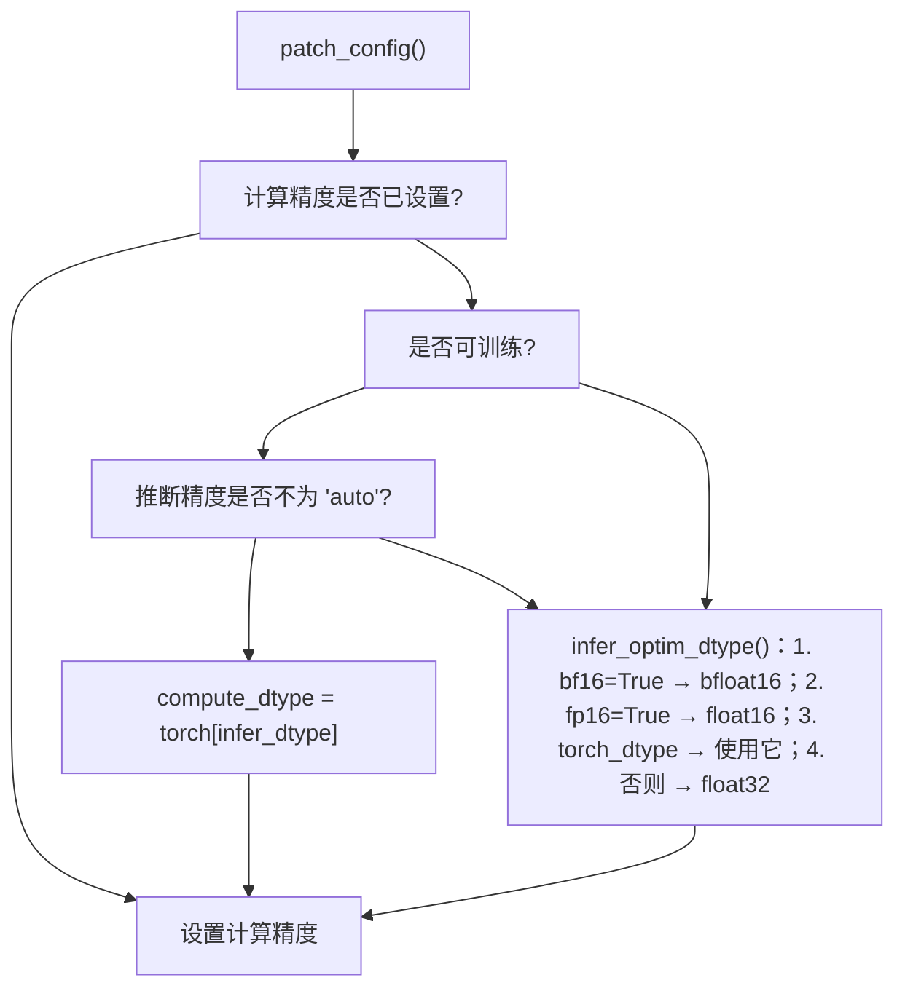
**来源：** [src/llamafactory/model/patcher.py113-117](https://github.com/hiyouga/LlamaFactory/blob/355d5c5e/src/llamafactory/model/patcher.py#L113-L117) [src/llamafactory/extras/misc.py](https://github.com/hiyouga/LlamaFactory/blob/355d5c5e/src/llamafactory/extras/misc.py#LNaN-LNaN)

---

## 适配器系统

### 适配器类型与设置

`init_adapter()` 函数基于 `finetuning_args.finetuning_type` 进行分支：

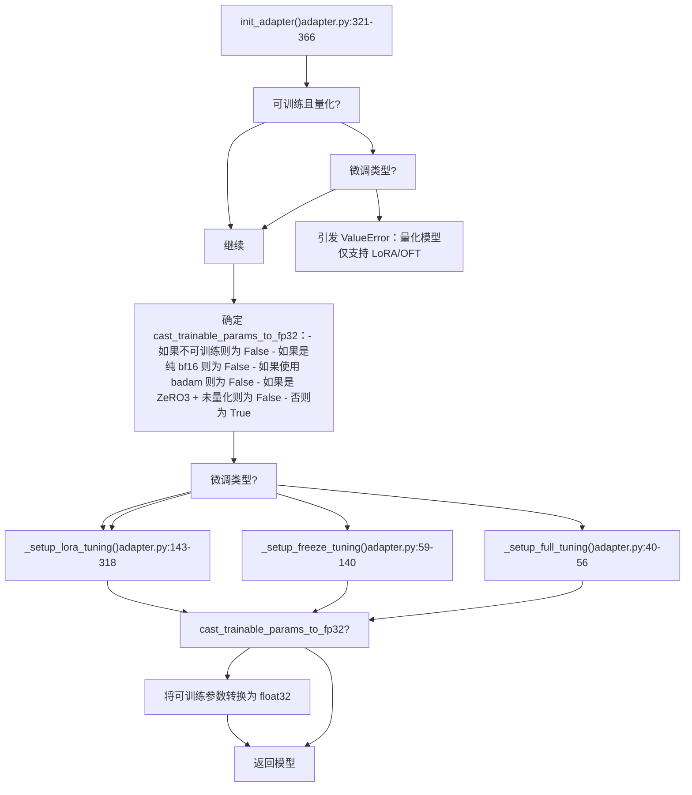
**来源：** [src/llamafactory/model/adapter.py321-366](https://github.com/hiyouga/LlamaFactory/blob/355d5c5e/src/llamafactory/model/adapter.py#L321-L366)

### 全量微调

`_setup_full_tuning()` 将除禁用模块外的所有参数设置为可训练：

```
# adapter.py:40-56def _setup_full_tuning(model, finetuning_args, is_trainable, cast_trainable_params_to_fp32):    if not is_trainable:        return        logger.info_rank0("Fine-tuning method: Full")    forbidden_modules = get_forbidden_modules(model.config, finetuning_args)    for name, param in model.named_parameters():        if not any(forbidden_module in name for forbidden_module in forbidden_modules):            if cast_trainable_params_to_fp32:                param.data = param.data.to(torch.float32)        else:            param.requires_grad_(False)
```
**禁用模块：**

-   视觉编码器（如果 `freeze_vision_tower=True`）
-   音频编码器（如果 `freeze_audio_encoder=True`）
-   模型特定投影器（如果 `freeze_multi_modal_projector=True`）

**来源：** [src/llamafactory/model/adapter.py40-56](https://github.com/hiyouga/LlamaFactory/blob/355d5c5e/src/llamafactory/model/adapter.py#L40-L56) [src/llamafactory/model/model_utils/visual.py](https://github.com/hiyouga/LlamaFactory/blob/355d5c5e/src/llamafactory/model/model_utils/visual.py#LNaN-LNaN)

### 冻结微调

`_setup_freeze_tuning()` 启用选择性层训练：

**层选择逻辑：**

| 场景 | `freeze_trainable_layers` | 可训练层 |
| --- | --- | --- |
| LLaMA-Pro | 必须整除 `num_layers` | 每隔 `stride` 层 |
| 微调最后 N 层 | 正值 | 最后 N 层 |
| 微调最前 N 层 | 负值 | 最前 N 层 |

**模块选择：**

-   `freeze_trainable_modules`：每个可训练层内的模块名称列表（例如 `["self_attn", "mlp"]`）
-   使用 `"all"` 以训练所选层中的所有模块
-   `freeze_extra_modules`：要训练的其他非层模块（例如 `["embed_tokens", "lm_head"]`）

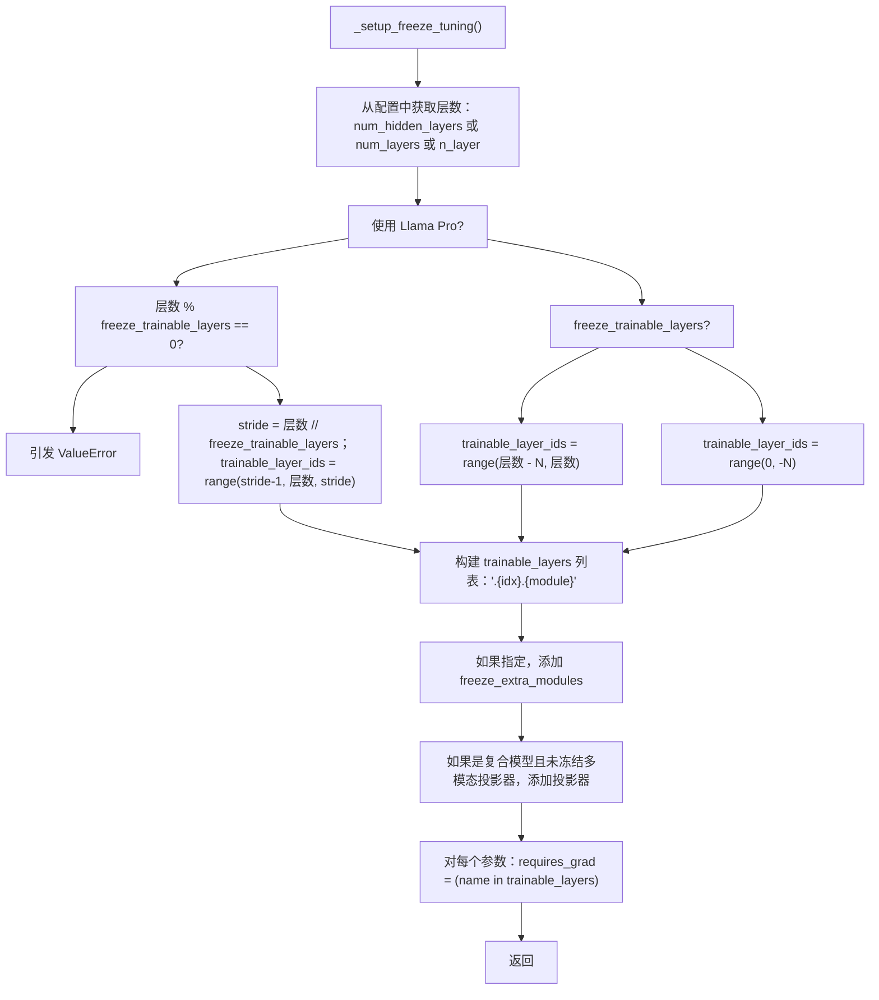
**来源：** [src/llamafactory/model/adapter.py59-140](https://github.com/hiyouga/LlamaFactory/blob/355d5c5e/src/llamafactory/model/adapter.py#L59-L140)

### LoRA 与 OFT 微调

`_setup_lora_tuning()` 是最复杂的适配器设置：

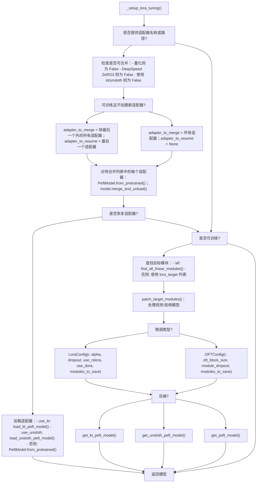
**LoRA 配置参数：**

| 参数 | 默认值 | 描述 |
| --- | --- | --- |
| `lora_rank` | 8 | LoRA 矩阵的秩 |
| `lora_alpha` | 16 | 缩放因子（有效学习率乘数） |
| `lora_dropout` | 0.0 | LoRA 层的丢弃率 |
| `use_rslora` | False | 使用秩稳定 LoRA |
| `use_dora` | False | 使用 DoRA（权重分解 LoRA） |
| `lora_target` | `["all"]` | 目标模块（或使用 "all" 进行自动检测） |
| `additional_target` | None | 要保存的其他模块（例如嵌入层） |

**OFT 配置参数：**

| 参数 | 默认值 | 描述 |
| --- | --- | --- |
| `oft_rank` | 8 | 正交变换的秩 |
| `oft_block_size` | 4 | OFT 的块大小 |
| `module_dropout` | 0.0 | OFT 模块的丢弃率 |

**PiSSA 初始化：**

-   设置 `pissa_init=True` 以使用 PiSSA 初始化
-   `pissa_iter=-1`：使用默认 PiSSA
-   `pissa_iter=N`：使用带有 N 步 FSVD 的 PiSSA

**来源：** [src/llamafactory/model/adapter.py143-318](https://github.com/hiyouga/LlamaFactory/blob/355d5c5e/src/llamafactory/model/adapter.py#L143-L318) [src/llamafactory/hparams/finetuning_args.py](https://github.com/hiyouga/LlamaFactory/blob/355d5c5e/src/llamafactory/hparams/finetuning_args.py#LNaN-LNaN)

---

## 模型修补

### 基础模型修补

`patch_model()` 函数应用模型级修改：

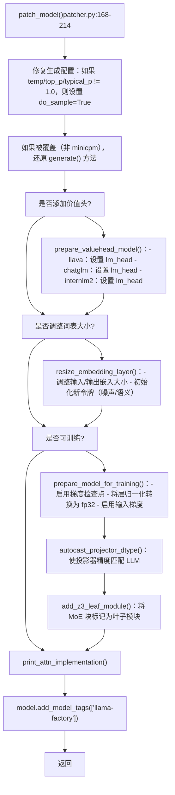
**来源：** [src/llamafactory/model/patcher.py168-214](https://github.com/hiyouga/LlamaFactory/blob/355d5c5e/src/llamafactory/model/patcher.py#L168-L214)

### MoE 配置

`configure_moe()` 函数为混合专家模型启用辅助损失：

**支持的 MoE 架构：**

| 模型类型 | 配置字段 | 损失系数字段 |
| --- | --- | --- |
| dbrx, mixtral, jamba | `output_router_logits` | `router_aux_loss_coef` |
| deepseek | \- | `aux_loss_alpha` |
| jetmoe | `output_router_logits` | `aux_loss_coef` |
| qwen2_moe, qwen3_moe | `output_router_logits` | `router_aux_loss_coef` |
| ernie4_5_moe, phimoe | `output_router_logits` | `router_aux_loss_coef` |
| granitemoe, olmoe, llama4 | `output_router_logits` | `router_aux_loss_coef` |

**DeepSpeed Zero3 叶子模块：**

为了在 DeepSpeed Zero3 下进行正确分区，特定的 MoE 块被标记为叶子模块：

```
# moe.py:43-138def add_z3_leaf_module(model):    if not is_deepspeed_zero3_enabled():        return        model_type = getattr(model.config, "model_type", None)        if model_type == "mixtral":        from transformers.models.mixtral.modeling_mixtral import MixtralSparseMoeBlock        _set_z3_leaf_modules(model, [MixtralSparseMoeBlock])        elif model_type == "deepseek_v2":        _set_z3_leaf_modules(model, ["DeepseekV2MoE"])        # ... (其他 MoE 模型类似)
```
**来源：** [src/llamafactory/model/model_utils/moe.py36-190](https://github.com/hiyouga/LlamaFactory/blob/355d5c5e/src/llamafactory/model/model_utils/moe.py#L36-L190)

### 视觉模型配置

`configure_visual_model()` 函数处理多模态模型设置：

**复合模型注册表：**

| 模型类型 | 投影器键 | 默认冻结 |
| --- | --- | --- |
| llava | `multi_modal_projector` | 可配置 |
| llava_next | `multi_modal_projector` | 可配置 |
| paligemma | `multi_modal_projector` | 可配置 |
| video_llava | `multi_modal_projector` | 可配置 |
| qwen2_vl | `visual` | 可配置 |
| minicpmv | `resampler` | 可配置 |
| glm4v | `vision_projection` | 可配置 |
| cogvlm2 | `vpm` | 可配置 |

**禁用模块逻辑：**

1.  如果 `freeze_vision_tower=True`，将视觉编码器添加到禁用模块
2.  如果 `freeze_multi_modal_projector=True`，将投影器添加到禁用模块
3.  这些模块将设置 `requires_grad=False`

**来源：** [src/llamafactory/model/model_utils/visual.py](https://github.com/hiyouga/LlamaFactory/blob/355d5c5e/src/llamafactory/model/model_utils/visual.py#LNaN-LNaN) [src/llamafactory/model/model_utils/visual.py](https://github.com/hiyouga/LlamaFactory/blob/355d5c5e/src/llamafactory/model/model_utils/visual.py#LNaN-LNaN)

---

## 特殊优化

### Unsloth 集成

Unsloth 为 LoRA 提供优化后的训练：

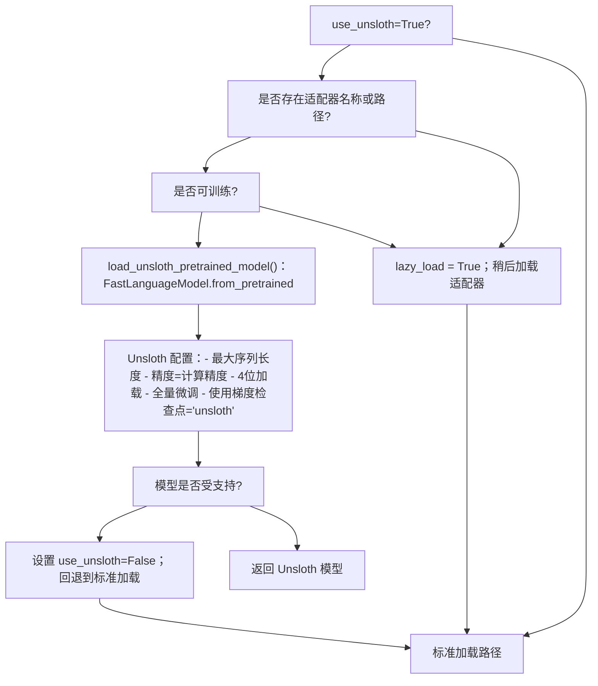
**Unsloth LoRA 设置：**

```
# unsloth.py:68-79def get_unsloth_peft_model(model, model_args, peft_kwargs):    from unsloth import FastLanguageModel        unsloth_peft_kwargs = {        "model": model,        "max_seq_length": model_args.model_max_length,        "use_gradient_checkpointing": "unsloth",    }    return FastLanguageModel.get_peft_model(**peft_kwargs, **unsloth_peft_kwargs)
```
**来源：** [src/llamafactory/model/model_utils/unsloth.py51-103](https://github.com/hiyouga/LlamaFactory/blob/355d5c5e/src/llamafactory/model/model_utils/unsloth.py#L51-L103) [src/llamafactory/model/adapter.py286-290](https://github.com/hiyouga/LlamaFactory/blob/355d5c5e/src/llamafactory/model/adapter.py#L286-L290)

### KTransformers 支持

KTransformers 为大模型启用 CPU-GPU 混合推理：

```
# 使用 KTransformers 加载模型if model_args.use_kt:    from ktransformers.sft.monkey_patch_torch_module import install_patch    install_patch()    model = load_kt_pretrained_model(config, model_args)
```
**KTransformers LoRA 调整：**

```
# adapter.py:220-228if model_args.use_kt:    new_list = []    for m in target_modules:        if m in ("down_proj", "up_proj", "gate_proj"):            # KT 需要带有前缀的 MLP 模块名称            new_list.extend([f"mlp.{m}", f"shared_experts.{m}"])        elif m not in ("generate_linear", "orig_module", "prefill_linear"):            new_list.append(m)        target_modules[:] = new_list
```
**来源：** [src/llamafactory/model/loader.py146-150](https://github.com/hiyouga/LlamaFactory/blob/355d5c5e/src/llamafactory/model/loader.py#L146-L150) [src/llamafactory/model/adapter.py220-228](https://github.com/hiyouga/LlamaFactory/blob/355d5c5e/src/llamafactory/model/adapter.py#L220-L228)

### Liger 内核

`apply_liger_kernel()` 函数应用内存高效的内核实现：

**支持的模型：**

| 模型家族 | 内核模块 |
| --- | --- |
| Llama, Mistral, Mixtral | `apply_liger_kernel_to_llama` |
| Gemma (1/2/3) | `apply_liger_kernel_to_gemma*` |
| Qwen (2/3) | `apply_liger_kernel_to_qwen*` |
| Phi3 | `apply_liger_kernel_to_phi3` |
| GLM4 | `apply_liger_kernel_to_glm4` |
| Granite, OLMo2 | 模型特定内核 |

**内核选择逻辑：**

```
# liger_kernel.py:30-97def apply_liger_kernel(config, model_args, is_trainable, require_logits):    if not is_trainable or not model_args.enable_liger_kernel:        return        model_type = getattr(config, "model_type", None)        # 基于 model_type 导入适当的内核    if model_type == "llama":        from liger_kernel.transformers import apply_liger_kernel_to_llama as apply_liger_kernel    # ... (其他模型类型)        # 为需要 logits 的阶段（RM、DPO 等）禁用融合交叉熵    if require_logits and "fused_linear_cross_entropy" in inspect.signature(apply_liger_kernel).parameters:        kwargs = {"fused_linear_cross_entropy": False, "cross_entropy": True}    else:        kwargs = {}        apply_liger_kernel(**kwargs)
```
**来源：** [src/llamafactory/model/model_utils/liger_kernel.py30-97](https://github.com/hiyouga/LlamaFactory/blob/355d5c5e/src/llamafactory/model/model_utils/liger_kernel.py#L30-L97)

---

## 总结

模型加载与配置系统提供了：

1.  **统一的枢纽支持**，适用于 Hugging Face、ModelScope 和 OpenMind
2.  **灵活的适配器系统**，支持全量、冻结、LoRA 和 OFT 微调
3.  **多种量化后端**（BitsAndBytes、GPTQ、AWQ 等）
4.  **注意力优化**（FlashAttention-2/3、SDPA）
5.  **MoE 感知训练**，具有正确的 DeepSpeed Zero3 集成
6.  **多模态支持**，具有视觉/音频编码器冻结功能
7.  **特殊的优化后端**（Unsloth、KTransformers、Liger）

该系统会尽早验证配置（例如量化仅支持 LoRA/OFT），自动应用模型特定修补，并为调试提供广泛的日志记录。所有配置都通过 `ModelArguments` 流转，该类被拆分为逻辑子数据类以提高可维护性。
