# 模型加载流水线

相关源码文件

-   [src/llamafactory/__init__.py](https://github.com/hiyouga/LlamaFactory/blob/355d5c5e/src/llamafactory/__init__.py)
-   [src/llamafactory/extras/misc.py](https://github.com/hiyouga/LlamaFactory/blob/355d5c5e/src/llamafactory/extras/misc.py)
-   [src/llamafactory/hparams/model_args.py](https://github.com/hiyouga/LlamaFactory/blob/355d5c5e/src/llamafactory/hparams/model_args.py)
-   [src/llamafactory/model/adapter.py](https://github.com/hiyouga/LlamaFactory/blob/355d5c5e/src/llamafactory/model/adapter.py)
-   [src/llamafactory/model/loader.py](https://github.com/hiyouga/LlamaFactory/blob/355d5c5e/src/llamafactory/model/loader.py)
-   [src/llamafactory/model/model_utils/longlora.py](https://github.com/hiyouga/LlamaFactory/blob/355d5c5e/src/llamafactory/model/model_utils/longlora.py)
-   [src/llamafactory/model/model_utils/packing.py](https://github.com/hiyouga/LlamaFactory/blob/355d5c5e/src/llamafactory/model/model_utils/packing.py)
-   [src/llamafactory/model/model_utils/unsloth.py](https://github.com/hiyouga/LlamaFactory/blob/355d5c5e/src/llamafactory/model/model_utils/unsloth.py)
-   [src/llamafactory/model/patcher.py](https://github.com/hiyouga/LlamaFactory/blob/355d5c5e/src/llamafactory/model/patcher.py)

## 目的与范围

本文档描述了 LlamaFactory 中的模型加载流水线，该流水线将模型标识符和配置参数转换为完全初始化、可训练或准备好推理的模型。该流水线负责处理枢纽选择、模型下载、配置修补、量化设置以及适配器初始化。

有关特定适配器类型（LoRA、QLoRA、OFT）及其配置的信息，请参阅[适配器系统 (LoRA/QLoRA/OFT)](/hiyouga/LlamaFactory/5.2-adapter-system-(loraqloraoft))。有关量化方法和精度模式，请参阅[量化与精度](/hiyouga/LlamaFactory/5.3-quantization-and-precision)。有关注意力机制配置，请参阅[注意力机制与优化](/hiyouga/LlamaFactory/5.4-attention-mechanisms-and-optimizations)。有关模型特定修补和配置，请参阅[模型修补与特殊配置](/hiyouga/LlamaFactory/5.5-model-patching-and-special-configurations)。

---

## 高层流水线概述

模型加载流水线由按顺序执行的六个主要阶段组成：

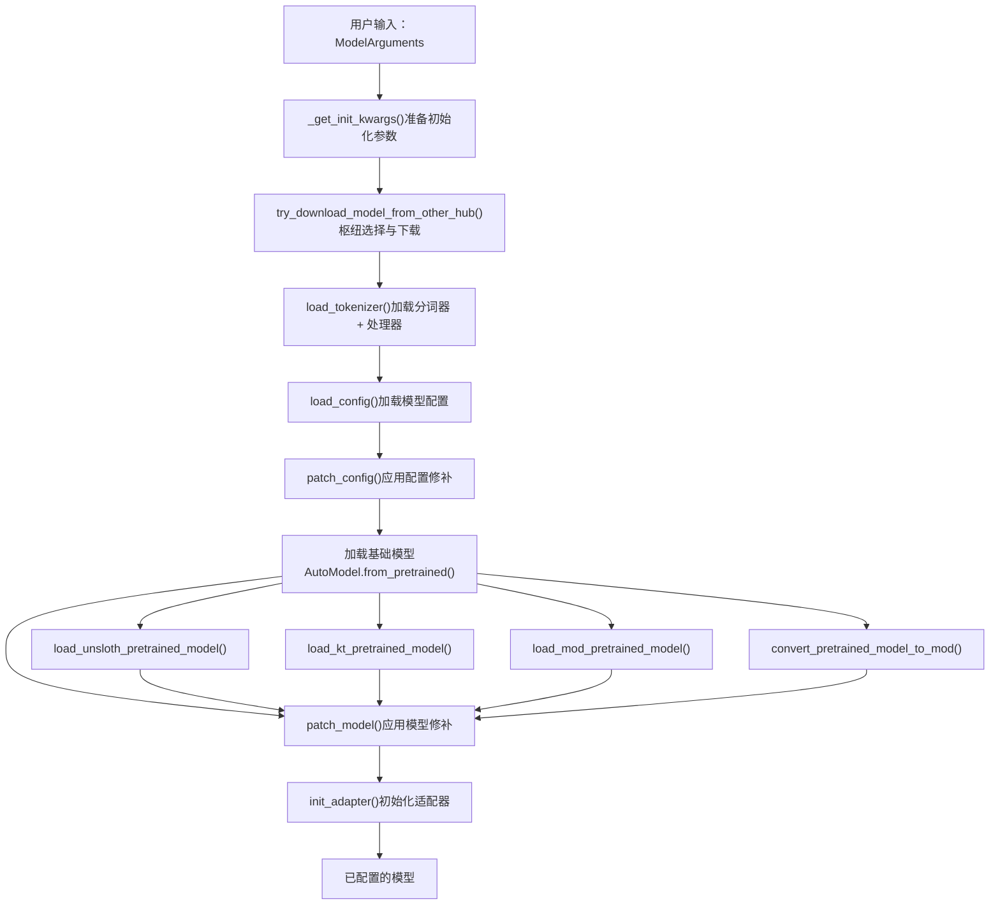
**来源：** [src/llamafactory/model/loader.py56-238](https://github.com/hiyouga/LlamaFactory/blob/355d5c5e/src/llamafactory/model/loader.py#L56-L238)

---

## 初始化参数准备

### 函数：`_get_init_kwargs()`

`_get_init_kwargs()` 函数准备在所有加载操作中使用的标准初始化参数。它执行枢纽特定的模型路径解析，并返回一个常用参数字典。

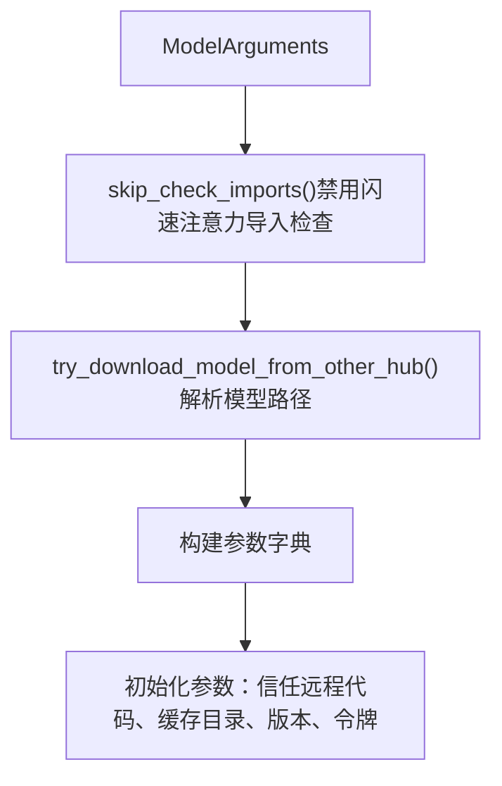
**关键参数：**

| 参数 | 来源 | 描述 |
| --- | --- | --- |
| `trust_remote_code` | `model_args.trust_remote_code` | 是否执行自定义模型代码 |
| `cache_dir` | `model_args.cache_dir` | 缓存下载目录 |
| `revision` | `model_args.model_revision` | 要使用的 Git 分支/标签/提交 |
| `token` | `model_args.hf_hub_token` | HuggingFace 枢纽身份验证令牌 |

**来源：** [src/llamafactory/model/loader.py56-68](https://github.com/hiyouga/LlamaFactory/blob/355d5c5e/src/llamafactory/model/loader.py#L56-L68) [src/llamafactory/extras/misc.py248-251](https://github.com/hiyouga/LlamaFactory/blob/355d5c5e/src/llamafactory/extras/misc.py#L248-L251)

---

## 枢纽选择与模型下载

### 函数：`try_download_model_from_other_hub()`

LlamaFactory 支持三个模型枢纽：HuggingFace、ModelScope（中国）和 OpenMind（中国）。枢纽通过环境变量选择，如果本地不可用，则下载模型。

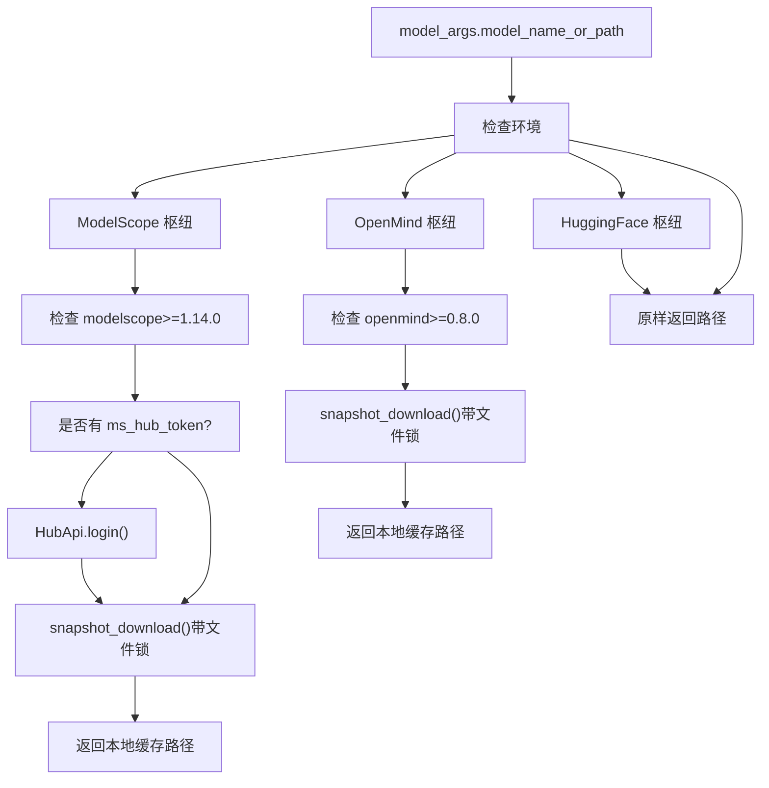
**枢纽选择逻辑：**

-   `use_modelscope()`：如果启用了 `USE_MODELSCOPE_HUB` 环境变量，则返回 `True`
-   `use_openmind()`：如果启用了 `USE_OPENMIND_HUB` 环境变量，则返回 `True`
-   默认：HuggingFace 枢纽（无需下载，由 `transformers` 处理）

**文件锁定：** ModelScope 和 OpenMind 使用 `WeakFileLock` 来防止并发下载：

-   ModelScope: `~/.cache/llamafactory/modelscope.lock`
-   OpenMind: `~/.cache/llamafactory/openmind.lock`

**来源：** [src/llamafactory/extras/misc.py267-310](https://github.com/hiyouga/LlamaFactory/blob/355d5c5e/src/llamafactory/extras/misc.py#L267-L310) [src/llamafactory/model/loader.py61-62](https://github.com/hiyouga/LlamaFactory/blob/355d5c5e/src/llamafactory/model/loader.py#L61-L62)

---

## 分词器与处理器加载

### 函数：`load_tokenizer()`

分词器加载过程尝试优先使用快速（fast）分词器，如果需要则回退到慢速分词器，并可选地为多模态模型加载处理器。

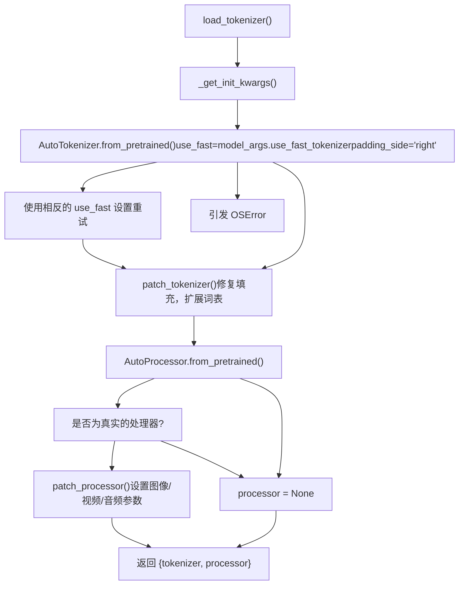
### 分词器修补：`patch_tokenizer()`

`patch_tokenizer()` 函数修改已加载的分词器：

| 修改项 | 条件 | 动作 |
| --- | --- | --- |
| 修复填充方法 | 始终执行 | 如果需要，替换为 `PreTrainedTokenizerBase._pad` |
| 扩展最大长度 | 设置了 `model_args.model_max_length` | 增加 `tokenizer.model_max_length` |
| 添加自定义令牌 | 设置了 `model_args.add_tokens` | 添加非特殊令牌，设置 `resize_vocab=True` |
| 添加特殊令牌 | 设置了 `model_args.add_special_tokens` 或 `model_args.new_special_tokens_config` | 添加特殊令牌，并带有可选的语义初始化 |

**来源：** [src/llamafactory/model/loader.py71-122](https://github.com/hiyouga/LlamaFactory/blob/355d5c5e/src/llamafactory/model/loader.py#L71-L122) [src/llamafactory/model/patcher.py64-86](https://github.com/hiyouga/LlamaFactory/blob/355d5c5e/src/llamafactory/model/patcher.py#L64-L86) [src/llamafactory/model/patcher.py88-104](https://github.com/hiyouga/LlamaFactory/blob/355d5c5e/src/llamafactory/model/patcher.py#L88-L104)

---

## 配置加载与修补

### 函数：`load_config()` 和 `patch_config()`

模型配置加载是一个两步过程：加载基础配置，然后基于 `ModelArguments` 应用广泛的修补。

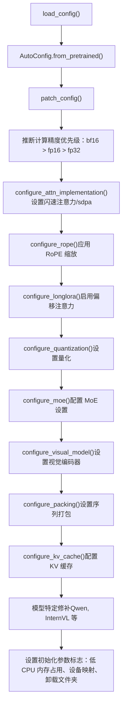
### 关键配置修补

**计算精度推断：**

```
# 优先级顺序（源自 patch_config）if model_args.infer_dtype != "auto" and not is_trainable:    compute_dtype = torch.dtype from infer_dtypeelse:    compute_dtype = infer_optim_dtype(config.torch_dtype)    # 如果可用且模型使用，则返回 bf16，否则返回 fp16，否则返回 fp32
```
**设备映射配置：**

-   如果启用了 DeepSpeed ZeRO-3 或 FSDP，则禁用
-   需要 `low_cpu_mem_usage=True`
-   如果 `device_map="auto"`，则设置 `offload_folder` 用于磁盘卸载

**模型特定修补：**

| 模型类型 | 应用的修补 |
| --- | --- |
| `qwen` | 设置 `use_flash_attn`，精度标志 (`fp16`, `bf16`, `fp32`) |
| `minicpmo` | 设置 `init_audio=True`, `init_tts=False` |
| `kimi_vl` | 训练期间设置 `text_config.topk_method="greedy"` |
| `internvl` | 如果不是 HF 兼容格式，则报错 |
| `llava` | 如果不是 `llava-hf` 格式，则报错 |
| `qwen3_omni_moe` | 应用 MoE 稀疏块修补 |

**来源：** [src/llamafactory/model/loader.py125-128](https://github.com/hiyouga/LlamaFactory/blob/355d5c5e/src/llamafactory/model/loader.py#L125-L128) [src/llamafactory/model/patcher.py106-166](https://github.com/hiyouga/LlamaFactory/blob/355d5c5e/src/llamafactory/model/patcher.py#L106-L166) [src/llamafactory/extras/misc.py214-222](https://github.com/hiyouga/LlamaFactory/blob/355d5c5e/src/llamafactory/extras/misc.py#L214-L222)

---

## 基础模型加载

### 函数：`load_model()`

基础模型加载逻辑在回退到标准 `AutoModel` 加载之前，会基于特殊加载模式（Unsloth, KTransformers, MoD）进行分支。

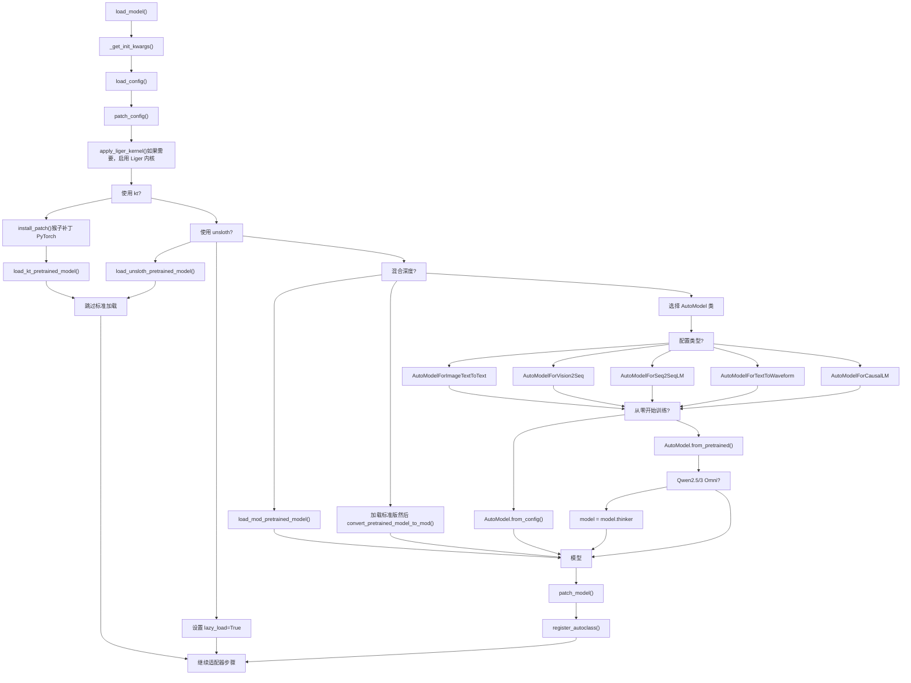
**Auto Model 类选择：** 系统基于模型的配置自动选择适当的 `AutoModel` 类：

| 配置映射 | AutoModel 类 | 使用场景 |
| --- | --- | --- |
| `AutoModelForImageTextToText` | 图像文本模型 | 视觉语言模型 (VLMs) |
| `AutoModelForVision2Seq` | 视觉到序列 | 备选 VLM 格式 |
| `AutoModelForSeq2SeqLM` | Seq2Seq | 音频文本模型 |
| `AutoModelForTextToWaveform` | 文本到波形 | Qwen Omni 音频生成 |
| `AutoModelForCausalLM` | 因果语言模型 | 标准文本生成模型 |

**来源：** [src/llamafactory/model/loader.py131-188](https://github.com/hiyouga/LlamaFactory/blob/355d5c5e/src/llamafactory/model/loader.py#L131-L188)

---

## 模型修补

### 函数：`patch_model()`

加载基础模型后，`patch_model()` 应用运行时修改以确保训练或推理期间的行为正确。

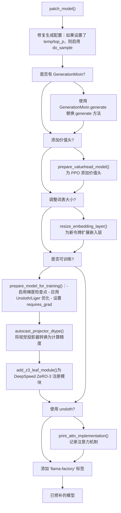
### 关键模型修补

**1. 修复生成配置：** 如果设置了采样参数（temperature, top_p, typical_p）但 `do_sample=False`，则自动启用采样以防止静默失败。

**2. 准备价值头 (`add_valuehead=True`)：**

-   为强化学习 (PPO) 训练添加一个价值头层。
-   初始时冻结除价值头以外的所有参数。
-   有关 PPO 详情，请参阅[训练阶段与训练器](/hiyouga/LlamaFactory/6.1-training-stages-and-trainers)

**3. 调整嵌入层大小：** 当分词器中添加了新令牌时，必须调整嵌入层和输出层的大小：

-   调用 `resize_embedding_layer()` 来扩展维度。
-   可以可选地对特殊令牌执行语义初始化。
-   如果添加了令牌，则自动设置 `resize_vocab=True`。

**4. 训练准备 (`is_trainable=True`)：**

-   **梯度检查点：** 除非 `disable_gradient_checkpointing=True` 或模型类型为 `gemma3n`，否则默认启用
-   **Unsloth 优化：** 如果 `use_unsloth_gc=True`，则应用内存高效的梯度检查点
-   **Liger 内核：** 如果 `enable_liger_kernel=True`，则应用融合内核
-   **投影器转换：** 对于多模态模型，将视觉投影器转换为 `compute_dtype`
-   **DeepSpeed ZeRO-3：** 将 MoE 专家注册为叶子模块以防止分片问题

**来源：** [src/llamafactory/model/patcher.py168-214](https://github.com/hiyouga/LlamaFactory/blob/355d5c5e/src/llamafactory/model/patcher.py#L168-L214) [src/llamafactory/model/model_utils/checkpointing.py](https://github.com/hiyouga/LlamaFactory/blob/355d5c5e/src/llamafactory/model/model_utils/checkpointing.py) [src/llamafactory/model/model_utils/embedding.py](https://github.com/hiyouga/LlamaFactory/blob/355d5c5e/src/llamafactory/model/model_utils/embedding.py) [src/llamafactory/model/model_utils/valuehead.py](https://github.com/hiyouga/LlamaFactory/blob/355d5c5e/src/llamafactory/model/model_utils/valuehead.py)

---

## 适配器初始化

### 函数：`init_adapter()`

最后阶段初始化参数高效微调 (PEFT) 适配器或配置全量/冻结微调。该函数分发到四种配置模式之一。

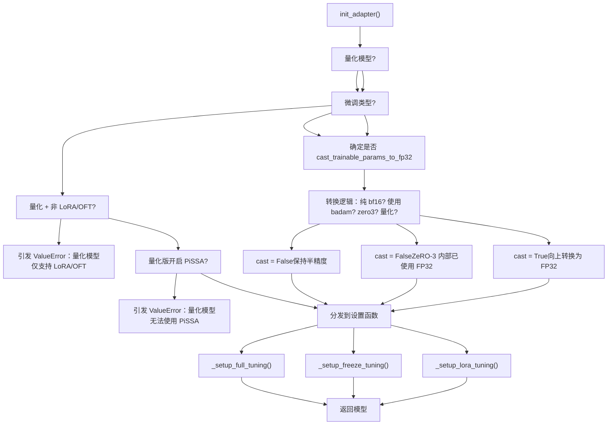
### 可训练参数转换逻辑

将可训练参数转换为 FP32 的决定取决于多个因素：

| 条件 | 转换为 FP32? | 原因 |
| --- | --- | --- |
| `not is_trainable` | 否 | 推理模式，无梯度 |
| `pure_bf16=True` | 否 | 要求纯 BF16 训练 |
| `use_badam=True` | 否 | BAdam 处理混合精度 |
| 设置了 `quantization_bit` | 是 | QLoRA 需要 FP32 梯度 |
| 未量化的 `zero3` | 否 | DeepSpeed ZeRO-3 内部使用 FP32 |
| 默认可训练 | 是 | 标准 mixed precision 训练 |

**来源：** [src/llamafactory/model/adapter.py321-366](https://github.com/hiyouga/LlamaFactory/blob/355d5c5e/src/llamafactory/model/adapter.py#L321-L366)

---

## 适配器配置模式

### 1. 全量微调：`_setup_full_tuning()`

全量微调更新所有模型参数，可选冻结禁止模块（例如视觉编码器）。

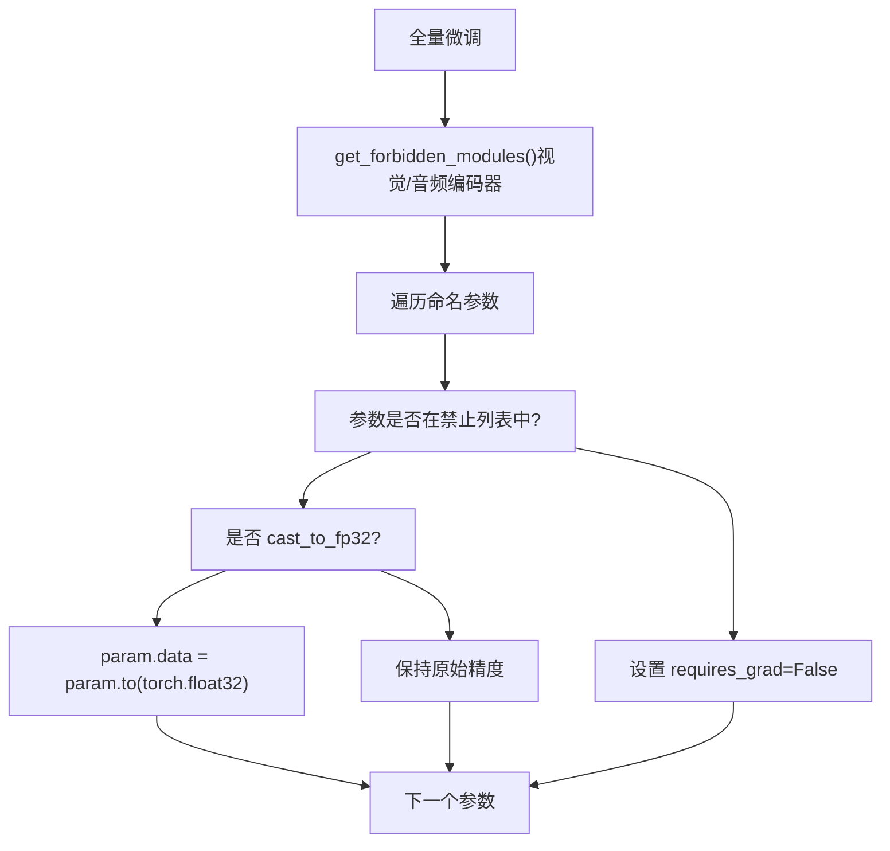
**来源：** [src/llamafactory/model/adapter.py40-56](https://github.com/hiyouga/LlamaFactory/blob/355d5c5e/src/llamafactory/model/adapter.py#L40-L56)

### 2. 冻结微调：`_setup_freeze_tuning()`

冻结微调仅训练特定层，支持标准和 LLaMA-Pro 训练策略。

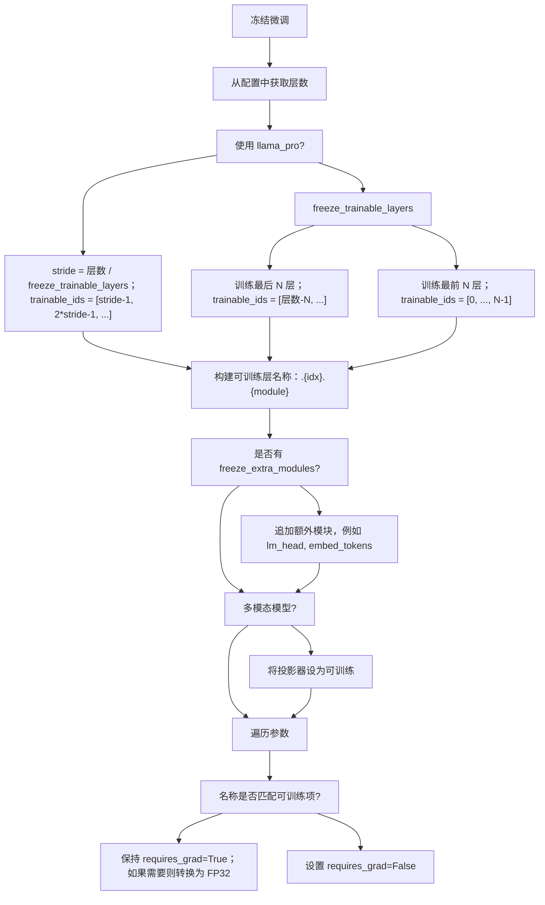
**LLaMA-Pro 策略：** LLaMA-Pro 将可训练层均匀分布在整个模型中，而不是集中在末尾。例如，对于 32 层和 8 个可训练层的情况，它训练第 3, 7, 11, 15, 19, 23, 27, 31 层。

**来源：** [src/llamafactory/model/adapter.py59-141](https://github.com/hiyouga/LlamaFactory/blob/355d5c5e/src/llamafactory/model/adapter.py#L59-L141)

### 3. LoRA/OFT 微调：`_setup_lora_tuning()`

LoRA（低秩自适应）和 OFT（正交微调）是最复杂的适配器配置，支持模型合并、适配器加载以及新适配器创建。

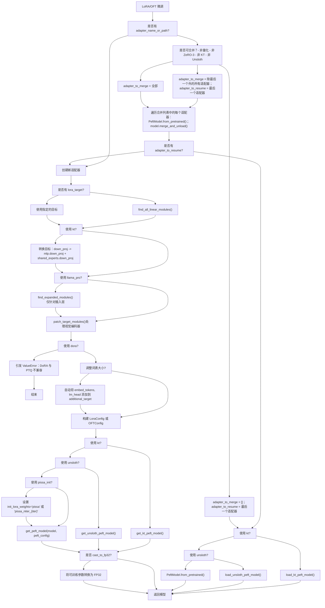
**适配器合并逻辑：**

适配器可以合并到基础模型中以实现更快的推理。合并决策矩阵如下：

| 场景 | 合并行为 |
| --- | --- |
| 量化模型 | **不合并**（不稳定），仅恢复最后一个适配器 |
| DeepSpeed ZeRO-3 | **不合并**，仅恢复最后一个适配器 |
| KTransformers | **不合并**，仅恢复最后一个适配器 |
| Unsloth | **不合并**，仅恢复最后一个适配器 |
| 训练 + `create_new_adapter=False` | **合并除最后一个外的所有适配器**，恢复最后一个以继续训练 |
| 训练 + `create_new_adapter=True` | **合并所有适配器**，创建新适配器 |
| 推理 | **全部合并**到基础模型中 |

**目标模块选择：**

| `lora_target` 值 | 产生的目标 |
| --- | --- |
| `["all"]` | 由 `find_all_linear_modules()` 找到的所有线性层 |
| 特定列表（例如 `["q_proj", "v_proj"]`） | 仅限指定的模块 |
| 配合 `use_llama_pro=True` | 仅限插入层中的模块 |
| 使用 KTransformers | 转换后的名称（例如 `mlp.down_proj`, `shared_experts.down_proj`） |

**PiSSA 初始化：**

PiSSA（主奇异值与奇异向量自适应）使用 SVD 初始化 LoRA 矩阵：

-   `pissa_iter=-1`：使用完整 SVD 的标准 PiSSA
-   `pissa_iter=N`：带有 N 次迭代的快速 SVD
-   仅兼容非量化模型
-   通过 `init_lora_weights="pissa"` 或 `"pissa_niter_{N}"` 设置

**来源：** [src/llamafactory/model/adapter.py143-318](https://github.com/hiyouga/LlamaFactory/blob/355d5c5e/src/llamafactory/model/adapter.py#L143-L318)

---

## 加载后操作

适配器初始化后，`load_model()` 函数在返回模型之前执行几项最终操作。

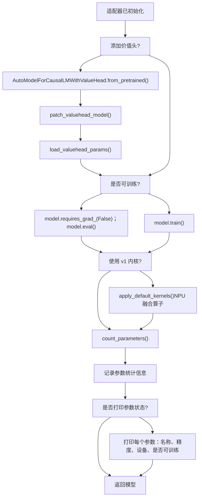
### 价值头集成

对于 PPO 训练 (`add_valuehead=True`)：

1.  **封装：** 模型被封装在 `AutoModelForCausalLMWithValueHead` 中
2.  **修补：** 应用用于嵌入层访问、权重共享、RoPE 索引的方法
3.  **加载：** 尝试从检查点加载预训练的价值头参数
4.  **忽略键：** 设置 `_keys_to_ignore_on_save` 以避免重复保存基础模型

### 参数统计日志记录

系统使用 `count_parameters()` 记录参数计数：

-   **可训练参数：** `requires_grad=True` 的参数
-   **所有参数：** 模型中的总参数
-   **可训练比例：** 正在训练的参数百分比
-   通过 `param.ds_numel` 处理 DeepSpeed ZeRO-3
-   通过 `Params4bit.quant_storage` 处理 4 位量化

**示例输出：**

```
trainable params: 4,194,304 || all params: 6,738,415,616 || trainable%: 0.0622
```
### V1 算子（实验性）

当 `use_v1_kernels=True` 时，应用 NPU 优化的融合算子：

-   **目的：** 加速在昇腾 NPU 上的训练
-   **范围：** 并非所有模型都支持
-   **位置：** [src/llamafactory/v1/plugins/model_plugins/kernels/interface.py](https://github.com/hiyouga/LlamaFactory/blob/355d5c5e/src/llamafactory/v1/plugins/model_plugins/kernels/interface.py)
-   **状态：** 未来功能，在过渡期后可能会被移除

**来源：** [src/llamafactory/model/loader.py192-237](https://github.com/hiyouga/LlamaFactory/blob/355d5c5e/src/llamafactory/model/loader.py#L192-L237) [src/llamafactory/extras/misc.py117-141](https://github.com/hiyouga/LlamaFactory/blob/355d5c5e/src/llamafactory/extras/misc.py#L117-L141) [src/llamafactory/model/patcher.py216-253](https://github.com/hiyouga/LlamaFactory/blob/355d5c5e/src/llamafactory/model/patcher.py#L216-L253)

---

## 完整流水线代码流

此图显示了代码库中实际函数名的完整函数调用层次结构：

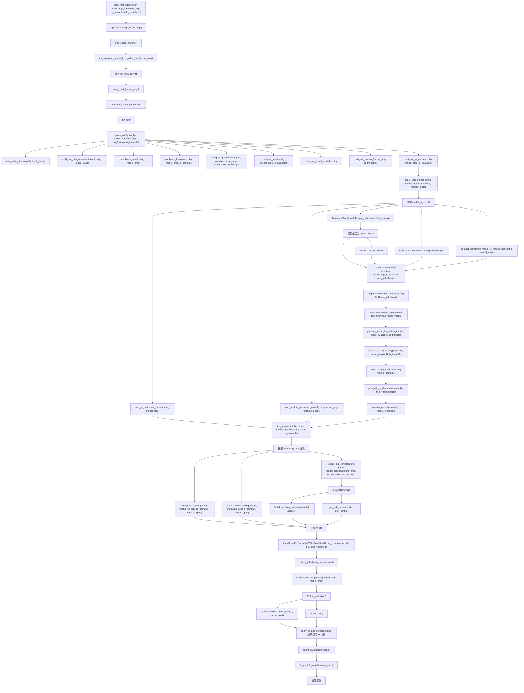
**来源：** [src/llamafactory/model/loader.py131-238](https://github.com/hiyouga/LlamaFactory/blob/355d5c5e/src/llamafactory/model/loader.py#L131-L238) [src/llamafactory/model/patcher.py106-214](https://github.com/hiyouga/LlamaFactory/blob/355d5c5e/src/llamafactory/model/patcher.py#L106-L214) [src/llamafactory/model/adapter.py321-366](https://github.com/hiyouga/LlamaFactory/blob/355d5c5e/src/llamafactory/model/adapter.py#L321-L366)

---

## 环境变量

以下环境变量会影响模型加载流水线：

| 变量 | 效果 | 默认值 |
| --- | --- | --- |
| `USE_MODELSCOPE_HUB` | 使用 ModelScope 而不是 HuggingFace | `0` |
| `USE_OPENMIND_HUB` | 使用 OpenMind 而不是 HuggingFace | `0` |
| `USE_KT` | 启用 KTransformers 集成 | `0` |
| `DISABLE_VERSION_CHECK` | 跳过依赖版本检查 | `0` |
| `FORCE_CHECK_IMPORTS` | 强制进行 flash attention 导入检查 | `0` |
| `LOCAL_RANK` | 分布式训练的进程排名 | `0` |

**来源：** [src/llamafactory/extras/misc.py231-233](https://github.com/hiyouga/LlamaFactory/blob/355d5c5e/src/llamafactory/extras/misc.py#L231-L233) [src/llamafactory/extras/misc.py304-317](https://github.com/hiyouga/LlamaFactory/blob/355d5c5e/src/llamafactory/extras/misc.py#L304-L317)

---

## 错误处理与验证

### 模型特定验证

流水线包含几项模型特定的验证：

```
# InternVL 格式检查if "InternVLChatModel" in config.architectures:    raise ValueError("请下载 HF 兼容格式的 internvl 模型") # LLaVA 格式检查  if "LlavaLlamaForCausalLM" in config.architectures:    raise ValueError("请下载 hf 兼容格式的 llava 模型") # InternLM3 版本检查if config.model_type == "internlm3" and transformers_version < "4.47.1":    raise RuntimeError("InternLM3 需要 transformers>=4.47.1")
```
### 适配器兼容性验证

```
# 带非 LoRA 适配器的量化if is_trainable and quantized and finetuning_type not in ["lora", "oft"]:    raise ValueError("量化模型仅能使用 LoRA 或 OFT 微调") # 带量化的 PiSSAif pissa_init and quantized:    raise ValueError("无法在量化模型上初始化 PiSSA 适配器") # 带非 BNB 量化的 DoRAif use_dora and quantization_method not in [None, "bnb"]:    raise ValueError("DoRA 与 PTQ 量化模型不兼容")
```
**来源：** [src/llamafactory/model/patcher.py141-154](https://github.com/hiyouga/LlamaFactory/blob/355d5c5e/src/llamafactory/model/patcher.py#L141-L154) [src/llamafactory/model/adapter.py334-340](https://github.com/hiyouga/LlamaFactory/blob/355d5c5e/src/llamafactory/model/adapter.py#L334-L340)

---

## 摘要表：关键函数

| 函数 | 文件 | 目的 |
| --- | --- | --- |
| `load_tokenizer()` | loader.py:71-122 | 加载分词器和可选的处理器 |
| `load_config()` | loader.py:125-128 | 从预训练权重加载模型配置 |
| `load_model()` | loader.py:131-238 | 模型加载流水线的主要入口点 |
| `_get_init_kwargs()` | loader.py:56-68 | 准备标准初始化参数 |
| `try_download_model_from_other_hub()` | misc.py:267-301 | 如果需要，从 ModelScope/OpenMind 下载 |
| `patch_tokenizer()` | patcher.py:64-86 | 扩展词汇表并修复分词器方法 |
| `patch_processor()` | patcher.py:88-104 | 配置图像/视频/音频处理参数 |
| `patch_config()` | patcher.py:106-166 | 应用广泛的配置修补程序 |
| `patch_model()` | patcher.py:168-214 | 应用运行时模型修改 |
| `init_adapter()` | adapter.py:321-366 | 初始化 PEFT 适配器或全参数/冻结微调 |
| `_setup_full_tuning()` | adapter.py:40-56 | 配置全参数微调 |
| `_setup_freeze_tuning()` | adapter.py:59-141 | 配置层冻结策略 |
| `_setup_lora_tuning()` | adapter.py:143-318 | 配置 LoRA/OFT 适配器 |
