# 适配器系统 (LoRA/QLoRA/OFT)

相关源码文件

-   [src/llamafactory/hparams/finetuning_args.py](https://github.com/hiyouga/LlamaFactory/blob/355d5c5e/src/llamafactory/hparams/finetuning_args.py)
-   [src/llamafactory/hparams/model_args.py](https://github.com/hiyouga/LlamaFactory/blob/355d5c5e/src/llamafactory/hparams/model_args.py)
-   [src/llamafactory/model/adapter.py](https://github.com/hiyouga/LlamaFactory/blob/355d5c5e/src/llamafactory/model/adapter.py)
-   [src/llamafactory/model/loader.py](https://github.com/hiyouga/LlamaFactory/blob/355d5c5e/src/llamafactory/model/loader.py)
-   [src/llamafactory/model/model_utils/unsloth.py](https://github.com/hiyouga/LlamaFactory/blob/355d5c5e/src/llamafactory/model/model_utils/unsloth.py)
-   [src/llamafactory/model/patcher.py](https://github.com/hiyouga/LlamaFactory/blob/355d5c5e/src/llamafactory/model/patcher.py)
-   [src/llamafactory/train/dpo/trainer.py](https://github.com/hiyouga/LlamaFactory/blob/355d5c5e/src/llamafactory/train/dpo/trainer.py)
-   [src/llamafactory/train/kto/trainer.py](https://github.com/hiyouga/LlamaFactory/blob/355d5c5e/src/llamafactory/train/kto/trainer.py)
-   [src/llamafactory/train/ppo/trainer.py](https://github.com/hiyouga/LlamaFactory/blob/355d5c5e/src/llamafactory/train/ppo/trainer.py)
-   [src/llamafactory/train/pt/trainer.py](https://github.com/hiyouga/LlamaFactory/blob/355d5c5e/src/llamafactory/train/pt/trainer.py)
-   [src/llamafactory/train/rm/trainer.py](https://github.com/hiyouga/LlamaFactory/blob/355d5c5e/src/llamafactory/train/rm/trainer.py)
-   [src/llamafactory/train/sft/trainer.py](https://github.com/hiyouga/LlamaFactory/blob/355d5c5e/src/llamafactory/train/sft/trainer.py)
-   [src/llamafactory/train/trainer_utils.py](https://github.com/hiyouga/LlamaFactory/blob/355d5c5e/src/llamafactory/train/trainer_utils.py)

## 目的与范围

适配器系统为大语言模型提供了参数高效微调 (PEFT) 方法。本文档记录了四种微调策略：**LoRA** (低秩自适应)、**QLoRA** (量化 LoRA)、**OFT** (正交微调) 和 **Freeze** (冻结) 微调，以及全参数微调。该系统负责处理适配器初始化、配置、加载、合并以及与量化模型的集成。

有关适配器初始化前的模型加载和配置，请参阅[模型加载流水线](/hiyouga/LlamaFactory/5.1-model-loading-pipeline)。有关独立于适配器的量化细节，请参阅[量化与精度](/hiyouga/LlamaFactory/5.3-quantization-and-precision)。有关训练集成，请参阅[训练阶段与训练器](/hiyouga/LlamaFactory/6.1-training-stages-and-trainers)。

---

## 适配器方法概览

LlamaFactory 支持四种微调方法，每种方法在内存效率、训练速度和模型容量之间有不同的权衡：

| 方法 | 可训练参数 | 内存效率 | 使用场景 | 量化支持 |
| --- | --- | --- | --- | --- |
| **Full** | 所有参数 | 低 | 小型模型，资源充足 | 否 |
| **Freeze** | 选定层 | 中 | 特定层微调，LLaMA-Pro | 否 |
| **LoRA/QLoRA** | 低秩矩阵 | 高 | 最具效率，支持量化 | 是 (4/8-bit) |
| **OFT** | 正交矩阵 | 高 | LoRA 的替代方案 | 是 (4/8-bit) |

适配器类型通过 `FinetuningArguments` 中的 `finetuning_type` 指定，其值可以为 `"full"`、`"freeze"`、`"lora"` 或 `"oft"`。

**来源：** [src/llamafactory/hparams/finetuning_args.py464-467](https://github.com/hiyouga/LlamaFactory/blob/355d5c5e/src/llamafactory/hparams/finetuning_args.py#L464-L467) [src/llamafactory/model/adapter.py321-367](https://github.com/hiyouga/LlamaFactory/blob/355d5c5e/src/llamafactory/model/adapter.py#L321-L367)

---

## 适配器初始化流程

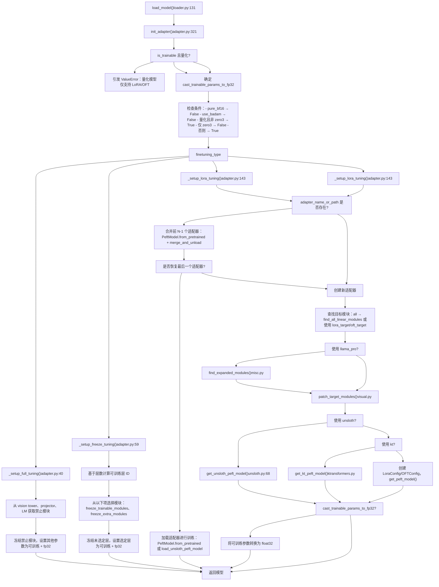
**关键决策点：**

1.  **量化检查**：量化模型仅能使用 LoRA 或 OFT 适配器 [adapter.py334-336](https://github.com/hiyouga/LlamaFactory/blob/355d5c5e/adapter.py#L334-L336)
2.  **转换为 FP32**：除非使用纯 BF16、BAdam 或 DeepSpeed ZeRO-3，否则可训练参数将被转换为 `float32` [adapter.py342-353](https://github.com/hiyouga/LlamaFactory/blob/355d5c5e/adapter.py#L342-L353)
3.  **适配器合并**：可以顺序加载并合并多个适配器，但最后一个除外，它将用于训练 [adapter.py177-182](https://github.com/hiyouga/LlamaFactory/blob/355d5c5e/adapter.py#L177-L182)

**来源：** [src/llamafactory/model/adapter.py321-367](https://github.com/hiyouga/LlamaFactory/blob/355d5c5e/src/llamafactory/model/adapter.py#L321-L367) [src/llamafactory/model/loader.py190](https://github.com/hiyouga/LlamaFactory/blob/355d5c5e/src/llamafactory/model/loader.py#L190-L190)

---

## LoRA 配置

LoRA (低秩自适应) 将可训练的低秩分解矩阵添加到冻结的模型权重中，显著减少了可训练参数的数量。

### LoRA 参数

`FinetuningArguments` 中的 `LoraArguments` 数据类控制 LoRA 的行为：

| 参数 | 类型 | 默认值 | 描述 |
| --- | --- | --- | --- |
| `lora_rank` | int | 8 | 低秩矩阵的秩 (r) |
| `lora_alpha` | int | lora_rank*2 | 缩放因子 (α)，默认值为 2r |
| `lora_dropout` | float | 0.0 | LoRA 层的丢弃率 |
| `lora_target` | str | "all" | 目标模块（逗号分隔或 "all"） |
| `additional_target` | str | None | LoRA 层以外需要训练的额外模块 |
| `use_rslora` | bool | False | 使用秩稳定 LoRA 缩放 |
| `use_dora` | bool | False | 使用 DoRA (权重分解 LoRA) |
| `pissa_init` | bool | False | 使用 PiSSA 进行初始化 |
| `pissa_iter` | int | 16 | PiSSA 的 FSVD 迭代次数（-1 表示禁用） |

**来源：** [src/llamafactory/hparams/finetuning_args.py56-123](https://github.com/hiyouga/LlamaFactory/blob/355d5c5e/src/llamafactory/hparams/finetuning_args.py#L56-L123)

### 目标模块选择

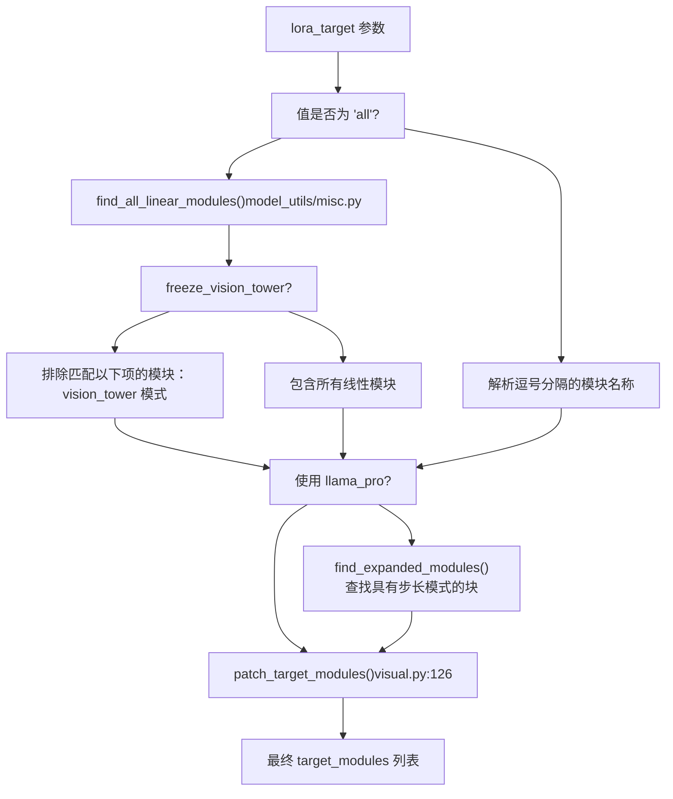
当 `lora_target="all"` 时，系统会查找除嵌入层和 `lm_head` 之外的所有 `torch.nn.Linear` 模块。对于 `freeze_vision_tower=True` 的视觉语言模型，视觉塔模块将被排除。

**来源：** [src/llamafactory/model/adapter.py215-233](https://github.com/hiyouga/LlamaFactory/blob/355d5c5e/src/llamafactory/model/adapter.py#L215-L233) [src/llamafactory/model/model_utils/misc.py](https://github.com/hiyouga/LlamaFactory/blob/355d5c5e/src/llamafactory/model/model_utils/misc.py#LNaN-LNaN)

### LoRA 变体

**标准 LoRA**：添加矩阵 A (r×d) 和 B (d×r)，其中 r << d：

```
ΔW = B·A·(α/r)
```
**RSLoRA** (`use_rslora=True`)：使用秩稳定缩放：

```
ΔW = B·A·(α/√r)
```
**DoRA** (`use_dora=True`)：将权重更新分解为幅度和方向：

```
W' = m·(W₀ + ΔW)/||W₀ + ΔW||
```
**PiSSA** (`pissa_init=True`)：通过 FSVD 使用主奇异向量初始化 LoRA。请参阅下文的 [PiSSA 初始化](#pissa-初始化) 部分。

**来源：** [src/llamafactory/hparams/finetuning_args.py99-119](https://github.com/hiyouga/LlamaFactory/blob/355d5c5e/src/llamafactory/hparams/finetuning_args.py#L99-L119) [src/llamafactory/model/adapter.py292-298](https://github.com/hiyouga/LlamaFactory/blob/355d5c5e/src/llamafactory/model/adapter.py#L292-L298)

### 配置示例

```python
# 秩为 16 的 LoRA，针对所有线性层
FinetuningArguments(
    finetuning_type="lora",
    lora_rank=16,
    lora_alpha=32,
    lora_dropout=0.05,
    lora_target="all",
    use_rslora=False,
    use_dora=False
)

# 具有特定目标的 LoRA
FinetuningArguments(
    finetuning_type="lora",
    lora_rank=8,
    lora_target="q_proj,v_proj,k_proj,o_proj",
    additional_target="embed_tokens,lm_head"  # 同时训练嵌入层
)
```
**来源：** [src/llamafactory/hparams/finetuning_args.py56-123](https://github.com/hiyouga/LlamaFactory/blob/355d5c5e/src/llamafactory/hparams/finetuning_args.py#L56-L123)

---

## OFT 配置

OFT (正交微调) 使用正交变换来调整模型权重，提供了 LoRA 低秩方法的替代方案。

### OFT 参数

`OFTArguments` 数据类定义了 OFT 特定配置：

| 参数 | 类型 | 默认值 | 描述 |
| --- | --- | --- | --- |
| `oft_rank` | int | 0 | 秩限制（0 = 无限制） |
| `oft_block_size` | int | 32 | 正交矩阵的块大小 |
| `module_dropout` | float | 0.0 | OFT 模块的丢弃率 |
| `oft_target` | str | "all" | 目标模块（与 LoRA 相同） |
| `additional_target` | str | None | 需要训练的额外模块 |

**来源：** [src/llamafactory/hparams/finetuning_args.py125-165](https://github.com/hiyouga/LlamaFactory/blob/355d5c5e/src/llamafactory/hparams/finetuning_args.py#L125-L165)

### OFT 与 LoRA 的对比

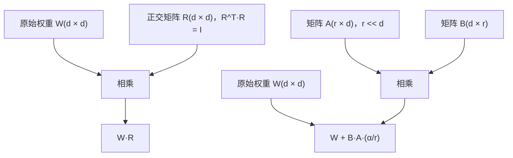
**主要区别：**

-   **LoRA**：加性低秩更新（参数较少）
-   **OFT**：乘性正交变换（保持范数）

**来源：** [src/llamafactory/hparams/finetuning_args.py125-165](https://github.com/hiyouga/LlamaFactory/blob/355d5c5e/src/llamafactory/hparams/finetuning_args.py#L125-L165) [src/llamafactory/model/adapter.py263-270](https://github.com/hiyouga/LlamaFactory/blob/355d5c5e/src/llamafactory/model/adapter.py#L263-L270)

### 配置示例

```python
FinetuningArguments(
    finetuning_type="oft",
    oft_rank=0,  # 无限制
    oft_block_size=32,
    module_dropout=0.0,
    oft_target="all"
)
```
**来源：** [src/llamafactory/hparams/finetuning_args.py125-165](https://github.com/hiyouga/LlamaFactory/blob/355d5c5e/src/llamafactory/hparams/finetuning_args.py#L125-L165)

---

## Freeze 微调配置

Freeze 微调仅训练特定层，同时保持其他层冻结，适用于特定层的自适应和 LLaMA-Pro 风格的扩展。

### Freeze 参数

`FreezeArguments` 数据类控制层选择：

| 参数 | 类型 | 默认值 | 描述 |
| --- | --- | --- | --- |
| `freeze_trainable_layers` | int | 2 | 需要训练的层数（正值 = 最后 n 层，负值 = 最前 n 层） |
| `freeze_trainable_modules` | str | "all" | 层内的模块类型（例如 "attn,mlp"） |
| `freeze_extra_modules` | str | None | 需要训练的其他顶层模块 |

**来源：** [src/llamafactory/hparams/finetuning_args.py20-53](https://github.com/hiyouga/LlamaFactory/blob/355d5c5e/src/llamafactory/hparams/finetuning_args.py#L20-L53)

### 层选择逻辑

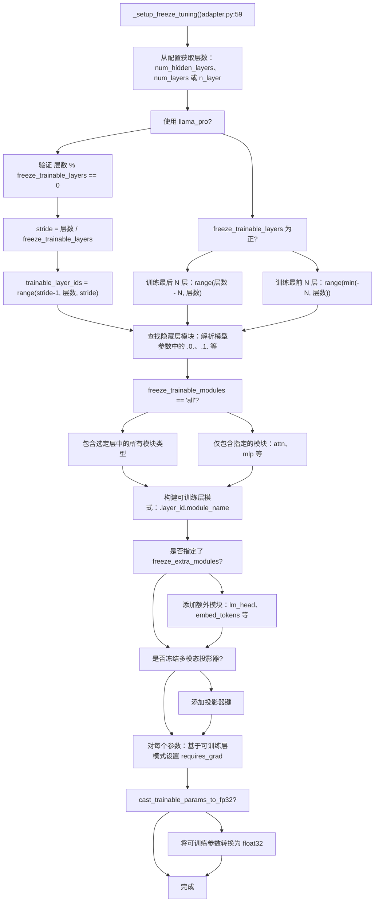
**层 ID 计算：**

-   **正值**：`freeze_trainable_layers=2` 训练最后 2 层
-   **负值**：`freeze_trainable_layers=-2` 训练最前 2 层
-   **LLaMA-Pro**：均匀分布训练（例如，对于 32 层模型，`freeze_trainable_layers=8` 会训练第 3, 7, 11, 15, 19, 23, 27, 31 层）

**来源：** [src/llamafactory/model/adapter.py59-141](https://github.com/hiyouga/LlamaFactory/blob/355d5c5e/src/llamafactory/model/adapter.py#L59-L141) [src/llamafactory/hparams/finetuning_args.py20-53](https://github.com/hiyouga/LlamaFactory/blob/355d5c5e/src/llamafactory/hparams/finetuning_args.py#L20-L53)

### 配置示例

```python
# 训练最后 2 层，所有模块
FinetuningArguments(
    finetuning_type="freeze",
    freeze_trainable_layers=2,
    freeze_trainable_modules="all"
)

# 训练最前 3 层，仅训练注意力层
FinetuningArguments(
    finetuning_type="freeze",
    freeze_trainable_layers=-3,
    freeze_trainable_modules="attn"
)

# LLaMA-Pro：均匀分布训练 8 层
FinetuningArguments(
    finetuning_type="freeze",
    freeze_trainable_layers=8,
    use_llama_pro=True
)
```
**来源：** [src/llamafactory/hparams/finetuning_args.py20-53](https://github.com/hiyouga/LlamaFactory/blob/355d5c5e/src/llamafactory/hparams/finetuning_args.py#L20-L53) [src/llamafactory/model/adapter.py82-95](https://github.com/hiyouga/LlamaFactory/blob/355d5c5e/src/llamafactory/model/adapter.py#L82-L95)

---

## 全参数微调配置

全参数微调训练模型的所有参数，但禁用模块（视觉塔、投影器，或在冻结情况下的语言模型）中的参数除外。

### 全参数微调逻辑

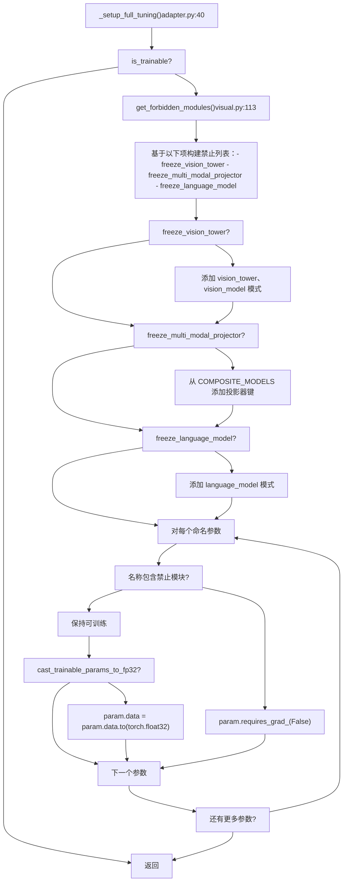
全参数微调是内存消耗最高的方法，但提供了最大的灵活性。它通常用于：

-   小型模型 (< 7B 参数)
-   需要大量更改的领域自适应
-   PEFT 方法表现不足的模型

**来源：** [src/llamafactory/model/adapter.py40-57](https://github.com/hiyouga/LlamaFactory/blob/355d5c5e/src/llamafactory/model/adapter.py#L40-L57) [src/llamafactory/model/model_utils/visual.py113-124](https://github.com/hiyouga/LlamaFactory/blob/355d5c5e/src/llamafactory/model/model_utils/visual.py#L113-L124)

---

## 量化与 QLoRA

QLoRA (量化 LoRA) 将 4-bit 或 8-bit 量化与 LoRA 训练相结合，使得在消费级硬件上微调大模型成为可能。

### 量化兼容性

| 微调方法 | 4-bit 量化 | 8-bit 量化 |
| --- | --- | --- |
| Full | ❌ 不支持 | ❌ 不支持 |
| Freeze | ❌ 不支持 | ❌ 不支持 |
| LoRA | ✅ 支持 (QLoRA) | ✅ 支持 (QLoRA) |
| OFT | ✅ 支持 | ✅ 支持 |

验证逻辑在适配器初始化时强制执行此项：

```python
if is_trainable and getattr(model, "quantization_method", None) is not None:
    if finetuning_args.finetuning_type not in ["lora", "oft"]:
        raise ValueError("Quantized models can only be used for the LoRA or OFT tuning.")
```
**来源：** [src/llamafactory/model/adapter.py334-336](https://github.com/hiyouga/LlamaFactory/blob/355d5c5e/src/llamafactory/model/adapter.py#L334-L336)

### QLoRA 配置流程

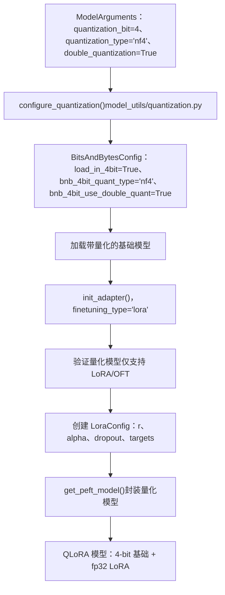
**关键点：**

1.  量化在模型加载期间通过 `configure_quantization()` 配置 [model_utils/quantization.py](https://github.com/hiyouga/LlamaFactory/blob/355d5c5e/model_utils/quantization.py)
2.  基础模型以 4-bit 或 8-bit 精度加载
3.  LoRA 适配器在量化基础之上以 `float32` 进行训练
4.  这在大幅减少内存使用的同时保持了训练质量

**来源：** [src/llamafactory/model/adapter.py334-340](https://github.com/hiyouga/LlamaFactory/blob/355d5c5e/src/llamafactory/model/adapter.py#L334-L340) [src/llamafactory/model/model_utils/quantization.py](https://github.com/hiyouga/LlamaFactory/blob/355d5c5e/src/llamafactory/model/model_utils/quantization.py)

### 内存对比

对于 7B 参数模型：

| 方法 | 基础模型内存 | 可训练参数 | 总内存 |
| --- | --- | --- | --- |
| 全量 FP16 | ~14 GB | 7B | ~14 GB |
| LoRA FP16 | ~14 GB | ~10M | ~14 GB |
| QLoRA 4-bit | ~3.5 GB | ~10M | ~4 GB |

**来源：** [src/llamafactory/model/adapter.py334-367](https://github.com/hiyouga/LlamaFactory/blob/355d5c5e/src/llamafactory/model/adapter.py#L334-L367)

---

## 适配器加载与合并

该系统支持加载多个预训练适配器，将它们合并到基础模型中，并可选地从检查点恢复训练。

### 适配器加载策略

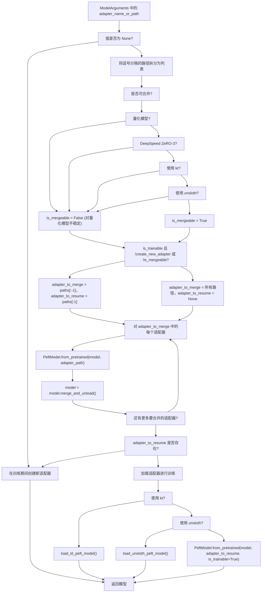
**合并行为：**

-   **多个适配器**：路径 `"adapter1,adapter2,adapter3"` → 合并 `adapter1` 和 `adapter2`，从 `adapter3` 恢复
-   **单个适配器 (训练)**：路径 `"adapter1"` → 从 `adapter1` 恢复
-   **单个适配器 (推理)**：路径 `"adapter1"` → 将 `adapter1` 合并到基础模型
-   **量化模型**：无法合并（不稳定），始终从最后一个适配器恢复

**来源：** [src/llamafactory/model/adapter.py159-212](https://github.com/hiyouga/LlamaFactory/blob/355d5c5e/src/llamafactory/model/adapter.py#L159-L212) [src/llamafactory/hparams/model_args.py43-50](https://github.com/hiyouga/LlamaFactory/blob/355d5c5e/src/llamafactory/hparams/model_args.py#L43-L50)

### 配置示例

```python
# 合并两个适配器，训练第三个
ModelArguments(
    model_name_or_path="meta-llama/Llama-2-7b-hf",
    adapter_name_or_path="adapter_task1,adapter_task2,adapter_task3"
)
# 结果：adapter_task1 + adapter_task2 已合并，adapter_task3 已恢复用于训练

# 使用合并后的适配器进行推理
ModelArguments(
    model_name_or_path="meta-llama/Llama-2-7b-hf",
    adapter_name_or_path="my_adapter"
)
# 结果：my_adapter 合并到基础模型中进行推理

# 带有现有适配器的 QLoRA
ModelArguments(
    model_name_or_path="meta-llama/Llama-2-7b-hf",
    quantization_bit=4,
    adapter_name_or_path="my_adapter"
)
# 结果：4-bit 基础模型 + my_adapter 已恢复（量化模型跳过合并）
```
**来源：** [src/llamafactory/model/adapter.py159-212](https://github.com/hiyouga/LlamaFactory/blob/355d5c5e/src/llamafactory/model/adapter.py#L159-L212)

---

## PiSSA 初始化

PiSSA (主奇异值与奇异向量自适应) 使用来自 SVD 的主成分初始化 LoRA 矩阵，比随机初始化具有更好的收敛性。

### PiSSA 算法

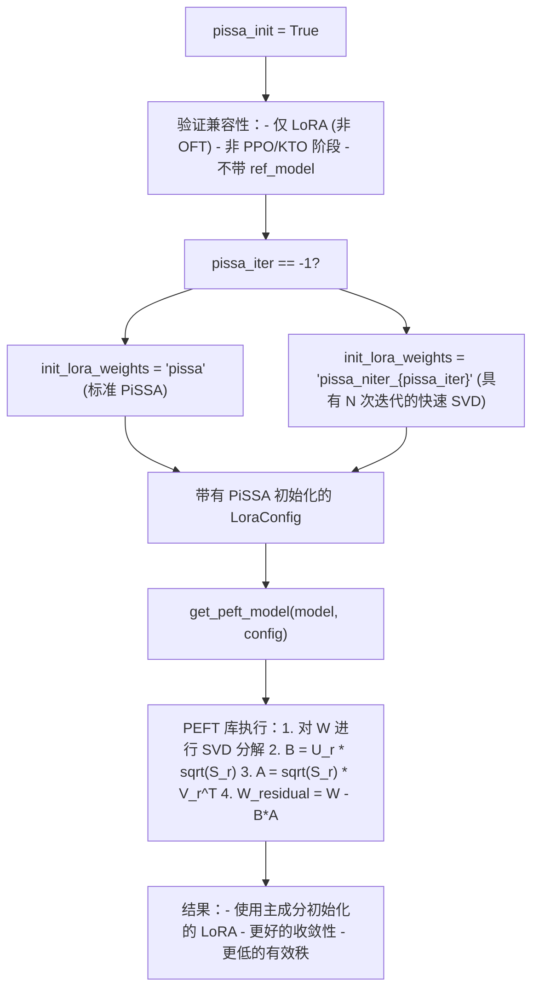
**数学公式：**

给定权重矩阵 W，PiSSA 计算：

1.  SVD：W = U·Σ·V^T
2.  提取前 r 个奇异值/向量
3.  初始化：B = U_r·√Σ_r, A = √Σ_r·V_r^T
4.  残差：W' = W - B·A

这确保了适配器从一个有意义的子空间开始，而不是随机噪声。

**配置：**

```python
# 标准 PiSSA
FinetuningArguments(
    finetuning_type="lora",
    pissa_init=True,
    pissa_iter=-1,  # 禁用 FSVD，使用标准 SVD
    lora_rank=8
)

# 具有 16 次迭代的快速 SVD PiSSA
FinetuningArguments(
    finetuning_type="lora",
    pissa_init=True,
    pissa_iter=16,  # 使用具有 16 次迭代的 FSVD
    lora_rank=8
)
```
**限制：**

-   不能用于量化模型 [adapter.py338-339](https://github.com/hiyouga/LlamaFactory/blob/355d5c5e/adapter.py#L338-L339)
-   不能用于 PPO、KTO 或带有参考模型的阶段 [finetuning_args.py567-568](https://github.com/hiyouga/LlamaFactory/blob/355d5c5e/finetuning_args.py#L567-L568)

**来源：** [src/llamafactory/model/adapter.py292-298](https://github.com/hiyouga/LlamaFactory/blob/355d5c5e/src/llamafactory/model/adapter.py#L292-L298) [src/llamafactory/hparams/finetuning_args.py107-119](https://github.com/hiyouga/LlamaFactory/blob/355d5c5e/src/llamafactory/hparams/finetuning_args.py#L107-L119) [src/llamafactory/hparams/finetuning_args.py567-568](https://github.com/hiyouga/LlamaFactory/blob/355d5c5e/src/llamafactory/hparams/finetuning_args.py#L567-L568)

---

## 特殊集成特性

### Unsloth 集成

Unsloth 是一个第三方库，通过融合内核和内存优化来加速 LoRA 训练。

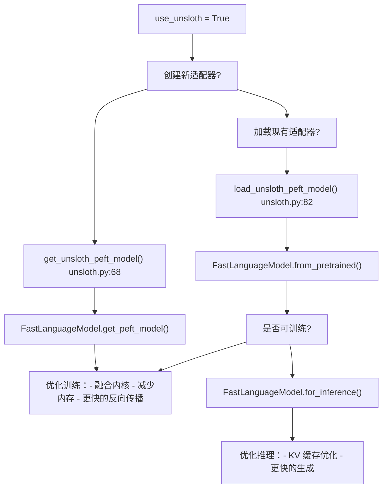
**局限性：**

-   仅支持 LoRA（不支持 OFT） [adapter.py287-288](https://github.com/hiyouga/LlamaFactory/blob/355d5c5e/adapter.py#L287-L288)
-   不能合并多个适配器 [adapter.py174-175](https://github.com/hiyouga/LlamaFactory/blob/355d5c5e/adapter.py#L174-L175)
-   仅允许加载单个适配器 [adapter.py174](https://github.com/hiyouga/LlamaFactory/blob/355d5c5e/adapter.py#L174-L174)

**来源：** [src/llamafactory/model/adapter.py286-290](https://github.com/hiyouga/LlamaFactory/blob/355d5c5e/src/llamafactory/model/adapter.py#L286-L290) [src/llamafactory/model/model_utils/unsloth.py51-103](https://github.com/hiyouga/LlamaFactory/blob/355d5c5e/src/llamafactory/model/model_utils/unsloth.py#L51-L103)

### KTransformers 集成

KTransformers 通过优化的内核调度实现了 CPU-GPU 混合推理。

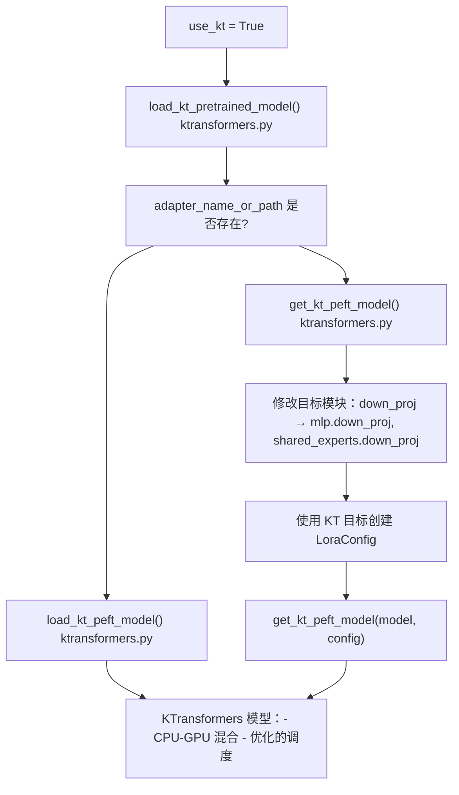
**特殊目标处理：**

对于 MoE 模型，KTransformers 需要显式的前缀：

-   `down_proj` → `mlp.down_proj`, `shared_experts.down_proj`
-   `up_proj` → `mlp.up_proj`, `shared_experts.up_proj`
-   `gate_proj` → `mlp.gate_proj`, `shared_experts.gate_proj`

**来源：** [src/llamafactory/model/adapter.py220-228](https://github.com/hiyouga/LlamaFactory/blob/355d5c5e/src/llamafactory/model/adapter.py#L220-L228) [src/llamafactory/model/model_utils/ktransformers.py](https://github.com/hiyouga/LlamaFactory/blob/355d5c5e/src/llamafactory/model/model_utils/ktransformers.py)

---

## 与训练系统的集成

所有训练器类都通过模型加载流水线与适配器系统集成。

### 训练器集成点

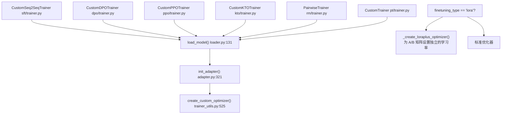
### LoRA+ 优化器

使用 LoRA 时，训练系统可以应用 LoRA+，它为矩阵 A 和 B 分配不同的学习率：

```python
# LoRA+ 配置
FinetuningArguments(
    finetuning_type="lora",
    loraplus_lr_ratio=16.0,  # lr_B = 16 * lr_A
    loraplus_lr_embedding=1e-6  # 嵌入层的独立学习率
)
```
优化器将参数分组为：

-   **lora_a**：基础学习率（例如 3e-4）
-   **lora_b**：缩放后的学习率（例如 16 * 3e-4 = 4.8e-3）
-   **lora_b_nodecay**：不带权重衰减的缩放学习率
-   **embedding**：固定学习率 (1e-6)

**来源：** [src/llamafactory/train/trainer_utils.py370-407](https://github.com/hiyouga/LlamaFactory/blob/355d5c5e/src/llamafactory/train/trainer_utils.py#L370-L407)

### 验证与约束

`FinetuningArguments.__post_init__()` 方法强制执行关键约束：

```python
# 不能将 LoRA 与 GaLore/APOLLO/BAdam 同时使用
if self.finetuning_type == "lora" and (self.use_galore or self.use_apollo or self.use_badam):
    raise ValueError("Cannot use LoRA with GaLore, APOLLO or BAdam together.")

# 量化仅适用于 LoRA/OFT
if self.quantization_bit is not None and self.finetuning_type not in ["lora", "oft"]:
    raise ValueError("Quantized models can only be used for LoRA or OFT tuning.")

# PiSSA 限制
if self.pissa_init and (self.stage in ["ppo", "kto"] or self.use_ref_model):
    raise ValueError("Cannot use PiSSA for current training stage.")
```
**来源：** [src/llamafactory/hparams/finetuning_args.py561-568](https://github.com/hiyouga/LlamaFactory/blob/355d5c5e/src/llamafactory/hparams/finetuning_args.py#L561-L568) [src/llamafactory/model/adapter.py334-339](https://github.com/hiyouga/LlamaFactory/blob/355d5c5e/src/llamafactory/model/adapter.py#L334-L339)

---

## 配置参考

### 完整示例：具有多种特性的 QLoRA

```python
from llamafactory.hparams import ModelArguments, FinetuningArguments

# 带有量化的模型配置
model_args = ModelArguments(
    model_name_or_path="meta-llama/Llama-2-7b-hf",
    quantization_bit=4,
    quantization_type="nf4",
    double_quantization=True,
    adapter_name_or_path="base_adapter,task_adapter",  # 合并基础适配器，训练任务适配器
    cache_dir="./cache"
)

# 微调配置
finetuning_args = FinetuningArguments(
    # 适配器类型
    finetuning_type="lora",
    
    # LoRA 参数
    lora_rank=16,
    lora_alpha=32,
    lora_dropout=0.05,
    lora_target="q_proj,v_proj,k_proj,o_proj,gate_proj,up_proj,down_proj",
    additional_target="embed_tokens,lm_head",
    
    # 高级特性
    use_rslora=False,
    use_dora=False,
    pissa_init=False,
    
    # 训练阶段
    stage="sft",
    
    # 优化
    loraplus_lr_ratio=16.0,
    loraplus_lr_embedding=1e-6,
    
    # 多模态设置
    freeze_vision_tower=True,
    freeze_multi_modal_projector=True,
)
```
### 验证检查表

| 配置 | 有效 | 无效组合 |
| --- | --- | --- |
| QLoRA + LoRA | ✅ | ❌ QLoRA + Full/Freeze |
| QLoRA + OFT | ✅ | ❌ QLoRA + Full/Freeze |
| LoRA + GaLore | ❌ | 二选一 |
| LoRA + BAdam | ❌ | 二选一 |
| PiSSA + PPO | ❌ | PiSSA 仅适用于 PT/SFT/RM/DPO |
| DoRA + 量化 | ❌ | DoRA 需要 BitsAndBytes 量化 |
| 多个适配器 + 量化 | ✅ | 但跳过合并（从最后一个恢复） |
| Unsloth + 多个适配器 | ❌ | Unsloth 仅支持单个适配器 |
| Unsloth + OFT | ❌ | Unsloth 仅支持 LoRA |

**来源：** [src/llamafactory/hparams/finetuning_args.py526-582](https://github.com/hiyouga/LlamaFactory/blob/355d5c5e/src/llamafactory/hparams/finetuning_args.py#L526-L582) [src/llamafactory/model/adapter.py159-367](https://github.com/hiyouga/LlamaFactory/blob/355d5c5e/src/llamafactory/model/adapter.py#L159-L367)

---

## 文件参考

### 核心适配器文件

-   **[src/llamafactory/model/adapter.py](https://github.com/hiyouga/LlamaFactory/blob/355d5c5e/src/llamafactory/model/adapter.py)**：主要适配器初始化逻辑 (`init_adapter`、`_setup_lora_tuning`、`_setup_freeze_tuning`、`_setup_full_tuning`)
-   **[src/llamafactory/hparams/finetuning_args.py](https://github.com/hiyouga/LlamaFactory/blob/355d5c5e/src/llamafactory/hparams/finetuning_args.py)**：适配器配置数据类 (`LoraArguments`、`OFTArguments`、`FreezeArguments`)
-   **[src/llamafactory/hparams/model_args.py](https://github.com/hiyouga/LlamaFactory/blob/355d5c5e/src/llamafactory/hparams/model_args.py)**：包含适配器路径在内的模型加载参数

### 集成文件

-   **[src/llamafactory/model/loader.py190](https://github.com/hiyouga/LlamaFactory/blob/355d5c5e/src/llamafactory/model/loader.py#L190-L190)**：模型加载期间调用 `init_adapter()`
-   **[src/llamafactory/model/patcher.py](https://github.com/hiyouga/LlamaFactory/blob/355d5c5e/src/llamafactory/model/patcher.py)**：适配器初始化前的模型修补
-   **[src/llamafactory/train/trainer_utils.py370-407](https://github.com/hiyouga/LlamaFactory/blob/355d5c5e/src/llamafactory/train/trainer_utils.py#L370-L407)**：LoRA+ 优化器创建
-   **[src/llamafactory/train/trainer_utils.py525-547](https://github.com/hiyouga/LlamaFactory/blob/355d5c5e/src/llamafactory/train/trainer_utils.py#L525-L547)**：自定义优化器工厂

### 实用程序文件

-   **[src/llamafactory/model/model_utils/misc.py](https://github.com/hiyouga/LlamaFactory/blob/355d5c5e/src/llamafactory/model/model_utils/misc.py)**：`find_all_linear_modules()`、`find_expanded_modules()`
-   **[src/llamafactory/model/model_utils/visual.py113-124](https://github.com/hiyouga/LlamaFactory/blob/355d5c5e/src/llamafactory/model/model_utils/visual.py#L113-L124)**：`get_forbidden_modules()`、`patch_target_modules()`
-   **[src/llamafactory/model/model_utils/unsloth.py](https://github.com/hiyouga/LlamaFactory/blob/355d5c5e/src/llamafactory/model/model_utils/unsloth.py)**：Unsloth 特有的适配器处理
-   **[src/llamafactory/model/model_utils/ktransformers.py](https://github.com/hiyouga/LlamaFactory/blob/355d5c5e/src/llamafactory/model/model_utils/ktransformers.py)**：KTransformers 集成
-   **[src/llamafactory/model/model_utils/quantization.py](https://github.com/hiyouga/LlamaFactory/blob/355d5c5e/src/llamafactory/model/model_utils/quantization.py)**：QLoRA 的量化配置
