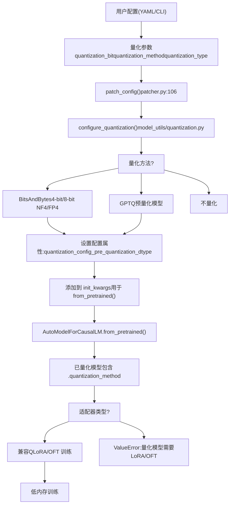
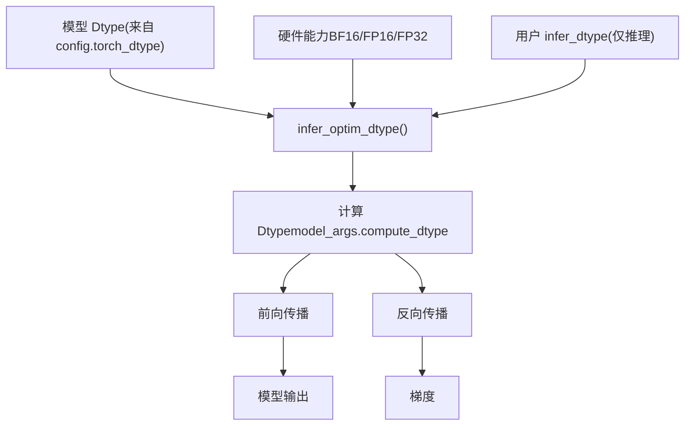
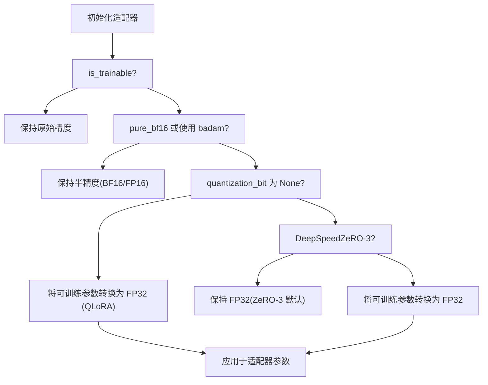

# 量化与精度

相关源文件

-   [src/llamafactory/\_\_init\_\_.py](https://github.com/hiyouga/LlamaFactory/blob/355d5c5e/src/llamafactory/__init__.py)
-   [src/llamafactory/extras/misc.py](https://github.com/hiyouga/LlamaFactory/blob/355d5c5e/src/llamafactory/extras/misc.py)
-   [src/llamafactory/hparams/model_args.py](https://github.com/hiyouga/LlamaFactory/blob/355d5c5e/src/llamafactory/hparams/model_args.py)
-   [src/llamafactory/model/adapter.py](https://github.com/hiyouga/LlamaFactory/blob/355d5c5e/src/llamafactory/model/adapter.py)
-   [src/llamafactory/model/loader.py](https://github.com/hiyouga/LlamaFactory/blob/355d5c5e/src/llamafactory/model/loader.py)
-   [src/llamafactory/model/model_utils/longlora.py](https://github.com/hiyouga/LlamaFactory/blob/355d5c5e/src/llamafactory/model/model_utils/longlora.py)
-   [src/llamafactory/model/model_utils/packing.py](https://github.com/hiyouga/LlamaFactory/blob/355d5c5e/src/llamafactory/model/model_utils/packing.py)
-   [src/llamafactory/model/model_utils/unsloth.py](https://github.com/hiyouga/LlamaFactory/blob/355d5c5e/src/llamafactory/model/model_utils/unsloth.py)
-   [src/llamafactory/model/patcher.py](https://github.com/hiyouga/LlamaFactory/blob/355d5c5e/src/llamafactory/model/patcher.py)

## 目的与范围

本页文档介绍了 LlamaFactory 的量化和精度系统，该系统通过减少内存占用实现高效的模型加载和训练。内容涵盖：

-   量化方法（4-bit, 8-bit）及其配置
-   训练和推理的精度模式（FP16, BF16, FP32）
-   自动数据类型（dtype）选择与硬件兼容性
-   量化与微调方法之间的兼容性约束

有关与量化模型配合使用的适配器系统信息，请参阅[适配器系统](/hiyouga/LlamaFactory/5.2-adapter-system-(loraqloraoft))。有关注意力机制优化的信息，请参阅[注意力机制与优化](/hiyouga/LlamaFactory/5.4-attention-mechanisms-and-optimizations)。

---

## 概述

LlamaFactory 支持两种主要的量化方式：

1.  **即时量化 (On-the-fly quantization)**：在模型加载期间使用 BitsAndBytes 或 GPTQ 进行量化
2.  **训练后量化 (Post-training quantization)**：用于模型导出

量化通过以较低精度格式（4-bit 或 8-bit，而非 16-bit 或 32-bit）表示权重来减少模型内存使用。这使得在消费级硬件上训练和推理大型语言模型成为可能。

系统根据硬件能力和用户配置自动选择合适的计算精度，以平衡性能与数值稳定性。

**来源：** [src/llamafactory/hparams/model_args.py278-301](https://github.com/hiyouga/LlamaFactory/blob/355d5c5e/src/llamafactory/hparams/model_args.py#L278-L301) [src/llamafactory/extras/misc.py214-222](https://github.com/hiyouga/LlamaFactory/blob/355d5c5e/src/llamafactory/extras/misc.py#L214-L222)

---

## 量化配置流程

下图展示了量化设置如何在模型加载流水线中传递：


**来源：** [src/llamafactory/model/patcher.py106-127](https://github.com/hiyouga/LlamaFactory/blob/355d5c5e/src/llamafactory/model/patcher.py#L106-L127) [src/llamafactory/model/adapter.py334-340](https://github.com/hiyouga/LlamaFactory/blob/355d5c5e/src/llamafactory/model/adapter.py#L334-L340) [src/llamafactory/model/loader.py131-142](https://github.com/hiyouga/LlamaFactory/blob/355d5c5e/src/llamafactory/model/loader.py#L131-L142)

---

## 量化方法

### BitsAndBytes (BNB)

BitsAndBytes 是默认且最常用的量化方法，在模型加载时提供动态量化。

**核心特性：**

-   **4-bit 量化**：与 FP16 相比，减少约 75% 的内存占用
-   **8-bit 量化**：减少约 50% 的内存占用，且具有更好的精度
-   **NF4 与 FP4 数据类型**：NormalFloat4（默认）或 Float4
-   **双重量化 (Double quantization)**：进一步压缩量化常数

**配置：**

| 参数 | 类型 | 默认值 | 描述 |
| --- | --- | --- | --- |
| `quantization_method` | `QuantizationMethod` | `BNB` | 量化后端 |
| `quantization_bit` | `int` | `None` | 量化位数（4 或 8） |
| `quantization_type` | `str` | `"nf4"` | `"nf4"` 或 `"fp4"` |
| `double_quantization` | `bool` | `True` | 是否对量化常数进行量化 |
| `quantization_device_map` | `str` | `None` | 4-bit 模型的设备映射 |

**配置示例 (YAML)：**

```
model_name_or_path: meta-llama/Llama-2-7b-hfquantization_bit: 4quantization_type: nf4double_quantization: true
```
**来源：** [src/llamafactory/hparams/model_args.py278-301](https://github.com/hiyouga/LlamaFactory/blob/355d5c5e/src/llamafactory/hparams/model_args.py#L278-L301)

---

### GPTQ

GPTQ 是一种用于预量化模型的训练后量化方法。与 BNB 不同，GPTQ 量化是在模型准备阶段完成的，而不是在加载期间。

**用法：**

-   从 Hugging Face Hub 加载预量化的 GPTQ 模型
-   通常用于推理而非训练
-   需要使用 GPTQ 预先量化好的模型

**来源：** [src/llamafactory/hparams/model_args.py281-283](https://github.com/hiyouga/LlamaFactory/blob/355d5c5e/src/llamafactory/hparams/model_args.py#L281-L283)

---

### 内存与性能影响

下表显示了 7B 参数模型的近似内存节省情况：

| 精度 | 内存使用 | 相对 FP16 | 训练速度 |
| --- | --- | --- | --- |
| FP32 | ~28 GB | 2× | 最慢 |
| FP16/BF16 | ~14 GB | 1× (基准) | 快 |
| 8-bit | ~7 GB | 0.5× | 中等 |
| 4-bit NF4 | ~3.5 GB | 0.25× | 中等 |

**注意：** 训练速度取决于硬件对量化操作的加速支持。

**来源：** [src/llamafactory/extras/misc.py117-141](https://github.com/hiyouga/LlamaFactory/blob/355d5c5e/src/llamafactory/extras/misc.py#L117-L141)

---

## 精度模式

### 数据类型选择

LlamaFactory 区分了三个精度概念：

1.  **模型 dtype**：存储模型权重的精度
2.  **计算 dtype**：前向/反向传播过程中使用的精度
3.  **推理 dtype**：仅用于推理操作的精度


**来源：** [src/llamafactory/model/patcher.py113-118](https://github.com/hiyouga/LlamaFactory/blob/355d5c5e/src/llamafactory/model/patcher.py#L113-L118) [src/llamafactory/extras/misc.py214-222](https://github.com/hiyouga/LlamaFactory/blob/355d5c5e/src/llamafactory/extras/misc.py#L214-L222)

---

### 自动数据类型推理

`infer_optim_dtype()` 函数根据硬件自动选择最佳精度：

**选择优先级：**

1.  **BFloat16**，如果：
    -   硬件支持 BF16（现代 NVIDIA GPU, NPU）
    -   模型已处于 BF16 或未指定 dtype
2.  **Float16**，如果：
    -   硬件支持 FP16（CUDA, NPU）
    -   BF16 不可用
3.  **Float32** 作为回退方案

**实现：**

[src/llamafactory/extras/misc.py214-222](https://github.com/hiyouga/LlamaFactory/blob/355d5c5e/src/llamafactory/extras/misc.py#L214-L222)

```
def infer_optim_dtype(model_dtype: Optional["torch.dtype"]) -> "torch.dtype":    r"""Infer the optimal dtype according to the model_dtype and device compatibility."""    if _is_bf16_available and (model_dtype == torch.bfloat16 or model_dtype is None):        return torch.bfloat16    elif _is_fp16_available:        return torch.float16    else:        return torch.float32
```
**硬件检测：**

[src/llamafactory/extras/misc.py41-45](https://github.com/hiyouga/LlamaFactory/blob/355d5c5e/src/llamafactory/extras/misc.py#L41-L45)

```
_is_fp16_available = is_torch_npu_available() or is_torch_cuda_available()try:    _is_bf16_available = is_torch_bf16_gpu_available() or (is_torch_npu_available() and torch.npu.is_bf16_supported())except Exception:    _is_bf16_available = False
```
**来源：** [src/llamafactory/extras/misc.py41-45](https://github.com/hiyouga/LlamaFactory/blob/355d5c5e/src/llamafactory/extras/misc.py#L41-L45) [src/llamafactory/extras/misc.py214-222](https://github.com/hiyouga/LlamaFactory/blob/355d5c5e/src/llamafactory/extras/misc.py#L214-L222)

---

### 推理精度配置

对于仅推理场景，用户可以覆盖自动选择：

| `infer_dtype` 值 | 行为 |
| --- | --- |
| `"auto"` (默认) | 使用 `infer_optim_dtype()` 逻辑 |
| `"float16"` | 强制使用 FP16 精度 |
| `"bfloat16"` | 强制使用 BF16 精度 |
| `"float32"` | 强制使用 FP32 精度 |

**配置位置：**

[src/llamafactory/model/patcher.py113-118](https://github.com/hiyouga/LlamaFactory/blob/355d5c5e/src/llamafactory/model/patcher.py#L113-L118)

```
if model_args.compute_dtype is None:  # priority: bf16 > fp16 > fp32    if model_args.infer_dtype != "auto" and not is_trainable:        model_args.compute_dtype = getattr(torch, model_args.infer_dtype)    else:        model_args.compute_dtype = infer_optim_dtype(model_dtype=getattr(config, "torch_dtype", None))
```
**来源：** [src/llamafactory/hparams/model_args.py180-183](https://github.com/hiyouga/LlamaFactory/blob/355d5c5e/src/llamafactory/hparams/model_args.py#L180-L183) [src/llamafactory/model/patcher.py113-118](https://github.com/hiyouga/LlamaFactory/blob/355d5c5e/src/llamafactory/model/patcher.py#L113-L118)

---

## 兼容性约束

### 量化与微调方法

量化模型对微调方法有严格的兼容性要求：

**兼容性矩阵：**

| 微调方法 | 4-bit 量化 | 8-bit 量化 | 备注 |
| --- | --- | --- | --- |
| LoRA | ✅ 是 (QLoRA) | ✅ 是 | 量化模型推荐使用 |
| OFT | ✅ 是 | ✅ 是 | 支持 |
| 冻结微调 (Freeze Tuning) | ❌ 否 | ❌ 否 | 需要全精度 |
| 全参数微调 (Full Fine-Tuning) | ❌ 否 | ❌ 否 | 需要全精度 |

**验证逻辑：**

[src/llamafactory/model/adapter.py334-340](https://github.com/hiyouga/LlamaFactory/blob/355d5c5e/src/llamafactory/model/adapter.py#L334-L340)

```
if is_trainable and getattr(model, "quantization_method", None) is not None:    if finetuning_args.finetuning_type not in ["lora", "oft"]:        raise ValueError("Quantized models can only be used for the LoRA or OFT tuning.")     if finetuning_args.pissa_init:        raise ValueError("Cannot initialize PiSSA adapter on quantized models.")
```
**来源：** [src/llamafactory/model/adapter.py334-340](https://github.com/hiyouga/LlamaFactory/blob/355d5c5e/src/llamafactory/model/adapter.py#L334-L340)

---

### DoRA 兼容性

DoRA（权重分解低秩自适应）具有额外的约束：

[src/llamafactory/model/adapter.py235-240](https://github.com/hiyouga/LlamaFactory/blob/355d5c5e/src/llamafactory/model/adapter.py#L235-L240)

```
if (    finetuning_args.use_dora    and getattr(model, "quantization_method", None) is not None    and getattr(model, "quantization_method", None) != QuantizationMethod.BNB):    raise ValueError("DoRA is not compatible with PTQ-quantized models.")
```
**兼容性：**

-   ✅ DoRA + BitsAndBytes 量化
-   ❌ DoRA + GPTQ 或其他 PTQ 方法

**来源：** [src/llamafactory/model/adapter.py235-240](https://github.com/hiyouga/LlamaFactory/blob/355d5c5e/src/llamafactory/model/adapter.py#L235-L240)

---

### 多适配器约束

使用多个适配器时，量化模型存在限制：

[src/llamafactory/model/adapter.py161-167](https://github.com/hiyouga/LlamaFactory/blob/355d5c5e/src/llamafactory/model/adapter.py#L161-L167)

```
if model_args.adapter_name_or_path is not None:    is_mergeable = True    if getattr(model, "quantization_method", None):  # merge lora in quantized model is unstable        assert len(model_args.adapter_name_or_path) == 1, "Quantized model only accepts a single adapter."        is_mergeable = False     if is_deepspeed_zero3_enabled():        assert len(model_args.adapter_name_or_path) == 1, "Cannot use multiple adapters in DeepSpeed ZeRO-3."        is_mergeable = False
```
**限制：**

-   量化模型仅能加载**一个适配器**
-   量化模型的适配器合并已**禁用**（不稳定）
-   DeepSpeed ZeRO-3 同样限制为单个适配器

**来源：** [src/llamafactory/model/adapter.py161-172](https://github.com/hiyouga/LlamaFactory/blob/355d5c5e/src/llamafactory/model/adapter.py#L161-L172)

---

## 特殊精度处理

### 量化参数计数

系统在计算参数时会考虑量化因素：

[src/llamafactory/extras/misc.py126-136](https://github.com/hiyouga/LlamaFactory/blob/355d5c5e/src/llamafactory/extras/misc.py#L126-L136)

```
# Due to the design of 4bit linear layers from bitsandbytes, multiply the number of parameters by itemsizeif param.__class__.__name__ == "Params4bit":    if hasattr(param, "quant_storage") and hasattr(param.quant_storage, "itemsize"):        num_bytes = param.quant_storage.itemsize    elif hasattr(param, "element_size"):  # for older pytorch version        num_bytes = param.element_size()    else:        num_bytes = 1     num_params = num_params * 2 * num_bytes
```
**目的：** 准确报告 4-bit 量化参数的内存占用。

**来源：** [src/llamafactory/extras/misc.py117-141](https://github.com/hiyouga/LlamaFactory/blob/355d5c5e/src/llamafactory/extras/misc.py#L117-L141)

---

### 可训练参数类型转换

在训练设置期间，系统可能会将可训练参数上调（upcast）至 FP32，以保证数值稳定性：


**逻辑：**

[src/llamafactory/model/adapter.py341-353](https://github.com/hiyouga/LlamaFactory/blob/355d5c5e/src/llamafactory/model/adapter.py#L341-L353)

```
cast_trainable_params_to_fp32 = Falseif not is_trainable:    passelif finetuning_args.pure_bf16 or finetuning_args.use_badam:    logger.info_rank0("Pure bf16 / BAdam detected, remaining trainable params in half precision.")elif model_args.quantization_bit is None and is_deepspeed_zero3_enabled():    logger.info_rank0("DeepSpeed ZeRO3 detected, remaining trainable params in float32.")else:    logger.info_rank0("Upcasting trainable params to float32.")    cast_trainable_params_to_fp32 = True
```
**原理：** FP32 可训练参数可防止反向传播期间的梯度下溢，这对于冻结权重为 4-bit 的 QLoRA 尤为重要。

**来源：** [src/llamafactory/model/adapter.py341-353](https://github.com/hiyouga/LlamaFactory/blob/355d5c5e/src/llamafactory/model/adapter.py#L341-L353) [src/llamafactory/model/adapter.py314-316](https://github.com/hiyouga/LlamaFactory/blob/355d5c5e/src/llamafactory/model/adapter.py#L314-L316)

---

## 实现参考

### 核心代码实体

| 组件 | 位置 | 目的 |
| --- | --- | --- |
| `QuantizationArguments` | [model_args.py278-301](https://github.com/hiyouga/LlamaFactory/blob/355d5c5e/model_args.py#L278-L301) | 量化配置的数据类 |
| `infer_optim_dtype()` | [misc.py214-222](https://github.com/hiyouga/LlamaFactory/blob/355d5c5e/misc.py#L214-L222) | 自动精度选择 |
| `configure_quantization()` | [patcher.py122](https://github.com/hiyouga/LlamaFactory/blob/355d5c5e/patcher.py#L122-L122) | 将量化应用于模型配置 |
| `patch_config()` | [patcher.py106-127](https://github.com/hiyouga/LlamaFactory/blob/355d5c5e/patcher.py#L106-L127) | 编排所有模型补丁 (patching) |
| `count_parameters()` | [misc.py117-141](https://github.com/hiyouga/LlamaFactory/blob/355d5c5e/misc.py#L117-L141) | 计入已量化参数的大小 |
| 适配器验证 | [adapter.py334-340](https://github.com/hiyouga/LlamaFactory/blob/355d5c5e/adapter.py#L334-L340) | 强制执行兼容性约束 |

**来源：** [src/llamafactory/hparams/model_args.py278-301](https://github.com/hiyouga/LlamaFactory/blob/355d5c5e/src/llamafactory/hparams/model_args.py#L278-L301) [src/llamafactory/extras/misc.py214-222](https://github.com/hiyouga/LlamaFactory/blob/355d5c5e/src/llamafactory/extras/misc.py#L214-L222) [src/llamafactory/model/patcher.py106-127](https://github.com/hiyouga/LlamaFactory/blob/355d5c5e/src/llamafactory/model/patcher.py#L106-L127) [src/llamafactory/model/adapter.py334-340](https://github.com/hiyouga/LlamaFactory/blob/355d5c5e/src/llamafactory/model/adapter.py#L334-L340)

---

## 配置示例

### QLoRA 训练 (4-bit)

**YAML 配置：**

```
model_name_or_path: meta-llama/Llama-2-7b-hfquantization_bit: 4quantization_type: nf4double_quantization: true # 量化模型必须使用 LoRA 或 OFTfinetuning_type: loralora_rank: 8lora_target: all
```
**CLI 等效命令：**

```
llamafactory-cli train \  --model_name_or_path meta-llama/Llama-2-7b-hf \  --quantization_bit 4 \  --quantization_type nf4 \  --double_quantization \  --finetuning_type lora \  --lora_rank 8 \  --lora_target all
```
**来源：** [src/llamafactory/hparams/model_args.py278-301](https://github.com/hiyouga/LlamaFactory/blob/355d5c5e/src/llamafactory/hparams/model_args.py#L278-L301)

---

### 8-bit 训练

**YAML 配置：**

```
model_name_or_path: meta-llama/Llama-2-13b-hfquantization_bit: 8 finetuning_type: loralora_rank: 16
```
**注意：** 8-bit 量化提供比 4-bit 更好的精度，但内存占用约为 4-bit 的 2 倍。

---

### 推理使用自定义精度

**YAML 配置：**

```
model_name_or_path: meta-llama/Llama-2-7b-hfadapter_name_or_path: path/to/lora/adapterinfer_dtype: bfloat16
```
**注意：** `infer_dtype` 仅适用于推理（非训练模式）。在训练期间，精度由硬件能力 and 训练配置决定。

**来源：** [src/llamafactory/hparams/model_args.py180-183](https://github.com/hiyouga/LlamaFactory/blob/355d5c5e/src/llamafactory/hparams/model_args.py#L180-L183)

---

## 最佳实践

### 内存高效训练

1.  **对于 >7B 参数的模型**：在消费级 GPU 上使用 4-bit 量化
2.  **启用双重量化**：每 7B 参数可额外节省 0.4GB 内存
3.  **使用 NF4 (NormalFloat4)**：质量优于 FP4
4.  **配合梯度检查点 (Gradient Checkpointing)**：进一步降低内存占用

### 精度选择

1.  **优先使用 BFloat16**（如果可用）：
    -   数值稳定性优于 FP16
    -   无需损失缩放 (Loss scaling)
    -   支持 A100, H100, NPU
2.  **调试时使用 FP32**：以排除精度相关的故障
3.  **避免手动混合精度**：让系统自动选择工作精度

### 兼容性

1.  **量化模型务必配合 LoRA 或 OFT** 使用
2.  **量化模型避免使用 PiSSA 初始化**
3.  **量化模型仅加载一个适配器**
4.  **不要将适配器合并到量化基模型中**

**来源：** [src/llamafactory/model/adapter.py334-340](https://github.com/hiyouga/LlamaFactory/blob/355d5c5e/src/llamafactory/model/adapter.py#L334-L340) [src/llamafactory/extras/misc.py214-222](https://github.com/hiyouga/LlamaFactory/blob/355d5c5e/src/llamafactory/extras/misc.py#L214-L222)
