# 模型补丁与特殊配置

相关源文件

-   [src/llamafactory/extras/env.py](https://github.com/hiyouga/LlamaFactory/blob/355d5c5e/src/llamafactory/extras/env.py)
-   [src/llamafactory/extras/packages.py](https://github.com/hiyouga/LlamaFactory/blob/355d5c5e/src/llamafactory/extras/packages.py)
-   [src/llamafactory/hparams/model_args.py](https://github.com/hiyouga/LlamaFactory/blob/355d5c5e/src/llamafactory/hparams/model_args.py)
-   [src/llamafactory/model/adapter.py](https://github.com/hiyouga/LlamaFactory/blob/355d5c5e/src/llamafactory/model/adapter.py)
-   [src/llamafactory/model/loader.py](https://github.com/hiyouga/LlamaFactory/blob/355d5c5e/src/llamafactory/model/loader.py)
-   [src/llamafactory/model/model_utils/attention.py](https://github.com/hiyouga/LlamaFactory/blob/355d5c5e/src/llamafactory/model/model_utils/attention.py)
-   [src/llamafactory/model/model_utils/liger_kernel.py](https://github.com/hiyouga/LlamaFactory/blob/355d5c5e/src/llamafactory/model/model_utils/liger_kernel.py)
-   [src/llamafactory/model/model_utils/moe.py](https://github.com/hiyouga/LlamaFactory/blob/355d5c5e/src/llamafactory/model/model_utils/moe.py)
-   [src/llamafactory/model/model_utils/unsloth.py](https://github.com/hiyouga/LlamaFactory/blob/355d5c5e/src/llamafactory/model/model_utils/unsloth.py)
-   [src/llamafactory/model/model_utils/valuehead.py](https://github.com/hiyouga/LlamaFactory/blob/355d5c5e/src/llamafactory/model/model_utils/valuehead.py)
-   [src/llamafactory/model/patcher.py](https://github.com/hiyouga/LlamaFactory/blob/355d5c5e/src/llamafactory/model/patcher.py)
-   [src/llamafactory/train/callbacks.py](https://github.com/hiyouga/LlamaFactory/blob/355d5c5e/src/llamafactory/train/callbacks.py)

## 目的与范围

本页文档介绍了 LlamaFactory 中的模型补丁 (patching) 与特殊配置系统。该系统在加载基础模型后，应用模型特定的调整、性能优化和兼容性修复。这些补丁确保模型能够正确适配不同的训练阶段、硬件配置和优化技术。

有关初始模型加载过程的信息，请参阅[模型加载流水线](/hiyouga/LlamaFactory/5.1-model-loading-pipeline)。有关适配器初始化 (LoRA/QLoRA/OFT) 的信息，请参阅[适配器系统](/hiyouga/LlamaFactory/5.2-adapter-system-(loraqloraoft))。有关量化配置的信息，请参阅[量化与精度](/hiyouga/LlamaFactory/5.3-quantization-and-precision)。有关注意力机制的信息，请参阅[注意力机制与优化](/hiyouga/LlamaFactory/5.4-attention-mechanisms-and-optimizations)。

---

## 模型打补丁流水线概览

补丁系统在基础模型加载后按三个阶段顺序运行：

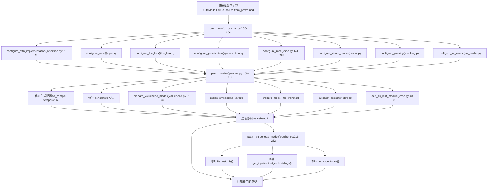
**来源：** [src/llamafactory/model/patcher.py106-252](https://github.com/hiyouga/LlamaFactory/blob/355d5c5e/src/llamafactory/model/patcher.py#L106-L252) [src/llamafactory/model/loader.py131-189](https://github.com/hiyouga/LlamaFactory/blob/355d5c5e/src/llamafactory/model/loader.py#L131-L189)

---

## 配置修补 (Configuration Patching)

`patch_config()` 函数在模型实例化之前应用模型特定的配置调整。这确保了模型与训练框架、优化技术及硬件配置的兼容性。

### 配置修补入口点

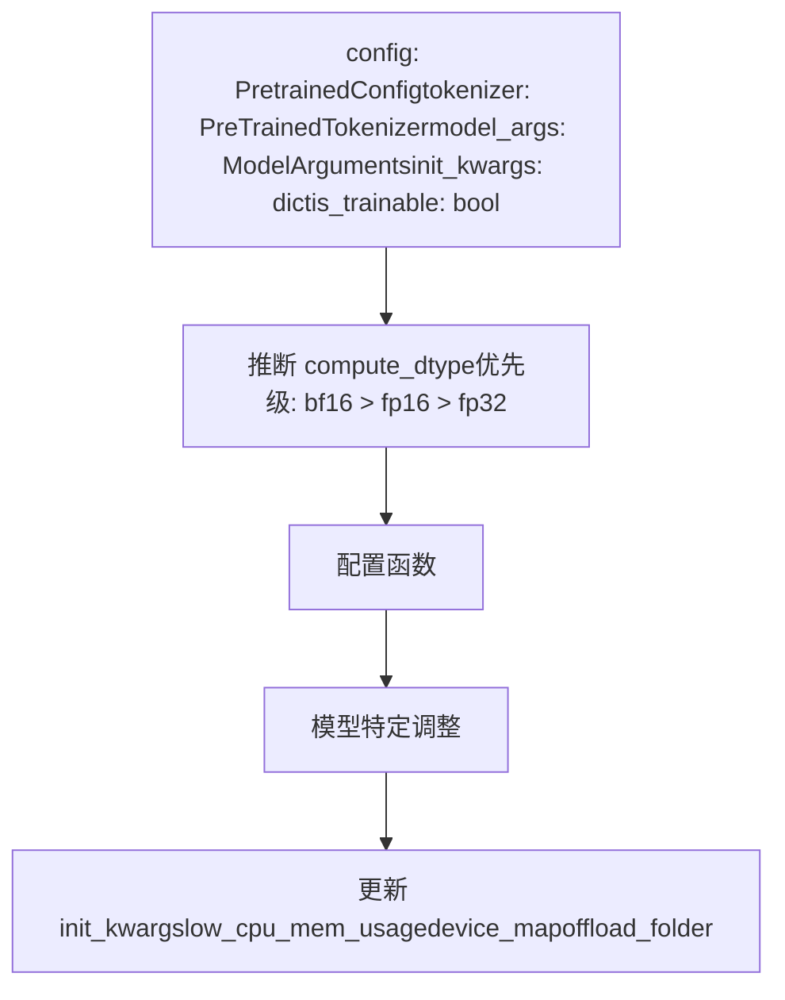
**来源：** [src/llamafactory/model/patcher.py106-166](https://github.com/hiyouga/LlamaFactory/blob/355d5c5e/src/llamafactory/model/patcher.py#L106-L166)

### 注意力实现配置

`configure_attn_implementation()` 函数根据 `model_args.flash_attn` 选择注意力后端：

| flash\_attn 的值 | 结果 | 要求 |
| --- | --- | --- |
| `auto` | 默认 transformers 行为 | 无 |
| `disabled` | Eager 注意力 | 无 |
| `sdpa` | SDPA 注意力 | PyTorch >= 2.1.1 |
| `fa2` | FlashAttention-2 | flash-attn 包或 NPU |
| `fa3` | FlashAttention-3 | 针对 gpt\_oss 模型 |

**特殊情况：**

-   **Gemma 2：** 需要 FlashAttention-2 以支持注意力软封顶 (soft-capping)；SDPA 不兼容 [src/llamafactory/model/model_utils/attention.py46-58](https://github.com/hiyouga/LlamaFactory/blob/355d5c5e/src/llamafactory/model/model_utils/attention.py#L46-L58)
-   **GPT-OSS：** 通过内核库 (kernel hub) 使用带注意力槽 (attention sink) 的 FlashAttention-3 [src/llamafactory/model/model_utils/attention.py34-44](https://github.com/hiyouga/LlamaFactory/blob/355d5c5e/src/llamafactory/model/model_utils/attention.py#L34-L44)
-   **InternLM2：** 使用自定义的 `attn_implementation` 属性 [src/llamafactory/model/model_utils/attention.py83-84](https://github.com/hiyouga/LlamaFactory/blob/355d5c5e/src/llamafactory/model/model_utils/attention.py#L83-L84)
-   **Kimi VL：** 同时修补视觉和文本配置 [src/llamafactory/model/model_utils/attention.py85-87](https://github.com/hiyouga/LlamaFactory/blob/355d5c5e/src/llamafactory/model/model_utils/attention.py#L85-L87)

**来源：** [src/llamafactory/model/model_utils/attention.py31-104](https://github.com/hiyouga/LlamaFactory/blob/355d5c5e/src/llamafactory/model/model_utils/attention.py#L31-L104)

### MoE 配置

`configure_moe()` 函数为混合专家 (Mixture-of-Experts) 模型启用路由器 Logit 输出并配置辅助损失：

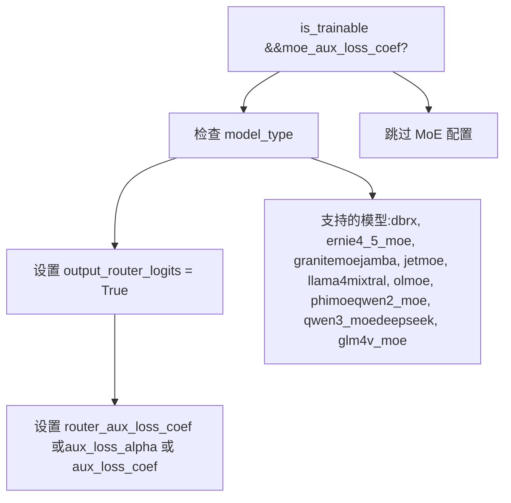
**辅助损失系数映射：**

| 模型类型 | 配置属性 | 来源 |
| --- | --- | --- |
| 大多数 MoE 模型 | `router_aux_loss_coef` | [moe.py180](https://github.com/hiyouga/LlamaFactory/blob/355d5c5e/moe.py#L180-L180) |
| DeepSeek | `aux_loss_alpha` | [moe.py186](https://github.com/hiyouga/LlamaFactory/blob/355d5c5e/moe.py#L186-L186) |
| JetMoE | `aux_loss_coef` | [moe.py189](https://github.com/hiyouga/LlamaFactory/blob/355d5c5e/moe.py#L189-L189) |

**来源：** [src/llamafactory/model/model_utils/moe.py141-190](https://github.com/hiyouga/LlamaFactory/blob/355d5c5e/src/llamafactory/model/model_utils/moe.py#L141-L190)

### 模型特定配置调整

`patch_config()` 函数应用模型特定的调整：

| 模型类型 | 调整项 | 目的 |
| --- | --- | --- |
| `qwen` | 设置 `use_flash_attn`, `fp16`, `bf16`, `fp32` 标志 | 兼容旧版 Qwen |
| `minicpmo` | 设置 `init_audio=True`, `init_tts=False` | 启用音频，禁用 TTS |
| `kimi_vl` | 训练时设置 `topk_method="greedy"` | 替换 top-k 门控方法 |
| `gemma3n` | 设置 `disable_gradient_checkpointing=True` | Gemma 3N 不兼容 |
| `qwen3_omni_moe` | 修补 `Qwen3OmniMoeThinkerTextSparseMoeBlock` | 修复 DeepSpeed Zero2/FSDP2 问题 |

**错误检查：**

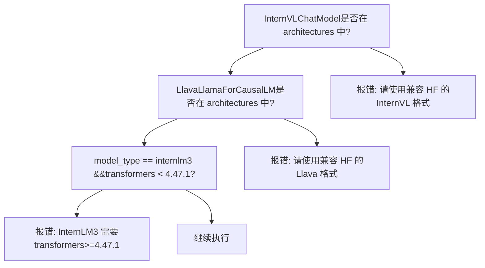
**来源：** [src/llamafactory/model/patcher.py128-158](https://github.com/hiyouga/LlamaFactory/blob/355d5c5e/src/llamafactory/model/patcher.py#L128-L158)

### 设备映射与内存配置

配置修补调整初始化参数以提高内存效率：

```python
# DeepSpeed Zero3 不兼容 low_cpu_mem_usage
init_kwargs["low_cpu_mem_usage"] = model_args.low_cpu_mem_usage and (not is_deepspeed_zero3_enabled())

# 设备映射需要 low_cpu_mem_usage=True
if not (is_deepspeed_zero3_enabled() or is_fsdp_enabled()) and init_kwargs["low_cpu_mem_usage"]:
    if model_args.device_map:
        init_kwargs["device_map"] = model_args.device_map
    if init_kwargs.get("device_map", None) == "auto":
        init_kwargs["offload_folder"] = model_args.offload_folder
```
**来源：** [src/llamafactory/model/patcher.py156-165](https://github.com/hiyouga/LlamaFactory/blob/355d5c5e/src/llamafactory/model/patcher.py#L156-L165)

---

## 模型修补 (Model Patching)

`patch_model()` 函数在模型实例化之后、训练开始之前应用运行时修补。

### 生成配置修正

LlamaFactory 会自动修正不一致的生成配置：

```python
gen_config = model.generation_config

# 修正：如果 do_sample=False 但设置了采样参数，则启用采样
if not gen_config.do_sample and (
    (gen_config.temperature is not None and gen_config.temperature != 1.0)
    or (gen_config.top_p is not None and gen_config.top_p != 1.0)
    or (gen_config.typical_p is not None and gen_config.typical_p != 1.0)
):
    gen_config.do_sample = True
```
**来源：** [src/llamafactory/model/patcher.py175-181](https://github.com/hiyouga/LlamaFactory/blob/355d5c5e/src/llamafactory/model/patcher.py#L175-L181)

### Generate 方法修补

对于大多数模型（MiniCPMV 和 MiniCPMo 除外），`generate()` 方法被修补为使用 transformers 的 `GenerationMixin` 实现：

```python
if getattr(model.config, "model_type", None) not in ["minicpmv", "minicpmo"] and "GenerationMixin" not in str(
    model.generate.__func__):
    model.generate = MethodType(GenerationMixin.generate, model)
```
**来源：** [src/llamafactory/model/patcher.py183-186](https://github.com/hiyouga/LlamaFactory/blob/355d5c5e/src/llamafactory/model/patcher.py#L183-L186)

### 词表大小调整 (Vocabulary Resizing)

当添加新令牌时 (`model_args.resize_vocab=True`)，嵌入层会被调整大小，并可选择进行语义化初始化：

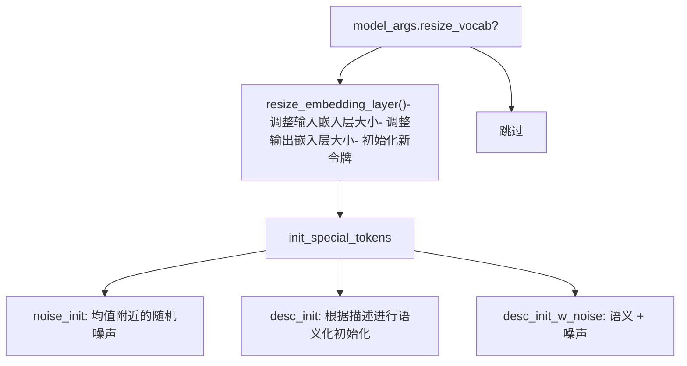
`new_special_tokens_config` 参数允许使用从 YAML 加载的令牌描述进行语义化初始化：

```yaml
# 示例: new_special_tokens.yaml
"<task>": "指示任务描述开始的特殊令牌"
"<answer>": "标记答案开始的特殊令牌"
```
**来源：** [src/llamafactory/model/patcher.py191-197](https://github.com/hiyouga/LlamaFactory/blob/355d5c5e/src/llamafactory/model/patcher.py#L191-L197) [src/llamafactory/hparams/model_args.py82-275](https://github.com/hiyouga/LlamaFactory/blob/355d5c5e/src/llamafactory/hparams/model_args.py#L82-L275)

### 训练准备

对于可训练模型，会应用几项优化：

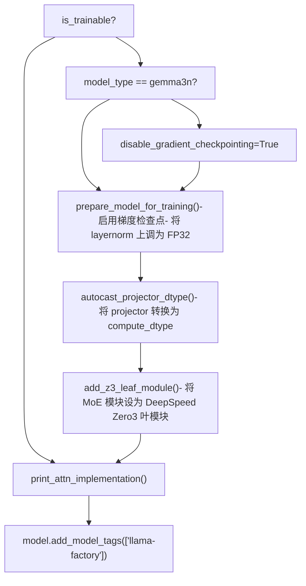
**梯度检查点 (Gradient Checkpointing)：** 由 `prepare_model_for_training()` 启用，除非 `disable_gradient_checkpointing=True` 或模型不支持（如 Gemma3N） [src/llamafactory/model/model_utils/checkpointing.py](https://github.com/hiyouga/LlamaFactory/blob/355d5c5e/src/llamafactory/model/model_utils/checkpointing.py)

**Layernorm 上调 (Upcasting)：** 如果 `upcast_layernorm=True`，所有 layernorm 权重都会被转换为 FP32 以保证数值稳定性 [src/llamafactory/model/model_utils/checkpointing.py](https://github.com/hiyouga/LlamaFactory/blob/355d5c5e/src/llamafactory/model/model_utils/checkpointing.py)

**来源：** [src/llamafactory/model/patcher.py199-213](https://github.com/hiyouga/LlamaFactory/blob/355d5c5e/src/llamafactory/model/patcher.py#L199-L213)

---

## 分词器与处理器修补 (Tokenizer and Processor Patching)

### 分词器修补

`patch_tokenizer()` 函数应用了三种类型的修改：

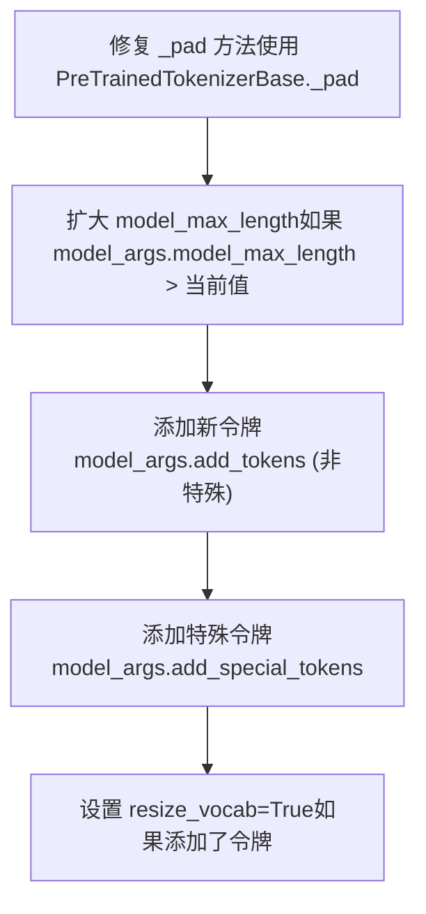
**Padding 方法修复：**

某些分词器错误地重写了 `_pad()` 方法。LlamaFactory 恢复了基础实现：

```python
if "PreTrainedTokenizerBase" not in str(tokenizer._pad.__func__):
    tokenizer._pad = MethodType(PreTrainedTokenizerBase._pad, tokenizer)
```
**自动词表大小调整：**

添加令牌时，`resize_vocab` 会被自动设为 `True` 并发出警告：

```
New tokens have been added, changed `resize_vocab` to True.
```
**来源：** [src/llamafactory/model/patcher.py64-86](https://github.com/hiyouga/LlamaFactory/blob/355d5c5e/src/llamafactory/model/patcher.py#L64-L86)

### 多模态处理器修补

对于多模态模型，处理器 (processor) 会被修补图像/视频/音频参数：

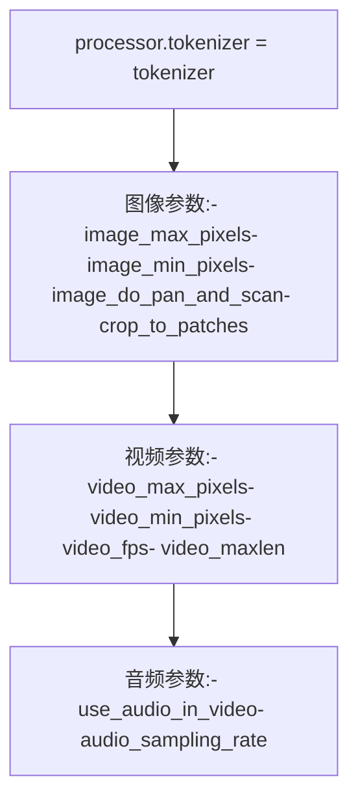
| 参数 | 目的 | 默认值 |
| --- | --- | --- |
| `image_max_pixels` | 最大图像尺寸 | 768 × 768 |
| `image_min_pixels` | 最小图像尺寸 | 32 × 32 |
| `image_do_pan_and_scan` | Gemma3 的平移与扫描 | False |
| `crop_to_patches` | InternVL 的裁剪为补丁 | False |
| `video_fps` | 视频采样率 | 2.0 FPS |
| `video_maxlen` | 最大视频帧数 | 128 |
| `use_audio_in_video` | 从视频中提取音频 | False |

**来源：** [src/llamafactory/model/patcher.py88-103](https://github.com/hiyouga/LlamaFactory/blob/355d5c5e/src/llamafactory/model/patcher.py#L88-L103) [src/llamafactory/hparams/model_args.py307-346](https://github.com/hiyouga/LlamaFactory/blob/355d5c5e/src/llamafactory/hparams/model_args.py#L307-L346)

---

## MoE 特定处理

### DeepSpeed Zero3 叶模块

在 DeepSpeed Zero3 下，MoE 模型的某些模块必须被标记为“叶模块” (leaf modules) 以跳过分区。`add_z3_leaf_module()` 函数注册了这些模块：

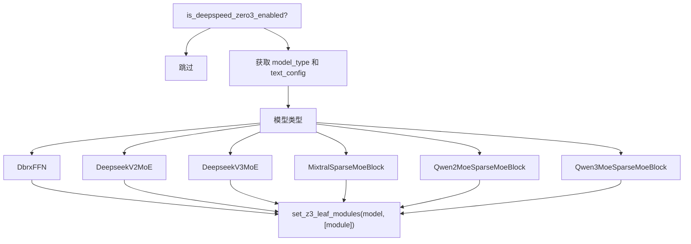
**支持的 MoE 模型：**

| 模型类型 | 叶模块 |
| --- | --- |
| `dbrx` | `DbrxFFN` |
| `deepseek_v2` | `DeepseekV2MoE` |
| `deepseek_v3`, `kimi_vl` | `DeepseekV3MoE` |
| `ernie4_5_moe` | `Ernie4_5_MoeSparseMoeBlock` |
| `granitemoe` | `GraniteMoeMoE` |
| `glm4_moe` | `Glm4MoeMoE` |
| `glm4v_moe` | `Glm4vMoeTextMoE` |
| `gpt_oss` | `GptOssMLP` |
| `jamba` | `JambaSparseMoeBlock` |
| `jetmoe` | `JetMoeMoA`, `JetMoeMoE` |
| `llama4` | `Llama4TextMoe` |
| `mixtral` | `MixtralSparseMoeBlock` |
| `olmoe` | `OlmoeSparseMoeBlock` |
| `phimoe` | `PhimoeSparseMoeBlock` |
| `qwen2_moe` | `Qwen2MoeSparseMoeBlock` |
| `qwen3_moe` | `Qwen3MoeSparseMoeBlock` |
| `qwen3_vl_moe` | `Qwen3VLMoeTextSparseMoeBlock` |
| `qwen3_omni_moe` | `Qwen3OmniMoeThinkerTextSparseMoeBlock` |

**来源：** [src/llamafactory/model/model_utils/moe.py36-138](https://github.com/hiyouga/LlamaFactory/blob/355d5c5e/src/llamafactory/model/model_utils/moe.py#L36-L138)

### 自定义 MoE 实现：Qwen3 Omni MoE

LlamaFactory 提供了一个自定义的 `Qwen3OmniMoeThinkerTextSparseMoeBlock` 实现，以修复 transformers 4.57.0-4.58.0 中 DeepSpeed Zero2 和 FSDP2 的问题：

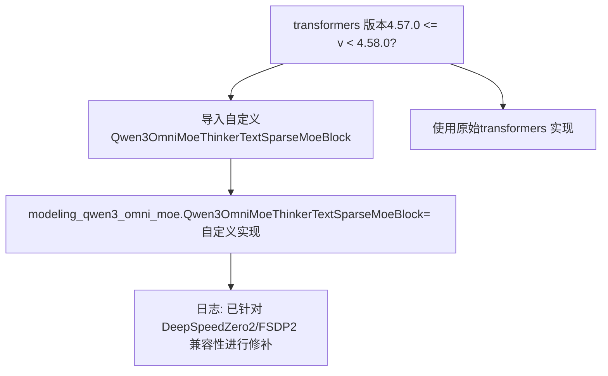
**关键差异：**

自定义实现将所有专家（而不仅仅是 top-k）都路由到计算中，未被选中的专家权重设为零。这确保了梯度计算与 DeepSpeed Zero2 和 FSDP2 的兼容性：

```python
# 所有专家均参与，未激活的专家权重=0
for expert_idx in range(self.num_experts):
    expert_weights = full_routing_weights[:, expert_idx, None]  # 可能是 0
    current_hidden_states = expert_layer(hidden_states) * expert_weights
    final_hidden_states += current_hidden_states
```
**来源：** [src/llamafactory/model/patcher.py53-61](https://github.com/hiyouga/LlamaFactory/blob/355d5c5e/src/llamafactory/model/patcher.py#L53-L61) [src/llamafactory/model/model_utils/moe.py192-252](https://github.com/hiyouga/LlamaFactory/blob/355d5c5e/src/llamafactory/model/model_utils/moe.py#L192-L252)

---

## 性能优化

### Liger Kernel 应用

The Liger Kernel 提供了融合算子以实现更快的训练。`apply_liger_kernel()` 函数应用模型特定的内核：

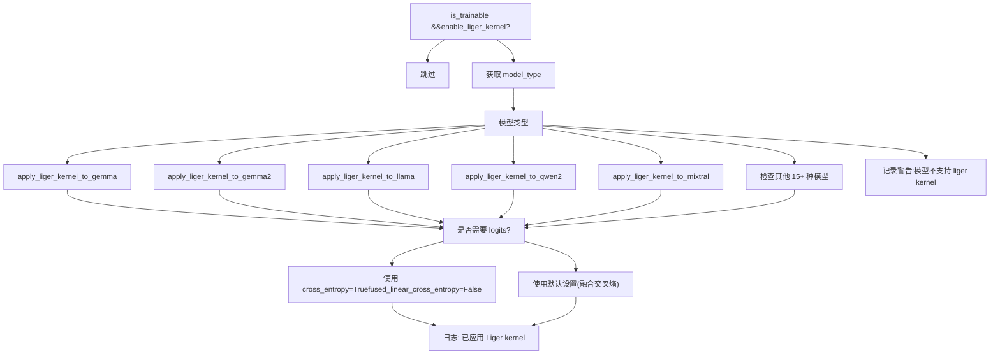
**支持的模型：** gemma, gemma2, gemma3, gemma3\_text, glm4, glm4v, granite, llama, llava, mistral, mixtral, mllama, olmo2, paligemma, phi3, qwen2, qwen2\_vl, qwen2\_5\_vl, qwen3, qwen3\_moe, gpt\_oss

**交叉熵处理：**

对于需要 logits 的训练阶段 (RM, PPO, DPO, KTO, ORPO)，禁用了分块交叉熵：

```python
if require_logits and "fused_linear_cross_entropy" in inspect.signature(apply_liger_kernel).parameters:
    logger.info_rank0("Current training stage does not support chunked cross entropy.")
    kwargs = {"fused_linear_cross_entropy": False, "cross_entropy": True}
```
**来源：** [src/llamafactory/model/model_utils/liger_kernel.py30-97](https://github.com/hiyouga/LlamaFactory/blob/355d5c5e/src/llamafactory/model/model_utils/liger_kernel.py#L30-L97) [src/llamafactory/model/loader.py142](https://github.com/hiyouga/LlamaFactory/blob/355d5c5e/src/llamafactory/model/loader.py#L142-L142)

---

## Value Head 模型

Value head 模型用于强化学习阶段 (RM, PPO)，以预测标量奖励。

### Value Head 准备

`prepare_valuehead_model()` 函数设置语言模型头，以便进行 value head 封装：

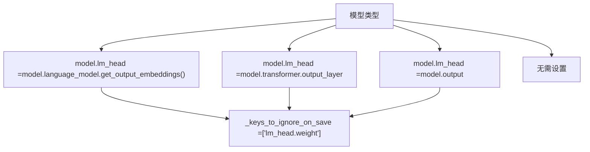
**目的：** 这些模型具有非标准的输出层访问模式。修补工作为 TRL 的 `AutoModelForCausalLMWithValueHead` 封装器提供了一个统一的 `lm_head` 属性。

**来源：** [src/llamafactory/model/model_utils/valuehead.py61-73](https://github.com/hiyouga/LlamaFactory/blob/355d5c5e/src/llamafactory/model/model_utils/valuehead.py#L61-L73) [src/llamafactory/model/patcher.py188-189](https://github.com/hiyouga/LlamaFactory/blob/355d5c5e/src/llamafactory/model/patcher.py#L188-L189)

### Value Head 模型修补

在用 `AutoModelForCausalLMWithValueHead` 封装后，`patch_valuehead_model()` 函数修补相关方法以实现正确行为：

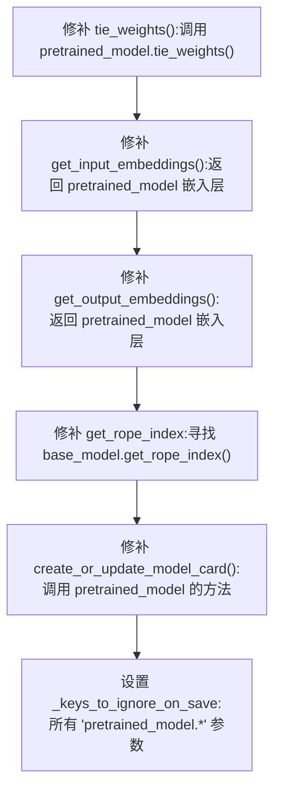
**关键修补点：**

1.  **`tie_weights()`**：确保权重绑定被委托给底层的预训练模型 [src/llamafactory/model/patcher.py217-219](https://github.com/hiyouga/LlamaFactory/blob/355d5c5e/src/llamafactory/model/patcher.py#L217-L219)

2.  **`get_input_embeddings()` / `get_output_embeddings()`**：返回预训练模型的嵌入层，而不是封装器的 [src/llamafactory/model/patcher.py221-227](https://github.com/hiyouga/LlamaFactory/blob/355d5c5e/src/llamafactory/model/patcher.py#L221-L227)

3.  **`get_rope_index()`**：为使用 RoPE 嵌入的模型（如配合序列打包使用时）定位 RoPE 索引函数 [src/llamafactory/model/patcher.py233-244](https://github.com/hiyouga/LlamaFactory/blob/355d5c5e/src/llamafactory/model/patcher.py#L233-L244)

4.  **`create_or_update_model_card()`**：在使用适配器时，将模型卡片创建委托给 PEFT 模型 [src/llamafactory/model/patcher.py229-231](https://github.com/hiyouga/LlamaFactory/blob/355d5c5e/src/llamafactory/model/patcher.py#L229-L231)

5.  **`_keys_to_ignore_on_save`**：防止保存预训练模型参数（仅保存 value head） [src/llamafactory/model/patcher.py246-247](https://github.com/hiyouga/LlamaFactory/blob/355d5c5e/src/llamafactory/model/patcher.py#L246-L247)


**来源：** [src/llamafactory/model/patcher.py216-252](https://github.com/hiyouga/LlamaFactory/blob/355d5c5e/src/llamafactory/model/patcher.py#L216-L252)

---

## 模型特定配置参考

### 模型配置表

| 模型家族 | 关键调整项 | 文件 |
| --- | --- | --- |
| **Qwen** | 遗留 flash attention 标志, Qwen3 Omni MoE 修补 | [patcher.py128-154](https://github.com/hiyouga/LlamaFactory/blob/355d5c5e/patcher.py#L128-L154) |
| **Gemma** | Gemma 2: FA2 需用于软封顶; Gemma 3N: 禁用梯度检查点 | [attention.py46-58](https://github.com/hiyouga/LlamaFactory/blob/355d5c5e/attention.py#L46-L58) [patcher.py200-201](https://github.com/hiyouga/LlamaFactory/blob/355d5c5e/patcher.py#L200-L201) |
| **MiniCPM Omni** | 启用音频初始化, 禁用 TTS 初始化 | [patcher.py133-135](https://github.com/hiyouga/LlamaFactory/blob/355d5c5e/patcher.py#L133-L135) |
| **Kimi VL** | 贪婪 top-k 门控, 修补视觉+文本配置 | [patcher.py138-139](https://github.com/hiyouga/LlamaFactory/blob/355d5c5e/patcher.py#L138-L139) [attention.py85-87](https://github.com/hiyouga/LlamaFactory/blob/355d5c5e/attention.py#L85-L87) |
| **InternVL** | 必须使用兼容 HF 的格式, crop\_to\_patches 选项 | [patcher.py141-145](https://github.com/hiyouga/LlamaFactory/blob/355d5c5e/patcher.py#L141-L145) |
| **Llava** | 必须使用兼容 HF 的格式, value head 准备 | [patcher.py147-148](https://github.com/hiyouga/LlamaFactory/blob/355d5c5e/patcher.py#L147-L148) [valuehead.py62-64](https://github.com/hiyouga/LlamaFactory/blob/355d5c5e/valuehead.py#L62-L64) |
| **InternLM** | 需要 transformers >= 4.47.1, 自定义注意力属性 | [patcher.py150-151](https://github.com/hiyouga/LlamaFactory/blob/355d5c5e/patcher.py#L150-L151) [attention.py83-84](https://github.com/hiyouga/LlamaFactory/blob/355d5c5e/attention.py#L83-L84) |
| **GPT-OSS** | 带注意力槽的 FlashAttention-3 | [attention.py34-44](https://github.com/hiyouga/LlamaFactory/blob/355d5c5e/attention.py#L34-L44) |
| **ChatGLM** | 针对 value head 的自定义输出层 | [valuehead.py66-68](https://github.com/hiyouga/LlamaFactory/blob/355d5c5e/valuehead.py#L66-L68) |
| **DeepSeek** | 自定义 MoE 叶模块, 自定义辅助损失 | [moe.py57-63](https://github.com/hiyouga/LlamaFactory/blob/355d5c5e/moe.py#L57-L63) |

**来源：** [src/llamafactory/model/patcher.py128-154](https://github.com/hiyouga/LlamaFactory/blob/355d5c5e/src/llamafactory/model/patcher.py#L128-L154) [src/llamafactory/model/model_utils/attention.py34-90](https://github.com/hiyouga/LlamaFactory/blob/355d5c5e/src/llamafactory/model/model_utils/attention.py#L34-L90) [src/llamafactory/model/model_utils/valuehead.py61-73](https://github.com/hiyouga/LlamaFactory/blob/355d5c5e/src/llamafactory/model/model_utils/valuehead.py#L61-L73)

---

## 训练中的补丁执行流

下图展示了补丁系统如何集成到完整的训练流水线中：

> **[Mermaid sequence]**
> *(图表结构无法解析)*

**来源：** [src/llamafactory/model/loader.py131-238](https://github.com/hiyouga/LlamaFactory/blob/355d5c5e/src/llamafactory/model/loader.py#L131-L238) [src/llamafactory/model/patcher.py106-252](https://github.com/hiyouga/LlamaFactory/blob/355d5c5e/src/llamafactory/model/patcher.py#L106-L252)
