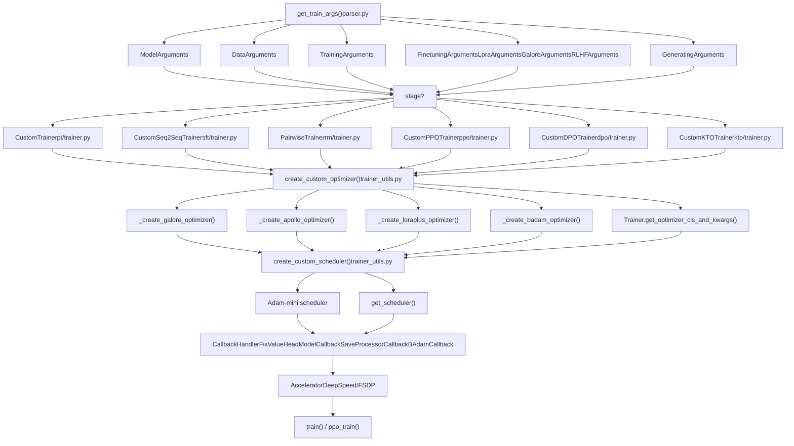
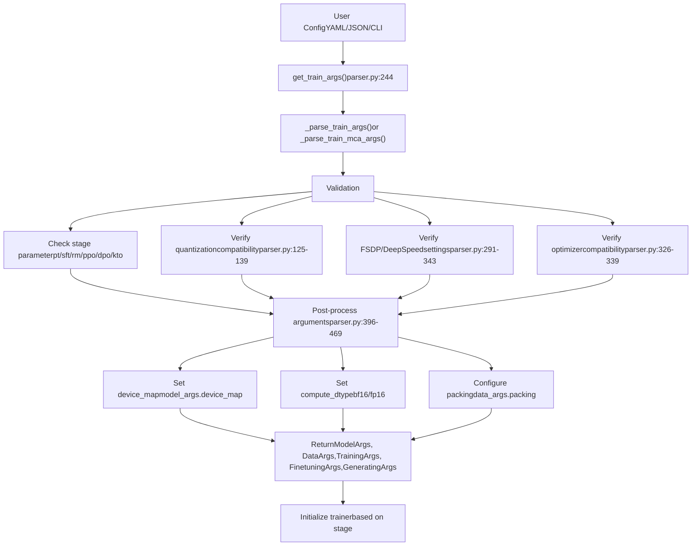
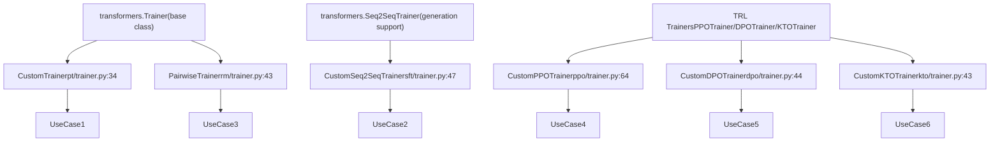
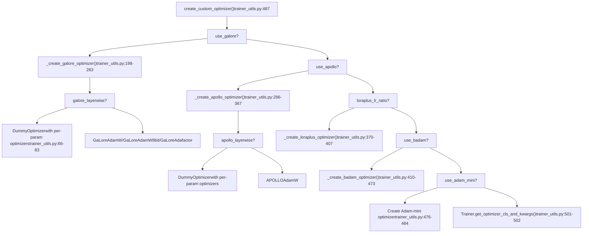
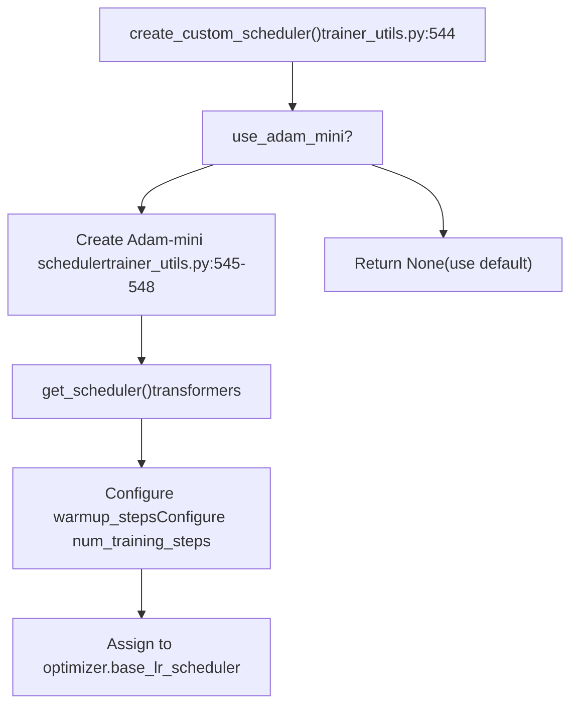
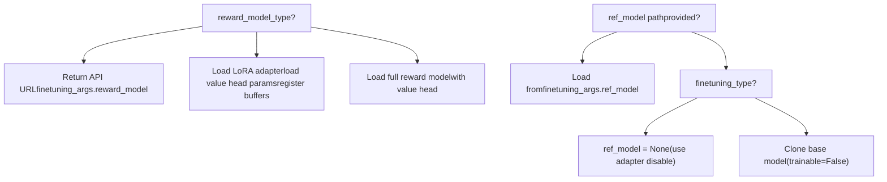
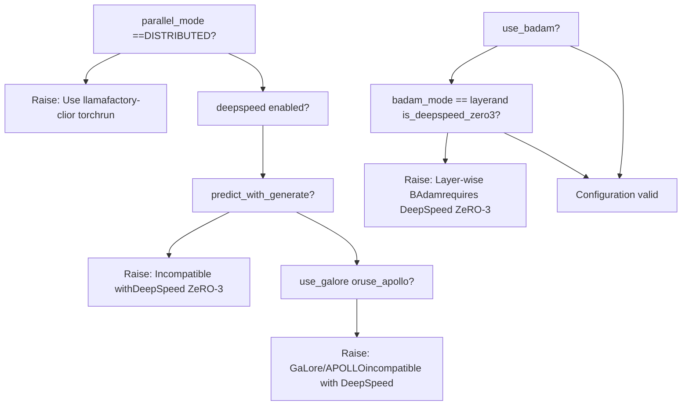
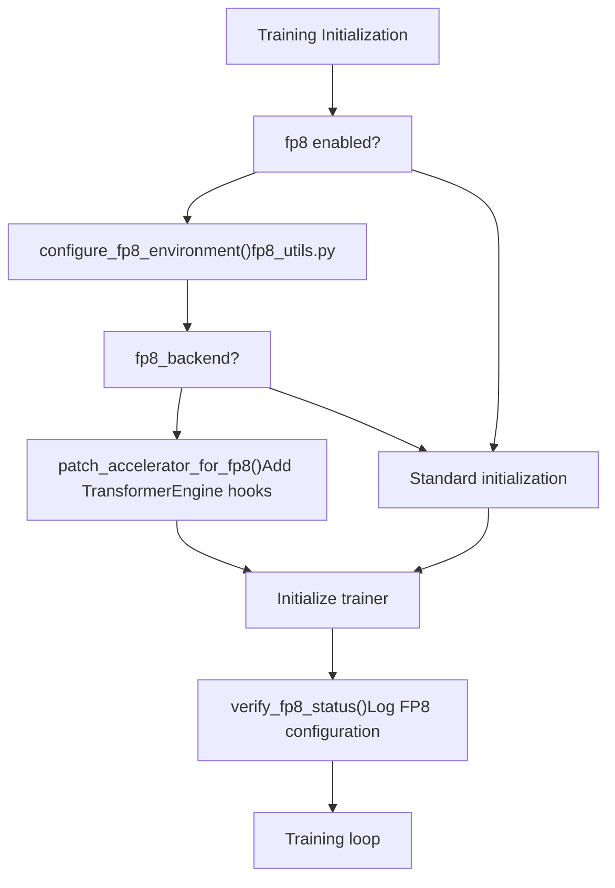

# 训练系统

相关源文件

-   [README.md](https://github.com/hiyouga/LlamaFactory/blob/355d5c5e/README.md?plain=1)
-   [README\_zh.md](https://github.com/hiyouga/LlamaFactory/blob/355d5c5e/README_zh.md?plain=1)
-   [src/llamafactory/hparams/finetuning\_args.py](https://github.com/hiyouga/LlamaFactory/blob/355d5c5e/src/llamafactory/hparams/finetuning_args.py)
-   [src/llamafactory/hparams/parser.py](https://github.com/hiyouga/LlamaFactory/blob/355d5c5e/src/llamafactory/hparams/parser.py)
-   [src/llamafactory/train/dpo/trainer.py](https://github.com/hiyouga/LlamaFactory/blob/355d5c5e/src/llamafactory/train/dpo/trainer.py)
-   [src/llamafactory/train/kto/trainer.py](https://github.com/hiyouga/LlamaFactory/blob/355d5c5e/src/llamafactory/train/kto/trainer.py)
-   [src/llamafactory/train/ppo/trainer.py](https://github.com/hiyouga/LlamaFactory/blob/355d5c5e/src/llamafactory/train/ppo/trainer.py)
-   [src/llamafactory/train/pt/trainer.py](https://github.com/hiyouga/LlamaFactory/blob/355d5c5e/src/llamafactory/train/pt/trainer.py)
-   [src/llamafactory/train/rm/trainer.py](https://github.com/hiyouga/LlamaFactory/blob/355d5c5e/src/llamafactory/train/rm/trainer.py)
-   [src/llamafactory/train/sft/trainer.py](https://github.com/hiyouga/LlamaFactory/blob/355d5c5e/src/llamafactory/train/sft/trainer.py)
-   [src/llamafactory/train/trainer\_utils.py](https://github.com/hiyouga/LlamaFactory/blob/355d5c5e/src/llamafactory/train/trainer_utils.py)

训练系统为使用各种微调方法训练语言模型提供了核心基础设施。它通过自定义训练器实现、优化器配置、回调管理和分布式训练支持来协调模型训练。该系统连接了经过验证的配置（来自 [配置系统](/hiyouga/LlamaFactory/3-configuration-system)）与实际的模型训练执行。

关于模型加载和适配器配置，请参阅 [模型加载与配置](/hiyouga/LlamaFactory/5-model-loading-and-configuration)。关于训练后的推理，请参阅 [推理与部署](/hiyouga/LlamaFactory/7-inference-and-deployment)。关于训练的 Web 界面，请参阅 [Web UI (LLaMA Board)](/hiyouga/LlamaFactory/8-web-ui-(llama-board))。

---

## 系统架构

训练系统围绕五个核心组件组织，共同执行训练任务：


**训练系统组件流程**

该系统遵循流水线模式，解析、验证参数并根据 `stage` 参数路由到相应的训练器类。每个训练器在进入训练循环之前创建自定义优化器和调度器。

资料来源：[src/llamafactory/hparams/parser.py244-471](https://github.com/hiyouga/LlamaFactory/blob/355d5c5e/src/llamafactory/hparams/parser.py#L244-L471) [src/llamafactory/train/trainer\_utils.py85-471](https://github.com/hiyouga/LlamaFactory/blob/355d5c5e/src/llamafactory/train/trainer_utils.py#L85-L471)

---

## 训练配置流程


**配置验证与后处理**

`get_train_args()` 函数在训练开始前执行广泛的验证以确保配置兼容性。这可以防止浪费计算运行时的错误。

资料来源：[src/llamafactory/hparams/parser.py244-471](https://github.com/hiyouga/LlamaFactory/blob/355d5c5e/src/llamafactory/hparams/parser.py#L244-L471)

---

## 训练器类层次结构


**训练器继承结构**

所有自定义训练器都重写了三个关键方法：

-   `create_optimizer()` - 集成自定义优化器逻辑
-   `create_scheduler()` - 配置学习率调度
-   `_get_train_sampler()` - 支持 `disable_shuffling` 选项

资料来源：[src/llamafactory/train/pt/trainer.py34-95](https://github.com/hiyouga/LlamaFactory/blob/355d5c5e/src/llamafactory/train/pt/trainer.py#L34-L95) [src/llamafactory/train/sft/trainer.py47-179](https://github.com/hiyouga/LlamaFactory/blob/355d5c5e/src/llamafactory/train/sft/trainer.py#L47-L179) [src/llamafactory/train/rm/trainer.py43-130](https://github.com/hiyouga/LlamaFactory/blob/355d5c5e/src/llamafactory/train/rm/trainer.py#L43-L130) [src/llamafactory/train/ppo/trainer.py64-453](https://github.com/hiyouga/LlamaFactory/blob/355d5c5e/src/llamafactory/train/ppo/trainer.py#L64-L453) [src/llamafactory/train/dpo/trainer.py44-324](https://github.com/hiyouga/LlamaFactory/blob/355d5c5e/src/llamafactory/train/dpo/trainer.py#L44-L324) [src/llamafactory/train/kto/trainer.py43-303](https://github.com/hiyouga/LlamaFactory/blob/355d5c5e/src/llamafactory/train/kto/trainer.py#L43-L303)

---

## 优化器创建流水线

系统通过工厂模式支持多种先进的优化算法：


**自定义优化器选择逻辑**

优化器创建遵循优先级链。GaLore 和 APOLLO 实现了梯度低秩投影，LoRA+ 为 LoRA 矩阵使用不同的学习率，BAdam 执行块更新。

资料来源：[src/llamafactory/train/trainer\_utils.py487-541](https://github.com/hiyouga/LlamaFactory/blob/355d5c5e/src/llamafactory/train/trainer_utils.py#L487-L541) [src/llamafactory/train/trainer\_utils.py198-367](https://github.com/hiyouga/LlamaFactory/blob/355d5c5e/src/llamafactory/train/trainer_utils.py#L198-L367)

---

## 优化器实现细节

### GaLore 优化器

GaLore (梯度低秩投影) 通过将梯度投影到低秩子空间来减少内存使用：

| 参数 | 类型 | 默认值 | 描述 |
| --- | --- | --- | --- |
| `galore_target` | str | "all" | GaLore 的目标模块（逗号分隔或 "all" 表示所有线性层） |
| `galore_rank` | int | 16 | 梯度投影的秩 |
| `galore_update_interval` | int | 200 | 投影更新之间的步数 |
| `galore_scale` | float | 2.0 | 缩放系数 |
| `galore_proj_type` | str | "std" | 投影类型：std/reverse\_std/right/left/full |
| `galore_layerwise` | bool | False | 启用逐层更新（节省内存，禁用梯度累积） |

**关键实现点：**

-   当 `galore_layerwise=True` 时，创建一个 `DummyOptimizer`，委托给通过 `register_post_accumulate_grad_hook()` 注册的逐参数优化器。
-   将参数分为三组：GaLore 参数、衰减参数和无衰减参数。
-   根据 `optim` 设置使用 `GaLoreAdamW`、`GaLoreAdamW8bit` 或 `GaLoreAdafactor`。

资料来源：[src/llamafactory/train/trainer\_utils.py198-283](https://github.com/hiyouga/LlamaFactory/blob/355d5c5e/src/llamafactory/train/trainer_utils.py#L198-L283) [src/llamafactory/hparams/finetuning\_args.py263-298](https://github.com/hiyouga/LlamaFactory/blob/355d5c5e/src/llamafactory/hparams/finetuning_args.py#L263-L298)

### APOLLO 优化器

APOLLO 是一种自适应投影低秩优化器：

| 参数 | 类型 | 默认值 | 描述 |
| --- | --- | --- | --- |
| `apollo_target` | str | "all" | APOLLO 的目标模块 |
| `apollo_rank` | int | 16 | 梯度投影的秩 |
| `apollo_update_interval` | int | 200 | 投影更新之间的步数 |
| `apollo_scale` | float | 32.0 | 缩放系数 |
| `apollo_proj` | str | "random" | 投影算法：svd/random |
| `apollo_proj_type` | str | "std" | 投影类型：std/right/left |
| `apollo_scale_type` | str | "channel" | 缩放类型：channel/tensor |
| `apollo_layerwise` | bool | False | 启用逐层更新 |
| `apollo_scale_front` | bool | False | 在缩放前使用范数增长限制器 |

资料来源：[src/llamafactory/train/trainer\_utils.py286-367](https://github.com/hiyouga/LlamaFactory/blob/355d5c5e/src/llamafactory/train/trainer_utils.py#L286-L367) [src/llamafactory/hparams/finetuning\_args.py302-349](https://github.com/hiyouga/LlamaFactory/blob/355d5c5e/src/llamafactory/hparams/finetuning_args.py#L302-L349)

### LoRA+ 优化器

LoRA+ 为 LoRA A 和 B 矩阵使用不同的学习率：

-   LoRA A 矩阵：`learning_rate`（基础学习率）
-   LoRA B 矩阵：`learning_rate * loraplus_lr_ratio`
-   LoRA 嵌入层 B：`loraplus_lr_embedding`
-   根据参数名称选择性地应用权重衰减。

资料来源：[src/llamafactory/train/trainer\_utils.py370-407](https://github.com/hiyouga/LlamaFactory/blob/355d5c5e/src/llamafactory/train/trainer_utils.py#L370-L407) [src/llamafactory/hparams/finetuning\_args.py91-97](https://github.com/hiyouga/LlamaFactory/blob/355d5c5e/src/llamafactory/hparams/finetuning_args.py#L91-L97)

### BAdam 优化器

BAdam (块自适应 Adam) 执行块参数更新以减少内存：

| 参数 | 类型 | 默认值 | 描述 |
| --- | --- | --- | --- |
| `badam_mode` | str | "layer" | 更新模式：layer/ratio |
| `badam_start_block` | int | None | 逐层模式的起始块索引 |
| `badam_switch_mode` | str | "ascending" | 块切换策略：ascending/descending/random/fixed |
| `badam_switch_interval` | int | 50 | 块切换之间的步数（-1 表示禁用） |
| `badam_update_ratio` | float | 0.05 | 按比例模式的更新比例 |
| `badam_mask_mode` | str | "adjacent" | 掩码模式：adjacent/scatter |
| `badam_verbose` | int | 0 | 详细程度 (0/1/2) |

**实现说明：**

-   逐层 BAdam 仅支持 DeepSpeed ZeRO-3。
-   使用 `BAdamCallback` 管理块切换。
-   需要 `clip_grad_norm_old_version` 补丁进行梯度裁剪。

资料来源：[src/llamafactory/train/trainer\_utils.py410-473](https://github.com/hiyouga/LlamaFactory/blob/355d5c5e/src/llamafactory/train/trainer_utils.py#L410-L473) [src/llamafactory/hparams/finetuning\_args.py353-400](https://github.com/hiyouga/LlamaFactory/blob/355d5c5e/src/llamafactory/hparams/finetuning_args.py#L353-L400)

---

## 调度器创建


**学习率调度器配置**

系统主要使用 transformers 的标准调度器，除了 Adam-mini 需要存储在 `optimizer.base_lr_scheduler` 中的特定调度器配置。

资料来源：[src/llamafactory/train/trainer\_utils.py544-558](https://github.com/hiyouga/LlamaFactory/blob/355d5c5e/src/llamafactory/train/trainer_utils.py#L544-L558)

---

## 参考模型与奖励模型创建

对于 PPO 和 DPO 训练，系统创建独立的参考模型和/或奖励模型：


**参考模型与奖励模型加载**

-   **参考模型**：在 DPO/KTO 中用于计算参考对数概率。使用 LoRA 时，通过临时禁用适配器来访问参考模型。
-   **奖励模型**：在 PPO 中用于为生成的响应评分。可以是 API 端点、LoRA 适配器或完整模型。

**关键实现细节：**

-   参考模型设置为 `evaluation_mode=True` 并使用 `accelerator.prepare_model()` 包装。
-   对于 LoRA 奖励模型，价值头权重被注册为缓冲区：`reward_head_weight`、`reward_head_bias`、`default_head_weight`、`default_head_bias`。
-   针对量化模型特别处理了 DeepSpeed 准备工作。

资料来源：[src/llamafactory/train/trainer\_utils.py114-189](https://github.com/hiyouga/LlamaFactory/blob/355d5c5e/src/llamafactory/train/trainer_utils.py#L114-L189)

---

## 回调系统

每个训练器注册回调来处理特定的训练事件：

| 回调 | 使用者 | 用途 |
| --- | --- | --- |
| `FixValueHeadModelCallback` | PPO, RM | 确保正确保存价值头参数 |
| `SaveProcessorCallback` | 所有（当处理器存在时） | 随模型检查点保存多模态处理器 |
| `BAdamCallback` | 所有（当 `use_badam=True` 时） | 管理 BAdam 块切换和更新 |
| `SavePeftModelCallback` | 所有 LoRA/OFT 训练器 | 处理适配器检查点保存 |
| `LogCallback` | 所有 | 标准训练日志记录 |

**回调注册模式：**

```
# 在每个自定义训练器的 __init__ 中：if processor is not None:    self.add_callback(SaveProcessorCallback(processor)) if finetuning_args.use_badam:    from badam import BAdamCallback, clip_grad_norm_old_version    self.accelerator.clip_grad_norm_ = MethodType(clip_grad_norm_old_version, self.accelerator)    self.add_callback(BAdamCallback)
```
资料来源：[src/llamafactory/train/sft/trainer.py77-84](https://github.com/hiyouga/LlamaFactory/blob/355d5c5e/src/llamafactory/train/sft/trainer.py#L77-L84) [src/llamafactory/train/ppo/trainer.py189-198](https://github.com/hiyouga/LlamaFactory/blob/355d5c5e/src/llamafactory/train/ppo/trainer.py#L189-L198) [src/llamafactory/train/rm/trainer.py56-65](https://github.com/hiyouga/LlamaFactory/blob/355d5c5e/src/llamafactory/train/rm/trainer.py#L56-L65)

---

## 分布式训练配置

训练系统支持三种分布式策略：

### 数据并行 (DDP)

-   当 `parallel_mode == ParallelMode.DISTRIBUTED` 时自动启用。
-   需要 `FORCE_TORCHRUN=1` 或通过 `llamafactory-cli` 启动。
-   配置：对于 LoRA 训练，`ddp_find_unused_parameters` 自动设置为 `False`。

### 全分片数据并行 (FSDP)

-   通过 `TrainingArguments` 中的 `fsdp` 参数启用。
-   支持 FSDP+QLoRA，用于在 2×24GB GPU 上训练 70B 模型。
-   配置文件：`examples/fsdp_config.yaml`。

### DeepSpeed ZeRO

-   通过指向配置 JSON 的 `deepspeed` 参数启用。
-   支持 ZeRO 阶段 1、2 和 3。
-   对 MoE 模型和价值头参数进行特殊处理。

**验证逻辑：**

系统执行广泛的验证以防止不兼容的配置：


**关键验证规则：**

-   GaLore/APOLLO 逐层更新：仅限单设备（无分布式）。
-   BAdam 逐层更新：需要 DeepSpeed ZeRO-3。
-   GaLore/APOLLO：与 DeepSpeed 完全不兼容。
-   `predict_with_generate`：与 DeepSpeed ZeRO-3 不兼容。
-   Unsloth/KTransformers：与 DeepSpeed ZeRO-3 不兼容。

资料来源：[src/llamafactory/hparams/parser.py288-354](https://github.com/hiyouga/LlamaFactory/blob/355d5c5e/src/llamafactory/hparams/parser.py#L288-L354)

---

## 训练循环执行

### 标准训练 (PT/SFT/RM/DPO/KTO)

这些训练器使用标准的 Hugging Face `Trainer.train()` 方法：

资料来源：[src/llamafactory/train/pt/trainer.py34-95](https://github.com/hiyouga/LlamaFactory/blob/355d5c5e/src/llamafactory/train/pt/trainer.py#L34-L95) [src/llamafactory/train/sft/trainer.py47-179](https://github.com/hiyouga/LlamaFactory/blob/355d5c5e/src/llamafactory/train/sft/trainer.py#L47-L179)

### PPO 训练循环

PPO 使用带有经验缓冲的自定义 `ppo_train()` 方法：

**PPO 配置参数：**

| 参数 | FinetuningArgs 字段 | 默认值 | 描述 |
| --- | --- | --- | --- |
| `batch_size` | `per_device_train_batch_size * gradient_accumulation_steps * ppo_buffer_size` | \- | 总经验缓冲大小 |
| `mini_batch_size` | `per_device_train_batch_size` | \- | PPO 更新批次大小 |
| `ppo_epochs` | `ppo_epochs` | 4 | 每个缓冲区的优化周期数 |
| `target` | `ppo_target` | 6.0 | 自适应控制的目标 KL |
| `use_score_norm` | `ppo_score_norm` | False | 归一化奖励分数 |
| `whiten_rewards` | `ppo_whiten_rewards` | False | 在计算优势前白化奖励 |

资料来源：[src/llamafactory/train/ppo/trainer.py200-453](https://github.com/hiyouga/LlamaFactory/blob/355d5c5e/src/llamafactory/train/ppo/trainer.py#L200-L453)

---

## 损失计算

每个训练器实现自定义损失计算：

### SFT 训练器损失

-   标准因果语言模型损失。
-   当 `train_on_prompt=False` 时屏蔽提示词 Token。
-   支持 `predict_with_generate` 进行评估。

### 奖励模型损失

-   成对排序损失：`-log(sigmoid(chosen_score - rejected_score))`。
-   批次被拆分：前半部分为选中的示例，后半部分为拒绝的示例。

### DPO/ORPO/SimPO 损失

```
# DPO 损失 (简化版)policy_logratios = policy_chosen_logps - policy_rejected_logpsreference_logratios = reference_chosen_logps - reference_rejected_logpslogits = policy_logratios - reference_logratioslosses = -F.logsigmoid(beta * logits) # ORPO 损失log_odds = (chosen_logps - rejected_logps) - (    torch.log1p(-torch.exp(chosen_logps)) - torch.log1p(-torch.exp(rejected_logps)))odds_ratio_loss = -F.logsigmoid(log_odds)orpo_loss = sft_loss + beta * odds_ratio_loss # SimPO 损失pi_logratios = chosen_logps - rejected_logpsgamma_logratios = simpo_gamma / betalogits = pi_logratios - gamma_logratiossimpo_loss = -F.logsigmoid(beta * logits)
```
资料来源：[src/llamafactory/train/dpo/trainer.py143-209](https://github.com/hiyouga/LlamaFactory/blob/355d5c5e/src/llamafactory/train/dpo/trainer.py#L143-L209)

### KTO 损失

-   分别为合意和不合意的示例计算损失。
-   使用 KL 散度进行正则化。
-   应用 `kto_chosen_weight` 和 `kto_rejected_weight`。

### PPO 损失

-   结合策略梯度损失、价值损失和 KL 惩罚。
-   使用带有可选奖励白化的优势估计。
-   裁剪策略比例以实现稳定更新。

资料来源：[src/llamafactory/train/kto/trainer.py214-261](https://github.com/hiyouga/LlamaFactory/blob/355d5c5e/src/llamafactory/train/kto/trainer.py#L214-L261) [src/llamafactory/train/ppo/trainer.py200-453](https://github.com/hiyouga/LlamaFactory/blob/355d5c5e/src/llamafactory/train/ppo/trainer.py#L200-L453)

---

## FP8 训练支持

训练系统包含 FP8（8 位浮点）训练支持，以实现更快的训练并减少内存占用：


**FP8 配置：**

-   `fp8`：启用 FP8 训练（需要兼容的硬件）。
-   `fp8_backend`：后端选择（"te" 表示 TransformerEngine，"ms" 表示 Microsoft，"auto"）。
-   `fp8_enable_fsdp_float8_all_gather`：在 FSDP 中启用 FP8 all-gather。

资料来源：[src/llamafactory/train/sft/trainer.py59-92](https://github.com/hiyouga/LlamaFactory/blob/355d5c5e/src/llamafactory/train/sft/trainer.py#L59-L92) [src/llamafactory/train/pt/trainer.py45-70](https://github.com/hiyouga/LlamaFactory/blob/355d5c5e/src/llamafactory/train/pt/trainer.py#L45-L70)

---

## 训练阶段摘要

| 阶段 | 训练器类 | 训练方法 | 关键特性 |
| --- | --- | --- | --- |
| `pt` | `CustomTrainer` | 预训练 | 因果语言模型损失，支持数据打包 |
| `sft` | `CustomSeq2SeqTrainer` | 指令微调 | 生成指标，提示词屏蔽 |
| `rm` | `PairwiseTrainer` | 奖励建模 | 成对排序损失，价值头 |
| `ppo` | `CustomPPOTrainer` | PPO 强化学习 | 经验缓冲， KL 惩罚，奖励模型 |
| `dpo` | `CustomDPOTrainer` | 直接偏好优化 | 参考模型，多种损失类型 |
| `kto` | `CustomKTOTrainer` | Kahneman-Tversky | 合意/不合意示例 |

每个阶段通过 `FinetuningArguments` 中的 `stage` 参数选择，并在参数解析期间进行验证。

有关每个训练阶段的详细信息，请参阅 [训练阶段与训练器](/hiyouga/LlamaFactory/6.1-training-stages-and-trainers)。有关自定义优化器实现的详细信息，请参阅 [自定义优化器](/hiyouga/LlamaFactory/6.2-custom-optimizers)。有关回调机制和监控的详细信息，请参阅 [训练回调与监控](/hiyouga/LlamaFactory/6.3-training-callbacks-and-monitoring)。有关分布式训练配置的详细信息，请参阅 [分布式训练](/hiyouga/LlamaFactory/6.4-distributed-training)。

资料来源：[src/llamafactory/hparams/finetuning\_args.py454-526](https://github.com/hiyouga/LlamaFactory/blob/355d5c5e/src/llamafactory/hparams/finetuning_args.py#L454-L526) [src/llamafactory/hparams/parser.py256-274](https://github.com/hiyouga/LlamaFactory/blob/355d5c5e/src/llamafactory/hparams/parser.py#L256-L274)
