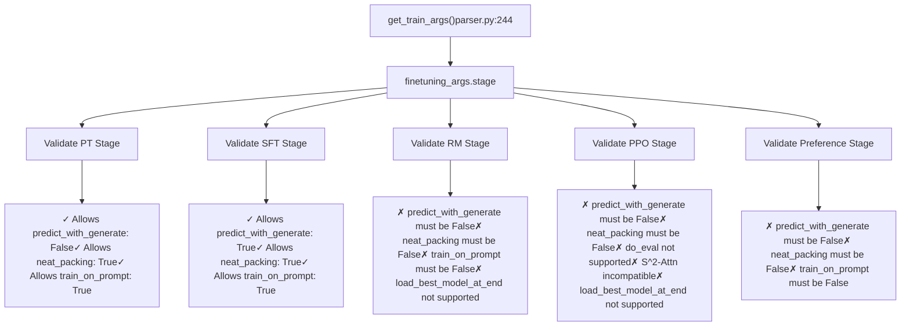
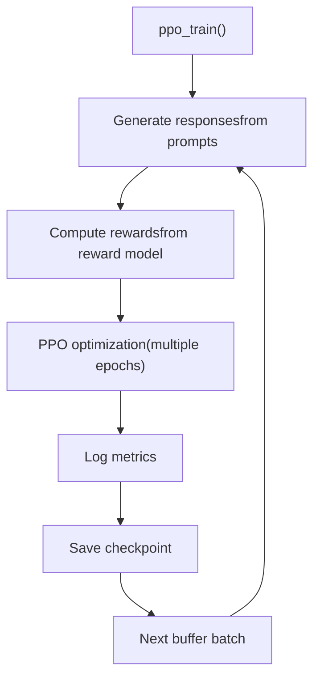
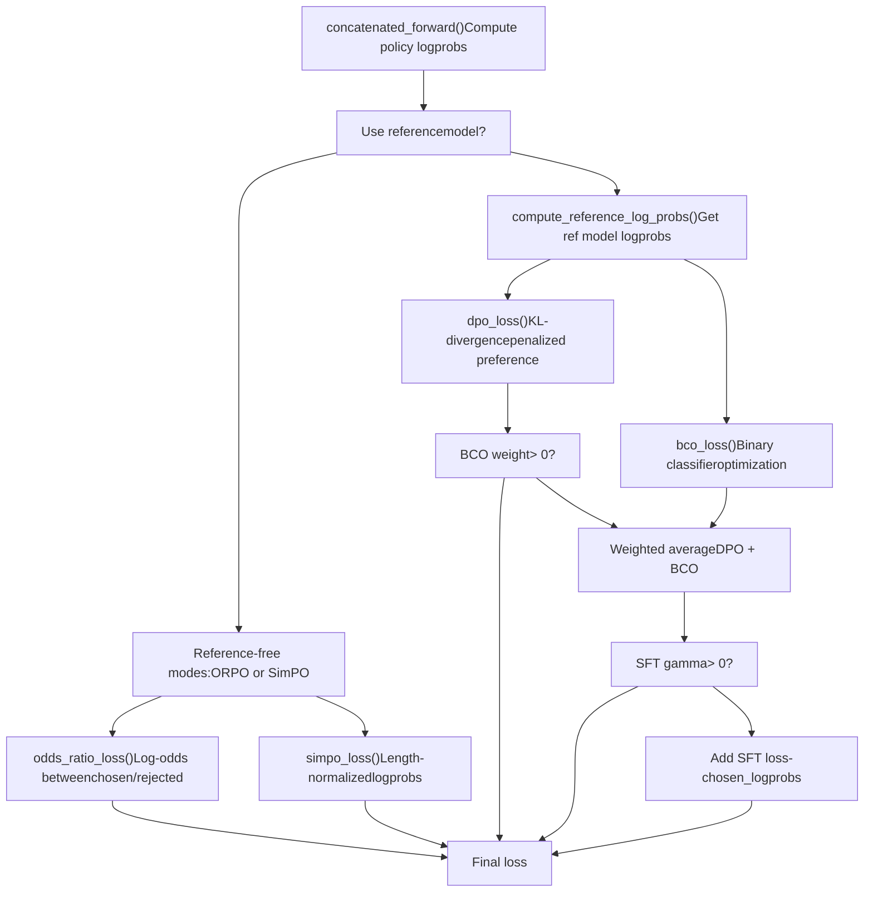
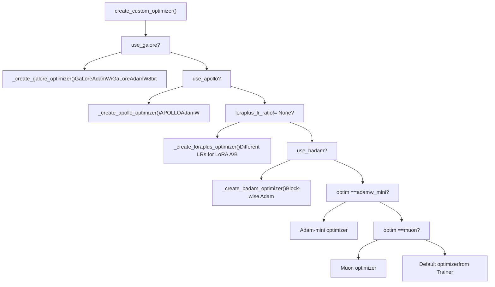
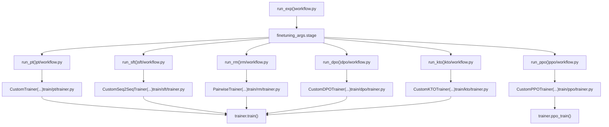

# 训练阶段与训练器

相关源文件

-   [README.md](https://github.com/hiyouga/LlamaFactory/blob/355d5c5e/README.md?plain=1)
-   [README\_zh.md](https://github.com/hiyouga/LlamaFactory/blob/355d5c5e/README_zh.md?plain=1)
-   [src/llamafactory/hparams/finetuning\_args.py](https://github.com/hiyouga/LlamaFactory/blob/355d5c5e/src/llamafactory/hparams/finetuning_args.py)
-   [src/llamafactory/hparams/parser.py](https://github.com/hiyouga/LlamaFactory/blob/355d5c5e/src/llamafactory/hparams/parser.py)
-   [src/llamafactory/train/dpo/trainer.py](https://github.com/hiyouga/LlamaFactory/blob/355d5c5e/src/llamafactory/train/dpo/trainer.py)
-   [src/llamafactory/train/kto/trainer.py](https://github.com/hiyouga/LlamaFactory/blob/355d5c5e/src/llamafactory/train/kto/trainer.py)
-   [src/llamafactory/train/ppo/trainer.py](https://github.com/hiyouga/LlamaFactory/blob/355d5c5e/src/llamafactory/train/ppo/trainer.py)
-   [src/llamafactory/train/pt/trainer.py](https://github.com/hiyouga/LlamaFactory/blob/355d5c5e/src/llamafactory/train/pt/trainer.py)
-   [src/llamafactory/train/rm/trainer.py](https://github.com/hiyouga/LlamaFactory/blob/355d5c5e/src/llamafactory/train/rm/trainer.py)
-   [src/llamafactory/train/sft/trainer.py](https://github.com/hiyouga/LlamaFactory/blob/355d5c5e/src/llamafactory/train/sft/trainer.py)
-   [src/llamafactory/train/trainer\_utils.py](https://github.com/hiyouga/LlamaFactory/blob/355d5c5e/src/llamafactory/train/trainer_utils.py)

本文档描述了 LlamaFactory 的训练阶段系统以及各阶段的自定义训练器实现。涵盖了如何选择训练阶段、各阶段的用途以及阶段特定训练器的技术实现。

有关配置训练参数的信息，请参阅 [参数类型与验证](/hiyouga/LlamaFactory/3.1-argument-types-and-validation)。有关 GaLore 和 BAdam 等自定义优化器的详细信息，请参阅 [自定义优化器](/hiyouga/LlamaFactory/6.2-custom-optimizers)。

---

## 训练阶段概览

LlamaFactory 支持八个不同的训练阶段，每个阶段都由专门的训练器类实现。通过 `FinetuningArguments` 中的 `stage` 参数选择阶段，该阶段决定了训练目标、损失函数和数据要求。

### 支持的阶段

| 阶段 | 训练器类 | 基类 | 用途 | 数据集要求 |
| --- | --- | --- | --- | --- |
| `pt` | `CustomTrainer` | `transformers.Trainer` | 预训练 / 持续预训练 | 无监督文本数据 |
| `sft` | `CustomSeq2SeqTrainer` | `transformers.Seq2SeqTrainer` | 监督微调 | 指令-响应对 |
| `rm` | `PairwiseTrainer` | `transformers.Trainer` | 奖励模型训练 | 偏好对 (chosen/rejected) |
| `ppo` | `CustomPPOTrainer` | `trl.PPOTrainer` | 近端策略优化 | 查询提示词 + 奖励模型 |
| `dpo` | `CustomDPOTrainer` | `trl.DPOTrainer` | 直接偏好优化 | 偏好对 |
| `kto` | `CustomKTOTrainer` | `trl.KTOTrainer` | Kahneman-Tversky 优化 | 二元反馈 (desirable/undesirable) |
| `orpo` | `CustomDPOTrainer` | `trl.DPOTrainer` | 胜率比偏好优化 | 偏好对 |
| `simpo` | `CustomDPOTrainer` | `trl.DPOTrainer` | 简单偏好优化 | 偏好对 |

**资料来源：** [src/llamafactory/hparams/finetuning\_args.py453-498](https://github.com/hiyouga/LlamaFactory/blob/355d5c5e/src/llamafactory/hparams/finetuning_args.py#L453-L498) [README.md349-361](https://github.com/hiyouga/LlamaFactory/blob/355d5c5e/README.md?plain=1#L349-L361) [src/llamafactory/train/pt/trainer.py34-95](https://github.com/hiyouga/LlamaFactory/blob/355d5c5e/src/llamafactory/train/pt/trainer.py#L34-L95) [src/llamafactory/train/sft/trainer.py47-179](https://github.com/hiyouga/LlamaFactory/blob/355d5c5e/src/llamafactory/train/sft/trainer.py#L47-L179) [src/llamafactory/train/rm/trainer.py43-130](https://github.com/hiyouga/LlamaFactory/blob/355d5c5e/src/llamafactory/train/rm/trainer.py#L43-L130) [src/llamafactory/train/ppo/trainer.py64-199](https://github.com/hiyouga/LlamaFactory/blob/355d5c5e/src/llamafactory/train/ppo/trainer.py#L64-L199) [src/llamafactory/train/dpo/trainer.py44-301](https://github.com/hiyouga/LlamaFactory/blob/355d5c5e/src/llamafactory/train/dpo/trainer.py#L44-L301) [src/llamafactory/train/kto/trainer.py43-302](https://github.com/hiyouga/LlamaFactory/blob/355d5c5e/src/llamafactory/train/kto/trainer.py#L43-L302)

---

## 阶段选择与验证

训练阶段在 `FinetuningArguments.stage` 中指定，并在参数解析期间进行验证。解析器强制执行阶段与其他配置选项之间的兼容性规则。

### 阶段特定验证规则


**关键验证逻辑：**

-   **非 SFT 阶段**不能使用 `predict_with_generate`、`neat_packing` 或 `train_on_prompt` ([parser.py256-264](https://github.com/hiyouga/LlamaFactory/blob/355d5c5e/parser.py#L256-L264))
-   **RM 和 PPO** 阶段不支持 `load_best_model_at_end` ([parser.py269-270](https://github.com/hiyouga/LlamaFactory/blob/355d5c5e/parser.py#L269-L270))
-   **PPO 阶段**要求 `do_train=True` 且不支持评估 ([parser.py273-274](https://github.com/hiyouga/LlamaFactory/blob/355d5c5e/parser.py#L273-L274))
-   **SFT 阶段**配合 `do_predict=True` 必须启用 `predict_with_generate` ([parser.py266-267](https://github.com/hiyouga/LlamaFactory/blob/355d5c5e/parser.py#L266-L267))

**资料来源：** [src/llamafactory/hparams/parser.py256-287](https://github.com/hiyouga/LlamaFactory/blob/355d5c5e/src/llamafactory/hparams/parser.py#L256-L287)

---

## 训练器架构

所有自定义训练器都继承自 HuggingFace Transformers 基础类，并重写关键方法以注入 LlamaFactory 特定的行为。

### 训练器类层次结构

```mermaid
flowchart TD
    BaseTrainer["transformers.Trainer"]
    Seq2SeqTrainer["transformers.Seq2SeqTrainer"]
    PPOTrainer["trl.PPOTrainer"]
    DPOTrainer["trl.DPOTrainer"]
    KTOTrainer["trl.KTOTrainer"]
    CustomTrainer["CustomTrainertrain/pt/trainer.py"]
    CustomSeq2SeqTrainer["CustomSeq2SeqTrainertrain/sft/trainer.py"]
    PairwiseTrainer["PairwiseTrainertrain/rm/trainer.py"]
    CustomPPOTrainer["CustomPPOTrainertrain/ppo/trainer.py"]
    CustomDPOTrainer["CustomDPOTrainertrain/dpo/trainer.py"]
    CustomKTOTrainer["CustomKTOTrainertrain/kto/trainer.py"]

    BaseTrainer --> CustomTrainer
    Seq2SeqTrainer --> CustomSeq2SeqTrainer
    BaseTrainer --> PairwiseTrainer
    PPOTrainer --> CustomPPOTrainer
    BaseTrainer --> CustomPPOTrainer
    DPOTrainer --> CustomDPOTrainer
    BaseTrainer --> CustomDPOTrainer
    KTOTrainer --> CustomKTOTrainer
    BaseTrainer --> CustomKTOTrainer
```


### 常见重写方法

所有自定义训练器都会重写 `Trainer` 基础类中的这些方法：

| 方法 | 用途 | 实现在 |
| --- | --- | --- |
| `create_optimizer()` | 创建自定义优化器 (GaLore, BAdam, LoRA+ 等) | 所有训练器 |
| `create_scheduler()` | 创建自定义学习率调度器 | 所有训练器 |
| `_get_train_sampler()` | 通过 `disable_shuffling` 标志可选地禁用打乱 | 所有训练器 |
| `compute_loss()` | 阶段特定损失计算 | RM, SFT, PT 训练器 |

**资料来源：** [src/llamafactory/train/pt/trainer.py72-94](https://github.com/hiyouga/LlamaFactory/blob/355d5c5e/src/llamafactory/train/pt/trainer.py#L72-L94) [src/llamafactory/train/sft/trainer.py94-116](https://github.com/hiyouga/LlamaFactory/blob/355d5c5e/src/llamafactory/train/sft/trainer.py#L94-L116) [src/llamafactory/train/rm/trainer.py67-110](https://github.com/hiyouga/LlamaFactory/blob/355d5c5e/src/llamafactory/train/rm/trainer.py#L67-L110) [src/llamafactory/train/ppo/trainer.py64-199](https://github.com/hiyouga/LlamaFactory/blob/355d5c5e/src/llamafactory/train/ppo/trainer.py#L64-L199) [src/llamafactory/train/dpo/trainer.py118-141](https://github.com/hiyouga/LlamaFactory/blob/355d5c5e/src/llamafactory/train/dpo/trainer.py#L118-L141) [src/llamafactory/train/kto/trainer.py115-139](https://github.com/hiyouga/LlamaFactory/blob/355d5c5e/src/llamafactory/train/kto/trainer.py#L115-L139)

---

## 阶段特定训练器实现

### 预训练 (PT): CustomTrainer

**文件：** [src/llamafactory/train/pt/trainer.py](https://github.com/hiyouga/LlamaFactory/blob/355d5c5e/src/llamafactory/train/pt/trainer.py)

**用途：** 使用因果语言建模在无标签文本数据上进行持续预训练。

**关键特性：**

-   继承自 `transformers.Trainer`
-   最简单的训练器实现（基础训练循环）
-   通过 `configure_fp8_environment()` 支持 FP8 训练 ([trainer.py45-50](https://github.com/hiyouga/LlamaFactory/blob/355d5c5e/trainer.py#L45-L50))
-   除非显式禁用，否则默认启用打包 (packing) ([parser.py460](https://github.com/hiyouga/LlamaFactory/blob/355d5c5e/parser.py#L460-L460))

**构造函数参数：**

```
CustomTrainer(    finetuning_args: FinetuningArguments,    processor: Optional[ProcessorMixin],  # For multimodal models    model_args: Optional[ModelArguments],    **kwargs  # Standard Trainer kwargs (model, args, train_dataset, etc.))
```
**资料来源：** [src/llamafactory/train/pt/trainer.py34-95](https://github.com/hiyouga/LlamaFactory/blob/355d5c5e/src/llamafactory/train/pt/trainer.py#L34-L95)

---

### 监督微调 (SFT): CustomSeq2SeqTrainer

**文件：** [src/llamafactory/train/sft/trainer.py](https://github.com/hiyouga/LlamaFactory/blob/355d5c5e/src/llamafactory/train/sft/trainer.py)

**用途：** 在指令-响应对上微调模型，支持生成评估指标。

**关键特性：**

-   继承自 `transformers.Seq2SeqTrainer`
-   支持 `predict_with_generate` 以计算 BLEU/ROUGE 指标 ([trainer.py119-143](https://github.com/hiyouga/LlamaFactory/blob/355d5c5e/trainer.py#L119-L143))
-   将生成预测保存到 `generated_predictions.jsonl` ([trainer.py145-178](https://github.com/hiyouga/LlamaFactory/blob/355d5c5e/trainer.py#L145-L178))
-   在预测期间从生成 token 中移除提示词 ([trainer.py140](https://github.com/hiyouga/LlamaFactory/blob/355d5c5e/trainer.py#L140-L140))
-   通过 `use_dft_loss` 可选地使用 DFT (Data Filtering Training) 损失 ([trainer.py86-89](https://github.com/hiyouga/LlamaFactory/blob/355d5c5e/trainer.py#L86-L89))

**预测保存：**

```
def save_predictions(self, dataset, predict_results, skip_special_tokens=True):    # Saves JSONL with format: {"prompt": ..., "predict": ..., "label": ...}    output_file = os.path.join(self.args.output_dir, "generated_predictions.jsonl")
```
**资料来源：** [src/llamafactory/train/sft/trainer.py47-179](https://github.com/hiyouga/LlamaFactory/blob/355d5c5e/src/llamafactory/train/sft/trainer.py#L47-L179)

---

### 奖励建模 (RM): PairwiseTrainer

**文件：** [src/llamafactory/train/rm/trainer.py](https://github.com/hiyouga/LlamaFactory/blob/355d5c5e/src/llamafactory/train/rm/trainer.py)

**用途：** 通过从 chosen/rejected 对中学习偏好排名来训练奖励模型。

**关键特性：**

-   继承自 `transformers.Trainer`
-   需要带有价值头 (value head) 的模型（例如 `AutoModelForCausalLMWithValueHead`）
-   使用 `FixValueHeadModelCallback` 处理价值头状态 ([trainer.py56](https://github.com/hiyouga/LlamaFactory/blob/355d5c5e/trainer.py#L56-L56))
-   使用 chosen 与 rejected 分数计算成对排名损失

**损失计算：**

```
def compute_loss(self, model, inputs, return_outputs=False):    # Split batch into chosen (first n) and rejected (last n)    batch_size = inputs["input_ids"].size(0) // 2    chosen_masks, rejected_masks = torch.split(inputs["attention_mask"], batch_size, dim=0)        # Get reward scores at last token position    chosen_scores = chosen_rewards.gather(dim=-1, index=(chosen_masks.sum(dim=-1, keepdim=True) - 1))    rejected_scores = rejected_rewards.gather(dim=-1, index=(rejected_masks.sum(dim=-1, keepdim=True) - 1))        # Pairwise ranking loss    loss = -torch.nn.functional.logsigmoid(chosen_scores - rejected_scores).mean()
```
**输出格式：** 将预测保存到 `generated_predictions.jsonl`，格式如下：

```
{"chosen": 0.85, "rejected": -0.42}
```
**资料来源：** [src/llamafactory/train/rm/trainer.py43-130](https://github.com/hiyouga/LlamaFactory/blob/355d5c5e/src/llamafactory/train/rm/trainer.py#L43-L130)

---

### PPO 训练: CustomPPOTrainer

**文件：** [src/llamafactory/train/ppo/trainer.py](https://github.com/hiyouga/LlamaFactory/blob/355d5c5e/src/llamafactory/train/ppo/trainer.py)

**用途：** 使用近端策略优化 (Proximal Policy Optimization) 进行基于人类反馈的强化学习。

**关键特性：**

-   同时继承自 `trl.PPOTrainer` 和 `transformers.Trainer` ([trainer.py64](https://github.com/hiyouga/LlamaFactory/blob/355d5c5e/trainer.py#L64-L64))
-   需要单独的奖励模型（完整模型、LoRA 适配器或 API） ([trainer.py149-157](https://github.com/hiyouga/LlamaFactory/blob/355d5c5e/trainer.py#L149-L157))
-   实现自定义训练循环 `ppo_train()` 而非使用标准的 `train()` ([trainer.py200-372](https://github.com/hiyouga/LlamaFactory/blob/355d5c5e/trainer.py#L200-L372))
-   支持三种奖励模型类型：`full`, `lora`, `api` ([trainer.py179-188](https://github.com/hiyouga/LlamaFactory/blob/355d5c5e/trainer.py#L179-L188))

**PPO 特定配置：**

```
ppo_config = PPOConfig(    batch_size=backward_batch_size * finetuning_args.ppo_buffer_size,  # Experience buffer    ppo_epochs=finetuning_args.ppo_epochs,  # Optimization epochs per batch    target=finetuning_args.ppo_target,  # Target KL divergence    use_score_norm=finetuning_args.ppo_score_norm,    whiten_rewards=finetuning_args.ppo_whiten_rewards,)
```
**训练循环结构：**


**奖励模型集成：**

-   **完整模型：** 独立的 `AutoModelForCausalLMWithValueHead` 实例 ([trainer.py180-188](https://github.com/hiyouga/LlamaFactory/blob/355d5c5e/trainer.py#L180-L188))
-   **LoRA 适配器：** 在策略模型上加载名为 `"reward"` 的适配器 ([trainer.py158-172](https://github.com/hiyouga/LlamaFactory/blob/355d5c5e/trainer.py#L158-L172))
-   **API 服务器：** 用于奖励计算的 HTTP 端点 ([trainer.py154-156](https://github.com/hiyouga/LlamaFactory/blob/355d5c5e/trainer.py#L154-L156))

**资料来源：** [src/llamafactory/train/ppo/trainer.py64-372](https://github.com/hiyouga/LlamaFactory/blob/355d5c5e/src/llamafactory/train/ppo/trainer.py#L64-L372)

---

### 偏好学习: DPO, ORPO, SimPO

**文件：** [src/llamafactory/train/dpo/trainer.py](https://github.com/hiyouga/LlamaFactory/blob/355d5c5e/src/llamafactory/train/dpo/trainer.py)

**训练器类：** `CustomDPOTrainer`

**用途：** 使用多种偏好损失函数从偏好数据中学习，无需显式的奖励模型。

**支持的损失类型：**

-   **DPO** (`sigmoid`): 带 KL 惩罚的直接偏好优化
-   **IPO** (`ipo`): 恒等偏好优化 (Identity Preference Optimization)
-   **ORPO** (`orpo`): 胜率比偏好优化 (Odds Ratio Preference Optimization) (无参考模型)
-   **SimPO** (`simpo`): 简单偏好优化 (Simple Preference Optimization) (无参考模型)
-   **Hinge Loss** (`hinge`): 基于铰链的偏好损失

**关键特性：**

-   继承自 `trl.DPOTrainer` 但重写了大部分逻辑
-   可选参考模型用于 KL 散度 ([trainer.py94-102](https://github.com/hiyouga/LlamaFactory/blob/355d5c5e/trainer.py#L94-L102))
-   ORPO 和 SimPO 采用无参考模型模式 ([trainer.py188-194](https://github.com/hiyouga/LlamaFactory/blob/355d5c5e/trainer.py#L188-L194))
-   可选二元分类器优化 (BCO) 加权 ([trainer.py203-208](https://github.com/hiyouga/LlamaFactory/blob/355d5c5e/trainer.py#L203-L208))
-   可选监督微调 (SFT) 损失混合 ([trainer.py294-295](https://github.com/hiyouga/LlamaFactory/blob/355d5c5e/trainer.py#L294-L295))

**损失计算流程：**


**ORPO 损失实现：**

```
def odds_ratio_loss(self, chosen_logps, rejected_logps):    log_odds = (chosen_logps - rejected_logps) - (        torch.log1p(-torch.exp(chosen_logps)) - torch.log1p(-torch.exp(rejected_logps))    )    sft_loss = -chosen_logps    odds_ratio_loss = -F.logsigmoid(log_odds)    return sft_loss + self.beta * odds_ratio_loss
```
**SimPO 损失实现：**

```
def simpo_loss(self, chosen_logps, rejected_logps):    pi_logratios = chosen_logps - rejected_logps    gamma_logratios = self.simpo_gamma / self.beta    logits = pi_logratios - gamma_logratios    return -F.logsigmoid(self.beta * logits)
```
**配置参数：**

-   `pref_beta`: 温度参数 (默认: 0.1)
-   `pref_loss`: 损失类型选择
-   `pref_ftx`: SFT 损失混合系数
-   `pref_bco_weight`: BCO 加权系数
-   `dpo_label_smoothing`: 鲁棒 DPO 平滑
-   `simpo_gamma`: SimPO 奖励边际 (margin)
-   `ld_alpha`: LD-DPO verbose token 加权

**资料来源：** [src/llamafactory/train/dpo/trainer.py44-301](https://github.com/hiyouga/LlamaFactory/blob/355d5c5e/src/llamafactory/train/dpo/trainer.py#L44-L301) [src/llamafactory/hparams/finetuning\_args.py168-260](https://github.com/hiyouga/LlamaFactory/blob/355d5c5e/src/llamafactory/hparams/finetuning_args.py#L168-L260)

---

### Kahneman-Tversky 优化 (KTO): CustomKTOTrainer

**文件：** [src/llamafactory/train/kto/trainer.py](https://github.com/hiyouga/LlamaFactory/blob/355d5c5e/src/llamafactory/train/kto/trainer.py)

**用途：** 从二元反馈 (desirable/undesirable) 中学习，无需配对比较。

**与 DPO 的主要区别：**

-   接受带二元标签的非配对示例 (`kto_tags`: True/False)
-   为 desirable 与 undesirable 示例使用不同的损失计算
-   包含当前策略与参考策略之间的 KL 散度项

**损失计算：**

```
def kto_loss(    self,     policy_chosen_logps,     policy_rejected_logps,    policy_kl_logps,    reference_chosen_logps,     reference_rejected_logps,    reference_kl_logps):    # KL divergence: E[log(π(x|y)) - log(π_ref(x|y))]    kl = (policy_kl_logps - reference_kl_logps).mean()        # Chosen loss: -log(σ(β * (log π - log π_ref - KL)))    chosen_logratios = policy_chosen_logps - reference_chosen_logps    chosen_losses = -F.logsigmoid(self.beta * (chosen_logratios - kl))        # Rejected loss: -log(σ(β * (log π_ref - log π - KL)))    rejected_logratios = policy_rejected_logps - reference_rejected_logps    rejected_losses = -F.logsigmoid(self.beta * (rejected_logratios - kl))        # Weight by desirable/undesirable coefficients    return self.desirable_weight * chosen_losses + self.undesirable_weight * rejected_losses
```
**数据格式：** 与需要成对数据的 DPO 不同，KTO 接受带标签的单个示例：

-   `kto_tags`: 指示 desirable (True) 或 undesirable (False) 的布尔张量
-   输入批次可以混合包含 desirable/undesirable 示例

**配置参数：**

-   `pref_beta`: 温度参数
-   `kto_chosen_weight`: desirable 示例的权重 (默认: 1.0)
-   `kto_rejected_weight`: undesirable 示例的权重 (默认: 1.0)
-   `pref_ftx`: 可选的 SFT 损失混合

**资料来源：** [src/llamafactory/train/kto/trainer.py43-302](https://github.com/hiyouga/LlamaFactory/blob/355d5c5e/src/llamafactory/train/kto/trainer.py#L43-L302) [src/llamafactory/hparams/finetuning\_args.py191-198](https://github.com/hiyouga/LlamaFactory/blob/355d5c5e/src/llamafactory/hparams/finetuning_args.py#L191-L198)

---

## 通用训练器特性

所有自定义训练器通过继承和通用工具共享这些核心能力。

### 自定义优化器创建

**函数：** `create_custom_optimizer()`，位于 [src/llamafactory/train/trainer\_utils.py198-408](https://github.com/hiyouga/LlamaFactory/blob/355d5c5e/src/llamafactory/train/trainer_utils.py#L198-L408)

**支持的优化器：**

| 优化器 | 条件 | 实现 |
| --- | --- | --- |
| **GaLore** | `finetuning_args.use_galore == True` | `_create_galore_optimizer()` |
| **APOLLO** | `finetuning_args.use_apollo == True` | `_create_apollo_optimizer()` |
| **LoRA+** | `finetuning_args.loraplus_lr_ratio is not None` | `_create_loraplus_optimizer()` |
| **BAdam** | `finetuning_args.use_badam == True` | `_create_badam_optimizer()` |
| **Adam-mini** | `training_args.optim == "adamw_mini"` | 使用 `adam_mini` 包 |
| **Muon** | `training_args.optim == "muon"` | 使用 `muon` 包 |
| **默认** | 以上皆不满足 | `Trainer.get_optimizer_cls_and_kwargs()` |

**优化器选择流程：**


**GaLore 优化器：**

-   对目标模块应用低秩梯度投影 ([trainer\_utils.py198-283](https://github.com/hiyouga/LlamaFactory/blob/355d5c5e/trainer_utils.py#L198-L283))
-   通过 `galore_layerwise` 支持逐层优化 ([trainer\_utils.py246-270](https://github.com/hiyouga/LlamaFactory/blob/355d5c5e/trainer_utils.py#L246-L270))
-   逐层模式使用 `DummyOptimizer` 包装器 ([trainer\_utils.py66-83](https://github.com/hiyouga/LlamaFactory/blob/355d5c5e/trainer_utils.py#L66-L83))

**LoRA+ 优化器：**

-   为 LoRA A 和 B 矩阵设置不同的学习率 ([trainer\_utils.py370-407](https://github.com/hiyouga/LlamaFactory/blob/355d5c5e/trainer_utils.py#L370-L407))
-   公式：`lr_B = lr_A * loraplus_lr_ratio`
-   通过 `loraplus_lr_embedding` 为嵌入层设置单独的学习率

**资料来源：** [src/llamafactory/train/trainer\_utils.py198-408](https://github.com/hiyouga/LlamaFactory/blob/355d5c5e/src/llamafactory/train/trainer_utils.py#L198-L408)

---

### 自定义调度器创建

**函数：** `create_custom_scheduler()`，位于 [src/llamafactory/train/trainer\_utils.py410-441](https://github.com/hiyouga/LlamaFactory/blob/355d5c5e/src/llamafactory/train/trainer_utils.py#L410-L441)

**用途：** 如果启用了 BAdam，则包装 BAdam 调度器，否则使用标准的 Transformers 调度器。

```
def create_custom_scheduler(args, num_training_steps, optimizer):    if args.use_badam:        from badam import BAdamScheduler, BlockOptimizerRatio        # Wrap scheduler for BAdam block switching        return BAdamScheduler(            optimizer=optimizer,            ...            base_scheduler=get_scheduler(...)        )    else:        # Standard scheduler creation delegated to Trainer        pass
```
**资料来源：** [src/llamafactory/train/trainer\_utils.py410-441](https://github.com/hiyouga/LlamaFactory/blob/355d5c5e/src/llamafactory/train/trainer_utils.py#L410-L441)

---

### 回调系统

所有训练器都支持这些回调：

| 回调 | 用途 | 添加时机 |
| --- | --- | --- |
| `SaveProcessorCallback` | 随检查点保存多模态处理器 | 当 `processor is not None` 时 |
| `FixValueHeadModelCallback` | 修正 RM/PPO 的价值头状态字典 (state dict) | RM 和 PPO 训练器 |
| `BAdamCallback` | 处理 BAdam 块切换 | 当 `use_badam == True` 时 |

**SaveProcessorCallback 实现：**

```
class SaveProcessorCallback(TrainerCallback):    def on_save(self, args, state, control, **kwargs):        # Save processor to checkpoint directory        processor.save_pretrained(            os.path.join(args.output_dir, f"checkpoint-{state.global_step}")        )
```
**资料来源：** [src/llamafactory/train/callbacks.py](https://github.com/hiyouga/LlamaFactory/blob/355d5c5e/src/llamafactory/train/callbacks.py) [src/llamafactory/train/sft/trainer.py77-78](https://github.com/hiyouga/LlamaFactory/blob/355d5c5e/src/llamafactory/train/sft/trainer.py#L77-L78) [src/llamafactory/train/rm/trainer.py56-59](https://github.com/hiyouga/LlamaFactory/blob/355d5c5e/src/llamafactory/train/rm/trainer.py#L56-L59)

---

### 训练采样器配置

所有训练器都支持通过 `finetuning_args.disable_shuffling` 禁用数据集打乱：

```
def _get_train_sampler(self, *args, **kwargs):    if self.finetuning_args.disable_shuffling:        return torch.utils.data.SequentialSampler(self.train_dataset)    return super()._get_train_sampler(*args, **kwargs)
```
这在以下情况下很有用：

-   课程学习 (Curriculum learning)
-   调试（可重现的批次顺序）
-   从确切的数据位置恢复训练

**资料来源：** [src/llamafactory/train/pt/trainer.py86-90](https://github.com/hiyouga/LlamaFactory/blob/355d5c5e/src/llamafactory/train/pt/trainer.py#L86-L90) [src/llamafactory/train/sft/trainer.py107-112](https://github.com/hiyouga/LlamaFactory/blob/355d5c5e/src/llamafactory/train/sft/trainer.py#L107-L112) [src/llamafactory/train/rm/trainer.py80-85](https://github.com/hiyouga/LlamaFactory/blob/355d5c5e/src/llamafactory/train/rm/trainer.py#L80-L85) [src/llamafactory/train/dpo/trainer.py132-136](https://github.com/hiyouga/LlamaFactory/blob/355d5c5e/src/llamafactory/train/dpo/trainer.py#L132-L136) [src/llamafactory/train/kto/trainer.py128-134](https://github.com/hiyouga/LlamaFactory/blob/355d5c5e/src/llamafactory/train/kto/trainer.py#L128-L134)

---

## 训练器实例化流程

工作流 (workflow) 模块根据 `stage` 参数决定实例化哪个训练器。

### 实例化决策树


### 示例：SFT 工作流实例化

**文件：** [src/llamafactory/train/sft/workflow.py](https://github.com/hiyouga/LlamaFactory/blob/355d5c5e/src/llamafactory/train/sft/workflow.py)

```
def run_sft(    model_args: ModelArguments,    data_args: DataArguments,    training_args: Seq2SeqTrainingArguments,    finetuning_args: FinetuningArguments,    generating_args: GeneratingArguments,    callbacks: Optional[list[TrainerCallback]] = None,):    # 1. Load tokenizer and dataset    tokenizer_module = load_tokenizer(model_args)    dataset_module = get_dataset(model_args, data_args, training_args, stage="sft", **tokenizer_module)        # 2. Load model    model = load_model(tokenizer_module["tokenizer"], model_args, finetuning_args, training_args.do_train)        # 3. Initialize data collator    data_collator = SFTDataCollatorWith4DAttentionMask(...)        # 4. Create trainer    trainer = CustomSeq2SeqTrainer(        model=model,        args=training_args,        finetuning_args=finetuning_args,        data_collator=data_collator,        callbacks=callbacks,        **dataset_module,        **tokenizer_module,    )        # 5. Train    if training_args.do_train:        train_result = trainer.train(resume_from_checkpoint=training_args.resume_from_checkpoint)        trainer.save_model()        trainer.log_metrics("train", train_result.metrics)        trainer.save_metrics("train", train_result.metrics)        trainer.save_state()
```
**资料来源：** [src/llamafactory/train/sft/workflow.py](https://github.com/hiyouga/LlamaFactory/blob/355d5c5e/src/llamafactory/train/sft/workflow.py) [src/llamafactory/train/pt/workflow.py](https://github.com/hiyouga/LlamaFactory/blob/355d5c5e/src/llamafactory/train/pt/workflow.py) [src/llamafactory/train/rm/workflow.py](https://github.com/hiyouga/LlamaFactory/blob/355d5c5e/src/llamafactory/train/rm/workflow.py) [src/llamafactory/train/ppo/workflow.py](https://github.com/hiyouga/LlamaFactory/blob/355d5c5e/src/llamafactory/train/ppo/workflow.py) [src/llamafactory/train/dpo/workflow.py](https://github.com/hiyouga/LlamaFactory/blob/355d5c5e/src/llamafactory/train/dpo/workflow.py) [src/llamafactory/train/kto/workflow.py](https://github.com/hiyouga/LlamaFactory/blob/355d5c5e/src/llamafactory/train/kto/workflow.py)

---

## 阶段兼容性矩阵

此表总结了各训练阶段的功能兼容性：

| 功能 | PT | SFT | RM | PPO | DPO | KTO | ORPO | SimPO |
| --- | --- | --- | --- | --- | --- | --- | --- | --- |
| 序列打包 (Sequence packing) | ✓ | ✓ | ✗ | ✗ | ✗ | ✗ | ✗ | ✗ |
| 整洁打包 (Neat packing) | ✓ | ✓ | ✗ | ✗ | ✗ | ✗ | ✗ | ✗ |
| `predict_with_generate` | ✗ | ✓ | ✗ | ✗ | ✗ | ✗ | ✗ | ✗ |
| `train_on_prompt` | ✓ | ✓ | ✗ | ✗ | ✗ | ✗ | ✗ | ✗ |
| `mask_history` | ✓ | ✓ | ✗ | ✗ | ✗ | ✗ | ✗ | ✗ |
| 参考模型 | ✗ | ✗ | ✗ | ✗ | ✓ | ✓ | ✗ | ✗ |
| 奖励模型 | ✗ | ✗ | ✗ | ✓ | ✗ | ✗ | ✗ | ✗ |
| 评估 | ✓ | ✓ | ✓ | ✗ | ✓ | ✓ | ✓ | ✓ |
| `load_best_model_at_end` | ✓ | ✓ | ✗ | ✗ | ✓ | ✓ | ✓ | ✓ |
| 量化 | ✓ | ✓ | ✓ | ✓ | ✓ | ✓ | ✓ | ✓ |
| DeepSpeed ZeRO-3 | ✓ | ✓ | ✓ | ✓ | ✓ | ✓ | ✓ | ✓ |
| GaLore 优化器 | ✓ | ✓ | ✓ | ✓ | ✓ | ✓ | ✓ | ✓ |
| BAdam 优化器 | ✓ | ✓ | ✓ | ✓ | ✓ | ✓ | ✓ | ✓ |

**资料来源：** [src/llamafactory/hparams/parser.py256-287](https://github.com/hiyouga/LlamaFactory/blob/355d5c5e/src/llamafactory/hparams/parser.py#L256-L287) [README.md349-361](https://github.com/hiyouga/LlamaFactory/blob/355d5c5e/README.md?plain=1#L349-L361)
