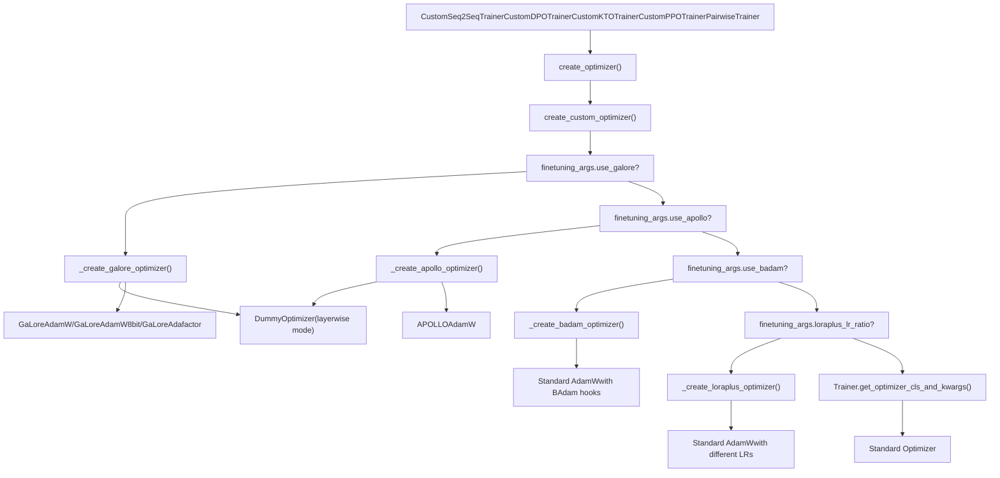
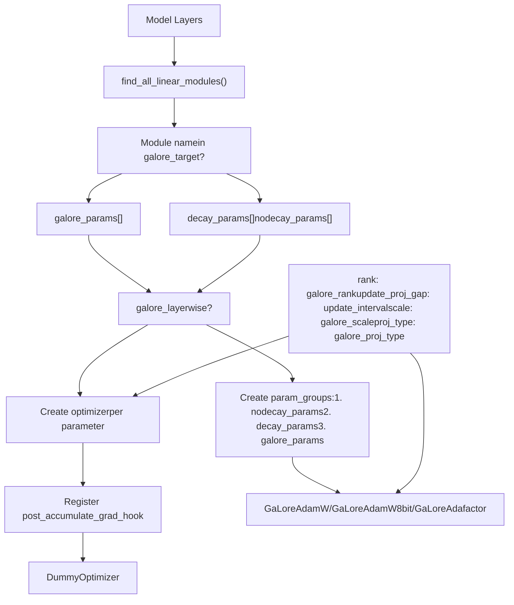
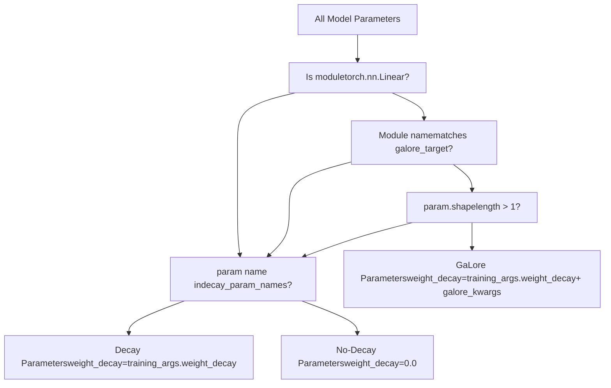
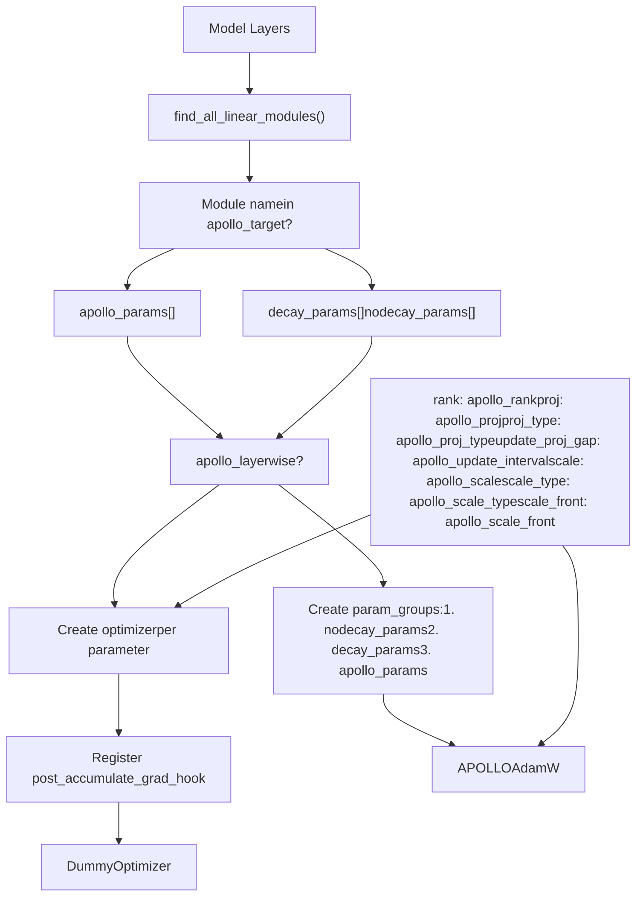
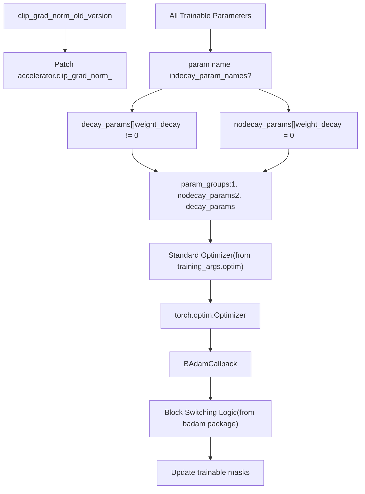
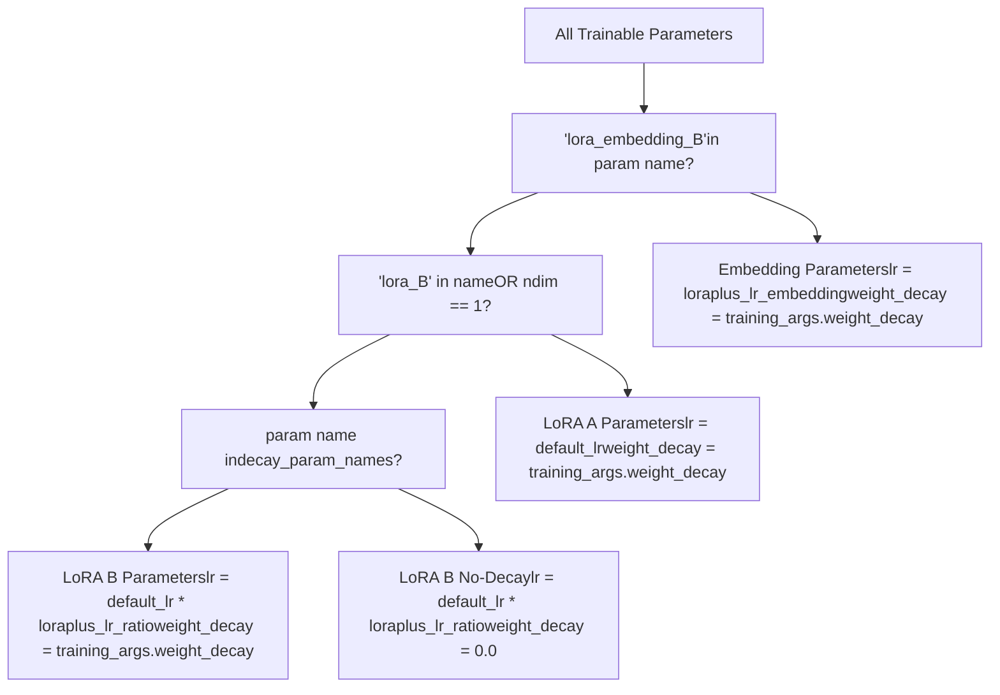
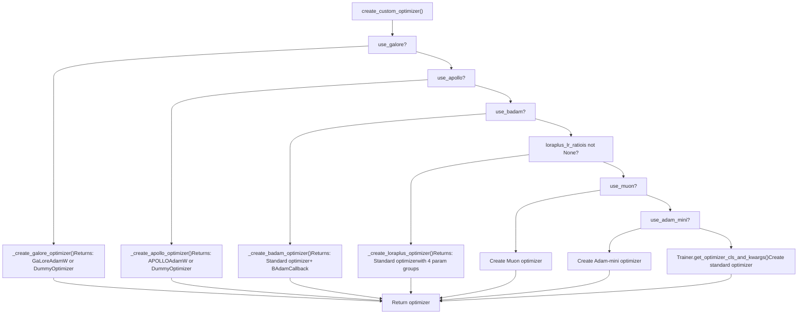

# 自定义优化器

相关源文件

-   [README.md](https://github.com/hiyouga/LlamaFactory/blob/355d5c5e/README.md?plain=1)
-   [README\_zh.md](https://github.com/hiyouga/LlamaFactory/blob/355d5c5e/README_zh.md?plain=1)
-   [src/llamafactory/hparams/finetuning\_args.py](https://github.com/hiyouga/LlamaFactory/blob/355d5c5e/src/llamafactory/hparams/finetuning_args.py)
-   [src/llamafactory/hparams/parser.py](https://github.com/hiyouga/LlamaFactory/blob/355d5c5e/src/llamafactory/hparams/parser.py)
-   [src/llamafactory/train/dpo/trainer.py](https://github.com/hiyouga/LlamaFactory/blob/355d5c5e/src/llamafactory/train/dpo/trainer.py)
-   [src/llamafactory/train/kto/trainer.py](https://github.com/hiyouga/LlamaFactory/blob/355d5c5e/src/llamafactory/train/kto/trainer.py)
-   [src/llamafactory/train/ppo/trainer.py](https://github.com/hiyouga/LlamaFactory/blob/355d5c5e/src/llamafactory/train/ppo/trainer.py)
-   [src/llamafactory/train/pt/trainer.py](https://github.com/hiyouga/LlamaFactory/blob/355d5c5e/src/llamafactory/train/pt/trainer.py)
-   [src/llamafactory/train/rm/trainer.py](https://github.com/hiyouga/LlamaFactory/blob/355d5c5e/src/llamafactory/train/rm/trainer.py)
-   [src/llamafactory/train/sft/trainer.py](https://github.com/hiyouga/LlamaFactory/blob/355d5c5e/src/llamafactory/train/sft/trainer.py)
-   [src/llamafactory/train/trainer\_utils.py](https://github.com/hiyouga/LlamaFactory/blob/355d5c5e/src/llamafactory/train/trainer_utils.py)

## 目的与范围

本页面介绍了 LlamaFactory 中的自定义优化器实现，这些实现旨在实现大语言模型的高显存效率训练。这些优化器通过梯度投影、分块更新和自适应学习率等技术减少训练期间的显存消耗。有关训练阶段和整体训练架构的信息，请参阅 [训练阶段与训练器](/hiyouga/LlamaFactory/6.1-training-stages-and-trainers)。有关训练参数的配置，请参阅 [参数类型与验证](/hiyouga/LlamaFactory/3.1-argument-types-and-validation)。

## 系统集成

自定义优化器在训练器初始化期间创建，并替换 Hugging Face Transformers 的标准优化器。系统支持六种先进的优化算法：GaLore、APOLLO、BAdam、LoRA+、Adam-mini 和 Muon。


**资料来源：** [src/llamafactory/train/trainer\_utils.py444-518](https://github.com/hiyouga/LlamaFactory/blob/355d5c5e/src/llamafactory/train/trainer_utils.py#L444-L518) [src/llamafactory/train/sft/trainer.py95-98](https://github.com/hiyouga/LlamaFactory/blob/355d5c5e/src/llamafactory/train/sft/trainer.py#L95-L98) [src/llamafactory/train/dpo/trainer.py119-122](https://github.com/hiyouga/LlamaFactory/blob/355d5c5e/src/llamafactory/train/dpo/trainer.py#L119-L122)

## 优化器概览

| 优化器 | 显存减少 | 关键技术 | 使用场景 |
| --- | --- | --- | --- |
| **GaLore** | ~60% | 低秩梯度投影 | 显存有限情况下的全参数训练 |
| **APOLLO** | ~50% | 自适应低秩优化器 | 高效率全参数训练 |
| **BAdam** | ~40% | 分块参数更新 | 低显存消耗的 LoRA 训练 |
| **LoRA+** | 无 | 差异化学习率 | 提升 LoRA 收敛性 |
| **Adam-mini** | ~40% | 减少优化器状态 | 显存高效训练 |
| **Muon** | 可变 | 基于动量的优化 | 特定训练场景 |

**资料来源：** [README.md98-99](https://github.com/hiyouga/LlamaFactory/blob/355d5c5e/README.md?plain=1#L98-L99) [src/llamafactory/hparams/finetuning\_args.py263-400](https://github.com/hiyouga/LlamaFactory/blob/355d5c5e/src/llamafactory/hparams/finetuning_args.py#L263-L400)

## GaLore (梯度低秩投影)

### 概览

GaLore 通过在应用优化器更新之前将梯度投影到低秩子空间来减少显存消耗。这使得全参数训练的显存占用可以与 LoRA 相当。

### 架构


**资料来源：** [src/llamafactory/train/trainer\_utils.py198-283](https://github.com/hiyouga/LlamaFactory/blob/355d5c5e/src/llamafactory/train/trainer_utils.py#L198-L283)

### 配置参数

`GaloreArguments` 数据类定义了相关配置：

-   **`use_galore`** (bool): 启用 GaLore 优化器。
-   **`galore_target`** (str): GaLore 投影的目标模块（逗号分隔或 `"all"`）。
-   **`galore_rank`** (int, 默认=16): 梯度投影的秩。
-   **`galore_update_interval`** (int, 默认=200): 投影矩阵更新之间的步数。
-   **`galore_scale`** (float, 默认=2.0): 投影梯度的缩放系数。
-   **`galore_proj_type`** (str, 默认="std"): 投影类型 (`std`, `reverse_std`, `right`, `left`, `full`)。
-   **`galore_layerwise`** (bool): 启用逐层更新（与梯度累积和分布式训练不兼容）。

**资料来源：** [src/llamafactory/hparams/finetuning\_args.py263-298](https://github.com/hiyouga/LlamaFactory/blob/355d5c5e/src/llamafactory/hparams/finetuning_args.py#L263-L298)

### 参数分组逻辑


**资料来源：** [src/llamafactory/train/trainer\_utils.py191-233](https://github.com/hiyouga/LlamaFactory/blob/355d5c5e/src/llamafactory/train/trainer_utils.py#L191-L233)

### 逐层模式

当 `galore_layerwise=True` 时，系统为每个参数创建一个单独的优化器实例，并使用梯度累积钩子：

> **[Mermaid sequence]**
> *(无法解析流程图结构，请参考英文原文)*

**资料来源：** [src/llamafactory/train/trainer\_utils.py246-270](https://github.com/hiyouga/LlamaFactory/blob/355d5c5e/src/llamafactory/train/trainer_utils.py#L246-L270)

### 约束与兼容性

解析器强制执行以下约束：

-   **分布式训练**：逐层 GaLore 与分布式训练不兼容 (`parallel_mode == DISTRIBUTED`)。
-   **DeepSpeed**：GaLore 与 DeepSpeed 不兼容。
-   **梯度累积**：逐层模式要求 `gradient_accumulation_steps == 1`。

**资料来源：** [src/llamafactory/hparams/parser.py326-339](https://github.com/hiyouga/LlamaFactory/blob/355d5c5e/src/llamafactory/hparams/parser.py#L326-L339)

## APOLLO 优化器

### 概览

APOLLO (Adaptive Projected Low-rank Optimization) 与 GaLore 类似，但使用自适应投影矩阵和不同的缩放策略。它在提供相当的显存节省的同时，提供了更稳定的训练。

### 架构


**资料来源：** [src/llamafactory/train/trainer\_utils.py286-367](https://github.com/hiyouga/LlamaFactory/blob/355d5c5e/src/llamafactory/train/trainer_utils.py#L286-L367)

### 配置参数

`ApolloArguments` 数据类定义了相关配置：

-   **`use_apollo`** (bool): 启用 APOLLO 优化器。
-   **`apollo_target`** (str): APOLLO 投影的目标模块（逗号分隔或 `"all"`）。
-   **`apollo_rank`** (int, 默认=16): 梯度投影的秩。
-   **`apollo_update_interval`** (int, 默认=200): 投影矩阵更新之间的步数。
-   **`apollo_scale`** (float, 默认=32.0): 投影梯度的缩放系数。
-   **`apollo_proj`** (str, 默认="random"): 投影算法 (`svd` 或 `random`)。
-   **`apollo_proj_type`** (str, 默认="std"): 投影类型 (`std`, `right`, `left`)。
-   **`apollo_scale_type`** (str, 默认="channel"): 缩放类型 (`channel` 或 `tensor`)。
-   **`apollo_scale_front`** (bool): 在缩放前使用范数增长限制器。
-   **`apollo_layerwise`** (bool): 启用逐层更新。

**资料来源：** [src/llamafactory/hparams/finetuning\_args.py302-349](https://github.com/hiyouga/LlamaFactory/blob/355d5c5e/src/llamafactory/hparams/finetuning_args.py#L302-L349)

### 与 GaLore 的主要区别

| 特性 | GaLore | APOLLO |
| --- | --- | --- |
| 投影算法 | 基于 SVD | SVD 或 随机 |
| 缩放 | 固定缩放因子 | 逐通道或逐张量 |
| 缩放位置 | 投影后 | 投影前或投影后 |
| 默认缩放 | 2.0 | 32.0 |
| 优化器基础 | AdamW, AdamW8bit, Adafactor | 仅 AdamW |

**资料来源：** [src/llamafactory/train/trainer\_utils.py198-367](https://github.com/hiyouga/LlamaFactory/blob/355d5c5e/src/llamafactory/train/trainer_utils.py#L198-L367)

## BAdam (分块自适应 Adam)

### 概览

BAdam 通过在每一步仅更新参数的一个子集来减少 LoRA 训练期间的显存消耗。它根据指定的策略在不同的参数块之间进行切换。

### 架构


**资料来源：** [src/llamafactory/train/trainer\_utils.py410-441](https://github.com/hiyouga/LlamaFactory/blob/355d5c5e/src/llamafactory/train/trainer_utils.py#L410-L441) [src/llamafactory/train/sft/trainer.py80-84](https://github.com/hiyouga/LlamaFactory/blob/355d5c5e/src/llamafactory/train/sft/trainer.py#L80-L84)

### 配置参数

`BAdamArgument` 数据类定义了相关配置：

-   **`use_badam`** (bool): 启用 BAdam 优化器。
-   **`badam_mode`** (str, 默认="layer"): 更新模式（`layer` 表示逐层，`ratio` 表示按比例）。
-   **`badam_start_block`** (int, 可选): 逐层模式下的起始块索引。
-   **`badam_switch_mode`** (str, 默认="ascending"): 块切换策略 (`ascending`, `descending`, `random`, `fixed`)。
-   **`badam_switch_interval`** (int, 默认=50): 块切换之间的步数（-1 表示禁用）。
-   **`badam_update_ratio`** (float, 默认=0.05): 按比例模式下更新参数的比例。
-   **`badam_mask_mode`** (str, 默认="adjacent"): 掩码模式 (`adjacent` 或 `scatter`)。
-   **`badam_verbose`** (int, 默认=0): 详细程度（0=静默，1=块前缀，2=参数）。

**资料来源：** [src/llamafactory/hparams/finetuning\_args.py353-400](https://github.com/hiyouga/LlamaFactory/blob/355d5c5e/src/llamafactory/hparams/finetuning_args.py#L353-L400)

### 集成模式

BAdam 使用基于回调的架构，而不是自定义优化器类。集成过程包括：

1.  创建带有参数组的标准优化器。
2.  用 `clip_grad_norm_old_version` 补丁处理 `accelerator.clip_grad_norm_`。
3.  注册处理块切换的 `BAdamCallback`。

```
# 来自训练器初始化if finetuning_args.use_badam:    from badam import BAdamCallback, clip_grad_norm_old_version        self.accelerator.clip_grad_norm_ = MethodType(clip_grad_norm_old_version, self.accelerator)    self.add_callback(BAdamCallback)
```
**资料来源：** [src/llamafactory/train/sft/trainer.py80-84](https://github.com/hiyouga/LlamaFactory/blob/355d5c5e/src/llamafactory/train/sft/trainer.py#L80-L84) [src/llamafactory/train/dpo/trainer.py107-111](https://github.com/hiyouga/LlamaFactory/blob/355d5c5e/src/llamafactory/train/dpo/trainer.py#L107-L111)

### 约束与兼容性

-   **分布式训练**：基于比例的 BAdam 与分布式训练不兼容；逐层 BAdam 要求 DeepSpeed ZeRO-3。
-   **微调类型**：仅适用于 LoRA 训练 (`finetuning_type == "lora"`)。

**资料来源：** [src/llamafactory/hparams/parser.py332-336](https://github.com/hiyouga/LlamaFactory/blob/355d5c5e/src/llamafactory/hparams/parser.py#L332-L336)

## LoRA+ 学习率策略

### 概览

LoRA+ 并不是一个单独的优化器，而是一种学习率分配策略，它为 LoRA A 矩阵和 B 矩阵使用不同的学习率。这可以提高收敛速度和最终性能。

### 参数分组逻辑


**资料来源：** [src/llamafactory/train/trainer\_utils.py370-407](https://github.com/hiyouga/LlamaFactory/blob/355d5c5e/src/llamafactory/train/trainer_utils.py#L370-L407)

### 配置参数

LoRA+ 参数在 `LoraArguments` 中定义：

-   **`loraplus_lr_ratio`** (float, 可选): 学习率比例 `lr_B / lr_A`（设置后即启用 LoRA+）。
-   **`loraplus_lr_embedding`** (float, 默认=1e-6): LoRA 嵌入层的学习率。

**资料来源：** [src/llamafactory/hparams/finetuning\_args.py91-97](https://github.com/hiyouga/LlamaFactory/blob/355d5c5e/src/llamafactory/hparams/finetuning_args.py#L91-L97)

### 学习率分配

| 参数类型 | 学习率 | 权重衰减 |
| --- | --- | --- |
| LoRA A 矩阵 | `training_args.learning_rate` | `training_args.weight_decay` |
| LoRA B 矩阵 (衰减) | `learning_rate * loraplus_lr_ratio` | `training_args.weight_decay` |
| LoRA B 矩阵 (无衰减) | `learning_rate * loraplus_lr_ratio` | `0.0` |
| LoRA 嵌入层 B | `loraplus_lr_embedding` | `training_args.weight_decay` |

**资料来源：** [src/llamafactory/train/trainer\_utils.py375-404](https://github.com/hiyouga/LlamaFactory/blob/355d5c5e/src/llamafactory/train/trainer_utils.py#L375-L404)

## Adam-mini 和 Muon

### 概览

Adam-mini 和 Muon 是 LlamaFactory 通过依赖检查支持的外部优化器实现。这些优化器并非实现在 LlamaFactory 代码库中，而是在安装相应包后进行集成。

### Adam-mini

Adam-mini 通过维护更少的优化器状态来减少显存消耗。它需要 `adam-mini` 包：

```
pip install adam-mini
```
当 `use_adam_mini=True` 时，系统会检查 Adam-mini 的可用性：

**资料来源：** [src/llamafactory/hparams/parser.py178-179](https://github.com/hiyouga/LlamaFactory/blob/355d5c5e/src/llamafactory/hparams/parser.py#L178-L179) [README.md194](https://github.com/hiyouga/LlamaFactory/blob/355d5c5e/README.md?plain=1#L194-L194)

### Muon

Muon 是一种基于动量的优化器。它需要相应的 Muon 包。

该优化器在 README 中被提及为支持的高级算法，但集成细节通过标准优化器选择机制处理。

**资料来源：** [README.md98](https://github.com/hiyouga/LlamaFactory/blob/355d5c5e/README.md?plain=1#L98-L98) [README.md152](https://github.com/hiyouga/LlamaFactory/blob/355d5c5e/README.md?plain=1#L152-L152)

## DummyOptimizer 类

### 目的

`DummyOptimizer` 类用于逐层优化模式（GaLore 和 APOLLO），在该模式下每个参数都有自己的优化器实例。哑优化器作为一个占位符，不执行任何操作。

```
class DummyOptimizer(torch.optim.Optimizer):    def __init__(self, lr: float = 1e-3, optimizer_dict: Optional[dict] = None):        dummy_tensor = torch.randn(1, 1)        self.optimizer_dict = optimizer_dict        super().__init__([dummy_tensor], {"lr": lr})        def zero_grad(self, set_to_none: bool = True) -> None:        pass        def step(self, closure: Optional[Callable] = None) -> Optional[float]:        pass
```
### 使用模式

在逐层模式下，实际的优化发生在梯度累积钩子中，训练器调用 `DummyOptimizer.step()`，这是一个空操作：

> **[Mermaid sequence]**
> *(无法解析流程图结构，请参考英文原文)*

**资料来源：** [src/llamafactory/train/trainer\_utils.py66-82](https://github.com/hiyouga/LlamaFactory/blob/355d5c5e/src/llamafactory/train/trainer_utils.py#L66-L82)

## 配置示例

### GaLore 配置

```
# 基础 GaLoreuse_galore: truegalore_target: allgalore_rank: 16galore_update_interval: 200galore_scale: 2.0optim: adamw_torch # 逐层 GaLore (无梯度累积)use_galore: truegalore_layerwise: truegradient_accumulation_steps: 1
```
### APOLLO 配置

```
# 基础 APOLLOuse_apollo: trueapollo_target: allapollo_rank: 16apollo_update_interval: 200apollo_scale: 32.0apollo_proj: randomapollo_scale_type: channeloptim: adamw_torch
```
### BAdam 配置

```
# DeepSpeed 环境下的逐层 BAdamuse_badam: truebadam_mode: layerbadam_switch_mode: ascendingbadam_switch_interval: 50finetuning_type: loradeepspeed: ds_z3_config.json # 按比例 BAdam (仅限单 GPU)use_badam: truebadam_mode: ratiobadam_update_ratio: 0.05badam_mask_mode: scatter
```
### LoRA+ 配置

```
# B 矩阵学习率提高 16 倍的 LoRA+finetuning_type: loraloraplus_lr_ratio: 16.0loraplus_lr_embedding: 1e-6learning_rate: 5e-4  # A 矩阵学习率
```
**资料来源：** [examples/README.md](https://github.com/hiyouga/LlamaFactory/blob/355d5c5e/examples/README.md?plain=1) [src/llamafactory/hparams/finetuning\_args.py263-400](https://github.com/hiyouga/LlamaFactory/blob/355d5c5e/src/llamafactory/hparams/finetuning_args.py#L263-L400)

## 优化器创建流程

完整的优化器创建流程及所有决策点：


**资料来源：** [src/llamafactory/train/trainer\_utils.py444-518](https://github.com/hiyouga/LlamaFactory/blob/355d5c5e/src/llamafactory/train/trainer_utils.py#L444-L518)

## 兼容性矩阵

| 优化器 | 量化 | DeepSpeed | FSDP | 分布式 | 梯度累积 |
| --- | --- | --- | --- | --- | --- |
| **GaLore** | ❌ | ❌ | ✅ | ✅ (非逐层) | ✅ (非逐层) |
| **APOLLO** | ❌ | ❌ | ✅ | ✅ (非逐层) | ✅ (非逐层) |
| **BAdam (逐层)** | ✅ | ✅ (ZeRO-3) | ✅ | ✅ (仅限 ZeRO-3) | ✅ |
| **BAdam (比例)** | ✅ | ❌ | ❌ | ❌ | ✅ |
| **LoRA+** | ✅ | ✅ | ✅ | ✅ | ✅ |
| **Adam-mini** | ✅ | ✅ | ✅ | ✅ | ✅ |
| **Muon** | ✅ | ✅ | ✅ | ✅ | ✅ |

**资料来源：** [src/llamafactory/hparams/parser.py326-342](https://github.com/hiyouga/LlamaFactory/blob/355d5c5e/src/llamafactory/hparams/parser.py#L326-L342)

## 实现说明

### 衰减参数检测

所有自定义优化器均使用 `_get_decay_parameter_names()` 来识别应具有权重衰减的参数：

```
def _get_decay_parameter_names(model: "PreTrainedModel") -> list[str]:    """Return names of parameters with weight decay (weights in non-layernorm layers)."""    decay_parameters = get_parameter_names(model, ALL_LAYERNORM_LAYERS)    decay_parameters = [name for name in decay_parameters if "bias" not in name]    return decay_parameters
```
这不包括：

-   LayerNorm 参数 (来自 `ALL_LAYERNORM_LAYERS`)。
-   偏置 (bias) 参数 (名称包含 "bias")。

**资料来源：** [src/llamafactory/train/trainer\_utils.py191-195](https://github.com/hiyouga/LlamaFactory/blob/355d5c5e/src/llamafactory/train/trainer_utils.py#L191-L195)

### 目标模块解析

GaLore 和 APOLLO 均支持 `target="all"` 以自动查找所有线性模块：

```
if len(finetuning_args.galore_target) == 1 and finetuning_args.galore_target[0] == "all":    galore_targets = find_all_linear_modules(model, finetuning_args.freeze_vision_tower)else:    galore_targets = finetuning_args.galore_target
```
`find_all_linear_modules()` 函数识别模型中所有的 `torch.nn.Linear` 层，并可选择排除视觉塔 (vision tower) 层。

**资料来源：** [src/llamafactory/train/trainer\_utils.py203-206](https://github.com/hiyouga/LlamaFactory/blob/355d5c5e/src/llamafactory/train/trainer_utils.py#L203-L206) [src/llamafactory/model/model\_utils/misc.py](https://github.com/hiyouga/LlamaFactory/blob/355d5c5e/src/llamafactory/model/model_utils/misc.py)

### 梯度累积钩子模式

逐层优化器使用 `register_post_accumulate_grad_hook` 模式：

```
def optimizer_hook(param: torch.nn.Parameter):    if param.grad is not None:        optimizer_dict[param].step()        optimizer_dict[param].zero_grad() for param in trainable_params:    param.register_post_accumulate_grad_hook(optimizer_hook)
```
该钩子在所有梯度累积步骤完成后触发，从而实现逐参数优化，而无需显式的循环协调。

**资料来源：** [src/llamafactory/train/trainer\_utils.py262-268](https://github.com/hiyouga/LlamaFactory/blob/355d5c5e/src/llamafactory/train/trainer_utils.py#L262-L268) [src/llamafactory/train/trainer\_utils.py349-355](https://github.com/hiyouga/LlamaFactory/blob/355d5c5e/src/llamafactory/train/trainer_utils.py#L349-L355)
